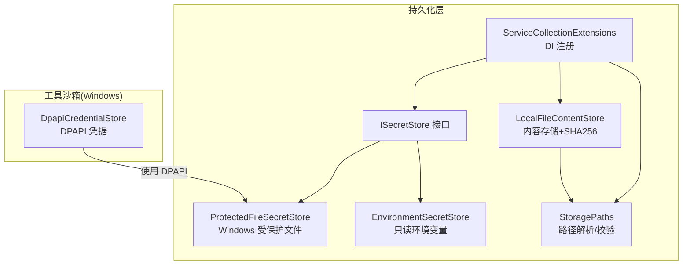
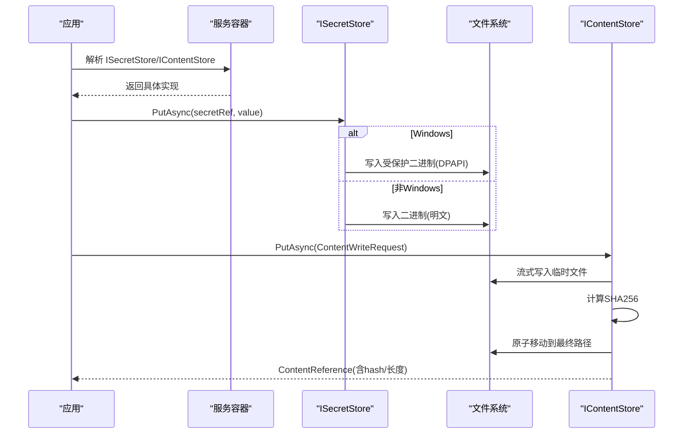
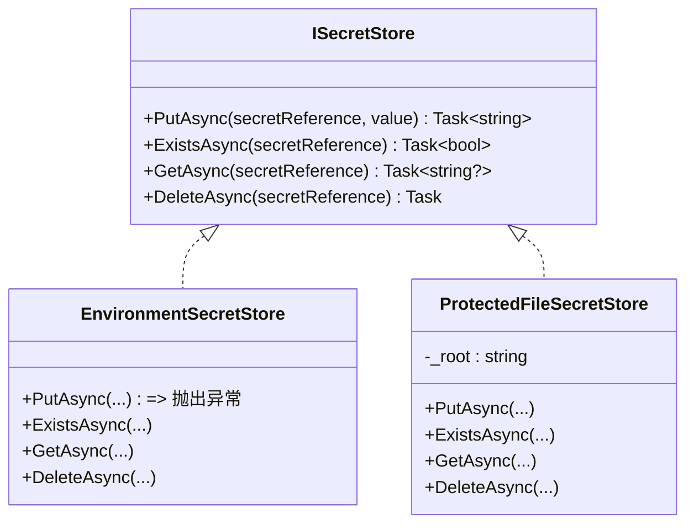
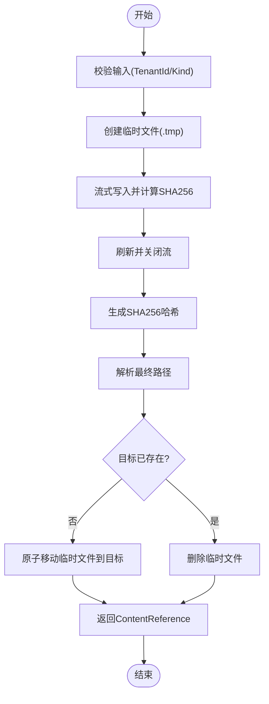
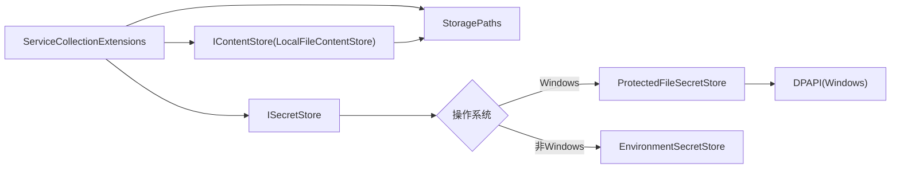

# 密钥与敏感信息管理

<cite>
**本文引用的文件**   
- [ISecretStore.cs](file://TinadecCore\Persistence\ISecretStore.cs)
- [LocalFileContentStore.cs](file://TinadecCore\Persistence\LocalFileContentStore.cs)
- [StoragePaths.cs](file://TinadecCore\Persistence\StoragePaths.cs)
- [ServiceCollectionExtensions.cs](file://TinadecCore\Persistence\ServiceCollectionExtensions.cs)
- [DpapiCredentialStore.cs](file://TinadecTools\Runtime\Sandbox\Windows\DpapiCredentialStore.cs)
- [SecretProtectorTests.cs](file://tests\TinadecCore.Tests\SecretProtectorTests.cs)
- [CredentialSafetyTests.cs](file://tests\TinadecCore.Tests\CredentialSafetyTests.cs)
- [security.md](file://docs\security.md)
</cite>

## 目录
1. [简介](#简介)
2. [项目结构](#项目结构)
3. [核心组件](#核心组件)
4. [架构总览](#架构总览)
5. [详细组件分析](#详细组件分析)
6. [依赖关系分析](#依赖关系分析)
7. [性能考量](#性能考量)
8. [故障排查指南](#故障排查指南)
9. [结论](#结论)
10. [附录](#附录)

## 简介
本文件面向 TinadecOffice 的密钥与敏感信息管理系统，聚焦以下目标：
- 解释 ISecretStore 接口设计与实现选择（环境注入、本地受保护文件）。
- 说明 LocalFileContentStore 的文件存储流程与完整性校验。
- 梳理敏感数据加密算法与平台能力（DPAPI）的使用边界。
- 给出密钥轮换、备份恢复、泄露应急的流程建议。
- 提供配置加密、环境变量保护、运行时密钥注入的最佳实践与安全审计方法。
- 覆盖多环境管理、合规性与数据安全标准建议。

## 项目结构
与密钥和敏感信息相关的代码主要分布在持久化层与工具沙箱中：
- 持久化抽象与实现：ISecretStore、ProtectedFileSecretStore、EnvironmentSecretStore、LocalFileContentStore、StoragePaths、服务注册扩展。
- Windows 沙箱凭据：DpapiCredentialStore（使用 DPAPI 保护沙箱账户凭据）。
- 测试用例：SecretProtectorTests、CredentialSafetyTests（验证不泄露明文、错误安全处理）。
- 安全文档：security.md（MVP 安全要点）。

图表来源 
- [ISecretStore.cs:1-65](file://TinadecCore\Persistence\ISecretStore.cs#L1-L65)
- [LocalFileContentStore.cs:1-68](file://TinadecCore\Persistence\LocalFileContentStore.cs#L1-L68)
- [StoragePaths.cs:1-64](file://TinadecCore\Persistence\StoragePaths.cs#L1-L64)
- [ServiceCollectionExtensions.cs:1-122](file://TinadecCore\Persistence\ServiceCollectionExtensions.cs#L1-L122)
- [DpapiCredentialStore.cs:1-90](file://TinadecTools\Runtime\Sandbox\Windows\DpapiCredentialStore.cs#L1-L90)

章节来源
- [ISecretStore.cs:1-65](file://TinadecCore\Persistence\ISecretStore.cs#L1-L65)
- [LocalFileContentStore.cs:1-68](file://TinadecCore\Persistence\LocalFileContentStore.cs#L1-L68)
- [StoragePaths.cs:1-64](file://TinadecCore\Persistence\StoragePaths.cs#L1-L64)
- [ServiceCollectionExtensions.cs:1-122](file://TinadecCore\Persistence\ServiceCollectionExtensions.cs#L1-L122)
- [DpapiCredentialStore.cs:1-90](file://TinadecTools\Runtime\Sandbox\Windows\DpapiCredentialStore.cs#L1-L90)

## 核心组件
- ISecretStore：定义统一的最小权限边界，禁止在关系型记录中存放明文或密文；提供 Put/Get/Exists/Delete 等基础操作。
- EnvironmentSecretStore：只读读取环境变量，用于开发/部署注入；不支持写入与删除。
- ProtectedFileSecretStore：将密钥以二进制形式落盘，并在 Windows 上通过 DPAPI 进行当前用户域保护；非 Windows 平台回退为明文落盘（需配合外部访问控制）。
- LocalFileContentStore：基于文件的不可变内容存储，写入时流式计算 SHA256 并原子移动临时文件到最终位置，确保一致性。
- StoragePaths：集中管理 Core 拥有的文件路径，包含严格的根目录校验与段名净化，防止路径穿越。
- ServiceCollectionExtensions：按运行平台自动装配 SecretStore 实现，并注册 IContentStore、StoragePaths 等。

章节来源
- [ISecretStore.cs:1-65](file://TinadecCore\Persistence\ISecretStore.cs#L1-L65)
- [LocalFileContentStore.cs:1-68](file://TinadecCore\Persistence\LocalFileContentStore.cs#L1-L68)
- [StoragePaths.cs:1-64](file://TinadecCore\Persistence\StoragePaths.cs#L1-L64)
- [ServiceCollectionExtensions.cs:1-122](file://TinadecCore\Persistence\ServiceCollectionExtensions.cs#L1-L122)

## 架构总览
下图展示密钥与内容存储的整体交互：应用通过 DI 获取 ISecretStore 与 IContentStore，SecretStore 根据平台自动选择实现；内容写入走 LocalFileContentStore 的流式哈希与原子落盘。

图表来源 
- [ServiceCollectionExtensions.cs:40-48](file://TinadecCore\Persistence\ServiceCollectionExtensions.cs#L40-L48)
- [ISecretStore.cs:27-64](file://TinadecCore\Persistence\ISecretStore.cs#L27-L64)
- [LocalFileContentStore.cs:11-49](file://TinadecCore\Persistence\LocalFileContentStore.cs#L11-L49)

## 详细组件分析

### ISecretStore 接口设计
- 设计原则
  - 最小权限：仅暴露必要的读写与存在性检查。
  - 无明文/密文落库：关系型表不直接持有密钥值，避免数据库泄露风险。
  - 平台适配：Windows 优先使用 DPAPI 保护；其他平台可回退为环境变量或受限文件。
- 关键方法
  - PutAsync：写入密钥值（Windows 下受保护，非 Windows 可能明文）。
  - GetAsync：读取密钥值（Windows 解密后返回）。
  - ExistsAsync：判断是否存在。
  - DeleteAsync：删除密钥条目。
- 实现类
  - EnvironmentSecretStore：只读，从环境变量取值，适合 CI/CD 注入。
  - ProtectedFileSecretStore：文件落盘 + DPAPI（Windows），非 Windows 明文落盘（需配合系统级权限控制）。

图表来源 
- [ISecretStore.cs:1-65](file://TinadecCore\Persistence\ISecretStore.cs#L1-L65)

章节来源
- [ISecretStore.cs:1-65](file://TinadecCore\Persistence\ISecretStore.cs#L1-L65)

### LocalFileContentStore 文件存储实现
- 写入流程
  - 参数校验：租户 ID、内容类型必须有效。
  - 临时文件：在 content/tenants/{tenantId}/{workspace}/kind/.tmp/{uuid} 下创建。
  - 流式写入：边读边写，同时计算 SHA256 摘要。
  - 原子落盘：若目标不存在则移动临时文件到最终路径；否则删除临时文件。
  - 返回值：ContentReference（包含引用、hash、长度、媒体类型）。
- 读取与存在性
  - OpenReadAsync：以只读流打开最终文件。
  - ExistsAsync：基于路径存在性判断。
  - DeleteAsync：删除对应文件。
- 安全性
  - 路径净化与根目录校验，防止路径穿越。
  - 文件共享模式限制，降低并发竞争。

图表来源 
- [LocalFileContentStore.cs:11-49](file://TinadecCore\Persistence\LocalFileContentStore.cs#L11-L49)
- [StoragePaths.cs:28-41](file://TinadecCore\Persistence\StoragePaths.cs#L28-L41)

章节来源
- [LocalFileContentStore.cs:1-68](file://TinadecCore\Persistence\LocalFileContentStore.cs#L1-L68)
- [StoragePaths.cs:1-64](file://TinadecCore\Persistence\StoragePaths.cs#L1-L64)

### 敏感数据加密与平台能力
- Windows 平台
  - 使用 DPAPI（ProtectedData）对密钥进行当前用户域保护，避免明文落盘。
  - 沙箱凭据同样通过 DPAPI 保存至本地应用数据目录。
- 非 Windows 平台
  - 当前实现回退为明文落盘，应结合操作系统级权限控制（如文件 ACL、只读挂载）保障安全。
- 日志与响应安全
  - 测试覆盖表明错误信息与事件序列化不包含原始密钥，避免侧信道泄露。

章节来源
- [ISecretStore.cs:27-64](file://TinadecCore\Persistence\ISecretStore.cs#L27-L64)
- [DpapiCredentialStore.cs:14-53](file://TinadecTools\Runtime\Sandbox\Windows\DpapiCredentialStore.cs#L14-L53)
- [CredentialSafetyTests.cs:14-60](file://tests\TinadecCore.Tests\CredentialSafetyTests.cs#L14-L60)
- [security.md:1-18](file://docs\security.md#L1-L18)

### 密钥轮换机制（建议）
- 版本前缀策略
  - 在 secretReference 中加入版本号（如 v2::key-name），旧版本保留一段时间以便灰度切换。
- 双写与迁移
  - 新密钥写入新版本路径；读取时优先新版本，失败回退旧版本。
- 清理策略
  - 监控所有消费者完成迁移后，定时清理旧版本密钥文件。
- 自动化
  - 通过 CI/CD 触发轮换任务，记录审计日志并告警失败。

[本节为通用实践建议，不直接分析具体文件]

### 配置文件加密与环境变量保护
- 配置文件
  - 不在仓库中提交明文配置；使用受保护的密钥存储或外部密钥管理服务（KMS/Vault）注入。
- 环境变量
  - 使用 EnvironmentSecretStore 读取敏感项，避免硬编码。
  - 在 CI/CD 中通过安全管道注入，不落盘到构建产物。
- 运行时注入
  - 启动阶段由服务容器装配 ISecretStore，按需读取密钥，避免全局缓存明文。

章节来源
- [ServiceCollectionExtensions.cs:44-46](file://TinadecCore\Persistence\ServiceCollectionExtensions.cs#L44-L46)
- [ISecretStore.cs:13-25](file://TinadecCore\Persistence\ISecretStore.cs#L13-L25)

### 多环境密钥管理
- 开发环境
  - 建议使用环境变量或本地受保护文件（Windows DPAPI）。
- 测试环境
  - 使用隔离的密钥集与只读注入，避免污染生产数据。
- 生产环境
  - 推荐企业级 KMS/HSM；若仍用文件存储，需严格 ACL 与审计。

[本节为通用实践建议，不直接分析具体文件]

### 密钥备份与恢复
- 备份
  - Windows：导出 DPAPI 保护的数据需要当前用户上下文；跨机器迁移需携带用户凭据或使用企业 DPAPI 策略。
  - 非 Windows：明文文件需配合系统级备份与加密传输。
- 恢复
  - 恢复后验证 ExistsAsync/GetAsync 可用性；必要时执行健康检查。
- 审计
  - 记录备份/恢复操作的时间、主体、范围与结果。

[本节为通用实践建议，不直接分析具体文件]

### 密钥泄露应急响应
- 立即处置
  - 撤销/轮换受影响密钥；清理相关会话与缓存。
- 影响评估
  - 检索最近访问日志，定位潜在滥用。
- 加固措施
  - 收紧文件权限、启用更严格的网络策略、增加审计与告警。
- 复盘改进
  - 更新应急预案与演练计划。

[本节为通用实践建议，不直接分析具体文件]

## 依赖关系分析
- 服务装配
  - ServiceCollectionExtensions 根据运行平台选择 ISecretStore 实现，并注册 IContentStore、StoragePaths。
- 路径与存储
  - StoragePaths 负责路径解析与安全检查；LocalFileContentStore 依赖其生成唯一引用与落盘路径。
- 平台能力
  - ProtectedFileSecretStore 与 DpapiCredentialStore 均依赖 DPAPI（Windows）。

图表来源 
- [ServiceCollectionExtensions.cs:40-48](file://TinadecCore\Persistence\ServiceCollectionExtensions.cs#L40-L48)
- [ISecretStore.cs:27-64](file://TinadecCore\Persistence\ISecretStore.cs#L27-L64)
- [LocalFileContentStore.cs:1-68](file://TinadecCore\Persistence\LocalFileContentStore.cs#L1-L68)
- [StoragePaths.cs:1-64](file://TinadecCore\Persistence\StoragePaths.cs#L1-L64)

章节来源
- [ServiceCollectionExtensions.cs:1-122](file://TinadecCore\Persistence\ServiceCollectionExtensions.cs#L1-L122)
- [ISecretStore.cs:1-65](file://TinadecCore\Persistence\ISecretStore.cs#L1-L65)
- [LocalFileContentStore.cs:1-68](file://TinadecCore\Persistence\LocalFileContentStore.cs#L1-L68)
- [StoragePaths.cs:1-64](file://TinadecCore\Persistence\StoragePaths.cs#L1-L64)

## 性能考量
- 流式写入与增量哈希
  - LocalFileContentStore 使用固定缓冲大小流式写入，避免大文件内存占用；增量哈希减少额外 IO。
- 原子落盘
  - 先写临时文件再原子移动，提升一致性与容错性。
- 异步 IO
  - 大量使用异步 API，提高吞吐与响应性。
- 平台差异
  - Windows DPAPI 加解密开销较小；非 Windows 明文落盘应避免频繁读写敏感数据。

章节来源
- [LocalFileContentStore.cs:21-49](file://TinadecCore\Persistence\LocalFileContentStore.cs#L21-L49)

## 故障排查指南
- 常见问题
  - DataRoot 未配置：StoragePaths 构造时会抛出异常，检查配置项。
  - 路径穿越防护：非法路径会被拒绝，确认引用格式正确。
  - Windows DPAPI 失败：检查当前用户上下文与权限。
- 调试建议
  - 使用 ExistsAsync/GetAsync 快速验证密钥是否可用。
  - 查看错误消息是否包含明文密钥（测试已覆盖不应包含）。
- 参考测试
  - SecretProtectorTests：验证加解密往返。
  - CredentialSafetyTests：验证错误与事件不泄露原始密钥。

章节来源
- [StoragePaths.cs:6-17](file://TinadecCore\Persistence\StoragePaths.cs#L6-L17)
- [StoragePaths.cs:34-41](file://TinadecCore\Persistence\StoragePaths.cs#L34-L41)
- [SecretProtectorTests.cs:1-19](file://tests\TinadecCore.Tests\SecretProtectorTests.cs#L1-L19)
- [CredentialSafetyTests.cs:14-60](file://tests\TinadecCore.Tests\CredentialSafetyTests.cs#L14-L60)

## 结论
- ISecretStore 提供了统一的密钥存取边界，结合平台能力实现最小化泄露面。
- LocalFileContentStore 通过流式写入与原子落盘保证内容一致性与完整性。
- Windows 环境下 DPAPI 提供便捷的本地保护；非 Windows 需依赖系统级权限与外部 KMS。
- 建议引入密钥版本化轮换、严格的环境隔离、完善的审计与应急演练，以满足合规要求。

[本节为总结性内容，不直接分析具体文件]

## 附录
- 最佳实践清单
  - 不在代码与日志中输出明文密钥。
  - 使用环境变量注入敏感配置，CI/CD 安全管道管理。
  - 生产环境优先使用企业 KMS/HSM。
  - 定期轮换密钥并清理旧版本。
  - 对文件存储实施严格的 ACL 与审计。
- 合规与安全标准建议
  - 遵循最小权限原则与数据最小化。
  - 建立访问审计与异常告警机制。
  - 制定并演练泄露应急响应预案。
  - 满足数据留存与销毁策略。

[本节为通用实践建议，不直接分析具体文件]