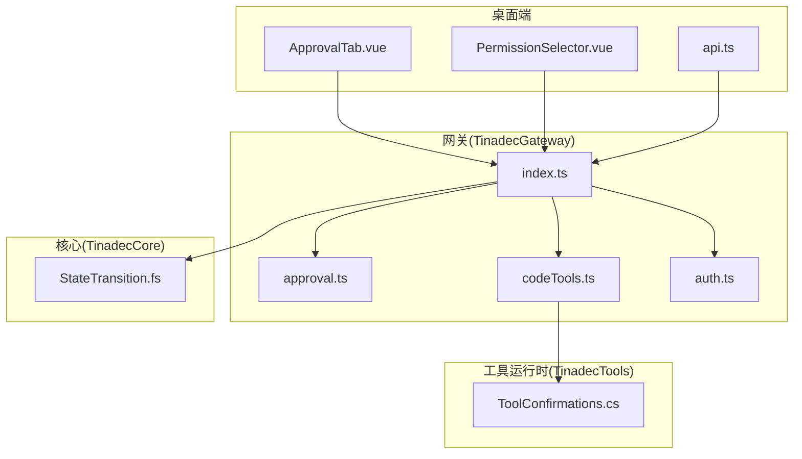
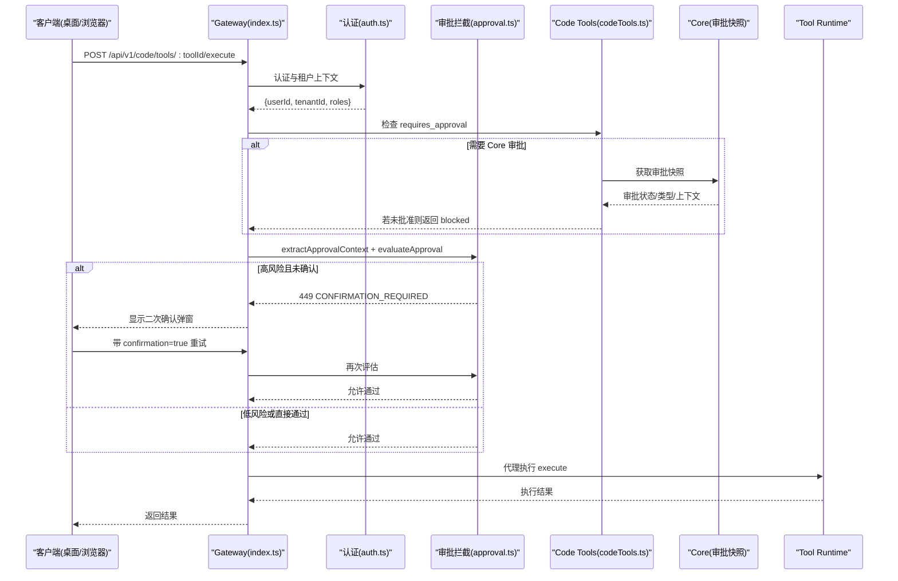
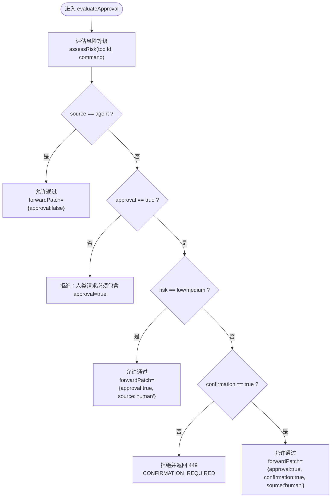
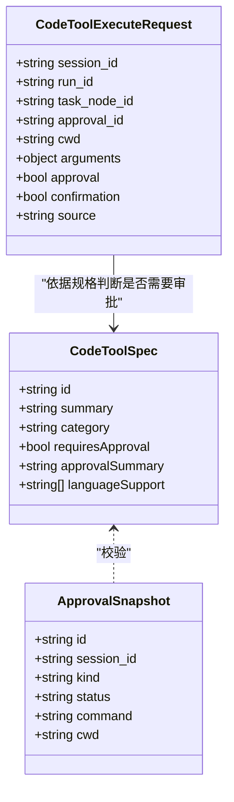
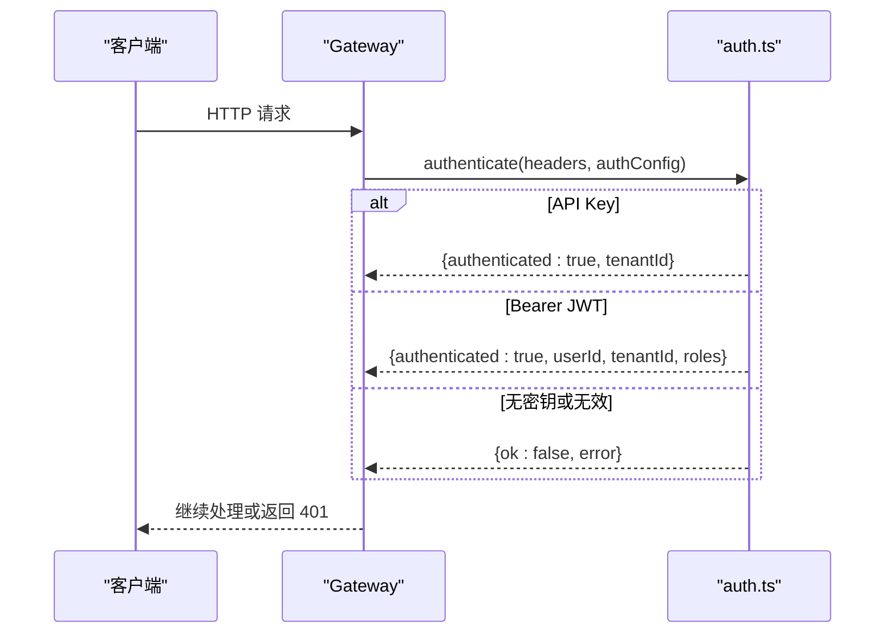
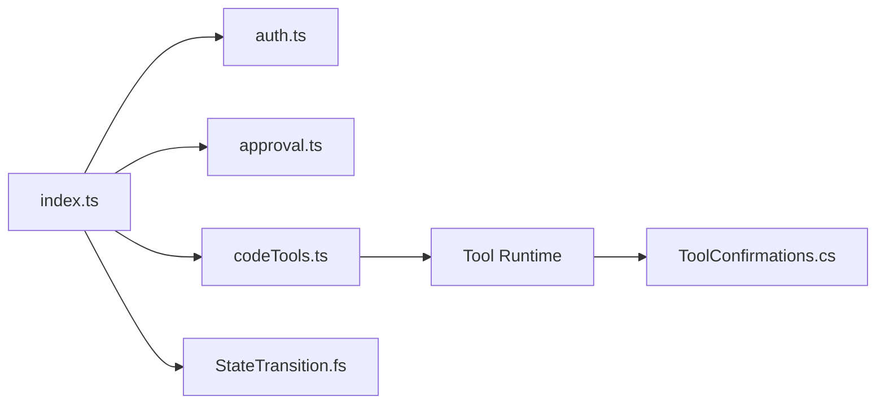
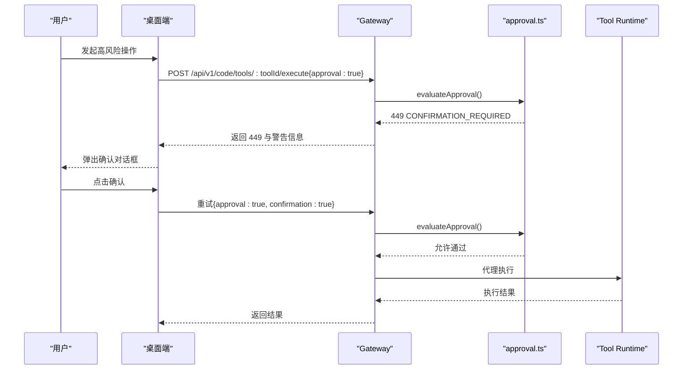

# 授权与审批系统

<cite>
**本文引用的文件**   
- [TinadecGateway/src/index.ts](file://TinadecGateway/src/index.ts)
- [TinadecGateway/src/approval.ts](file://TinadecGateway/src/approval.ts)
- [TinadecGateway/src/auth.ts](file://TinadecGateway/src/auth.ts)
- [TinadecGateway/src/codeTools.ts](file://TinadecGateway/src/codeTools.ts)
- [apps/desktop/src/components/ApprovalTab.vue](file://apps/desktop/src/components/ApprovalTab.vue)
- [apps/desktop/src/api.ts](file://apps/desktop/src/api.ts)
- [apps/desktop/src/components/PermissionSelector.vue](file://apps/desktop/src/components/PermissionSelector.vue)
- [TinadecTools/Tools/ToolConfirmations.cs](file://TinadecTools/Tools/ToolConfirmations.cs)
- [tests/TinadecTools.Tests/ToolConfirmationsTests.cs](file://tests/TinadecTools.Tests/ToolConfirmationsTests.cs)
- [TinadecCore/Strategies/StateTransition.fs](file://TinadecCore/Strategies/StateTransition.fs)
</cite>

## 目录
1. [简介](#简介)
2. [项目结构](#项目结构)
3. [核心组件](#核心组件)
4. [架构总览](#架构总览)
5. [详细组件分析](#详细组件分析)
6. [依赖关系分析](#依赖关系分析)
7. [性能考虑](#性能考虑)
8. [故障排查指南](#故障排查指南)
9. [结论](#结论)
10. [附录](#附录)

## 简介
本文件系统性阐述 TinadecOffice 的授权与审批体系，重点覆盖：
- 审批门控机制的设计原理与实现细节（Gateway 层拦截、Tool Runtime 执行校验）
- ToolConfirmations 工具确认流程（C# 侧强制字段校验）
- 审批状态管理与状态机约束（F# 策略）
- 权限检查逻辑（认证、租户、角色、公开路径）
- 审批工作流（人类二次确认、Agent 走 Core 审批门）
- 用户确认界面（桌面端 ApprovalTab）
- 异步审批处理（SSE 事件流、API 代理）
- 资源访问控制与操作权限模型（代码工具规格、风险等级、批准类型）
- 审批规则定义、自定义审批逻辑集成与审计追踪
- 审批撤销、批量审批与超时处理的扩展建议

## 项目结构
与授权与审批相关的代码主要分布在以下模块：
- Gateway（BFF/API 网关）：鉴权、审批拦截、Code Tools 规格发布与执行代理、SSE/WebSocket 转发
- Desktop UI（Electron/Vue）：审批面板、权限选择器、API 类型定义
- Tools（C#）：工具运行时中的确认强校验
- Core（F#）：状态转换策略（用于审批/任务等状态机）

图表来源
- [TinadecGateway/src/index.ts](file://TinadecGateway/src/index.ts)
- [TinadecGateway/src/approval.ts](file://TinadecGateway/src/approval.ts)
- [TinadecGateway/src/codeTools.ts](file://TinadecGateway/src/codeTools.ts)
- [TinadecGateway/src/auth.ts](file://TinadecGateway/src/auth.ts)
- [apps/desktop/src/components/ApprovalTab.vue](file://apps/desktop/src/components/ApprovalTab.vue)
- [apps/desktop/src/components/PermissionSelector.vue](file://apps/desktop/src/components/PermissionSelector.vue)
- [apps/desktop/src/api.ts](file://apps/desktop/src/api.ts)
- [TinadecTools/Tools/ToolConfirmations.cs](file://TinadecTools/Tools/ToolConfirmations.cs)
- [TinadecCore/Strategies/StateTransition.fs](file://TinadecCore/Strategies/StateTransition.fs)

章节来源
- [TinadecGateway/src/index.ts](file://TinadecGateway/src/index.ts)
- [TinadecGateway/src/approval.ts](file://TinadecGateway/src/approval.ts)
- [TinadecGateway/src/codeTools.ts](file://TinadecGateway/src/codeTools.ts)
- [TinadecGateway/src/auth.ts](file://TinadecGateway/src/auth.ts)
- [apps/desktop/src/components/ApprovalTab.vue](file://apps/desktop/src/components/ApprovalTab.vue)
- [apps/desktop/src/components/PermissionSelector.vue](file://apps/desktop/src/components/PermissionSelector.vue)
- [apps/desktop/src/api.ts](file://apps/desktop/src/api.ts)
- [TinadecTools/Tools/ToolConfirmations.cs](file://TinadecTools/Tools/ToolConfirmations.cs)
- [TinadecCore/Strategies/StateTransition.fs](file://TinadecCore/Strategies/StateTransition.fs)

## 核心组件
- 认证与租户上下文中间件（auth.ts）
  - 支持本地模式跳过认证；云端模式支持 Bearer JWT(HS256) 或 API Key
  - 提取 tenant_id、user_id、roles，并注入到下游请求头
- 审批拦截器（approval.ts）
  - 评估请求来源（human/agent）、风险等级（low/medium/high）、是否需二次确认
  - 构建需要二次确认的响应体（449），供桌面端弹窗提示
- Code Tools 规格与审批验证（codeTools.ts）
  - 维护工具规格（requires_approval、approval_summary、category）
  - 校验 Core 审批快照（状态、kind、cwd、command 匹配）
  - 通过 toolRuntimeClient 将执行请求代理到 Tool Runtime
- 工具确认强校验（ToolConfirmations.cs）
  - 对变更类工具的 confirm_* 字段进行非空校验，缺失则抛出异常通知 Gateway
- 桌面端审批面板（ApprovalTab.vue）
  - 展示待审批项，支持“同意/拒绝”决策，触发后端审批决策接口
- 权限选择器（PermissionSelector.vue）
  - 提供默认/自动批准/完全访问三种权限级别的选择交互
- 状态转换策略（StateTransition.fs）
  - 纯函数校验状态迁移合法性（如 pending→running→completed/failed/cancelled）

章节来源
- [TinadecGateway/src/auth.ts](file://TinadecGateway/src/auth.ts)
- [TinadecGateway/src/approval.ts](file://TinadecGateway/src/approval.ts)
- [TinadecGateway/src/codeTools.ts](file://TinadecGateway/src/codeTools.ts)
- [TinadecTools/Tools/ToolConfirmations.cs](file://TinadecTools/Tools/ToolConfirmations.cs)
- [apps/desktop/src/components/ApprovalTab.vue](file://apps/desktop/src/components/ApprovalTab.vue)
- [apps/desktop/src/components/PermissionSelector.vue](file://apps/desktop/src/components/PermissionSelector.vue)
- [TinadecCore/Strategies/StateTransition.fs](file://TinadecCore/Strategies/StateTransition.fs)

## 架构总览
整体调用链围绕 Gateway 作为统一入口，结合认证、审批拦截、Code Tools 规格与审批校验，最终由 Tool Runtime 执行具体工具。

图表来源
- [TinadecGateway/src/index.ts](file://TinadecGateway/src/index.ts)
- [TinadecGateway/src/auth.ts](file://TinadecGateway/src/auth.ts)
- [TinadecGateway/src/approval.ts](file://TinadecGateway/src/approval.ts)
- [TinadecGateway/src/codeTools.ts](file://TinadecGateway/src/codeTools.ts)

## 详细组件分析

### 审批拦截器（approval.ts）
- 设计要点
  - 从请求体提取 source、approval、confirmation、toolId、command、cwd
  - 基于工具 ID 和命令文本评估风险等级（high/medium/low）
  - Agent 请求不拦截，交由 Core 审批门；人类请求必须携带 approval=true
  - 高风险人类请求需二次确认（confirmation=true），否则返回 449 并要求 UI 弹窗
- 关键函数
  - extractApprovalContext：解析请求体为审批上下文
  - assessRisk：根据工具 ID 集合与命令关键字判定风险等级
  - evaluateApproval：综合来源、风险、确认标志决定放行或要求确认
  - buildConfirmationRequiredResponse：构造 449 响应体，包含警告信息
  - applyForwardPatch：合并 forwardPatch 到请求体

图表来源
- [TinadecGateway/src/approval.ts](file://TinadecGateway/src/approval.ts)

章节来源
- [TinadecGateway/src/approval.ts](file://TinadecGateway/src/approval.ts)

### Code Tools 规格与审批验证（codeTools.ts）
- 工具规格
  - 每个工具声明 requires_approval、approval_summary、category、language_support
  - Git 相关工具大多 requires_approval=true，并提供 approvalSummary 说明
- 审批快照校验
  - 校验 approval_id 是否存在、status 是否为 approved
  - 校验 approval.kind 是否在 allowedApprovalKindsForTool 允许的范围内
  - 校验 cwd 一致性（normalizePath）
  - 针对 Git 动作，校验 approval.command 与实际 action 匹配
- 执行代理
  - 所有执行均通过 proxyToolRuntimeJson 转发至 Tool Runtime

图表来源
- [TinadecGateway/src/codeTools.ts](file://TinadecGateway/src/codeTools.ts)

章节来源
- [TinadecGateway/src/codeTools.ts](file://TinadecGateway/src/codeTools.ts)

### 认证与租户上下文（auth.ts）
- 支持两种认证方式：Bearer JWT(HS256) 与 API Key
- 本地模式直接通过；云端模式可配置 required=false 允许匿名访问
- 成功认证后注入 x-tenant-id、x-user-id、x-role 等头给下游

图表来源
- [TinadecGateway/src/auth.ts](file://TinadecGateway/src/auth.ts)

章节来源
- [TinadecGateway/src/auth.ts](file://TinadecGateway/src/auth.ts)

### 工具确认强校验（ToolConfirmations.cs）
- 变更类工具在执行前必须提供非空的 confirm_* 字段
- 缺失或空白时抛出 InvalidOperationException，Gateway 据此识别并反馈错误

章节来源
- [TinadecTools/Tools/ToolConfirmations.cs](file://TinadecTools/Tools/ToolConfirmations.cs)
- [tests/TinadecTools.Tests/ToolConfirmationsTests.cs](file://tests/TinadecTools.Tests/ToolConfirmationsTests.cs)

### 桌面端审批面板（ApprovalTab.vue）
- 展示 pending 状态的审批项
- 提供“同意/拒绝”按钮，触发 decide-approval 事件，调用后端审批决策接口
- 输入框支持 shellCommand 编辑，便于提交审批请求

章节来源
- [apps/desktop/src/components/ApprovalTab.vue](file://apps/desktop/src/components/ApprovalTab.vue)
- [apps/desktop/src/api.ts](file://apps/desktop/src/api.ts)

### 权限选择器（PermissionSelector.vue）
- 提供 default、auto-approve、full-access 三种权限级别
- 下拉选择并更新 modelValue，供上层组件使用

章节来源
- [apps/desktop/src/components/PermissionSelector.vue](file://apps/desktop/src/components/PermissionSelector.vue)

### 状态转换策略（StateTransition.fs）
- 纯函数校验状态迁移合法性
- 支持的迁移包括 pending→running、running→completed/failed/cancelled、pending→cancelled、failed→pending、cancelled→pending

章节来源
- [TinadecCore/Strategies/StateTransition.fs](file://TinadecCore/Strategies/StateTransition.fs)

## 依赖关系分析
- index.ts 作为路由与中间件编排中心，依赖 auth.ts、approval.ts、codeTools.ts
- codeTools.ts 依赖 toolRuntimeClient（未在本文列出）以代理执行
- ToolConfirmations.cs 在 Tool Runtime 侧被工具调用，确保变更操作具备确认字段
- StateTransition.fs 为核心状态机策略，可用于审批/任务等状态流转

图表来源
- [TinadecGateway/src/index.ts](file://TinadecGateway/src/index.ts)
- [TinadecGateway/src/auth.ts](file://TinadecGateway/src/auth.ts)
- [TinadecGateway/src/approval.ts](file://TinadecGateway/src/approval.ts)
- [TinadecGateway/src/codeTools.ts](file://TinadecGateway/src/codeTools.ts)
- [TinadecTools/Tools/ToolConfirmations.cs](file://TinadecTools/Tools/ToolConfirmations.cs)
- [TinadecCore/Strategies/StateTransition.fs](file://TinadecCore/Strategies/StateTransition.fs)

章节来源
- [TinadecGateway/src/index.ts](file://TinadecGateway/src/index.ts)
- [TinadecGateway/src/auth.ts](file://TinadecGateway/src/auth.ts)
- [TinadecGateway/src/approval.ts](file://TinadecGateway/src/approval.ts)
- [TinadecGateway/src/codeTools.ts](file://TinadecGateway/src/codeTools.ts)
- [TinadecTools/Tools/ToolConfirmations.cs](file://TinadecTools/Tools/ToolConfirmations.cs)
- [TinadecCore/Strategies/StateTransition.fs](file://TinadecCore/Strategies/StateTransition.fs)

## 性能考虑
- Gateway 层仅做鉴权、审批拦截与协议转换，避免执行重操作，降低延迟
- SSE/WebSocket 流式转发减少大对象传输开销
- 审批快照缓存与快速失败（如未找到审批）可减少不必要的下游调用
- 风险等级评估基于集合查找与字符串匹配，复杂度低，适合高频请求

[本节为通用指导，无需特定文件引用]

## 故障排查指南
- 449 CONFIRMATION_REQUIRED
  - 原因：人类高风险操作未携带 confirmation=true
  - 处理：桌面端弹窗确认后重新提交
- 401 AUTH_ERROR
  - 原因：JWT 无效/过期、API Key 无效或未配置
  - 处理：检查 Authorization/x-api-key 与密钥配置
- 403 APPROVAL_DENIED
  - 原因：人类请求缺少 approval=true 或审批门拒绝
  - 处理：补充 approval 标志或完成 Core 审批流程
- 工具执行失败
  - 原因：Tool Runtime 返回非 2xx 或 ToolConfirmations 校验失败
  - 处理：检查 confirm_* 字段与 Tool Runtime 日志

章节来源
- [TinadecGateway/src/index.ts](file://TinadecGateway/src/index.ts)
- [TinadecGateway/src/approval.ts](file://TinadecGateway/src/approval.ts)
- [TinadecGateway/src/auth.ts](file://TinadecGateway/src/auth.ts)
- [TinadecTools/Tools/ToolConfirmations.cs](file://TinadecTools/Tools/ToolConfirmations.cs)

## 结论
本系统通过 Gateway 层的认证与审批拦截、Code Tools 规格的精细化管控、Tool Runtime 的工具确认强校验以及 Core 的状态机策略，构建了端到端的授权与审批闭环。人类操作的高风险二次确认与 Agent 操作的 Core 审批门相结合，既保障安全又兼顾效率。未来可扩展批量审批、撤销与超时策略，以满足更复杂的合规需求。

[本节为总结性内容，无需特定文件引用]

## 附录

### 审批工作流（人类二次确认）

图表来源
- [TinadecGateway/src/index.ts](file://TinadecGateway/src/index.ts)
- [TinadecGateway/src/approval.ts](file://TinadecGateway/src/approval.ts)

### 资源访问控制与权限模型
- 公开路径：/api/v1/health、/docs 等无需认证
- 认证头：Authorization(Bearer)、x-api-key
- 租户与用户：x-tenant-id、x-user-id
- 权限级别：default、auto-approve、full-access（UI 选择）
- 工具规格：requires_approval、approval_summary、category、language_support

章节来源
- [TinadecGateway/src/auth.ts](file://TinadecGateway/src/auth.ts)
- [TinadecGateway/src/codeTools.ts](file://TinadecGateway/src/codeTools.ts)
- [apps/desktop/src/components/PermissionSelector.vue](file://apps/desktop/src/components/PermissionSelector.vue)

### 审批规则定义与自定义集成
- 规则来源
  - 工具规格（requires_approval、approval_summary）
  - 风险等级（HIGH_RISK_TOOL_IDS、MEDIUM_RISK_TOOL_IDS、命令关键字）
  - 审批快照（status、kind、cwd、command 匹配）
- 自定义集成点
  - 新增工具规格（TOOL_SPECS）
  - 扩展风险等级评估（assessRisk）
  - 扩展 allowedApprovalKindsForTool（按工具限定审批类型）
  - 在 Tool Runtime 中增加 ToolConfirmations 校验

章节来源
- [TinadecGateway/src/codeTools.ts](file://TinadecGateway/src/codeTools.ts)
- [TinadecGateway/src/approval.ts](file://TinadecGateway/src/approval.ts)
- [TinadecTools/Tools/ToolConfirmations.cs](file://TinadecTools/Tools/ToolConfirmations.cs)

### 审计追踪建议
- 记录每次审批拦截的结果（allowed、confirmationRequired、riskLevel、reason）
- 记录认证结果（userId、tenantId、roles、error.code）
- 记录 Tool Runtime 执行结果（tool_id、status、evidence、data）
- 结合 SSE 事件流与调试接口（/api/v1/debug/*）进行问题定位

[本节为通用指导，无需特定文件引用]

### 审批撤销、批量审批与超时处理（扩展建议）
- 审批撤销
  - 在 Core 中增加撤销接口，Gateway 同步校验 approval.status 为 cancelled
  - UI 提供撤销按钮，触发决策接口并刷新列表
- 批量审批
  - 扩展 approve/batch 接口，支持数组参数与幂等键
  - 前端批量选择审批项，统一提交并展示进度
- 超时处理
  - 在 approval.ts 中增加超时策略（如 5 分钟未确认自动拒绝）
  - 使用定时任务清理过期审批，并记录审计日志

[本节为通用指导，无需特定文件引用]