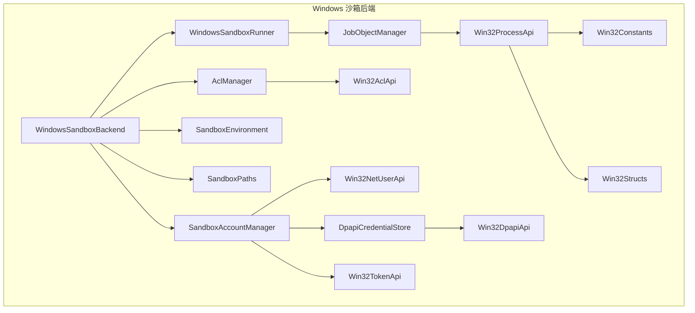
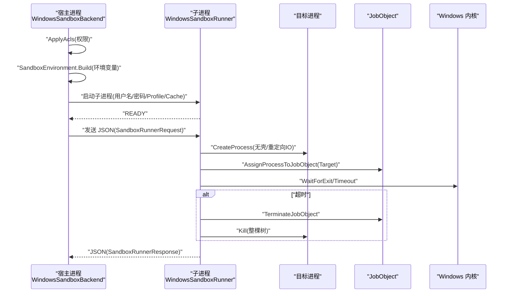
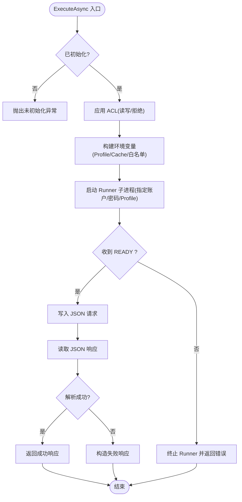
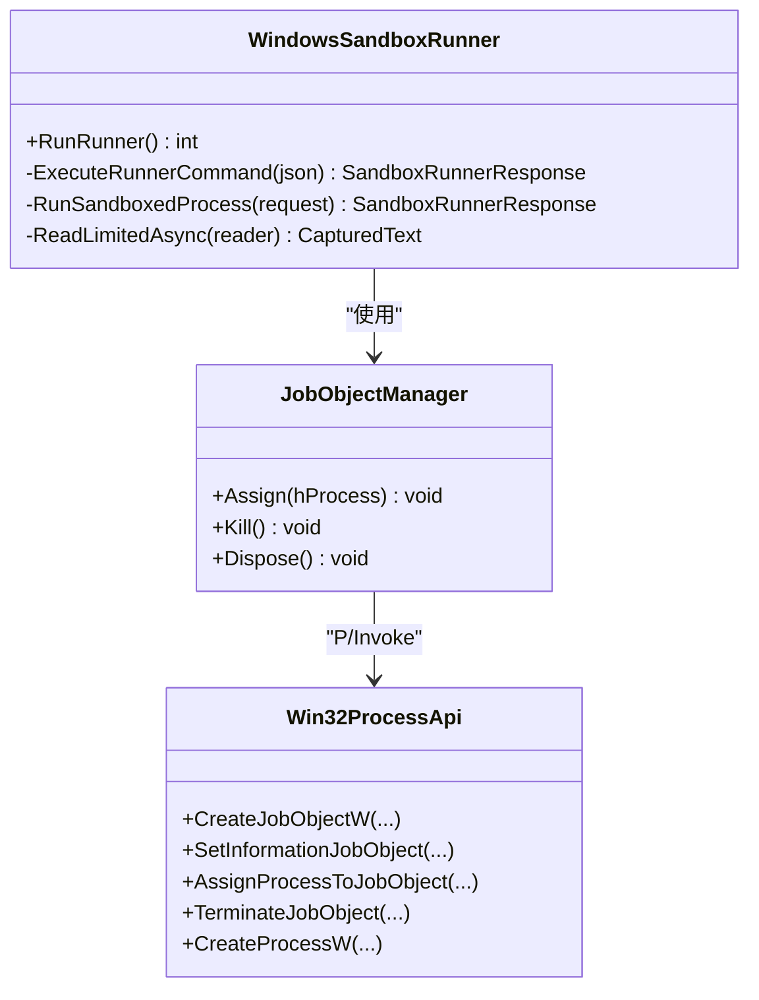
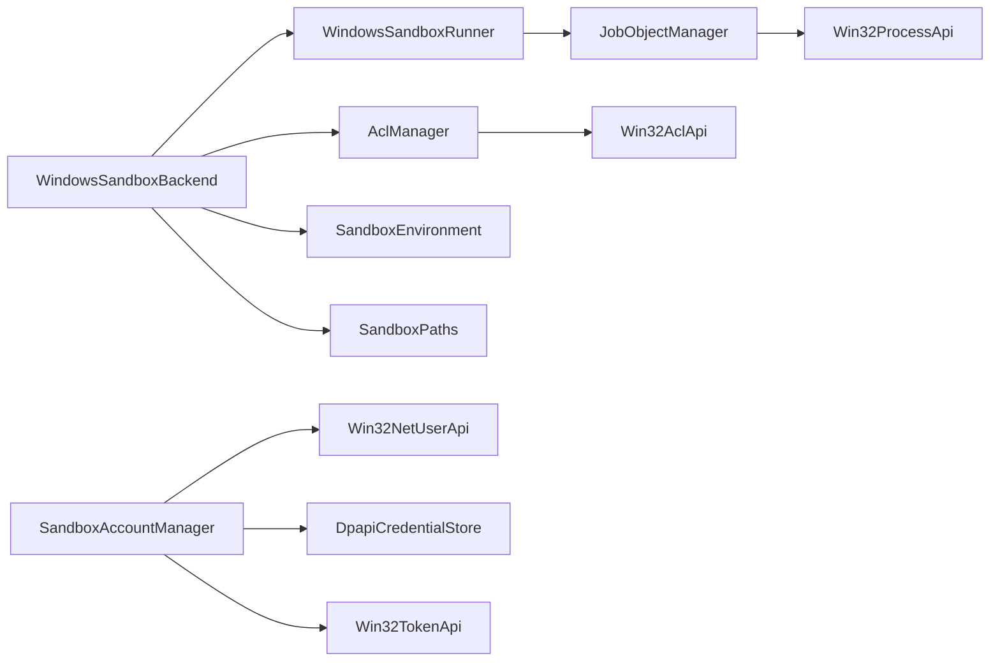

# Windows 沙箱后端

<cite>
**本文引用的文件**   
- [WindowsSandboxBackend.cs](file://TinadecTools/Runtime/Sandbox/Windows/WindowsSandboxBackend.cs)
- [WindowsSandboxRunner.cs](file://TinadecTools/Runtime/Sandbox/Windows/WindowsSandboxRunner.cs)
- [Win32AclApi.cs](file://TinadecTools/Runtime/Sandbox/Windows/Win32AclApi.cs)
- [Win32ProcessApi.cs](file://TinadecTools/Runtime/Sandbox/Windows/Win32ProcessApi.cs)
- [Win32TokenApi.cs](file://TinadecTools/Runtime/Sandbox/Windows/Win32TokenApi.cs)
- [AclManager.cs](file://TinadecTools/Runtime/Sandbox/Windows/AclManager.cs)
- [JobObjectManager.cs](file://TinadecTools/Runtime/Sandbox/Windows/JobObjectManager.cs)
- [SandboxAccountManager.cs](file://TinadecTools/Runtime/Sandbox/Windows/SandboxAccountManager.cs)
- [WindowsSandboxSetup.cs](file://TinadecTools/Runtime/Sandbox/Windows/WindowsSandboxSetup.cs)
- [DpapiCredentialStore.cs](file://TinadecTools/Runtime/Sandbox/Windows/DpapiCredentialStore.cs)
- [Win32Constants.cs](file://TinadecTools/Runtime/Sandbox/Windows/Win32Constants.cs)
- [Win32Structs.cs](file://TinadecTools/Runtime/Sandbox/Windows/Win32Structs.cs)
- [Win32NetUserApi.cs](file://TinadecTools/Runtime/Sandbox/Windows/Win32NetUserApi.cs)
- [SandboxContracts.cs](file://TinadecTools/Runtime/Sandbox/SandboxContracts.cs)
- [SandboxEnvironment.cs](file://TinadecTools/Runtime/Sandbox/SandboxEnvironment.cs)
- [SandboxPaths.cs](file://TinadecTools/Runtime/Sandbox/SandboxPaths.cs)
</cite>

## 目录
1. [简介](#简介)
2. [项目结构](#项目结构)
3. [核心组件](#核心组件)
4. [架构总览](#架构总览)
5. [详细组件分析](#详细组件分析)
6. [依赖关系分析](#依赖关系分析)
7. [性能考虑](#性能考虑)
8. [故障排查指南](#故障排查指南)
9. [结论](#结论)
10. [附录](#附录)

## 简介
本文件面向 Windows 平台的沙箱后端实现，系统性阐述 WindowsSandboxBackend 的设计与实现、进程隔离技术（JobObject）、以及围绕 Win32 API 的封装（ACL、进程、令牌）。文档还覆盖沙箱账户创建、权限继承控制、资源限制配置，并给出 ExecuteAsync 的执行流程、EnsureSetupAsync 初始化流程与 ResetAsync 清理机制。最后提供 Windows 特定安全配置与性能调优建议。

## 项目结构
Windows 沙箱后端位于 TinadecTools 项目的 Runtime\Sandbox\Windows 目录下，采用“平台专用实现 + 通用契约”的分层组织：
- 平台适配层：WindowsSandboxBackend、WindowsSandboxRunner、WindowsSandboxSetup
- 系统能力封装：Win32AclApi、Win32ProcessApi、Win32TokenApi、Win32NetUserApi、Win32Constants、Win32Structs
- 安全与资源管理：AclManager、JobObjectManager、DpapiCredentialStore、SandboxAccountManager
- 通用契约与环境：SandboxContracts、SandboxEnvironment、SandboxPaths

图表来源
- [WindowsSandboxBackend.cs:1-161](file://TinadecTools/Runtime/Sandbox/Windows/WindowsSandboxBackend.cs#L1-L161)
- [WindowsSandboxRunner.cs:1-178](file://TinadecTools/Runtime/Sandbox/Windows/WindowsSandboxRunner.cs#L1-L178)
- [JobObjectManager.cs:1-63](file://TinadecTools/Runtime/Sandbox/Windows/JobObjectManager.cs#L1-L63)
- [Win32ProcessApi.cs:1-79](file://TinadecTools/Runtime/Sandbox/Windows/Win32ProcessApi.cs#L1-L79)
- [AclManager.cs:1-62](file://TinadecTools/Runtime/Sandbox/Windows/AclManager.cs#L1-L62)
- [Win32AclApi.cs:1-55](file://TinadecTools/Runtime/Sandbox/Windows/Win32AclApi.cs#L1-L55)
- [SandboxAccountManager.cs:1-88](file://TinadecTools/Runtime/Sandbox/Windows/SandboxAccountManager.cs#L1-L88)
- [Win32NetUserApi.cs:1-34](file://TinadecTools/Runtime/Sandbox/Windows/Win32NetUserApi.cs#L1-L34)
- [DpapiCredentialStore.cs:1-90](file://TinadecTools/Runtime/Sandbox/Windows/DpapiCredentialStore.cs#L1-L90)
- [Win32TokenApi.cs:1-42](file://TinadecTools/Runtime/Sandbox/Windows/Win32TokenApi.cs#L1-L42)
- [Win32Constants.cs:1-78](file://TinadecTools/Runtime/Sandbox/Windows/Win32Constants.cs#L1-L78)
- [Win32Structs.cs:1-80](file://TinadecTools/Runtime/Sandbox/Windows/Win32Structs.cs#L1-L80)
- [SandboxEnvironment.cs:1-69](file://TinadecTools/Runtime/Sandbox/SandboxEnvironment.cs#L1-L69)
- [SandboxPaths.cs:1-113](file://TinadecTools/Runtime/Sandbox/SandboxPaths.cs#L1-L113)

章节来源
- [WindowsSandboxBackend.cs:1-161](file://TinadecTools/Runtime/Sandbox/Windows/WindowsSandboxBackend.cs#L1-L161)
- [SandboxContracts.cs:1-71](file://TinadecTools/Runtime/Sandbox/SandboxContracts.cs#L1-L71)

## 核心组件
- WindowsSandboxBackend：对外暴露 ISandboxBackend 接口，负责初始化、执行、重置；协调 ACL 应用、环境变量构建、子进程启动与结果处理。
- WindowsSandboxRunner：作为独立子进程运行，接收 JSON 指令，使用 JobObject 对目标进程进行隔离与超时控制，读取标准输入输出并返回结构化响应。
- AclManager：基于 .NET 文件系统访问控制，为沙箱账户授予读/写或拒绝所有权限，支持撤销。
- JobObjectManager：封装 JobObject 生命周期，设置关闭时终止策略，分配进程到作业对象，支持批量终止。
- SandboxAccountManager：创建/删除低权限沙箱账户，持久化密码（DPAPI），登录获取令牌，计算 Profile/Cache 路径。
- WindowsSandboxSetup：触发 UAC 提升以完成一次性初始化，确保沙箱账户存在。
- Win32*Api：对 advapi32/kernel32/netapi32 等系统库的 P/Invoke 封装，涵盖 ACL、进程、令牌、用户管理等。
- DpapiCredentialStore：使用 DPAPI 加密存储沙箱账户密码，保证凭据安全。
- SandboxEnvironment/SandboxPaths：构建最小化环境变量集，校验工作目录与授权路径，防止越权。

章节来源
- [WindowsSandboxBackend.cs:1-161](file://TinadecTools/Runtime/Sandbox/Windows/WindowsSandboxBackend.cs#L1-L161)
- [WindowsSandboxRunner.cs:1-178](file://TinadecTools/Runtime/Sandbox/Windows/WindowsSandboxRunner.cs#L1-L178)
- [AclManager.cs:1-62](file://TinadecTools/Runtime/Sandbox/Windows/AclManager.cs#L1-L62)
- [JobObjectManager.cs:1-63](file://TinadecTools/Runtime/Sandbox/Windows/JobObjectManager.cs#L1-L63)
- [SandboxAccountManager.cs:1-88](file://TinadecTools/Runtime/Sandbox/Windows/SandboxAccountManager.cs#L1-L88)
- [WindowsSandboxSetup.cs:1-86](file://TinadecTools/Runtime/Sandbox/Windows/WindowsSandboxSetup.cs#L1-L86)
- [Win32AclApi.cs:1-55](file://TinadecTools/Runtime/Sandbox/Windows/Win32AclApi.cs#L1-L55)
- [Win32ProcessApi.cs:1-79](file://TinadecTools/Runtime/Sandbox/Windows/Win32ProcessApi.cs#L1-L79)
- [Win32TokenApi.cs:1-42](file://TinadecTools/Runtime/Sandbox/Windows/Win32TokenApi.cs#L1-L42)
- [DpapiCredentialStore.cs:1-90](file://TinadecTools/Runtime/Sandbox/Windows/DpapiCredentialStore.cs#L1-L90)
- [SandboxEnvironment.cs:1-69](file://TinadecTools/Runtime/Sandbox/SandboxEnvironment.cs#L1-L69)
- [SandboxPaths.cs:1-113](file://TinadecTools/Runtime/Sandbox/SandboxPaths.cs#L1-L113)

## 架构总览
整体流程分为三层：
- 编排层：WindowsSandboxBackend 负责策略装配（ACL、环境变量）和跨进程通信（子进程 runner）。
- 执行层：WindowsSandboxRunner 在受限账户下启动目标可执行文件，通过 JobObject 实施进程组隔离与资源限制。
- 系统层：Win32*Api 封装底层系统调用，配合 DPAPI、NetUser、ACL 等机制实现安全与权限控制。

图表来源
- [WindowsSandboxBackend.cs:23-153](file://TinadecTools/Runtime/Sandbox/Windows/WindowsSandboxBackend.cs#L23-L153)
- [WindowsSandboxRunner.cs:50-154](file://TinadecTools/Runtime/Sandbox/Windows/WindowsSandboxRunner.cs#L50-L154)
- [JobObjectManager.cs:10-52](file://TinadecTools/Runtime/Sandbox/Windows/JobObjectManager.cs#L10-L52)
- [Win32ProcessApi.cs:7-45](file://TinadecTools/Runtime/Sandbox/Windows/Win32ProcessApi.cs#L7-L45)

## 详细组件分析

### WindowsSandboxBackend：执行入口与策略装配
- 初始化：EnsureSetupAsync 检查平台与账户状态，必要时触发 UAC 提升并完成一次性初始化。
- 执行：ExecuteAsync 按权限策略应用 ACL，构建最小化环境变量，启动 Runner 子进程，等待 READY，发送请求并解析响应。
- 清理：ResetAsync 删除策略文件，按范围清理账户与缓存/Profile 目录。

图表来源
- [WindowsSandboxBackend.cs:23-153](file://TinadecTools/Runtime/Sandbox/Windows/WindowsSandboxBackend.cs#L23-L153)

章节来源
- [WindowsSandboxBackend.cs:14-72](file://TinadecTools/Runtime/Sandbox/Windows/WindowsSandboxBackend.cs#L14-L72)
- [WindowsSandboxBackend.cs:74-97](file://TinadecTools/Runtime/Sandbox/Windows/WindowsSandboxBackend.cs#L74-L97)
- [WindowsSandboxBackend.cs:99-153](file://TinadecTools/Runtime/Sandbox/Windows/WindowsSandboxBackend.cs#L99-L153)

### WindowsSandboxRunner：进程管理与 JobObject 隔离
- 协议：先输出 READY，再循环读取 JSON 指令，执行后回写响应并再次输出 READY，直到 EXIT。
- 执行：构造 ProcessStartInfo，清空环境并按请求注入，启动目标进程，加入 JobObject，异步读取 IO，支持超时与强制终止。
- 限制：最大输出字符数限制，避免内存膨胀；超时将终止作业对象及整个进程树。

图表来源
- [WindowsSandboxRunner.cs:14-154](file://TinadecTools/Runtime/Sandbox/Windows/WindowsSandboxRunner.cs#L14-L154)
- [JobObjectManager.cs:10-52](file://TinadecTools/Runtime/Sandbox/Windows/JobObjectManager.cs#L10-L52)
- [Win32ProcessApi.cs:7-45](file://TinadecTools/Runtime/Sandbox/Windows/Win32ProcessApi.cs#L7-L45)

章节来源
- [WindowsSandboxRunner.cs:14-48](file://TinadecTools/Runtime/Sandbox/Windows/WindowsSandboxRunner.cs#L14-L48)
- [WindowsSandboxRunner.cs:50-72](file://TinadecTools/Runtime/Sandbox/Windows/WindowsSandboxRunner.cs#L50-L72)
- [WindowsSandboxRunner.cs:74-154](file://TinadecTools/Runtime/Sandbox/Windows/WindowsSandboxRunner.cs#L74-L154)

### Win32AclApi：权限控制封装
- 提供创建 SID、初始化 ACL、添加允许/拒绝 ACE、设置 DACL、设置命名对象安全描述符等关键方法。
- 与 AclManager 协作，实现对目录的细粒度读/写授权与 DenyAll 策略。

章节来源
- [Win32AclApi.cs:1-55](file://TinadecTools/Runtime/Sandbox/Windows/Win32AclApi.cs#L1-L55)
- [AclManager.cs:17-58](file://TinadecTools/Runtime/Sandbox/Windows/AclManager.cs#L17-L58)

### Win32ProcessApi：进程操作封装
- 封装 JobObject 生命周期（创建、信息设置、分配进程、终止）、进程创建（CreateProcessW）、管道、等待与退出码获取等。
- 被 JobObjectManager 与 Runner 广泛使用，构成进程隔离与资源限制的核心。

章节来源
- [Win32ProcessApi.cs:1-79](file://TinadecTools/Runtime/Sandbox/Windows/Win32ProcessApi.cs#L1-L79)
- [JobObjectManager.cs:10-52](file://TinadecTools/Runtime/Sandbox/Windows/JobObjectManager.cs#L10-L52)
- [WindowsSandboxRunner.cs:97-154](file://TinadecTools/Runtime/Sandbox/Windows/WindowsSandboxRunner.cs#L97-L154)

### Win32TokenApi：令牌管理
- 提供 LogonUserW、DuplicateTokenEx、CreateProcessAsUserW、OpenProcessToken 等方法，用于以沙箱账户身份创建进程或模拟令牌。
- 当前 Backend 通过 ProcessStartInfo 指定用户名/密码方式启动 Runner，但 Token API 为扩展提供了更灵活的进程上下文控制能力。

章节来源
- [Win32TokenApi.cs:1-42](file://TinadecTools/Runtime/Sandbox/Windows/Win32TokenApi.cs#L1-L42)
- [SandboxAccountManager.cs:52-63](file://TinadecTools/Runtime/Sandbox/Windows/SandboxAccountManager.cs#L52-L63)

### 沙箱账户与凭据：SandboxAccountManager 与 DpapiCredentialStore
- 账户创建：生成随机密码，调用 NetUserAdd 创建本地账户，标记脚本/不过期等标志；若已存在则复用并加载 DPAPI 保存的密码。
- 凭据存储：使用 DPAPI CryptProtectData/CryptUnprotectData 加密/解密密码，落盘至 LocalApplicationData 下的安全目录。
- 路径推导：根据系统用户根目录拼接 Profile 与 Cache 路径，供环境变量注入。

章节来源
- [SandboxAccountManager.cs:16-44](file://TinadecTools/Runtime/Sandbox/Windows/SandboxAccountManager.cs#L16-L44)
- [SandboxAccountManager.cs:65-76](file://TinadecTools/Runtime/Sandbox/Windows/SandboxAccountManager.cs#L65-L76)
- [DpapiCredentialStore.cs:14-53](file://TinadecTools/Runtime/Sandbox/Windows/DpapiCredentialStore.cs#L14-L53)
- [Win32NetUserApi.cs:1-34](file://TinadecTools/Runtime/Sandbox/Windows/Win32NetUserApi.cs#L1-L34)

### 初始化与清理：WindowsSandboxSetup 与 ResetAsync
- EnsureSetupAsync：检测账户是否存在，不存在则触发 UAC 提升并以管理员模式重新运行 Setup 模式，完成后重试检查。
- ResetAsync：删除策略文件；Machine 范围时删除账户、清理 Profile/Cache 目录。

章节来源
- [WindowsSandboxSetup.cs:29-61](file://TinadecTools/Runtime/Sandbox/Windows/WindowsSandboxSetup.cs#L29-L61)
- [WindowsSandboxBackend.cs:55-72](file://TinadecTools/Runtime/Sandbox/Windows/WindowsSandboxBackend.cs#L55-L72)

### 环境变量与路径约束：SandboxEnvironment 与 SandboxPaths
- 环境变量：仅保留必要系统变量，注入沙箱账户的 Profile/AppData/Temp 与常用包管理器缓存路径，支持额外白名单变量名。
- 路径约束：工作目录必须在 Workspace 内；外部授权路径需规范化且禁止宽泛写入目标（如磁盘根、ProgramFiles、System 等）。

章节来源
- [SandboxEnvironment.cs:16-61](file://TinadecTools/Runtime/Sandbox/SandboxEnvironment.cs#L16-L61)
- [SandboxPaths.cs:18-60](file://TinadecTools/Runtime/Sandbox/SandboxPaths.cs#L18-L60)

## 依赖关系分析
- 耦合度：Backend 与 Runner 通过 JSON 协议解耦；Runner 与 JobObjectManager 强耦合；AclManager 与 Win32AclApi 松耦合（通过 .NET 抽象）。
- 外部依赖：advapi32（ACL/令牌）、kernel32（进程/JobObject）、netapi32（用户管理）、DPAPI（凭据保护）。
- 潜在循环：无直接循环依赖；各模块职责清晰，遵循单向依赖。

图表来源
- [WindowsSandboxBackend.cs:1-161](file://TinadecTools/Runtime/Sandbox/Windows/WindowsSandboxBackend.cs#L1-L161)
- [WindowsSandboxRunner.cs:1-178](file://TinadecTools/Runtime/Sandbox/Windows/WindowsSandboxRunner.cs#L1-L178)
- [JobObjectManager.cs:1-63](file://TinadecTools/Runtime/Sandbox/Windows/JobObjectManager.cs#L1-L63)
- [AclManager.cs:1-62](file://TinadecTools/Runtime/Sandbox/Windows/AclManager.cs#L1-L62)
- [SandboxAccountManager.cs:1-88](file://TinadecTools/Runtime/Sandbox/Windows/SandboxAccountManager.cs#L1-L88)

章节来源
- [SandboxContracts.cs:1-71](file://TinadecTools/Runtime/Sandbox/SandboxContracts.cs#L1-L71)

## 性能考虑
- 进程启动开销：Runner 作为常驻子进程减少重复启动成本；Backend 与 Runner 间通过标准流传输 JSON，避免 IPC 复杂化。
- IO 缓冲限制：Runner 限制 stdout/stderr 最大字符数，防止大输出导致内存压力。
- JobObject 资源限制：当前启用关闭即终止策略，可扩展 MaximumWorkingSetSize、JobMemoryLimit、ActiveProcessLimit 等以限制 CPU/内存/进程数。
- 环境变量最小化：仅保留必要变量，降低进程初始化时间与攻击面。
- 并行执行：每个任务独立 Runner 实例，天然隔离；如需更高吞吐，可在上层池化 Runner 实例（需谨慎评估隔离性）。

[本节为通用指导，无需引用具体文件]

## 故障排查指南
- 未初始化：EnsureSetupAsync 未调用或账户不存在，将抛出未初始化异常。请确认 UAC 提升成功且账户已创建。
- Runner 初始化失败：未收到 READY 或收到非预期行，将终止 Runner 并返回错误；检查 stderr 输出。
- 超时：Runner 等待超时将终止 JobObject 与进程树；适当增大 TimeoutMs 或优化目标程序。
- 权限不足：ACL 未正确授予或路径不在工作区内；检查 NormalizeGrantPath 与 IsWithinWorkspace 校验。
- 凭据问题：DPAPI 解密失败或文件缺失；确认运行账户一致且凭据文件存在。
- 账户管理：创建/删除账户失败时，检查 NetUserAdd/NetUserDel 返回值与错误码。

章节来源
- [WindowsSandboxBackend.cs:29-31](file://TinadecTools/Runtime/Sandbox/Windows/WindowsSandboxBackend.cs#L29-L31)
- [WindowsSandboxBackend.cs:120-126](file://TinadecTools/Runtime/Sandbox/Windows/WindowsSandboxBackend.cs#L120-L126)
- [WindowsSandboxRunner.cs:126-139](file://TinadecTools/Runtime/Sandbox/Windows/WindowsSandboxRunner.cs#L126-L139)
- [DpapiCredentialStore.cs:34-53](file://TinadecTools/Runtime/Sandbox/Windows/DpapiCredentialStore.cs#L34-L53)
- [SandboxAccountManager.cs:39-44](file://TinadecTools/Runtime/Sandbox/Windows/SandboxAccountManager.cs#L39-L44)

## 结论
Windows 沙箱后端通过“后台编排 + 子进程执行 + JobObject 隔离 + 最小权限账户”的组合，实现了安全的工具执行环境。其设计清晰、职责分离，借助 Win32 API 封装与 DPAPI 凭据保护，兼顾安全性与可用性。建议在后续迭代中扩展 JobObject 资源限制、增强日志与诊断、并提供更细粒度的策略配置。

[本节为总结性内容，无需引用具体文件]

## 附录

### ExecuteAsync 执行流程要点
- 应用 ACL：对工作区授予写权限，对 .tinadec 目录拒绝所有，按需授予外部读/写路径。
- 构建环境变量：注入 Profile/AppData/Temp 与包管理器缓存路径，保留必要系统变量。
- 启动 Runner：以沙箱账户启动子进程，重定向 IO，等待 READY。
- 发送请求与解析响应：序列化请求，读取 JSON 响应，处理取消与错误。

章节来源
- [WindowsSandboxBackend.cs:74-97](file://TinadecTools/Runtime/Sandbox/Windows/WindowsSandboxBackend.cs#L74-L97)
- [WindowsSandboxBackend.cs:36-42](file://TinadecTools/Runtime/Sandbox/Windows/WindowsSandboxBackend.cs#L36-L42)
- [WindowsSandboxBackend.cs:99-153](file://TinadecTools/Runtime/Sandbox/Windows/WindowsSandboxBackend.cs#L99-L153)

### EnsureSetupAsync 初始化流程要点
- 平台检查：仅在 Windows 上支持。
- 账户检查：若不存在，触发 UAC 提升并运行 Setup 模式。
- 最终校验：确保账户可用，否则抛出异常。

章节来源
- [WindowsSandboxBackend.cs:14-21](file://TinadecTools/Runtime/Sandbox/Windows/WindowsSandboxBackend.cs#L14-L21)
- [WindowsSandboxSetup.cs:29-37](file://TinadecTools/Runtime/Sandbox/Windows/WindowsSandboxSetup.cs#L29-L37)

### ResetAsync 清理机制要点
- 删除策略文件。
- Machine 范围：删除沙箱账户、清理 Profile 与 Cache 目录。
- 异常容忍：清理过程捕获异常，确保不影响主流程。

章节来源
- [WindowsSandboxBackend.cs:55-72](file://TinadecTools/Runtime/Sandbox/Windows/WindowsSandboxBackend.cs#L55-L72)

### Windows 特定安全配置建议
- 使用最小权限账户执行工具，避免继承高权限令牌。
- 严格限制工作目录与授权路径，禁止向系统目录写入。
- 启用 JobObject 关闭即终止，确保进程组生命周期可控。
- 使用 DPAPI 保护凭据，避免明文存储。
- 环境变量最小化，仅保留必要项，降低攻击面。

[本节为通用指导，无需引用具体文件]