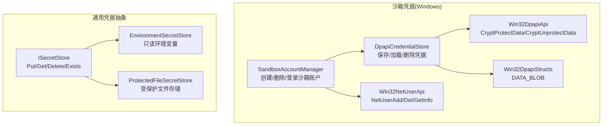
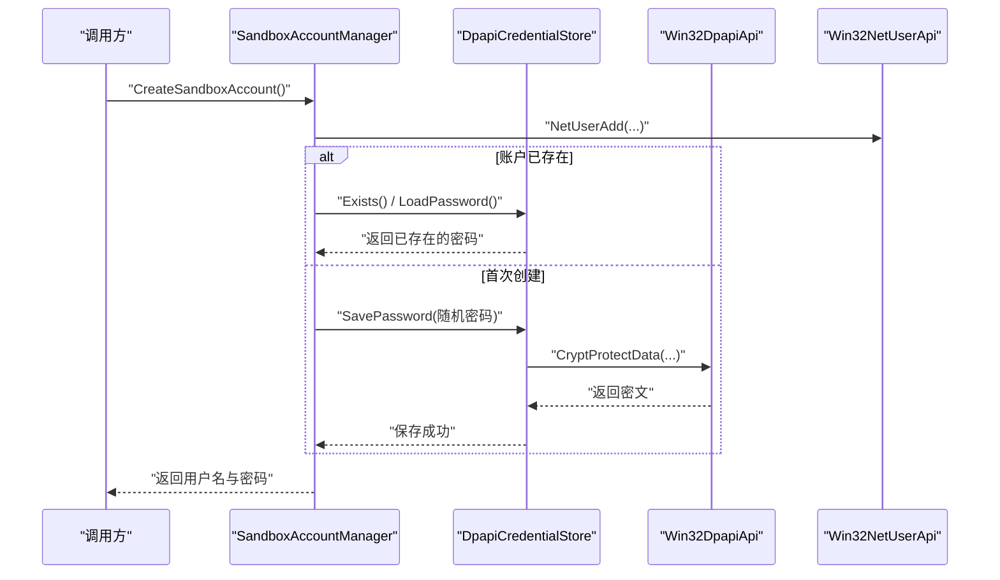
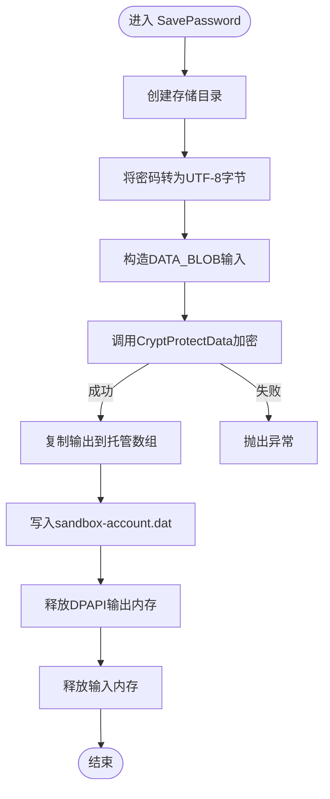
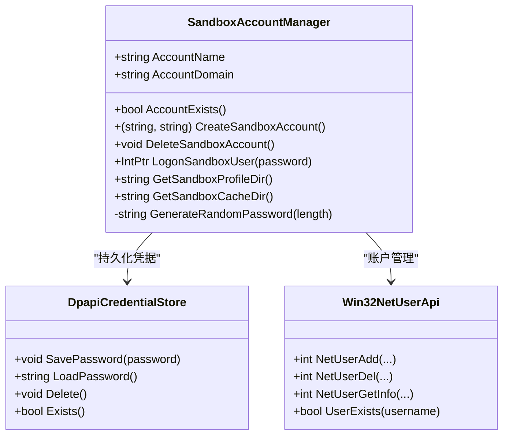
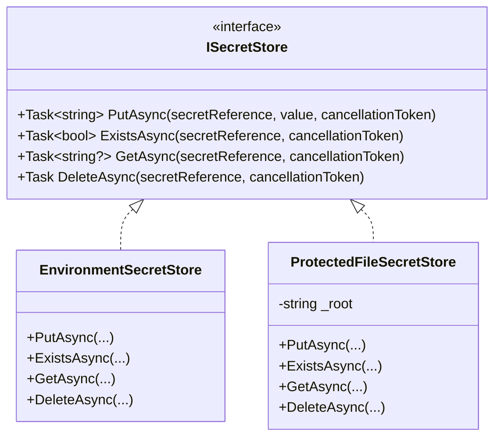
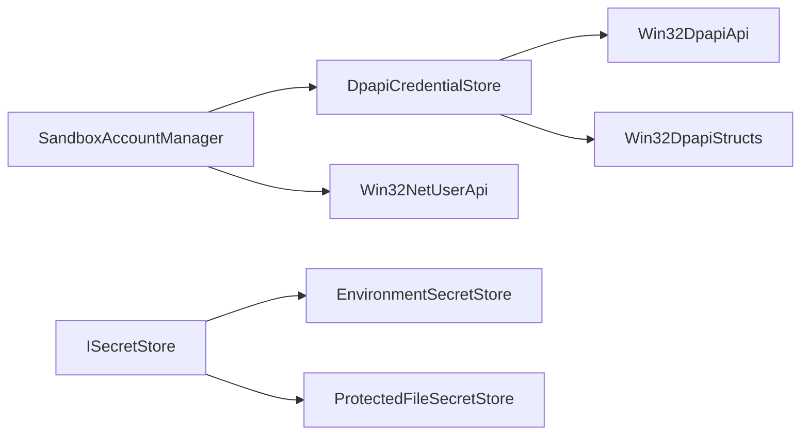

# 凭据安全管理

<cite>
**本文引用的文件**   
- [DpapiCredentialStore.cs](file://TinadecTools/Runtime/Sandbox/Windows/DpapiCredentialStore.cs)
- [Win32DpapiApi.cs](file://TinadecTools/Runtime/Sandbox/Windows/Win32DpapiApi.cs)
- [Win32DpapiStructs.cs](file://TinadecTools/Runtime/Sandbox/Windows/Win32DpapiStructs.cs)
- [SandboxAccountManager.cs](file://TinadecTools/Runtime/Sandbox/Windows/SandboxAccountManager.cs)
- [Win32NetUserApi.cs](file://TinadecTools/Runtime/Sandbox/Windows/Win32NetUserApi.cs)
- [ISecretStore.cs](file://TinadecCore/Persistence/ISecretStore.cs)
- [security.md](file://docs/security.md)
- [CredentialSafetyTests.cs](file://tests/TinadecCore.Tests/CredentialSafetyTests.cs)
- [SecretProtectorTests.cs](file://tests/TinadecCore.Tests/SecretProtectorTests.cs)
</cite>

## 目录
1. [简介](#简介)
2. [项目结构](#项目结构)
3. [核心组件](#核心组件)
4. [架构总览](#架构总览)
5. [详细组件分析](#详细组件分析)
6. [依赖关系分析](#依赖关系分析)
7. [性能考虑](#性能考虑)
8. [故障排查指南](#故障排查指南)
9. [结论](#结论)
10. [附录](#附录)

## 简介
本文件面向沙箱凭据安全管理系统，重点阐述 Windows 平台下的 DPAPI 加密存储实现与密码安全存储机制。文档围绕 DpapiCredentialStore 的 SavePassword、LoadPassword 方法展开，解释密钥管理策略、ISecretStore 接口设计与多后端支持（环境、受保护文件），并说明沙箱账户密码管理、临时凭据生成与生命周期控制。同时，对 DPAPI 的工作原理、机器级与用户级加密差异进行说明，给出凭据安全最佳实践、密钥轮换策略与安全审计方法，以及与 Windows 安全账户管理器（SAM）集成和权限隔离要点。

## 项目结构
与凭据安全相关的代码主要分布在以下模块：
- TinadecTools/Runtime/Sandbox/Windows：Windows 沙箱凭据与账户管理实现（DPAPI、NetUser API、令牌登录等）。
- TinadecCore/Persistence：通用凭据抽象 ISecretStore 及多后端实现（环境变量、受保护文件）。
- docs/security.md：MVP 安全注意事项，涵盖 Electron 隔离、工具调用审批、沙箱账户初始化等。
- tests：凭据安全相关测试用例，验证错误信息不泄露敏感数据、加解密往返正确性。

**图表来源** 
- [DpapiCredentialStore.cs:1-90](file://TinadecTools/Runtime/Sandbox/Windows/DpapiCredentialStore.cs#L1-L90)
- [Win32DpapiApi.cs:1-21](file://TinadecTools/Runtime/Sandbox/Windows/Win32DpapiApi.cs#L1-L21)
- [Win32DpapiStructs.cs:1-10](file://TinadecTools/Runtime/Sandbox/Windows/Win32DpapiStructs.cs#L1-L10)
- [SandboxAccountManager.cs:1-88](file://TinadecTools/Runtime/Sandbox/Windows/SandboxAccountManager.cs#L1-L88)
- [Win32NetUserApi.cs:1-34](file://TinadecTools/Runtime/Sandbox/Windows/Win32NetUserApi.cs#L1-L34)
- [ISecretStore.cs:1-65](file://TinadecCore/Persistence/ISecretStore.cs#L1-L65)

**章节来源**
- [DpapiCredentialStore.cs:1-90](file://TinadecTools/Runtime/Sandbox/Windows/DpapiCredentialStore.cs#L1-L90)
- [ISecretStore.cs:1-65](file://TinadecCore/Persistence/ISecretStore.cs#L1-L65)
- [security.md:1-18](file://docs/security.md#L1-L18)

## 核心组件
- DpapiCredentialStore：基于 Windows DPAPI 对沙箱账户密码进行本地加密存储与读取，提供 SavePassword、LoadPassword、Delete、Exists 等方法。
- Win32DpapiApi/Win32DpapiStructs：封装 crypt32.dll 的 CryptProtectData/CryptUnprotectData 以及 DATA_BLOB 结构体。
- SandboxAccountManager：负责沙箱账户的创建、删除、登录流程，随机密码生成，并与 DpapiCredentialStore 协同持久化凭据。
- Win32NetUserApi：封装 netapi32.dll 的用户账户操作（添加、删除、查询是否存在）。
- ISecretStore 及其实现：提供统一的凭据存取接口，包含 EnvironmentSecretStore（只读环境变量）与 ProtectedFileSecretStore（使用系统级保护存储）。

**章节来源**
- [DpapiCredentialStore.cs:1-90](file://TinadecTools/Runtime/Sandbox/Windows/DpapiCredentialStore.cs#L1-L90)
- [Win32DpapiApi.cs:1-21](file://TinadecTools/Runtime/Sandbox/Windows/Win32DpapiApi.cs#L1-L21)
- [Win32DpapiStructs.cs:1-10](file://TinadecTools/Runtime/Sandbox/Windows/Win32DpapiStructs.cs#L1-L10)
- [SandboxAccountManager.cs:1-88](file://TinadecTools/Runtime/Sandbox/Windows/SandboxAccountManager.cs#L1-L88)
- [Win32NetUserApi.cs:1-34](file://TinadecTools/Runtime/Sandbox/Windows/Win32NetUserApi.cs#L1-L34)
- [ISecretStore.cs:1-65](file://TinadecCore/Persistence/ISecretStore.cs#L1-L65)

## 架构总览
下图展示了沙箱凭据在 Windows 上的整体交互流程：上层通过 SandboxAccountManager 管理账户与凭据，底层通过 DpapiCredentialStore 调用 DPAPI 完成加密/解密，并通过 NetUser API 与 SAM 交互。

**图表来源** 
- [SandboxAccountManager.cs:16-44](file://TinadecTools/Runtime/Sandbox/Windows/SandboxAccountManager.cs#L16-L44)
- [DpapiCredentialStore.cs:14-32](file://TinadecTools/Runtime/Sandbox/Windows/DpapiCredentialStore.cs#L14-L32)
- [Win32DpapiApi.cs:10-13](file://TinadecTools/Runtime/Sandbox/Windows/Win32DpapiApi.cs#L10-L13)
- [Win32NetUserApi.cs:8-11](file://TinadecTools/Runtime/Sandbox/Windows/Win32NetUserApi.cs#L8-L11)

## 详细组件分析

### DpapiCredentialStore：DPAPI 加密存储实现
- 存储位置：LocalApplicationData/TinadecTools/Sandbox/sandbox-account.dat
- 加密方式：调用 CryptProtectData/CryptUnprotectData，使用描述符“TinadecSandbox”作为可选熵上下文；当前实现未传入额外熵，属于用户级或进程级保护（取决于调用上下文）。
- 内存安全：使用 Marshal.AllocHGlobal 分配非托管内存，确保明文不在托管堆上驻留过久；释放时分别调用 LocalFree 与 FreeHGlobal 避免泄漏。
- 异常处理：加密/解密失败抛出 InvalidOperationException；文件不存在时抛出 FileNotFoundException。
- 生命周期：提供 Delete 与 Exists 以支持清理与检测。

**图表来源** 
- [DpapiCredentialStore.cs:14-32](file://TinadecTools/Runtime/Sandbox/Windows/DpapiCredentialStore.cs#L14-L32)
- [Win32DpapiApi.cs:10-13](file://TinadecTools/Runtime/Sandbox/Windows/Win32DpapiApi.cs#L10-L13)
- [Win32DpapiStructs.cs:6-10](file://TinadecTools/Runtime/Sandbox/Windows/Win32DpapiStructs.cs#L6-L10)

**章节来源**
- [DpapiCredentialStore.cs:1-90](file://TinadecTools/Runtime/Sandbox/Windows/DpapiCredentialStore.cs#L1-L90)
- [Win32DpapiApi.cs:1-21](file://TinadecTools/Runtime/Sandbox/Windows/Win32DpapiApi.cs#L1-L21)
- [Win32DpapiStructs.cs:1-10](file://TinadecTools/Runtime/Sandbox/Windows/Win32DpapiStructs.cs#L1-L10)

### SandboxAccountManager：沙箱账户与凭据生命周期
- 账户名与域：固定为“TinadecSandbox”，域为本地机器。
- 创建流程：生成强随机密码（长度32，字符集排除易混淆字符），调用 NetUserAdd 创建账户；若账户已存在且缺少本地凭据，则抛出异常提示先执行重置；否则从 DpapiCredentialStore 加载已有密码。
- 删除流程：调用 NetUserDel 删除账户，并删除本地凭据文件。
- 登录流程：使用 LogonUserW 以批处理模式登录沙箱账户，返回访问令牌供后续进程使用。
- 路径管理：提供获取沙箱用户配置文件目录与缓存目录的方法。

**图表来源** 
- [SandboxAccountManager.cs:1-88](file://TinadecTools/Runtime/Sandbox/Windows/SandboxAccountManager.cs#L1-L88)
- [DpapiCredentialStore.cs:1-90](file://TinadecTools/Runtime/Sandbox/Windows/DpapiCredentialStore.cs#L1-L90)
- [Win32NetUserApi.cs:1-34](file://TinadecTools/Runtime/Sandbox/Windows/Win32NetUserApi.cs#L1-L34)

**章节来源**
- [SandboxAccountManager.cs:1-88](file://TinadecTools/Runtime/Sandbox/Windows/SandboxAccountManager.cs#L1-L88)
- [Win32NetUserApi.cs:1-34](file://TinadecTools/Runtime/Sandbox/Windows/Win32NetUserApi.cs#L1-L34)

### ISecretStore：统一凭据抽象与多后端支持
- 接口定义：PutAsync、ExistsAsync、GetAsync、DeleteAsync，所有实现不得在关系型记录中存放明文或密文。
- EnvironmentSecretStore：只读，用于开发/部署注入环境变量；不支持 Put/Delete。
- ProtectedFileSecretStore：在 Windows 上使用 System.Security.Cryptography.ProtectedData 的 CurrentUser 作用域进行保护；其他平台保持明文（需结合文件系统权限控制）。

**图表来源** 
- [ISecretStore.cs:1-65](file://TinadecCore/Persistence/ISecretStore.cs#L1-L65)

**章节来源**
- [ISecretStore.cs:1-65](file://TinadecCore/Persistence/ISecretStore.cs#L1-L65)

### 凭据安全最佳实践与密钥轮换
- 最小暴露面：仅在需要时加载凭据，避免长时间驻留内存；使用非托管内存承载明文并及时释放。
- 平台原生保护：优先使用系统提供的保护机制（Windows DPAPI、ProtectedData.CurrentUser），避免自行实现加密算法。
- 权限隔离：沙箱账户仅授予必要路径与变量白名单；命令执行超时后终止进程树并回收资源。
- 密钥轮换：定期轮换沙箱账户密码；在轮换期间保留旧凭据兼容窗口，完成后彻底删除旧文件。
- 审计与日志：禁止在日志、事件、错误消息中输出原始凭据；使用安全摘要或占位符替代。
- 恢复与清理：提供 sandbox_reset 能力，按范围（workspace/machine）清理策略与凭据。

[本节为通用指导，不直接分析具体文件]

### DPAPI 工作原理与加密范围
- 工作原理：CryptProtectData 使用调用进程的凭据上下文（用户或机器）对数据进行加密，输出 DATA_BLOB；CryptUnprotectData 在相同上下文中解密。
- 用户级 vs 机器级：
  - 用户级：仅限当前登录用户解密，适合个人凭据。
  - 机器级：同一机器任何管理员可解密，适合服务级共享凭据。
- 熵与描述符：可通过 pOptionalEntropy 增加额外熵，szDataDescr 用于标识用途（示例中使用“TinadecSandbox”）。
- 安全建议：尽量使用用户级作用域；如需跨用户共享，应结合机器级与严格的访问控制。

[本节为概念说明，不直接分析具体文件]

### 与 Windows 安全账户管理器（SAM）集成与权限隔离
- 账户管理：通过 NetUserAdd/NetUserDel/NetUserGetInfo 与 SAM 交互，创建低权限沙箱账户。
- 登录与令牌：LogonUserW 获取访问令牌，限制后续进程权限范围。
- 权限隔离：沙箱账户仅拥有工作区与显式批准的目录读写权限；ACL 条目在进程生命周期内授权，结束后撤销。
- 网络与防火墙：默认允许网络访问与 LAN 绑定，受主机防火墙策略约束。

**章节来源**
- [Win32NetUserApi.cs:1-34](file://TinadecTools/Runtime/Sandbox/Windows/Win32NetUserApi.cs#L1-L34)
- [SandboxAccountManager.cs:52-63](file://TinadecTools/Runtime/Sandbox/Windows/SandboxAccountManager.cs#L52-L63)
- [security.md:8-11](file://docs/security.md#L8-L11)

## 依赖关系分析
- DpapiCredentialStore 依赖 Win32DpapiApi 与 Win32DpapiStructs 完成 DPAPI 调用与数据结构传递。
- SandboxAccountManager 依赖 DpapiCredentialStore 与 Win32NetUserApi 完成凭据持久化与账户管理。
- ISecretStore 抽象屏蔽了不同后端实现细节，便于在不同环境中切换凭据存储策略。

**图表来源** 
- [DpapiCredentialStore.cs:1-90](file://TinadecTools/Runtime/Sandbox/Windows/DpapiCredentialStore.cs#L1-L90)
- [Win32DpapiApi.cs:1-21](file://TinadecTools/Runtime/Sandbox/Windows/Win32DpapiApi.cs#L1-L21)
- [Win32DpapiStructs.cs:1-10](file://TinadecTools/Runtime/Sandbox/Windows/Win32DpapiStructs.cs#L1-L10)
- [SandboxAccountManager.cs:1-88](file://TinadecTools/Runtime/Sandbox/Windows/SandboxAccountManager.cs#L1-L88)
- [Win32NetUserApi.cs:1-34](file://TinadecTools/Runtime/Sandbox/Windows/Win32NetUserApi.cs#L1-L34)
- [ISecretStore.cs:1-65](file://TinadecCore/Persistence/ISecretStore.cs#L1-L65)

**章节来源**
- [DpapiCredentialStore.cs:1-90](file://TinadecTools/Runtime/Sandbox/Windows/DpapiCredentialStore.cs#L1-L90)
- [SandboxAccountManager.cs:1-88](file://TinadecTools/Runtime/Sandbox/Windows/SandboxAccountManager.cs#L1-L88)
- [ISecretStore.cs:1-65](file://TinadecCore/Persistence/ISecretStore.cs#L1-L65)

## 性能考虑
- DPAPI 调用开销较小，但频繁加解密可能影响性能；建议在会话级别缓存解密结果，减少重复调用。
- 文件 I/O 应尽量异步化（ProtectedFileSecretStore 已使用异步读写），避免阻塞主线程。
- 内存管理：确保非托管内存及时释放，避免明文驻留过长导致内存转储风险。

[本节为通用指导，不直接分析具体文件]

## 故障排查指南
- 常见错误：
  - DPAPI 解密失败：检查调用上下文是否一致（用户/机器）、描述符是否匹配、文件是否损坏。
  - 账户已存在但无本地凭据：需先执行 sandbox_reset 初始化机器级凭据后再重试。
  - 登录失败：检查密码是否正确、账户状态是否正常、权限是否足够。
- 调试建议：
  - 启用详细日志但不输出原始凭据；使用安全消息与事件摘要。
  - 验证文件路径与权限：确认 LocalApplicationData 目录可写、沙箱账户对缓存目录有访问权。
- 测试覆盖：
  - 认证失败不应泄露原始密钥；事件序列化不包含明文。
  - 加解密往返正确性验证。

**章节来源**
- [DpapiCredentialStore.cs:34-53](file://TinadecTools/Runtime/Sandbox/Windows/DpapiCredentialStore.cs#L34-L53)
- [SandboxAccountManager.cs:32-44](file://TinadecTools/Runtime/Sandbox/Windows/SandboxAccountManager.cs#L32-L44)
- [CredentialSafetyTests.cs:14-32](file://tests/TinadecCore.Tests/CredentialSafetyTests.cs#L14-L32)
- [SecretProtectorTests.cs:8-17](file://tests/TinadecCore.Tests/SecretProtectorTests.cs#L8-L17)

## 结论
本系统通过 DPAPI 与系统级保护机制，实现了沙箱凭据的安全存储与生命周期管理。ISecretStore 抽象提供了灵活的多后端支持，适配开发与生产环境的不同需求。配合 Windows SAM 与权限隔离策略，有效降低了凭据泄露与越权访问的风险。建议在生产环境中持续强化密钥轮换、审计与监控，确保凭据安全的长期有效性。

[本节为总结性内容，不直接分析具体文件]

## 附录
- MVP 安全注意事项参考：Electron 隔离、工具调用审批、沙箱账户初始化、命令超时与资源回收等。
- 相关测试用例：认证失败不泄露密钥、加解密往返正确性。

**章节来源**
- [security.md:1-18](file://docs/security.md#L1-L18)
- [CredentialSafetyTests.cs:1-93](file://tests/TinadecCore.Tests/CredentialSafetyTests.cs#L1-L93)
- [SecretProtectorTests.cs:1-19](file://tests/TinadecCore.Tests/SecretProtectorTests.cs#L1-L19)