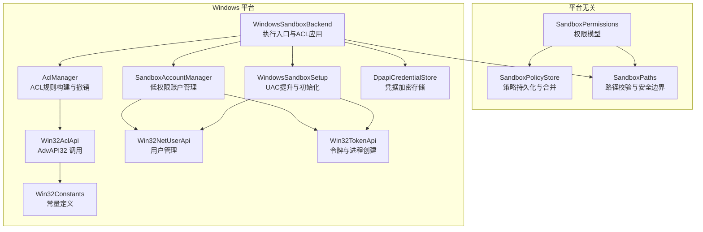
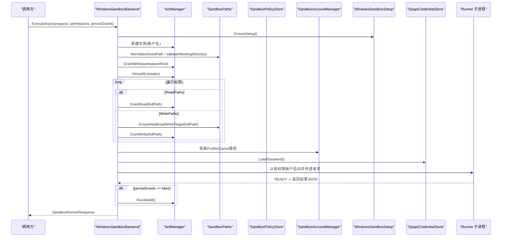
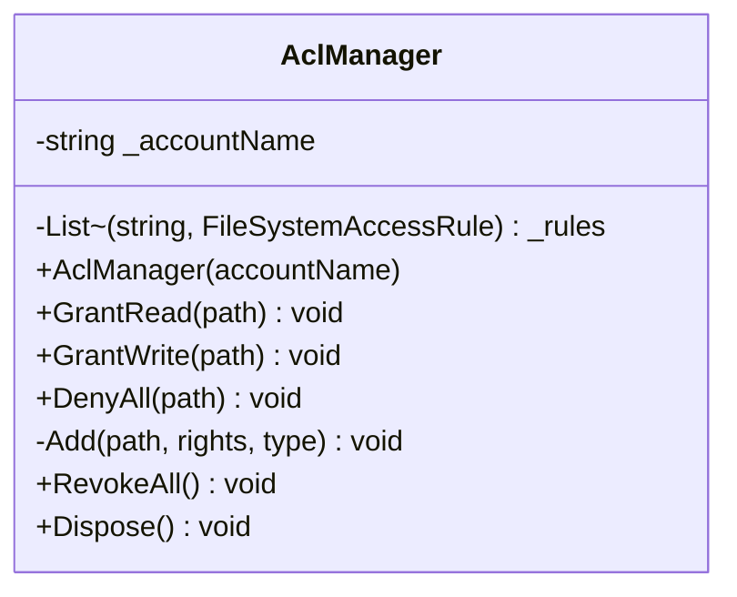
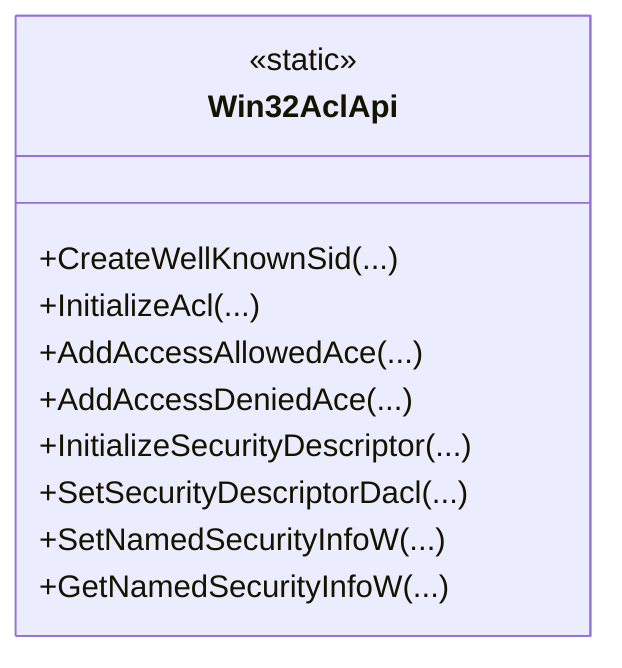
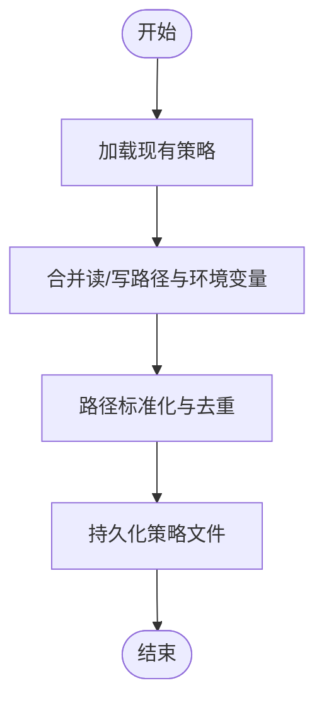
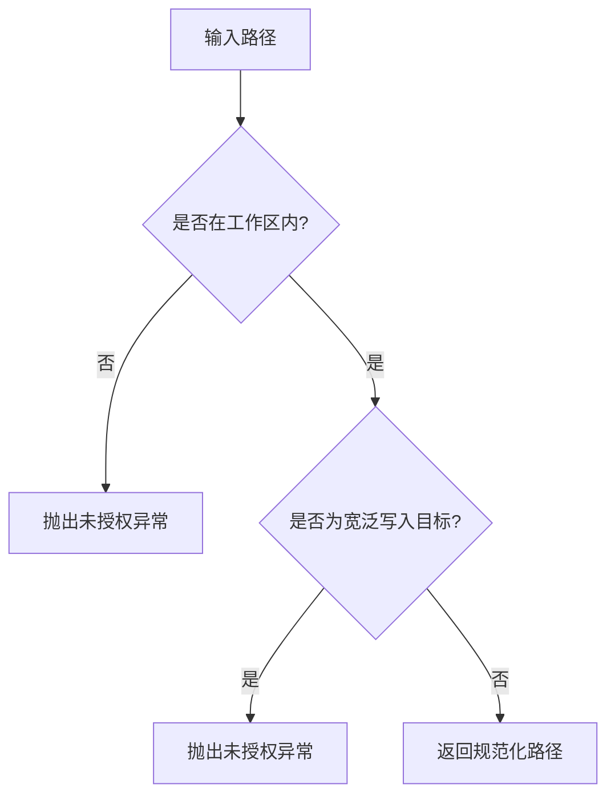
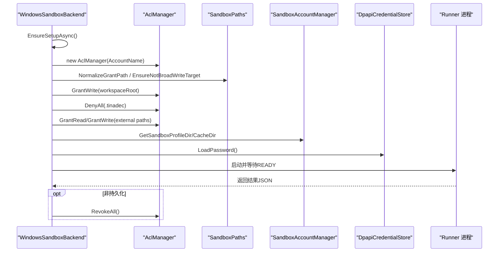
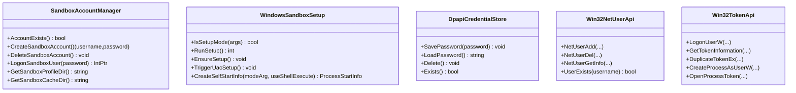
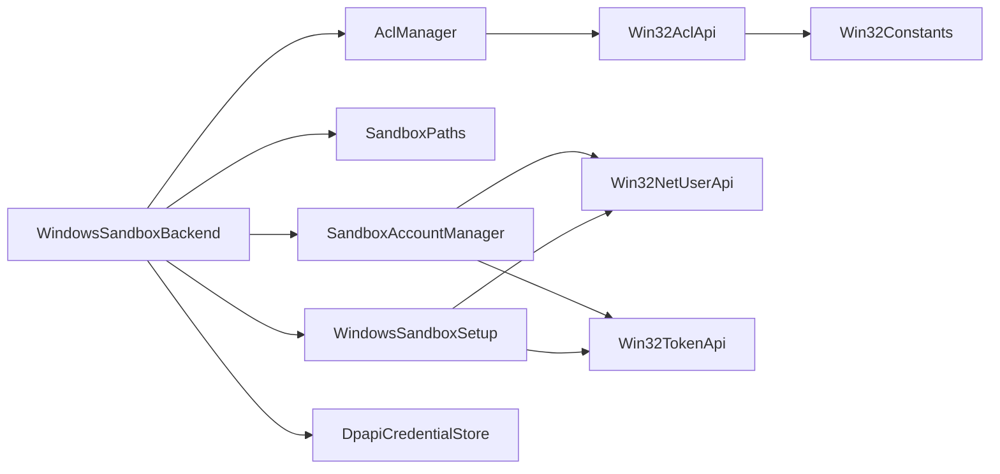

# 权限控制系统

<cite>
**本文引用的文件**   
- [AclManager.cs](file://TinadecTools/Runtime/Sandbox/Windows/AclManager.cs)
- [Win32AclApi.cs](file://TinadecTools/Runtime/Sandbox/Windows/Win32AclApi.cs)
- [SandboxPolicyStore.cs](file://TinadecTools/Runtime/Sandbox/SandboxPolicyStore.cs)
- [SandboxContracts.cs](file://TinadecTools/Runtime/Sandbox/SandboxContracts.cs)
- [WindowsSandboxBackend.cs](file://TinadecTools/Runtime/Sandbox/Windows/WindowsSandboxBackend.cs)
- [Win32Constants.cs](file://TinadecTools/Runtime/Sandbox/Windows/Win32Constants.cs)
- [SandboxAccountManager.cs](file://TinadecTools/Runtime/Sandbox/Windows/SandboxAccountManager.cs)
- [WindowsSandboxSetup.cs](file://TinadecTools/Runtime/Sandbox/Windows/WindowsSandboxSetup.cs)
- [SandboxPaths.cs](file://TinadecTools/Runtime/Sandbox/SandboxPaths.cs)
- [Win32NetUserApi.cs](file://TinadecTools/Runtime/Sandbox/Windows/Win32NetUserApi.cs)
- [Win32TokenApi.cs](file://TinadecTools/Runtime/Sandbox/Windows/Win32TokenApi.cs)
- [DpapiCredentialStore.cs](file://TinadecTools/Runtime/Sandbox/Windows/DpapiCredentialStore.cs)
</cite>

## 目录
1. [简介](#简介)
2. [项目结构](#项目结构)
3. [核心组件](#核心组件)
4. [架构总览](#架构总览)
5. [详细组件分析](#详细组件分析)
6. [依赖关系分析](#依赖关系分析)
7. [性能考虑](#性能考虑)
8. [故障排查指南](#故障排查指南)
9. [结论](#结论)
10. [附录](#附录)

## 简介
本文件系统性地阐述沙箱权限控制体系，重点覆盖：
- AclManager 的 ACL 权限管理机制与 Win32AclApi 的底层 API 封装
- GrantRead、GrantWrite、DenyAll 等权限操作方法及其语义
- 文件系统权限设置、权限继承控制、权限撤销机制
- SandboxPermissions 权限模型设计、读写路径验证、权限合并策略
- ACL 应用的原子性操作、错误处理与回滚机制
- 权限配置最佳实践、常见问题排查与性能优化建议
- 与 Windows 安全模型的集成方式及权限边界定义

## 项目结构
该权限子系统位于 TinadecTools 的 Runtime\Sandbox 与 Windows 子目录中，采用“平台抽象 + Windows 实现”的分层组织：
- 平台无关层：权限模型、策略存储、路径校验
- Windows 平台层：ACL 管理、账户与令牌、DPAPI 凭据、进程执行

**图表来源** 
- [SandboxContracts.cs:10-23](file://TinadecTools/Runtime/Sandbox/SandboxContracts.cs#L10-L23)
- [SandboxPolicyStore.cs:18-83](file://TinadecTools/Runtime/Sandbox/SandboxPolicyStore.cs#L18-L83)
- [SandboxPaths.cs:18-113](file://TinadecTools/Runtime/Sandbox/SandboxPaths.cs#L18-L113)
- [WindowsSandboxBackend.cs:23-97](file://TinadecTools/Runtime/Sandbox/Windows/WindowsSandboxBackend.cs#L23-L97)
- [AclManager.cs:12-58](file://TinadecTools/Runtime/Sandbox/Windows/AclManager.cs#L12-L58)
- [Win32AclApi.cs:5-55](file://TinadecTools/Runtime/Sandbox/Windows/Win32AclApi.cs#L5-L55)
- [SandboxAccountManager.cs:8-88](file://TinadecTools/Runtime/Sandbox/Windows/SandboxAccountManager.cs#L8-L88)
- [WindowsSandboxSetup.cs:14-86](file://TinadecTools/Runtime/Sandbox/Windows/WindowsSandboxSetup.cs#L14-L86)
- [DpapiCredentialStore.cs:14-59](file://TinadecTools/Runtime/Sandbox/Windows/DpapiCredentialStore.cs#L14-L59)
- [Win32NetUserApi.cs:5-34](file://TinadecTools/Runtime/Sandbox/Windows/Win32NetUserApi.cs#L5-L34)
- [Win32TokenApi.cs:6-42](file://TinadecTools/Runtime/Sandbox/Windows/Win32TokenApi.cs#L6-L42)
- [Win32Constants.cs:3-78](file://TinadecTools/Runtime/Sandbox/Windows/Win32Constants.cs#L3-L78)

**章节来源**
- [SandboxContracts.cs:10-23](file://TinadecTools/Runtime/Sandbox/SandboxContracts.cs#L10-L23)
- [SandboxPolicyStore.cs:18-83](file://TinadecTools/Runtime/Sandbox/SandboxPolicyStore.cs#L18-L83)
- [SandboxPaths.cs:18-113](file://TinadecTools/Runtime/Sandbox/SandboxPaths.cs#L18-L113)
- [WindowsSandboxBackend.cs:23-97](file://TinadecTools/Runtime/Sandbox/Windows/WindowsSandboxBackend.cs#L23-L97)

## 核心组件
- AclManager：面向工作区与外部路径的 ACL 规则构建、追加与撤销，支持继承标志与 Deny 优先策略。
- Win32AclApi：对 AdvAPI32 的 ACL/SD 相关函数进行 P/Invoke 封装（用于更细粒度的 DACL 构建）。
- SandboxPermissions：声明沙箱运行所需的读/写路径与环境变量白名单。
- SandboxPolicyStore：加载/合并/保存策略文件，提供幂等的并集合并策略。
- WindowsSandboxBackend：将权限应用到目标路径、构造受限环境、以低权限账户启动 Runner 子进程并回收权限。
- SandboxPaths：工作区隔离、外部授权路径规范化、禁止宽泛写入目标校验。
- SandboxAccountManager / WindowsSandboxSetup / DpapiCredentialStore / Win32NetUserApi / Win32TokenApi：账户生命周期、凭据保护、令牌与进程创建。

**章节来源**
- [AclManager.cs:12-58](file://TinadecTools/Runtime/Sandbox/Windows/AclManager.cs#L12-L58)
- [Win32AclApi.cs:5-55](file://TinadecTools/Runtime/Sandbox/Windows/Win32AclApi.cs#L5-L55)
- [SandboxContracts.cs:10-23](file://TinadecTools/Runtime/Sandbox/SandboxContracts.cs#L10-L23)
- [SandboxPolicyStore.cs:18-83](file://TinadecTools/Runtime/Sandbox/SandboxPolicyStore.cs#L18-L83)
- [WindowsSandboxBackend.cs:23-97](file://TinadecTools/Runtime/Sandbox/Windows/WindowsSandboxBackend.cs#L23-L97)
- [SandboxPaths.cs:18-113](file://TinadecTools/Runtime/Sandbox/SandboxPaths.cs#L18-L113)
- [SandboxAccountManager.cs:8-88](file://TinadecTools/Runtime/Sandbox/Windows/SandboxAccountManager.cs#L8-L88)
- [WindowsSandboxSetup.cs:14-86](file://TinadecTools/Runtime/Sandbox/Windows/WindowsSandboxSetup.cs#L14-L86)
- [DpapiCredentialStore.cs:14-59](file://TinadecTools/Runtime/Sandbox/Windows/DpapiCredentialStore.cs#L14-L59)
- [Win32NetUserApi.cs:5-34](file://TinadecTools/Runtime/Sandbox/Windows/Win32NetUserApi.cs#L5-L34)
- [Win32TokenApi.cs:6-44](file://TinadecTools/Runtime/Sandbox/Windows/Win32TokenApi.cs#L6-L44)

## 架构总览
下图展示一次沙箱执行的端到端流程：后端根据权限模型生成 ACL 规则，以低权限账户启动 Runner，并在完成后按策略撤销临时权限或持久化策略。

**图表来源** 
- [WindowsSandboxBackend.cs:23-97](file://TinadecTools/Runtime/Sandbox/Windows/WindowsSandboxBackend.cs#L23-L97)
- [SandboxPaths.cs:18-60](file://TinadecTools/Runtime/Sandbox/SandboxPaths.cs#L18-L60)
- [AclManager.cs:17-38](file://TinadecTools/Runtime/Sandbox/Windows/AclManager.cs#L17-L38)
- [SandboxAccountManager.cs:65-76](file://TinadecTools/Runtime/Sandbox/Windows/SandboxAccountManager.cs#L65-L76)
- [DpapiCredentialStore.cs:34-53](file://TinadecTools/Runtime/Sandbox/Windows/DpapiCredentialStore.cs#L34-L53)

## 详细组件分析

### AclManager：ACL 权限管理
- 职责：为指定账户在目标路径上添加 Allow/Deny 规则，记录规则以便后续撤销；支持容器与对象继承。
- 关键方法：
  - GrantRead(path)：授予读取与执行权限（Allow）
  - GrantWrite(path)：授予修改权限（Allow）
  - DenyAll(path)：拒绝完全控制（Deny），利用 Deny 优先原则强化隔离
  - RevokeAll()：按逆序移除已添加的规则，确保清理稳定
- 继承控制：使用 ContainerInherit | ObjectInherit 使规则对子项生效；PropagationFlags.None 避免复杂传播。
- 错误处理：RevokeAll 捕获异常以保证清理不掩盖上层命令结果，允许下次重置重试。

**图表来源** 
- [AclManager.cs:7-61](file://TinadecTools/Runtime/Sandbox/Windows/AclManager.cs#L7-L61)

**章节来源**
- [AclManager.cs:17-58](file://TinadecTools/Runtime/Sandbox/Windows/AclManager.cs#L17-L58)

### Win32AclApi：底层权限控制封装
- 职责：封装 AdvAPI32 的 ACL/SecurityDescriptor 相关函数，便于后续扩展更细粒度的 DACL 构建。
- 主要接口：CreateWellKnownSid、InitializeAcl、AddAccessAllowedAce/AddAccessDeniedAce、InitializeSecurityDescriptor、SetSecurityDescriptorDacl、SetNamedSecurityInfoW、GetNamedSecurityInfoW。
- 适用场景：当需要绕过托管 API 限制或使用自定义 DACL 时，可直接调用这些 P/Invoke 方法。

**图表来源** 
- [Win32AclApi.cs:5-55](file://TinadecTools/Runtime/Sandbox/Windows/Win32AclApi.cs#L5-L55)

**章节来源**
- [Win32AclApi.cs:5-55](file://TinadecTools/Runtime/Sandbox/Windows/Win32AclApi.cs#L5-L55)

### SandboxPermissions 与策略合并
- 权限模型：包含 ReadPaths、WritePaths、EnvironmentVariableNames 三个列表，描述沙箱可访问的资源范围。
- 策略文件：SandboxPolicyFile 持久化版本、读/写路径与环境变量白名单。
- 合并策略：MergeGrants 对现有策略与新权限做并集合并，去重、标准化路径尾斜杠、大小写敏感策略（Windows 忽略大小写）。
- 持久化：Save/MergeAndPersist 保证幂等更新；Delete 删除策略文件。

**图表来源** 
- [SandboxPolicyStore.cs:18-83](file://TinadecTools/Runtime/Sandbox/SandboxPolicyStore.cs#L18-L83)

**章节来源**
- [SandboxContracts.cs:10-23](file://TinadecTools/Runtime/Sandbox/SandboxContracts.cs#L10-L23)
- [SandboxPolicyStore.cs:18-83](file://TinadecTools/Runtime/Sandbox/SandboxPolicyStore.cs#L18-L83)

### 路径验证与安全边界
- 工作目录校验：ValidateWorkingDirectory 强制工作目录在工作区内且存在。
- 外部授权路径规范化：NormalizeGrantPath 解析绝对路径并检查存在性。
- 禁止宽泛写入：EnsureNotBroadWriteTarget 阻止磁盘根与系统关键目录作为写入目标。
- 能力 SID：DeriveCapabilitySid 基于工作区根哈希派生能力标识符（用于未来能力绑定）。

**图表来源** 
- [SandboxPaths.cs:18-60](file://TinadecTools/Runtime/Sandbox/SandboxPaths.cs#L18-L60)

**章节来源**
- [SandboxPaths.cs:18-113](file://TinadecTools/Runtime/Sandbox/SandboxPaths.cs#L18-L113)

### WindowsSandboxBackend：执行与权限应用
- 执行流程：
  - EnsureSetupAsync：确保平台支持与账户初始化
  - ApplyAcls：对工作区授予写权限，对 .tinadec 目录 DenyAll，再按权限模型授予外部读/写
  - 构建受限环境变量（Profile/Cache）与环境变量白名单
  - 通过 Runner 子进程执行任务，等待 READY 后发送请求并接收结果
  - 非持久化模式：finally 中撤销所有 ACL 规则
- 重置流程：删除策略文件，可选删除账户与缓存/配置文件目录。

**图表来源** 
- [WindowsSandboxBackend.cs:23-97](file://TinadecTools/Runtime/Sandbox/Windows/WindowsSandboxBackend.cs#L23-L97)
- [SandboxPaths.cs:18-60](file://TinadecTools/Runtime/Sandbox/SandboxPaths.cs#L18-L60)
- [SandboxAccountManager.cs:65-76](file://TinadecTools/Runtime/Sandbox/Windows/SandboxAccountManager.cs#L65-L76)
- [DpapiCredentialStore.cs:34-53](file://TinadecTools/Runtime/Sandbox/Windows/DpapiCredentialStore.cs#L34-L53)

**章节来源**
- [WindowsSandboxBackend.cs:23-97](file://TinadecTools/Runtime/Sandbox/Windows/WindowsSandboxBackend.cs#L23-L97)

### 账户与凭据管理
- SandboxAccountManager：创建/删除低权限账户，生成随机密码，登录获取令牌，计算 Profile/Cache 目录。
- WindowsSandboxSetup：检测/触发 UAC 提升，确保账户存在；自启动参数模式切换。
- DpapiCredentialStore：使用 DPAPI 加密/解密密码，本地文件存储，支持存在性检查与删除。
- Win32NetUserApi / Win32TokenApi：用户增删查、令牌信息、进程以用户身份创建。

**图表来源** 
- [SandboxAccountManager.cs:8-88](file://TinadecTools/Runtime/Sandbox/Windows/SandboxAccountManager.cs#L8-L88)
- [WindowsSandboxSetup.cs:14-86](file://TinadecTools/Runtime/Sandbox/Windows/WindowsSandboxSetup.cs#L14-L86)
- [DpapiCredentialStore.cs:14-59](file://TinadecTools/Runtime/Sandbox/Windows/DpapiCredentialStore.cs#L14-L59)
- [Win32NetUserApi.cs:5-34](file://TinadecTools/Runtime/Sandbox/Windows/Win32NetUserApi.cs#L5-L34)
- [Win32TokenApi.cs:6-44](file://TinadecTools/Runtime/Sandbox/Windows/Win32TokenApi.cs#L6-L44)

**章节来源**
- [SandboxAccountManager.cs:16-63](file://TinadecTools/Runtime/Sandbox/Windows/SandboxAccountManager.cs#L16-L63)
- [WindowsSandboxSetup.cs:29-61](file://TinadecTools/Runtime/Sandbox/Windows/WindowsSandboxSetup.cs#L29-L61)
- [DpapiCredentialStore.cs:14-59](file://TinadecTools/Runtime/Sandbox/Windows/DpapiCredentialStore.cs#L14-L59)
- [Win32NetUserApi.cs:26-34](file://TinadecTools/Runtime/Sandbox/Windows/Win32NetUserApi.cs#L26-L34)
- [Win32TokenApi.cs:8-44](file://TinadecTools/Runtime/Sandbox/Windows/Win32TokenApi.cs#L8-L44)

## 依赖关系分析
- WindowsSandboxBackend 依赖 AclManager、SandboxPaths、SandboxAccountManager、WindowsSandboxSetup、DpapiCredentialStore。
- AclManager 依赖 System.Security.AccessControl（FileSystemAccessRule）与 Win32AclApi（预留扩展点）。
- SandboxPolicyStore 依赖 JSON 序列化上下文与 WorkspacePathResolver（由工具运行时提供）。
- 账户与令牌模块依赖 Win32NetUserApi、Win32TokenApi、Win32Constants。

**图表来源** 
- [WindowsSandboxBackend.cs:23-97](file://TinadecTools/Runtime/Sandbox/Windows/WindowsSandboxBackend.cs#L23-L97)
- [AclManager.cs:17-38](file://TinadecTools/Runtime/Sandbox/Windows/AclManager.cs#L17-L38)
- [SandboxPaths.cs:18-60](file://TinadecTools/Runtime/Sandbox/SandboxPaths.cs#L18-L60)
- [SandboxAccountManager.cs:16-63](file://TinadecTools/Runtime/Sandbox/Windows/SandboxAccountManager.cs#L16-L63)
- [WindowsSandboxSetup.cs:29-61](file://TinadecTools/Runtime/Sandbox/Windows/WindowsSandboxSetup.cs#L29-L61)
- [DpapiCredentialStore.cs:14-59](file://TinadecTools/Runtime/Sandbox/Windows/DpapiCredentialStore.cs#L14-L59)
- [Win32AclApi.cs:5-55](file://TinadecTools/Runtime/Sandbox/Windows/Win32AclApi.cs#L5-L55)
- [Win32NetUserApi.cs:5-34](file://TinadecTools/Runtime/Sandbox/Windows/Win32NetUserApi.cs#L5-34)
- [Win32TokenApi.cs:6-44](file://TinadecTools/Runtime/Sandbox/Windows/Win32TokenApi.cs#L6-44)
- [Win32Constants.cs:3-78](file://TinadecTools/Runtime/Sandbox/Windows/Win32Constants.cs#L3-78)

**章节来源**
- [WindowsSandboxBackend.cs:23-97](file://TinadecTools/Runtime/Sandbox/Windows/WindowsSandboxBackend.cs#L23-L97)
- [AclManager.cs:17-38](file://TinadecTools/Runtime/Sandbox/Windows/AclManager.cs#L17-L38)
- [SandboxPaths.cs:18-60](file://TinadecTools/Runtime/Sandbox/SandboxPaths.cs#L18-L60)

## 性能考虑
- ACL 批量应用：尽量合并相同路径的权限申请，减少 SetAccessControl 调用次数。
- 路径规范化与去重：SandboxPolicyStore 的 Union 已实现去重与排序，避免重复写入。
- 进程启动开销：Runner 子进程启动涉及令牌与 DPAPI 解密，应复用会话或批量化任务以降低频率。
- 撤销成本：RevokeAll 逆序移除规则，建议在非持久化模式下仅保留必要规则以减少清理时间。
- I/O 最小化：仅在必要时创建 .tinadec 目录与策略文件，避免频繁刷新。

[本节为通用指导，无需引用具体文件]

## 故障排查指南
- 工作目录不在工作区内：检查 ValidateWorkingDirectory 抛出的 UnauthorizedAccessException，确认传入路径是否被规范化到工作区根。
- 宽泛写入目标被拒绝：EnsureNotBroadWriteTarget 会阻止磁盘根与系统目录，调整 WritePaths 为更具体的子目录。
- 权限未生效：确认 AclManager 的继承标志是否正确，以及 DenyAll 是否覆盖了预期路径。
- 账户不存在或凭据缺失：检查 DpapiCredentialStore.Exists 与 SandboxAccountManager.AccountExists；必要时运行机器级重置。
- Runner 初始化失败：查看 READY 前输出与 stderr，确认进程启动参数与编码设置。
- 权限未撤销：在非持久化模式下，确保 finally 分支执行；若异常中断，手动执行 Reset 或重启服务。

**章节来源**
- [SandboxPaths.cs:18-60](file://TinadecTools/Runtime/Sandbox/SandboxPaths.cs#L18-L60)
- [AclManager.cs:40-58](file://TinadecTools/Runtime/Sandbox/Windows/AclManager.cs#L40-L58)
- [DpapiCredentialStore.cs:34-59](file://TinadecTools/Runtime/Sandbox/Windows/DpapiCredentialStore.cs#L34-L59)
- [WindowsSandboxBackend.cs:119-153](file://TinadecTools/Runtime/Sandbox/Windows/WindowsSandboxBackend.cs#L119-L153)

## 结论
本权限控制系统通过分层设计与严格的边界校验，实现了沙箱内进程的精细化资源访问控制。AclManager 负责规则的构建与撤销，Win32AclApi 提供底层扩展点，SandboxPermissions 与 SandboxPolicyStore 共同维护可审计的策略状态。WindowsSandboxBackend 将权限应用与受限环境构建整合到执行流程中，并通过 DenyAll 与工作区隔离确保最小权限原则。配合 DPAPI 与账户管理，系统在安全性与可用性之间取得平衡。

[本节为总结性内容，无需引用具体文件]

## 附录

### 权限配置最佳实践
- 明确最小权限：仅授予必要的读/写路径，避免宽泛目录。
- 使用 DenyAll 强化隔离：对共享目录（如 .tinadec）显式拒绝完全控制。
- 策略幂等合并：利用 MergeGrants 累积权限，避免覆盖丢失。
- 定期清理：非持久化模式下确保 RevokeAll 执行；必要时执行 Reset。
- 监控与审计：记录策略变更与异常，便于回溯问题。

[本节为通用指导，无需引用具体文件]

### 常见权限问题排查清单
- 路径合法性：是否在工作区内？是否存在？是否被规范化？
- 写入目标：是否命中禁止宽泛目标？
- 继承与传播：ContainerInherit/ObjectInherit 是否符合预期？
- 账户与令牌：账户是否存在？凭据是否有效？
- 进程通信：READY 协议是否正常？stderr 是否有错误信息？

**章节来源**
- [SandboxPaths.cs:18-60](file://TinadecTools/Runtime/Sandbox/SandboxPaths.cs#L18-L60)
- [WindowsSandboxBackend.cs:119-153](file://TinadecTools/Runtime/Sandbox/Windows/WindowsSandboxBackend.cs#L119-L153)

### 与 Windows 安全模型的集成与边界
- 账户隔离：使用独立低权限账户运行 Runner，限制默认权限。
- DACL 控制：通过 FileSystemAccessRule 与 Deny 优先策略精确控制访问。
- 令牌与进程：以用户令牌创建进程，确保权限边界不被继承。
- 能力 SID：基于工作区根哈希派生能力标识，可用于未来能力绑定。

**章节来源**
- [SandboxAccountManager.cs:16-63](file://TinadecTools/Runtime/Sandbox/Windows/SandboxAccountManager.cs#L16-L63)
- [AclManager.cs:23-38](file://TinadecTools/Runtime/Sandbox/Windows/AclManager.cs#L23-L38)
- [Win32TokenApi.cs:8-44](file://TinadecTools/Runtime/Sandbox/Windows/Win32TokenApi.cs#L8-L44)
- [SandboxPaths.cs:98-113](file://TinadecTools/Runtime/Sandbox/SandboxPaths.cs#L98-L113)