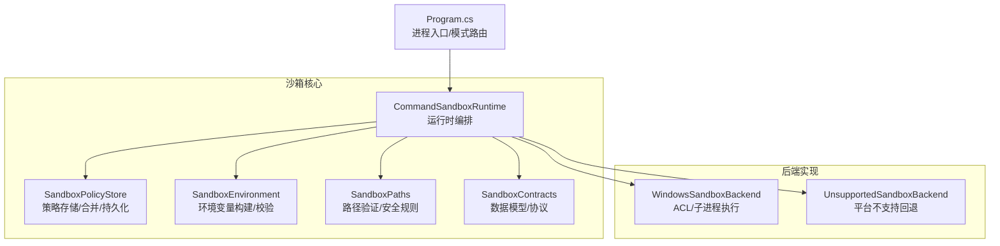
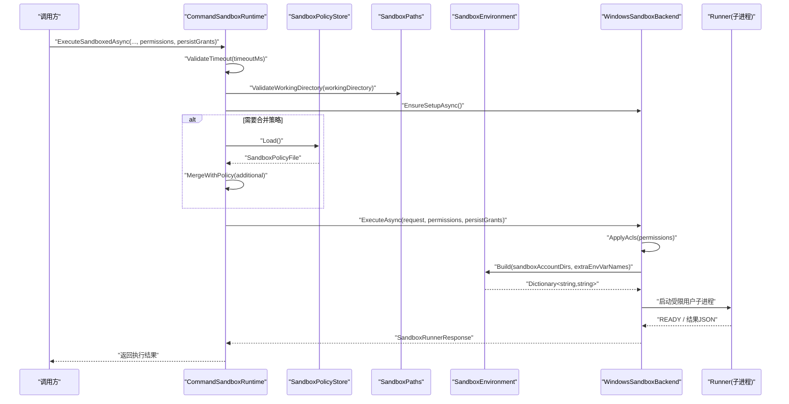
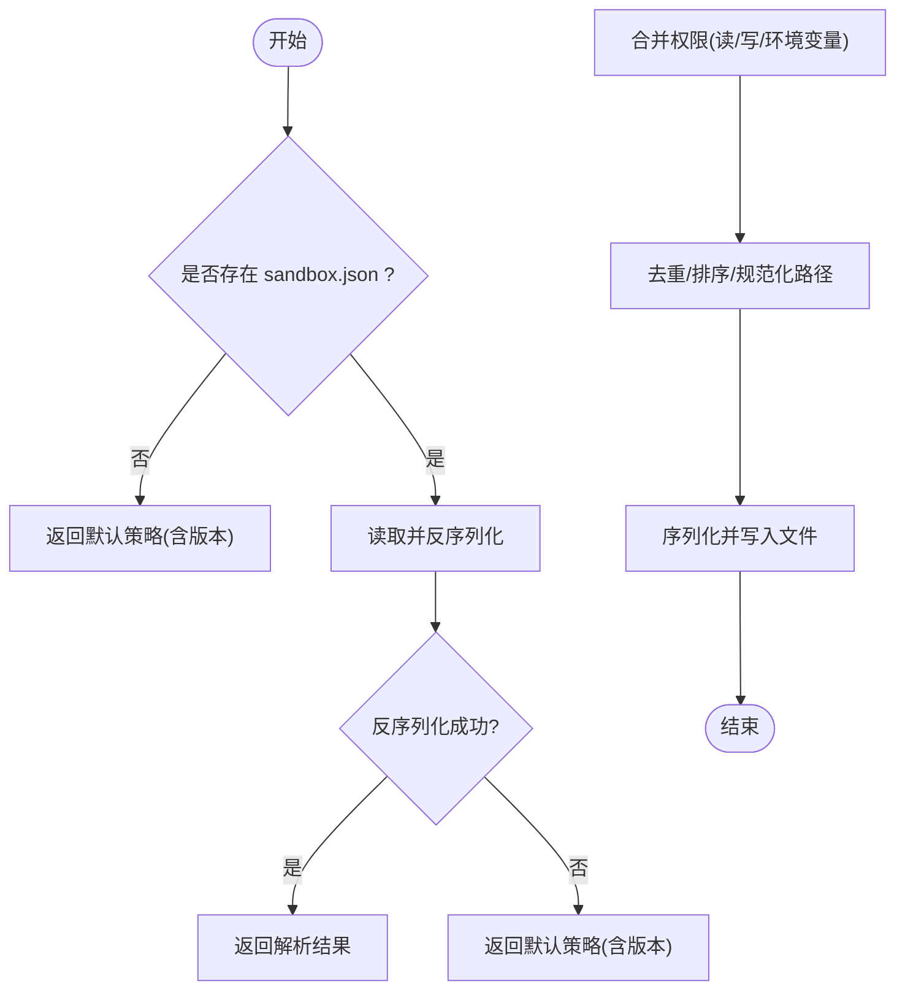
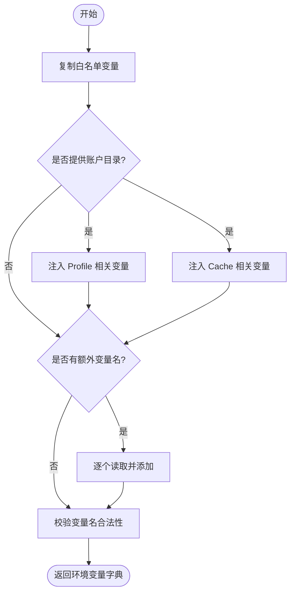
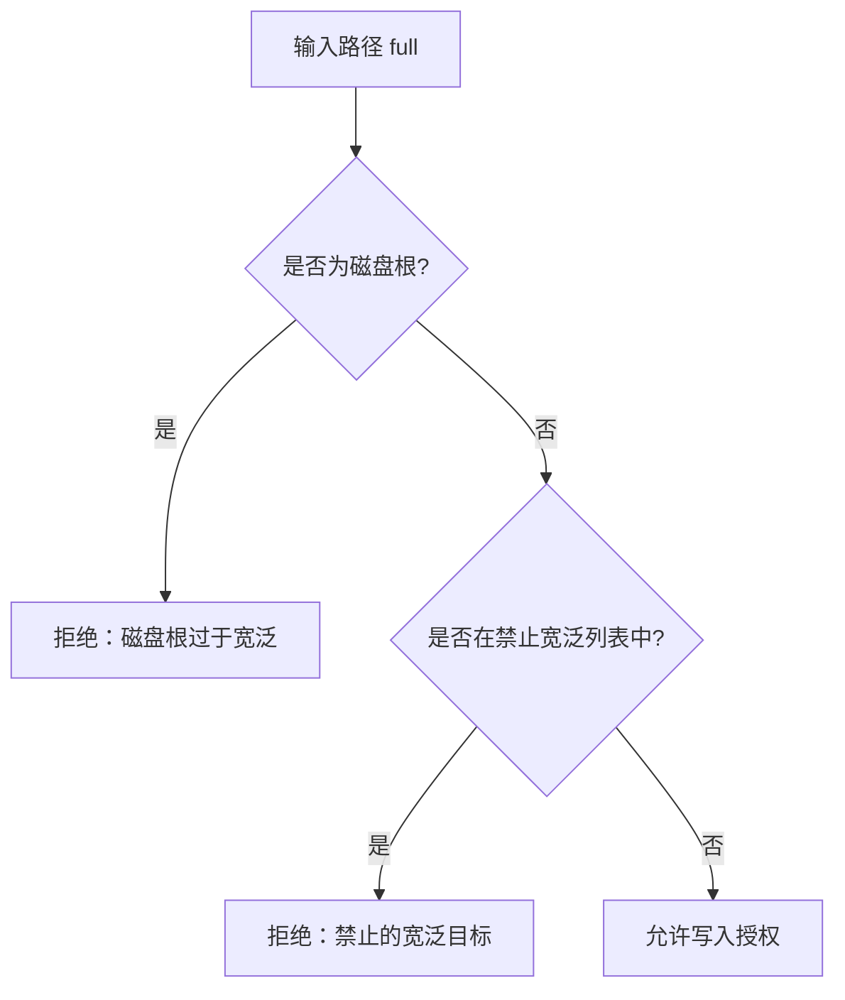
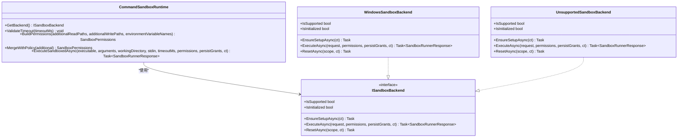
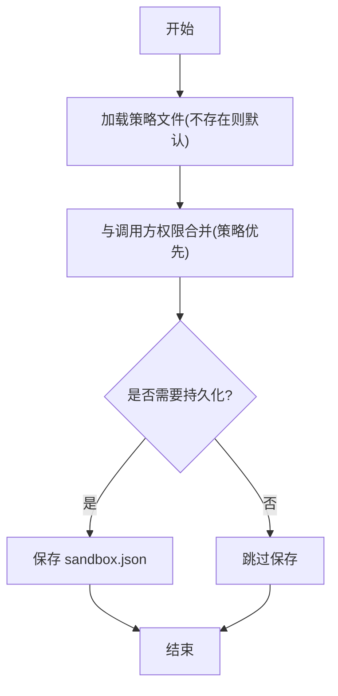
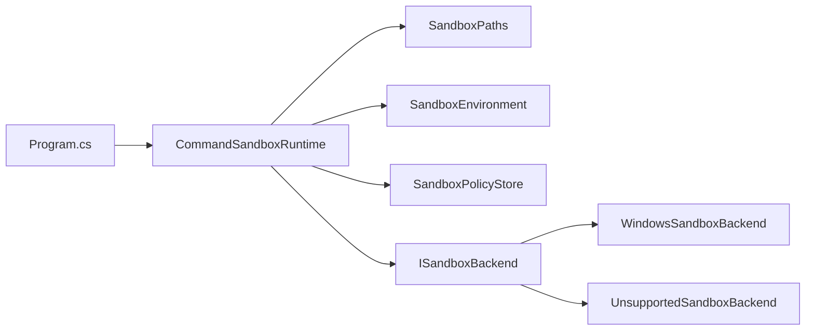

# 沙箱策略管理

<cite>
**本文引用的文件**   
- [SandboxPolicyStore.cs](file://TinadecTools/Runtime/Sandbox/SandboxPolicyStore.cs)
- [SandboxEnvironment.cs](file://TinadecTools/Runtime/Sandbox/SandboxEnvironment.cs)
- [SandboxPaths.cs](file://TinadecTools/Runtime/Sandbox/SandboxPaths.cs)
- [SandboxContracts.cs](file://TinadecTools/Runtime/Sandbox/SandboxContracts.cs)
- [CommandSandboxRuntime.cs](file://TinadecTools/Runtime/Sandbox/CommandSandboxRuntime.cs)
- [WindowsSandboxBackend.cs](file://TinadecTools/Runtime/Sandbox/Windows/WindowsSandboxBackend.cs)
- [UnsupportedSandboxBackend.cs](file://TinadecTools/Runtime/Sandbox/UnsupportedSandboxBackend.cs)
- [Program.cs](file://TinadecTools/Program.cs)
</cite>

## 目录
1. [简介](#简介)
2. [项目结构](#项目结构)
3. [核心组件](#核心组件)
4. [架构总览](#架构总览)
5. [详细组件分析](#详细组件分析)
6. [依赖关系分析](#依赖关系分析)
7. [性能考量](#性能考量)
8. [故障排查指南](#故障排查指南)
9. [结论](#结论)
10. [附录](#附录)

## 简介
本文件面向“沙箱策略管理系统”，围绕以下目标展开：
- 策略存储机制（SandboxPolicyStore）与持久化格式、版本控制
- 环境变量配置（SandboxEnvironment）的白名单与敏感信息过滤
- 策略加载顺序、默认策略继承、动态策略更新
- 文件系统访问策略、网络访问控制、系统资源限制
- 策略验证机制、冲突解决、版本管理
- 路径验证与安全校验（SandboxPaths），包括工作区检查 IsWithinWorkspace、写入目标校验 EnsureNotBroadWriteTarget
- 策略配置示例、自定义策略开发与测试方法

## 项目结构
沙箱策略相关代码集中在 TinadecTools/Runtime/Sandbox 目录下，按职责划分为：
- 策略存储与合并：SandboxPolicyStore
- 环境构建与校验：SandboxEnvironment
- 路径约束与安全校验：SandboxPaths
- 运行时编排与权限装配：CommandSandboxRuntime
- 后端实现（当前为 Windows）：WindowsSandboxBackend
- 协议与数据模型：SandboxContracts
- 不支持平台回退：UnsupportedSandboxBackend
- 进程入口与模式切换：Program.cs

**图表来源** 
- [CommandSandboxRuntime.cs:1-129](file://TinadecTools/Runtime/Sandbox/CommandSandboxRuntime.cs#L1-L129)
- [SandboxPolicyStore.cs:1-83](file://TinadecTools/Runtime/Sandbox/SandboxPolicyStore.cs#L1-L83)
- [SandboxEnvironment.cs:1-69](file://TinadecTools/Runtime/Sandbox/SandboxEnvironment.cs#L1-L69)
- [SandboxPaths.cs:1-113](file://TinadecTools/Runtime/Sandbox/SandboxPaths.cs#L1-L113)
- [SandboxContracts.cs:1-71](file://TinadecTools/Runtime/Sandbox/SandboxContracts.cs#L1-L71)
- [WindowsSandboxBackend.cs:1-161](file://TinadecTools/Runtime/Sandbox/Windows/WindowsSandboxBackend.cs#L1-L161)
- [UnsupportedSandboxBackend.cs:1-19](file://TinadecTools/Runtime/Sandbox/UnsupportedSandboxBackend.cs#L1-L19)
- [Program.cs:1-68](file://TinadecTools/Program.cs#L1-L68)

**章节来源**
- [CommandSandboxRuntime.cs:1-129](file://TinadecTools/Runtime/Sandbox/CommandSandboxRuntime.cs#L1-L129)
- [SandboxPolicyStore.cs:1-83](file://TinadecTools/Runtime/Sandbox/SandboxPolicyStore.cs#L1-L83)
- [SandboxEnvironment.cs:1-69](file://TinadecTools/Runtime/Sandbox/SandboxEnvironment.cs#L1-L69)
- [SandboxPaths.cs:1-113](file://TinadecTools/Runtime/Sandbox/SandboxPaths.cs#L1-L113)
- [SandboxContracts.cs:1-71](file://TinadecTools/Runtime/Sandbox/SandboxContracts.cs#L1-L71)
- [WindowsSandboxBackend.cs:1-161](file://TinadecTools/Runtime/Sandbox/Windows/WindowsSandboxBackend.cs#L1-L161)
- [UnsupportedSandboxBackend.cs:1-19](file://TinadecTools/Runtime/Sandbox/UnsupportedSandboxBackend.cs#L1-L19)
- [Program.cs:1-68](file://TinadecTools/Program.cs#L1-L68)

## 核心组件
- SandboxPolicyStore：负责读取、合并、保存和删除沙箱策略文件（sandbox.json），维护版本号并去重规范化路径。
- SandboxEnvironment：基于白名单从宿主环境提取变量，结合沙箱账户目录注入缓存/配置文件路径，并对变量名进行合法性校验。
- SandboxPaths：提供工作区边界检查、外部授权路径归一化、禁止宽泛写入目标检测、磁盘根判断以及能力 SID 派生（Windows）。
- CommandSandboxRuntime：组装权限（读/写/环境变量）、校验超时与工作目录、选择后端并执行；支持将额外权限与策略文件合并。
- WindowsSandboxBackend：在 Windows 上通过 ACL 授予最小权限、隔离 .tinadec 目录、以受限用户启动子进程并通过标准输入输出与 Runner 通信。
- UnsupportedSandboxBackend：在非 Windows 或不可用场景抛出平台不支持异常。
- SandboxContracts：定义策略文件、权限对象、Runner 请求/响应及 JSON 序列化上下文。

**章节来源**
- [SandboxPolicyStore.cs:1-83](file://TinadecTools/Runtime/Sandbox/SandboxPolicyStore.cs#L1-L83)
- [SandboxEnvironment.cs:1-69](file://TinadecTools/Runtime/Sandbox/SandboxEnvironment.cs#L1-L69)
- [SandboxPaths.cs:1-113](file://TinadecTools/Runtime/Sandbox/SandboxPaths.cs#L1-L113)
- [CommandSandboxRuntime.cs:1-129](file://TinadecTools/Runtime/Sandbox/CommandSandboxRuntime.cs#L1-L129)
- [WindowsSandboxBackend.cs:1-161](file://TinadecTools/Runtime/Sandbox/Windows/WindowsSandboxBackend.cs#L1-L161)
- [UnsupportedSandboxBackend.cs:1-19](file://TinadecTools/Runtime/Sandbox/UnsupportedSandboxBackend.cs#L1-L19)
- [SandboxContracts.cs:1-71](file://TinadecTools/Runtime/Sandbox/SandboxContracts.cs#L1-L71)

## 架构总览
下图展示一次沙箱执行的端到端流程，涵盖策略加载、权限装配、ACL 应用、环境变量构建与子进程执行。

**图表来源** 
- [CommandSandboxRuntime.cs:96-122](file://TinadecTools/Runtime/Sandbox/CommandSandboxRuntime.cs#L96-L122)
- [SandboxPolicyStore.cs:18-32](file://TinadecTools/Runtime/Sandbox/SandboxPolicyStore.cs#L18-L32)
- [SandboxPaths.cs:18-28](file://TinadecTools/Runtime/Sandbox/SandboxPaths.cs#L18-L28)
- [SandboxEnvironment.cs:16-61](file://TinadecTools/Runtime/Sandbox/SandboxEnvironment.cs#L16-L61)
- [WindowsSandboxBackend.cs:23-53](file://TinadecTools/Runtime/Sandbox/Windows/WindowsSandboxBackend.cs#L23-L53)

## 详细组件分析

### 策略存储机制（SandboxPolicyStore）
- 存储位置：工作区根下的 .tinadec/sandbox.json
- 加载逻辑：不存在则返回默认策略（含当前版本）；存在则反序列化为策略对象；异常时回退到默认策略
- 合并策略：Union 操作对读路径、写路径、环境变量名进行去重与排序，统一去除末尾分隔符并按平台大小写规则比较
- 持久化：确保目录存在后序列化写入；支持删除策略文件
- 版本管理：内置 CurrentVersion，合并时强制设置为当前版本，便于后续演进

**图表来源** 
- [SandboxPolicyStore.cs:18-32](file://TinadecTools/Runtime/Sandbox/SandboxPolicyStore.cs#L18-L32)
- [SandboxPolicyStore.cs:34-44](file://TinadecTools/Runtime/Sandbox/SandboxPolicyStore.cs#L34-L44)
- [SandboxPolicyStore.cs:46-52](file://TinadecTools/Runtime/Sandbox/SandboxPolicyStore.cs#L46-L52)
- [SandboxPolicyStore.cs:71-82](file://TinadecTools/Runtime/Sandbox/SandboxPolicyStore.cs#L71-L82)

**章节来源**
- [SandboxPolicyStore.cs:1-83](file://TinadecTools/Runtime/Sandbox/SandboxPolicyStore.cs#L1-L83)

### 环境变量配置（SandboxEnvironment）
- 白名单机制：仅保留预定义的系统/网络代理等必要变量（如 PATH、TEMP、HTTP_PROXY 等）
- 账户目录注入：根据 Profile/Cache 目录设置 USERPROFILE、APPDATA、LOCALAPPDATA、TEMP/TMP 以及 NPM_CONFIG_CACHE、NUGET_PACKAGES、PIP_CACHE_DIR、CARGO_HOME 等工具缓存路径
- 额外变量：允许传入额外变量名列表，逐个从宿主环境读取并加入
- 名称校验：拒绝包含“=”或空字符的非法变量名

**图表来源** 
- [SandboxEnvironment.cs:7-14](file://TinadecTools/Runtime/Sandbox/SandboxEnvironment.cs#L7-L14)
- [SandboxEnvironment.cs:16-61](file://TinadecTools/Runtime/Sandbox/SandboxEnvironment.cs#L16-L61)
- [SandboxEnvironment.cs:63-67](file://TinadecTools/Runtime/Sandbox/SandboxEnvironment.cs#L63-L67)

**章节来源**
- [SandboxEnvironment.cs:1-69](file://TinadecTools/Runtime/Sandbox/SandboxEnvironment.cs#L1-L69)

### 路径验证与安全检查（SandboxPaths）
- 工作目录校验：必须位于工作区内且真实存在，否则抛出相应异常
- 工作区判定：IsWithinWorkspace 支持跨平台大小写差异
- 授权路径归一化：NormalizeGrantPath 会解析绝对路径并校验目录存在
- 写入目标限制：EnsureNotBroadWriteTarget 禁止磁盘根与若干敏感/宽泛目录（Windows 下自动收集）
- 能力 SID 派生：基于工作区根哈希生成唯一 SID（Windows）

**图表来源** 
- [SandboxPaths.cs:18-28](file://TinadecTools/Runtime/Sandbox/SandboxPaths.cs#L18-L28)
- [SandboxPaths.cs:30-36](file://TinadecTools/Runtime/Sandbox/SandboxPaths.cs#L30-L36)
- [SandboxPaths.cs:40-48](file://TinadecTools/Runtime/Sandbox/SandboxPaths.cs#L40-L48)
- [SandboxPaths.cs:50-66](file://TinadecTools/Runtime/Sandbox/SandboxPaths.cs#L50-L66)
- [SandboxPaths.cs:68-82](file://TinadecTools/Runtime/Sandbox/SandboxPaths.cs#L68-L82)

**章节来源**
- [SandboxPaths.cs:1-113](file://TinadecTools/Runtime/Sandbox/SandboxPaths.cs#L1-L113)

### 运行时编排与权限装配（CommandSandboxRuntime）
- 后端选择：Windows 优先尝试 WindowsSandboxBackend，失败则回退到 UnsupportedSandboxBackend
- 超时校验：限制范围（例如 1ms~1800000ms）
- 权限构建：默认包含工作区读写；附加读/写路径需经 NormalizeGrantPath 与 EnsureNotBroadWriteTarget 校验；环境变量名需合法
- 策略合并：将策略文件的读/写/环境变量与调用方提供的权限合并（去重）
- 执行流程：校验工作目录、确保后端初始化、构造请求、调用后端 ExecuteAsync

**图表来源** 
- [CommandSandboxRuntime.cs:9-17](file://TinadecTools/Runtime/Sandbox/CommandSandboxRuntime.cs#L9-L17)
- [CommandSandboxRuntime.cs:29-35](file://TinadecTools/Runtime/Sandbox/CommandSandboxRuntime.cs#L29-L35)
- [CommandSandboxRuntime.cs:37-83](file://TinadecTools/Runtime/Sandbox/CommandSandboxRuntime.cs#L37-L83)
- [CommandSandboxRuntime.cs:85-94](file://TinadecTools/Runtime/Sandbox/CommandSandboxRuntime.cs#L85-L94)
- [CommandSandboxRuntime.cs:96-122](file://TinadecTools/Runtime/Sandbox/CommandSandboxRuntime.cs#L96-L122)
- [WindowsSandboxBackend.cs:1-21](file://TinadecTools/Runtime/Sandbox/Windows/WindowsSandboxBackend.cs#L1-L21)
- [UnsupportedSandboxBackend.cs:1-19](file://TinadecTools/Runtime/Sandbox/UnsupportedSandboxBackend.cs#L1-L19)
- [SandboxContracts.cs:52-63](file://TinadecTools/Runtime/Sandbox/SandboxContracts.cs#L52-L63)

**章节来源**
- [CommandSandboxRuntime.cs:1-129](file://TinadecTools/Runtime/Sandbox/CommandSandboxRuntime.cs#L1-L129)
- [WindowsSandboxBackend.cs:1-161](file://TinadecTools/Runtime/Sandbox/Windows/WindowsSandboxBackend.cs#L1-L161)
- [UnsupportedSandboxBackend.cs:1-19](file://TinadecTools/Runtime/Sandbox/UnsupportedSandboxBackend.cs#L1-L19)
- [SandboxContracts.cs:1-71](file://TinadecTools/Runtime/Sandbox/SandboxContracts.cs#L1-L71)

### 策略加载顺序、默认策略继承与动态更新
- 加载顺序：
  - 首次加载：若不存在 sandbox.json，返回默认策略（版本=CurrentVersion，空集合）
  - 合并阶段：先加载策略文件，再与调用方传入的权限合并（策略在前，调用方在后，去重）
- 默认策略继承：未显式声明的路径/变量为空集，由调用方按需追加
- 动态更新：
  - MergeAndPersist：合并权限并立即持久化
  - Delete：删除策略文件（用于重置）
  - ResetAsync（Windows）：可清理策略文件与账户/缓存/配置目录（按作用域）

**图表来源** 
- [SandboxPolicyStore.cs:18-32](file://TinadecTools/Runtime/Sandbox/SandboxPolicyStore.cs#L18-L32)
- [SandboxPolicyStore.cs:34-44](file://TinadecTools/Runtime/Sandbox/SandboxPolicyStore.cs#L34-L44)
- [SandboxPolicyStore.cs:64-69](file://TinadecTools/Runtime/Sandbox/SandboxPolicyStore.cs#L64-L69)
- [CommandSandboxRuntime.cs:85-94](file://TinadecTools/Runtime/Sandbox/CommandSandboxRuntime.cs#L85-L94)

**章节来源**
- [SandboxPolicyStore.cs:1-83](file://TinadecTools/Runtime/Sandbox/SandboxPolicyStore.cs#L1-L83)
- [CommandSandboxRuntime.cs:85-94](file://TinadecTools/Runtime/Sandbox/CommandSandboxRuntime.cs#L85-L94)

### 文件系统访问策略、网络访问控制与系统资源限制
- 文件系统访问：
  - 工作区默认读写
  - 外部读/写路径需经 NormalizeGrantPath 与 EnsureNotBroadWriteTarget 校验
  - Windows 后端通过 ACL 精确授予最小权限，并默认拒绝 .tinadec 目录
- 网络访问控制：
  - 通过环境变量 HTTP_PROXY/HTTPS_PROXY/ALL_PROXY/NO_PROXY 传递代理设置
  - 无显式网络端口/域名白名单，建议通过代理策略集中管控
- 系统资源限制：
  - 超时限制：ValidateTimeout 限制执行时长
  - 进程隔离：以受限用户运行子进程，避免影响宿主

**章节来源**
- [CommandSandboxRuntime.cs:29-35](file://TinadecTools/Runtime/Sandbox/CommandSandboxRuntime.cs#L29-L35)
- [CommandSandboxRuntime.cs:37-83](file://TinadecTools/Runtime/Sandbox/CommandSandboxRuntime.cs#L37-L83)
- [WindowsSandboxBackend.cs:74-97](file://TinadecTools/Runtime/Sandbox/Windows/WindowsSandboxBackend.cs#L74-L97)
- [SandboxEnvironment.cs:7-14](file://TinadecTools/Runtime/Sandbox/SandboxEnvironment.cs#L7-L14)

### 策略验证机制、冲突解决与版本管理
- 验证机制：
  - 路径：NormalizeGrantPath 要求目录存在；EnsureNotBroadWriteTarget 禁止宽泛目标
  - 环境变量名：IsEnvironmentVariableNameValid 拒绝非法字符
  - 超时：ValidateTimeout 限制范围
- 冲突解决：
  - 合并时使用 Distinct（忽略大小写）去重，保持策略在前、调用方在后
  - 路径末尾分隔符统一去除，避免重复
- 版本管理：
  - 策略文件 version 字段与 CurrentVersion 保持一致
  - 合并时强制覆盖为当前版本，便于后续兼容升级

**章节来源**
- [SandboxPaths.cs:40-66](file://TinadecTools/Runtime/Sandbox/SandboxPaths.cs#L40-L66)
- [SandboxEnvironment.cs:63-67](file://TinadecTools/Runtime/Sandbox/SandboxEnvironment.cs#L63-L67)
- [CommandSandboxRuntime.cs:29-35](file://TinadecTools/Runtime/Sandbox/CommandSandboxRuntime.cs#L29-L35)
- [CommandSandboxRuntime.cs:85-94](file://TinadecTools/Runtime/Sandbox/CommandSandboxRuntime.cs#L85-L94)
- [SandboxPolicyStore.cs:34-44](file://TinadecTools/Runtime/Sandbox/SandboxPolicyStore.cs#L34-L44)

### 环境变量白名单与敏感信息过滤
- 白名单：PATH、PATHEXT、SystemRoot、TEMP、TMP、NUMBER_OF_PROCESSORS、PROCESSOR_ARCHITECTURE、OS、ComSpec、windir、LANG、LC_ALL、LC_CTYPE、HTTP_PROXY、HTTPS_PROXY、ALL_PROXY、NO_PROXY
- 敏感过滤：除白名单与显式传入的额外变量名外，其他宿主环境变量不会被带入沙箱
- 工具缓存路径：根据沙箱账户目录注入 NPM/NuGet/Pip/Cargo 缓存路径，避免污染宿主

**章节来源**
- [SandboxEnvironment.cs:7-14](file://TinadecTools/Runtime/Sandbox/SandboxEnvironment.cs#L7-L14)
- [SandboxEnvironment.cs:29-47](file://TinadecTools/Runtime/Sandbox/SandboxEnvironment.cs#L29-L47)
- [SandboxEnvironment.cs:49-58](file://TinadecTools/Runtime/Sandbox/SandboxEnvironment.cs#L49-L58)

## 依赖关系分析
- CommandSandboxRuntime 依赖：
  - SandboxPaths（路径校验）
  - SandboxEnvironment（环境变量构建）
  - SandboxPolicyStore（策略加载/合并/持久化）
  - ISandboxBackend（具体后端实现）
- WindowsSandboxBackend 依赖：
  - SandboxPaths（路径校验）
  - SandboxEnvironment（环境变量构建）
  - 账户管理与 ACL 工具（Windows 特定）
- Program.cs 负责进程模式路由（Setup/Runner/主循环）

**图表来源** 
- [Program.cs:13-17](file://TinadecTools/Program.cs#L13-L17)
- [CommandSandboxRuntime.cs:9-17](file://TinadecTools/Runtime/Sandbox/CommandSandboxRuntime.cs#L9-L17)
- [CommandSandboxRuntime.cs:37-83](file://TinadecTools/Runtime/Sandbox/CommandSandboxRuntime.cs#L37-L83)
- [WindowsSandboxBackend.cs:74-97](file://TinadecTools/Runtime/Sandbox/Windows/WindowsSandboxBackend.cs#L74-L97)

**章节来源**
- [Program.cs:1-68](file://TinadecTools/Program.cs#L1-L68)
- [CommandSandboxRuntime.cs:1-129](file://TinadecTools/Runtime/Sandbox/CommandSandboxRuntime.cs#L1-L129)
- [WindowsSandboxBackend.cs:1-161](file://TinadecTools/Runtime/Sandbox/Windows/WindowsSandboxBackend.cs#L1-L161)

## 性能考量
- 策略文件 I/O：仅在合并并需要持久化时写入；读取采用一次性全量反序列化
- 路径处理：统一去除末尾分隔符并去重，减少 ACL 粒度与重复计算
- 环境变量构建：白名单+额外变量名，避免遍历全部宿主环境变量
- 子进程通信：通过标准输入/输出传输 JSON，避免额外 IPC 开销
- 超时保护：限制最大执行时间，防止长时间占用资源

[本节为通用指导，不直接分析具体文件]

## 故障排查指南
- 平台不支持：UnsupportedSandboxBackend 抛出 PlatformNotSupportedException，确认运行环境与后端可用性
- 工作目录无效：SandboxPaths.ValidateWorkingDirectory 抛出 UnauthorizedAccessException 或 DirectoryNotFoundException，检查工作区路径与存在性
- 写入目标过宽：EnsureNotBroadWriteTarget 抛出 UnauthorizedAccessException，缩小写入范围至具体目录
- 环境变量非法：IsEnvironmentVariableNameValid 拒绝非法变量名，修正命名
- 超时错误：ValidateTimeout 限制范围，调整 timeout_ms
- 策略文件损坏：SandboxPolicyStore.Load 捕获异常并回退默认策略，修复或重建 sandbox.json
- 后端未初始化：WindowsSandboxBackend.EnsureSetupAsync 前需完成初始化，检查账户与目录准备

**章节来源**
- [UnsupportedSandboxBackend.cs:8-16](file://TinadecTools/Runtime/Sandbox/UnsupportedSandboxBackend.cs#L8-L16)
- [SandboxPaths.cs:18-28](file://TinadecTools/Runtime/Sandbox/SandboxPaths.cs#L18-L28)
- [SandboxPaths.cs:50-60](file://TinadecTools/Runtime/Sandbox/SandboxPaths.cs#L50-L60)
- [SandboxEnvironment.cs:63-67](file://TinadecTools/Runtime/Sandbox/SandboxEnvironment.cs#L63-L67)
- [CommandSandboxRuntime.cs:29-35](file://TinadecTools/Runtime/Sandbox/CommandSandboxRuntime.cs#L29-L35)
- [SandboxPolicyStore.cs:18-32](file://TinadecTools/Runtime/Sandbox/SandboxPolicyStore.cs#L18-L32)
- [WindowsSandboxBackend.cs:14-21](file://TinadecTools/Runtime/Sandbox/Windows/WindowsSandboxBackend.cs#L14-L21)

## 结论
该沙箱策略管理系统通过“策略文件 + 运行时权限装配 + 后端 ACL”的组合，实现了最小权限原则与强隔离。策略加载顺序清晰、默认继承合理、动态更新便捷；路径与环境变量校验严格，有效降低越权与泄露风险。建议在复杂场景中配合代理策略与审计日志，进一步提升可控性与可观测性。

[本节为总结性内容，不直接分析具体文件]

## 附录

### 策略配置示例（sandbox.json）
- 字段说明：
  - version：策略版本（整数）
  - read_paths：允许读取的绝对路径数组
  - write_paths：允许写入的绝对路径数组（需满足非宽泛目标）
  - environment_variables：允许透传的环境变量名数组
- 示例结构（示意）：
  - version: 1
  - read_paths: ["/workspace/src", "/workspace/lib"]
  - write_paths: ["/workspace/out"]
  - environment_variables: ["HTTP_PROXY", "HTTPS_PROXY", "MY_TOOL_VAR"]

[本节为概念性说明，不直接分析具体文件]

### 自定义策略开发建议
- 新增路径授权：通过 BuildPermissions 传入 additionalReadPaths/additionalWritePaths，并确保路径存在且非宽泛目标
- 新增环境变量：在调用方传入 environmentVariableNames，并在白名单之外谨慎放行
- 策略持久化：使用 MergeAndPersist 将临时权限落盘，便于跨会话复用
- 策略回滚：Delete 删除策略文件或使用 ResetAsync（Machine）清理账户与缓存

[本节为概念性说明，不直接分析具体文件]

### 策略测试方法
- 单元测试要点：
  - 路径校验：覆盖工作区内外、不存在目录、磁盘根与禁止目录
  - 环境变量：覆盖白名单、额外变量名、非法变量名
  - 超时：覆盖边界值与非法值
  - 策略合并：覆盖去重、大小写无关、路径规范化
  - 后端行为：模拟 ISandboxBackend 替换，验证 ACL 与应用顺序
- 集成测试要点：
  - 完整执行流程：从 CommandSandboxRuntime 到 WindowsSandboxBackend 的子进程通信
  - 策略持久化与恢复：验证 sandbox.json 的读写与版本一致性

[本节为概念性说明，不直接分析具体文件]