# 沙箱隔离机制

<cite>
**本文引用的文件**   
- [WindowsSandboxBackend.cs](file://TinadecTools/Runtime/Sandbox/Windows/WindowsSandboxBackend.cs)
- [CommandSandboxRuntime.cs](file://TinadecTools/Runtime/Sandbox/CommandSandboxRuntime.cs)
- [SandboxEnvironment.cs](file://TinadecTools/Runtime/Sandbox/SandboxEnvironment.cs)
- [SandboxPolicyStore.cs](file://TinadecTools/Runtime/Sandbox/SandboxPolicyStore.cs)
- [JobObjectManager.cs](file://TinadecTools/Runtime/Sandbox/Windows/JobObjectManager.cs)
- [AclManager.cs](file://TinadecTools/Runtime/Sandbox/Windows/AclManager.cs)
- [DpapiCredentialStore.cs](file://TinadecTools/Runtime/Sandbox/Windows/DpapiCredentialStore.cs)
- [SandboxAccountManager.cs](file://TinadecTools/Runtime/Sandbox/Windows/SandboxAccountManager.cs)
- [WindowsSandboxRunner.cs](file://TinadecTools/Runtime/Sandbox/Windows/WindowsSandboxRunner.cs)
- [WindowsSandboxSetup.cs](file://TinadecTools/Runtime/Sandbox/Windows/WindowsSandboxSetup.cs)
- [Win32ProcessApi.cs](file://TinadecTools/Runtime/Sandbox/Windows/Win32ProcessApi.cs)
- [Win32DpapiApi.cs](file://TinadecTools/Runtime/Sandbox/Windows/Win32DpapiApi.cs)
- [Win32NetUserApi.cs](file://TinadecTools/Runtime/Sandbox/Windows/Win32NetUserApi.cs)
- [UnsupportedSandboxBackend.cs](file://TinadecTools/Runtime/Sandbox/UnsupportedSandboxBackend.cs)
- [SandboxContracts.cs](file://TinadecTools/Runtime/Sandbox/SandboxContracts.cs)
</cite>

## 目录
1. [简介](#简介)
2. [项目结构](#项目结构)
3. [核心组件](#核心组件)
4. [架构总览](#架构总览)
5. [详细组件分析](#详细组件分析)
6. [依赖关系分析](#依赖关系分析)
7. [性能考量](#性能考量)
8. [故障排查指南](#故障排查指南)
9. [结论](#结论)
10. [附录](#附录)

## 简介
本文件系统性阐述 TinadecOffice 的“沙箱隔离机制”，重点覆盖 Windows 后端实现、进程隔离策略与文件系统访问控制。文档围绕以下关键主题展开：
- 环境配置：SandboxEnvironment 的环境变量白名单与账户目录注入
- 策略存储：SandboxPolicyStore 的持久化权限合并与版本管理
- 进程组管理：JobObjectManager 基于 Job Object 的生命周期与资源限制
- 安全边界：ACL 最小权限原则、DPAPI 凭据加密、临时低权限账户
- 生命周期：初始化、执行、重置与清理
- 配置示例、自定义隔离策略与性能优化建议
- 跨平台兼容性与安全漏洞防护

## 项目结构
沙箱相关代码集中在 TinadecTools/Runtime/Sandbox 目录，其中 Windows 特定实现位于子目录 Windows。整体采用“运行时入口 + 后端抽象 + 平台实现”的分层设计：
- CommandSandboxRuntime：统一入口，负责参数校验、权限构建、策略合并与调用后端
- ISandboxBackend：后端接口（支持多平台扩展）
- WindowsSandboxBackend：Windows 平台的具体实现（ACL、DPAPI、Job Object、Runner 子进程）
- 辅助模块：SandboxEnvironment、SandboxPolicyStore、JobObjectManager、AclManager、DpapiCredentialStore、SandboxAccountManager、WindowsSandboxRunner、WindowsSandboxSetup、Win32* 互操作封装

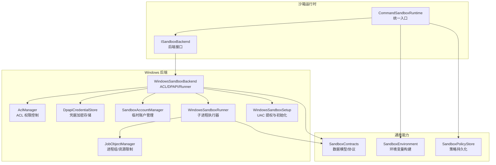

**图表来源** 
- [CommandSandboxRuntime.cs:1-129](file://TinadecTools/Runtime/Sandbox/CommandSandboxRuntime.cs#L1-L129)
- [WindowsSandboxBackend.cs:1-161](file://TinadecTools/Runtime/Sandbox/Windows/WindowsSandboxBackend.cs#L1-L161)
- [JobObjectManager.cs:1-63](file://TinadecTools/Runtime/Sandbox/Windows/JobObjectManager.cs#L1-L63)
- [AclManager.cs:1-62](file://TinadecTools/Runtime/Sandbox/Windows/AclManager.cs#L1-L62)
- [DpapiCredentialStore.cs:1-90](file://TinadecTools/Runtime/Sandbox/Windows/DpapiCredentialStore.cs#L1-L90)
- [SandboxAccountManager.cs:1-88](file://TinadecTools/Runtime/Sandbox/Windows/SandboxAccountManager.cs#L1-L88)
- [WindowsSandboxRunner.cs:1-178](file://TinadecTools/Runtime/Sandbox/Windows/WindowsSandboxRunner.cs#L1-L178)
- [WindowsSandboxSetup.cs:1-86](file://TinadecTools/Runtime/Sandbox/Windows/WindowsSandboxSetup.cs#L1-L86)
- [SandboxEnvironment.cs:1-69](file://TinadecTools/Runtime/Sandbox/SandboxEnvironment.cs#L1-L69)
- [SandboxPolicyStore.cs:1-83](file://TinadecTools/Runtime/Sandbox/SandboxPolicyStore.cs#L1-L83)
- [SandboxContracts.cs:1-71](file://TinadecTools/Runtime/Sandbox/SandboxContracts.cs#L1-L71)

**章节来源**
- [CommandSandboxRuntime.cs:1-129](file://TinadecTools/Runtime/Sandbox/CommandSandboxRuntime.cs#L1-L129)
- [WindowsSandboxBackend.cs:1-161](file://TinadecTools/Runtime/Sandbox/Windows/WindowsSandboxBackend.cs#L1-L161)
- [SandboxEnvironment.cs:1-69](file://TinadecTools/Runtime/Sandbox/SandboxEnvironment.cs#L1-L69)
- [SandboxPolicyStore.cs:1-83](file://TinadecTools/Runtime/Sandbox/SandboxPolicyStore.cs#L1-L83)
- [JobObjectManager.cs:1-63](file://TinadecTools/Runtime/Sandbox/Windows/JobObjectManager.cs#L1-L63)
- [AclManager.cs:1-62](file://TinadecTools/Runtime/Sandbox/Windows/AclManager.cs#L1-L62)
- [DpapiCredentialStore.cs:1-90](file://TinadecTools/Runtime/Sandbox/Windows/DpapiCredentialStore.cs#L1-L90)
- [SandboxAccountManager.cs:1-88](file://TinadecTools/Runtime/Sandbox/Windows/SandboxAccountManager.cs#L1-L88)
- [WindowsSandboxRunner.cs:1-178](file://TinadecTools/Runtime/Sandbox/Windows/WindowsSandboxRunner.cs#L1-L178)
- [WindowsSandboxSetup.cs:1-86](file://TinadecTools/Runtime/Sandbox/Windows/WindowsSandboxSetup.cs#L1-L86)
- [SandboxContracts.cs:1-71](file://TinadecTools/Runtime/Sandbox/SandboxContracts.cs#L1-L71)

## 核心组件
- 运行时入口 CommandSandboxRuntime
  - 负责超时校验、工作目录校验、权限构建与策略合并、选择后端并执行
- 后端接口 ISandboxBackend
  - 定义 IsSupported、IsInitialized、EnsureSetupAsync、ExecuteAsync、ResetAsync
- Windows 后端 WindowsSandboxBackend
  - 应用 ACL、构建环境变量、启动 Runner 子进程、处理结果与清理
- 进程组 JobObjectManager
  - 创建 Job Object、设置关闭即终止、分配进程、批量终止
- 权限控制 AclManager
  - 对指定路径授予读/写或拒绝所有，支持撤销
- 凭据存储 DpapiCredentialStore
  - 使用 DPAPI 加密/解密本地凭据文件
- 账户管理 SandboxAccountManager
  - 创建/删除低权限账户、生成随机密码、登录获取令牌、计算 Profile/Cache 目录
- 执行器 WindowsSandboxRunner
  - 子进程模式，接收 JSON 请求，执行命令，限制输出大小与超时
- 初始化 WindowsSandboxSetup
  - UAC 提权自举、确保账户存在
- 环境构建 SandboxEnvironment
  - 白名单保留环境变量、注入账户目录与缓存目录
- 策略存储 SandboxPolicyStore
  - 读取/合并/保存 sandbox.json，维护版本与去重

**章节来源**
- [CommandSandboxRuntime.cs:1-129](file://TinadecTools/Runtime/Sandbox/CommandSandboxRuntime.cs#L1-L129)
- [SandboxContracts.cs:1-71](file://TinadecTools/Runtime/Sandbox/SandboxContracts.cs#L1-L71)
- [WindowsSandboxBackend.cs:1-161](file://TinadecTools/Runtime/Sandbox/Windows/WindowsSandboxBackend.cs#L1-L161)
- [JobObjectManager.cs:1-63](file://TinadecTools/Runtime/Sandbox/Windows/JobObjectManager.cs#L1-L63)
- [AclManager.cs:1-62](file://TinadecTools/Runtime/Sandbox/Windows/AclManager.cs#L1-L62)
- [DpapiCredentialStore.cs:1-90](file://TinadecTools/Runtime/Sandbox/Windows/DpapiCredentialStore.cs#L1-L90)
- [SandboxAccountManager.cs:1-88](file://TinadecTools/Runtime/Sandbox/Windows/SandboxAccountManager.cs#L1-L88)
- [WindowsSandboxRunner.cs:1-178](file://TinadecTools/Runtime/Sandbox/Windows/WindowsSandboxRunner.cs#L1-L178)
- [WindowsSandboxSetup.cs:1-86](file://TinadecTools/Runtime/Sandbox/Windows/WindowsSandboxSetup.cs#L1-L86)
- [SandboxEnvironment.cs:1-69](file://TinadecTools/Runtime/Sandbox/SandboxEnvironment.cs#L1-L69)
- [SandboxPolicyStore.cs:1-83](file://TinadecTools/Runtime/Sandbox/SandboxPolicyStore.cs#L1-L83)

## 架构总览
下图展示从上层工具调用到 Windows 内核资源的完整调用链，包括进程隔离、ACL 授权、DPAPI 解密与 Job Object 生命周期管理。

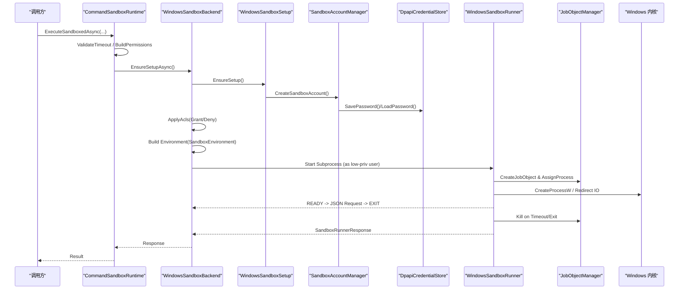

**图表来源** 
- [CommandSandboxRuntime.cs:1-129](file://TinadecTools/Runtime/Sandbox/CommandSandboxRuntime.cs#L1-L129)
- [WindowsSandboxBackend.cs:1-161](file://TinadecTools/Runtime/Sandbox/Windows/WindowsSandboxBackend.cs#L1-L161)
- [WindowsSandboxSetup.cs:1-86](file://TinadecTools/Runtime/Sandbox/Windows/WindowsSandboxSetup.cs#L1-L86)
- [SandboxAccountManager.cs:1-88](file://TinadecTools/Runtime/Sandbox/Windows/SandboxAccountManager.cs#L1-L88)
- [DpapiCredentialStore.cs:1-90](file://TinadecTools/Runtime/Sandbox/Windows/DpapiCredentialStore.cs#L1-L90)
- [WindowsSandboxRunner.cs:1-178](file://TinadecTools/Runtime/Sandbox/Windows/WindowsSandboxRunner.cs#L1-L178)
- [JobObjectManager.cs:1-63](file://TinadecTools/Runtime/Sandbox/Windows/JobObjectManager.cs#L1-L63)
- [Win32ProcessApi.cs:1-79](file://TinadecTools/Runtime/Sandbox/Windows/Win32ProcessApi.cs#L1-L79)

## 详细组件分析

### 组件一：Windows 后端与进程隔离
- 职责
  - 检查平台支持与初始化状态
  - 应用 ACL 权限（工作区写入、沙箱目录拒绝、按需授予读/写）
  - 构建受限环境变量（仅白名单 + 账户目录 + 额外变量名）
  - 以低权限用户启动 Runner 子进程，等待 READY 协议后发送请求
  - 非持久化模式下撤销 ACL；异常时终止整个进程树
- 进程隔离
  - 通过 JobObjectManager 将子进程加入 Job，设置关闭即终止，避免孤儿进程
  - 超时强制终止，并回收标准输入/输出/错误流
- 安全边界
  - 工作区根目录默认授予写权限，但 .tinadec 目录默认 DenyAll，防止越权
  - 外部路径需经 NormalizeGrantPath 与 IsWithinWorkspace 校验，避免宽泛目标

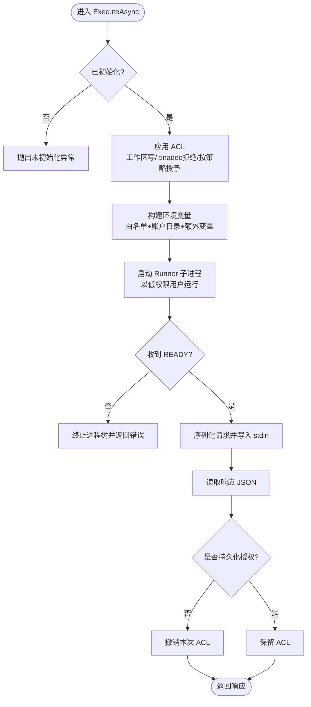

**图表来源** 
- [WindowsSandboxBackend.cs:1-161](file://TinadecTools/Runtime/Sandbox/Windows/WindowsSandboxBackend.cs#L1-L161)
- [AclManager.cs:1-62](file://TinadecTools/Runtime/Sandbox/Windows/AclManager.cs#L1-L62)
- [SandboxEnvironment.cs:1-69](file://TinadecTools/Runtime/Sandbox/SandboxEnvironment.cs#L1-L69)
- [JobObjectManager.cs:1-63](file://TinadecTools/Runtime/Sandbox/Windows/JobObjectManager.cs#L1-L63)

**章节来源**
- [WindowsSandboxBackend.cs:1-161](file://TinadecTools/Runtime/Sandbox/Windows/WindowsSandboxBackend.cs#L1-L161)
- [JobObjectManager.cs:1-63](file://TinadecTools/Runtime/Sandbox/Windows/JobObjectManager.cs#L1-L63)
- [AclManager.cs:1-62](file://TinadecTools/Runtime/Sandbox/Windows/AclManager.cs#L1-L62)
- [SandboxEnvironment.cs:1-69](file://TinadecTools/Runtime/Sandbox/SandboxEnvironment.cs#L1-L69)

### 组件二：SandboxEnvironment 环境配置
- 行为
  - 保留宿主系统关键环境变量（PATH、SystemRoot、代理等）
  - 注入账户目录（Profile/AppData/Temp）与包管理器缓存（npm/nuget/pip/cargo）
  - 允许额外环境变量名白名单注入，并对名称进行合法性校验
- 复杂度
  - 构建过程为 O(n)，n 为保留/额外变量数量
- 安全性
  - 严格白名单机制，避免泄露敏感信息

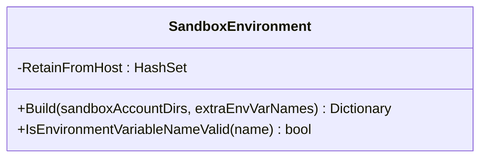

**图表来源** 
- [SandboxEnvironment.cs:1-69](file://TinadecTools/Runtime/Sandbox/SandboxEnvironment.cs#L1-L69)

**章节来源**
- [SandboxEnvironment.cs:1-69](file://TinadecTools/Runtime/Sandbox/SandboxEnvironment.cs#L1-L69)

### 组件三：SandboxPolicyStore 策略存储
- 行为
  - 加载/保存/删除 workspace/.tinadec/sandbox.json
  - 合并新增权限（读/写路径与环境变量名），去重与排序，版本号更新
  - 跨平台字符串比较（Windows 忽略大小写）
- 数据结构
  - SandboxPolicyFile：version、read_paths、write_paths、environment_variables

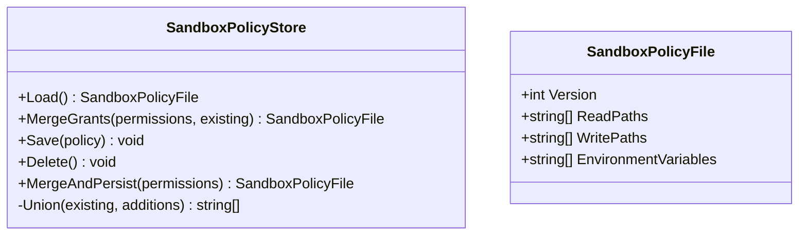

**图表来源** 
- [SandboxPolicyStore.cs:1-83](file://TinadecTools/Runtime/Sandbox/SandboxPolicyStore.cs#L1-L83)
- [SandboxContracts.cs:1-71](file://TinadecTools/Runtime/Sandbox/SandboxContracts.cs#L1-L71)

**章节来源**
- [SandboxPolicyStore.cs:1-83](file://TinadecTools/Runtime/Sandbox/SandboxPolicyStore.cs#L1-L83)
- [SandboxContracts.cs:1-71](file://TinadecTools/Runtime/Sandbox/SandboxContracts.cs#L1-L71)

### 组件四：JobObjectManager 进程组管理
- 行为
  - 创建 Job Object，设置关闭即终止（KILL_ON_JOB_CLOSE）
  - 将子进程分配到 Job，提供 Kill 与 Dispose 保证资源释放
- 依赖
  - Win32ProcessApi 封装 kernel32 函数

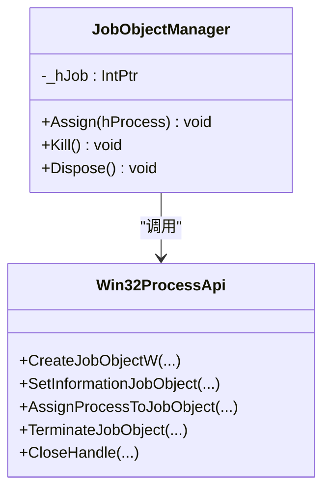

**图表来源** 
- [JobObjectManager.cs:1-63](file://TinadecTools/Runtime/Sandbox/Windows/JobObjectManager.cs#L1-L63)
- [Win32ProcessApi.cs:1-79](file://TinadecTools/Runtime/Sandbox/Windows/Win32ProcessApi.cs#L1-L79)

**章节来源**
- [JobObjectManager.cs:1-63](file://TinadecTools/Runtime/Sandbox/Windows/JobObjectManager.cs#L1-L63)
- [Win32ProcessApi.cs:1-79](file://TinadecTools/Runtime/Sandbox/Windows/Win32ProcessApi.cs#L1-L79)

### 组件五：ACL 权限控制
- 行为
  - 针对 NTAccount（机器名+账户名）添加 Allow/Allow/Deny 规则
  - 支持递归继承（ContainerInherit/ObjectInherit）
  - 记录规则以便撤销，失败不阻断主流程
- 安全要点
  - 默认 DenyAll 阻止对 .tinadec 的访问，最小化攻击面

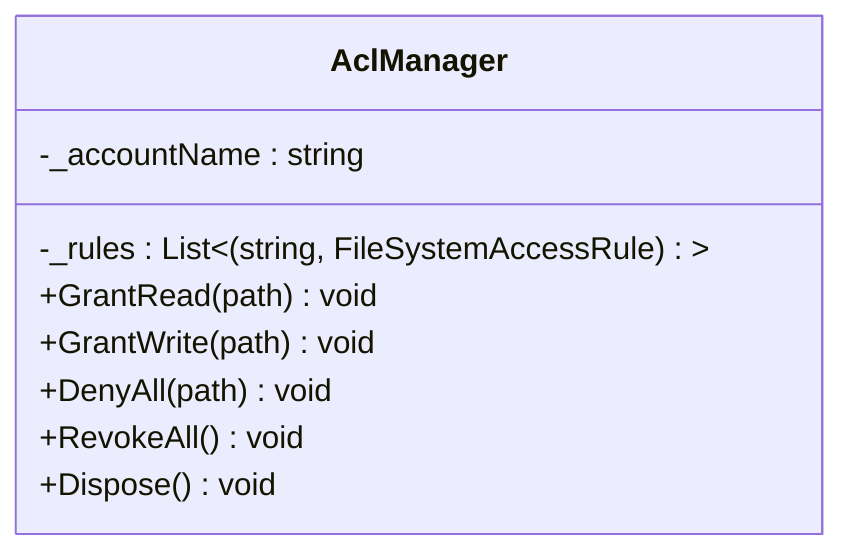

**图表来源** 
- [AclManager.cs:1-62](file://TinadecTools/Runtime/Sandbox/Windows/AclManager.cs#L1-L62)

**章节来源**
- [AclManager.cs:1-62](file://TinadecTools/Runtime/Sandbox/Windows/AclManager.cs#L1-L62)

### 组件六：DPAPI 加密存储
- 行为
  - 使用 CryptProtectData/CryptUnprotectData 对凭据进行加密/解密
  - 存储于 LocalApplicationData/TinadecTools/Sandbox/sandbox-account.dat
  - 提供 Save/Load/Delete/Exists 方法
- 安全要点
  - 凭据与用户上下文绑定，避免明文落盘

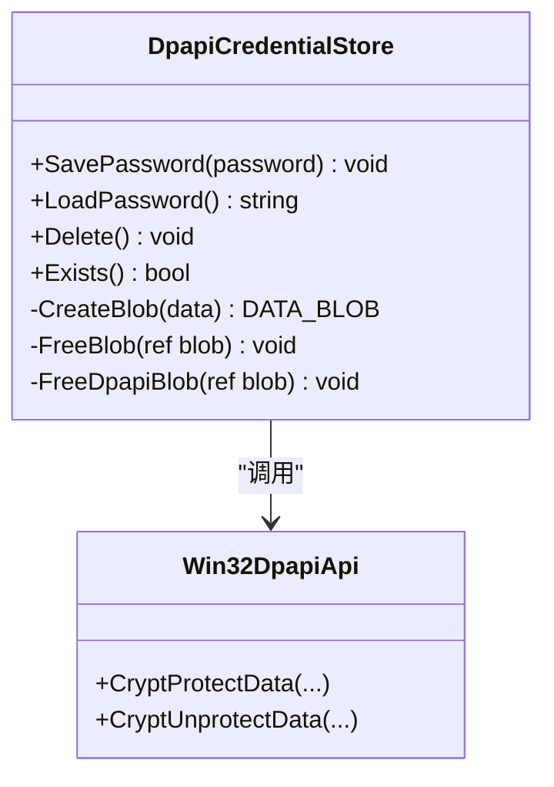

**图表来源** 
- [DpapiCredentialStore.cs:1-90](file://TinadecTools/Runtime/Sandbox/Windows/DpapiCredentialStore.cs#L1-L90)
- [Win32DpapiApi.cs:1-21](file://TinadecTools/Runtime/Sandbox/Windows/Win32DpapiApi.cs#L1-L21)

**章节来源**
- [DpapiCredentialStore.cs:1-90](file://TinadecTools/Runtime/Sandbox/Windows/DpapiCredentialStore.cs#L1-L90)
- [Win32DpapiApi.cs:1-21](file://TinadecTools/Runtime/Sandbox/Windows/Win32DpapiApi.cs#L1-L21)

### 组件七：临时账户管理
- 行为
  - 生成强随机密码，创建低权限本地账户（不过期、脚本标志）
  - 若账户已存在且无凭据文件，要求先执行 machine 级别重置
  - 提供 LogonSandboxUser 获取令牌用于后续操作
  - 计算 Profile 与 Cache 目录路径
- 依赖
  - NetUserAdd/NetUserDel/NetUserGetInfo

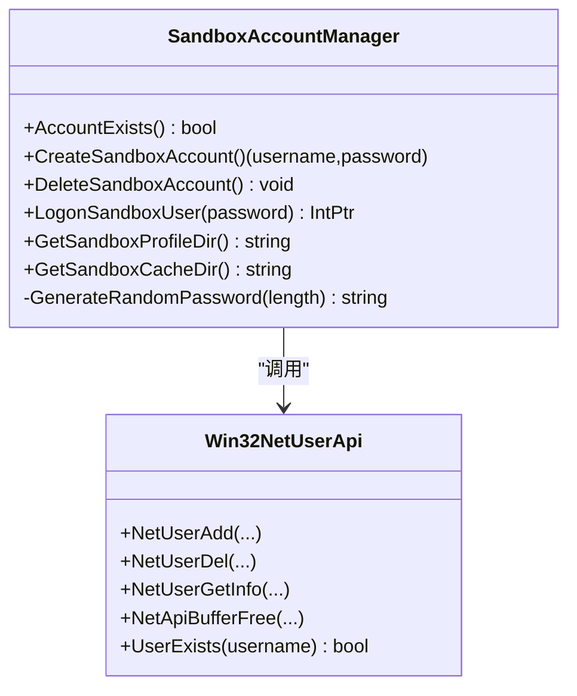

**图表来源** 
- [SandboxAccountManager.cs:1-88](file://TinadecTools/Runtime/Sandbox/Windows/SandboxAccountManager.cs#L1-L88)
- [Win32NetUserApi.cs:1-34](file://TinadecTools/Runtime/Sandbox/Windows/Win32NetUserApi.cs#L1-L34)

**章节来源**
- [SandboxAccountManager.cs:1-88](file://TinadecTools/Runtime/Sandbox/Windows/SandboxAccountManager.cs#L1-L88)
- [Win32NetUserApi.cs:1-34](file://TinadecTools/Runtime/Sandbox/Windows/Win32NetUserApi.cs#L1-L34)

### 组件八：Runner 子进程执行器
- 行为
  - 以 --sandbox-runner 模式运行，输出 READY 后循环读取 JSON 请求
  - 限制 stdout/stderr 最大字符数，防止内存膨胀
  - 使用 JobObjectManager 限制进程组，超时则 Kill
  - 返回标准化响应（成功/退出码/输出/超时/耗时/截断标记）
- 安全要点
  - 清空并重建环境变量，避免继承敏感变量
  - 严格限制输入/输出大小与超时

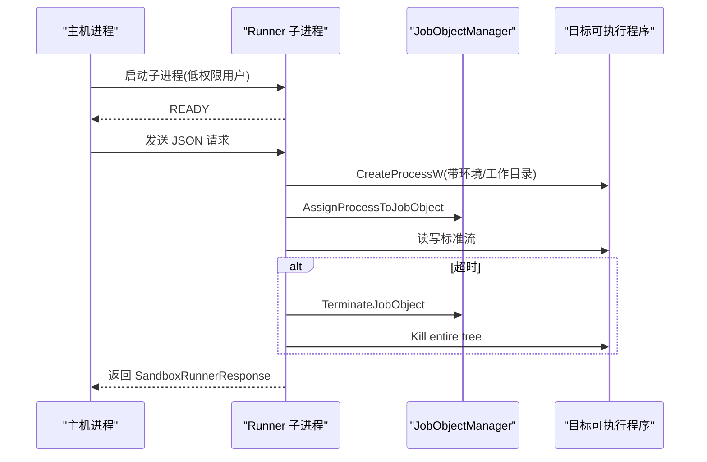

**图表来源** 
- [WindowsSandboxRunner.cs:1-178](file://TinadecTools/Runtime/Sandbox/Windows/WindowsSandboxRunner.cs#L1-L178)
- [JobObjectManager.cs:1-63](file://TinadecTools/Runtime/Sandbox/Windows/JobObjectManager.cs#L1-L63)
- [Win32ProcessApi.cs:1-79](file://TinadecTools/Runtime/Sandbox/Windows/Win32ProcessApi.cs#L1-L79)

**章节来源**
- [WindowsSandboxRunner.cs:1-178](file://TinadecTools/Runtime/Sandbox/Windows/WindowsSandboxRunner.cs#L1-L178)
- [JobObjectManager.cs:1-63](file://TinadecTools/Runtime/Sandbox/Windows/JobObjectManager.cs#L1-L63)
- [Win32ProcessApi.cs:1-79](file://TinadecTools/Runtime/Sandbox/Windows/Win32ProcessApi.cs#L1-L79)

### 组件九：初始化与 UAC 提权
- 行为
  - EnsureSetup 检测账户是否存在，不存在则触发 UAC 提权自举
  - RunSetup 创建账户并输出成功提示
  - CreateSelfStartInfo 自动识别 dotnet 入口程序并传递模式参数

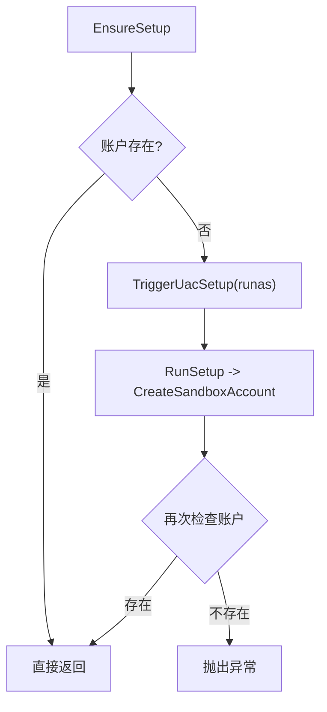

**图表来源** 
- [WindowsSandboxSetup.cs:1-86](file://TinadecTools/Runtime/Sandbox/Windows/WindowsSandboxSetup.cs#L1-L86)
- [SandboxAccountManager.cs:1-88](file://TinadecTools/Runtime/Sandbox/Windows/SandboxAccountManager.cs#L1-L88)

**章节来源**
- [WindowsSandboxSetup.cs:1-86](file://TinadecTools/Runtime/Sandbox/Windows/WindowsSandboxSetup.cs#L1-L86)
- [SandboxAccountManager.cs:1-88](file://TinadecTools/Runtime/Sandbox/Windows/SandboxAccountManager.cs#L1-L88)

### 组件十：运行时入口与策略合并
- 行为
  - ValidateTimeout 限制超时范围
  - BuildPermissions 默认包含工作区读写，并规范化路径与校验
  - MergeWithPolicy 合并策略文件中的历史授权
  - ExecuteSandboxedAsync 统一调用后端执行

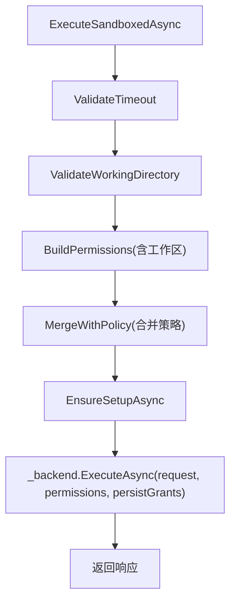

**图表来源** 
- [CommandSandboxRuntime.cs:1-129](file://TinadecTools/Runtime/Sandbox/CommandSandboxRuntime.cs#L1-L129)

**章节来源**
- [CommandSandboxRuntime.cs:1-129](file://TinadecTools/Runtime/Sandbox/CommandSandboxRuntime.cs#L1-L129)

## 依赖关系分析
- 耦合与内聚
  - CommandSandboxRuntime 与 ISandboxBackend 松耦合，便于替换后端
  - WindowsSandboxBackend 聚合 AclManager、DpapiCredentialStore、SandboxAccountManager、WindowsSandboxRunner、JobObjectManager，职责清晰
- 外部依赖
  - Win32ProcessApi/Win32DpapiApi/Win32NetUserApi 分别对接 kernel32.dll、crypt32.dll、netapi32.dll
- 潜在循环依赖
  - 当前模块间单向依赖，未见循环引用

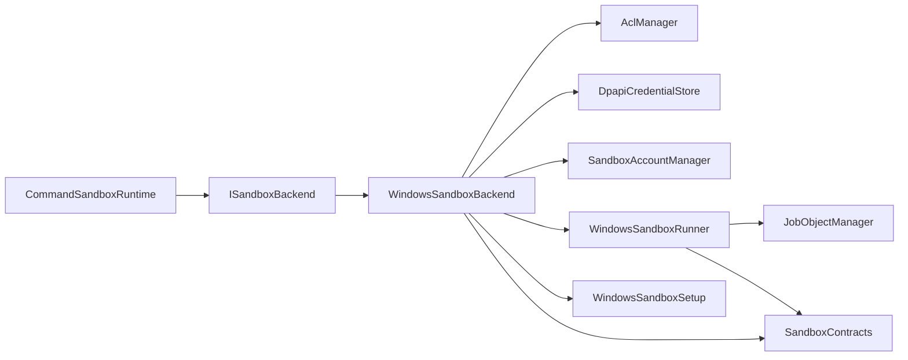

**图表来源** 
- [CommandSandboxRuntime.cs:1-129](file://TinadecTools/Runtime/Sandbox/CommandSandboxRuntime.cs#L1-L129)
- [WindowsSandboxBackend.cs:1-161](file://TinadecTools/Runtime/Sandbox/Windows/WindowsSandboxBackend.cs#L1-L161)
- [WindowsSandboxRunner.cs:1-178](file://TinadecTools/Runtime/Sandbox/Windows/WindowsSandboxRunner.cs#L1-L178)
- [JobObjectManager.cs:1-63](file://TinadecTools/Runtime/Sandbox/Windows/JobObjectManager.cs#L1-L63)
- [AclManager.cs:1-62](file://TinadecTools/Runtime/Sandbox/Windows/AclManager.cs#L1-L62)
- [DpapiCredentialStore.cs:1-90](file://TinadecTools/Runtime/Sandbox/Windows/DpapiCredentialStore.cs#L1-L90)
- [SandboxAccountManager.cs:1-88](file://TinadecTools/Runtime/Sandbox/Windows/SandboxAccountManager.cs#L1-L88)
- [WindowsSandboxSetup.cs:1-86](file://TinadecTools/Runtime/Sandbox/Windows/WindowsSandboxSetup.cs#L1-L86)
- [SandboxContracts.cs:1-71](file://TinadecTools/Runtime/Sandbox/SandboxContracts.cs#L1-L71)

**章节来源**
- [CommandSandboxRuntime.cs:1-129](file://TinadecTools/Runtime/Sandbox/CommandSandboxRuntime.cs#L1-L129)
- [WindowsSandboxBackend.cs:1-161](file://TinadecTools/Runtime/Sandbox/Windows/WindowsSandboxBackend.cs#L1-L161)
- [WindowsSandboxRunner.cs:1-178](file://TinadecTools/Runtime/Sandbox/Windows/WindowsSandboxRunner.cs#L1-L178)
- [JobObjectManager.cs:1-63](file://TinadecTools/Runtime/Sandbox/Windows/JobObjectManager.cs#L1-L63)
- [AclManager.cs:1-62](file://TinadecTools/Runtime/Sandbox/Windows/AclManager.cs#L1-L62)
- [DpapiCredentialStore.cs:1-90](file://TinadecTools/Runtime/Sandbox/Windows/DpapiCredentialStore.cs#L1-L90)
- [SandboxAccountManager.cs:1-88](file://TinadecTools/Runtime/Sandbox/Windows/SandboxAccountManager.cs#L1-L88)
- [WindowsSandboxSetup.cs:1-86](file://TinadecTools/Runtime/Sandbox/Windows/WindowsSandboxSetup.cs#L1-L86)
- [SandboxContracts.cs:1-71](file://TinadecTools/Runtime/Sandbox/SandboxContracts.cs#L1-L71)

## 性能考量
- I/O 限制
  - 标准输出/错误流限制最大字符数，避免大输出导致内存压力
- 超时控制
  - 统一上限 1800 秒，防止长时间占用资源
- 进程组
  - Job Object 关闭即终止，减少僵尸进程风险
- 策略合并
  - 集合去重与排序，降低重复授权带来的开销
- 环境变量
  - 仅白名单注入，减少不必要的环境污染

[本节为通用指导，无需源码引用]

## 故障排查指南
- 常见错误与定位
  - 未初始化：EnsureSetupAsync 前调用 ExecuteAsync 会抛异常
  - Runner 初始化失败：未收到 READY 或返回错误，查看 stderr
  - 超时：TimedOut=true，检查任务耗时与系统负载
  - 权限不足：ACL 未正确授予或 DenyAll 生效，检查路径与策略
  - 凭据缺失：DPAPI 文件不存在，需重新 setup 或恢复凭据
- 排查步骤
  - 确认账户存在与凭据文件存在
  - 检查工作区与 .tinadec 目录权限
  - 验证环境变量白名单与额外变量名
  - 观察 Runner 日志与标准错误输出
  - 必要时执行 machine 级别重置并重新初始化

**章节来源**
- [WindowsSandboxBackend.cs:1-161](file://TinadecTools/Runtime/Sandbox/Windows/WindowsSandboxBackend.cs#L1-L161)
- [WindowsSandboxRunner.cs:1-178](file://TinadecTools/Runtime/Sandbox/Windows/WindowsSandboxRunner.cs#L1-L178)
- [DpapiCredentialStore.cs:1-90](file://TinadecTools/Runtime/Sandbox/Windows/DpapiCredentialStore.cs#L1-L90)
- [AclManager.cs:1-62](file://TinadecTools/Runtime/Sandbox/Windows/AclManager.cs#L1-L62)

## 结论
该沙箱隔离机制通过“低权限账户 + ACL 最小权限 + Job Object 进程组 + DPAPI 凭据加密 + 受限环境变量”的组合，构建了清晰的执行边界与资源限制。运行时入口统一了参数校验与策略合并，Windows 后端实现了完整的生命周期管理与错误恢复。建议在大规模并发场景下关注 I/O 限制与超时策略，并结合策略文件进行细粒度权限治理。

[本节为总结性内容，无需源码引用]

## 附录

### 沙箱配置示例
- 基础执行
  - 工作目录：workspace 根目录（默认读写）
  - 额外读路径：只读授权（经 NormalizeGrantPath 与 IsWithinWorkspace 校验）
  - 额外写路径：禁止宽泛目标（EnsureNotBroadWriteTarget）
  - 环境变量：仅白名单与显式允许的变量名
- 策略文件（sandbox.json）
  - version：当前版本
  - read_paths/write_paths/environment_variables：历史授权合并
- 重置范围
  - Workspace：仅删除策略文件
  - Machine：删除账户、缓存与 Profile 目录

**章节来源**
- [CommandSandboxRuntime.cs:1-129](file://TinadecTools/Runtime/Sandbox/CommandSandboxRuntime.cs#L1-L129)
- [SandboxPolicyStore.cs:1-83](file://TinadecTools/Runtime/Sandbox/SandboxPolicyStore.cs#L1-L83)
- [WindowsSandboxBackend.cs:1-161](file://TinadecTools/Runtime/Sandbox/Windows/WindowsSandboxBackend.cs#L1-L161)

### 自定义隔离策略建议
- 最小权限原则
  - 仅授予必要读/写路径，避免根级或系统目录
- 环境变量白名单
  - 仅暴露运行必需变量，避免泄露密钥或代理信息
- 策略持久化
  - 使用 MergeAndPersist 累积授权，定期审计与清理
- 超时与输出限制
  - 合理设置超时与输出上限，防止资源耗尽

**章节来源**
- [SandboxEnvironment.cs:1-69](file://TinadecTools/Runtime/Sandbox/SandboxEnvironment.cs#L1-L69)
- [SandboxPolicyStore.cs:1-83](file://TinadecTools/Runtime/Sandbox/SandboxPolicyStore.cs#L1-L83)
- [WindowsSandboxRunner.cs:1-178](file://TinadecTools/Runtime/Sandbox/Windows/WindowsSandboxRunner.cs#L1-L178)

### 跨平台兼容性考虑
- 当前 Windows 后端仅在 Windows 平台可用
- 非 Windows 平台回退到 UnsupportedSandboxBackend，抛出平台不支持异常
- 如需跨平台，可扩展 ISandboxBackend 的其他实现（如 Linux namespaces）

**章节来源**
- [CommandSandboxRuntime.cs:1-129](file://TinadecTools/Runtime/Sandbox/CommandSandboxRuntime.cs#L1-L129)
- [UnsupportedSandboxBackend.cs:1-19](file://TinadecTools/Runtime/Sandbox/UnsupportedSandboxBackend.cs#L1-L19)

### 安全漏洞防护
- 路径遍历与宽泛授权
  - 使用 NormalizeGrantPath 与 IsWithinWorkspace 校验，EnsureNotBroadWriteTarget 防止根级写入
- 环境变量泄露
  - 白名单机制与名称合法性校验
- 凭据安全
  - DPAPI 加密存储，避免明文
- 进程逃逸
  - Job Object 关闭即终止，超时强制 Kill，限制输出大小
- 权限提升
  - UAC 提权仅在初始化阶段，执行阶段使用低权限账户

**章节来源**
- [WindowsSandboxBackend.cs:1-161](file://TinadecTools/Runtime/Sandbox/Windows/WindowsSandboxBackend.cs#L1-L161)
- [DpapiCredentialStore.cs:1-90](file://TinadecTools/Runtime/Sandbox/Windows/DpapiCredentialStore.cs#L1-L90)
- [WindowsSandboxRunner.cs:1-178](file://TinadecTools/Runtime/Sandbox/Windows/WindowsSandboxRunner.cs#L1-L178)
- [AclManager.cs:1-62](file://TinadecTools/Runtime/Sandbox/Windows/AclManager.cs#L1-L62)