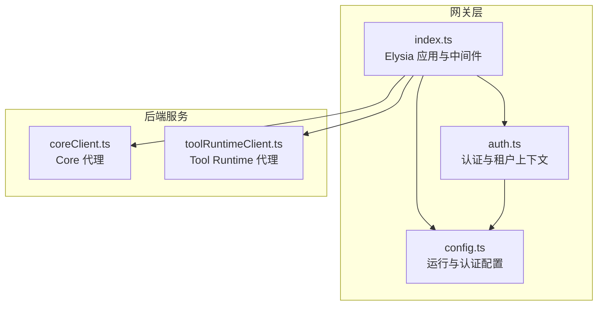
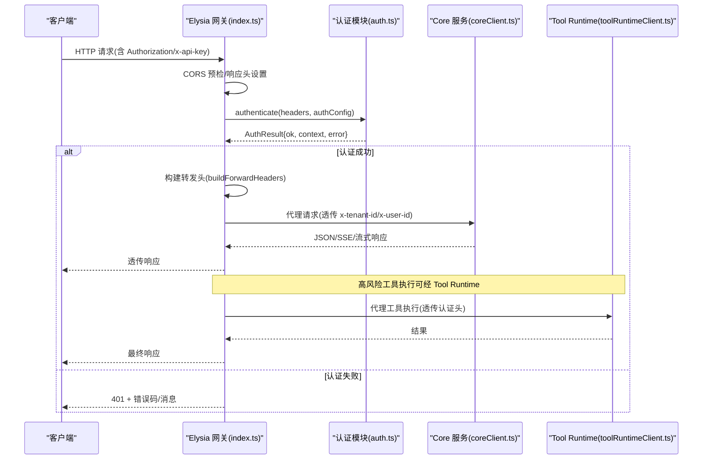
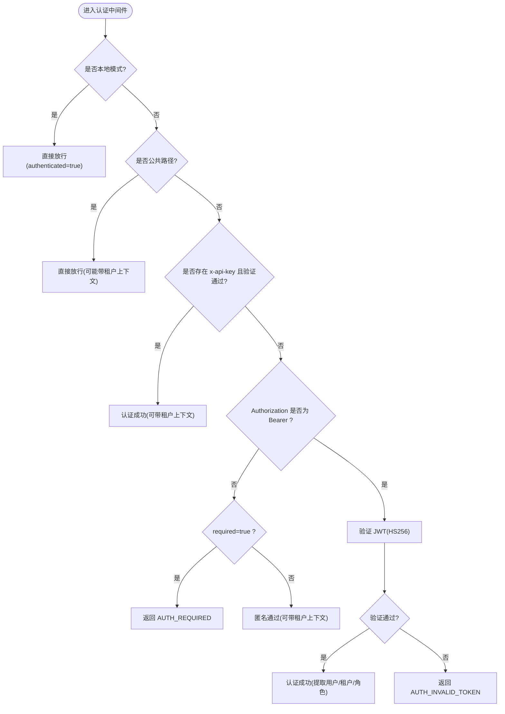
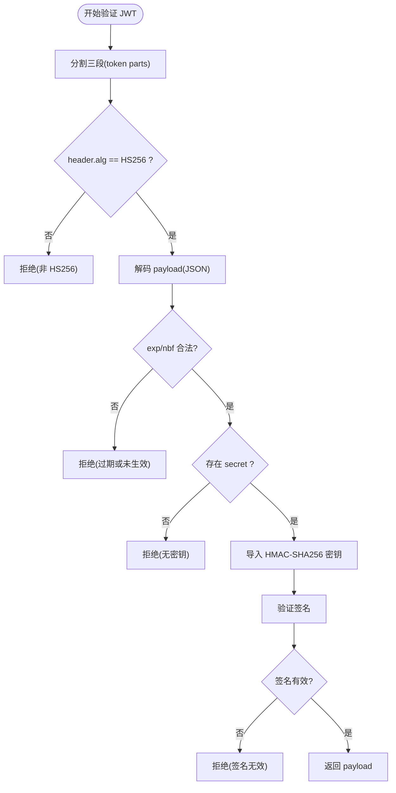
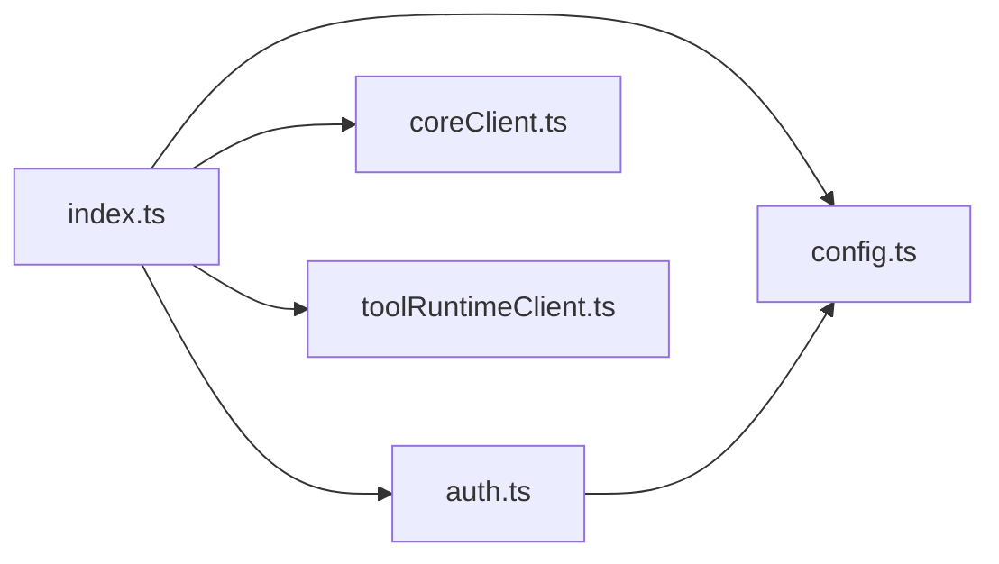

# 认证系统

<cite>
**本文引用的文件**   
- [TinadecGateway/src/auth.ts](file://TinadecGateway/src/auth.ts)
- [TinadecGateway/src/config.ts](file://TinadecGateway/src/config.ts)
- [TinadecGateway/src/index.ts](file://TinadecGateway/src/index.ts)
- [TinadecGateway/src/coreClient.ts](file://TinadecGateway/src/coreClient.ts)
- [TinadecGateway/src/toolRuntimeClient.ts](file://TinadecGateway/src/toolRuntimeClient.ts)
- [docs/security.md](file://docs/security.md)
</cite>

## 目录
1. [简介](#简介)
2. [项目结构](#项目结构)
3. [核心组件](#核心组件)
4. [架构总览](#架构总览)
5. [详细组件分析](#详细组件分析)
6. [依赖关系分析](#依赖关系分析)
7. [性能考量](#性能考量)
8. [故障排查指南](#故障排查指南)
9. [结论](#结论)
10. [附录](#附录)

## 简介
本文件为 TinadecOffice 网关（TinadecGateway）的认证系统技术文档，聚焦以下主题：
- JWT 认证机制与 HS256 签名验证实现
- API Key 验证流程
- 本地模式与云端模式的认证差异
- AuthContext 与 AuthResult 接口设计
- Bearer token 处理逻辑
- 认证中间件工作流程、公共路径白名单机制
- 租户上下文提取与转发头构建
- 客户端 IP 获取与反向代理支持
- 认证配置示例、错误处理策略与安全最佳实践

## 项目结构
认证相关代码集中在 TinadecGateway 包中，关键文件如下：
- auth.ts：认证与租户上下文中间件、JWT/HS256 验证、API Key 校验、租户上下文注入、客户端 IP 获取
- config.ts：运行配置（本地/云端）、认证配置加载
- index.ts：Elysia 应用入口，注册 CORS、认证中间件、路由与代理
- coreClient.ts / toolRuntimeClient.ts：到 Core 与 Tool Runtime 的 HTTP/SSE/流式代理，透传认证头
- docs/security.md：安全注意事项与 MVP 边界说明



图表来源 
- [TinadecGateway/src/index.ts:1-120](file://TinadecGateway/src/index.ts#L1-L120)
- [TinadecGateway/src/auth.ts:1-120](file://TinadecGateway/src/auth.ts#L1-L120)
- [TinadecGateway/src/config.ts:1-115](file://TinadecGateway/src/config.ts#L1-L115)
- [TinadecGateway/src/coreClient.ts:1-110](file://TinadecGateway/src/coreClient.ts#L1-L110)
- [TinadecGateway/src/toolRuntimeClient.ts:1-126](file://TinadecGateway/src/toolRuntimeClient.ts#L1-L126)

章节来源
- [TinadecGateway/src/index.ts:1-120](file://TinadecGateway/src/index.ts#L1-L120)
- [TinadecGateway/src/auth.ts:1-120](file://TinadecGateway/src/auth.ts#L1-L120)
- [TinadecGateway/src/config.ts:1-115](file://TinadecGateway/src/config.ts#L1-L115)

## 核心组件
- 认证中间件 authenticate：根据部署模式与请求头决定认证策略；支持 API Key 与 Bearer JWT；失败时返回结构化错误码与消息
- JWT 验证 verifyJwt：仅允许 HS256，使用 WebCrypto 进行 HMAC-SHA256 签名验证；校验 exp/nbf；无密钥时拒绝（fail-closed）
- 公共路径白名单 isPublicPath：健康检查与文档等无需认证的路径
- 租户上下文与转发头 buildForwardHeaders：将 tenant_id/user_id 注入下游请求头
- 客户端 IP 获取 getClientIp：支持 X-Forwarded-For/X-Real-IP 反向代理场景
- 配置加载 loadConfig/getConfig：区分 local/cloud 模式，按需启用认证与信任代理

章节来源
- [TinadecGateway/src/auth.ts:1-120](file://TinadecGateway/src/auth.ts#L1-L120)
- [TinadecGateway/src/auth.ts:121-222](file://TinadecGateway/src/auth.ts#L121-L222)
- [TinadecGateway/src/auth.ts:223-273](file://TinadecGateway/src/auth.ts#L223-L273)
- [TinadecGateway/src/config.ts:1-115](file://TinadecGateway/src/config.ts#L1-L115)

## 架构总览
认证在网关层统一处理，随后将认证上下文以自定义头形式透传到 Core 与 Tool Runtime。



图表来源 
- [TinadecGateway/src/index.ts:107-155](file://TinadecGateway/src/index.ts#L107-L155)
- [TinadecGateway/src/auth.ts:46-112](file://TinadecGateway/src/auth.ts#L46-L112)
- [TinadecGateway/src/coreClient.ts:38-87](file://TinadecGateway/src/coreClient.ts#L38-L87)
- [TinadecGateway/src/toolRuntimeClient.ts:44-97](file://TinadecGateway/src/toolRuntimeClient.ts#L44-L97)

## 详细组件分析

### 认证中间件与白名单
- 本地模式：跳过认证，直接放行
- 云端模式：
  - 优先尝试 API Key（x-api-key），若存在且通过验证则成功
  - 其次尝试 Bearer token（Authorization），解析并验证 JWT
  - 若未提供有效凭证且 required=true，返回 AUTH_REQUIRED
  - 非必须认证时允许匿名访问，但仍可携带租户上下文
- 公共路径白名单：/api/v1/health、/docs 及其子路径等无需认证



图表来源 
- [TinadecGateway/src/auth.ts:46-112](file://TinadecGateway/src/auth.ts#L46-L112)
- [TinadecGateway/src/auth.ts:29-39](file://TinadecGateway/src/auth.ts#L29-L39)
- [TinadecGateway/src/index.ts:141-154](file://TinadecGateway/src/index.ts#L141-L154)

章节来源
- [TinadecGateway/src/auth.ts:29-112](file://TinadecGateway/src/auth.ts#L29-L112)
- [TinadecGateway/src/index.ts:141-154](file://TinadecGateway/src/index.ts#L141-L154)

### JWT 验证（HS256）
- 仅接受 alg=HS256，其他算法（如 none/HS512）一律拒绝
- 解码 header/payload，校验 exp/nbf
- 使用 WebCrypto 的 subtle.importKey + verify 进行 HMAC-SHA256 签名验证
- 无密钥时拒绝 Bearer token（云端 fail-closed）



图表来源 
- [TinadecGateway/src/auth.ts:133-178](file://TinadecGateway/src/auth.ts#L133-L178)
- [TinadecGateway/src/auth.ts:180-221](file://TinadecGateway/src/auth.ts#L180-L221)

章节来源
- [TinadecGateway/src/auth.ts:133-178](file://TinadecGateway/src/auth.ts#L133-L178)
- [TinadecGateway/src/auth.ts:180-221](file://TinadecGateway/src/auth.ts#L180-L221)

### API Key 验证
- 从 x-api-key 读取密钥
- 通过配置的 apiKeyValidator 函数校验（例如与环境变量对比）
- 校验失败返回 AUTH_INVALID_API_KEY

章节来源
- [TinadecGateway/src/auth.ts:58-73](file://TinadecGateway/src/auth.ts#L58-L73)
- [TinadecGateway/src/config.ts:78-84](file://TinadecGateway/src/config.ts#L78-L84)

### 租户上下文与转发头
- 从 JWT claims 或请求头 x-tenant-id 提取租户 ID
- 从 JWT claims 提取用户 ID（sub 或 user_id）
- 构建转发头时将 x-tenant-id 与 x-user-id 注入下游请求

```mermaid
classDiagram
class AuthContext {
+boolean authenticated
+string userId
+string tenantId
+string[] roles
}
class AuthResult {
+boolean ok
+AuthContext context
+error{code,message}
}
class ForwardHeaders {
+buildForwardHeaders(context, existing) Record~string,string~
}
AuthResult --> AuthContext : "包含"
ForwardHeaders --> AuthContext : "使用"
```

图表来源 
- [TinadecGateway/src/auth.ts:16-27](file://TinadecGateway/src/auth.ts#L16-L27)
- [TinadecGateway/src/auth.ts:227-254](file://TinadecGateway/src/auth.ts#L227-L254)

章节来源
- [TinadecGateway/src/auth.ts:16-27](file://TinadecGateway/src/auth.ts#L16-L27)
- [TinadecGateway/src/auth.ts:227-254](file://TinadecGateway/src/auth.ts#L227-L254)

### 客户端 IP 与反向代理
- 当 trustProxy=true（云端默认）时，优先从 x-forwarded-for 取第一个 IP，否则回退到 x-real-ip
- 否则返回 127.0.0.1（本地开发）

章节来源
- [TinadecGateway/src/auth.ts:259-269](file://TinadecGateway/src/auth.ts#L259-L269)
- [TinadecGateway/src/config.ts:104-105](file://TinadecGateway/src/config.ts#L104-L105)

### 认证中间件集成点
- 在 Elysia onRequest 钩子中执行认证
- 对公共路径跳过认证
- 失败时设置状态码 401 并返回结构化错误

章节来源
- [TinadecGateway/src/index.ts:141-154](file://TinadecGateway/src/index.ts#L141-L154)

## 依赖关系分析
- index.ts 依赖 config.ts 获取运行与认证配置
- index.ts 调用 auth.ts 完成认证与上下文构建
- index.ts 通过 coreClient.ts / toolRuntimeClient.ts 向后端服务发起代理请求
- auth.ts 依赖 config.ts 中的 AuthConfig（jwtSecret、apiKeyValidator、required）



图表来源 
- [TinadecGateway/src/index.ts:23-58](file://TinadecGateway/src/index.ts#L23-L58)
- [TinadecGateway/src/auth.ts:14-14](file://TinadecGateway/src/auth.ts#L14-L14)
- [TinadecGateway/src/coreClient.ts:7-8](file://TinadecGateway/src/coreClient.ts#L7-L8)
- [TinadecGateway/src/toolRuntimeClient.ts:13-13](file://TinadecGateway/src/toolRuntimeClient.ts#L13-L13)

章节来源
- [TinadecGateway/src/index.ts:23-58](file://TinadecGateway/src/index.ts#L23-L58)
- [TinadecGateway/src/auth.ts:14-14](file://TinadecGateway/src/auth.ts#L14-L14)
- [TinadecGateway/src/coreClient.ts:7-8](file://TinadecGateway/src/coreClient.ts#L7-L8)
- [TinadecGateway/src/toolRuntimeClient.ts:13-13](file://TinadecGateway/src/toolRuntimeClient.ts#L13-L13)

## 性能考量
- JWT 验证使用原生 WebCrypto，避免第三方库开销
- Base64url 解码采用 Uint8Array + TextDecoder，减少字符编码问题
- 认证中间件仅在云端模式启用，本地模式零开销
- 公共路径白名单减少不必要的认证计算
- 透传 SSE/流式响应，避免全量缓冲

[本节为通用指导，不直接分析具体文件]

## 故障排查指南
常见错误码与含义：
- AUTH_REQUIRED：云端模式要求认证但未提供任何凭证
- AUTH_INVALID_TOKEN：Bearer token 无效或已过期，或算法非 HS256，或缺少密钥
- AUTH_INVALID_API_KEY：API Key 校验失败

定位建议：
- 确认环境变量 TINADEC_GATEWAY_MODE、TINADEC_GATEWAY_AUTH_REQUIRED、TINADEC_GATEWAY_JWT_SECRET、TINADEC_GATEWAY_API_KEY
- 检查请求头 Authorization 或 x-api-key 是否正确
- 确认公共路径白名单是否命中
- 查看下游 Core/Tool Runtime 可达性与响应格式

章节来源
- [TinadecGateway/src/auth.ts:69-112](file://TinadecGateway/src/auth.ts#L69-L112)
- [TinadecGateway/src/index.ts:141-154](file://TinadecGateway/src/index.ts#L141-L154)

## 结论
该认证系统在网关层实现了统一的鉴权与租户上下文注入，支持本地快速开发与云端生产部署两种模式。通过严格的 HS256 验证与 fail-closed 策略，确保云端环境的安全性；同时通过 API Key 与 Bearer token 双通道满足多样化接入需求。结合反向代理支持与标准安全头构建，便于在企业环境中集成与扩展。

[本节为总结性内容，不直接分析具体文件]

## 附录

### 认证配置示例（环境变量）
- 本地模式（默认）：
  - TINADEC_GATEWAY_MODE=local
  - 监听 127.0.0.1，无认证
- 云端模式：
  - TINADEC_GATEWAY_MODE=cloud
  - TINADEC_GATEWAY_AUTH_REQUIRED=true/false
  - TINADEC_GATEWAY_JWT_SECRET=<HS256 密钥>
  - TINADEC_GATEWAY_API_KEY=<可选 API Key>
  - TINADEC_GATEWAY_CORS_ORIGINS=<额外允许的源，逗号分隔>
  - TINADEC_CORE_URL、TINADEC_TOOL_RUNTIME_URL 指向后端服务

章节来源
- [TinadecGateway/src/config.ts:65-106](file://TinadecGateway/src/config.ts#L65-L106)

### 安全最佳实践
- 始终在生产环境设置 TINADEC_GATEWAY_JWT_SECRET，避免无密钥放行
- 限制公共路径白名单，仅暴露必要接口（健康检查、文档）
- 使用 HTTPS 与反向代理，正确传递 X-Forwarded-* 头
- 最小化 CORS 允许源，必要时使用通配符域名正则匹配
- 遵循“审批优先”的策略，敏感操作需人工审批或二次确认

章节来源
- [docs/security.md:1-18](file://docs/security.md#L1-L18)