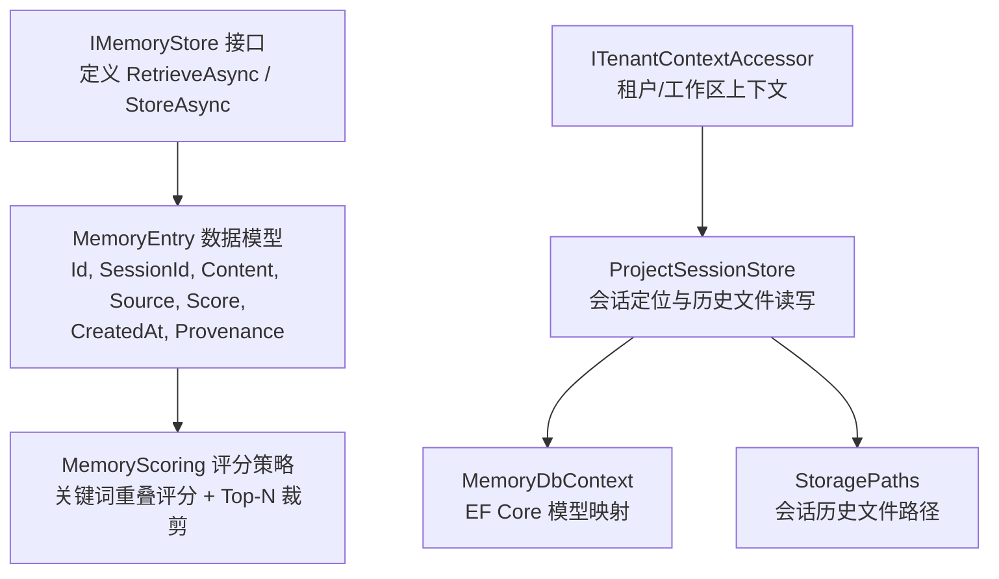
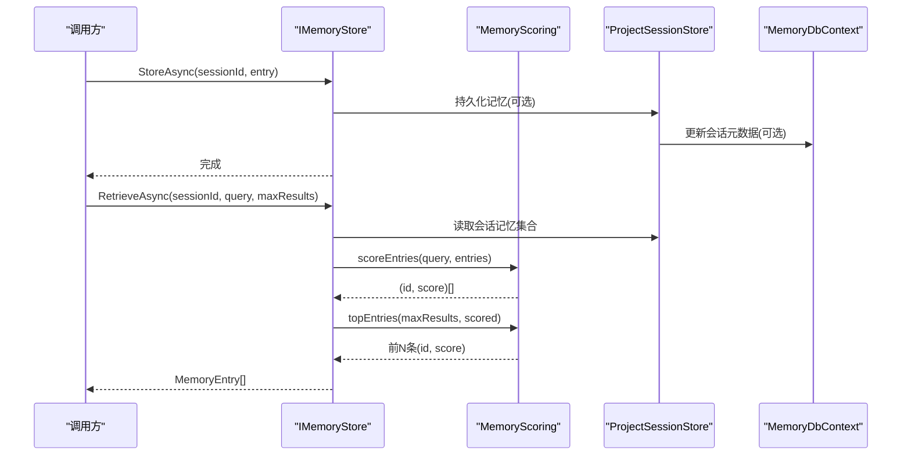
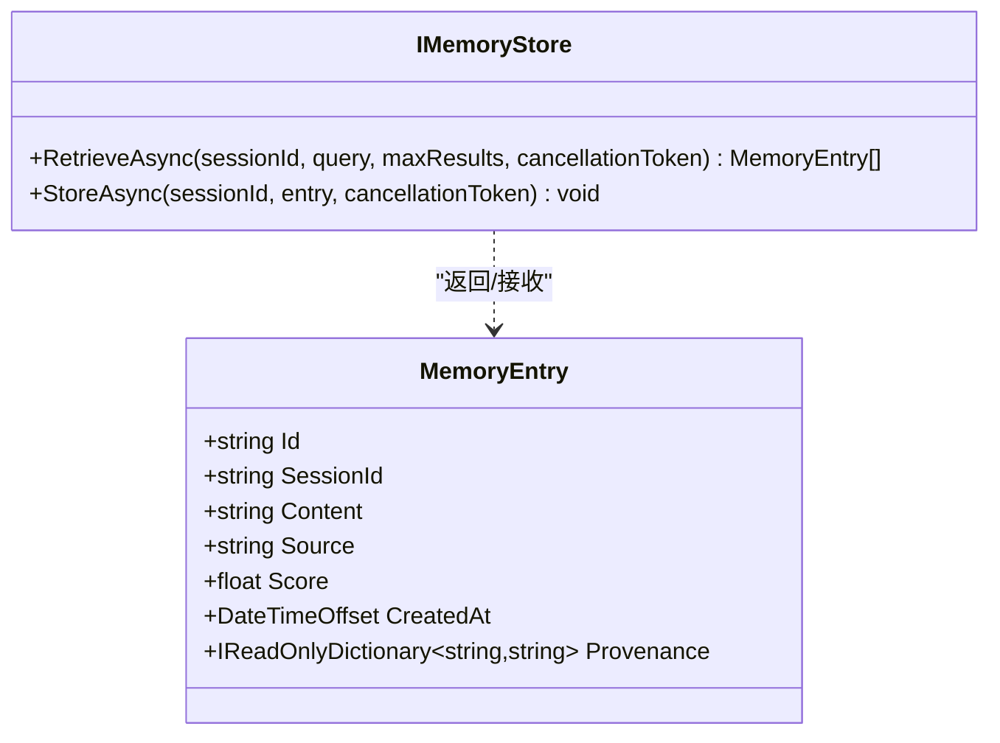
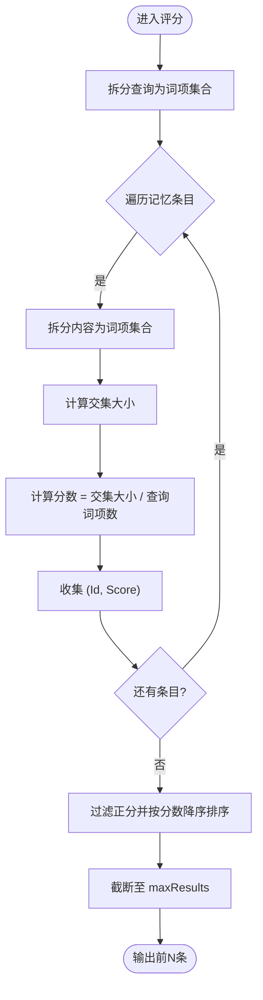
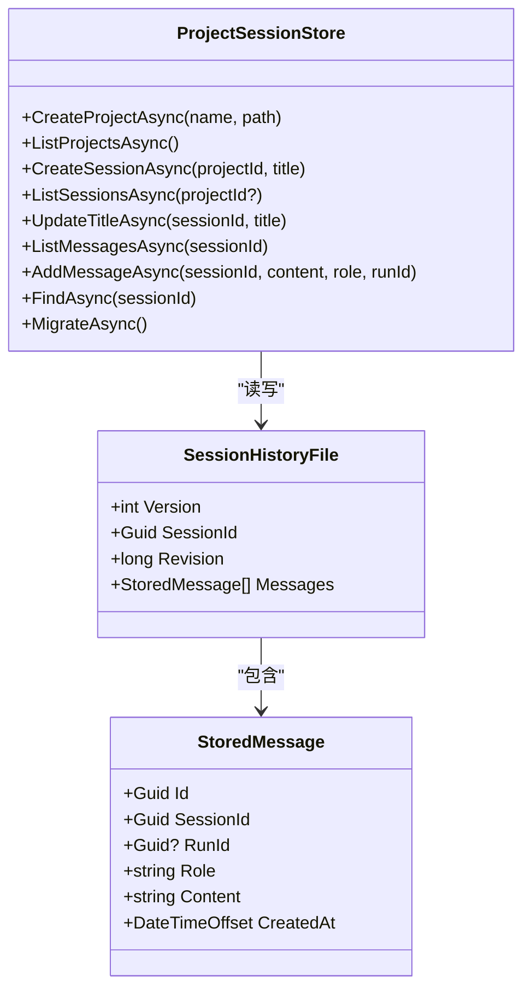
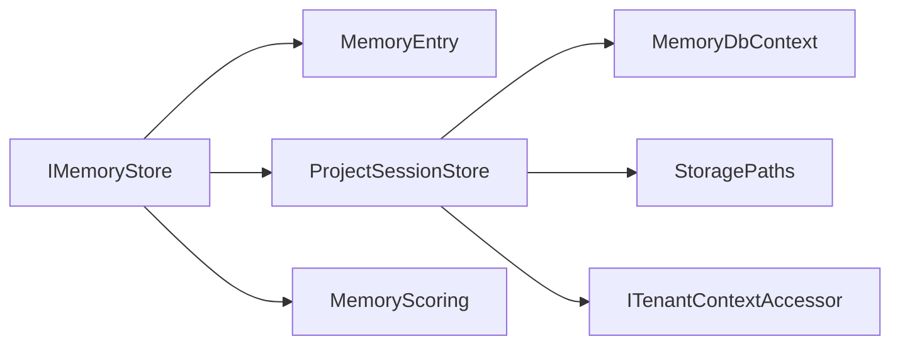

# 内存存储接口

<cite>
**本文引用的文件**   
- [IMemoryStore.cs](file://TinadecCore/Abstractions/Ports/IMemoryStore.cs)
- [MemoryScoring.fs](file://TinadecCore/Strategies/MemoryScoring.fs)
- [ProjectSessionStore.cs](file://TinadecCore/Memory/ProjectSessionStore.cs)
- [MemoryDbContext.cs](file://TinadecCore/Memory/MemoryDbContext.cs)
</cite>

## 目录
1. [简介](#简介)
2. [项目结构](#项目结构)
3. [核心组件](#核心组件)
4. [架构总览](#架构总览)
5. [详细组件分析](#详细组件分析)
6. [依赖关系分析](#依赖关系分析)
7. [性能考虑](#性能考虑)
8. [故障排查指南](#故障排查指南)
9. [结论](#结论)
10. [附录：使用示例与最佳实践](#附录使用示例与最佳实践)

## 简介
本文件围绕 IMemoryStore 接口及其数据模型 MemoryEntry，系统化阐述 Agent 会话记忆管理、保留策略与溯源机制。内容涵盖：
- 接口职责：按会话维度进行记忆的检索与持久化，支持查询过滤与结果数量限制。
- 数据结构：MemoryEntry 的字段语义（Id、SessionId、Content、Source、Score、CreatedAt、Provenance）。
- 算法与评分：基于关键词重叠的简单相关性评分与排序裁剪。
- 会话隔离与多租户：通过 SessionId 与租户/工作区上下文实现隔离。
- 内存管理与性能优化：并发控制、异步 I/O、序列化选项与结果裁剪。
- 使用场景：如何存储与检索 Agent 记忆数据，并给出可操作的代码示例路径。

## 项目结构
与 IMemoryStore 相关的核心位置如下：
- 抽象端口定义位于 Abstractions/Ports，明确对外契约。
- 评分策略位于 Strategies，提供纯函数式评分与排序逻辑。
- 会话与历史持久化位于 Memory，包含数据库上下文与会话历史文件读写。

图表来源 
- [IMemoryStore.cs:1-31](file://TinadecCore/Abstractions/Ports/IMemoryStore.cs#L1-L31)
- [MemoryScoring.fs:1-46](file://TinadecCore/Strategies/MemoryScoring.fs#L1-L46)
- [ProjectSessionStore.cs:1-219](file://TinadecCore/Memory/ProjectSessionStore.cs#L1-L219)
- [MemoryDbContext.cs:1-92](file://TinadecCore/Memory/MemoryDbContext.cs#L1-L92)

章节来源
- [IMemoryStore.cs:1-31](file://TinadecCore/Abstractions/Ports/IMemoryStore.cs#L1-L31)
- [MemoryScoring.fs:1-46](file://TinadecCore/Strategies/MemoryScoring.fs#L1-L46)
- [ProjectSessionStore.cs:1-219](file://TinadecCore/Memory/ProjectSessionStore.cs#L1-L219)
- [MemoryDbContext.cs:1-92](file://TinadecCore/Memory/MemoryDbContext.cs#L1-L92)

## 核心组件
- IMemoryStore 接口
  - RetrieveAsync(sessionId, query, maxResults, cancellationToken)
    - 参数：会话标识、查询文本、最大返回条数、取消令牌。
    - 返回值：MemoryEntry[]，按相关性降序排列的前 N 条记忆。
    - 用途：在指定会话内根据查询检索相关记忆片段，用于构建提示上下文或工具输入。
  - StoreAsync(sessionId, entry, cancellationToken)
    - 参数：会话标识、待存储的记忆条目、取消令牌。
    - 用途：将 Agent 运行过程中产生的关键信息持久化到会话记忆，便于后续检索与溯源。

- MemoryEntry 数据模型
  - Id：唯一标识，默认生成 GUID（无分隔符）。
  - SessionId：所属会话标识，用于会话隔离。
  - Content：记忆正文，参与评分与检索。
  - Source：来源标记（如“系统”、“工具调用”、“用户输入”等），便于分类与审计。
  - Score：相关性分数，由评分策略计算或外部注入。
  - CreatedAt：创建时间（UTC），用于排序与保留策略。
  - Provenance：溯源元数据字典，记录来源、版本、关联 ID 等可追溯信息。

章节来源
- [IMemoryStore.cs:1-31](file://TinadecCore/Abstractions/Ports/IMemoryStore.cs#L1-L31)

## 架构总览
IMemoryStore 作为抽象层，屏蔽具体存储实现细节；上层通过该接口完成记忆的存取。评分策略以纯函数形式对候选记忆进行打分与裁剪，确保检索结果的相关性与可控规模。会话与历史持久化由 ProjectSessionStore 负责，结合 EF Core 与文件系统实现高可靠写入。

图表来源 
- [IMemoryStore.cs:1-31](file://TinadecCore/Abstractions/Ports/IMemoryStore.cs#L1-L31)
- [MemoryScoring.fs:1-46](file://TinadecCore/Strategies/MemoryScoring.fs#L1-L46)
- [ProjectSessionStore.cs:1-219](file://TinadecCore/Memory/ProjectSessionStore.cs#L1-L219)
- [MemoryDbContext.cs:1-92](file://TinadecCore/Memory/MemoryDbContext.cs#L1-L92)

## 详细组件分析

### IMemoryStore 接口与 MemoryEntry 模型
- 设计要点
  - 方法签名简洁，聚焦“按会话检索”和“按会话存储”。
  - MemoryEntry 不可变属性（init-only）提升线程安全与一致性。
  - Provenance 为只读字典，便于附加溯源信息而不破坏结构。
- 复杂度与行为
  - RetrieveAsync 的时间复杂度取决于底层存储扫描与评分计算；通常 O(N) 扫描 + O(N log N) 排序（若未使用堆选择）。
  - StoreAsync 通常为 O(1) 追加或 O(log N) 索引插入，取决于实现。

图表来源 
- [IMemoryStore.cs:1-31](file://TinadecCore/Abstractions/Ports/IMemoryStore.cs#L1-L31)

章节来源
- [IMemoryStore.cs:1-31](file://TinadecCore/Abstractions/Ports/IMemoryStore.cs#L1-L31)

### 评分策略 MemoryScoring
- 功能说明
  - scoreEntries：将查询拆分为词项集合，与每条记忆的 Content 词项求交集，计算重叠比例作为分数。
  - topEntries：过滤出正分结果，按分数降序排序，截断至 maxResults。
- 复杂度
  - 词项拆分与集合构建：O(L)（L 为字符长度）。
  - 交集与计数：O(U+V)，U、V 分别为查询与内容词项集合大小。
  - 排序裁剪：O(K log K)，K 为正分条目数。
- 适用性
  - 轻量、无状态、易于扩展（可替换为向量相似度或 BM25）。

图表来源 
- [MemoryScoring.fs:1-46](file://TinadecCore/Strategies/MemoryScoring.fs#L1-L46)

章节来源
- [MemoryScoring.fs:1-46](file://TinadecCore/Strategies/MemoryScoring.fs#L1-L46)

### 会话与历史持久化 ProjectSessionStore
- 职责
  - 会话生命周期管理（创建、列举、更新标题）。
  - 会话历史文件读写（原子写入、版本与修订号）。
  - 消息追加与并发保护（每会话信号量保证串行写入）。
- 并发与一致性
  - 使用 ConcurrentDictionary 缓存每会话的信号量，避免竞态。
  - 写入采用临时文件 + Replace/Move 的原子替换策略，保障完整性。
- 与 IMemoryStore 的关系
  - ProjectSessionStore 当前实现 ISessionLocator 与 IStorageMigrationParticipant，并非直接实现 IMemoryStore。
  - 可作为 IMemoryStore 的具体存储后端之一，配合评分策略实现 RetrieveAsync/StoreAsync。

图表来源 
- [ProjectSessionStore.cs:1-219](file://TinadecCore/Memory/ProjectSessionStore.cs#L1-L219)

章节来源
- [ProjectSessionStore.cs:1-219](file://TinadecCore/Memory/ProjectSessionStore.cs#L1-L219)

### 数据库上下文 MemoryDbContext
- 作用
  - 定义项目与会话的实体映射与索引，支撑会话元数据查询与归档。
- 关键点
  - 多租户字段 TenantId、WorkspaceId 贯穿实体，天然支持会话隔离。
  - 索引覆盖常用查询条件（租户/工作区/归档/更新时间），提升检索性能。

章节来源
- [MemoryDbContext.cs:1-92](file://TinadecCore/Memory/MemoryDbContext.cs#L1-L92)

## 依赖关系分析
- IMemoryStore 依赖 MemoryEntry 作为数据载体。
- RetrieveAsync 的实现通常依赖：
  - 会话记忆集合（来自 ProjectSessionStore 或类似存储）。
  - 评分策略（MemoryScoring）进行相关性计算与裁剪。
- ProjectSessionStore 依赖：
  - EF Core 上下文（MemoryDbContext）进行元数据持久化。
  - StoragePaths 确定会话历史文件路径。
  - ITenantContextAccessor 获取租户与工作区上下文，实现隔离。

图表来源 
- [IMemoryStore.cs:1-31](file://TinadecCore/Abstractions/Ports/IMemoryStore.cs#L1-L31)
- [MemoryScoring.fs:1-46](file://TinadecCore/Strategies/MemoryScoring.fs#L1-L46)
- [ProjectSessionStore.cs:1-219](file://TinadecCore/Memory/ProjectSessionStore.cs#L1-L219)
- [MemoryDbContext.cs:1-92](file://TinadecCore/Memory/MemoryDbContext.cs#L1-L92)

章节来源
- [IMemoryStore.cs:1-31](file://TinadecCore/Abstractions/Ports/IMemoryStore.cs#L1-L31)
- [MemoryScoring.fs:1-46](file://TinadecCore/Strategies/MemoryScoring.fs#L1-L46)
- [ProjectSessionStore.cs:1-219](file://TinadecCore/Memory/ProjectSessionStore.cs#L1-L219)
- [MemoryDbContext.cs:1-92](file://TinadecCore/Memory/MemoryDbContext.cs#L1-L92)

## 性能考虑
- 检索性能
  - 建议对 Content 建立倒排索引或使用向量检索以提升召回速度。
  - 使用 topEntries 的堆选择替代全排序，降低 O(K log K) 开销。
- 存储性能
  - StoreAsync 批量写入时合并事务，减少 I/O 次数。
  - 使用异步 I/O 与缓冲写入，避免阻塞。
- 并发与锁
  - 每会话信号量避免写竞争；读操作应无锁或仅读锁。
- 序列化
  - 使用紧凑 JSON 配置（WriteIndented=false）减小体积。
- 内存管理
  - 限制单会话记忆上限，结合 CreatedAt 与 Score 做淘汰。
  - 分页/游标读取，避免一次性加载大量条目。

[本节为通用指导，不直接分析具体文件]

## 故障排查指南
- 常见问题
  - 检索结果为空：检查 query 是否为空、Content 是否包含有效词项、maxResults 是否过小。
  - 写入失败：确认会话存在、文件路径权限、磁盘空间与原子替换流程。
  - 并发冲突：确认每会话信号量是否正确初始化与释放。
- 诊断建议
  - 打印 Provenance 中的来源与版本信息，定位数据来源。
  - 查看会话历史文件的 Revision 与 HistoryRevision 一致性。
  - 监控评分分布，评估查询词项与内容匹配度。

章节来源
- [ProjectSessionStore.cs:1-219](file://TinadecCore/Memory/ProjectSessionStore.cs#L1-219)
- [MemoryScoring.fs:1-46](file://TinadecCore/Strategies/MemoryScoring.fs#L1-46)

## 结论
IMemoryStore 提供了清晰的会话记忆存取契约，MemoryEntry 承载了完整的记忆语义与溯源信息。结合轻量评分策略与可靠的会话持久化，可在保证一致性的前提下实现高效的 Agent 记忆管理。通过合理的保留策略、并发控制与 I/O 优化，可进一步提升系统吞吐与稳定性。

[本节为总结，不直接分析具体文件]

## 附录：使用示例与最佳实践

### 存储记忆（StoreAsync）
- 步骤
  - 构造 MemoryEntry，设置 SessionId、Content、Source、Provenance。
  - 调用 StoreAsync 将条目存入对应会话。
- 参考路径
  - [IMemoryStore.cs:15-18](file://TinadecCore/Abstractions/Ports/IMemoryStore.cs#L15-L18)

### 检索记忆（RetrieveAsync）
- 步骤
  - 准备 sessionId、query、maxResults。
  - 调用 RetrieveAsync 获取相关记忆数组。
  - 根据 Score 与 CreatedAt 决定最终上下文拼接顺序。
- 参考路径
  - [IMemoryStore.cs:9-13](file://TinadecCore/Abstractions/Ports/IMemoryStore.cs#L9-L13)

### 评分与裁剪（MemoryScoring）
- 步骤
  - 使用 scoreEntries 计算每条记忆的分数。
  - 使用 topEntries 筛选并裁剪至 maxResults。
- 参考路径
  - [MemoryScoring.fs:11-32](file://TinadecCore/Strategies/MemoryScoring.fs#L11-L32)
  - [MemoryScoring.fs:37-46](file://TinadecCore/Strategies/MemoryScoring.fs#L37-L46)

### 会话隔离与多租户
- 要点
  - 所有查询与写入需绑定 SessionId，并结合租户/工作区上下文。
  - 使用 MemoryDbContext 的索引与过滤条件确保隔离。
- 参考路径
  - [ProjectSessionStore.cs:62-95](file://TinadecCore/Memory/ProjectSessionStore.cs#L62-L95)
  - [MemoryDbContext.cs:38-59](file://TinadecCore/Memory/MemoryDbContext.cs#L38-L59)

### 保留策略与溯源
- 保留策略
  - 基于 CreatedAt 与 Score 设定阈值，定期清理低价值条目。
  - 按会话维度维护上限，防止单会话膨胀。
- 溯源机制
  - 在 Provenance 中记录来源模块、版本号、关联任务 ID。
  - 结合 Source 字段进行分类与审计。
- 参考路径
  - [IMemoryStore.cs:21-30](file://TinadecCore/Abstractions/Ports/IMemoryStore.cs#L21-L30)