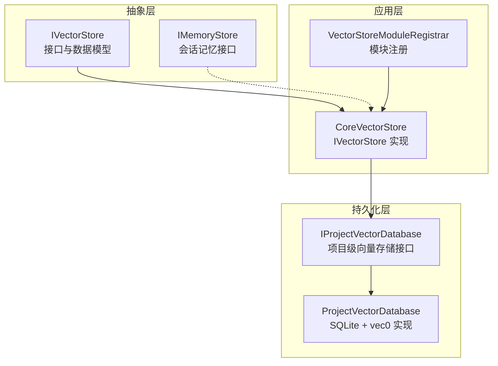
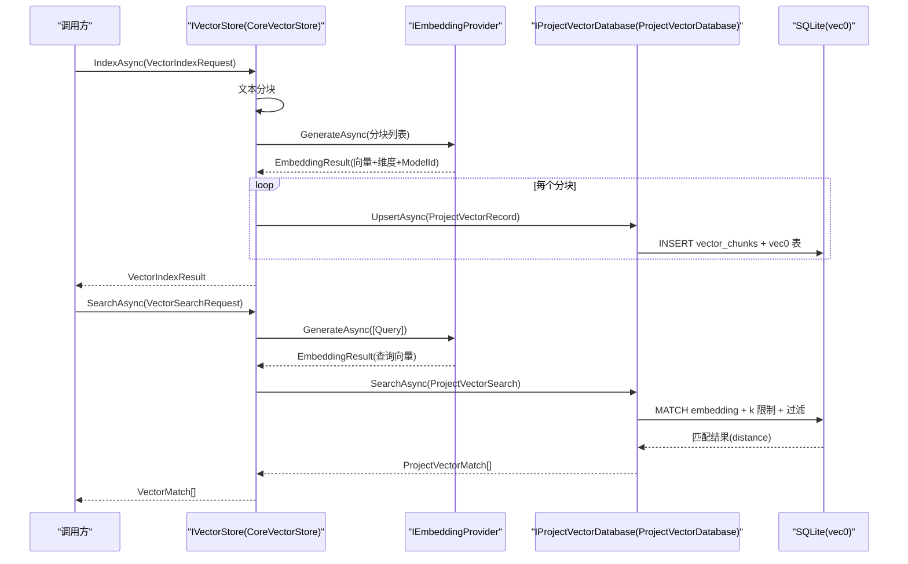
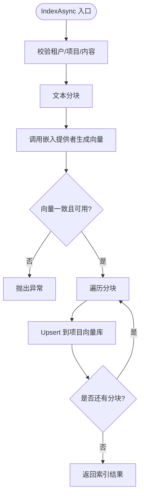
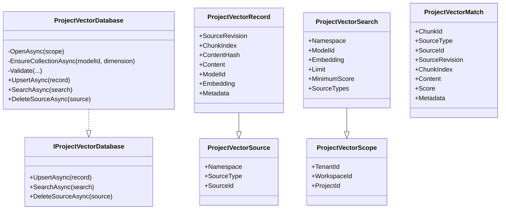
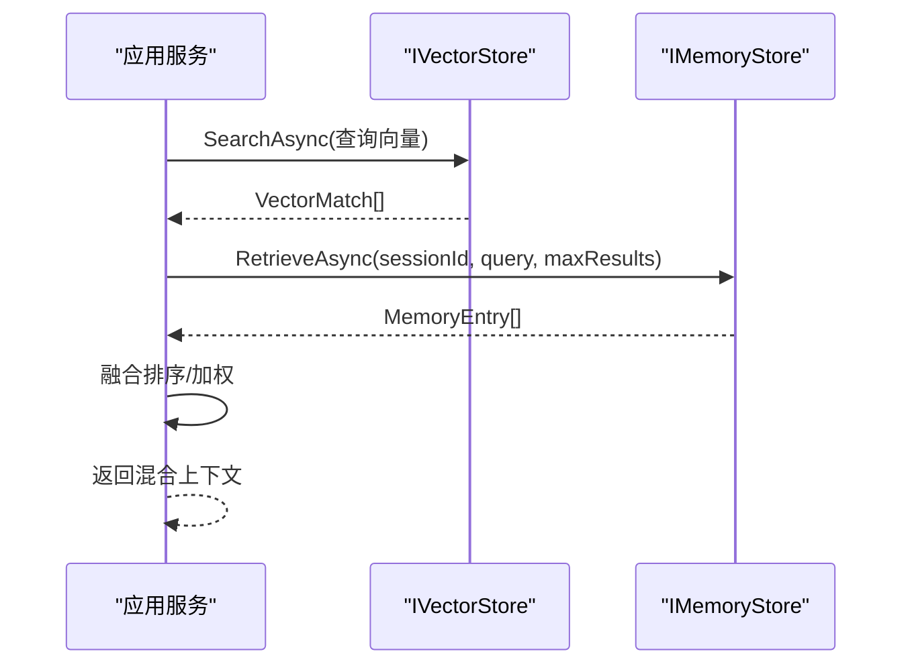
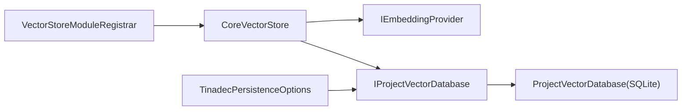

# 向量存储接口

<cite>
**本文引用的文件**
- [IVectorStore.cs](file://TinadecCore/Abstractions/Ports/IVectorStore.cs)
- [IMemoryStore.cs](file://TinadecCore/Abstractions/Ports/IMemoryStore.cs)
- [IProjectVectorDatabase.cs](file://TinadecCore/Persistence/IProjectVectorDatabase.cs)
- [ProjectVectorDatabase.cs](file://TinadecCore/Persistence/ProjectVectorDatabase.cs)
- [VectorStoreModuleRegistrar.cs](file://TinadecCore/VectorStore/VectorStoreModuleRegistrar.cs)
- [VectorStoreEndToEndTests.cs](file://TinadecCore/tests/TinadecCore.Api.Tests/VectorStoreEndToEndTests.cs)
- [VectorPersistenceTests.cs](file://TinadecCore/tests/TinadecCore.Api.Tests/VectorPersistenceTests.cs)
- [TinadecPersistenceOptions.cs](file://TinadecCore/Persistence/TinadecPersistenceOptions.cs)
</cite>

## 目录
1. [简介](#简介)
2. [项目结构](#项目结构)
3. [核心组件](#核心组件)
4. [架构总览](#架构总览)
5. [详细组件分析](#详细组件分析)
6. [依赖关系分析](#依赖关系分析)
7. [性能考量](#性能考量)
8. [故障排查指南](#故障排查指南)
9. [结论](#结论)
10. [附录](#附录)

## 简介
本文件面向 IVectorStore 接口的详细文档，围绕“语义索引与检索”能力展开，说明向量嵌入的存储、查询与索引机制，涵盖向量维度配置、距离度量算法、批量操作支持，以及与 IMemoryStore 的协作方式以实现混合搜索。同时提供向量存储后端集成指南（当前实现基于 SQLite + vec0 扩展），并给出后续接入 Pinecone、Weaviate 等主流向量数据库的建议路径。

## 项目结构
- 抽象层：定义 IVectorStore 接口及请求/响应模型，用于对外暴露语义索引与检索能力。
- 持久化层：通过 IProjectVectorDatabase 抽象项目级向量存储；默认实现 ProjectVectorDatabase 使用 SQLite 的 vec0 扩展进行向量索引与相似度检索。
- 模块注册：VectorStoreModuleRegistrar 将 CoreVectorStore 作为 IVectorStore 的实现注入容器，声明能力与依赖。
- 测试：端到端与持久化测试验证了索引、检索、删除以及跨项目隔离等行为。

图表来源
- [IVectorStore.cs:1-59](file://TinadecCore/Abstractions/Ports/IVectorStore.cs#L1-L59)
- [IMemoryStore.cs:1-31](file://TinadecCore/Abstractions/Ports/IMemoryStore.cs#L1-L31)
- [IProjectVectorDatabase.cs:1-57](file://TinadecCore/Persistence/IProjectVectorDatabase.cs#L1-L57)
- [ProjectVectorDatabase.cs:1-174](file://TinadecCore/Persistence/ProjectVectorDatabase.cs#L1-L174)
- [VectorStoreModuleRegistrar.cs:1-105](file://TinadecCore/VectorStore/VectorStoreModuleRegistrar.cs#L1-L105)

章节来源
- [IVectorStore.cs:1-59](file://TinadecCore/Abstractions/Ports/IVectorStore.cs#L1-L59)
- [VectorStoreModuleRegistrar.cs:1-105](file://TinadecCore/VectorStore/VectorStoreModuleRegistrar.cs#L1-L105)

## 核心组件
- IVectorStore：对外暴露 IndexAsync、SearchAsync、DeleteSourceAsync 三个方法，统一语义索引与检索入口。
- CoreVectorStore：IVectorStore 的具体实现，负责文本分块、调用嵌入提供者生成向量、写入项目向量库、按查询向量检索并返回匹配结果。
- IProjectVectorDatabase / ProjectVectorDatabase：项目级向量存储抽象与 SQLite 实现，维护 chunk 元数据表与按模型维度划分的 vec0 虚拟表，执行 upsert、相似度搜索与删除。
- IMemoryStore：会话记忆接口，与 IVectorStore 配合可实现“向量检索 + 会话上下文”的混合搜索。

章节来源
- [IVectorStore.cs:1-59](file://TinadecCore/Abstractions/Ports/IVectorStore.cs#L1-L59)
- [VectorStoreModuleRegistrar.cs:29-105](file://TinadecCore/VectorStore/VectorStoreModuleRegistrar.cs#L29-L105)
- [IProjectVectorDatabase.cs:1-57](file://TinadecCore/Persistence/IProjectVectorDatabase.cs#L1-L57)
- [ProjectVectorDatabase.cs:1-174](file://TinadecCore/Persistence/ProjectVectorDatabase.cs#L1-L174)
- [IMemoryStore.cs:1-31](file://TinadecCore/Abstractions/Ports/IMemoryStore.cs#L1-L31)

## 架构总览
IVectorStore 作为领域能力边界，屏蔽底层向量存储细节。CoreVectorStore 组合嵌入提供者与项目向量库，完成从文本到向量的转换与持久化；ProjectVectorDatabase 基于 SQLite 的 vec0 扩展构建向量索引，按 model_id 与维度隔离集合，保证不同模型/维度的向量空间一致性。

图表来源
- [VectorStoreModuleRegistrar.cs:29-105](file://TinadecCore/VectorStore/VectorStoreModuleRegistrar.cs#L29-L105)
- [ProjectVectorDatabase.cs:20-89](file://TinadecCore/Persistence/ProjectVectorDatabase.cs#L20-L89)

## 详细组件分析

### IVectorStore 接口与数据模型
- 接口方法
  - IndexAsync：对输入内容进行分块、生成嵌入、写入向量库，返回已索引分块数与使用的模型 ID。
  - SearchAsync：将查询文本转为向量，在指定命名空间与源类型范围内检索 Top-K 相似片段。
  - DeleteSourceAsync：按租户/工作区/项目/命名空间/源类型/源标识删除对应来源的所有分块。
- 数据模型
  - VectorProjectScope：租户、工作区、项目三元组，确保多租户隔离。
  - VectorSourceReference：继承 Scope，增加 Namespace、SourceType、SourceId 以定位来源。
  - VectorIndexRequest：包含 SourceRevision、Content、Metadata。
  - VectorSearchRequest：包含 Query、Limit、MinimumScore、SourceTypes。
  - VectorIndexResult：IndexedChunks、SkippedChunks、ModelId。
  - VectorMatch：ChunkId、SourceType、SourceId、SourceRevision、ChunkIndex、Content、Score、Metadata。

章节来源
- [IVectorStore.cs:1-59](file://TinadecCore/Abstractions/Ports/IVectorStore.cs#L1-L59)

### CoreVectorStore 实现要点
- 文本分块：固定长度切分（示例为 1600 字符），便于稳定生成嵌入与去重。
- 嵌入生成：委托 IEmbeddingProvider，要求返回一致的 Dimension 与向量数量。
- 写入策略：逐分块 Upsert，记录 ContentHash 与 ModelId，避免重复写入。
- 检索流程：查询转向量后调用项目向量库检索，映射为 VectorMatch 返回。
- 删除策略：按来源范围删除所有相关分块。

图表来源
- [VectorStoreModuleRegistrar.cs:41-63](file://TinadecCore/VectorStore/VectorStoreModuleRegistrar.cs#L41-L63)

章节来源
- [VectorStoreModuleRegistrar.cs:29-105](file://TinadecCore/VectorStore/VectorStoreModuleRegistrar.cs#L29-L105)

### IProjectVectorDatabase 与 ProjectVectorDatabase
- 设计目标：按项目维度隔离向量集合，按 ModelId 与维度创建独立 vec0 虚拟表，确保向量空间一致性。
- 关键能力
  - Upsert：插入或替换分块元数据，并在对应 vec0 表中写入 embedding。
  - Search：使用 vec0 MATCH 进行近似最近邻检索，结合 namespace/model_id/source_types/最小分数过滤。
  - DeleteSource：按来源范围删除元数据与向量记录。
- 数据结构
  - ProjectVectorScope：租户/工作区/项目。
  - ProjectVectorSource：命名空间、源类型、源标识。
  - ProjectVectorRecord：分块索引、内容哈希、内容、ModelId、Embedding、Metadata。
  - ProjectVectorSearch：查询向量、Limit、MinimumScore、SourceTypes。
  - ProjectVectorMatch：匹配结果（内容与分数）。

图表来源
- [IProjectVectorDatabase.cs:1-57](file://TinadecCore/Persistence/IProjectVectorDatabase.cs#L1-L57)
- [ProjectVectorDatabase.cs:1-174](file://TinadecCore/Persistence/ProjectVectorDatabase.cs#L1-L174)

章节来源
- [IProjectVectorDatabase.cs:1-57](file://TinadecCore/Persistence/IProjectVectorDatabase.cs#L1-L57)
- [ProjectVectorDatabase.cs:1-174](file://TinadecCore/Persistence/ProjectVectorDatabase.cs#L1-L174)

### 与 IMemoryStore 的协作（混合搜索）
- 思路：先用 IVectorStore 进行语义检索得到候选片段，再结合 IMemoryStore 的 RetrieveAsync 获取会话内相关记忆，最后融合排序或加权合并，形成更丰富的上下文。
- 典型流程
  - 调用 IVectorStore.SearchAsync 获取 Top-K 语义匹配。
  - 调用 IMemoryStore.RetrieveAsync 获取会话记忆片段。
  - 根据业务规则（如时间衰减、相关性权重）合并结果，返回最终上下文。

图表来源
- [IMemoryStore.cs:1-31](file://TinadecCore/Abstractions/Ports/IMemoryStore.cs#L1-L31)

章节来源
- [IMemoryStore.cs:1-31](file://TinadecCore/Abstractions/Ports/IMemoryStore.cs#L1-L31)

### 端到端与持久化测试要点
- 端到端测试验证了 Index/Search/Delete 全链路，包括跨项目隔离与模型 ID 透传。
- 持久化测试验证了按项目隔离、删除来源后的空结果，以及 SQLite 向量检索的正确性。

章节来源
- [VectorStoreEndToEndTests.cs:31-73](file://TinadecCore/tests/TinadecCore.Api.Tests/VectorStoreEndToEndTests.cs#L31-L73)
- [VectorPersistenceTests.cs:29-65](file://TinadecCore/tests/TinadecCore.Api.Tests/VectorPersistenceTests.cs#L29-L65)

## 依赖关系分析
- 模块注册：VectorStoreModuleRegistrar 将 CoreVectorStore 注册为 IVectorStore，声明依赖 persistence 与 abstractions。
- 运行时依赖：CoreVectorStore 依赖 IEmbeddingProvider（由外部注入）与 IProjectVectorDatabase（默认 SQLite 实现）。
- 配置：TinadecPersistenceOptions 控制数据库提供者与路径，当前 ProjectVectorDatabase 仅支持 SQLite（PostgreSQL 未实现）。

图表来源
- [VectorStoreModuleRegistrar.cs:10-26](file://TinadecCore/VectorStore/VectorStoreModuleRegistrar.cs#L10-L26)
- [ProjectVectorDatabase.cs:109-122](file://TinadecCore/Persistence/ProjectVectorDatabase.cs#L109-L122)
- [TinadecPersistenceOptions.cs:1-48](file://TinadecCore/Persistence/TinadecPersistenceOptions.cs#L1-L48)

章节来源
- [VectorStoreModuleRegistrar.cs:1-105](file://TinadecCore/VectorStore/VectorStoreModuleRegistrar.cs#L1-L105)
- [TinadecPersistenceOptions.cs:1-48](file://TinadecCore/Persistence/TinadecPersistenceOptions.cs#L1-L48)

## 性能考量
- 分块大小：固定长度分块可提升嵌入稳定性与缓存命中率，需权衡检索粒度与开销。
- 向量维度：按 ModelId 与维度隔离集合，避免维度不一致导致的错误；切换模型时需重建集合。
- 检索复杂度：vec0 的 MATCH 近似最近邻检索，k 值上限受实现限制（示例中限制最大 200），建议合理设置 Limit 与 MinimumScore 减少 IO。
- 事务与批处理：Upsert 使用事务保证元数据与向量一致性；批量写入可通过上层聚合多次 Upsert 实现。
- 连接与扩展：SQLite 启用 vec0 扩展，首次连接会初始化 schema，注意冷启动延迟。

[本节为通用指导，不直接分析具体文件]

## 故障排查指南
- “未配置嵌入模型”：当嵌入提供者不可用或返回无效结果时，Index/Search 会抛出异常。检查 IEmbeddingProvider 配置与可用性。
- “向量不一致”：若嵌入返回的向量数量或维度不一致，将触发异常。确保同一模型下输入输出维度一致。
- “维度变更冲突”：ProjectVectorDatabase 在 EnsureCollection 时发现 ModelId 维度变化会抛错。需迁移或重建集合。
- “参数缺失”：租户/项目/命名空间/源类型/源标识等必填字段缺失会触发参数校验失败。
- “跨项目访问被拒绝”：Search 严格限定 ProjectId，跨项目查询应返回空结果。

章节来源
- [VectorStoreModuleRegistrar.cs:49-51](file://TinadecCore/VectorStore/VectorStoreModuleRegistrar.cs#L49-L51)
- [ProjectVectorDatabase.cs:124-141](file://TinadecCore/Persistence/ProjectVectorDatabase.cs#L124-L141)
- [ProjectVectorDatabase.cs:169-172](file://TinadecCore/Persistence/ProjectVectorDatabase.cs#L169-L172)

## 结论
IVectorStore 提供了统一的语义索引与检索能力，CoreVectorStore 将其与嵌入提供者与项目级向量库解耦，ProjectVectorDatabase 基于 SQLite 的 vec0 扩展实现了高效、隔离的向量存储与检索。通过 IMemoryStore 协作可实现混合搜索，满足复杂场景下的上下文构建需求。当前实现聚焦 SQLite，未来可按相同抽象扩展至 Pinecone、Weaviate 等云原生向量数据库。

[本节为总结性内容，不直接分析具体文件]

## 附录

### 向量维度配置与距离度量
- 维度配置：按 ModelId 与维度创建独立 vec0 虚拟表，禁止混用不同维度；切换模型需重建集合。
- 距离度量：vec0 的 MATCH 默认使用余弦相似度（cosine），检索结果 distance 转换为分数 Score = 1 - distance。

章节来源
- [ProjectVectorDatabase.cs:124-141](file://TinadecCore/Persistence/ProjectVectorDatabase.cs#L124-L141)
- [ProjectVectorDatabase.cs:68-89](file://TinadecCore/Persistence/ProjectVectorDatabase.cs#L68-L89)

### 批量操作支持
- 当前 API 以单条 Upsert 为主，上层可循环调用实现批量写入；如需更高吞吐，可在 CoreVectorStore 层聚合后再批量提交（保持事务一致性）。

章节来源
- [VectorStoreModuleRegistrar.cs:52-62](file://TinadecCore/VectorStore/VectorStoreModuleRegistrar.cs#L52-L62)

### 与 IMemoryStore 的混合搜索实践
- 步骤：先语义检索，再会话检索，最后融合排序。可根据业务设定权重（如语义得分与时间衰减）。
- 适用场景：代码理解、对话摘要、知识问答等需要结合历史上下文的场景。

章节来源
- [IMemoryStore.cs:9-19](file://TinadecCore/Abstractions/Ports/IMemoryStore.cs#L9-L19)

### 向量存储后端集成指南（SQLite → Pinecone/Weaviate）
- 抽象点：通过 IProjectVectorDatabase 抽象项目级向量存储，替换实现即可切换后端。
- 迁移步骤
  - 定义新的 Provider（如 WeaviateVectorDatabase），实现 Upsert/Search/DeleteSource。
  - 在模块注册中替换 IProjectVectorDatabase 绑定。
  - 更新 TinadecPersistenceOptions 以选择新后端（当前仅 SQLite 生效，PostgreSQL 未实现）。
- 注意事项
  - 保持 ProjectVectorRecord 的语义（分块、元数据、ModelId、Embedding）一致。
  - 确保距离度量与分数转换逻辑与 vec0 行为对齐（例如 cosine）。
  - 考虑分页与批量写入优化，适配后端 SDK 的批处理能力。

章节来源
- [IProjectVectorDatabase.cs:1-57](file://TinadecCore/Persistence/IProjectVectorDatabase.cs#L1-L57)
- [ProjectVectorDatabase.cs:109-122](file://TinadecCore/Persistence/ProjectVectorDatabase.cs#L109-L122)
- [TinadecPersistenceOptions.cs:1-48](file://TinadecCore/Persistence/TinadecPersistenceOptions.cs#L1-L48)