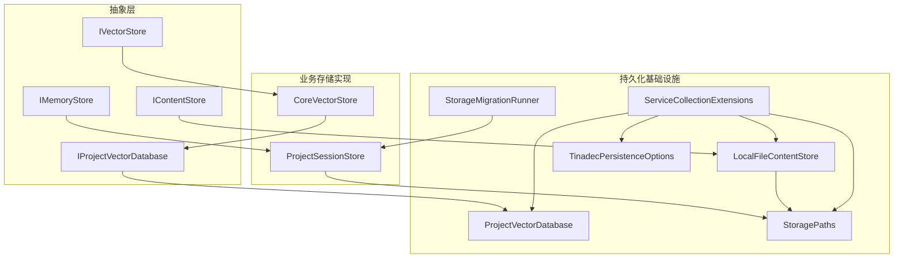
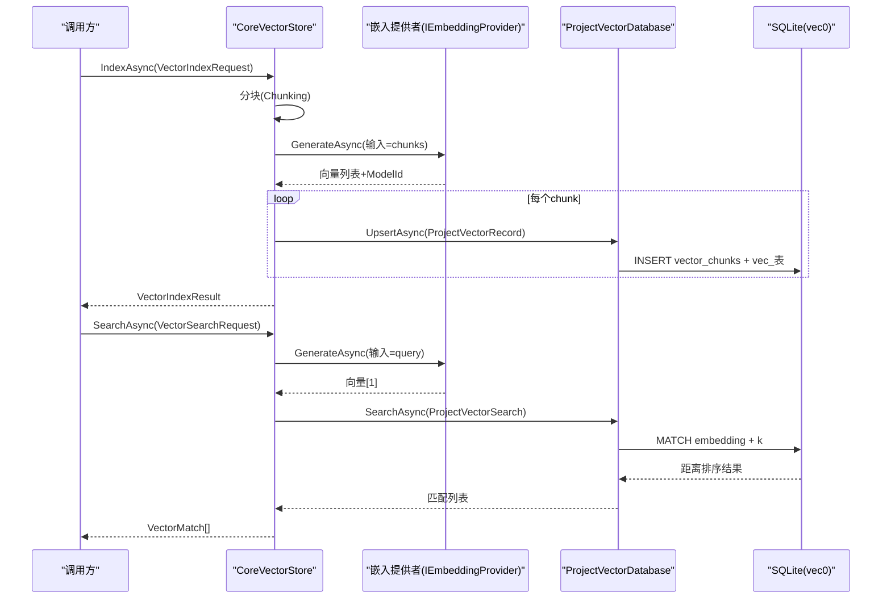
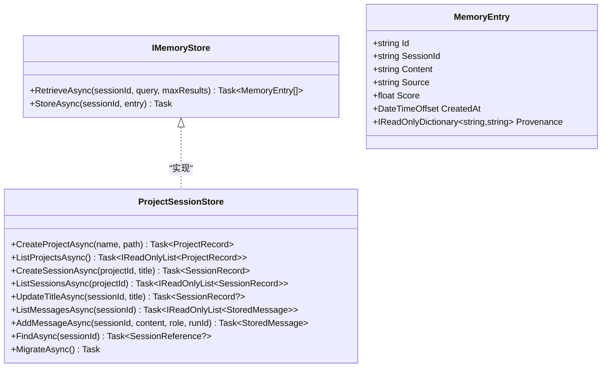
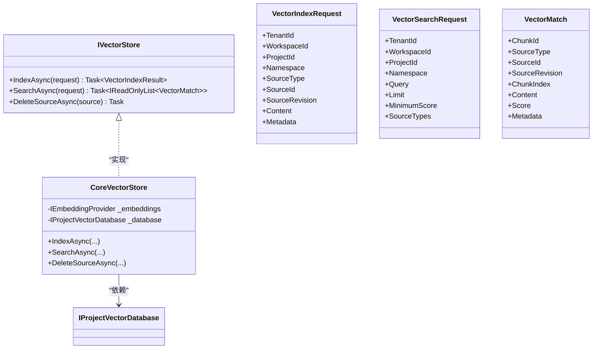
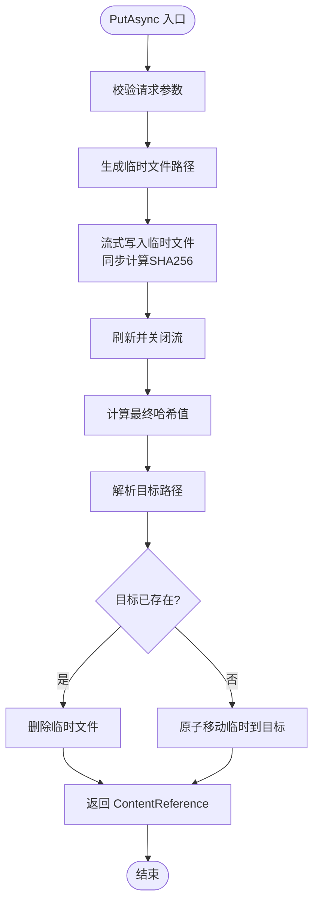
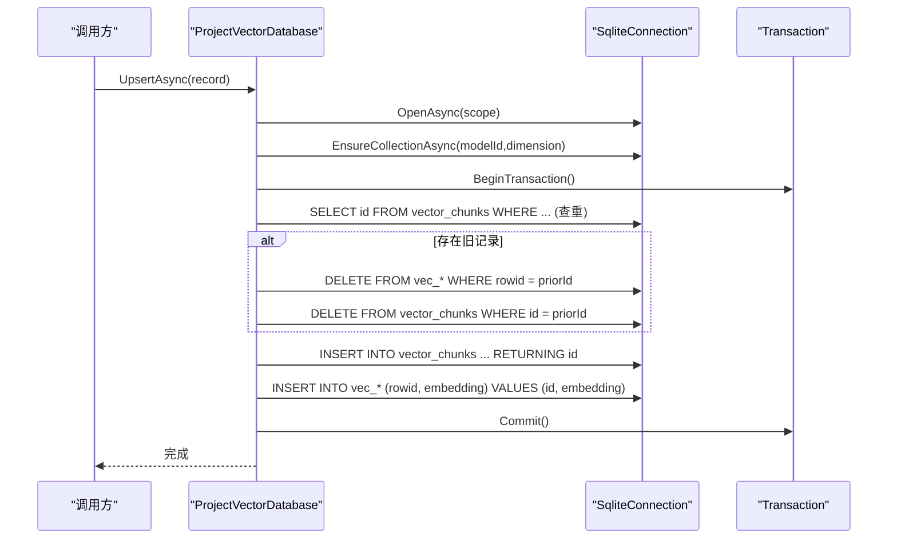
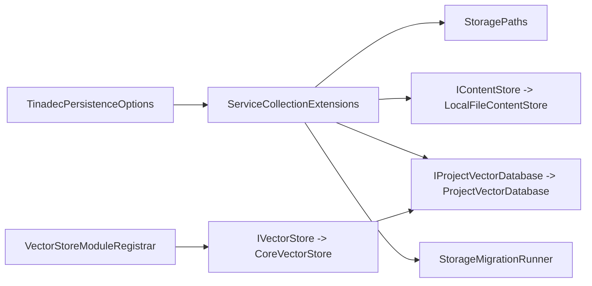

# 存储后端抽象

<cite>
**本文引用的文件**   
- [IMemoryStore.cs](file://TinadecCore/Abstractions/Ports/IMemoryStore.cs)
- [IVectorStore.cs](file://TinadecCore/Abstractions/Ports/IVectorStore.cs)
- [IContentStore.cs](file://TinadecCore/Persistence/IContentStore.cs)
- [LocalFileContentStore.cs](file://TinadecCore/Persistence/LocalFileContentStore.cs)
- [ProjectSessionStore.cs](file://TinadecCore/Memory/ProjectSessionStore.cs)
- [IProjectVectorDatabase.cs](file://TinadecCore/Persistence/IProjectVectorDatabase.cs)
- [ProjectVectorDatabase.cs](file://TinadecCore/Persistence/ProjectVectorDatabase.cs)
- [VectorStoreModuleRegistrar.cs](file://TinadecCore/VectorStore/VectorStoreModuleRegistrar.cs)
- [ServiceCollectionExtensions.cs](file://TinadecCore/Persistence/ServiceCollectionExtensions.cs)
- [TinadecPersistenceOptions.cs](file://TinadecCore/Persistence/TinadecPersistenceOptions.cs)
- [StoragePaths.cs](file://TinadecCore/Persistence/StoragePaths.cs)
- [StorageMigration.cs](file://TinadecCore/Persistence/StorageMigration.cs)
</cite>

## 目录
1. [简介](#简介)
2. [项目结构](#项目结构)
3. [核心组件](#核心组件)
4. [架构总览](#架构总览)
5. [详细组件分析](#详细组件分析)
6. [依赖关系分析](#依赖关系分析)
7. [性能考虑](#性能考虑)
8. [故障排查指南](#故障排查指南)
9. [结论](#结论)
10. [附录](#附录)

## 简介
本文件系统化梳理 TinadecOffice 的存储后端抽象设计，覆盖 IMemoryStore、IVectorStore 接口定义与多种存储后端的实现差异（内存/会话持久化、向量数据库、文件系统内容存储）。同时给出自定义存储后端开发指南（支持 PostgreSQL、SQLite），并说明数据迁移策略、备份恢复与性能优化建议。最后提供存储选择策略、缓存机制和数据一致性保证方案，帮助读者在不同场景下做出合理的技术选型。

## 项目结构
存储相关能力分布在 Abstractions、Persistence、Memory、VectorStore 等模块中：
- Abstractions/Ports：对外暴露的存储端口（IMemoryStore、IVectorStore）
- Persistence：通用持久化基础设施（内容存储 IContentStore、项目级向量数据库 IProjectVectorDatabase、路径解析 StoragePaths、配置与注册 ServiceCollectionExtensions、迁移参与者 StorageMigration）
- Memory：会话与消息持久化（ProjectSessionStore）
- VectorStore：向量检索模块装配与核心编排（VectorStoreModuleRegistrar、CoreVectorStore）

图表来源 
- [IMemoryStore.cs:1-31](file://TinadecCore/Abstractions/Ports/IMemoryStore.cs#L1-L31)
- [IVectorStore.cs:1-59](file://TinadecCore/Abstractions/Ports/IVectorStore.cs#L1-L59)
- [IContentStore.cs:1-20](file://TinadecCore/Persistence/IContentStore.cs#L1-L20)
- [IProjectVectorDatabase.cs:1-57](file://TinadecCore/Persistence/IProjectVectorDatabase.cs#L1-L57)
- [LocalFileContentStore.cs:1-68](file://TinadecCore/Persistence/LocalFileContentStore.cs#L1-L68)
- [ProjectVectorDatabase.cs:1-174](file://TinadecCore/Persistence/ProjectVectorDatabase.cs#L1-L174)
- [ProjectSessionStore.cs:1-219](file://TinadecCore/Memory/ProjectSessionStore.cs#L1-L219)
- [VectorStoreModuleRegistrar.cs:1-105](file://TinadecCore/VectorStore/VectorStoreModuleRegistrar.cs#L1-L105)
- [ServiceCollectionExtensions.cs:1-122](file://TinadecCore/Persistence/ServiceCollectionExtensions.cs#L1-L122)
- [TinadecPersistenceOptions.cs:1-48](file://TinadecCore/Persistence/TinadecPersistenceOptions.cs#L1-L48)
- [StoragePaths.cs:1-64](file://TinadecCore/Persistence/StoragePaths.cs#L1-L64)
- [StorageMigration.cs:1-41](file://TinadecCore/Persistence/StorageMigration.cs#L1-L41)

章节来源
- [ServiceCollectionExtensions.cs:1-122](file://TinadecCore/Persistence/ServiceCollectionExtensions.cs#L1-L122)
- [TinadecPersistenceOptions.cs:1-48](file://TinadecCore/Persistence/TinadecPersistenceOptions.cs#L1-L48)
- [StoragePaths.cs:1-64](file://TinadecCore/Persistence/StoragePaths.cs#L1-L64)

## 核心组件
- IMemoryStore：面向 Agent 会话记忆的能力抽象，提供按会话查询与写入记忆条目（含溯源信息、分数、时间戳等）。
- IVectorStore：语义索引与检索能力抽象，包含分块索引、向量搜索、按源删除等功能。
- IContentStore：不可变大内容存储抽象，以引用+完整性元数据的方式管理二进制或文本内容。
- IProjectVectorDatabase：项目级向量数据库抽象，封装 Upsert/Search/DeleteSource 等操作。
- ProjectSessionStore：会话与消息的持久化实现，结合 EF Core 与本地 JSON 历史文件，提供并发安全写入与迁移参与。
- LocalFileContentStore：基于文件系统的不可变内容存储实现，具备流式写入、SHA256 校验、原子替换等特性。
- ProjectVectorDatabase：基于 SQLite vec0 扩展的项目级向量数据库实现，维护 chunk 表与按模型维度隔离的虚拟表。
- CoreVectorStore：向量检索模块的核心编排器，负责分块、调用嵌入生成、落库与结果映射。

章节来源
- [IMemoryStore.cs:1-31](file://TinadecCore/Abstractions/Ports/IMemoryStore.cs#L1-L31)
- [IVectorStore.cs:1-59](file://TinadecCore/Abstractions/Ports/IVectorStore.cs#L1-L59)
- [IContentStore.cs:1-20](file://TinadecCore/Persistence/IContentStore.cs#L1-L20)
- [IProjectVectorDatabase.cs:1-57](file://TinadecCore/Persistence/IProjectVectorDatabase.cs#L1-L57)
- [ProjectSessionStore.cs:1-219](file://TinadecCore/Memory/ProjectSessionStore.cs#L1-L219)
- [LocalFileContentStore.cs:1-68](file://TinadecCore/Persistence/LocalFileContentStore.cs#L1-L68)
- [ProjectVectorDatabase.cs:1-174](file://TinadecCore/Persistence/ProjectVectorDatabase.cs#L1-L174)
- [VectorStoreModuleRegistrar.cs:1-105](file://TinadecCore/VectorStore/VectorStoreModuleRegistrar.cs#L1-L105)

## 架构总览
整体采用“接口抽象 + 多后端实现”的分层设计：
- 上层通过 IMemoryStore、IVectorStore、IContentStore、IProjectVectorDatabase 进行解耦调用
- 中间层由 ServiceCollectionExtensions 统一注册具体实现，并根据配置选择 SQLite 或 PostgreSQL（EF Core）
- 底层由 StoragePaths 统一管理数据根目录与文件路径，确保安全性与可移植性
- 向量检索由 CoreVectorStore 编排嵌入生成与持久化，ProjectVectorDatabase 使用 SQLite vec0 完成相似度检索

图表来源 
- [VectorStoreModuleRegistrar.cs:29-105](file://TinadecCore/VectorStore/VectorStoreModuleRegistrar.cs#L29-L105)
- [ProjectVectorDatabase.cs:20-89](file://TinadecCore/Persistence/ProjectVectorDatabase.cs#L20-L89)
- [IVectorStore.cs:1-59](file://TinadecCore/Abstractions/Ports/IVectorStore.cs#L1-L59)

## 详细组件分析

### IMemoryStore 与 ProjectSessionStore
- IMemoryStore 定义了 RetrieveAsync/StoreAsync 两个方法，用于按会话检索和写入记忆条目（含 Id、SessionId、Content、Source、Score、CreatedAt、Provenance）。
- ProjectSessionStore 实现了会话与消息的持久化：
  - 会话创建、列表、标题更新、消息追加（并发控制使用 SemaphoreSlim）
  - 历史消息以 JSON 文件形式存储在 StoragePaths.SessionHistory，采用临时文件+原子替换保障一致性
  - 会话元数据与版本信息保存在 EF Core 数据库，支持租户/工作区隔离与归档过滤
  - 实现 IStorageMigrationParticipant，启动时执行迁移与遗留数据修复

图表来源 
- [IMemoryStore.cs:1-31](file://TinadecCore/Abstractions/Ports/IMemoryStore.cs#L1-L31)
- [ProjectSessionStore.cs:1-219](file://TinadecCore/Memory/ProjectSessionStore.cs#L1-L219)

章节来源
- [IMemoryStore.cs:1-31](file://TinadecCore/Abstractions/Ports/IMemoryStore.cs#L1-L31)
- [ProjectSessionStore.cs:1-219](file://TinadecCore/Memory/ProjectSessionStore.cs#L1-L219)

### IVectorStore 与 CoreVectorStore
- IVectorStore 定义了 IndexAsync、SearchAsync、DeleteSourceAsync 三个方法，以及项目范围与作用域类型（TenantId/WorkspaceId/ProjectId、Namespace、SourceType/Id、Revision）。
- CoreVectorStore 作为编排器：
  - 将输入内容按固定长度分块，调用嵌入生成服务得到向量
  - 为每个 chunk 构造 ProjectVectorRecord 并调用 IProjectVectorDatabase.UpsertAsync
  - 搜索时将查询转为向量，调用 IProjectVectorDatabase.SearchAsync 并按最小分数与源类型过滤
  - 删除按 Namespace/SourceType/SourceId 清理对应源的所有分块

图表来源 
- [IVectorStore.cs:1-59](file://TinadecCore/Abstractions/Ports/IVectorStore.cs#L1-L59)
- [VectorStoreModuleRegistrar.cs:29-105](file://TinadecCore/VectorStore/VectorStoreModuleRegistrar.cs#L29-L105)
- [IProjectVectorDatabase.cs:1-57](file://TinadecCore/Persistence/IProjectVectorDatabase.cs#L1-L57)

章节来源
- [IVectorStore.cs:1-59](file://TinadecCore/Abstractions/Ports/IVectorStore.cs#L1-L59)
- [VectorStoreModuleRegistrar.cs:1-105](file://TinadecCore/VectorStore/VectorStoreModuleRegistrar.cs#L1-L105)

### IContentStore 与 LocalFileContentStore
- IContentStore 提供 PutAsync/OpenReadAsync/ExistsAsync/DeleteAsync，返回 ContentReference（Value/Sha256/Length/MediaType）。
- LocalFileContentStore 实现要点：
  - 流式写入临时文件，边写边计算 SHA256，完成后原子移动到目标路径
  - 读取使用异步 FileStream，支持并发只读
  - 删除直接移除文件；存在性检查基于路径判断
  - 所有路径通过 StoragePaths 解析，防止越权访问

图表来源 
- [IContentStore.cs:1-20](file://TinadecCore/Persistence/IContentStore.cs#L1-L20)
- [LocalFileContentStore.cs:1-68](file://TinadecCore/Persistence/LocalFileContentStore.cs#L1-L68)
- [StoragePaths.cs:1-64](file://TinadecCore/Persistence/StoragePaths.cs#L1-L64)

章节来源
- [IContentStore.cs:1-20](file://TinadecCore/Persistence/IContentStore.cs#L1-L20)
- [LocalFileContentStore.cs:1-68](file://TinadecCore/Persistence/LocalFileContentStore.cs#L1-L68)
- [StoragePaths.cs:1-64](file://TinadecCore/Persistence/StoragePaths.cs#L1-L64)

### ProjectVectorDatabase（SQLite vec0）
- 维护 vector_chunks 表（分块元数据与内容）与按模型维度隔离的虚拟表（vec_*）存储向量
- Upsert 流程：先查是否存在相同 source+revision+chunk_index 的记录，若存在则删除旧记录再插入新记录，随后在向量表中插入 embedding
- Search 流程：使用 vec0 的 MATCH 操作进行近似最近邻检索，结合 namespace/model_id/source_types 过滤，并将距离转换为分数
- DeleteSource 流程：查找某源的所有分块，逐个删除向量表与 chunks 表中的记录

图表来源 
- [ProjectVectorDatabase.cs:20-60](file://TinadecCore/Persistence/ProjectVectorDatabase.cs#L20-L60)
- [ProjectVectorDatabase.cs:109-141](file://TinadecCore/Persistence/ProjectVectorDatabase.cs#L109-L141)

章节来源
- [ProjectVectorDatabase.cs:1-174](file://TinadecCore/Persistence/ProjectVectorDatabase.cs#L1-L174)
- [IProjectVectorDatabase.cs:1-57](file://TinadecCore/Persistence/IProjectVectorDatabase.cs#L1-L57)

## 依赖关系分析
- ServiceCollectionExtensions 负责注册：
  - IDatabaseConnectionInfo、ITinadecDatabaseConfigurer、IDatabaseReadiness
  - StoragePaths、IContentStore(LocalFileContentStore)、IProjectVectorDatabase(ProjectVectorDatabase)
  - 根据操作系统选择 SecretStore 实现
  - StorageMigrationRunner
- TinadecPersistenceOptions 提供 Provider、DataRoot、ApplyMigrationsOnStartup、ProbeTimeoutSeconds 等配置项
- StoragePaths 集中管理 data root 下的各类文件路径，并进行安全检查（防越界）
- VectorStoreModuleRegistrar 将 IVectorStore 绑定到 CoreVectorStore，声明模块能力与依赖

图表来源 
- [ServiceCollectionExtensions.cs:1-122](file://TinadecCore/Persistence/ServiceCollectionExtensions.cs#L1-L122)
- [TinadecPersistenceOptions.cs:1-48](file://TinadecCore/Persistence/TinadecPersistenceOptions.cs#L1-L48)
- [VectorStoreModuleRegistrar.cs:1-27](file://TinadecCore/VectorStore/VectorStoreModuleRegistrar.cs#L1-L27)

章节来源
- [ServiceCollectionExtensions.cs:1-122](file://TinadecCore/Persistence/ServiceCollectionExtensions.cs#L1-L122)
- [VectorStoreModuleRegistrar.cs:1-105](file://TinadecCore/VectorStore/VectorStoreModuleRegistrar.cs#L1-L105)

## 性能考虑
- 向量检索
  - 使用 SQLite vec0 虚拟表进行近似最近邻检索，避免全表扫描；按 model_id 维度隔离表，提升索引效率
  - 搜索时限制 k 值上限（如 200）并应用 MinimumScore 过滤，减少无效结果
  - 分块大小固定（例如 1600 字符），平衡嵌入质量与索引规模
- 内容存储
  - 流式写入与增量哈希计算，降低内存占用
  - 原子替换（临时文件+Replace/Move）避免部分写入导致的数据损坏
  - 只读流打开时使用共享读模式，提高并发读取吞吐
- 会话历史
  - 使用临时文件序列化后原子替换，避免并发写入冲突
  - 对同一会话的写入使用信号量串行化，保证顺序一致性与版本递增
- 数据库连接与迁移
  - 默认启用 SQLite 本地模式，PostgreSQL 需显式配置连接字符串
  - ApplyMigrationsOnStartup 控制是否启动时自动迁移，避免多实例竞争

[本节为通用性能指导，不直接分析具体文件]

## 故障排查指南
- 向量维度不一致
  - 现象：Upsert 时报错提示模型维度变化
  - 原因：不同模型产生的 embedding 维度不同，但同一 model_id 被复用
  - 处理：确保 ModelId 与维度一一对应，或在存储层增加维度校验与回滚
- 路径越界异常
  - 现象：StoragePaths 抛出“Core storage path escaped the configured data root”
  - 原因：传入的 reference 非相对路径或被篡改
  - 处理：严格使用 StoragePaths 提供的 API 生成与解析路径
- 迁移未执行
  - 现象：PostgreSQL 模式下未自动迁移
  - 原因：ApplyMigrationsOnStartup=false 或未配置连接字符串
  - 处理：确认配置项与连接字符串名称正确，必要时手动触发迁移
- 并发写入冲突
  - 现象：会话历史写入失败或数据不一致
  - 原因：缺少并发控制或临时文件命名冲突
  - 处理：确保使用信号量串行化写入，并使用唯一临时文件名

章节来源
- [ProjectVectorDatabase.cs:124-141](file://TinadecCore/Persistence/ProjectVectorDatabase.cs#L124-L141)
- [StoragePaths.cs:34-53](file://TinadecCore/Persistence/StoragePaths.cs#L34-L53)
- [StorageMigration.cs:27-39](file://TinadecCore/Persistence/StorageMigration.cs#L27-L39)
- [ProjectSessionStore.cs:121-139](file://TinadecCore/Memory/ProjectSessionStore.cs#L121-L139)

## 结论
本抽象通过清晰的接口边界与模块化实现，将内存/向量/内容存储解耦，便于在不同部署环境（桌面 SQLite 与服务器 PostgreSQL）间切换。CoreVectorStore 与 ProjectVectorDatabase 的组合提供了轻量且高效的语义检索能力；LocalFileContentStore 保障了大内容的可靠存储；ProjectSessionStore 兼顾了高并发写入与数据一致性。配合统一的配置与迁移框架，系统具备良好的可扩展性与运维友好性。

[本节为总结性内容，不直接分析具体文件]

## 附录

### 自定义存储后端开发指南
- 新增 IContentStore 实现
  - 实现 PutAsync/OpenReadAsync/ExistsAsync/DeleteAsync
  - 使用 StoragePaths 生成与解析路径，确保安全性
  - 推荐流式读写与原子替换，保障一致性与性能
- 新增 IProjectVectorDatabase 实现
  - 实现 UpsertAsync/SearchAsync/DeleteSourceAsync
  - 保持与 SQLite 实现一致的语义：source 唯一约束、按 model_id 隔离、距离转分数
  - 注意事务与并发安全
- 新增 IMemoryStore 实现
  - 实现 RetrieveAsync/StoreAsync，支持按会话检索与写入
  - 如需持久化，建议使用 EF Core 或 NoSQL 存储，并保持与 MemoryEntry 字段一致
- 新增 IVectorStore 实现
  - 若已有外部向量数据库（如 Pinecone、Weaviate），可直接实现 IVectorStore
  - 若需要嵌入生成，仍可通过 IEmbeddingProvider 获取向量
- 注册与配置
  - 在 ServiceCollectionExtensions 中注册新的实现
  - 在 TinadecPersistenceOptions 中添加必要配置项
  - 如需迁移，实现 IStorageMigrationParticipant 并在启动时执行

章节来源
- [IContentStore.cs:1-20](file://TinadecCore/Persistence/IContentStore.cs#L1-L20)
- [LocalFileContentStore.cs:1-68](file://TinadecCore/Persistence/LocalFileContentStore.cs#L1-L68)
- [IProjectVectorDatabase.cs:1-57](file://TinadecCore/Persistence/IProjectVectorDatabase.cs#L1-L57)
- [ProjectVectorDatabase.cs:1-174](file://TinadecCore/Persistence/ProjectVectorDatabase.cs#L1-L174)
- [IMemoryStore.cs:1-31](file://TinadecCore/Abstractions/Ports/IMemoryStore.cs#L1-L31)
- [IVectorStore.cs:1-59](file://TinadecCore/Abstractions/Ports/IVectorStore.cs#L1-L59)
- [ServiceCollectionExtensions.cs:1-122](file://TinadecCore/Persistence/ServiceCollectionExtensions.cs#L1-L122)
- [TinadecPersistenceOptions.cs:1-48](file://TinadecCore/Persistence/TinadecPersistenceOptions.cs#L1-L48)
- [StorageMigration.cs:1-41](file://TinadecCore/Persistence/StorageMigration.cs#L1-L41)

### 数据迁移策略
- 启动时迁移
  - 通过 StorageMigrationRunner 遍历所有 IStorageMigrationParticipant 执行迁移
  - PostgreSQL 默认不自动迁移，需显式开启 ApplyMigrationsOnStartup
- 遗留数据修复
  - ProjectSessionStore.MigrateAsync 会将空 TenantId/WorkspaceId 的记录迁移到当前租户上下文
- 幂等性
  - 迁移脚本应保证幂等，避免重复执行造成副作用

章节来源
- [StorageMigration.cs:14-41](file://TinadecCore/Persistence/StorageMigration.cs#L14-L41)
- [ProjectSessionStore.cs:149-159](file://TinadecCore/Memory/ProjectSessionStore.cs#L149-L159)
- [TinadecPersistenceOptions.cs:24-32](file://TinadecCore/Persistence/TinadecPersistenceOptions.cs#L24-L32)

### 备份与恢复
- 内容存储
  - 基于 StoragePaths 的 content 目录可按租户/工作区/类型组织，支持整目录快照
  - 由于 ContentReference 包含 Sha256，恢复后可通过校验确保完整性
- 会话历史
  - 每个会话的历史文件独立，可按 sessionId 单独备份与恢复
- 向量数据库
  - SQLite 文件可直接复制备份；恢复时需确保 vec0 扩展可用
  - 建议在迁移前导出 schema 与数据，以便跨版本恢复

[本节为通用备份恢复指导，不直接分析具体文件]

### 存储选择策略
- 桌面/单机
  - 默认 SQLite，零配置、易部署，适合本地开发与测试
- 服务器/多实例
  - PostgreSQL，支持连接池、高可用与分布式部署；需显式配置连接字符串与迁移策略
- 向量检索
  - 轻量场景：SQLite vec0，满足大多数项目级检索需求
  - 大规模/云原生：可替换为专用向量数据库（实现 IProjectVectorDatabase 或 IVectorStore）

[本节为通用选型指导，不直接分析具体文件]

### 缓存机制
- 建议在上层引入结果缓存（如内存缓存或分布式缓存）以减少重复嵌入生成与检索开销
- 针对频繁查询的会话历史或热门内容，可加读缓存；写路径仍需保证一致性
- 缓存失效策略应与数据版本（如 HistoryRevision、SourceRevision）联动

[本节为通用缓存指导，不直接分析具体文件]

### 数据一致性保证
- 写入原子性
  - 内容存储：临时文件+原子替换
  - 会话历史：临时文件+原子替换
- 并发控制
  - 会话写入使用信号量串行化，避免竞态条件
- 事务与回滚
  - 向量数据库 Upsert 使用事务，确保元数据与向量表一致性
- 校验与幂等
  - 内容存储通过 SHA256 校验完整性
  - 迁移脚本幂等，避免重复执行

章节来源
- [LocalFileContentStore.cs:17-48](file://TinadecCore/Persistence/LocalFileContentStore.cs#L17-L48)
- [ProjectSessionStore.cs:175-196](file://TinadecCore/Memory/ProjectSessionStore.cs#L175-L196)
- [ProjectVectorDatabase.cs:25-60](file://TinadecCore/Persistence/ProjectVectorDatabase.cs#L25-L60)
- [ProjectVectorDatabase.cs:100-107](file://TinadecCore/Persistence/ProjectVectorDatabase.cs#L100-L107)