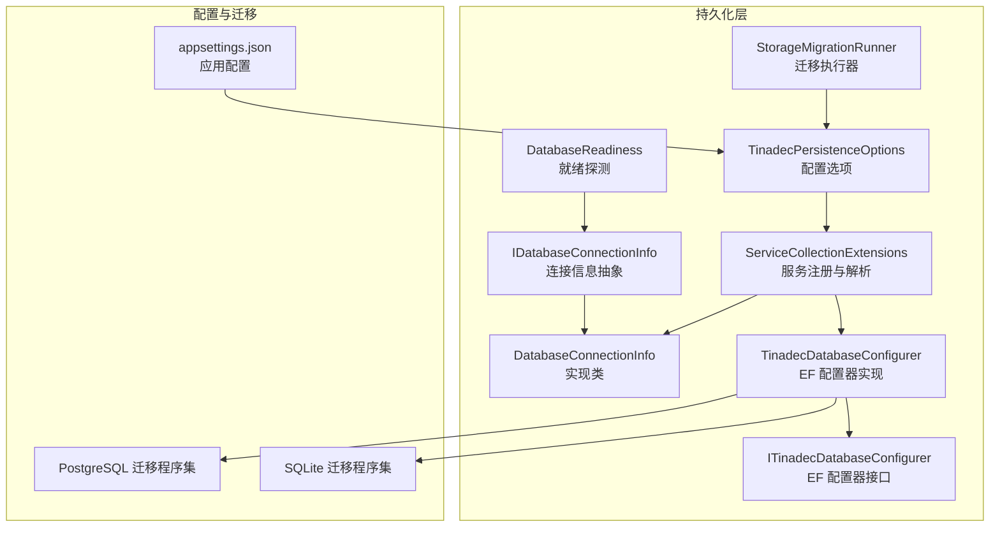
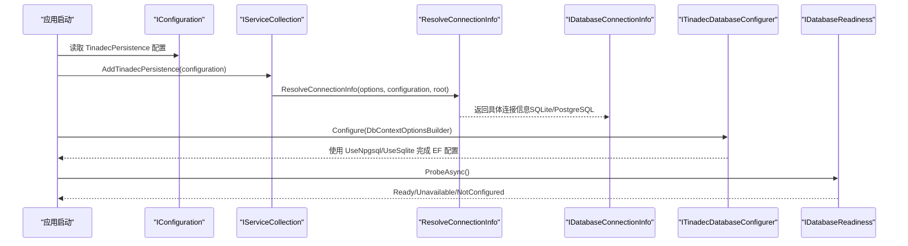
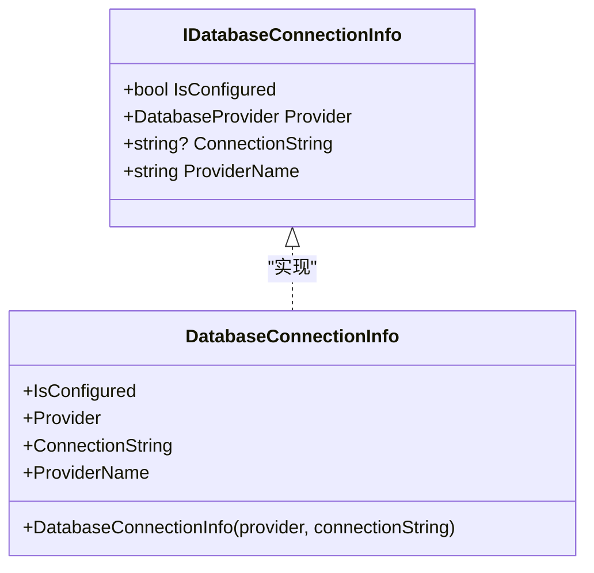
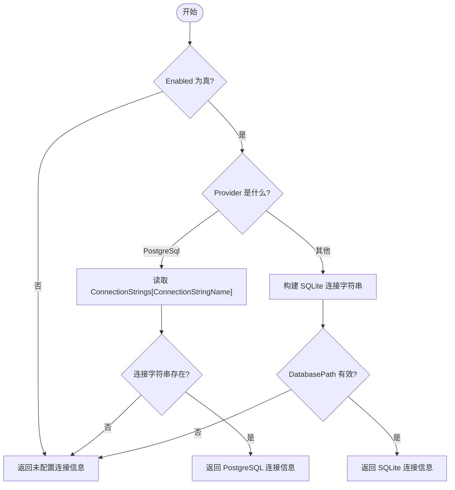
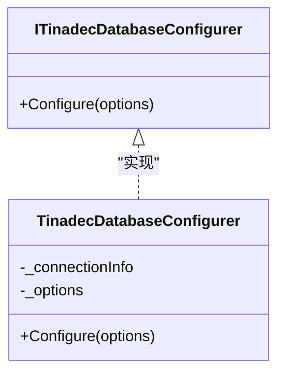

# 数据库连接信息

<cite>
**本文引用的文件**   
- [IDatabaseConnectionInfo.cs](file://TinadecCore\Persistence\IDatabaseConnectionInfo.cs)
- [DatabaseProvider.cs](file://TinadecCore\Persistence\DatabaseProvider.cs)
- [DatabaseConnectionInfo.cs](file://TinadecCore\Persistence\DatabaseConnectionInfo.cs)
- [TinadecPersistenceOptions.cs](file://TinadecCore\Persistence\TinadecPersistenceOptions.cs)
- [ServiceCollectionExtensions.cs](file://TinadecCore\Persistence\ServiceCollectionExtensions.cs)
- [ITinadecDatabaseConfigurer.cs](file://TinadecCore\Persistence\ITinadecDatabaseConfigurer.cs)
- [TinadecDatabaseConfigurer.cs](file://TinadecCore\Persistence\TinadecDatabaseConfigurer.cs)
- [DatabaseReadiness.cs](file://TinadecCore\Persistence\DatabaseReadiness.cs)
- [StorageMigration.cs](file://TinadecCore\Persistence\StorageMigration.cs)
- [appsettings.json](file://TinadecCore\Api\appsettings.json)
- [InitialStorageMigrations.cs (PostgreSQL)](file://TinadecCore\Storage.Migrations.PostgreSql\InitialStorageMigrations.cs)
- [InitialStorageMigrations.cs (SQLite)](file://TinadecCore\Storage.Migrations.Sqlite\InitialStorageMigrations.cs)
</cite>

## 目录
1. [简介](#简介)
2. [项目结构](#项目结构)
3. [核心组件](#核心组件)
4. [架构总览](#架构总览)
5. [详细组件分析](#详细组件分析)
6. [依赖关系分析](#依赖关系分析)
7. [性能与连接池](#性能与连接池)
8. [故障排除指南](#故障排除指南)
9. [结论](#结论)
10. [附录：配置示例与环境差异](#附录配置示例与环境差异)

## 简介
本文件面向数据库连接信息管理，围绕 IDatabaseConnectionInfo 接口设计与多种数据库支持展开，重点说明 SQLite、PostgreSQL 的连接配置方式、连接字符串管理、安全加密策略以及启动时的迁移与就绪检查机制。同时解释 DatabaseProvider 工厂模式与动态连接选择流程，并提供不同环境下的配置示例与常见问题排查方法。

## 项目结构
与数据库连接相关的代码集中在 TinadecCore.Persistence 模块中，并通过 EF Core 的 DbContextOptionsBuilder 将具体提供者注入到各业务 DbContext。配置文件位于 API 层的 appsettings.json，用于启用/禁用持久化、选择提供者和设置连接参数。



图表来源 
- [ServiceCollectionExtensions.cs:15-49](file://TinadecCore\Persistence\ServiceCollectionExtensions.cs#L15-L49)
- [TinadecDatabaseConfigurer.cs:19-46](file://TinadecCore\Persistence\TinadecDatabaseConfigurer.cs#L19-L46)
- [DatabaseReadiness.cs:24-73](file://TinadecCore\Persistence\DatabaseReadiness.cs#L24-L73)
- [StorageMigration.cs:27-39](file://TinadecCore\Persistence\StorageMigration.cs#L27-L39)
- [appsettings.json:12-22](file://TinadecCore\Api\appsettings.json#L12-L22)

章节来源
- [ServiceCollectionExtensions.cs:15-49](file://TinadecCore\Persistence\ServiceCollectionExtensions.cs#L15-L49)
- [appsettings.json:12-22](file://TinadecCore\Api\appsettings.json#L12-L22)

## 核心组件
- IDatabaseConnectionInfo：定义已解析的连接信息抽象，包含是否已配置、提供者类型、连接字符串和提供者名称（sqlite/postgresql）。
- DatabaseProvider：枚举当前支持的数据库后端（默认 SQLite，可选 PostgreSQL）。
- DatabaseConnectionInfo：IDatabaseConnectionInfo 的具体实现，根据 Provider 返回 ProviderName，并判断 IsConfigured。
- TinadecPersistenceOptions：统一的持久化配置，包括 Enabled、Provider、SQLite/PostgreSQL 子配置、DataRoot、ApplyMigrationsOnStartup、ProbeTimeoutSeconds。
- ServiceCollectionExtensions：注册持久化相关服务，解析 IDatabaseConnectionInfo，并根据 Provider 动态生成连接字符串。
- ITinadecDatabaseConfigurer / TinadecDatabaseConfigurer：将活动提供者应用到 EF Core DbContextOptionsBuilder，并在未配置时抛出明确异常。
- DatabaseReadiness：按提供者进行连接就绪探测（SELECT 1），支持超时控制与日志记录。
- StorageMigrationRunner：根据配置决定是否在启动时执行迁移参与者。

章节来源
- [IDatabaseConnectionInfo.cs:6-17](file://TinadecCore\Persistence\IDatabaseConnectionInfo.cs#L6-L17)
- [DatabaseProvider.cs:6-10](file://TinadecCore\Persistence\DatabaseProvider.cs#L6-L10)
- [DatabaseConnectionInfo.cs:3-22](file://TinadecCore\Persistence\DatabaseConnectionInfo.cs#L3-L22)
- [TinadecPersistenceOptions.cs:7-32](file://TinadecCore\Persistence\TinadecPersistenceOptions.cs#L7-L32)
- [ServiceCollectionExtensions.cs:32-48](file://TinadecCore\Persistence\ServiceCollectionExtensions.cs#L32-L48)
- [ITinadecDatabaseConfigurer.cs:9-16](file://TinadecCore\Persistence\ITinadecDatabaseConfigurer.cs#L9-L16)
- [TinadecDatabaseConfigurer.cs:19-46](file://TinadecCore\Persistence\TinadecDatabaseConfigurer.cs#L19-L46)
- [DatabaseReadiness.cs:24-73](file://TinadecCore\Persistence\DatabaseReadiness.cs#L24-L73)
- [StorageMigration.cs:27-39](file://TinadecCore\Persistence\StorageMigration.cs#L27-L39)

## 架构总览
下图展示了从配置加载到 EF Core 配置与就绪探测的整体流程，体现“工厂模式 + 动态选择”的设计思想。



图表来源 
- [ServiceCollectionExtensions.cs:64-79](file://TinadecCore\Persistence\ServiceCollectionExtensions.cs#L64-L79)
- [TinadecDatabaseConfigurer.cs:37-46](file://TinadecCore\Persistence\TinadecDatabaseConfigurer.cs#L37-L46)
- [DatabaseReadiness.cs:24-73](file://TinadecCore\Persistence\DatabaseReadiness.cs#L24-L73)

## 详细组件分析

### IDatabaseConnectionInfo 与实现
- 设计要点：
  - IsConfigured：基于 ConnectionString 是否为空或空白判断。
  - Provider：标识当前使用的数据库提供者。
  - ConnectionString：EF 兼容的连接字符串；未配置时为 null。
  - ProviderName：统一对外暴露 sqlite | postgresql，便于健康检查与报表。
- 实现细节：
  - DatabaseConnectionInfo 通过 Provider 映射 ProviderName，PostgreSQL 为 "postgresql"，其他为 "sqlite"。



图表来源 
- [IDatabaseConnectionInfo.cs:6-17](file://TinadecCore\Persistence\IDatabaseConnectionInfo.cs#L6-L17)
- [DatabaseConnectionInfo.cs:3-22](file://TinadecCore\Persistence\DatabaseConnectionInfo.cs#L3-L22)

章节来源
- [IDatabaseConnectionInfo.cs:6-17](file://TinadecCore\Persistence\IDatabaseConnectionInfo.cs#L6-L17)
- [DatabaseConnectionInfo.cs:3-22](file://TinadecCore\Persistence\DatabaseConnectionInfo.cs#L3-L22)

### 配置选项与连接字符串解析
- TinadecPersistenceOptions：
  - Enabled：是否启用持久化。
  - Provider：选择 SQLite 或 PostgreSQL。
  - Sqlite.DatabasePath：相对或绝对路径，相对路径会基于 content root 解析。
  - PostgreSql.ConnectionStringName：从 IConfiguration.GetConnectionString(name) 获取连接字符串。
  - ApplyMigrationsOnStartup：PostgreSQL 需显式开启才会在启动时执行迁移。
  - ProbeTimeoutSeconds：就绪探测超时秒数（1-30）。
- 解析逻辑：
  - ResolveConnectionInfo：根据 Provider 分支调用 ResolveSqlite 或 ResolvePostgreSql。
  - ResolveSqlite：构建 Microsoft.Data.Sqlite.SqliteConnectionStringBuilder，DataSource 为完整路径。
  - ResolvePostgreSql：从配置中按名称读取连接字符串。



图表来源 
- [ServiceCollectionExtensions.cs:64-79](file://TinadecCore\Persistence\ServiceCollectionExtensions.cs#L64-L79)
- [ServiceCollectionExtensions.cs:81-101](file://TinadecCore\Persistence\ServiceCollectionExtensions.cs#L81-L101)
- [ServiceCollectionExtensions.cs:103-120](file://TinadecCore\Persistence\ServiceCollectionExtensions.cs#L103-L120)

章节来源
- [TinadecPersistenceOptions.cs:7-32](file://TinadecCore\Persistence\TinadecPersistenceOptions.cs#L7-L32)
- [ServiceCollectionExtensions.cs:64-120](file://TinadecCore\Persistence\ServiceCollectionExtensions.cs#L64-L120)

### EF 配置器（工厂模式与动态选择）
- ITinadecDatabaseConfigurer：对外暴露 Configure(DbContextOptionsBuilder)，由业务模块在注册 DbContext 时调用。
- TinadecDatabaseConfigurer：
  - 校验 Enabled 与连接是否配置，否则抛出 InvalidOperationException。
  - 根据 Provider 选择 UseNpgsql 或 UseSqlite，并指定对应迁移程序集。



图表来源 
- [ITinadecDatabaseConfigurer.cs:9-16](file://TinadecCore\Persistence\ITinadecDatabaseConfigurer.cs#L9-L16)
- [TinadecDatabaseConfigurer.cs:19-46](file://TinadecCore\Persistence\TinadecDatabaseConfigurer.cs#L19-L46)

章节来源
- [ITinadecDatabaseConfigurer.cs:9-16](file://TinadecCore\Persistence\ITinadecDatabaseConfigurer.cs#L9-L16)
- [TinadecDatabaseConfigurer.cs:19-46](file://TinadecCore\Persistence\TinadecDatabaseConfigurer.cs#L19-L46)

### 就绪探测与迁移
- DatabaseReadiness.ProbeAsync：
  - 若未启用或未配置，返回 NotConfigured。
  - 根据 Provider 分别执行 SQLite/PostgreSQL 的 SELECT 1 探测，带超时控制。
  - 成功返回 Ready，失败记录警告日志并返回 Unavailable。
- StorageMigrationRunner.RunAsync：
  - 若未启用或 PostgreSQL 且未开启 ApplyMigrationsOnStartup，则跳过。
  - 依次调用各 IStorageMigrationParticipant.MigrateAsync。

```mermaid
sequenceDiagram
participant Runner as "StorageMigrationRunner"
participant Options as "TinadecPersistenceOptions"
participant Participant as "IStorageMigrationParticipant[]"
Runner->>Options : 读取 Enabled/Provider/ApplyMigrationsOnStartup
alt 条件不满足
Runner-->>Runner : 直接返回
else 条件满足
loop 遍历参与者
Runner->>Participant : MigrateAsync()
Participant-->>Runner : 完成
end
end
```

图表来源 
- [StorageMigration.cs:27-39](file://TinadecCore\Persistence\StorageMigration.cs#L27-L39)

章节来源
- [DatabaseReadiness.cs:24-73](file://TinadecCore\Persistence\DatabaseReadiness.cs#L24-L73)
- [StorageMigration.cs:27-39](file://TinadecCore\Persistence\StorageMigration.cs#L27-L39)

### 迁移程序集与数据模型
- PostgreSQL 与 SQLite 各自拥有独立的迁移程序集，确保部署时可独立演进而不泄露提供者类型到模块。
- 迁移中包含 MemoryDbContext 与 LifecycleDbContext 的初始表结构与索引。

章节来源
- [InitialStorageMigrations.cs (PostgreSQL):1-42](file://TinadecCore\Storage.Migrations.PostgreSql\InitialStorageMigrations.cs#L1-L42)
- [InitialStorageMigrations.cs (SQLite):1-64](file://TinadecCore\Storage.Migrations.Sqlite\InitialStorageMigrations.cs#L1-L64)

## 依赖关系分析
- ServiceCollectionExtensions 依赖 IConfiguration 与 IOptions<TinadecPersistenceOptions>，负责解析连接信息与注册服务。
- TinadecDatabaseConfigurer 依赖 IDatabaseConnectionInfo 与 IOptions<TinadecPersistenceOptions>，决定 EF 提供者的 UseXxx 调用。
- DatabaseReadiness 依赖 IDatabaseConnectionInfo、IOptions<TinadecPersistenceOptions> 与 ILogger，执行连接探测。
- StorageMigrationRunner 依赖 IEnumerable<IStorageMigrationParticipant> 与 IOptions<TinadecPersistenceOptions>，协调迁移执行。

```mermaid
graph LR
SC["ServiceCollectionExtensions"] --> CI["IDatabaseConnectionInfo"]
SC --> TO["IOptions<TinadecPersistenceOptions>]
DC["TinadecDatabaseConfigurer"] --> CI
DC --> TO
DR["DatabaseReadiness"] --> CI
DR --> TO
SM["StorageMigrationRunner"] --> TO
SM --> MP["IStorageMigrationParticipant[]"]
```

图表来源 
- [ServiceCollectionExtensions.cs:32-48](file://TinadecCore\Persistence\ServiceCollectionExtensions.cs#L32-L48)
- [TinadecDatabaseConfigurer.cs:11-17](file://TinadecCore\Persistence\TinadecDatabaseConfigurer.cs#L11-L17)
- [DatabaseReadiness.cs:14-22](file://TinadecCore\Persistence\DatabaseReadiness.cs#L14-L22)
- [StorageMigration.cs:19-25](file://TinadecCore\Persistence\StorageMigration.cs#L19-L25)

章节来源
- [ServiceCollectionExtensions.cs:32-48](file://TinadecCore\Persistence\ServiceCollectionExtensions.cs#L32-L48)
- [TinadecDatabaseConfigurer.cs:11-17](file://TinadecCore\Persistence\TinadecDatabaseConfigurer.cs#L11-L17)
- [DatabaseReadiness.cs:14-22](file://TinadecCore\Persistence\DatabaseReadiness.cs#L14-L22)
- [StorageMigration.cs:19-25](file://TinadecCore\Persistence\StorageMigration.cs#L19-L25)

## 性能与连接池
- SQLite：
  - 单文件数据库，适合本地桌面场景；连接开销低，通常无需复杂连接池。
  - 注意并发写入限制，避免高并发写冲突。
- PostgreSQL：
  - 使用 Npgsql 驱动，建议在生产环境合理设置连接池大小与超时。
  - 可通过外部配置（如环境变量或密钥管理服务）注入连接字符串，避免明文存储。
- 就绪探测：
  - ProbeTimeoutSeconds 控制在 1-30 秒之间，避免阻塞启动流程。
- 迁移：
  - PostgreSQL 默认不在启动时执行迁移，需显式启用 ApplyMigrationsOnStartup，以避免多实例竞争。

章节来源
- [TinadecPersistenceOptions.cs:24-32](file://TinadecCore\Persistence\TinadecPersistenceOptions.cs#L24-L32)
- [DatabaseReadiness.cs:39-41](file://TinadecCore\Persistence\DatabaseReadiness.cs#L39-L41)
- [StorageMigration.cs:29-33](file://TinadecCore\Persistence\StorageMigration.cs#L29-L33)

## 故障排除指南
- 常见错误与定位：
  - 未启用持久化：TinadecPersistence:Enabled=false 会导致所有数据库功能不可用。
  - 连接未配置：
    - SQLite：未设置或为空 DatabasePath。
    - PostgreSQL：未设置 ConnectionStrings[TinadecCore]（或自定义名称）。
  - 启动时迁移被跳过：PostgreSQL 且 ApplyMigrationsOnStartup=false。
  - 就绪探测失败：网络不通、凭据错误、超时等，查看日志中的警告信息。
- 处理步骤：
  - 检查 appsettings.json 或环境变量是否正确设置。
  - 确认 DataRoot 与 SQLite 文件路径可写。
  - 对 PostgreSQL 验证连接字符串与权限。
  - 调整 ProbeTimeoutSeconds 以适配慢网络或慢磁盘。
  - 如需启动迁移，启用 ApplyMigrationsOnStartup。

章节来源
- [TinadecDatabaseConfigurer.cs:23-35](file://TinadecCore\Persistence\TinadecDatabaseConfigurer.cs#L23-L35)
- [DatabaseReadiness.cs:28-36](file://TinadecCore\Persistence\DatabaseReadiness.cs#L28-L36)
- [StorageMigration.cs:29-33](file://TinadecCore\Persistence\StorageMigration.cs#L29-L33)

## 结论
本项目通过 IDatabaseConnectionInfo 抽象与 DatabaseProvider 枚举实现了提供者无关的连接管理与动态选择。SQLite 适用于本地开发，PostgreSQL 适用于生产部署。通过统一的配置项、EF 配置器与就绪探测，系统具备良好的可扩展性与健壮性。建议在敏感环境中结合外部密钥管理来保护连接字符串，并根据运行环境调优连接池与迁移策略。

## 附录：配置示例与环境差异
- 通用配置键：
  - TinadecPersistence:Enabled：是否启用持久化。
  - TinadecPersistence:Provider：选择 SQLite 或 PostgreSQL。
  - TinadecPersistence:Sqlite:DatabasePath：SQLite 文件路径（相对/绝对）。
  - TinadecPersistence:PostgreSql:ConnectionStringName：连接字符串名称。
  - TinadecPersistence:ApplyMigrationsOnStartup：是否在启动时执行迁移。
  - TinadecPersistence:ProbeTimeoutSeconds：就绪探测超时秒数。
- 连接字符串位置：
  - PostgreSQL：ConnectionStrings[TinadecCore]（或自定义名称）。
  - SQLite：通过 DatabasePath 自动构建连接字符串。
- 环境差异：
  - 本地开发：默认 SQLite，快速启动与调试。
  - 生产部署：推荐 PostgreSQL，配合外部密钥管理与连接池优化。

章节来源
- [appsettings.json:9-22](file://TinadecCore\Api\appsettings.json#L9-L22)
- [TinadecPersistenceOptions.cs:11-32](file://TinadecCore\Persistence\TinadecPersistenceOptions.cs#L11-L32)
- [ServiceCollectionExtensions.cs:103-120](file://TinadecCore\Persistence\ServiceCollectionExtensions.cs#L103-L120)