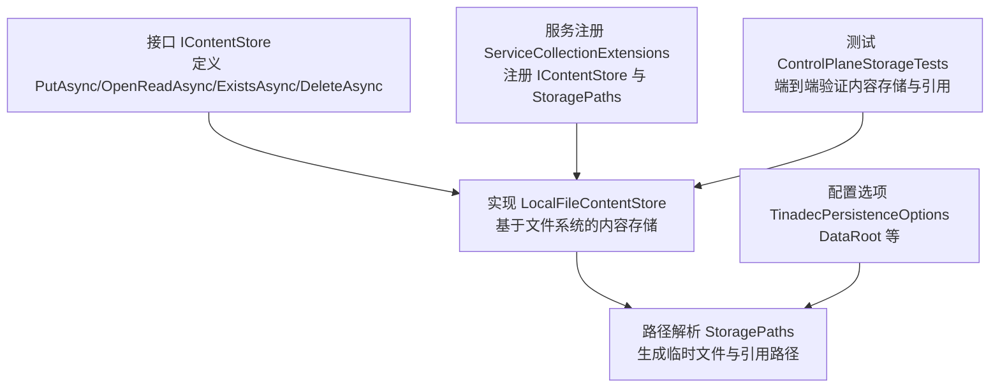
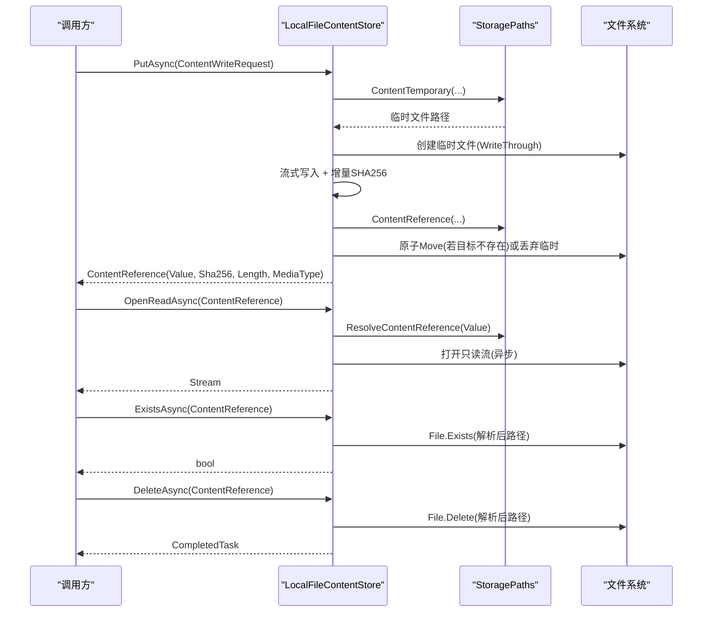
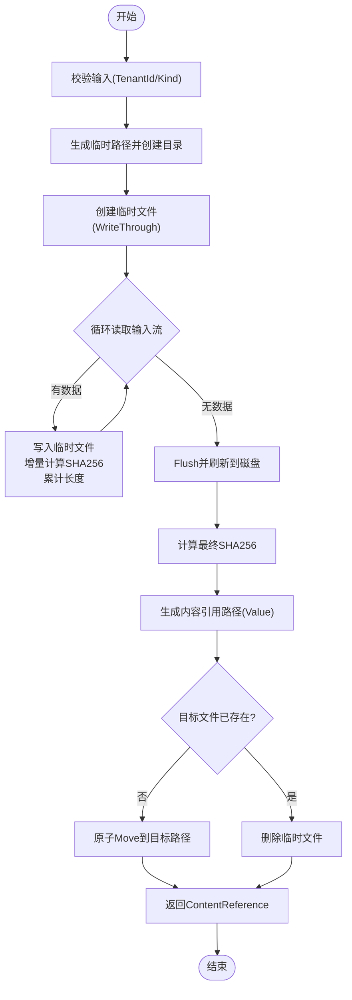
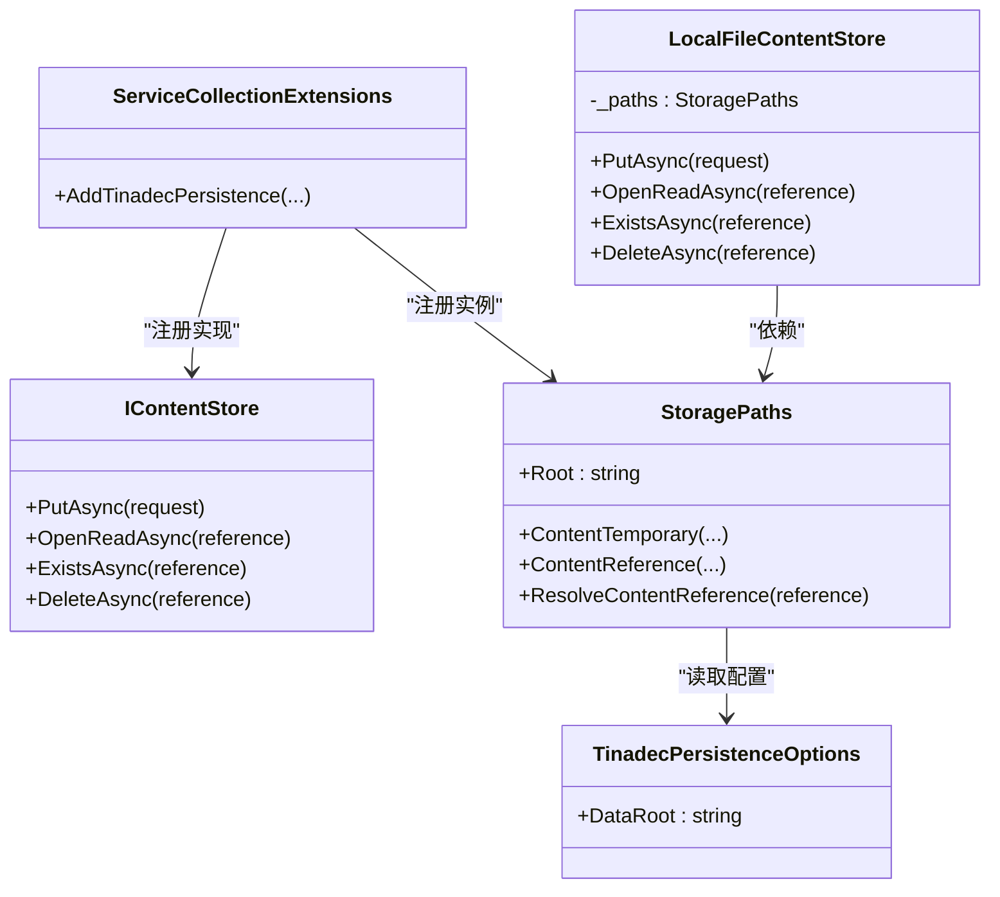

# 文件内容存储

<cite>
**本文引用的文件**   
- [IContentStore.cs](file://TinadecCore\Persistence\IContentStore.cs)
- [LocalFileContentStore.cs](file://TinadecCore\Persistence\LocalFileContentStore.cs)
- [StoragePaths.cs](file://TinadecCore\Persistence\StoragePaths.cs)
- [ServiceCollectionExtensions.cs](file://TinadecCore\Persistence\ServiceCollectionExtensions.cs)
- [TinadecPersistenceOptions.cs](file://TinadecCore\Persistence\TinadecPersistenceOptions.cs)
- [ControlPlaneStorageTests.cs](file://TinadecCore\tests\TinadecCore.Api.Tests\ControlPlaneStorageTests.cs)
</cite>

## 目录
1. [简介](#简介)
2. [项目结构](#项目结构)
3. [核心组件](#核心组件)
4. [架构总览](#架构总览)
5. [详细组件分析](#详细组件分析)
6. [依赖关系分析](#依赖关系分析)
7. [性能考量](#性能考量)
8. [故障排查指南](#故障排查指南)
9. [结论](#结论)
10. [附录](#附录)

## 简介
本文件面向“文件内容存储”的实现与使用，重点说明 LocalFileContentStore 类的设计、IContentStore 接口约定、文件系统操作细节、路径管理、并发访问控制、数据完整性校验（SHA-256）、大文件处理策略、缓存与备份恢复建议，以及错误处理和异常恢复策略。文档同时给出最佳实践与性能优化建议，帮助读者在本地或嵌入式场景下高效、安全地持久化大对象内容。

## 项目结构
与文件内容存储相关的代码集中在 TinadecCore\Persistence 模块中，包含接口定义、本地实现、路径解析与依赖注入扩展；测试用例展示了典型用法与端到端验证。

图表来源
- [IContentStore.cs:1-20](file://TinadecCore\Persistence\IContentStore.cs#L1-L20)
- [LocalFileContentStore.cs:1-68](file://TinadecCore\Persistence\LocalFileContentStore.cs#L1-L68)
- [StoragePaths.cs:1-64](file://TinadecCore\Persistence\StoragePaths.cs#L1-L64)
- [ServiceCollectionExtensions.cs:1-122](file://TinadecCore\Persistence\ServiceCollectionExtensions.cs#L1-L122)
- [TinadecPersistenceOptions.cs:1-48](file://TinadecCore\Persistence\TinadecPersistenceOptions.cs#L1-L48)
- [ControlPlaneStorageTests.cs:1-72](file://TinadecCore\tests\TinadecCore.Api.Tests\ControlPlaneStorageTests.cs#L1-L72)

章节来源
- [IContentStore.cs:1-20](file://TinadecCore\Persistence\IContentStore.cs#L1-L20)
- [LocalFileContentStore.cs:1-68](file://TinadecCore\Persistence\LocalFileContentStore.cs#L1-L68)
- [StoragePaths.cs:1-64](file://TinadecCore\Persistence\StoragePaths.cs#L1-L64)
- [ServiceCollectionExtensions.cs:1-122](file://TinadecCore\Persistence\ServiceCollectionExtensions.cs#L1-L122)
- [TinadecPersistenceOptions.cs:1-48](file://TinadecCore\Persistence\TinadecPersistenceOptions.cs#L1-L48)
- [ControlPlaneStorageTests.cs:1-72](file://TinadecCore\tests\TinadecCore.Api.Tests\ControlPlaneStorageTests.cs#L1-L72)

## 核心组件
- IContentStore：定义不可变大内容存储的契约，包括写入、读取、存在性检查与删除，返回 ContentReference 引用元数据（Value、Sha256、Length、MediaType）。
- LocalFileContentStore：基于本地文件系统的实现，采用“先写临时文件 + 计算 SHA-256 + 原子移动为最终内容地址”的策略，保证幂等与一致性。
- StoragePaths：负责生成与校验内容路径，确保所有路径位于配置的 DataRoot 之下，并对 kind 段进行合法性校验。
- ServiceCollectionExtensions：将 IContentStore 与 StoragePaths 注册到 DI 容器，并绑定 TinadecPersistenceOptions。
- TinadecPersistenceOptions：提供 DataRoot 等关键配置项，约束数据存储根目录。

章节来源
- [IContentStore.cs:1-20](file://TinadecCore\Persistence\IContentStore.cs#L1-L20)
- [LocalFileContentStore.cs:1-68](file://TinadecCore\Persistence\LocalFileContentStore.cs#L1-L68)
- [StoragePaths.cs:1-64](file://TinadecCore\Persistence\StoragePaths.cs#L1-L64)
- [ServiceCollectionExtensions.cs:1-122](file://TinadecCore\Persistence\ServiceCollectionExtensions.cs#L1-L122)
- [TinadecPersistenceOptions.cs:1-48](file://TinadecCore\Persistence\TinadecPersistenceOptions.cs#L1-L48)

## 架构总览
下图展示从调用方到文件系统的完整流程，包括写入、读取、存在性检查与删除。

图表来源
- [LocalFileContentStore.cs:11-66](file://TinadecCore\Persistence\LocalFileContentStore.cs#L11-L66)
- [StoragePaths.cs:28-41](file://TinadecCore\Persistence\StoragePaths.cs#L28-L41)

## 详细组件分析

### IContentStore 接口约定
- PutAsync：接收 ContentWriteRequest（TenantId、WorkspaceId、Kind、MediaType、Stream），返回 ContentReference（Value、Sha256、Length、MediaType）。
- OpenReadAsync：根据 ContentReference.Value 打开只读流，支持异步读取。
- ExistsAsync：判断内容是否存在。
- DeleteAsync：删除指定引用对应的内容。

设计要点
- 接口仅暴露引用与流，不直接暴露内部路径，便于替换后端实现。
- ContentReference 包含长度与哈希，供上层数据库行保留“不透明引用+完整性元数据”。

章节来源
- [IContentStore.cs:1-20](file://TinadecCore\Persistence\IContentStore.cs#L1-L20)

### LocalFileContentStore 实现
- 写入流程
  - 参数校验：TenantId 非空、Kind 非空。
  - 生成临时路径（按租户/工作区/类型组织），创建目录。
  - 以 WriteThrough 模式写入临时文件，边读边计算 SHA-256，累计长度。
  - 生成最终内容引用路径（Value），若目标已存在则丢弃临时文件，否则原子 Move。
  - 清理临时文件，返回 ContentReference。
- 读取流程
  - 通过 StoragePaths.ResolveContentReference 解析 Value 为绝对路径，打开只读异步流。
- 存在性与删除
  - 存在性检查：解析路径后检测文件存在。
  - 删除：解析路径后删除文件。

并发与一致性
- 写入时使用 FileShare.None 避免并发写入冲突。
- 读取使用 FileShare.Read 允许多读。
- 原子 Move 保证“要么成功落盘，要么回滚”，避免部分写入残留。

数据完整性
- 写入时计算 SHA-256，作为 ContentReference.Sha256 与 Value 的一部分，用于去重与校验。

章节来源
- [LocalFileContentStore.cs:11-66](file://TinadecCore\Persistence\LocalFileContentStore.cs#L11-L66)

#### 写入算法流程图

图表来源
- [LocalFileContentStore.cs:11-49](file://TinadecCore\Persistence\LocalFileContentStore.cs#L11-L49)

### StoragePaths 路径管理
- 根目录：从配置项 DataRoot 解析，支持相对/绝对路径，并强制位于 Root 之下。
- 内容路径：
  - ContentTemporary：生成租户/工作区/类型维度的临时文件路径。
  - ContentReference：生成内容地址（content/tenants/{tenant}/{workspace}/{kind}/{sha256}）。
  - ResolveContentReference：校验引用为相对路径且未越界，转换为实际文件系统路径。
- 安全性：Under 方法确保生成的路径不会逃逸 DataRoot，防止路径穿越攻击。
- Kind 校验：SanitizeSegment 限制合法字符，避免非法路径片段。

章节来源
- [StoragePaths.cs:1-64](file://TinadecCore\Persistence\StoragePaths.cs#L1-L64)

### 依赖注入与配置
- ServiceCollectionExtensions.AddTinadecPersistence：
  - 绑定 TinadecPersistenceOptions。
  - 注册 StoragePaths 与 IContentStore（默认 LocalFileContentStore）。
  - 提供数据库连接信息与迁移相关能力（与本主题无关但同属 Persistence 模块）。
- TinadecPersistenceOptions.DataRoot：
  - 必填项，决定内容存储根目录。

章节来源
- [ServiceCollectionExtensions.cs:15-48](file://TinadecCore\Persistence\ServiceCollectionExtensions.cs#L15-L48)
- [TinadecPersistenceOptions.cs:21-23](file://TinadecCore\Persistence\TinadecPersistenceOptions.cs#L21-L23)

### 端到端使用示例（测试）
- ControlPlaneStorageTests 演示了：
  - 通过 DI 获取 IContentStore。
  - 写入 JSON 配置内容，断言返回的 Value 前缀符合预期。
  - 存在性检查与读取内容正确性。
  - 将 ContentReference 与哈希、长度保存到数据库记录中，体现“引用+元数据”分离存储。

章节来源
- [ControlPlaneStorageTests.cs:33-58](file://TinadecCore\tests\TinadecCore.Api.Tests\ControlPlaneStorageTests.cs#L33-L58)

## 依赖关系分析

图表来源
- [IContentStore.cs:1-20](file://TinadecCore\Persistence\IContentStore.cs#L1-L20)
- [LocalFileContentStore.cs:1-68](file://TinadecCore\Persistence\LocalFileContentStore.cs#L1-L68)
- [StoragePaths.cs:1-64](file://TinadecCore\Persistence\StoragePaths.cs#L1-L64)
- [ServiceCollectionExtensions.cs:15-48](file://TinadecCore\Persistence\ServiceCollectionExtensions.cs#L15-L48)
- [TinadecPersistenceOptions.cs:1-48](file://TinadecCore\Persistence\TinadecPersistenceOptions.cs#L1-L48)

## 性能考量
- 流式读写
  - 写入使用固定大小缓冲区（81920 字节）与异步 I/O，降低内存占用与阻塞风险。
  - 读取使用异步 FileStream，适合高并发读取场景。
- 写入稳定性
  - WriteThrough 模式减少 OS 缓存导致的崩溃丢失风险，提升数据可靠性。
- 去重与索引
  - 基于 SHA-256 的内容寻址天然支持去重，相同内容无需重复落盘。
- 路径与目录
  - 合理的目录分层（租户/工作区/类型/哈希）有助于文件系统遍历与备份效率。
- 并发模型
  - 写入互斥（FileShare.None），读取共享（FileShare.Read），避免锁竞争。
- 建议
  - 对超大文件（GB 级）可考虑分块上传与并行校验（当前实现为单流顺序写入，简单可靠）。
  - 在高吞吐场景下，可将 DataRoot 置于高性能 SSD/NVMe 卷，并调整缓冲大小匹配系统页大小。

[本节为通用指导，不直接分析具体文件]

## 故障排查指南
- DataRoot 未配置或为空
  - 现象：初始化 StoragePaths 抛出异常。
  - 处理：确保 TinadecPersistenceOptions.DataRoot 已设置有效路径。
- 路径越界
  - 现象：ResolveContentReference 或 Under 抛出“路径逃逸”异常。
  - 处理：检查传入的 ContentReference.Value 是否为相对路径且未包含非法片段。
- 写入失败
  - 现象：临时文件无法创建或 Move 失败。
  - 处理：检查磁盘空间、权限与防病毒软件拦截；确认临时目录存在。
- 读取失败
  - 现象：OpenReadAsync 抛 IO 异常。
  - 处理：确认文件未被删除或锁定；检查路径解析是否正确。
- 存在性检查误判
  - 现象：ExistsAsync 返回与预期不符。
  - 处理：核对 ContentReference.Value 与解析后的路径是否一致。
- 删除无效
  - 现象：DeleteAsync 未删除文件。
  - 处理：确认路径解析结果与实际文件一致；检查权限。

章节来源
- [StoragePaths.cs:34-53](file://TinadecCore\Persistence\StoragePaths.cs#L34-L53)
- [LocalFileContentStore.cs:51-66](file://TinadecCore\Persistence\LocalFileContentStore.cs#L51-L66)

## 结论
LocalFileContentStore 以简洁可靠的本地文件系统实现，提供了内容寻址、完整性校验与原子落盘的写入语义，配合 StoragePaths 的路径安全管理，满足大多数本地与嵌入式场景的大内容存储需求。结合流式 I/O 与异步读取，具备良好性能与可扩展性。建议在分布式或多进程环境中谨慎评估并发与一致性边界，必要时引入外部协调机制或迁移至分布式对象存储。

[本节为总结性内容，不直接分析具体文件]

## 附录

### 文件序列化与备份恢复建议
- 序列化
  - 内容本身以二进制流形式存储，不依赖特定格式；Metadata（如 MediaType）由调用方维护。
- 备份
  - 直接复制 DataRoot 目录即可实现全量备份；由于内容按哈希命名，跨实例共享与增量备份友好。
- 恢复
  - 恢复 DataRoot 目录后，IContentStore 可直接使用；数据库中的引用与哈希保持不变。
- 校验
  - 可通过重新计算 SHA-256 并与 ContentReference.Sha256 比对，验证内容完整性。

[本节为通用指导，不直接分析具体文件]

### 最佳实践清单
- 始终使用 ContentReference.Value 作为唯一标识，不要拼接或修改路径。
- 写入完成后立即保存 ContentReference 的 Value、Sha256、Length、MediaType 到数据库。
- 对 Kind 使用稳定、短小的命名（仅字母数字、连字符、下划线）。
- 在高并发写入场景，避免同一租户/工作区/类型的热点写入；必要时做分片。
- 定期巡检 DataRoot 目录结构与磁盘健康状态。

[本节为通用指导，不直接分析具体文件]