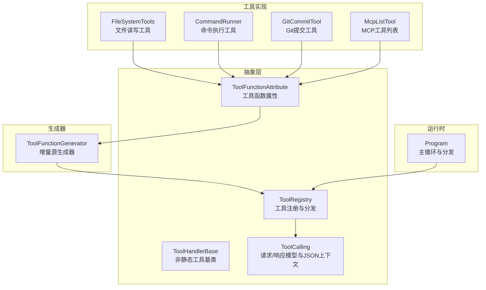
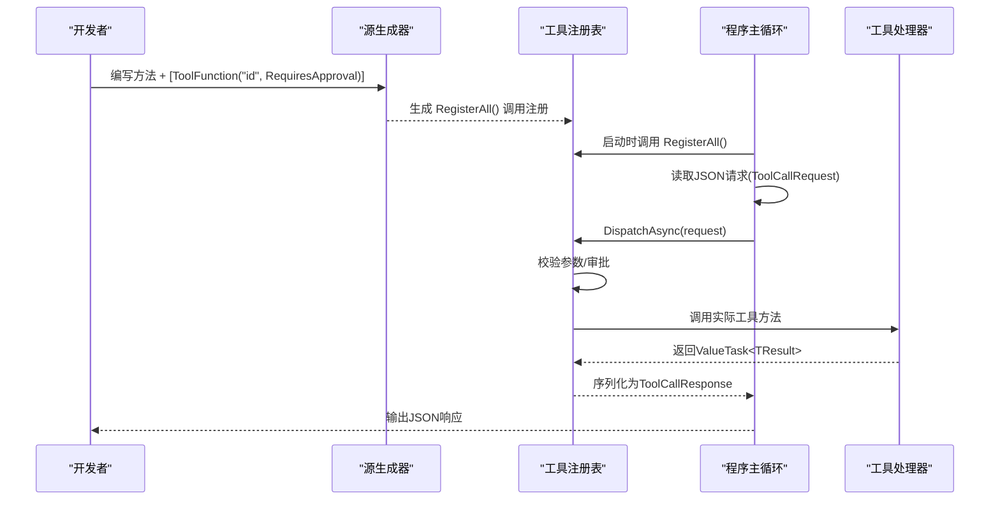
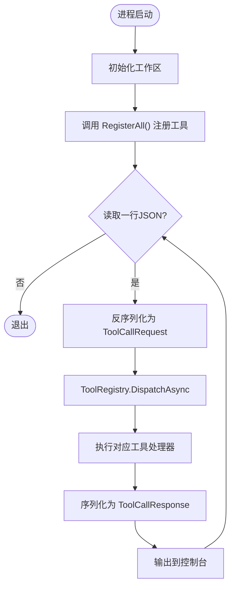
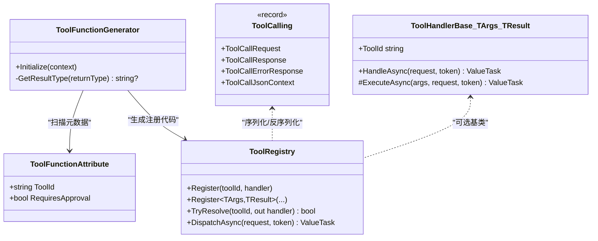

# 工具函数属性

<cite>
**本文引用的文件**   
- [ToolFunctionAttribute.cs](file://TinadecTools/Abstractions/ToolFunctionAttribute.cs)
- [ToolFunctionGenerator.cs](file://TinadecTools.Generators/ToolFunctionGenerator.cs)
- [ToolRegistry.cs](file://TinadecTools/Abstractions/ToolRegistry.cs)
- [ToolHandlerBase.cs](file://TinadecTools/Abstractions/ToolHandlerBase.cs)
- [ToolCalling.cs](file://TinadecTools/Abstractions/ToolCalling.cs)
- [Program.cs](file://TinadecTools/Program.cs)
- [FileSystemTools.cs](file://TinadecTools/Tools/FileRW/FileSystemTools.cs)
- [CommandRunner.cs](file://TinadecTools/Tools/Command/CommandRunner.cs)
- [GitCommitTool.cs](file://TinadecTools/Tools/Git/GitCommitTool.cs)
- [McpListTool.cs](file://TinadecTools/Tools/Mcp/McpListTool.cs)
</cite>

## 目录
1. [简介](#简介)
2. [项目结构](#项目结构)
3. [核心组件](#核心组件)
4. [架构总览](#架构总览)
5. [详细组件分析](#详细组件分析)
6. [依赖关系分析](#依赖关系分析)
7. [性能考量](#性能考量)
8. [故障排除指南](#故障排除指南)
9. [结论](#结论)
10. [附录](#附录)

## 简介
本文件围绕 ToolFunctionAttribute 工具函数属性，系统性说明其声明方式、元数据定义与反射发现机制；解释工具描述信息、参数验证规则与权限控制配置；阐述与源代码生成器的集成、自动文档生成与 API 暴露机制；并提供使用示例、最佳实践、常见配置选项以及自定义扩展与验证规则的落地指南。读者无需深入源码即可理解并正确使用该属性体系。

## 项目结构
- TinadecTools.Abstractions：定义工具运行契约（请求/响应模型、注册表、基础处理器、工具函数属性）。
- TinadecTools.Generators：增量源生成器，扫描带 ToolFunctionAttribute 的方法，自动生成注册代码。
- TinadecTools.Tools.*：具体工具实现，通过静态方法 + ToolFunctionAttribute 暴露为可调用工具。
- TinadecTools.Program：进程入口，初始化工作区、触发生成器注册的汇总方法、循环读取并分发工具调用。

**图表来源** 
- [ToolFunctionAttribute.cs:1-15](file://TinadecTools/Abstractions/ToolFunctionAttribute.cs#L1-L15)
- [ToolFunctionGenerator.cs:1-101](file://TinadecTools.Generators/ToolFunctionGenerator.cs#L1-L101)
- [ToolRegistry.cs:1-86](file://TinadecTools/Abstractions/ToolRegistry.cs#L1-L86)
- [ToolHandlerBase.cs:1-43](file://TinadecTools/Abstractions/ToolHandlerBase.cs#L1-L43)
- [ToolCalling.cs:1-83](file://TinadecTools/Abstractions/ToolCalling.cs#L1-L83)
- [Program.cs:1-68](file://TinadecTools/Program.cs#L1-L68)
- [FileSystemTools.cs:1-273](file://TinadecTools/Tools/FileRW/FileSystemTools.cs#L1-L273)
- [CommandRunner.cs:1-134](file://TinadecTools/Tools/Command/CommandRunner.cs#L1-L134)
- [GitCommitTool.cs:1-149](file://TinadecTools/Tools/Git/GitCommitTool.cs#L1-L149)
- [McpListTool.cs:1-42](file://TinadecTools/Tools/Mcp/McpListTool.cs#L1-L42)

**章节来源**
- [ToolFunctionAttribute.cs:1-15](file://TinadecTools/Abstractions/ToolFunctionAttribute.cs#L1-L15)
- [ToolFunctionGenerator.cs:1-101](file://TinadecTools.Generators/ToolFunctionGenerator.cs#L1-L101)
- [ToolRegistry.cs:1-86](file://TinadecTools/Abstractions/ToolRegistry.cs#L1-L86)
- [ToolCalling.cs:1-83](file://TinadecTools/Abstractions/ToolCalling.cs#L1-L83)
- [Program.cs:1-68](file://TinadecTools/Program.cs#L1-L68)

## 核心组件
- ToolFunctionAttribute：标记在方法上，声明工具ID与是否需要审批。仅作用于方法，不可继承，不可重复。
- ToolFunctionGenerator：编译期增量源生成器，扫描带属性的方法，校验签名（静态、两参：参数对象+取消令牌），提取属性元数据，生成注册代码到 GeneratedToolRegistry.RegisterAll()。
- ToolRegistry：维护 toolId -> handler 的映射，提供强类型 Register<TArgs,TResult> 重载，封装参数反序列化、审批检查、结果序列化与错误处理。
- ToolHandlerBase：为非静态工具提供统一 HandleAsync 流程（参数校验、反序列化、执行、序列化返回）。
- ToolCalling：定义 ToolCallRequest/Response/ErrorResponse 及 JSON 源生成上下文，确保高性能序列化。

关键要点
- 工具方法签名约定：static ValueTask<TResult> Method(TArgs args, CancellationToken cancellationToken)。
- 属性字段：ToolId（必填）、RequiresApproval（可选，默认 false）。
- 生成器会注入 JsonTypeInfo，避免运行时反射开销。

**章节来源**
- [ToolFunctionAttribute.cs:1-15](file://TinadecTools/Abstractions/ToolFunctionAttribute.cs#L1-L15)
- [ToolFunctionGenerator.cs:1-101](file://TinadecTools.Generators/ToolFunctionGenerator.cs#L1-L101)
- [ToolRegistry.cs:1-86](file://TinadecTools/Abstractions/ToolRegistry.cs#L1-L86)
- [ToolHandlerBase.cs:1-43](file://TinadecTools/Abstractions/ToolHandlerBase.cs#L1-L43)
- [ToolCalling.cs:1-83](file://TinadecTools/Abstractions/ToolCalling.cs#L1-L83)

## 架构总览
下图展示从“工具方法声明”到“运行时分发”的端到端流程。

**图表来源** 
- [ToolFunctionGenerator.cs:1-101](file://TinadecTools.Generators/ToolFunctionGenerator.cs#L1-L101)
- [Program.cs:1-68](file://TinadecTools/Program.cs#L1-L68)
- [ToolRegistry.cs:1-86](file://TinadecTools/Abstractions/ToolRegistry.cs#L1-L86)

## 详细组件分析

### ToolFunctionAttribute：属性声明与元数据
- 作用目标：Method
- 约束：不可重复、不可继承
- 元数据：
  - ToolId：工具唯一标识（字符串）
  - RequiresApproval：是否要求人工审批（布尔，默认 false）

使用建议
- ToolId 应语义化且全局唯一，便于日志与审计。
- 对写操作或高风险操作设置 RequiresApproval = true。

**章节来源**
- [ToolFunctionAttribute.cs:1-15](file://TinadecTools/Abstractions/ToolFunctionAttribute.cs#L1-L15)

### ToolFunctionGenerator：反射发现与源码生成
- 发现机制：基于 IIncrementalGenerator，按元数据名匹配 ToolFunctionAttribute。
- 过滤条件：
  - 方法必须为 static
  - 参数数量为 2，第二个参数类型为 CancellationToken
  - 返回值必须是 ValueTask<TResult>
- 元数据提取：
  - ToolId：构造参数
  - RequiresApproval：命名参数
- 生成产物：GeneratedToolRegistry.RegisterAll()，内部调用 ToolRegistry.Register<TArgs,TResult>(...)，并传入对应 JsonTypeInfo。

复杂度与性能
- 增量生成，仅在相关语法树变化时重新计算。
- 使用 JsonSourceGenerationContext 消除运行时反射，提升吞吐。

**章节来源**
- [ToolFunctionGenerator.cs:1-101](file://TinadecTools.Generators/ToolFunctionGenerator.cs#L1-L101)

### ToolRegistry：注册与分发
- 注册接口：
  - Register(string, ToolHandlerDelegate)
  - Register<TArgs,TResult>(ToolHandlerBase<TArgs,TResult>)
  - Register<TArgs,TResult>(string, Func<TArgs,CancellationToken,ValueTask<TResult>>, JsonTypeInfo<TArgs>, JsonTypeInfo<TResult>, bool requiresApproval=false)
- 分发：DispatchAsync(request) 根据 toolId 解析处理器并执行。
- 审批门：当 requiresApproval=true 且 request.Approved=false 时直接拒绝。
- 参数校验：params 为空则抛出异常；反序列化失败抛异常。

错误处理
- 未知 toolId：抛出异常
- 参数缺失/反序列化失败：抛出异常
- 未审批：返回标准拒绝响应

**章节来源**
- [ToolRegistry.cs:1-86](file://TinadecTools/Abstractions/ToolRegistry.cs#L1-L86)

### ToolHandlerBase：非静态工具基类
- 抽象成员：ToolId、ArgsTypeInfo、ResultTypeInfo、ExecuteAsync(...)
- HandleAsync：统一完成参数校验、反序列化、执行、序列化返回。

适用场景
- 需要依赖注入或非静态状态的工具实现。

**章节来源**
- [ToolHandlerBase.cs:1-43](file://TinadecTools/Abstractions/ToolHandlerBase.cs#L1-L43)

### ToolCalling：请求/响应模型与JSON上下文
- ToolCallRequest<TParams>：包含 tool_id、session_id、toolcall_id、approved、params。
- ToolCallResponse<TResponse>：包含 call_id、success、result。
- ToolCallErrorResponse：错误响应。
- ToolCallJsonContext：预编译 JSON 上下文，提升序列化性能。

**章节来源**
- [ToolCalling.cs:1-83](file://TinadecTools/Abstractions/ToolCalling.cs#L1-L83)

### 工具实现示例与最佳实践
- 文件系统工具（读/写/统计）：
  - 使用 [ToolFunction("ls")]、[ToolFunction("stat")]、[ToolFunction("write_file", RequiresApproval = true)]
  - 参数类使用 [JsonPropertyName] 标注字段映射
  - 定义局部 JsonSourceGenerationOptions 与 JsonSerializable 特性以生成上下文
- 命令执行工具：
  - [ToolFunction("command_run", RequiresApproval = true)]
  - 支持沙箱权限合并与持久化策略
- Git 提交工具：
  - [ToolFunction("git_commit", RequiresApproval = true)]
  - 模式互斥校验（include_all / commit_staged_only / paths）
- MCP 列表工具：
  - [ToolFunction("mcp_list")]
  - 列出远程服务器及其可用工具

最佳实践
- 所有输入参数类都应标注 JsonPropertyName，保证前后端一致。
- 对危险操作开启 RequiresApproval。
- 尽量使用 ValueTask 异步返回，避免阻塞。
- 将复杂逻辑拆分为私有方法，保持工具方法职责单一。
- 使用统一的错误响应结构，便于前端展示。

**章节来源**
- [FileSystemTools.cs:1-273](file://TinadecTools/Tools/FileRW/FileSystemTools.cs#L1-L273)
- [CommandRunner.cs:1-134](file://TinadecTools/Tools/Command/CommandRunner.cs#L1-L134)
- [GitCommitTool.cs:1-149](file://TinadecTools/Tools/Git/GitCommitTool.cs#L1-L149)
- [McpListTool.cs:1-42](file://TinadecTools/Tools/Mcp/McpListTool.cs#L1-L42)

### 运行时集成与API暴露
- Program 主循环：
  - 初始化工作区
  - 调用 GeneratedToolRegistry.RegisterAll() 完成工具注册
  - 循环读取控制台输入的 JSON 请求
  - 通过 ToolRegistry.DispatchAsync 分发并输出响应
- API 暴露：当前以标准输入/输出作为协议通道，适合进程间通信或网关桥接。

**图表来源** 
- [Program.cs:1-68](file://TinadecTools/Program.cs#L1-L68)
- [ToolRegistry.cs:1-86](file://TinadecTools/Abstractions/ToolRegistry.cs#L1-L86)

**章节来源**
- [Program.cs:1-68](file://TinadecTools/Program.cs#L1-L68)

## 依赖关系分析
- 生成器依赖属性元数据名称进行匹配，不直接引用具体工具类，松耦合。
- 工具实现仅依赖 Abstractions 中的契约与 JSON 上下文，避免循环依赖。
- 运行时通过 ToolRegistry 解耦调用方与实现方。

**图表来源** 
- [ToolFunctionAttribute.cs:1-15](file://TinadecTools/Abstractions/ToolFunctionAttribute.cs#L1-L15)
- [ToolFunctionGenerator.cs:1-101](file://TinadecTools.Generators/ToolFunctionGenerator.cs#L1-L101)
- [ToolRegistry.cs:1-86](file://TinadecTools/Abstractions/ToolRegistry.cs#L1-L86)
- [ToolHandlerBase.cs:1-43](file://TinadecTools/Abstractions/ToolHandlerBase.cs#L1-L43)
- [ToolCalling.cs:1-83](file://TinadecTools/Abstractions/ToolCalling.cs#L1-L83)

**章节来源**
- [ToolFunctionGenerator.cs:1-101](file://TinadecTools.Generators/ToolFunctionGenerator.cs#L1-L101)
- [ToolRegistry.cs:1-86](file://TinadecTools/Abstractions/ToolRegistry.cs#L1-L86)

## 性能考量
- 使用 JsonSourceGenerationContext 避免反射，降低序列化/反序列化成本。
- 增量源生成器仅在变更时重新生成，缩短构建时间。
- 工具方法采用 ValueTask，减少同步阻塞与线程池压力。
- 注册表使用字典缓存处理器，查找 O(1)。

优化建议
- 合理拆分大参数对象，避免不必要的传输。
- 对高频工具预热 JsonTypeInfo（由生成器已处理）。
- 避免在工具内做重型 IO，必要时使用异步与超时控制。

[本节为通用指导，不直接分析具体文件]

## 故障排除指南
常见问题与定位
- 工具未被注册：
  - 检查方法是否为 static、参数数量与类型是否符合约定。
  - 确认生成器已启用并成功生成 RegisterAll。
- 参数解析失败：
  - 检查参数类的 JsonPropertyName 是否与请求一致。
  - 确认 JSON 结构与类型匹配。
- 审批被拒绝：
  - 检查 RequiresApproval 设置与请求中 approved 字段。
- 未知 toolId：
  - 确认工具已正确注册且 toolId 无拼写错误。

排查步骤
- 查看 Program 主循环的错误分支输出。
- 检查 ToolRegistry 抛出的异常消息。
- 确认生成的 GeneratedToolRegistry 中包含目标工具。

**章节来源**
- [Program.cs:1-68](file://TinadecTools/Program.cs#L1-L68)
- [ToolRegistry.cs:1-86](file://TinadecTools/Abstractions/ToolRegistry.cs#L1-L86)

## 结论
ToolFunctionAttribute 配合增量源生成器与注册表，形成了一套简洁、高效、可扩展的工具函数体系。通过严格的签名约定与 JSON 源生成，既保证了开发体验，又兼顾了运行时性能。结合审批门机制与统一的请求/响应模型，能够安全地暴露各类工具能力，并通过标准 I/O 与上层网关或客户端集成。

[本节为总结性内容，不直接分析具体文件]

## 附录

### 属性使用示例（路径参考）
- 文件工具：[FileSystemTools.cs:69-123](file://TinadecTools/Tools/FileRW/FileSystemTools.cs#L69-L123)
- 命令工具：[CommandRunner.cs:81-84](file://TinadecTools/Tools/Command/CommandRunner.cs#L81-L84)
- Git 工具：[GitCommitTool.cs:37-40](file://TinadecTools/Tools/Git/GitCommitTool.cs#L37-L40)
- MCP 工具：[McpListTool.cs:10-11](file://TinadecTools/Tools/Mcp/McpListTool.cs#L10-L11)

### 最佳实践清单
- 工具方法遵循静态 + ValueTask + 双参约定。
- 参数类使用 JsonPropertyName 明确字段映射。
- 危险操作设置 RequiresApproval = true。
- 使用局部 JsonSourceGenerationOptions 与 JsonSerializable 生成上下文。
- 错误信息结构化，便于前端展示与日志追踪。

### 常见配置选项
- ToolId：工具唯一标识（字符串）
- RequiresApproval：是否需要审批（布尔，默认 false）

### 自定义属性扩展与验证规则
- 扩展属性：可在 ToolFunctionAttribute 基础上派生新属性，或在生成器中增加新的元数据读取逻辑。
- 验证规则：
  - 在工具方法内进行参数校验（推荐），或使用 DataAnnotations + 自定义验证器。
  - 在 ToolRegistry 的泛型注册中集中处理通用校验逻辑。
- 文档生成：
  - 可基于生成器产出的注册信息，导出工具清单与参数 schema，用于自动文档与前端 UI 生成。

[本节为通用指导，不直接分析具体文件]