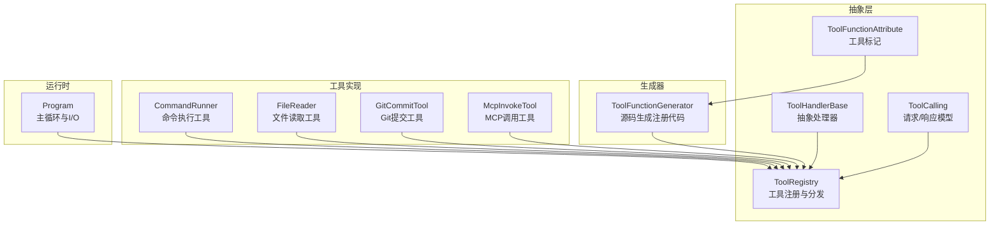
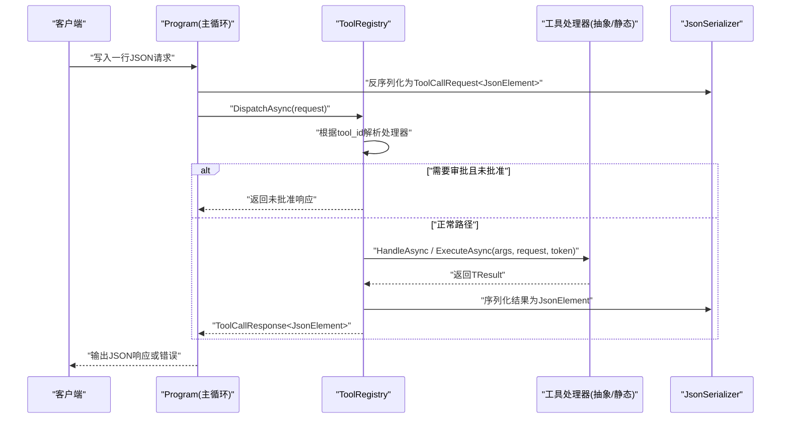
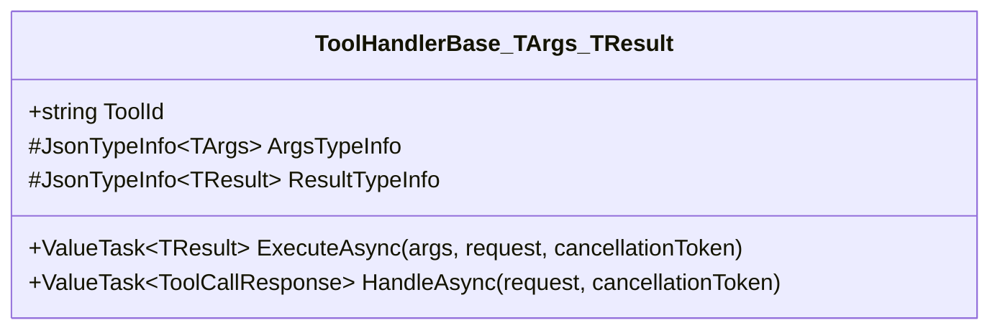
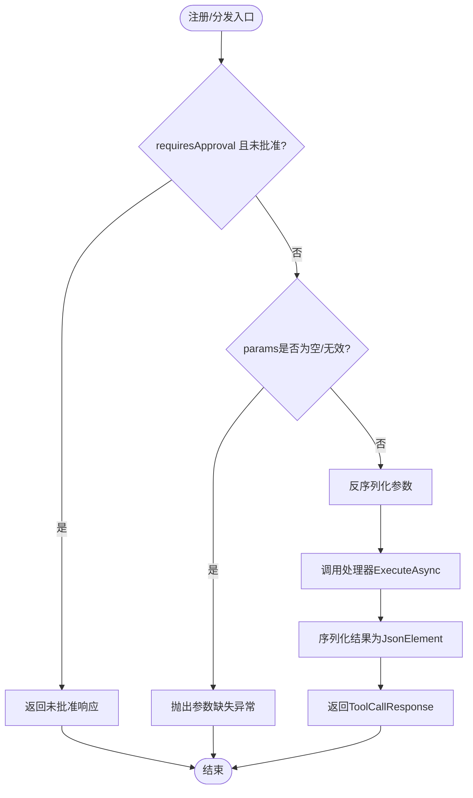
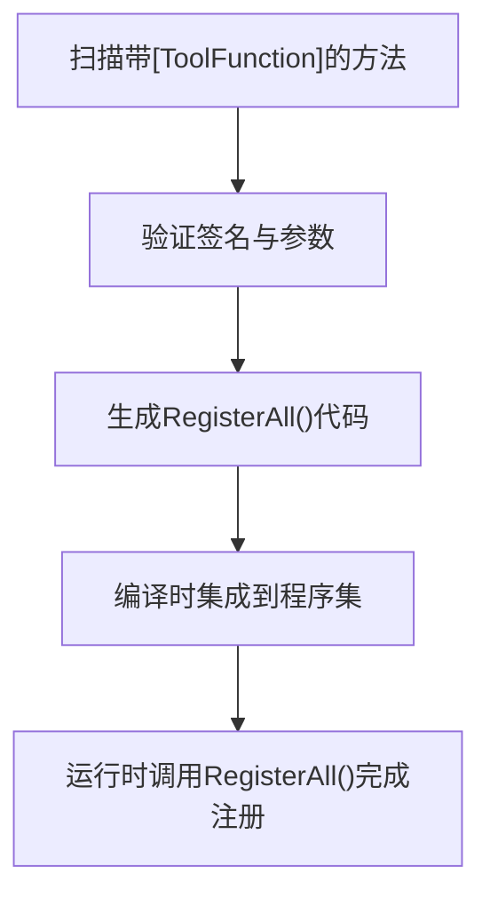
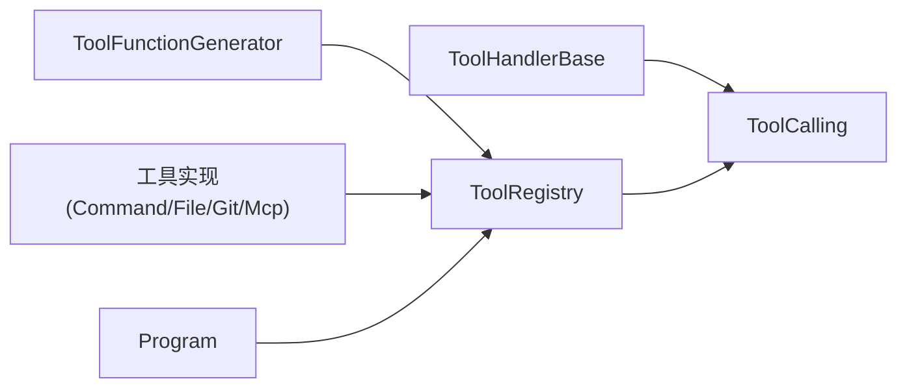

# 工具处理器基类

<cite>
**本文引用的文件**   
- [ToolHandlerBase.cs](file://TinadecTools/Abstractions/ToolHandlerBase.cs)
- [ToolCalling.cs](file://TinadecTools/Abstractions/ToolCalling.cs)
- [ToolRegistry.cs](file://TinadecTools/Abstractions/ToolRegistry.cs)
- [ToolFunctionAttribute.cs](file://TinadecTools/Abstractions/ToolFunctionAttribute.cs)
- [Program.cs](file://TinadecTools/Program.cs)
- [ToolFunctionGenerator.cs](file://TinadecTools.Generators/ToolFunctionGenerator.cs)
- [CommandRunner.cs](file://TinadecTools/Tools/Command/CommandRunner.cs)
- [FileReader.cs](file://TinadecTools/Tools/FileRW/FileReader.cs)
- [GitCommitTool.cs](file://TinadecTools/Tools/Git/GitCommitTool.cs)
- [McpInvokeTool.cs](file://TinadecTools/Tools/Mcp/McpInvokeTool.cs)
</cite>

## 目录
1. [简介](#简介)
2. [项目结构](#项目结构)
3. [核心组件](#核心组件)
4. [架构总览](#架构总览)
5. [详细组件分析](#详细组件分析)
6. [依赖关系分析](#依赖关系分析)
7. [性能考虑](#性能考虑)
8. [故障排查指南](#故障排查指南)
9. [结论](#结论)
10. [附录：自定义工具实现示例与最佳实践](#附录自定义工具实现示例与最佳实践)

## 简介
本文件围绕 ToolHandlerBase 工具处理器基类进行系统化文档化，涵盖设计模式、抽象方法定义、生命周期管理、异步处理模式、取消令牌支持、错误处理策略、参数绑定机制、返回值序列化与上下文注入。同时提供继承开发指南、最佳实践、性能考量，以及从简单命令到复杂业务逻辑的完整自定义工具实现示例。

## 项目结构
该子系统位于 TinadecTools 工程内，采用“抽象 + 注册表 + 生成器 + 具体工具”的分层组织方式：
- Abstractions：定义工具调用契约、请求/响应模型、注册表与属性标记
- Generators：基于源码生成器自动发现并注册工具
- Tools：按功能域划分的工具实现（命令执行、文件读写、Git 操作、MCP 调用等）
- Program：控制台主循环，负责反序列化请求、分发执行、输出响应

图表来源 
- [ToolHandlerBase.cs:1-43](file://TinadecTools/Abstractions/ToolHandlerBase.cs#L1-L43)
- [ToolRegistry.cs:1-86](file://TinadecTools/Abstractions/ToolRegistry.cs#L1-L86)
- [ToolCalling.cs:1-83](file://TinadecTools/Abstractions/ToolCalling.cs#L1-L83)
- [ToolFunctionAttribute.cs:1-15](file://TinadecTools/Abstractions/ToolFunctionAttribute.cs#L1-L15)
- [ToolFunctionGenerator.cs:1-101](file://TinadecTools.Generators/ToolFunctionGenerator.cs#L1-L101)
- [Program.cs:1-68](file://TinadecTools/Program.cs#L1-L68)

章节来源
- [ToolHandlerBase.cs:1-43](file://TinadecTools/Abstractions/ToolHandlerBase.cs#L1-L43)
- [ToolRegistry.cs:1-86](file://TinadecTools/Abstractions/ToolRegistry.cs#L1-L86)
- [ToolCalling.cs:1-83](file://TinadecTools/Abstractions/ToolCalling.cs#L1-L83)
- [ToolFunctionAttribute.cs:1-15](file://TinadecTools/Abstractions/ToolFunctionAttribute.cs#L1-L15)
- [ToolFunctionGenerator.cs:1-101](file://TinadecTools.Generators/ToolFunctionGenerator.cs#L1-L101)
- [Program.cs:1-68](file://TinadecTools/Program.cs#L1-L68)

## 核心组件
- ToolHandlerBase<TArgs, TResult>：非静态工具的基础抽象类，统一参数反序列化、结果序列化、异常包装与异步执行入口。
- ToolRegistry：全局工具注册与分发中心，支持基于泛型委托的直接注册和基于抽象类的实例注册。
- ToolCalling：JSON 请求/响应数据模型与 JSON 源生成上下文，确保高性能序列化。
- ToolFunctionAttribute：用于标注静态工具方法的特性，声明工具ID与是否需要审批。
- ToolFunctionGenerator：源码生成器，扫描带特性的静态方法，自动生成注册代码，将工具方法与注册表关联。
- Program：控制台主循环，负责读取请求、调用注册表分发、输出响应或错误。

章节来源
- [ToolHandlerBase.cs:1-43](file://TinadecTools/Abstractions/ToolHandlerBase.cs#L1-L43)
- [ToolRegistry.cs:1-86](file://TinadecTools/Abstractions/ToolRegistry.cs#L1-L86)
- [ToolCalling.cs:1-83](file://TinadecTools/Abstractions/ToolCalling.cs#L1-L83)
- [ToolFunctionAttribute.cs:1-15](file://TinadecTools/Abstractions/ToolFunctionAttribute.cs#L1-L15)
- [ToolFunctionGenerator.cs:1-101](file://TinadecTools.Generators/ToolFunctionGenerator.cs#L1-L101)
- [Program.cs:1-68](file://TinadecTools/Program.cs#L1-L68)

## 架构总览
下图展示从请求输入到工具执行的完整流程，包括参数校验、反序列化、执行、序列化与错误处理。

图表来源 
- [Program.cs:22-68](file://TinadecTools/Program.cs#L22-L68)
- [ToolRegistry.cs:76-84](file://TinadecTools/Abstractions/ToolRegistry.cs#L76-L84)
- [ToolCalling.cs:9-32](file://TinadecTools/Abstractions/ToolCalling.cs#L9-L32)
- [ToolCalling.cs:34-50](file://TinadecTools/Abstractions/ToolCalling.cs#L34-L50)

## 详细组件分析

### ToolHandlerBase<TArgs, TResult> 抽象处理器
- 设计模式：模板方法 + 泛型约束。子类仅需实现 ToolId、ArgsTypeInfo、ResultTypeInfo 与 ExecuteAsync。
- 生命周期：
  - HandleAsync：统一入口，负责参数校验、反序列化、调用 ExecuteAsync、序列化结果。
  - ExecuteAsync：由子类实现具体业务逻辑，支持 CancellationToken 取消。
- 异步与取消：使用 ValueTask<TResult> 与 CancellationToken，避免不必要的线程切换，支持快速取消。
- 错误处理：参数为空或无法解析时抛出明确异常；上层捕获后转换为 ToolCallErrorResponse。
- 参数绑定与序列化：通过 JsonTypeInfo<T> 指定类型元信息，配合源生成上下文提升性能。
- 返回值序列化：将 TResult 序列化为 JsonElement，保持跨语言兼容。

图表来源 
- [ToolHandlerBase.cs:9-42](file://TinadecTools/Abstractions/ToolHandlerBase.cs#L9-L42)

章节来源
- [ToolHandlerBase.cs:1-43](file://TinadecTools/Abstractions/ToolHandlerBase.cs#L1-L43)

### ToolRegistry 注册与分发
- 职责：维护 toolId -> handler 映射，提供 Register 与 DispatchAsync。
- 注册方式：
  - 基于抽象类实例：Register<TArgs, TResult>(handler)，自动绑定 ToolId 与 HandleAsync。
  - 基于静态委托：Register<TArgs, TResult>(toolId, handler, argsTypeInfo, resultTypeInfo, requiresApproval)。
- 审批控制：当 requiresApproval=true 且请求未批准时，直接返回未批准消息。
- 分发流程：TryResolve 查找处理器，若不存在抛出“未知工具”异常。

图表来源 
- [ToolRegistry.cs:22-69](file://TinadecTools/Abstractions/ToolRegistry.cs#L22-L69)
- [ToolRegistry.cs:76-84](file://TinadecTools/Abstractions/ToolRegistry.cs#L76-L84)

章节来源
- [ToolRegistry.cs:1-86](file://TinadecTools/Abstractions/ToolRegistry.cs#L1-L86)

### ToolCalling 请求/响应模型
- ToolCallRequest<TParams>：包含 tool_id、session_id、toolcall_id、approved、params。
- ToolCallResponse<TResponse>：包含 call_id、success、result。
- ToolCallErrorResponse：包含 call_id、success、error。
- ToolCallJsonContext：JSON 源生成上下文，提升序列化性能。

章节来源
- [ToolCalling.cs:1-83](file://TinadecTools/Abstractions/ToolCalling.cs#L1-L83)

### ToolFunctionAttribute 工具标记
- 用途：标注静态工具方法，声明 toolId 与 RequiresApproval。
- 约束：仅作用于方法，不可继承，不可重复。

章节来源
- [ToolFunctionAttribute.cs:1-15](file://TinadecTools/Abstractions/ToolFunctionAttribute.cs#L1-L15)

### ToolFunctionGenerator 源码生成器
- 扫描所有带有 ToolFunctionAttribute 的静态方法，要求签名：ValueTask<TResult> Method(TArgs, CancellationToken)。
- 生成 GeneratedToolRegistry.RegisterAll()，为每个工具构造 JsonTypeInfo 并调用 ToolRegistry.Register。
- 优势：零样板代码、编译期检查、性能优化（源生成上下文）。

图表来源 
- [ToolFunctionGenerator.cs:12-86](file://TinadecTools.Generators/ToolFunctionGenerator.cs#L12-L86)

章节来源
- [ToolFunctionGenerator.cs:1-101](file://TinadecTools.Generators/ToolFunctionGenerator.cs#L1-L101)

### Program 主循环
- 初始化工作区与沙箱环境。
- 调用 GeneratedToolRegistry.RegisterAll() 完成工具注册。
- 循环读取控制台输入，反序列化为 ToolCallRequest<JsonElement>，调用 ToolRegistry.DispatchAsync，输出响应或错误。
- 异常捕获：将异常封装为 ToolCallErrorResponse，保证稳定输出。

章节来源
- [Program.cs:1-68](file://TinadecTools/Program.cs#L1-L68)

## 依赖关系分析
- ToolHandlerBase 依赖 ToolCalling 的请求/响应模型与 JsonSerializer 上下文。
- ToolRegistry 依赖 ToolCalling 与 JsonTypeInfo，作为工具调用的中央调度点。
- ToolFunctionGenerator 依赖 Roslyn API 与 ToolRegistry 的注册接口。
- 各工具实现依赖 ToolFunctionAttribute 与各自领域服务（如沙箱、Git CLI、MCP 运行时）。

图表来源 
- [ToolHandlerBase.cs:1-43](file://TinadecTools/Abstractions/ToolHandlerBase.cs#L1-L43)
- [ToolRegistry.cs:1-86](file://TinadecTools/Abstractions/ToolRegistry.cs#L1-L86)
- [ToolFunctionGenerator.cs:1-101](file://TinadecTools.Generators/ToolFunctionGenerator.cs#L1-L101)
- [Program.cs:1-68](file://TinadecTools/Program.cs#L1-L68)

章节来源
- [ToolHandlerBase.cs:1-43](file://TinadecTools/Abstractions/ToolHandlerBase.cs#L1-L43)
- [ToolRegistry.cs:1-86](file://TinadecTools/Abstractions/ToolRegistry.cs#L1-L86)
- [ToolFunctionGenerator.cs:1-101](file://TinadecTools.Generators/ToolFunctionGenerator.cs#L1-L101)
- [Program.cs:1-68](file://TinadecTools/Program.cs#L1-L68)

## 性能考虑
- 使用 JsonTypeInfo 与源生成上下文减少反射开销，提高序列化/反序列化性能。
- 使用 ValueTask<TResult> 避免小任务时的额外分配与线程切换。
- 在长耗时操作中传递 CancellationToken，及时释放资源。
- 对大对象或频繁创建的对象，考虑复用上下文与缓冲。
- 避免在 HandleAsync 中进行阻塞 IO，全部改为异步。

## 故障排查指南
- 参数为空或无法解析：检查 ToolCallRequest.Params 是否包含有效 JSON，并确保 TArgs 的 JsonPropertyName 与传入字段一致。
- 未知工具：确认工具已正确注册（GeneratedToolRegistry.RegisterAll() 被调用），且 toolId 唯一。
- 未批准请求：当 RequiresApproval=true 时，确保请求中 approved=true。
- 异常处理：查看 ToolCallErrorResponse.Error 字段，定位具体异常原因。
- 日志与调试：在各工具内部记录关键步骤与异常，便于问题定位。

章节来源
- [ToolRegistry.cs:54-69](file://TinadecTools/Abstractions/ToolRegistry.cs#L54-L69)
- [Program.cs:45-59](file://TinadecTools/Program.cs#L45-L59)

## 结论
ToolHandlerBase 提供了统一的工具处理器抽象，结合 ToolRegistry 与源码生成器，实现了高内聚、低耦合的工具体系。通过严格的参数绑定、高效的序列化与完善的错误处理，开发者可以专注于业务逻辑的实现。遵循本文的最佳实践与性能建议，可构建稳定、高效、易扩展的工具系统。

## 附录：自定义工具实现示例与最佳实践

### 简单命令工具（基于静态方法 + 特性）
- 定义参数与响应模型，标注 JsonPropertyName。
- 使用 [ToolFunction("command_run", RequiresApproval = true)] 标注处理方法。
- 在方法内实现业务逻辑，返回 ValueTask<TResult>。
- 参考实现：CommandRunner.HandleAsync。

章节来源
- [CommandRunner.cs:79-133](file://TinadecTools/Tools/Command/CommandRunner.cs#L79-L133)

### 文件读取工具（带范围与哈希）
- 定义 NormalFileReadParams 与 NormalFileReadResponse。
- 使用 [ToolFunction("read_file")] 标注处理方法。
- 实现行号范围解析、文件锁、哈希计算与异常处理。
- 参考实现：FileReader.HandleAsync。

章节来源
- [FileReader.cs:54-133](file://TinadecTools/Tools/FileRW/FileReader.cs#L54-L133)

### Git 提交工具（复杂业务逻辑）
- 定义 GitCommitArgs 与 GitCommitResult。
- 使用 [ToolFunction("git_commit", RequiresApproval = true)] 标注处理方法。
- 实现多模式提交、状态读取、错误码与失败封装。
- 参考实现：GitCommitTool.CommitAsync。

章节来源
- [GitCommitTool.cs:35-149](file://TinadecTools/Tools/Git/GitCommitTool.cs#L35-L149)

### MCP 调用工具（外部服务集成）
- 定义 McpInvokeParams 与 McpInvokeResponse。
- 使用 [ToolFunction("mcp_invoke", RequiresApproval = true)] 标注处理方法。
- 通过 McpRuntime 获取服务器并调用工具，捕获异常并返回结构化结果。
- 参考实现：McpInvokeTool.HandleAsync。

章节来源
- [McpInvokeTool.cs:6-39](file://TinadecTools/Tools/Mcp/McpInvokeTool.cs#L6-L39)

### 继承开发指南（基于 ToolHandlerBase）
- 创建派生类，实现 ToolId、ArgsTypeInfo、ResultTypeInfo、ExecuteAsync。
- 在 ExecuteAsync 中实现业务逻辑，使用 CancellationToken 支持取消。
- 通过 ToolRegistry.Register(handler) 注册实例。
- 注意：当前仓库主要采用静态方法 + 特性方式，但基类仍可用于更复杂的场景。

章节来源
- [ToolHandlerBase.cs:9-42](file://TinadecTools/Abstractions/ToolHandlerBase.cs#L9-L42)
- [ToolRegistry.cs:22-27](file://TinadecTools/Abstractions/ToolRegistry.cs#L22-L27)

### 最佳实践
- 参数校验：在工具方法入口处进行必要校验，抛出明确异常。
- 取消支持：所有异步操作应接受并传播 CancellationToken。
- 错误封装：返回结构化结果，包含 success、error、errorCode 等字段。
- 日志记录：记录关键步骤与异常，便于追踪问题。
- 性能优化：使用 JsonTypeInfo 与源生成上下文，避免反射。
- 审批控制：对危险操作设置 RequiresApproval=true，并在上游检查 approved。

### 完整案例流程（从注册到执行）
- 编写工具方法并标注 [ToolFunction]。
- 编译时生成 GeneratedToolRegistry.RegisterAll()。
- 运行时调用 RegisterAll() 完成注册。
- 主循环接收请求，调用 ToolRegistry.DispatchAsync 分发执行。
- 输出响应或错误。

章节来源
- [ToolFunctionGenerator.cs:22-86](file://TinadecTools.Generators/ToolFunctionGenerator.cs#L22-L86)
- [Program.cs:22-68](file://TinadecTools/Program.cs#L22-L68)
- [ToolRegistry.cs:76-84](file://TinadecTools/Abstractions/ToolRegistry.cs#L76-L84)