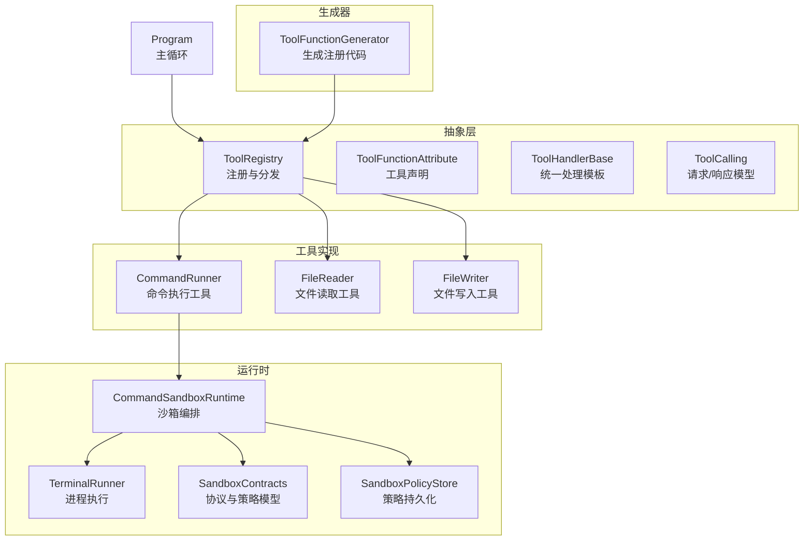
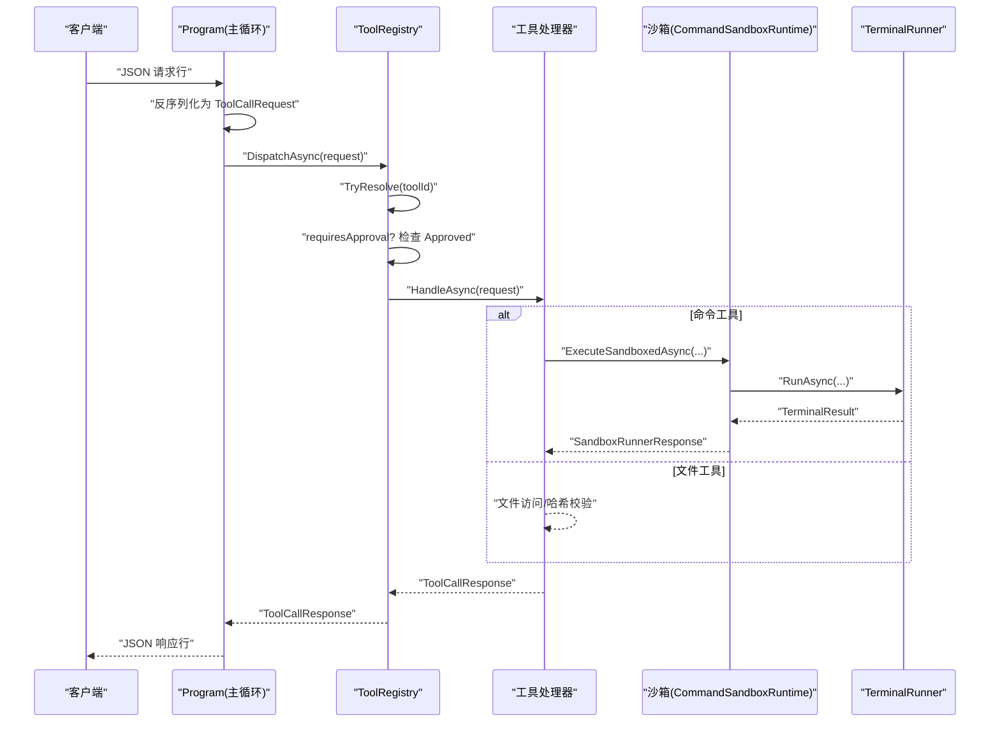
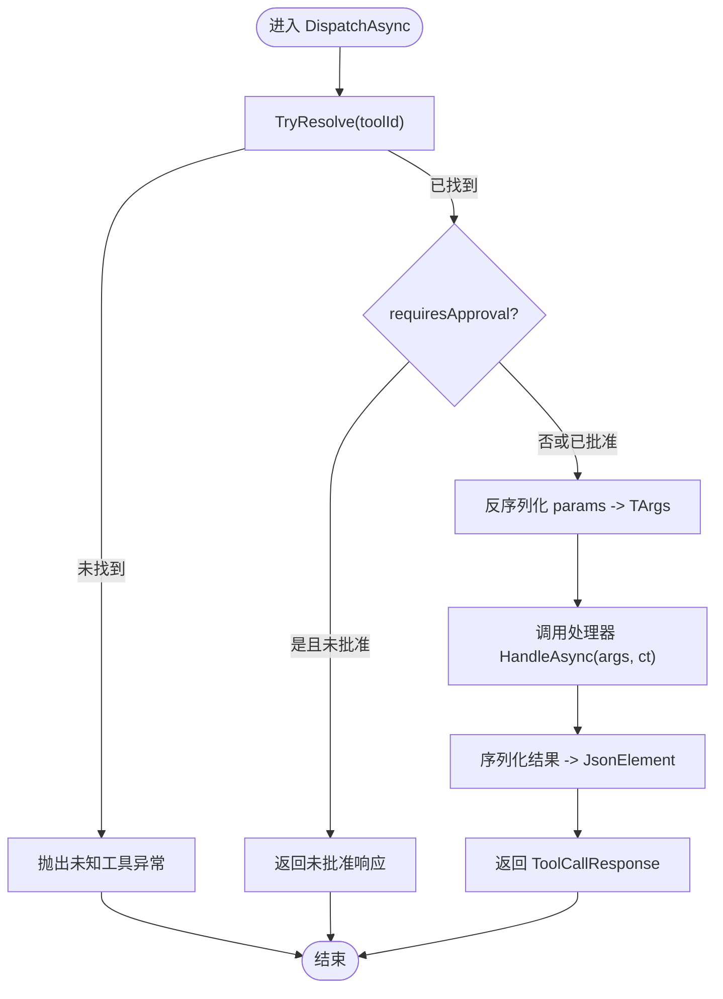
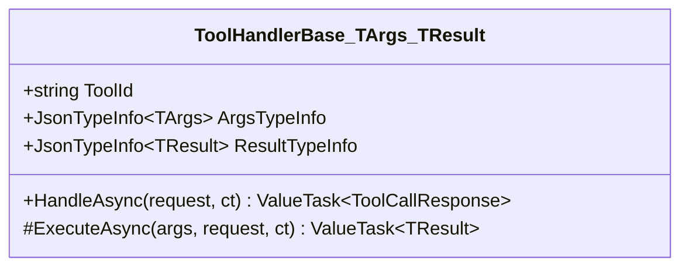
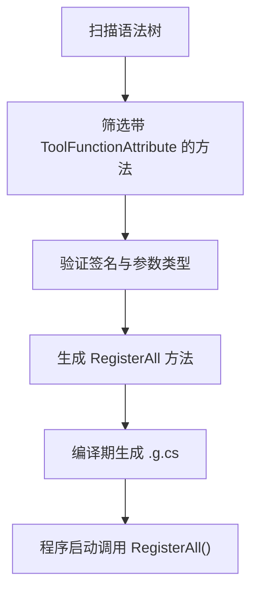
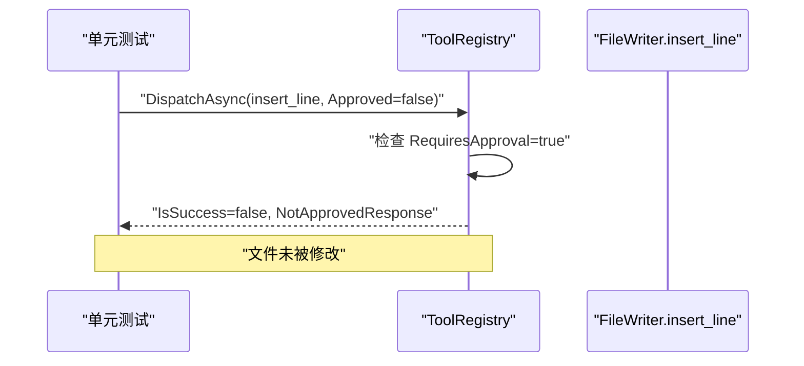
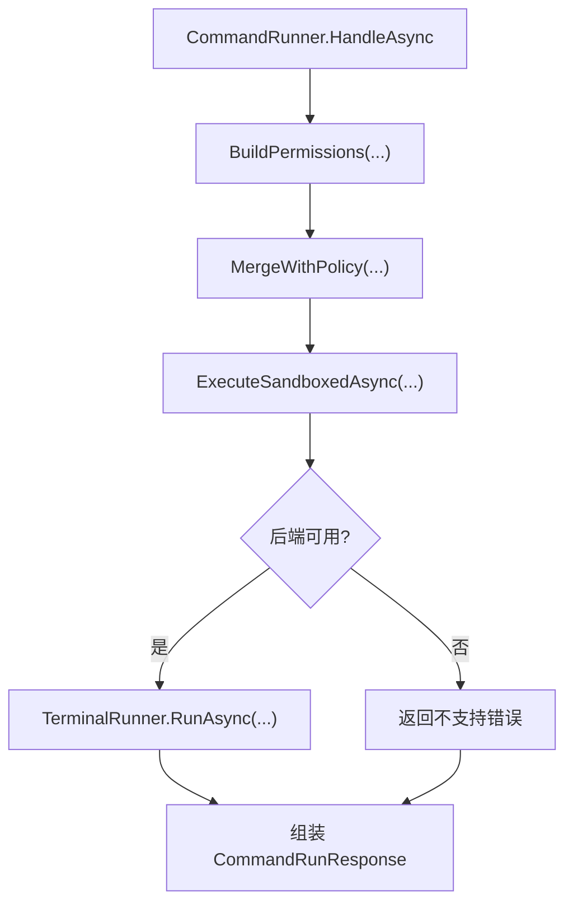
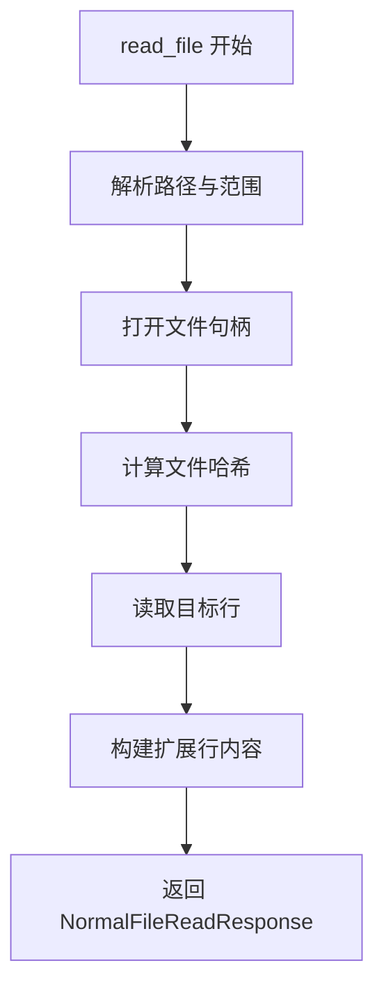
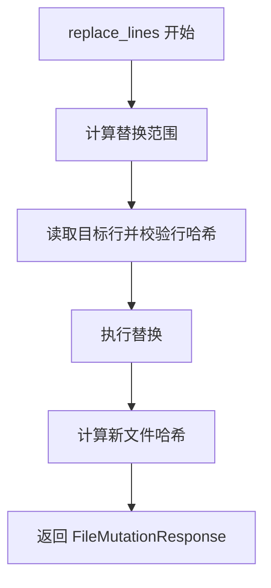
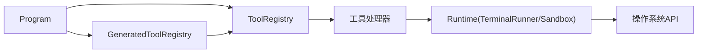

# 工具提供者模式

<cite>
**本文引用的文件**   
- [ToolRegistry.cs](file://TinadecTools/Abstractions/ToolRegistry.cs)
- [ToolFunctionAttribute.cs](file://TinadecTools/Abstractions/ToolFunctionAttribute.cs)
- [ToolHandlerBase.cs](file://TinadecTools/Abstractions/ToolHandlerBase.cs)
- [ToolCalling.cs](file://TinadecTools/Abstractions/ToolCalling.cs)
- [ToolFunctionGenerator.cs](file://TinadecTools.Generators/ToolFunctionGenerator.cs)
- [Program.cs](file://TinadecTools/Program.cs)
- [CommandRunner.cs](file://TinadecTools/Tools/Command/CommandRunner.cs)
- [FileReader.cs](file://TinadecTools/Tools/FileRW/FileReader.cs)
- [FileWriter.cs](file://TinadecTools/Tools/FileRW/FileWriter.cs)
- [TerminalRunner.cs](file://TinadecTools/Runtime/TerminalRunner.cs)
- [SandboxContracts.cs](file://TinadecTools/Runtime/Sandbox/SandboxContracts.cs)
- [CommandSandboxRuntime.cs](file://TinadecTools/Runtime/Sandbox/CommandSandboxRuntime.cs)
- [SandboxPolicyStore.cs](file://TinadecTools/Runtime/Sandbox/SandboxPolicyStore.cs)
- [ToolConfirmations.cs](file://TinadecTools/Tools/ToolConfirmations.cs)
- [ToolRegistryApprovalTests.cs](file://tests/TinadecTools.Tests/ToolRegistryApprovalTests.cs)
</cite>

## 目录
1. [简介](#简介)
2. [项目结构](#项目结构)
3. [核心组件](#核心组件)
4. [架构总览](#架构总览)
5. [详细组件分析](#详细组件分析)
6. [依赖关系分析](#依赖关系分析)
7. [性能考量](#性能考量)
8. [故障排查指南](#故障排查指南)
9. [结论](#结论)
10. [附录：自定义工具开发指南](#附录自定义工具开发指南)

## 简介
本文件系统化阐述 TinadecOffice 中的“工具提供者模式”，围绕以下关键点展开：
- ToolRegistry 工具注册表：负责工具的发现、参数反序列化、审批校验与分发执行。
- ToolFunctionAttribute 属性声明：以声明式方式标注工具 ID 与是否需要审批。
- ToolHandlerBase 基类设计：为面向对象风格的工具提供统一的参数绑定、结果序列化和错误处理模板。
- 工具发现机制：通过增量源生成器自动生成注册代码，集中调用注册入口完成装配。
- 参数绑定与返回值处理：基于 System.Text.Json.SourceGeneration 的强类型 JSON 上下文，实现高性能序列化/反序列化。
- 权限控制与审批集成：对写操作等敏感工具强制审批，未批准请求直接拒绝。
- 沙箱执行环境：命令执行在受限环境中运行，支持路径白名单、环境变量白名单、超时与输出截断。
- 调试、测试与性能优化：覆盖端到端测试、沙箱后端替换、日志与诊断建议。

## 项目结构
该模式主要位于 TinadecTools 工程内，包含抽象层、运行时、具体工具实现以及生成器。关键目录与职责如下：
- Abstractions：定义工具契约（请求/响应）、注册表、属性与基类。
- Runtime：终端进程执行、沙箱策略与后端选择。
- Tools：具体工具实现（文件读写、命令执行、MCP 等）。
- Generators：增量源码生成器，扫描 ToolFunctionAttribute 并生成注册代码。
- Program：控制台主循环，解析请求、分发到工具、输出响应。

**图表来源** 
- [ToolRegistry.cs:1-86](file://TinadecTools/Abstractions/ToolRegistry.cs#L1-L86)
- [ToolFunctionAttribute.cs:1-15](file://TinadecTools/Abstractions/ToolFunctionAttribute.cs#L1-L15)
- [ToolHandlerBase.cs:1-43](file://TinadecTools/Abstractions/ToolHandlerBase.cs#L1-L43)
- [ToolCalling.cs:1-83](file://TinadecTools/Abstractions/ToolCalling.cs#L1-L83)
- [TerminalRunner.cs:1-149](file://TinadecTools/Runtime/TerminalRunner.cs#L1-L149)
- [CommandSandboxRuntime.cs:1-129](file://TinadecTools/Runtime/Sandbox/CommandSandboxRuntime.cs#L1-L129)
- [SandboxContracts.cs:1-71](file://TinadecTools/Runtime/Sandbox/SandboxContracts.cs#L1-L71)
- [SandboxPolicyStore.cs:1-83](file://TinadecTools/Runtime/Sandbox/SandboxPolicyStore.cs#L1-L83)
- [CommandRunner.cs:1-134](file://TinadecTools/Tools/Command/CommandRunner.cs#L1-L134)
- [FileReader.cs:1-133](file://TinadecTools/Tools/FileRW/FileReader.cs#L1-L133)
- [FileWriter.cs:1-280](file://TinadecTools/Tools/FileRW/FileWriter.cs#L1-L280)
- [ToolFunctionGenerator.cs:1-101](file://TinadecTools.Generators/ToolFunctionGenerator.cs#L1-L101)
- [Program.cs:1-68](file://TinadecTools/Program.cs#L1-L68)

**章节来源**
- [Program.cs:1-68](file://TinadecTools/Program.cs#L1-L68)
- [ToolRegistry.cs:1-86](file://TinadecTools/Abstractions/ToolRegistry.cs#L1-L86)

## 核心组件
- ToolRegistry
  - 维护工具 ID 到处理委托的映射，提供 Register、TryResolve、DispatchAsync 等方法。
  - 支持泛型注册，自动注入 JsonTypeInfo，并在 requiresApproval 时进行审批检查。
- ToolFunctionAttribute
  - 用于标记工具方法，指定 toolId 和 RequiresApproval。
- ToolHandlerBase<TArgs, TResult>
  - 提供 HandleAsync 模板方法，统一参数反序列化、执行 ExecuteAsync 与结果序列化。
- ToolCalling
  - 定义 ToolCallRequest、ToolCallResponse、ToolCallErrorResponse 及 JSON 上下文。
- ToolFunctionGenerator
  - 扫描带有 ToolFunctionAttribute 的方法，生成 GeneratedToolRegistry.RegisterAll() 调用，完成批量注册。

**章节来源**
- [ToolRegistry.cs:1-86](file://TinadecTools/Abstractions/ToolRegistry.cs#L1-L86)
- [ToolFunctionAttribute.cs:1-15](file://TinadecTools/Abstractions/ToolFunctionAttribute.cs#L1-L15)
- [ToolHandlerBase.cs:1-43](file://TinadecTools/Abstractions/ToolHandlerBase.cs#L1-L43)
- [ToolCalling.cs:1-83](file://TinadecTools/Abstractions/ToolCalling.cs#L1-L83)
- [ToolFunctionGenerator.cs:1-101](file://TinadecTools.Generators/ToolFunctionGenerator.cs#L1-L101)

## 架构总览
下图展示从请求进入、注册发现、参数绑定、审批校验到工具执行的完整流程。

**图表来源** 
- [Program.cs:1-68](file://TinadecTools/Program.cs#L1-L68)
- [ToolRegistry.cs:1-86](file://TinadecTools/Abstractions/ToolRegistry.cs#L1-L86)
- [CommandRunner.cs:1-134](file://TinadecTools/Tools/Command/CommandRunner.cs#L1-L134)
- [CommandSandboxRuntime.cs:1-129](file://TinadecTools/Runtime/Sandbox/CommandSandboxRuntime.cs#L1-L129)
- [TerminalRunner.cs:1-149](file://TinadecTools/Runtime/TerminalRunner.cs#L1-L149)

## 详细组件分析

### ToolRegistry 工具注册表
- 功能要点
  - 静态字典保存工具 ID 到处理委托的映射。
  - 提供 Register(handler)、Register<TArgs,TResult>(toolId, handler, argsTypeInfo, resultTypeInfo, requiresApproval)。
  - DispatchAsync 根据 toolId 查找并调用处理器；若 requiresApproval 且 Approved=false，返回未批准响应。
- 数据流
  - 入参：ToolCallRequest<JsonElement>，包含 tool_id、session_id、toolcall_id、approved、params。
  - 出参：ToolCallResponse<JsonElement>，包含 call_id、success、result。
- 错误处理
  - 未知 toolId 抛出异常；参数为空或无法反序列化抛出异常；未批准返回特定消息。

**图表来源** 
- [ToolRegistry.cs:1-86](file://TinadecTools/Abstractions/ToolRegistry.cs#L1-L86)
- [ToolCalling.cs:1-83](file://TinadecTools/Abstractions/ToolCalling.cs#L1-L83)

**章节来源**
- [ToolRegistry.cs:1-86](file://TinadecTools/Abstractions/ToolRegistry.cs#L1-L86)
- [ToolCalling.cs:1-83](file://TinadecTools/Abstractions/ToolCalling.cs#L1-L83)

### ToolFunctionAttribute 属性声明
- 作用：在方法上声明工具 ID 与是否需审批。
- 使用：配合生成器扫描，自动生成注册代码。

**章节来源**
- [ToolFunctionAttribute.cs:1-15](file://TinadecTools/Abstractions/ToolFunctionAttribute.cs#L1-L15)

### ToolHandlerBase 基类设计
- 作用：为面向对象风格工具提供统一处理模板。
- 关键点：
  - 抽象属性：ToolId、ArgsTypeInfo、ResultTypeInfo。
  - 抽象方法：ExecuteAsync(args, request, ct)。
  - HandleAsync：参数校验、反序列化、执行、结果序列化。

**图表来源** 
- [ToolHandlerBase.cs:1-43](file://TinadecTools/Abstractions/ToolHandlerBase.cs#L1-L43)

**章节来源**
- [ToolHandlerBase.cs:1-43](file://TinadecTools/Abstractions/ToolHandlerBase.cs#L1-L43)

### 工具发现机制（生成器）
- 扫描所有被 ToolFunctionAttribute 标记的方法。
- 过滤条件：静态方法、两个参数（第一个为参数类型，第二个为 CancellationToken）。
- 生成代码：GeneratedToolRegistry.RegisterAll()，调用 ToolRegistry.Register<TArgs,TResult>(...) 并传入 JsonTypeInfo。

**图表来源** 
- [ToolFunctionGenerator.cs:1-101](file://TinadecTools.Generators/ToolFunctionGenerator.cs#L1-L101)

**章节来源**
- [ToolFunctionGenerator.cs:1-101](file://TinadecTools.Generators/ToolFunctionGenerator.cs#L1-L101)

### 参数绑定与返回值处理
- 参数绑定：基于 JsonTypeInfo<TArgs> 的反序列化，确保类型安全与 AOT 友好。
- 返回值处理：将执行结果序列化为 JsonElement，放入 ToolCallResponse.Response。
- 错误信息：未批准、参数缺失、反序列化失败均抛出明确异常或返回结构化错误。

**章节来源**
- [ToolRegistry.cs:1-86](file://TinadecTools/Abstractions/ToolRegistry.cs#L1-L86)
- [ToolCalling.cs:1-83](file://TinadecTools/Abstractions/ToolCalling.cs#L1-L83)

### 权限控制与审批集成
- 读工具：无需审批，Approved=false 仍可执行。
- 写工具：RequiresApproval=true，Approved=false 直接拒绝并返回固定消息。
- 测试覆盖：ToolRegistryApprovalTests 验证审批逻辑与文件内容一致性。

**图表来源** 
- [ToolRegistryApprovalTests.cs:1-74](file://tests/TinadecTools.Tests/ToolRegistryApprovalTests.cs#L1-L74)
- [ToolRegistry.cs:1-86](file://TinadecTools/Abstractions/ToolRegistry.cs#L1-L86)
- [FileWriter.cs:1-280](file://TinadecTools/Tools/FileRW/FileWriter.cs#L1-L280)

**章节来源**
- [ToolRegistryApprovalTests.cs:1-74](file://tests/TinadecTools.Tests/ToolRegistryApprovalTests.cs#L1-L74)
- [ToolRegistry.cs:1-86](file://TinadecTools/Abstractions/ToolRegistry.cs#L1-L86)

### 沙箱执行环境
- 命令执行：CommandRunner 调用 CommandSandboxRuntime.ExecuteSandboxedAsync。
- 权限策略：BuildPermissions 合并工作目录与额外授权路径/环境变量；MergeWithPolicy 加载 sandbox.json 策略。
- 后端选择：Windows 平台尝试 WindowsSandboxBackend，否则 UnsupportedSandboxBackend。
- 进程执行：TerminalRunner 封装 ProcessStartInfo，支持超时、输入输出截断、取消令牌。

**图表来源** 
- [CommandRunner.cs:1-134](file://TinadecTools/Tools/Command/CommandRunner.cs#L1-L134)
- [CommandSandboxRuntime.cs:1-129](file://TinadecTools/Runtime/Sandbox/CommandSandboxRuntime.cs#L1-L129)
- [SandboxContracts.cs:1-71](file://TinadecTools/Runtime/Sandbox/SandboxContracts.cs#L1-L71)
- [TerminalRunner.cs:1-149](file://TinadecTools/Runtime/TerminalRunner.cs#L1-L149)
- [SandboxPolicyStore.cs:1-83](file://TinadecTools/Runtime/Sandbox/SandboxPolicyStore.cs#L1-L83)

**章节来源**
- [CommandRunner.cs:1-134](file://TinadecTools/Tools/Command/CommandRunner.cs#L1-L134)
- [CommandSandboxRuntime.cs:1-129](file://TinadecTools/Runtime/Sandbox/CommandSandboxRuntime.cs#L1-L129)
- [SandboxContracts.cs:1-71](file://TinadecTools/Runtime/Sandbox/SandboxContracts.cs#L1-L71)
- [TerminalRunner.cs:1-149](file://TinadecTools/Runtime/TerminalRunner.cs#L1-L149)
- [SandboxPolicyStore.cs:1-83](file://TinadecTools/Runtime/Sandbox/SandboxPolicyStore.cs#L1-L83)

### 文件工具示例（读/写）
- FileReader：按行范围读取，计算文件哈希，返回扩展行内容（含行哈希）。
- FileWriter：多种写操作（替换行、插入/删除字节/行），支持 file_hash 校验与行级哈希锚点校验，保证并发安全与一致性。

**图表来源** 
- [FileReader.cs:1-133](file://TinadecTools/Tools/FileRW/FileReader.cs#L1-L133)

**图表来源** 
- [FileWriter.cs:1-280](file://TinadecTools/Tools/FileRW/FileWriter.cs#L1-L280)

**章节来源**
- [FileReader.cs:1-133](file://TinadecTools/Tools/FileRW/FileReader.cs#L1-L133)
- [FileWriter.cs:1-280](file://TinadecTools/Tools/FileRW/FileWriter.cs#L1-L280)

## 依赖关系分析
- 组件耦合
  - Program 依赖 ToolRegistry 与生成的注册器。
  - 工具实现依赖 Abstractions 与 Runtime。
  - 沙箱运行时依赖策略存储与终端执行器。
- 外部依赖
  - System.Text.Json.SourceGeneration 用于强类型 JSON 上下文。
  - NLog 用于日志记录。
  - 操作系统 API（Windows 沙箱）用于隔离执行。

**图表来源** 
- [Program.cs:1-68](file://TinadecTools/Program.cs#L1-L68)
- [ToolFunctionGenerator.cs:1-101](file://TinadecTools.Generators/ToolFunctionGenerator.cs#L1-L101)
- [TerminalRunner.cs:1-149](file://TinadecTools/Runtime/TerminalRunner.cs#L1-L149)

**章节来源**
- [Program.cs:1-68](file://TinadecTools/Program.cs#L1-L68)
- [ToolFunctionGenerator.cs:1-101](file://TinadecTools.Generators/ToolFunctionGenerator.cs#L1-L101)

## 性能考量
- 序列化性能：使用 JsonSourceGeneration 减少反射开销，提升吞吐。
- 并发控制：文件读写使用读写锁保护同一文件的并发访问。
- I/O 限制：终端输出最大字符数限制，避免大输出阻塞内存。
- 超时控制：命令执行设置超时，防止长时间挂起。
- 哈希校验：文件变更前后计算哈希，快速检测冲突与一致性。

[本节为通用指导，不直接分析具体文件]

## 故障排查指南
- 常见错误
  - 未知工具 ID：检查注册是否成功、toolId 是否正确。
  - 参数反序列化失败：确认 JSON 字段名与属性匹配，JsonTypeInfo 正确。
  - 未批准请求：写工具需要 Approved=true。
  - 沙箱不可用：Windows 平台需初始化沙箱后端。
- 调试建议
  - 启用 NLog 日志查看详细执行轨迹。
  - 使用单元测试替换沙箱后端进行模拟。
  - 检查 sandbox.json 策略配置是否正确。

**章节来源**
- [ToolRegistryApprovalTests.cs:1-74](file://tests/TinadecTools.Tests/ToolRegistryApprovalTests.cs#L1-L74)
- [ToolConfirmations.cs:1-12](file://TinadecTools/Tools/ToolConfirmations.cs#L1-L12)
- [CommandSandboxRuntime.cs:1-129](file://TinadecTools/Runtime/Sandbox/CommandSandboxRuntime.cs#L1-L129)

## 结论
TinadecOffice 的工具提供者模式通过声明式属性、增量生成器与强类型 JSON 上下文，实现了高内聚、低耦合的工具注册与执行框架。结合审批机制与沙箱隔离，既保证了安全性，又提供了良好的可扩展性与可观测性。开发者可基于此模式快速构建从简单命令到复杂文件操作的各类工具。

[本节为总结，不直接分析具体文件]

## 附录：自定义工具开发指南

### 开发步骤
- 定义参数与响应模型，添加 JsonSerializable 特性。
- 在工具方法上添加 ToolFunctionAttribute，指定 toolId 与 RequiresApproval。
- 确保方法签名为静态方法，第一个参数为 TArgs，第二个为 CancellationToken，返回 ValueTask<TResult>。
- 在程序启动时调用 GeneratedToolRegistry.RegisterAll() 完成注册。

### 简单命令工具示例
- 参考 CommandRunner.HandleAsync，定义 CommandRunParams 与 CommandRunResponse。
- 使用 ToolFunction("command_run", RequiresApproval = true) 标记。
- 内部调用 CommandSandboxRuntime 执行命令，处理超时与错误。

**章节来源**
- [CommandRunner.cs:1-134](file://TinadecTools/Tools/Command/CommandRunner.cs#L1-L134)
- [ToolFunctionAttribute.cs:1-15](file://TinadecTools/Abstractions/ToolFunctionAttribute.cs#L1-L15)

### 复杂文件操作工具示例
- 参考 FileReader 与 FileWriter，定义参数模型与响应模型。
- 使用文件句柄与读写锁保证并发安全。
- 使用 file_hash 与行哈希锚点进行一致性校验。
- 对写操作设置 RequiresApproval = true。

**章节来源**
- [FileReader.cs:1-133](file://TinadecTools/Tools/FileRW/FileReader.cs#L1-L133)
- [FileWriter.cs:1-280](file://TinadecTools/Tools/FileRW/FileWriter.cs#L1-L280)

### 调试与测试最佳实践
- 使用 ToolRegistryApprovalTests 作为审批逻辑的基准测试。
- 通过 CommandSandboxRuntime.OverrideBackendForTests 替换沙箱后端进行模拟。
- 利用 NLog 输出详细日志，定位问题。

**章节来源**
- [ToolRegistryApprovalTests.cs:1-74](file://tests/TinadecTools.Tests/ToolRegistryApprovalTests.cs#L1-L74)
- [CommandSandboxRuntime.cs:1-129](file://TinadecTools/Runtime/Sandbox/CommandSandboxRuntime.cs#L1-L129)

### 性能优化建议
- 使用 JsonSourceGeneration 减少反射。
- 合理设置超时与输出截断上限。
- 对热点文件操作使用读写锁与缓存句柄。
- 避免不必要的字符串拼接与对象分配。

[本节为通用指导，不直接分析具体文件]