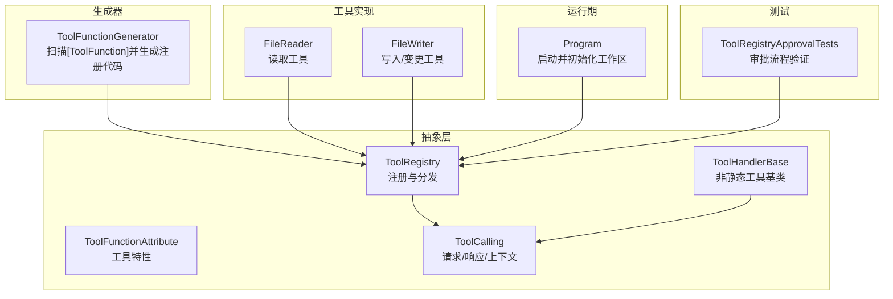
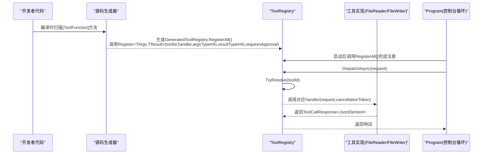
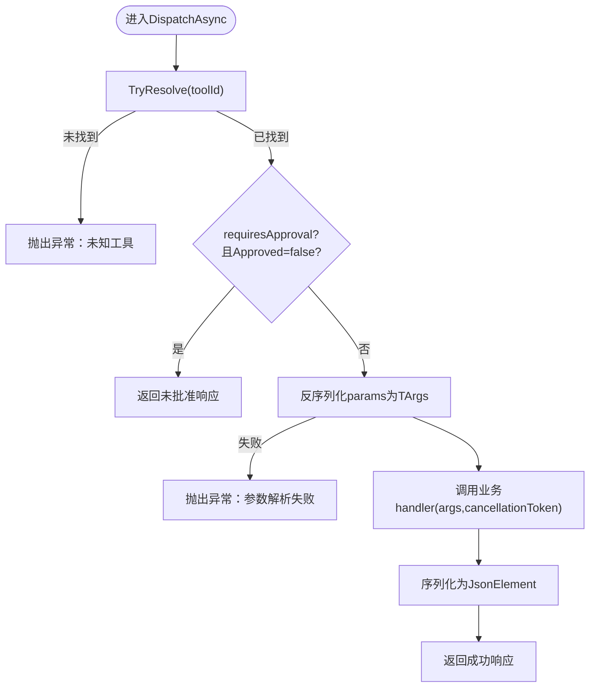
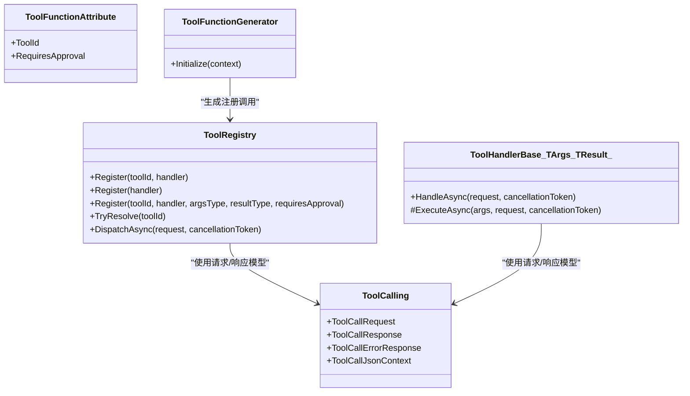

# 工具注册表

<cite>
**本文引用的文件**   
- [ToolRegistry.cs](file://TinadecTools/Abstractions/ToolRegistry.cs)
- [ToolHandlerBase.cs](file://TinadecTools/Abstractions/ToolHandlerBase.cs)
- [ToolFunctionAttribute.cs](file://TinadecTools/Abstractions/ToolFunctionAttribute.cs)
- [ToolCalling.cs](file://TinadecTools/Abstractions/ToolCalling.cs)
- [ToolFunctionGenerator.cs](file://TinadecTools.Generators/ToolFunctionGenerator.cs)
- [FileReader.cs](file://TinadecTools/Tools/FileRW/FileReader.cs)
- [FileWriter.cs](file://TinadecTools/Tools/FileRW/FileWriter.cs)
- [Program.cs](file://TinadecTools/Program.cs)
- [ToolRegistryApprovalTests.cs](file://tests/TinadecTools.Tests/ToolRegistryApprovalTests.cs)
</cite>

## 目录
1. [简介](#简介)
2. [项目结构](#项目结构)
3. [核心组件](#核心组件)
4. [架构总览](#架构总览)
5. [详细组件分析](#详细组件分析)
6. [依赖关系分析](#依赖关系分析)
7. [性能考量](#性能考量)
8. [故障排查指南](#故障排查指南)
9. [结论](#结论)
10. [附录：最佳实践与示例](#附录最佳实践与示例)

## 简介
本文件围绕 ToolRegistry 工具注册表进行系统化说明，涵盖以下主题：
- 工具注册机制：Register 方法的多重载形式、参数类型推断与 JSON 序列化支持
- 工具发现流程：基于特性标注与源码生成器的自动注册
- HandlerDelegate 委托设计与 DispatchAsync 分发机制
- requiresApproval 审批集成策略与错误处理
- 性能优化建议与命名约定、冲突解决策略
- 使用示例：如何注册不同类型的工具处理器（静态方法与基类派生）

## 项目结构
与 ToolRegistry 相关的代码主要分布在 Abstractions、Generators、Tools 以及测试项目中：
- Abstractions：定义工具调用契约、请求/响应模型、注册表与基础抽象
- Generators：通过源码生成器扫描 [ToolFunction] 特性并自动生成注册代码
- Tools：具体工具实现（如文件读写），以静态方法 + 特性标注方式暴露
- Tests：覆盖审批流程与基本行为验证

图表来源
- [ToolRegistry.cs:1-86](file://TinadecTools/Abstractions/ToolRegistry.cs#L1-L86)
- [ToolHandlerBase.cs:1-43](file://TinadecTools/Abstractions/ToolHandlerBase.cs#L1-L43)
- [ToolFunctionAttribute.cs:1-15](file://TinadecTools/Abstractions/ToolFunctionAttribute.cs#L1-L15)
- [ToolCalling.cs:1-83](file://TinadecTools/Abstractions/ToolCalling.cs#L1-L83)
- [ToolFunctionGenerator.cs:1-101](file://TinadecTools.Generators/ToolFunctionGenerator.cs#L1-L101)
- [FileReader.cs:1-133](file://TinadecTools/Tools/FileRW/FileReader.cs#L1-L133)
- [FileWriter.cs:1-280](file://TinadecTools/Tools/FileRW/FileWriter.cs#L1-L280)
- [Program.cs:1-68](file://TinadecTools/Program.cs#L1-L68)
- [ToolRegistryApprovalTests.cs:1-74](file://tests/TinadecTools.Tests/ToolRegistryApprovalTests.cs#L1-L74)

章节来源
- [ToolRegistry.cs:1-86](file://TinadecTools/Abstractions/ToolRegistry.cs#L1-L86)
- [ToolFunctionGenerator.cs:1-101](file://TinadecTools.Generators/ToolFunctionGenerator.cs#L1-L101)
- [Program.cs:1-68](file://TinadecTools/Program.cs#L1-L68)

## 核心组件
- ToolRegistry：全局静态注册表，维护 toolId -> handler 的映射；提供 Register 多重载与 DispatchAsync 分发。
- ToolHandlerBase<TArgs, TResult>：非静态工具的基础抽象，封装参数反序列化、执行与结果序列化。
- ToolFunctionAttribute：用于标注静态工具方法的特性，包含 toolId 与 RequiresApproval。
- ToolCalling：定义 ToolCallRequest<TParams>、ToolCallResponse<TResponse>、ToolCallErrorResponse 及 JsonSourceGenerationContext。
- ToolFunctionGenerator：增量源码生成器，扫描带 [ToolFunction] 的方法，生成 GeneratedToolRegistry.RegisterAll() 调用注册。

章节来源
- [ToolRegistry.cs:1-86](file://TinadecTools/Abstractions/ToolRegistry.cs#L1-L86)
- [ToolHandlerBase.cs:1-43](file://TinadecTools/Abstractions/ToolHandlerBase.cs#L1-L43)
- [ToolFunctionAttribute.cs:1-15](file://TinadecTools/Abstractions/ToolFunctionAttribute.cs#L1-L15)
- [ToolCalling.cs:1-83](file://TinadecTools/Abstractions/ToolCalling.cs#L1-L83)
- [ToolFunctionGenerator.cs:1-101](file://TinadecTools.Generators/ToolFunctionGenerator.cs#L1-L101)

## 架构总览
下图展示了从工具声明到分发的完整链路：开发者用 [ToolFunction] 标注方法，生成器在编译期生成注册代码，运行时统一由 ToolRegistry.DispatchAsync 分发。

图表来源
- [ToolFunctionGenerator.cs:1-101](file://TinadecTools.Generators/ToolFunctionGenerator.cs#L1-L101)
- [ToolRegistry.cs:1-86](file://TinadecTools/Abstractions/ToolRegistry.cs#L1-L86)
- [Program.cs:1-68](file://TinadecTools/Program.cs#L1-L68)
- [FileReader.cs:1-133](file://TinadecTools/Tools/FileRW/FileReader.cs#L1-L133)
- [FileWriter.cs:1-280](file://TinadecTools/Tools/FileRW/FileWriter.cs#L1-L280)

## 详细组件分析

### ToolRegistry：注册与分发
- 注册接口
  - Register(string toolId, ToolHandlerDelegate handler)：直接注册原始委托。
  - Register<TArgs, TResult>(ToolHandlerBase<TArgs, TResult> handler)：针对非静态工具基类的便捷重载。
  - Register<TArgs, TResult>(string toolId, Func<TArgs, CancellationToken, ValueTask<TResult>> handler, JsonTypeInfo<TArgs>, JsonTypeInfo<TResult>, bool requiresApproval = false)：强类型注册，内置参数校验、JSON 反序列化/序列化与审批检查。
- 分发机制
  - TryResolve(toolId)：按 toolId 查找已注册的委托。
  - DispatchAsync(request, cancellationToken)：解析并调用目标 handler；未找到则抛出异常。
- 审批集成
  - 当 requiresApproval=true 且 request.Approved=false 时，直接返回“未批准”的响应体，不执行业务逻辑。
- 错误处理
  - 参数为空或无效时抛出 InvalidOperationException。
  - 未知 toolId 时抛出 InvalidOperationException。

图表来源
- [ToolRegistry.cs:1-86](file://TinadecTools/Abstractions/ToolRegistry.cs#L1-L86)

章节来源
- [ToolRegistry.cs:1-86](file://TinadecTools/Abstractions/ToolRegistry.cs#L1-L86)

### ToolHandlerBase：非静态工具基类
- 职责：封装 HandleAsync 通用流程（参数校验、反序列化、执行 ExecuteAsync、结果序列化）。
- 适用场景：需要注入依赖或复杂状态的非静态工具。
- 注意：该基类不包含 requiresApproval 检查，如需审批控制可在上层包装或使用静态方法+特性注册路径。

章节来源
- [ToolHandlerBase.cs:1-43](file://TinadecTools/Abstractions/ToolHandlerBase.cs#L1-L43)

### ToolFunctionAttribute：工具特性
- 字段：ToolId（必填）、RequiresApproval（可选，默认 false）。
- 用途：配合源码生成器识别工具方法签名与元数据。

章节来源
- [ToolFunctionAttribute.cs:1-15](file://TinadecTools/Abstractions/ToolFunctionAttribute.cs#L1-L15)

### ToolCalling：请求/响应与 JSON 上下文
- ToolCallRequest<TParams>：包含 tool_id、session_id、toolcall_id、approved、params。
- ToolCallResponse<TResponse>：包含 call_id、success、result。
- ToolCallErrorResponse：错误响应模板。
- ToolCallJsonContext：预编译 JSON 源生成上下文，提升序列化性能。

章节来源
- [ToolCalling.cs:1-83](file://TinadecTools/Abstractions/ToolCalling.cs#L1-L83)

### ToolFunctionGenerator：源码生成器
- 扫描规则：匹配标记了 [ToolFunction] 的静态方法，要求两个参数（第一个为参数类型，第二个为 CancellationToken），返回 ValueTask<TResult>。
- 生成内容：GeneratedToolRegistry.RegisterAll()，内部遍历所有匹配方法，构造 JsonTypeInfo 并调用 ToolRegistry.Register<TArgs, TResult>(...)。
- 审批传递：从特性的 RequiresApproval 属性读取并传入注册方法。

章节来源
- [ToolFunctionGenerator.cs:1-101](file://TinadecTools.Generators/ToolFunctionGenerator.cs#L1-L101)

### 工具实现示例：FileReader / FileWriter
- FileReader.HandleAsync：读取文件行范围，返回 NormalFileReadResponse，无审批要求。
- FileWriter.*：多种写入/变更操作，均标注 RequiresApproval=true，确保变更需经审批。

章节来源
- [FileReader.cs:1-133](file://TinadecTools/Tools/FileRW/FileReader.cs#L1-L133)
- [FileWriter.cs:1-280](file://TinadecTools/Tools/FileRW/FileWriter.cs#L1-L280)

### 运行期入口：Program
- 初始化工作区后调用 GeneratedToolRegistry.RegisterAll() 完成全部工具注册。
- 主循环读取 JSON 请求，调用 ToolRegistry.DispatchAsync 并输出响应或错误。

章节来源
- [Program.cs:1-68](file://TinadecTools/Program.cs#L1-L68)

### 审批流程测试：ToolRegistryApprovalTests
- 验证：未批准的写操作被拒绝，读操作允许未批准。
- 断言：响应 IsSuccess、CallId、Result 内容与文件内容一致性。

章节来源
- [ToolRegistryApprovalTests.cs:1-74](file://tests/TinadecTools.Tests/ToolRegistryApprovalTests.cs#L1-L74)

## 依赖关系分析
- ToolRegistry 依赖：
  - ToolCalling：请求/响应模型与 JSON 上下文
  - System.Text.Json：反序列化/序列化
- 生成器依赖：
  - Microsoft.CodeAnalysis：增量源码生成
- 工具实现依赖：
  - 各自领域库（如 NLog、文件系统访问等）
- 运行期依赖：
  - Program 依赖生成器产物与 ToolRegistry

图表来源
- [ToolRegistry.cs:1-86](file://TinadecTools/Abstractions/ToolRegistry.cs#L1-L86)
- [ToolHandlerBase.cs:1-43](file://TinadecTools/Abstractions/ToolHandlerBase.cs#L1-L43)
- [ToolFunctionAttribute.cs:1-15](file://TinadecTools/Abstractions/ToolFunctionAttribute.cs#L1-L15)
- [ToolCalling.cs:1-83](file://TinadecTools/Abstractions/ToolCalling.cs#L1-L83)
- [ToolFunctionGenerator.cs:1-101](file://TinadecTools.Generators/ToolFunctionGenerator.cs#L1-L101)

章节来源
- [ToolRegistry.cs:1-86](file://TinadecTools/Abstractions/ToolRegistry.cs#L1-L86)
- [ToolFunctionGenerator.cs:1-101](file://TinadecTools.Generators/ToolFunctionGenerator.cs#L1-L101)

## 性能考量
- JSON 序列化性能
  - 使用 JsonSourceGenerationContext（ToolCallJsonContext 与各工具的 XxxJsonContext）减少反射开销，显著提升吞吐。
- 类型信息传递
  - Register<TArgs, TResult> 显式传入 JsonTypeInfo，避免重复解析类型元数据。
- 异步与取消
  - 全链路采用 ValueTask/ValueTask<TResult> 与 CancellationToken，降低分配与提高并发能力。
- 锁与并发
  - 文件写入使用 RwLock 保护临界区，避免竞态条件。
- 资源释放
  - 程序退出前释放 MCP 运行时等资源，避免泄漏。

章节来源
- [ToolCalling.cs:1-83](file://TinadecTools/Abstractions/ToolCalling.cs#L1-L83)
- [FileWriter.cs:1-280](file://TinadecTools/Tools/FileRW/FileWriter.cs#L1-L280)
- [Program.cs:1-68](file://TinadecTools/Program.cs#L1-L68)

## 故障排查指南
- 常见异常
  - 未知工具：DispatchAsync 找不到 toolId 时抛出异常。检查是否已调用 RegisterAll() 或手动 Register。
  - 参数解析失败：params 为空或无法反序列化为 TArgs。检查 JSON 结构与 JsonTypeInfo 配置。
  - 未批准操作：requiresApproval=true 但 Approved=false 时返回未批准响应。确认上游审批流程设置。
- 定位步骤
  - 查看 Program 的错误捕获分支，确认错误消息与 CallId。
  - 检查各工具的日志输出（NLog），定位 IO 或业务异常。
  - 使用单元测试（如 ToolRegistryApprovalTests）复现问题。

章节来源
- [ToolRegistry.cs:1-86](file://TinadecTools/Abstractions/ToolRegistry.cs#L1-L86)
- [Program.cs:1-68](file://TinadecTools/Program.cs#L1-L68)
- [ToolRegistryApprovalTests.cs:1-74](file://tests/TinadecTools.Tests/ToolRegistryApprovalTests.cs#L1-L74)

## 结论
ToolRegistry 提供了简洁而强大的工具注册与分发机制，结合源码生成器实现了零样板代码的工具发现与注册。通过强类型注册与预编译 JSON 上下文，系统在易用性与性能之间取得良好平衡。审批机制为敏感操作提供了安全护栏，错误处理策略清晰明确，便于调试与排障。

## 附录：最佳实践与示例

- 命名约定
  - toolId 建议使用小写字母与下划线，语义清晰且唯一，例如 read_file、insert_line。
  - 参数与响应类型使用 PascalCase，JsonPropertyName 指定 snake_case 字段名。
- 冲突解决
  - 同一 toolId 只能注册一次；重复注册会覆盖先前委托。建议在应用启动阶段集中注册，避免动态覆盖。
- 审批策略
  - 读操作通常不需要审批；写/删除/替换等变更操作应设置 RequiresApproval=true。
- 错误处理
  - 对 I/O 与外部依赖调用进行 try/catch 包裹，返回结构化错误信息。
  - 对于关键校验失败（如 file_hash 不一致）抛出明确异常，便于上层统一处理。
- 性能优化
  - 优先使用静态方法 + [ToolFunction] 的方式，借助生成器自动注册。
  - 为每个工具定义专用 JsonSourceGenerationContext，减少反射。
  - 合理使用 CancellationToken，及时响应取消信号。

- 示例一：使用静态方法 + 特性注册（推荐）
  - 在工具类中定义静态方法，使用 [ToolFunction("tool_id", RequiresApproval = true)] 标注。
  - 方法签名：ValueTask<TResult> Method(TArgs args, CancellationToken ct)。
  - 在 Program 中调用 GeneratedToolRegistry.RegisterAll() 完成注册。
  - 参考：FileWriter 中的多个方法。

- 示例二：使用非静态基类注册
  - 继承 ToolHandlerBase<TArgs, TResult>，实现 ToolId、ArgsTypeInfo、ResultTypeInfo 与 ExecuteAsync。
  - 通过 ToolRegistry.Register(handler) 注册。
  - 参考：ToolHandlerBase 的设计与用法。

- 示例三：直接注册委托
  - 使用 ToolRegistry.Register(string toolId, ToolHandlerDelegate handler) 直接注册自定义逻辑。
  - 适用于简单场景或动态构建处理器。

章节来源
- [FileWriter.cs:1-280](file://TinadecTools/Tools/FileRW/FileWriter.cs#L1-L280)
- [ToolHandlerBase.cs:1-43](file://TinadecTools/Abstractions/ToolHandlerBase.cs#L1-L43)
- [ToolRegistry.cs:1-86](file://TinadecTools/Abstractions/ToolRegistry.cs#L1-L86)
- [Program.cs:1-68](file://TinadecTools/Program.cs#L1-L68)