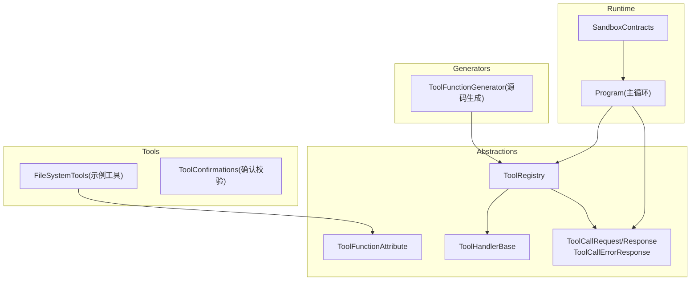
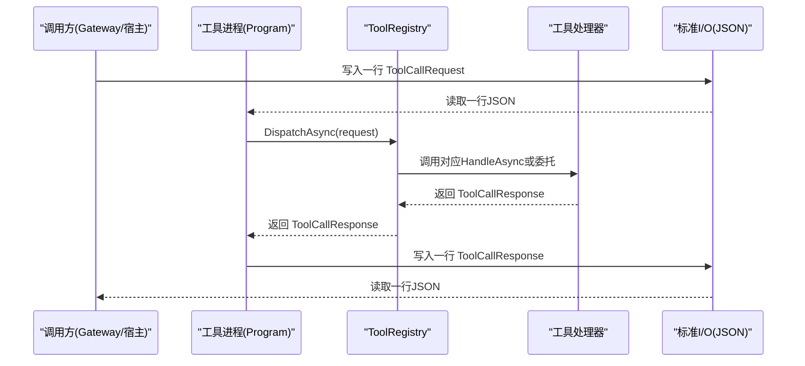
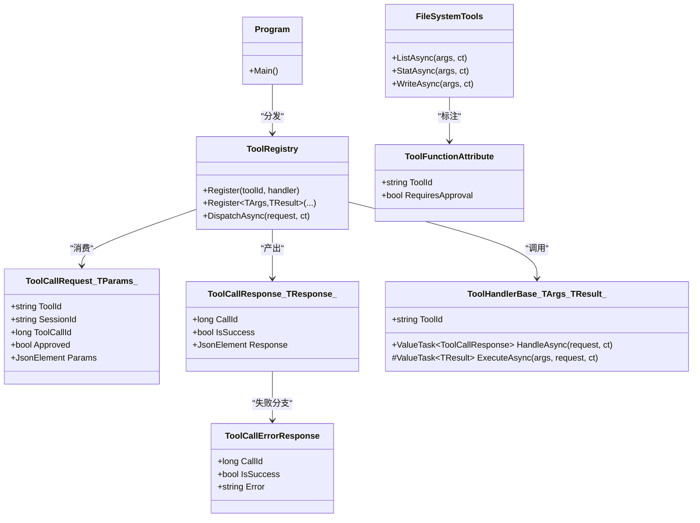
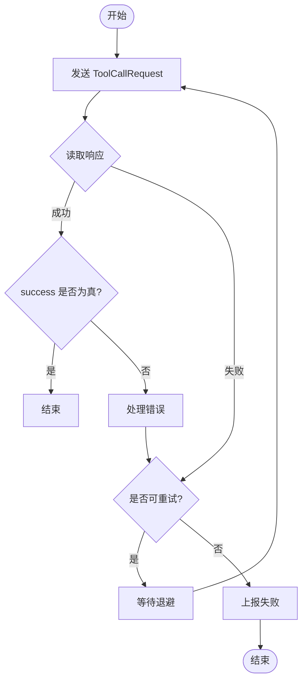

# 工具调用契约

<cite>
**本文引用的文件**   
- [ToolCalling.cs](file://TinadecTools/Abstractions/ToolCalling.cs)
- [ToolFunctionAttribute.cs](file://TinadecTools/Abstractions/ToolFunctionAttribute.cs)
- [ToolHandlerBase.cs](file://TinadecTools/Abstractions/ToolHandlerBase.cs)
- [ToolRegistry.cs](file://TinadecTools/Abstractions/ToolRegistry.cs)
- [Program.cs](file://TinadecTools/Program.cs)
- [FileSystemTools.cs](file://TinadecTools/Tools/FileRW/FileSystemTools.cs)
- [SandboxContracts.cs](file://TinadecTools/Runtime/Sandbox/SandboxContracts.cs)
- [ToolConfirmations.cs](file://TinadecTools/Tools/ToolConfirmations.cs)
- [ToolFunctionGenerator.cs](file://TinadecTools.Generators/ToolFunctionGenerator.cs)
</cite>

## 目录
1. [简介](#简介)
2. [项目结构](#项目结构)
3. [核心组件](#核心组件)
4. [架构总览](#架构总览)
5. [详细组件分析](#详细组件分析)
6. [依赖关系分析](#依赖关系分析)
7. [性能考虑](#性能考虑)
8. [故障排查指南](#故障排查指南)
9. [结论](#结论)
10. [附录：协议规范与集成示例](#附录协议规范与集成示例)

## 简介
本文件面向 ToolCalling 工具调用契约，系统性说明请求与响应数据结构、JSON 序列化格式、版本兼容性、调用上下文、参数传递与结果处理机制，并给出错误码定义、状态管理与异常处理策略。同时提供协议规范、消息格式、通信安全考虑以及客户端集成与重试实现指南，帮助读者快速、正确地对接工具运行时。

## 项目结构
工具调用契约位于 TinadecTools 的 Abstractions 层，通过控制台进程以行式 JSON 进行 I/O；具体工具实现位于 Tools 子模块，使用生成器与注册表完成自动发现与分发。沙箱运行契约用于隔离执行外部命令。

图表来源
- [Program.cs:1-68](file://TinadecTools/Program.cs#L1-L68)
- [ToolRegistry.cs:1-86](file://TinadecTools/Abstractions/ToolRegistry.cs#L1-L86)
- [ToolHandlerBase.cs:1-43](file://TinadecTools/Abstractions/ToolHandlerBase.cs#L1-L43)
- [ToolCalling.cs:1-83](file://TinadecTools/Abstractions/ToolCalling.cs#L1-L83)
- [ToolFunctionAttribute.cs:1-15](file://TinadecTools/Abstractions/ToolFunctionAttribute.cs#L1-L15)
- [FileSystemTools.cs:1-273](file://TinadecTools/Tools/FileRW/FileSystemTools.cs#L1-L273)
- [SandboxContracts.cs:1-71](file://TinadecTools/Runtime/Sandbox/SandboxContracts.cs#L1-L71)
- [ToolFunctionGenerator.cs:1-101](file://TinadecTools.Generators/ToolFunctionGenerator.cs#L1-L101)

章节来源
- [Program.cs:1-68](file://TinadecTools/Program.cs#L1-L68)
- [ToolCalling.cs:1-83](file://TinadecTools/Abstractions/ToolCalling.cs#L1-L83)
- [ToolRegistry.cs:1-86](file://TinadecTools/Abstractions/ToolRegistry.cs#L1-L86)
- [ToolHandlerBase.cs:1-43](file://TinadecTools/Abstractions/ToolHandlerBase.cs#L1-L43)
- [ToolFunctionAttribute.cs:1-15](file://TinadecTools/Abstractions/ToolFunctionAttribute.cs#L1-L15)
- [FileSystemTools.cs:1-273](file://TinadecTools/Tools/FileRW/FileSystemTools.cs#L1-L273)
- [SandboxContracts.cs:1-71](file://TinadecTools/Runtime/Sandbox/SandboxContracts.cs#L1-L71)
- [ToolFunctionGenerator.cs:1-101](file://TinadecTools.Generators/ToolFunctionGenerator.cs#L1-L101)

## 核心组件
- 请求与响应模型
  - ToolCallRequest<TParams>：包含 tool_id、session_id、toolcall_id、approved、params。
  - ToolCallResponse<TResponse>：包含 call_id、success、result。
  - ToolCallErrorResponse：包含 call_id、success、error。
  - NotApprovedResponse：未审核访问时的固定返回体。
- 处理器基类
  - ToolHandlerBase<TArgs, TResult>：统一反序列化参数、执行、序列化结果，并封装为 ToolCallResponse。
- 注册与分发
  - ToolRegistry：维护 toolId -> handler 映射，支持泛型注册、审批检查、参数校验与分发。
- 属性与生成器
  - ToolFunctionAttribute：声明工具 ID 与是否需要审批。
  - ToolFunctionGenerator：扫描标记方法，自动生成注册代码，绑定 JsonTypeInfo。
- 主循环
  - Program：从标准输入读取一行 JSON 请求，解析后分发，输出响应或错误对象。

章节来源
- [ToolCalling.cs:1-83](file://TinadecTools/Abstractions/ToolCalling.cs#L1-L83)
- [ToolHandlerBase.cs:1-43](file://TinadecTools/Abstractions/ToolHandlerBase.cs#L1-L43)
- [ToolRegistry.cs:1-86](file://TinadecTools/Abstractions/ToolRegistry.cs#L1-L86)
- [ToolFunctionAttribute.cs:1-15](file://TinadecTools/Abstractions/ToolFunctionAttribute.cs#L1-L15)
- [ToolFunctionGenerator.cs:1-101](file://TinadecTools.Generators/ToolFunctionGenerator.cs#L1-L101)
- [Program.cs:1-68](file://TinadecTools/Program.cs#L1-L68)

## 架构总览
工具调用采用“进程内 JSON 管道”模式：调用方（如 Gateway）向工具进程的标准输入写入单行 JSON 请求，工具进程处理后在标准输出写回单行 JSON 响应或错误对象。

图表来源
- [Program.cs:1-68](file://TinadecTools/Program.cs#L1-L68)
- [ToolRegistry.cs:1-86](file://TinadecTools/Abstractions/ToolRegistry.cs#L1-L86)
- [ToolHandlerBase.cs:1-43](file://TinadecTools/Abstractions/ToolHandlerBase.cs#L1-L43)
- [ToolCalling.cs:1-83](file://TinadecTools/Abstractions/ToolCalling.cs#L1-L83)

## 详细组件分析

### 数据模型与 JSON 序列化
- ToolCallRequest<TParams>
  - 字段：tool_id、session_id、toolcall_id、approved、params。
  - 必填校验：使用 JsonRequired 与 Required 双重约束。
  - params 为 JsonElement，便于通用反序列化为具体 TParams。
- ToolCallResponse<TResponse>
  - 字段：call_id、success、result。
  - result 为 JsonElement，承载业务结果。
- ToolCallErrorResponse
  - 字段：call_id、success、error。
- 序列化上下文
  - ToolCallJsonContext：对请求、响应、错误、字符串类型启用源生成优化。
- 未审核响应
  - NotApprovedResponse.MESSAGE 作为固定失败消息。

章节来源
- [ToolCalling.cs:1-83](file://TinadecTools/Abstractions/ToolCalling.cs#L1-L83)

### 处理器基类与参数流转
- ToolHandlerBase<TArgs, TResult>
  - HandleAsync：校验 params 非空，反序列化为 TArgs，调用 ExecuteAsync，将 TResult 序列化为 JsonElement 并包装为 ToolCallResponse。
  - 异常：参数缺失或解析失败抛出 InvalidOperationException。
- 典型用法：工具方法通过属性标注，由生成器注册到 ToolRegistry，或直接继承基类实现。

章节来源
- [ToolHandlerBase.cs:1-43](file://TinadecTools/Abstractions/ToolHandlerBase.cs#L1-L43)

### 注册表与分发逻辑
- ToolRegistry
  - Register：支持直接委托注册与泛型注册（含 JsonTypeInfo）。
  - 审批检查：当 requiresApproval=true 且 request.Approved=false，返回未审核失败响应。
  - 参数校验：params 为空时抛异常。
  - DispatchAsync：按 toolId 查找处理器并调用。
- 生成器
  - ToolFunctionGenerator：扫描带有 ToolFunctionAttribute 的方法，生成静态注册代码，绑定 JsonTypeInfo，并注入 requiresApproval。

章节来源
- [ToolRegistry.cs:1-86](file://TinadecTools/Abstractions/ToolRegistry.cs#L1-L86)
- [ToolFunctionAttribute.cs:1-15](file://TinadecTools/Abstractions/ToolFunctionAttribute.cs#L1-L15)
- [ToolFunctionGenerator.cs:1-101](file://TinadecTools.Generators/ToolFunctionGenerator.cs#L1-L101)

### 主循环与 I/O 协议
- Program
  - 启动后初始化工作区与工具注册。
  - 循环读取标准输入一行 JSON，反序列化为 ToolCallRequest。
  - 调用 ToolRegistry.DispatchAsync，捕获异常并输出 ToolCallErrorResponse。
  - 成功路径输出 ToolCallResponse。
  - 退出前释放资源（如 MCP 运行时）。

章节来源
- [Program.cs:1-68](file://TinadecTools/Program.cs#L1-L68)

### 示例工具：文件系统操作
- FileSystemTools
  - 定义参数与响应模型（如 ListDirectoryParams、StatPathParams、WriteFileParams 等），并通过 JsonSourceGenerationOptions 指定序列化上下文。
  - 工具方法使用 [ToolFunction] 标注，部分需要审批（如 write_file）。
  - 内部实现包括分页游标、自然排序、文件读写锁、哈希校验等。
- ToolConfirmations
  - 提供 Require 方法，用于强制要求变更操作的确认字段。

章节来源
- [FileSystemTools.cs:1-273](file://TinadecTools/Tools/FileRW/FileSystemTools.cs#L1-L273)
- [ToolConfirmations.cs:1-12](file://TinadecTools/Tools/ToolConfirmations.cs#L1-L12)

### 沙箱运行契约（隔离执行）
- SandboxContracts
  - 定义沙箱策略、权限、请求与响应模型，以及 ISandboxBackend 接口。
  - 用于在受限环境中执行外部命令，确保安全性与可观测性。

章节来源
- [SandboxContracts.cs:1-71](file://TinadecTools/Runtime/Sandbox/SandboxContracts.cs#L1-L71)

## 依赖关系分析
- 低耦合高内聚：Abstractions 层仅暴露契约与分发能力；具体工具实现位于 Tools 层，通过属性与生成器解耦。
- 关键依赖链：
  - Program -> ToolRegistry -> ToolHandlerBase/委托 -> 具体工具方法
  - ToolFunctionAttribute -> ToolFunctionGenerator -> GeneratedToolRegistry.RegisterAll()
  - JsonSerializerContext -> 各工具的 JsonTypeInfo，提升序列化性能

图表来源
- [ToolCalling.cs:1-83](file://TinadecTools/Abstractions/ToolCalling.cs#L1-L83)
- [ToolHandlerBase.cs:1-43](file://TinadecTools/Abstractions/ToolHandlerBase.cs#L1-L43)
- [ToolRegistry.cs:1-86](file://TinadecTools/Abstractions/ToolRegistry.cs#L1-L86)
- [ToolFunctionAttribute.cs:1-15](file://TinadecTools/Abstractions/ToolFunctionAttribute.cs#L1-L15)
- [FileSystemTools.cs:1-273](file://TinadecTools/Tools/FileRW/FileSystemTools.cs#L1-L273)
- [Program.cs:1-68](file://TinadecTools/Program.cs#L1-L68)

## 性能考虑
- 使用 System.Text.Json 源生成上下文（JsonSerializerContext）减少反射开销，提高序列化/反序列化性能。
- 参数与结果均通过 JsonElement 中转，避免重复解析；具体类型反序列化仅在工具处理器内进行。
- 并发控制：文件写入使用读写锁，避免竞争条件。
- 分页与游标：列表操作支持 cursor 分页，限制最大页大小，降低内存占用。
- 短生命周期进程：每次调用独立行式 JSON，避免长连接带来的资源占用。

[本节为通用指导，不直接分析具体文件]

## 故障排查指南
- 常见错误码与原因
  - INVALID_PARAMETER：参数解析失败（例如 JSON 类型不匹配、缺少必填字段）。
  - UNAPPROVED：需要审批的工具未获得批准（request.Approved=false）。
  - UNKNOWN_TOOL：tool_id 未在注册表中找到。
  - INTERNAL_ERROR：工具执行过程中抛出异常（被捕获后以 ToolCallErrorResponse 返回）。
- 定位步骤
  - 检查 ToolCallRequest 的必填字段是否齐全且类型正确。
  - 查看 ToolCallErrorResponse 的 error 字段获取异常信息。
  - 对于需要审批的工具，确认 approved 标志位。
  - 核对工具是否已通过生成器或手动注册。
- 日志与调试
  - 工具进程内记录 Debug/Warn 日志，便于定位问题。
  - 沙箱执行返回 stdout/stderr/timed_out/duration_ms 等字段辅助诊断。

章节来源
- [Program.cs:1-68](file://TinadecTools/Program.cs#L1-L68)
- [ToolRegistry.cs:1-86](file://TinadecTools/Abstractions/ToolRegistry.cs#L1-L86)
- [SandboxContracts.cs:1-71](file://TinadecTools/Runtime/Sandbox/SandboxContracts.cs#L1-L71)

## 结论
ToolCalling 契约通过统一的 JSON 行式协议、强类型的参数与结果模型、基于属性的工具声明与源码生成、以及健壮的注册分发与错误处理机制，实现了可扩展、高性能、安全的工具调用体系。结合沙箱隔离与审批控制，可在复杂场景中保障稳定性与安全边界。

[本节为总结性内容，不直接分析具体文件]

## 附录：协议规范与集成示例

### 协议规范
- 传输方式
  - 单向行式 JSON：每行一个完整的请求或响应对象。
  - 编码：UTF-8。
- 请求对象（ToolCallRequest）
  - tool_id：字符串，工具唯一标识。
  - session_id：字符串，会话标识。
  - toolcall_id：整数，调用唯一标识。
  - approved：布尔值，是否需要审批及是否已审批。
  - params：任意 JSON 对象，工具特定参数。
- 响应对象（ToolCallResponse）
  - call_id：整数，与请求 toolcall_id 对应。
  - success：布尔值，表示是否成功。
  - result：任意 JSON 对象，工具返回的业务结果。
- 错误对象（ToolCallErrorResponse）
  - call_id：整数，与请求 toolcall_id 对应。
  - success：布尔值，通常为 false。
  - error：字符串，错误描述。

章节来源
- [ToolCalling.cs:1-83](file://TinadecTools/Abstractions/ToolCalling.cs#L1-L83)
- [Program.cs:1-68](file://TinadecTools/Program.cs#L1-L68)

### 版本兼容性
- 向后兼容建议
  - 新增可选字段应默认值明确，避免破坏旧客户端。
  - 保留历史字段，废弃字段标记但不立即移除。
- 向前兼容建议
  - 服务端忽略未知字段，保证新客户端可被旧服务端处理。
- 序列化上下文
  - 通过 JsonSourceGenerationOptions 锁定字段名与顺序，避免歧义。

[本节为通用指导，不直接分析具体文件]

### 调用上下文与参数传递
- 上下文字段
  - session_id：跨调用保持会话状态。
  - toolcall_id：追踪单次调用链路。
- 参数传递
  - params 为 JsonElement，工具处理器根据 JsonTypeInfo 反序列化为具体类型。
  - 若 params 为空或类型不匹配，将抛出异常并被上层捕获为错误响应。

章节来源
- [ToolCalling.cs:1-83](file://TinadecTools/Abstractions/ToolCalling.cs#L1-L83)
- [ToolHandlerBase.cs:1-43](file://TinadecTools/Abstractions/ToolHandlerBase.cs#L1-L43)

### 结果处理与状态管理
- 成功路径
  - ToolCallResponse.success=true，result 包含业务数据。
- 失败路径
  - ToolCallResponse.success=false 或 ToolCallErrorResponse.error 包含错误信息。
- 审批状态
  - requiresApproval=true 且 approved=false 时返回未审核失败。

章节来源
- [ToolRegistry.cs:1-86](file://TinadecTools/Abstractions/ToolRegistry.cs#L1-L86)
- [ToolCalling.cs:1-83](file://TinadecTools/Abstractions/ToolCalling.cs#L1-L83)

### 通信安全考虑
- 最小权限原则：沙箱策略限定读/写路径与环境变量。
- 审批机制：变更操作需显式批准。
- 输入校验：严格校验参数类型与范围，防止注入与越界。
- 输出截断：沙箱响应支持 stdout/stderr 截断标志，避免过大输出。

章节来源
- [SandboxContracts.cs:1-71](file://TinadecTools/Runtime/Sandbox/SandboxContracts.cs#L1-L71)
- [ToolConfirmations.cs:1-12](file://TinadecTools/Tools/ToolConfirmations.cs#L1-L12)

### 客户端集成示例（流程说明）
- 发送请求
  - 构造 ToolCallRequest，设置 tool_id、session_id、toolcall_id、approved、params。
  - 写入标准输入一行 JSON。
- 接收响应
  - 读取一行 JSON，判断是 ToolCallResponse 还是 ToolCallErrorResponse。
  - 根据 success 与 result/error 进行处理。
- 重试机制
  - 网络级重试：针对超时、I/O 错误进行指数退避重试。
  - 业务级重试：对幂等工具（如只读查询）允许有限次重试；对变更工具谨慎重试。
  - 去重：使用 toolcall_id 作为幂等键，避免重复执行。

[本节为通用指导，不直接分析具体文件]

### 错误处理与重试流程图

[本图为概念流程，不直接映射具体文件]