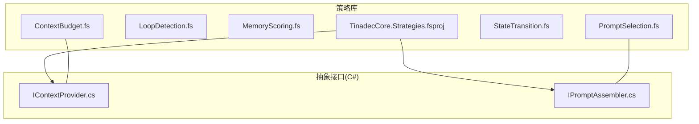
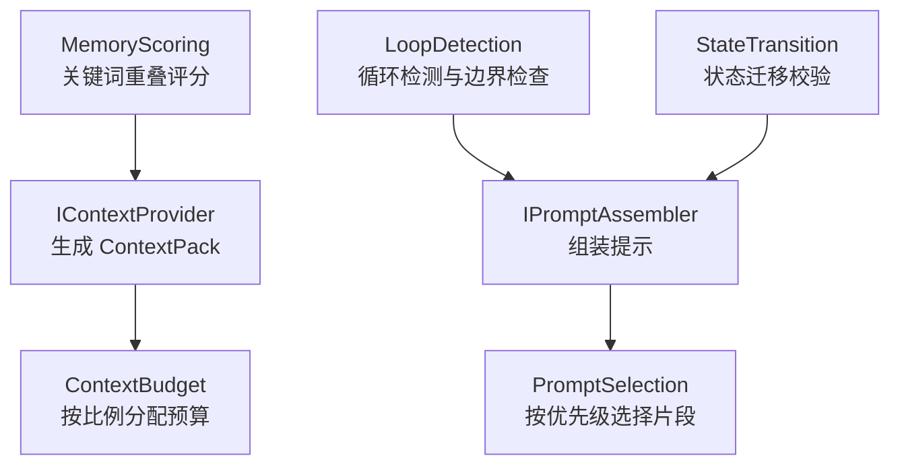
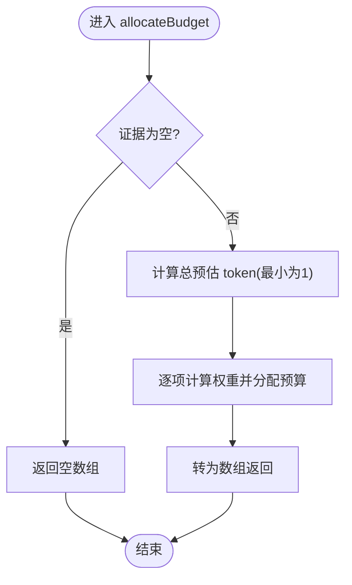
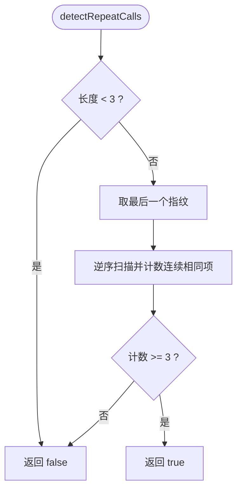
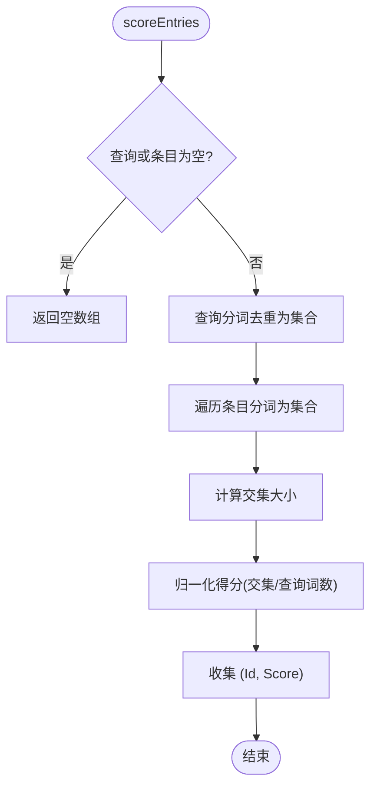
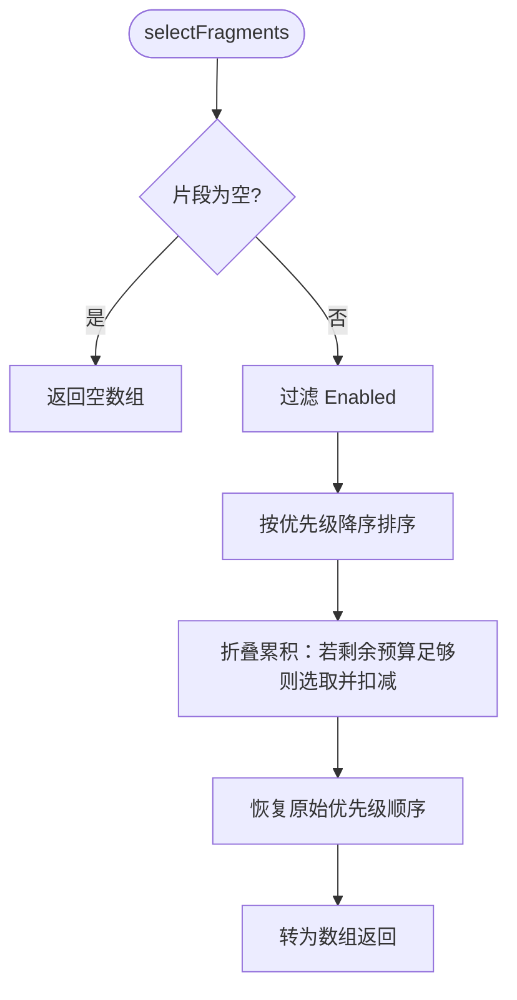
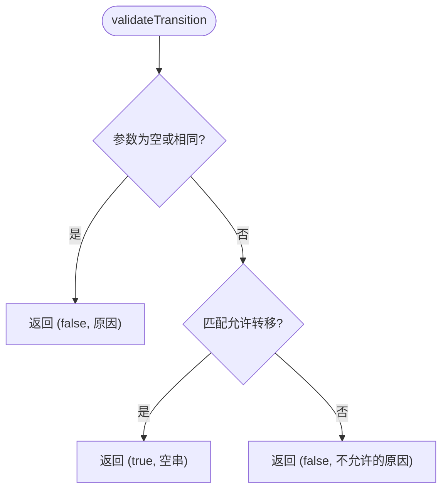
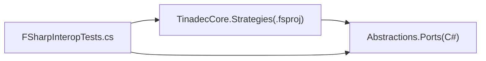

# F# 策略开发

<cite>
**本文引用的文件**
- [ContextBudget.fs](file://TinadecCore/Strategies/ContextBudget.fs)
- [LoopDetection.fs](file://TinadecCore/Strategies/LoopDetection.fs)
- [MemoryScoring.fs](file://TinadecCore/Strategies/MemoryScoring.fs)
- [PromptSelection.fs](file://TinadecCore/Strategies/PromptSelection.fs)
- [StateTransition.fs](file://TinadecCore/Strategies/StateTransition.fs)
- [TinadecCore.Strategies.fsproj](file://TinadecCore/Strategies/TinadecCore.Strategies.fsproj)
- [FSharpInteropTests.cs](file://TinadecCore/tests/TinadecCore.AgentFramework.Tests/FSharpInteropTests.cs)
- [IContextProvider.cs](file://TinadecCore/Abstractions/Ports/IContextProvider.cs)
- [IPromptAssembler.cs](file://TinadecCore/Abstractions/Ports/IPromptAssembler.cs)
</cite>

## 目录
1. [简介](#简介)
2. [项目结构](#项目结构)
3. [核心组件](#核心组件)
4. [架构总览](#架构总览)
5. [详细组件分析](#详细组件分析)
6. [依赖分析](#依赖分析)
7. [性能考虑](#性能考虑)
8. [故障排查指南](#故障排查指南)
9. [结论](#结论)
10. [附录：自定义 F# 策略开发指南](#附录自定义-f-策略开发指南)

## 简介
本文件面向在 TinadecOffice 中基于 F# 进行策略开发的工程师与架构师，系统性阐述纯函数设计、不可变数据结构与模式匹配的最佳实践，并深入解析以下五大策略模块的实现原理与使用方式：
- ContextBudget 预算分配算法
- LoopDetection 循环检测机制
- MemoryScoring 内存评分系统
- PromptSelection 提示选择策略
- StateTransition 状态转换逻辑

文档同时提供可操作的自定义策略开发指南（模块组织、类型定义、错误处理、单元测试），以及性能优化技巧与调试策略，帮助读者快速构建高质量、可维护的 F# 策略内核。

## 项目结构
F# 策略位于独立库项目中，采用“按功能域划分”的组织方式，每个策略一个模块文件，保持高内聚、低耦合。项目通过 .fsproj 声明目标框架、根命名空间、描述信息，并通过 ProjectReference 引用 Abstractions 接口层，确保 C# 与 F# 之间的契约稳定。

图表来源
- [TinadecCore.Strategies.fsproj:1-27](file://TinadecCore/Strategies/TinadecCore.Strategies.fsproj#L1-L27)
- [IContextProvider.cs:1-37](file://TinadecCore/Abstractions/Ports/IContextProvider.cs#L1-L37)
- [IPromptAssembler.cs:1-23](file://TinadecCore/Abstractions/Ports/IPromptAssembler.cs#L1-L23)

章节来源
- [TinadecCore.Strategies.fsproj:1-27](file://TinadecCore/Strategies/TinadecCore.Strategies.fsproj#L1-L27)

## 核心组件
- ContextBudget：基于证据项预估 token 的按比例分配，返回整型数组；提供超预算判断与利用率计算。
- LoopDetection：基于工具调用指纹序列检测连续重复调用，并提供迭代次数、token 预算、工具调用次数、连续错误等边界检查。
- MemoryScoring：基于关键词重叠度的简单相关性评分，支持过滤与排序取 Top-N。
- PromptSelection：按优先级降序选择能放入 token 预算的提示片段，返回 C# 兼容记录类型。
- StateTransition：基于模式匹配的状态迁移合法性校验，返回布尔与原因字符串元组。

章节来源
- [ContextBudget.fs:1-36](file://TinadecCore/Strategies/ContextBudget.fs#L1-L36)
- [LoopDetection.fs:1-46](file://TinadecCore/Strategies/LoopDetection.fs#L1-L46)
- [MemoryScoring.fs:1-46](file://TinadecCore/Strategies/MemoryScoring.fs#L1-L46)
- [PromptSelection.fs:1-38](file://TinadecCore/Strategies/PromptSelection.fs#L1-L38)
- [StateTransition.fs:1-26](file://TinadecCore/Strategies/StateTransition.fs#L1-L26)

## 架构总览
下图展示了 F# 策略与 C# 抽象层的交互关系：上下文提供者生成带 token 预算的证据集合，提示组装器组合提示片段，而 F# 策略作为纯函数内核被上层编排调用。

图表来源
- [IContextProvider.cs:1-37](file://TinadecCore/Abstractions/Ports/IContextProvider.cs#L1-L37)
- [IPromptAssembler.cs:1-23](file://TinadecCore/Abstractions/Ports/IPromptAssembler.cs#L1-L23)
- [ContextBudget.fs:1-36](file://TinadecCore/Strategies/ContextBudget.fs#L1-L36)
- [PromptSelection.fs:1-38](file://TinadecCore/Strategies/PromptSelection.fs#L1-L38)
- [MemoryScoring.fs:1-46](file://TinadecCore/Strategies/MemoryScoring.fs#L1-L46)
- [LoopDetection.fs:1-46](file://TinadecCore/Strategies/LoopDetection.fs#L1-L46)
- [StateTransition.fs:1-26](file://TinadecCore/Strategies/StateTransition.fs#L1-L26)

## 详细组件分析

### ContextBudget 预算分配算法
- 输入：总预算整数、证据列表（含预估 token）
- 输出：各证据项分配的整型预算数组
- 算法要点：
  - 对空或 null 输入直接返回空数组
  - 计算总预估 token（至少为 1，避免除零）
  - 按权重 = 单项预估 / 总预估 的比例分配预算
  - 提供 isOverBudget 与 utilizationRatio 辅助方法

图表来源
- [ContextBudget.fs:11-24](file://TinadecCore/Strategies/ContextBudget.fs#L11-L24)

章节来源
- [ContextBudget.fs:1-36](file://TinadecCore/Strategies/ContextBudget.fs#L1-L36)

### LoopDetection 循环检测机制
- 输入：工具调用指纹序列及各类阈值
- 输出：是否检测到循环（布尔）
- 算法要点：
  - 从尾部向前扫描，统计相同指纹连续出现次数，≥3 即判定循环
  - 提供迭代上限、token 预算耗尽、工具调用上限、连续错误上限等边界检查

图表来源
- [LoopDetection.fs:11-22](file://TinadecCore/Strategies/LoopDetection.fs#L11-L22)

章节来源
- [LoopDetection.fs:1-46](file://TinadecCore/Strategies/LoopDetection.fs#L1-L46)

### MemoryScoring 内存评分系统
- 输入：查询字符串、记忆条目列表（含内容）
- 输出：条目 ID 与相关性的分数数组
- 算法要点：
  - 将查询与条目内容分词为小写词集
  - 以交集大小除以查询词数得到相似度分数
  - topEntries 过滤正分、按分数降序、截断至 maxResults

图表来源
- [MemoryScoring.fs:11-32](file://TinadecCore/Strategies/MemoryScoring.fs#L11-L32)

章节来源
- [MemoryScoring.fs:1-46](file://TinadecCore/Strategies/MemoryScoring.fs#L1-L46)

### PromptSelection 提示选择策略
- 输入：token 预算、提示片段列表（含优先级、预估 token、启用标志）
- 输出：选中的片段数组（C# 兼容记录）
- 算法要点：
  - 仅选择 Enabled 的片段
  - 按 Priority 降序贪心选取，直到剩余预算不足
  - 返回顺序保持原优先级顺序

图表来源
- [PromptSelection.fs:22-37](file://TinadecCore/Strategies/PromptSelection.fs#L22-L37)

章节来源
- [PromptSelection.fs:1-38](file://TinadecCore/Strategies/PromptSelection.fs#L1-L38)

### StateTransition 状态转换逻辑
- 输入：当前状态、目标状态
- 输出：(是否合法, 原因) 元组
- 算法要点：
  - 使用模式匹配枚举允许的状态转移
  - 非法转移返回 false 与具体原因
  - 空值与相同状态均视为非法

图表来源
- [StateTransition.fs:10-26](file://TinadecCore/Strategies/StateTransition.fs#L10-L26)

章节来源
- [StateTransition.fs:1-26](file://TinadecCore/Strategies/StateTransition.fs#L1-L26)

## 依赖分析
- 策略库依赖 Abstractions 接口层（C#），用于与上下文提供者和提示组装器协作。
- 测试用例验证 F# 函数对外暴露的类型均为 C# 兼容类型（如 int[]、bool、double、tuple）。

图表来源
- [TinadecCore.Strategies.fsproj:10-16](file://TinadecCore/Strategies/TinadecCore.Strategies.fsproj#L10-L16)
- [FSharpInteropTests.cs:1-118](file://TinadecCore/tests/TinadecCore.AgentFramework.Tests/FSharpInteropTests.cs#L1-L118)

章节来源
- [TinadecCore.Strategies.fsproj:1-27](file://TinadecCore/Strategies/TinadecCore.Strategies.fsproj#L1-L27)
- [FSharpInteropTests.cs:1-118](file://TinadecCore/tests/TinadecCore.AgentFramework.Tests/FSharpInteropTests.cs#L1-L118)

## 性能考虑
- 避免不必要的装箱与分配：优先使用数组与 Seq 管道，减少中间集合创建。
- 分词与集合操作：MemoryScoring 中对查询与内容进行分词并转 Set，建议缓存热点查询的分词结果以降低重复开销。
- 预算分配：ContextBudget 的权重计算涉及浮点运算，注意预算较大时的精度问题，必要时引入舍入策略。
- 提示选择：PromptSelection 的排序与折叠复杂度 O(n log n + n)，当片段数量大时可考虑预排序或索引。
- 循环检测：LoopDetection 逆序扫描时间复杂度 O(k)，k 为尾部连续段长度，通常很小。

[本节为通用指导，不直接分析具体文件]

## 故障排查指南
- 预算分配异常：
  - 检查证据 EstimatedTokens 是否为 0 导致权重计算异常（已用 max(...,1) 规避）
  - 确认 totalBudget 为正数
- 循环检测误报：
  - 确认指纹序列末尾是否存在 ≥3 次连续相同指纹
  - 检查调用链是否正确追加指纹
- 内存评分偏低：
  - 检查分词规则与停用词处理是否一致
  - 确认查询与内容编码一致（大小写、空白符）
- 提示选择未命中：
  - 检查片段 Enabled 标志与 EstimatedTokens 设置
  - 确认优先级排序是否符合预期
- 状态转换失败：
  - 核对当前状态与目标状态是否在允许转移表中
  - 检查空值与相同状态分支

章节来源
- [ContextBudget.fs:11-24](file://TinadecCore/Strategies/ContextBudget.fs#L11-L24)
- [LoopDetection.fs:11-22](file://TinadecCore/Strategies/LoopDetection.fs#L11-L22)
- [MemoryScoring.fs:11-32](file://TinadecCore/Strategies/MemoryScoring.fs#L11-L32)
- [PromptSelection.fs:22-37](file://TinadecCore/Strategies/PromptSelection.fs#L22-L37)
- [StateTransition.fs:10-26](file://TinadecCore/Strategies/StateTransition.fs#L10-L26)

## 结论
F# 策略模块以纯函数为核心，结合不可变数据与模式匹配，提供了高内聚、易测试、易推理的策略内核。通过与 C# 抽象层的清晰契约，这些策略可在上下文中灵活编排，支撑高效的上下文预算、提示选择、内存评分、循环检测与状态管理。遵循本文的开发指南与最佳实践，可显著提升策略的可维护性与性能表现。

[本节为总结性内容，不直接分析具体文件]

## 附录：自定义 F# 策略开发指南
- 模块组织
  - 每个策略一个模块文件，单一职责，便于独立测试与维护
  - 公共 API 尽量暴露为纯函数，避免副作用
- 类型定义
  - 与 C# 互操作时，使用 C# 兼容类型（如数组、基本类型、Tuple）
  - 需要跨语言使用的记录类型可使用 [<CLIMutable>] 标记
- 错误处理
  - 使用返回值表达成功/失败（如 bool * string），避免抛出异常
  - 对空输入与边界条件进行显式检查
- 单元测试
  - 使用 xUnit 编写 C# 测试，覆盖正常路径、边界条件与异常场景
  - 验证返回类型与值语义，确保 F# 类型不泄漏到 C# 侧
- 性能优化
  - 使用 Seq 管道与惰性求值，避免中间集合
  - 对热点数据进行缓存（如分词结果、排序索引）
- 调试策略
  - 在关键步骤添加日志或断言，验证中间结果
  - 使用最小复现用例定位问题

章节来源
- [PromptSelection.fs:9-16](file://TinadecCore/Strategies/PromptSelection.fs#L9-L16)
- [FSharpInteropTests.cs:14-116](file://TinadecCore/tests/TinadecCore.AgentFramework.Tests/FSharpInteropTests.cs#L14-L116)