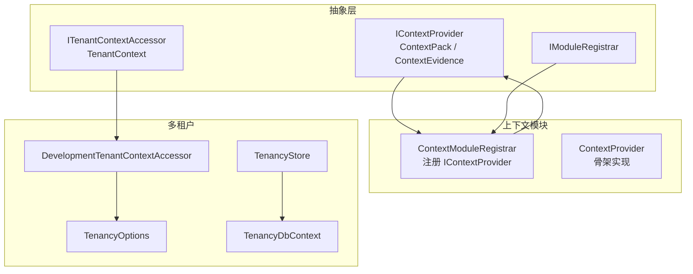
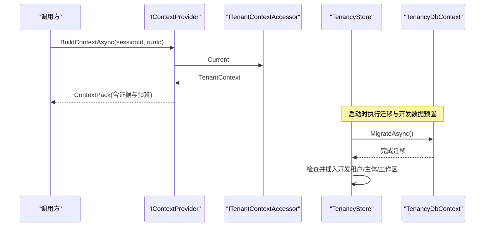
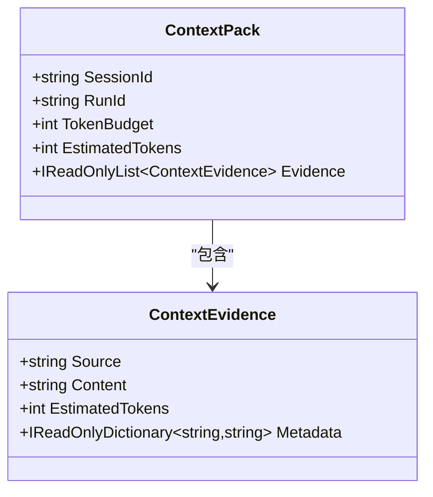
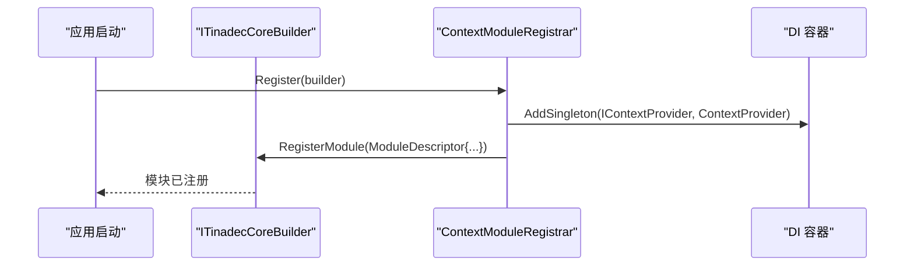
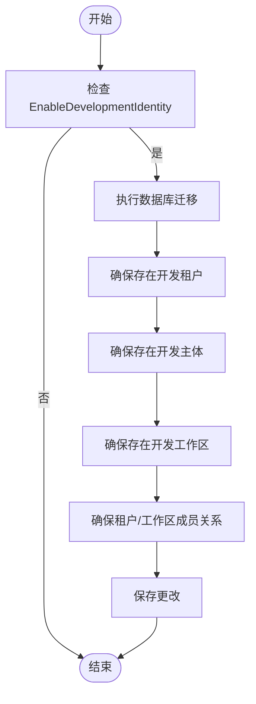
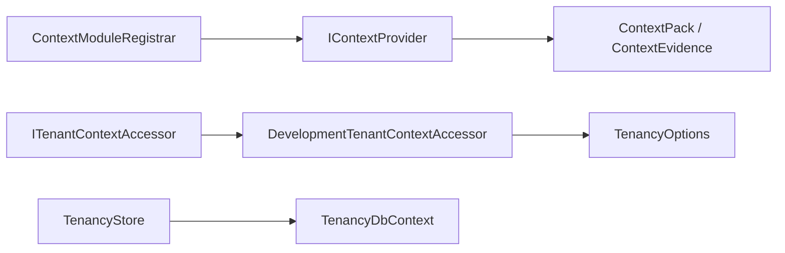

# 上下文扩展开发

<cite>
**本文引用的文件**   
- [IContextProvider.cs](file://TinadecCore/Abstractions/Ports/IContextProvider.cs)
- [ITenantContextAccessor.cs](file://TinadecCore/Abstractions/Ports/ITenantContextAccessor.cs)
- [IModuleRegistrar.cs](file://TinadecCore/Abstractions/IModuleRegistrar.cs)
- [ContextModuleRegistrar.cs](file://TinadecCore/Context/ContextModuleRegistrar.cs)
- [DevelopmentTenantContextAccessor.cs](file://TinadecCore/Tenancy/DevelopmentTenantContextAccessor.cs)
- [TenancyStore.cs](file://TinadecCore/Tenancy/TenancyStore.cs)
- [TenancyOptions.cs](file://TinadecCore/Tenancy/TenancyOptions.cs)
- [TenancyDbContext.cs](file://TinadecCore/Tenancy/TenancyDbContext.cs)
</cite>

## 目录
1. [简介](#简介)
2. [项目结构](#项目结构)
3. [核心组件](#核心组件)
4. [架构总览](#架构总览)
5. [详细组件分析](#详细组件分析)
6. [依赖关系分析](#依赖关系分析)
7. [性能考虑](#性能考虑)
8. [故障排查指南](#故障排查指南)
9. [结论](#结论)
10. [附录](#附录)

## 简介
本指南面向需要在系统中扩展“上下文”能力的开发者，围绕 IContextProvider 接口的实现、上下文数据的获取与缓存、生命周期管理，以及 ContextModuleRegistrar 的模块注册与依赖注入配置进行系统化说明。同时涵盖多租户上下文的实现方式（DevelopmentTenantContextAccessor 与 TenancyStore 的数据持久化），并提供自定义上下文提供者的示例（安全上下文、用户权限上下文、项目配置上下文）。最后给出上下文数据的验证、序列化与性能优化策略建议。

## 项目结构
与上下文扩展相关的代码主要分布在以下位置：
- Abstractions/Ports：定义上下文提供者接口与租户上下文访问器接口
- Context：上下文模块注册器与骨架实现
- Tenancy：多租户上下文访问器、选项配置、数据库上下文与存储迁移参与者

图表来源
- [IContextProvider.cs:1-37](file://TinadecCore/Abstractions/Ports/IContextProvider.cs#L1-L37)
- [ITenantContextAccessor.cs:1-15](file://TinadecCore/Abstractions/Ports/ITenantContextAccessor.cs#L1-L15)
- [IModuleRegistrar.cs:1-17](file://TinadecCore/Abstractions/IModuleRegistrar.cs#L1-L17)
- [ContextModuleRegistrar.cs:1-52](file://TinadecCore/Context/ContextModuleRegistrar.cs#L1-L52)
- [DevelopmentTenantContextAccessor.cs:1-19](file://TinadecCore/Tenancy/DevelopmentTenantContextAccessor.cs#L1-L19)
- [TenancyOptions.cs:1-12](file://TinadecCore/Tenancy/TenancyOptions.cs#L1-L12)
- [TenancyDbContext.cs:1-59](file://TinadecCore/Tenancy/TenancyDbContext.cs#L1-L59)
- [TenancyStore.cs:1-48](file://TinadecCore/Tenancy/TenancyStore.cs#L1-L48)

章节来源
- [IContextProvider.cs:1-37](file://TinadecCore/Abstractions/Ports/IContextProvider.cs#L1-L37)
- [ContextModuleRegistrar.cs:1-52](file://TinadecCore/Context/ContextModuleRegistrar.cs#L1-L52)
- [ITenantContextAccessor.cs:1-15](file://TinadecCore/Abstractions/Ports/ITenantContextAccessor.cs#L1-L15)
- [DevelopmentTenantContextAccessor.cs:1-19](file://TinadecCore/Tenancy/DevelopmentTenantContextAccessor.cs#L1-L19)
- [TenancyStore.cs:1-48](file://TinadecCore/Tenancy/TenancyStore.cs#L1-L48)
- [TenancyOptions.cs:1-12](file://TinadecCore/Tenancy/TenancyOptions.cs#L1-L12)
- [TenancyDbContext.cs:1-59](file://TinadecCore/Tenancy/TenancyDbContext.cs#L1-L59)

## 核心组件
- IContextProvider：定义上下文构建契约，返回包含证据、来源与令牌预算的 ContextPack。
- ContextPack / ContextEvidence：描述上下文包结构与证据元数据，便于追踪来源与估算令牌消耗。
- ITenantContextAccessor / TenantContext：抽象当前请求的租户、工作区与主体身份，支持开发模式标识。
- ContextModuleRegistrar：将 IContextProvider 注册到 DI 容器，并声明模块能力与依赖。
- DevelopmentTenantContextAccessor：在开发模式下提供固定租户/工作区/主体上下文。
- TenancyStore：通过 EF Core 迁移参与初始化，并在开发模式下预置基础数据。
- TenancyOptions：控制开发身份开关及默认值。
- TenancyDbContext：多租户相关实体与表映射。

章节来源
- [IContextProvider.cs:1-37](file://TinadecCore/Abstractions/Ports/IContextProvider.cs#L1-L37)
- [ITenantContextAccessor.cs:1-15](file://TinadecCore/Abstractions/Ports/ITenantContextAccessor.cs#L1-L15)
- [ContextModuleRegistrar.cs:1-52](file://TinadecCore/Context/ContextModuleRegistrar.cs#L1-L52)
- [DevelopmentTenantContextAccessor.cs:1-19](file://TinadecCore/Tenancy/DevelopmentTenantContextAccessor.cs#L1-L19)
- [TenancyStore.cs:1-48](file://TinadecCore/Tenancy/TenancyStore.cs#L1-L48)
- [TenancyOptions.cs:1-12](file://TinadecCore/Tenancy/TenancyOptions.cs#L1-L12)
- [TenancyDbContext.cs:1-59](file://TinadecCore/Tenancy/TenancyDbContext.cs#L1-L59)

## 架构总览
下图展示了上下文构建与多租户上下文在运行时的交互关系。

图表来源
- [IContextProvider.cs:1-37](file://TinadecCore/Abstractions/Ports/IContextProvider.cs#L1-L37)
- [ITenantContextAccessor.cs:1-15](file://TinadecCore/Abstractions/Ports/ITenantContextAccessor.cs#L1-L15)
- [DevelopmentTenantContextAccessor.cs:1-19](file://TinadecCore/Tenancy/DevelopmentTenantContextAccessor.cs#L1-L19)
- [TenancyStore.cs:1-48](file://TinadecCore/Tenancy/TenancyStore.cs#L1-L48)
- [TenancyDbContext.cs:1-59](file://TinadecCore/Tenancy/TenancyDbContext.cs#L1-L59)

## 详细组件分析

### IContextProvider 与 ContextPack
- 职责：为给定会话和运行生成上下文包，包含证据列表与令牌预算，不组装最终系统提示。
- 数据结构：
  - ContextPack：会话/运行标识、令牌预算、预估令牌数、证据集合。
  - ContextEvidence：来源、内容、预估令牌数、元数据键值对。
- 复杂度：构建过程通常为 O(n)（n 为证据数量），需合理估算 EstimatedTokens 以控制上下文大小。
- 错误处理：应在证据收集阶段校验数据来源与内容合法性；当预算不足时应裁剪或降级证据。

章节来源
- [IContextProvider.cs:1-37](file://TinadecCore/Abstractions/Ports/IContextProvider.cs#L1-L37)

#### 类图（上下文数据结构）

图表来源
- [IContextProvider.cs:1-37](file://TinadecCore/Abstractions/Ports/IContextProvider.cs#L1-L37)

### ContextModuleRegistrar 与模块注册
- 职责：将 IContextProvider 的实现注册为单例，并向框架声明模块 ID、版本、依赖与能力。
- 依赖：abstractions、strategies。
- 能力：context_pack、evidence_gathering、token_budget。
- 使用方式：在应用启动时由框架显式加载各模块注册器，无需反射扫描。

章节来源
- [ContextModuleRegistrar.cs:1-52](file://TinadecCore/Context/ContextModuleRegistrar.cs#L1-L52)
- [IModuleRegistrar.cs:1-17](file://TinadecCore/Abstractions/IModuleRegistrar.cs#L1-L17)

#### 序列图（模块注册流程）

图表来源
- [ContextModuleRegistrar.cs:1-52](file://TinadecCore/Context/ContextModuleRegistrar.cs#L1-L52)
- [IModuleRegistrar.cs:1-17](file://TinadecCore/Abstractions/IModuleRegistrar.cs#L1-L17)

### 多租户上下文：DevelopmentTenantContextAccessor 与 TenancyStore
- DevelopmentTenantContextAccessor：
  - 在启用开发身份时返回固定的租户、工作区与主体信息，角色为 owner，IsDevelopment=true。
  - 未启用时抛出异常，要求实现认证后的 ITenantContextAccessor。
- TenancyStore：
  - 作为 IStorageMigrationParticipant 参与数据库迁移。
  - 在开发模式下自动创建租户、主体、工作区与成员关系记录，确保本地开发环境可用。
- TenancyOptions：
  - 控制是否启用开发身份，以及开发环境的默认标识符与名称。
- TenancyDbContext：
  - 定义租户、主体、工作区及其成员关系的实体与表映射，包含唯一索引与状态字段。

章节来源
- [DevelopmentTenantContextAccessor.cs:1-19](file://TinadecCore/Tenancy/DevelopmentTenantContextAccessor.cs#L1-L19)
- [TenancyStore.cs:1-48](file://TinadecCore/Tenancy/TenancyStore.cs#L1-L48)
- [TenancyOptions.cs:1-12](file://TinadecCore/Tenancy/TenancyOptions.cs#L1-L12)
- [TenancyDbContext.cs:1-59](file://TinadecCore/Tenancy/TenancyDbContext.cs#L1-L59)

#### 流程图（开发数据初始化）

图表来源
- [TenancyStore.cs:1-48](file://TinadecCore/Tenancy/TenancyStore.cs#L1-L48)
- [TenancyOptions.cs:1-12](file://TinadecCore/Tenancy/TenancyOptions.cs#L1-L12)

### 自定义上下文提供者开发示例
以下为三类常见上下文提供者的设计要点与实现思路（不展示具体代码，仅给出路径指引）：

- 安全上下文提供者
  - 目标：从当前请求的安全令牌或会话中解析用户身份、角色与权限范围。
  - 依赖：ITenantContextAccessor（用于隔离边界）、外部安全服务（可选）。
  - 输出：ContextEvidence 列表，包含权限策略片段、角色声明等。
  - 参考路径：[IContextProvider.cs:1-37](file://TinadecCore/Abstractions/Ports/IContextProvider.cs#L1-L37)

- 用户权限上下文提供者
  - 目标：聚合用户的资源访问权限、功能开关与配额限制。
  - 依赖：权限服务或配置中心、缓存（可选）。
  - 输出：权限规则、配额信息与元数据。
  - 参考路径：[IContextProvider.cs:1-37](file://TinadecCore/Abstractions/Ports/IContextProvider.cs#L1-L37)

- 项目配置上下文提供者
  - 目标：读取项目级配置（如模型路由、工具清单、提示模板路径）。
  - 依赖：配置服务、文件系统或远程配置源。
  - 输出：结构化配置片段与来源标记。
  - 参考路径：[IContextProvider.cs:1-37](file://TinadecCore/Abstractions/Ports/IContextProvider.cs#L1-L37)

章节来源
- [IContextProvider.cs:1-37](file://TinadecCore/Abstractions/Ports/IContextProvider.cs#L1-L37)

## 依赖关系分析
- ContextModuleRegistrar 依赖 abstractions 与 strategies 模块，负责将 IContextProvider 注册为单例。
- DevelopmentTenantContextAccessor 依赖 TenancyOptions，用于判断是否启用开发身份。
- TenancyStore 依赖 TenancyDbContext 与 IStorageMigrationParticipant 协议，负责迁移与数据预置。
- 所有上下文提供者均通过 IContextProvider 接口解耦，便于替换与扩展。

图表来源
- [ContextModuleRegistrar.cs:1-52](file://TinadecCore/Context/ContextModuleRegistrar.cs#L1-L52)
- [IContextProvider.cs:1-37](file://TinadecCore/Abstractions/Ports/IContextProvider.cs#L1-L37)
- [DevelopmentTenantContextAccessor.cs:1-19](file://TinadecCore/Tenancy/DevelopmentTenantContextAccessor.cs#L1-L19)
- [TenancyOptions.cs:1-12](file://TinadecCore/Tenancy/TenancyOptions.cs#L1-L12)
- [TenancyStore.cs:1-48](file://TinadecCore/Tenancy/TenancyStore.cs#L1-L48)
- [TenancyDbContext.cs:1-59](file://TinadecCore/Tenancy/TenancyDbContext.cs#L1-L59)

章节来源
- [ContextModuleRegistrar.cs:1-52](file://TinadecCore/Context/ContextModuleRegistrar.cs#L1-L52)
- [IContextProvider.cs:1-37](file://TinadecCore/Abstractions/Ports/IContextProvider.cs#L1-L37)
- [DevelopmentTenantContextAccessor.cs:1-19](file://TinadecCore/Tenancy/DevelopmentTenantContextAccessor.cs#L1-L19)
- [TenancyStore.cs:1-48](file://TinadecCore/Tenancy/TenancyStore.cs#L1-L48)
- [TenancyOptions.cs:1-12](file://TinadecCore/Tenancy/TenancyOptions.cs#L1-L12)
- [TenancyDbContext.cs:1-59](file://TinadecCore/Tenancy/TenancyDbContext.cs#L1-L59)

## 性能考虑
- 令牌预算控制：在 ContextPack.TokenBudget 内优先保留高价值证据，必要时按重要性裁剪。
- 证据估算：为每个 ContextEvidence.EstimatedTokens 设置合理估值，避免超出预算。
- 缓存策略：对昂贵的上下文数据（如权限、配置）采用内存缓存或分布式缓存，结合失效策略。
- 异步与取消：BuildContextAsync 应支持 CancellationToken，避免阻塞与超时。
- 数据库访问：TenancyStore 的迁移与数据预置应在启动阶段一次性执行，避免运行时开销。

## 故障排查指南
- 无有效租户上下文：当未启用开发身份且未实现认证访问器时，DevelopmentTenantContextAccessor 会抛出异常。请检查 TenancyOptions.EnableDevelopmentIdentity 或实现正确的 ITenantContextAccessor。
- 开发数据缺失：若 TenancyStore 未正确执行迁移或预置，可能导致租户/主体/工作区不存在。确认迁移成功并检查数据库记录。
- 上下文过大：若 ContextPack 超过 TokenBudget，需在证据收集阶段进行裁剪或降级。
- 模块未注册：确保 ContextModuleRegistrar.Register 被调用，IContextProvider 已注册为单例。

章节来源
- [DevelopmentTenantContextAccessor.cs:1-19](file://TinadecCore/Tenancy/DevelopmentTenantContextAccessor.cs#L1-L19)
- [TenancyStore.cs:1-48](file://TinadecCore/Tenancy/TenancyStore.cs#L1-L48)
- [ContextModuleRegistrar.cs:1-52](file://TinadecCore/Context/ContextModuleRegistrar.cs#L1-L52)

## 结论
通过 IContextProvider 接口与 ContextModuleRegistrar 的模块化注册机制，系统实现了可扩展的上下文构建能力。结合 ITenantContextAccessor 与 TenancyStore，提供了完善的多租户隔离与开发环境数据预置。开发者可基于此框架快速实现安全、权限与项目配置等上下文提供者，并通过预算控制、缓存与异步优化提升整体性能与稳定性。

## 附录
- 最佳实践
  - 明确证据来源与元数据，便于审计与调试。
  - 在构建过程中尽早失败（Fail-Fast），减少无效计算。
  - 使用只读数据结构（如 IReadOnlyList/IReadOnlyDictionary）降低意外修改风险。
- 扩展点
  - 新增上下文类型：实现 IContextProvider 并通过 ContextModuleRegistrar 注册。
  - 多租户扩展：实现自定义 ITenantContextAccessor，对接认证与授权系统。
  - 存储扩展：实现 IStorageMigrationParticipant 以参与数据迁移与初始化。