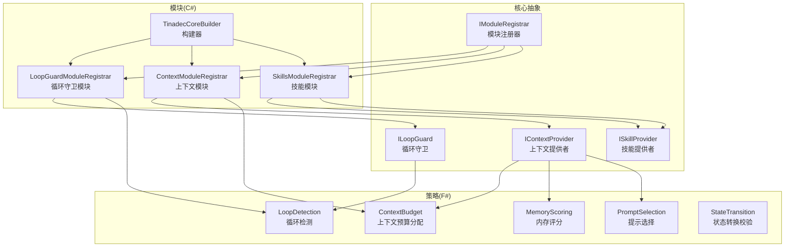
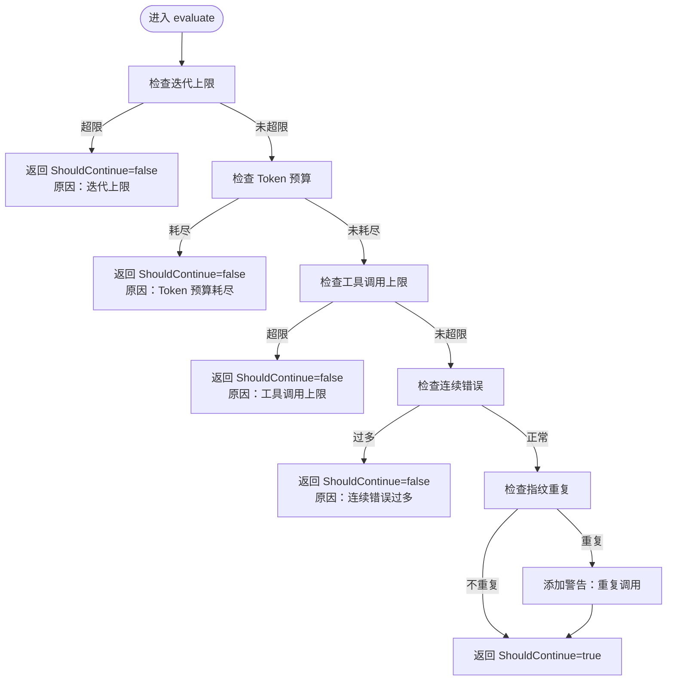
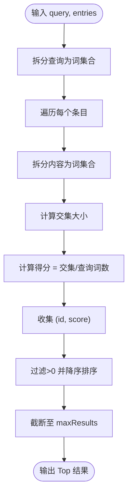
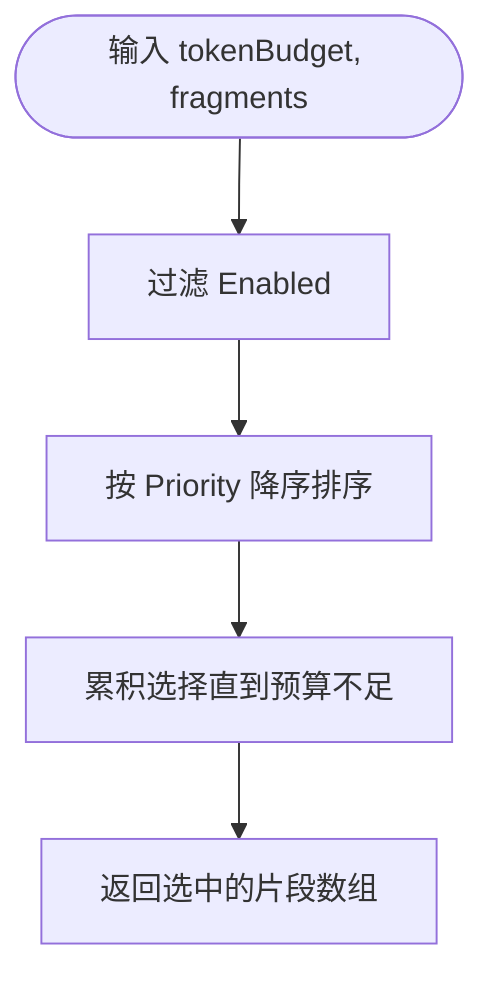
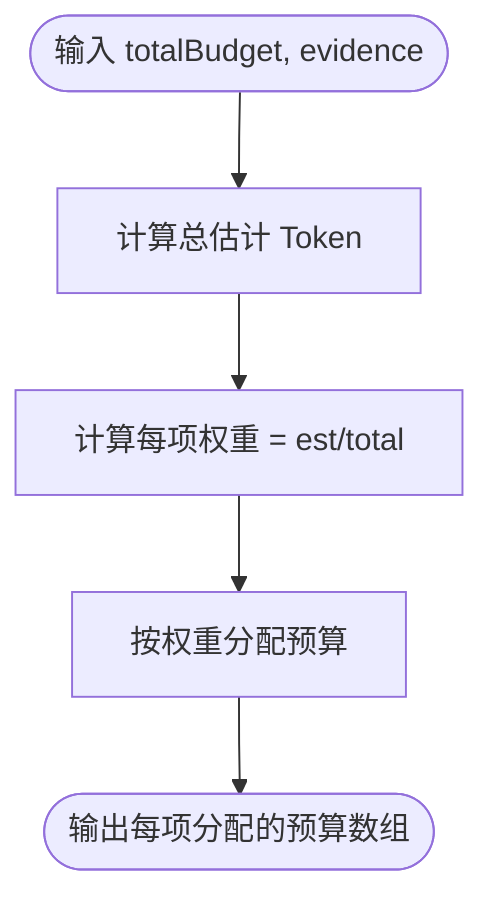
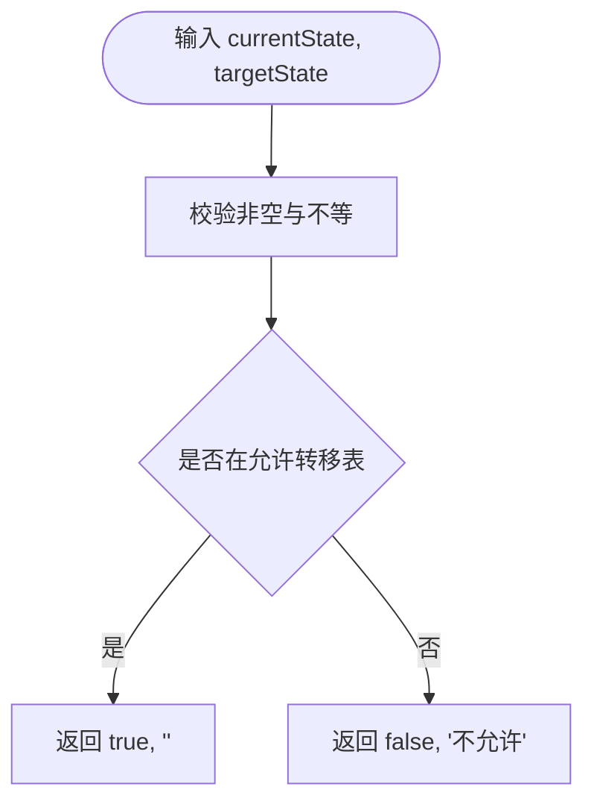
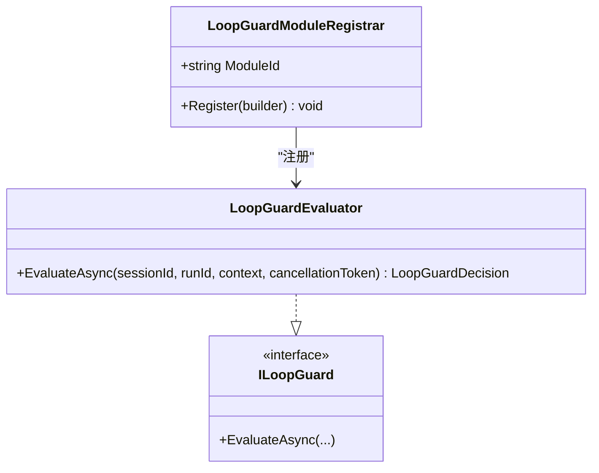
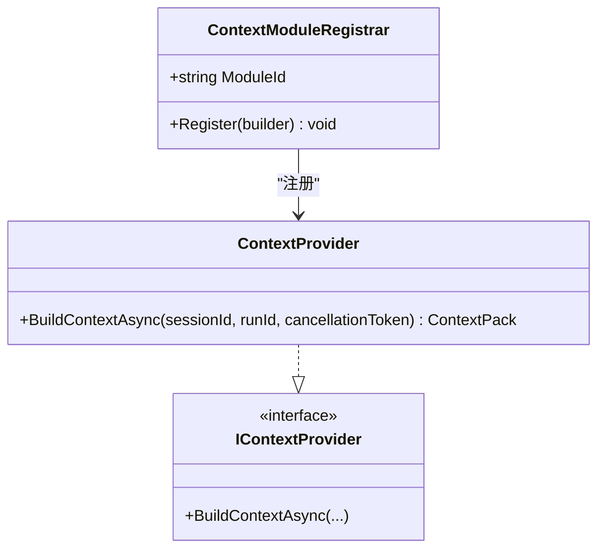
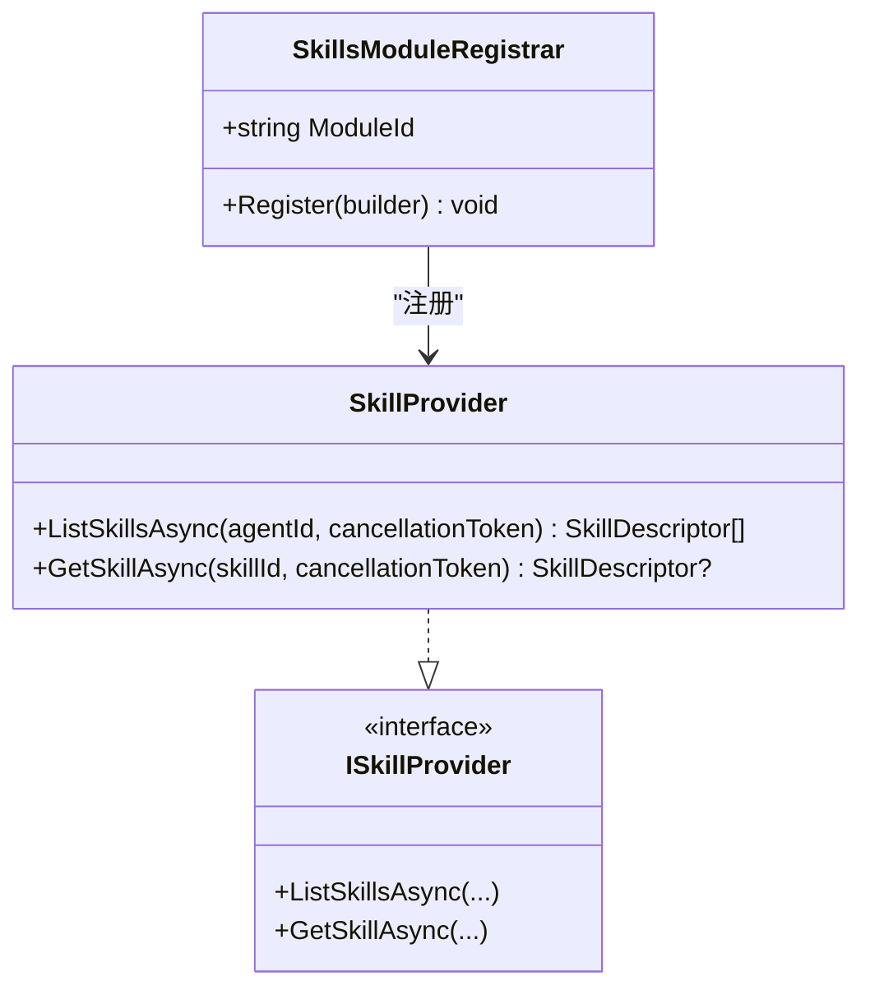
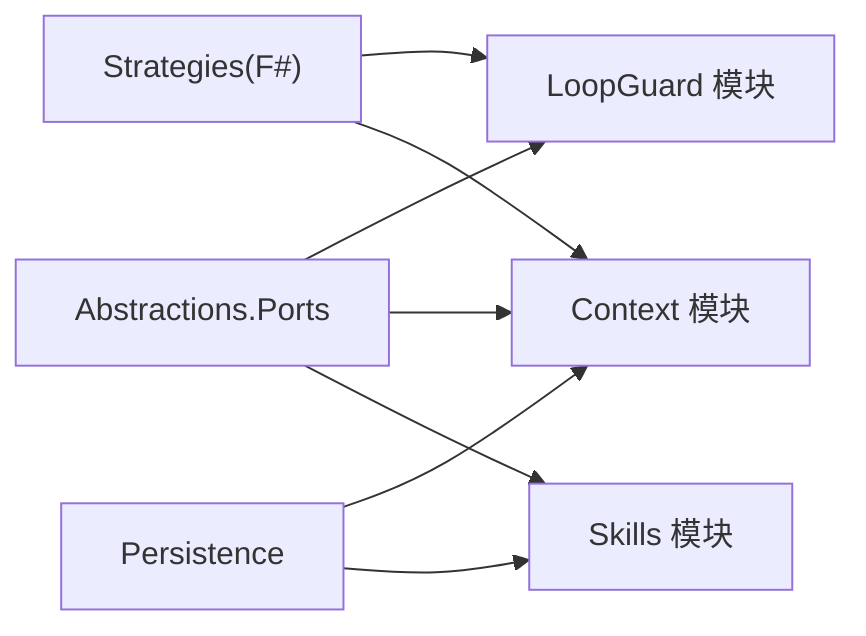

# 扩展开发指南

<cite>
**本文引用的文件**   
- [README.md](file://README.md)
- [LoopDetection.fs](file://TinadecCore/Strategies/LoopDetection.fs)
- [MemoryScoring.fs](file://TinadecCore/Strategies/MemoryScoring.fs)
- [PromptSelection.fs](file://TinadecCore/Strategies/PromptSelection.fs)
- [ContextBudget.fs](file://TinadecCore/Strategies/ContextBudget.fs)
- [StateTransition.fs](file://TinadecCore/Strategies/StateTransition.fs)
- [ILoopGuard.cs](file://TinadecCore/Abstractions/Ports/ILoopGuard.cs)
- [IContextProvider.cs](file://TinadecCore/Abstractions/Ports/IContextProvider.cs)
- [ISkillProvider.cs](file://TinadecCore/Abstractions/Ports/ISkillProvider.cs)
- [LoopGuardModuleRegistrar.cs](file://TinadecCore/LoopGuard/LoopGuardModuleRegistrar.cs)
- [SkillsModuleRegistrar.cs](file://TinadecCore/Skills/SkillsModuleRegistrar.cs)
- [ContextModuleRegistrar.cs](file://TinadecCore/Context/ContextModuleRegistrar.cs)
- [IModuleRegistrar.cs](file://TinadecCore/Abstractions/IModuleRegistrar.cs)
- [TinadecCoreBuilder.cs](file://TinadecCore/Runtime/TinadecCoreBuilder.cs)
</cite>

## 目录
1. [简介](#简介)
2. [项目结构](#项目结构)
3. [核心组件](#核心组件)
4. [架构总览](#架构总览)
5. [详细组件分析](#详细组件分析)
6. [依赖关系分析](#依赖关系分析)
7. [性能考量](#性能考量)
8. [故障排查指南](#故障排查指南)
9. [结论](#结论)
10. [附录：扩展打包、分发与版本管理最佳实践](#附录扩展打包分发与版本管理最佳实践)

## 简介
本指南面向希望在 TinadecOffice 中开发 F# 策略、扩展上下文能力以及集成技能模块的开发者。内容涵盖：
- 策略模式在循环检测、内存评分、提示选择中的应用
- 自定义策略实现示例（从简单业务规则到复杂算法）
- 技能模块开发、上下文提供者扩展与多租户支持思路
- 扩展测试、调试技巧与性能监控方法
- 扩展打包、分发与版本管理的最佳实践

## 项目结构
TinadecCore 采用模块化单体架构，通过显式模块注册器将功能以“模块”形式接入 DI 容器。F# 策略以纯函数形式提供无副作用的计算逻辑，C# 层负责编排、持久化与对外接口。



图表来源
- [IModuleRegistrar.cs:1-17](file://TinadecCore/Abstractions/IModuleRegistrar.cs#L1-L17)
- [ILoopGuard.cs:1-38](file://TinadecCore/Abstractions/Ports/ILoopGuard.cs#L1-L38)
- [IContextProvider.cs:1-37](file://TinadecCore/Abstractions/Ports/IContextProvider.cs#L1-L37)
- [ISkillProvider.cs:1-28](file://TinadecCore/Abstractions/Ports/ISkillProvider.cs#L1-L28)
- [LoopGuardModuleRegistrar.cs:1-83](file://TinadecCore/LoopGuard/LoopGuardModuleRegistrar.cs#L1-L83)
- [ContextModuleRegistrar.cs:1-52](file://TinadecCore/Context/ContextModuleRegistrar.cs#L1-L52)
- [SkillsModuleRegistrar.cs:1-54](file://TinadecCore/Skills/SkillsModuleRegistrar.cs#L1-L54)
- [TinadecCoreBuilder.cs:1-31](file://TinadecCore/Runtime/TinadecCoreBuilder.cs#L1-L31)
- [LoopDetection.fs:1-46](file://TinadecCore/Strategies/LoopDetection.fs#L1-L46)
- [MemoryScoring.fs:1-46](file://TinadecCore/Strategies/MemoryScoring.fs#L1-L46)
- [PromptSelection.fs:1-38](file://TinadecCore/Strategies/PromptSelection.fs#L1-L38)
- [ContextBudget.fs:1-36](file://TinadecCore/Strategies/ContextBudget.fs#L1-L36)
- [StateTransition.fs:1-26](file://TinadecCore/Strategies/StateTransition.fs#L1-L26)

章节来源
- [README.md:1-120](file://README.md#L1-L120)

## 核心组件
- 模块注册器 IModuleRegistrar：每个业务模块实现该接口，显式向 DI 容器注册服务并声明模块描述符（ID、版本、依赖、能力集等）。
- 循环守卫 ILoopGuard：基于 MAF LoopAgent/LoopEvaluator 的迭代限制与预算检查，结合 F# 策略进行重复调用指纹检测、错误计数等。
- 上下文提供者 IContextProvider：产出 ContextPack（会话/运行标识、Token 预算、估计 Token 数、证据列表），不组装最终系统提示。
- 技能提供者 ISkillProvider：通过 MAF AgentSkillsProvider 暴露技能（文件/类/内联/ SKILL.md），脚本执行委托给 Tool 层，写操作经 Core 审批。
- 构建器 TinadecCoreBuilder：收集模块描述符，统一交由 DI 完成服务注册。

章节来源
- [IModuleRegistrar.cs:1-17](file://TinadecCore/Abstractions/IModuleRegistrar.cs#L1-L17)
- [ILoopGuard.cs:1-38](file://TinadecCore/Abstractions/Ports/ILoopGuard.cs#L1-L38)
- [IContextProvider.cs:1-37](file://TinadecCore/Abstractions/Ports/IContextProvider.cs#L1-L37)
- [ISkillProvider.cs:1-28](file://TinadecCore/Abstractions/Ports/ISkillProvider.cs#L1-L28)
- [TinadecCoreBuilder.cs:1-31](file://TinadecCore/Runtime/TinadecCoreBuilder.cs#L1-L31)

## 架构总览
下图展示了扩展点之间的交互：模块注册器将各模块注入 DI；循环守卫使用 F# 策略进行决策；上下文提供者产出带预算的证据包；技能提供者暴露可被调用的技能。

```mermaid
sequenceDiagram
participant App as "应用启动"
participant Builder as "TinadecCoreBuilder"
participant Reg as "IModuleRegistrar"
participant Loop as "ILoopGuard"
participant Ctx as "IContextProvider"
participant Skill as "ISkillProvider"
App->>Builder : 创建构建器
App->>Reg : Register(builder)
Reg-->>Builder : 注册服务与模块描述符
App->>Loop : EvaluateAsync(context)
Loop-->>App : LoopGuardDecision(是否继续/原因/警告)
App->>Ctx : BuildContextAsync(sessionId, runId)
Ctx-->>App : ContextPack(预算/证据/估计Token)
App->>Skill : ListSkillsAsync / GetSkillAsync
Skill-->>App : SkillDescriptor[]
```

图表来源
- [TinadecCoreBuilder.cs:1-31](file://TinadecCore/Runtime/TinadecCoreBuilder.cs#L1-L31)
- [IModuleRegistrar.cs:1-17](file://TinadecCore/Abstractions/IModuleRegistrar.cs#L1-L17)
- [ILoopGuard.cs:1-38](file://TinadecCore/Abstractions/Ports/ILoopGuard.cs#L1-L38)
- [IContextProvider.cs:1-37](file://TinadecCore/Abstractions/Ports/IContextProvider.cs#L1-L37)
- [ISkillProvider.cs:1-28](file://TinadecCore/Abstractions/Ports/ISkillProvider.cs#L1-L28)

## 详细组件分析

### 循环检测策略（LoopDetection）
- 目标：检测工具调用指纹连续重复、迭代上限、Token 预算耗尽、工具调用次数超限、连续错误过多等风险。
- 关键函数：
  - detectRepeatCalls：对最近指纹序列做尾部相同元素计数，达到阈值即判定为重复。
  - isOverIterationLimit：比较当前迭代与最大迭代。
  - isTokenBudgetExhausted：当预算大于 0 且已用达到预算时判定耗尽。
  - isToolCallLimitExceeded：工具调用次数超过上限。
  - hasTooManyConsecutiveErrors：连续错误超过阈值。
- 复杂度：指纹检测 O(k)，k 为尾部相同片段长度；其余均为 O(1)。
- 适用场景：作为 LoopGuard 的核心判断依据，避免死循环与资源耗尽。



图表来源
- [LoopDetection.fs:1-46](file://TinadecCore/Strategies/LoopDetection.fs#L1-L46)
- [LoopGuardModuleRegistrar.cs:1-83](file://TinadecCore/LoopGuard/LoopGuardModuleRegistrar.cs#L1-L83)

章节来源
- [LoopDetection.fs:1-46](file://TinadecCore/Strategies/LoopDetection.fs#L1-L46)
- [ILoopGuard.cs:1-38](file://TinadecCore/Abstractions/Ports/ILoopGuard.cs#L1-L38)
- [LoopGuardModuleRegistrar.cs:1-83](file://TinadecCore/LoopGuard/LoopGuardModuleRegistrar.cs#L1-L83)

### 内存评分策略（MemoryScoring）
- 目标：基于关键词重叠度计算记忆条目相关性得分，并按得分筛选排序。
- 关键函数：
  - scoreEntries：将查询与条目内容分词为集合，计算交集大小与得分比例。
  - topEntries：过滤得分>0，按得分降序取前 N 条。
- 复杂度：scoreEntries 为 O(n·m)，n 为条目数，m 为平均分词量；topEntries 为 O(n log n)。
- 适用场景：上下文证据召回、检索增强生成中的候选排序。



图表来源
- [MemoryScoring.fs:1-46](file://TinadecCore/Strategies/MemoryScoring.fs#L1-L46)

章节来源
- [MemoryScoring.fs:1-46](file://TinadecCore/Strategies/MemoryScoring.fs#L1-L46)

### 提示选择策略（PromptSelection）
- 目标：在 Token 预算约束下，按优先级从高到低选择启用的提示片段。
- 关键函数：
  - selectFragments：过滤 Enabled，按 Priority 降序，贪心累加不超过剩余预算。
- 复杂度：O(n log n) 排序 + O(n) 扫描。
- 适用场景：系统提示拼装前的片段裁剪，确保不超预算。



图表来源
- [PromptSelection.fs:1-38](file://TinadecCore/Strategies/PromptSelection.fs#L1-L38)

章节来源
- [PromptSelection.fs:1-38](file://TinadecCore/Strategies/PromptSelection.fs#L1-L38)

### 上下文预算策略（ContextBudget）
- 目标：按比例分配 Token 预算给各证据项，并提供利用率与超预算判断。
- 关键函数：
  - allocateBudget：按 EstimatedTokens 权重分配预算。
  - isOverBudget：估计总量是否超过预算。
  - utilizationRatio：计算已用/预算比率。
- 复杂度：O(n)。
- 适用场景：上下文证据聚合时的预算控制与监控。



图表来源
- [ContextBudget.fs:1-36](file://TinadecCore/Strategies/ContextBudget.fs#L1-L36)

章节来源
- [ContextBudget.fs:1-36](file://TinadecCore/Strategies/ContextBudget.fs#L1-L36)

### 状态转换策略（StateTransition）
- 目标：校验状态迁移是否合法，返回合法性与原因。
- 关键函数：
  - validateTransition：匹配允许的状态转移表，否则拒绝。
- 复杂度：O(1) 匹配。
- 适用场景：任务/会话生命周期状态机校验。



图表来源
- [StateTransition.fs:1-26](file://TinadecCore/Strategies/StateTransition.fs#L1-L26)

章节来源
- [StateTransition.fs:1-26](file://TinadecCore/Strategies/StateTransition.fs#L1-L26)

### 循环守卫模块（LoopGuardModuleRegistrar）
- 职责：注册 ILoopGuard 实现，声明模块能力（循环检测、迭代限制、预算检查、重复检测）。
- 行为：EvaluateAsync 依次调用 F# 策略进行各项检查，必要时返回停止决策或警告。



图表来源
- [LoopGuardModuleRegistrar.cs:1-83](file://TinadecCore/LoopGuard/LoopGuardModuleRegistrar.cs#L1-L83)
- [ILoopGuard.cs:1-38](file://TinadecCore/Abstractions/Ports/ILoopGuard.cs#L1-L38)

章节来源
- [LoopGuardModuleRegistrar.cs:1-83](file://TinadecCore/LoopGuard/LoopGuardModuleRegistrar.cs#L1-L83)

### 上下文模块（ContextModuleRegistrar）
- 职责：注册 IContextProvider 实现，声明能力（上下文包、证据收集、Token 预算）。
- 行为：BuildContextAsync 返回包含会话/运行标识、Token 预算、估计 Token 与证据的 ContextPack。



图表来源
- [ContextModuleRegistrar.cs:1-52](file://TinadecCore/Context/ContextModuleRegistrar.cs#L1-L52)
- [IContextProvider.cs:1-37](file://TinadecCore/Abstractions/Ports/IContextProvider.cs#L1-L37)

章节来源
- [ContextModuleRegistrar.cs:1-52](file://TinadecCore/Context/ContextModuleRegistrar.cs#L1-L52)

### 技能模块（SkillsModuleRegistrar）
- 职责：注册 ISkillProvider 实现，声明能力（文件/类/内联/ SKILL.md、MCP/ACP 集成等）。
- 行为：ListSkillsAsync/GetSkillAsync 返回技能描述，脚本执行委托 Tool 层，写操作需审批。



图表来源
- [SkillsModuleRegistrar.cs:1-54](file://TinadecCore/Skills/SkillsModuleRegistrar.cs#L1-L54)
- [ISkillProvider.cs:1-28](file://TinadecCore/Abstractions/Ports/ISkillProvider.cs#L1-L28)

章节来源
- [SkillsModuleRegistrar.cs:1-54](file://TinadecCore/Skills/SkillsModuleRegistrar.cs#L1-L54)

## 依赖关系分析
- 模块间耦合：所有模块通过 IModuleRegistrar 显式注册，降低隐式依赖；模块描述符声明依赖与能力，便于运行时装配与自检。
- 策略与编排：F# 策略无副作用，C# 编排层负责组合与边界处理，形成清晰的分层。
- 外部集成：技能模块依赖 MAF AgentSkillsProvider；循环守卫依赖 MAF LoopAgent/LoopEvaluator。



图表来源
- [IModuleRegistrar.cs:1-17](file://TinadecCore/Abstractions/IModuleRegistrar.cs#L1-L17)
- [LoopGuardModuleRegistrar.cs:1-83](file://TinadecCore/LoopGuard/LoopGuardModuleRegistrar.cs#L1-L83)
- [ContextModuleRegistrar.cs:1-52](file://TinadecCore/Context/ContextModuleRegistrar.cs#L1-L52)
- [SkillsModuleRegistrar.cs:1-54](file://TinadecCore/Skills/SkillsModuleRegistrar.cs#L1-L54)

章节来源
- [IModuleRegistrar.cs:1-17](file://TinadecCore/Abstractions/IModuleRegistrar.cs#L1-L17)

## 性能考量
- 策略复杂度：
  - 循环检测：指纹尾部扫描 O(k)，建议限制 k 的大小以避免长尾影响。
  - 内存评分：分词与集合交集 O(n·m)，可通过缓存分词结果与批量处理优化。
  - 提示选择：排序 O(n log n)，优先过滤再排序可减少开销。
  - 上下文预算：线性分配 O(n)，适合大批量证据。
- 并发与异步：C# 层使用 Task/异步接口，注意 CancellationToken 传播与超时控制。
- 内存与 GC：避免频繁字符串分割，尽量复用集合与缓冲；对高频路径引入对象池。
- 监控指标：Token 使用率、工具调用次数、连续错误率、重复调用频率、TopN 命中率。

[本节为通用指导，不直接分析具体文件]

## 故障排查指南
- 循环守卫触发停止：
  - 检查迭代上限、Token 预算、工具调用上限、连续错误阈值配置。
  - 查看警告信息（如重复调用指纹），调整策略参数或上游输入。
- 上下文为空或预算不足：
  - 确认证据收集逻辑是否正确填充 Evidence 与 EstimatedTokens。
  - 检查预算分配与利用率计算是否符合预期。
- 技能不可见或无法执行：
  - 确认技能描述符格式与来源（文件/类/内联/ SKILL.md）。
  - 检查 Tool 层权限与审批流程是否放行写操作。
- 模块未生效：
  - 核对 IModuleRegistrar.Register 是否被调用，模块描述符依赖是否满足。
  - 检查 DI 容器中服务是否成功注册。

章节来源
- [LoopGuardModuleRegistrar.cs:1-83](file://TinadecCore/LoopGuard/LoopGuardModuleRegistrar.cs#L1-L83)
- [ContextModuleRegistrar.cs:1-52](file://TinadecCore/Context/ContextModuleRegistrar.cs#L1-L52)
- [SkillsModuleRegistrar.cs:1-54](file://TinadecCore/Skills/SkillsModuleRegistrar.cs#L1-L54)

## 结论
TinadecOffice 通过“C# 编排 + F# 纯策略”的架构实现了高内聚、低耦合的可扩展系统。开发者可在不侵入核心逻辑的前提下，通过策略与模块注册机制快速扩展循环检测、内存评分、提示选择、上下文预算与技能集成能力。配合完善的测试与监控，可实现稳定可靠的智能体工作空间。

[本节为总结性内容，不直接分析具体文件]

## 附录：扩展打包、分发与版本管理最佳实践
- 模块打包：
  - 每个模块独立 .csproj/.fsproj，明确依赖与能力声明，便于按需加载。
  - 使用 ModuleDescriptor 记录版本号与能力集，供运行时自检与兼容性检查。
- 分发方式：
  - 将模块编译为独立程序集，通过插件目录或 NuGet 包分发。
  - 技能模块可按 SKILL.md 规范组织，支持文件/类/内联三种形式。
- 版本管理：
  - 语义化版本（主.次.修订），重大变更升级主版本，新增能力升级次版本。
  - 在模块描述符中维护版本，并在启动时校验依赖版本范围。
- 兼容性与回滚：
  - 能力集声明用于运行时能力探测，避免强依赖导致的不兼容。
  - 支持热插拔与灰度发布，逐步替换旧版本模块。
- 安全与审批：
  - 技能脚本执行走 Tool 层，写操作必须经过审批门，防止恶意代码执行。
  - 对敏感能力（文件系统、命令执行、网络访问）进行白名单控制。

[本节为通用指导，不直接分析具体文件]