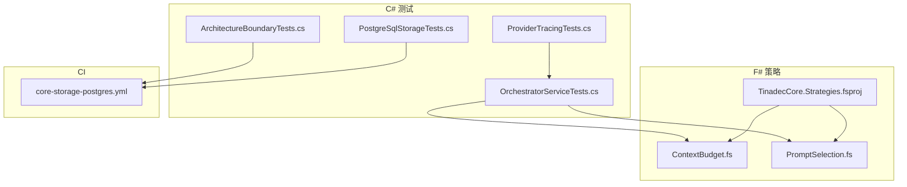
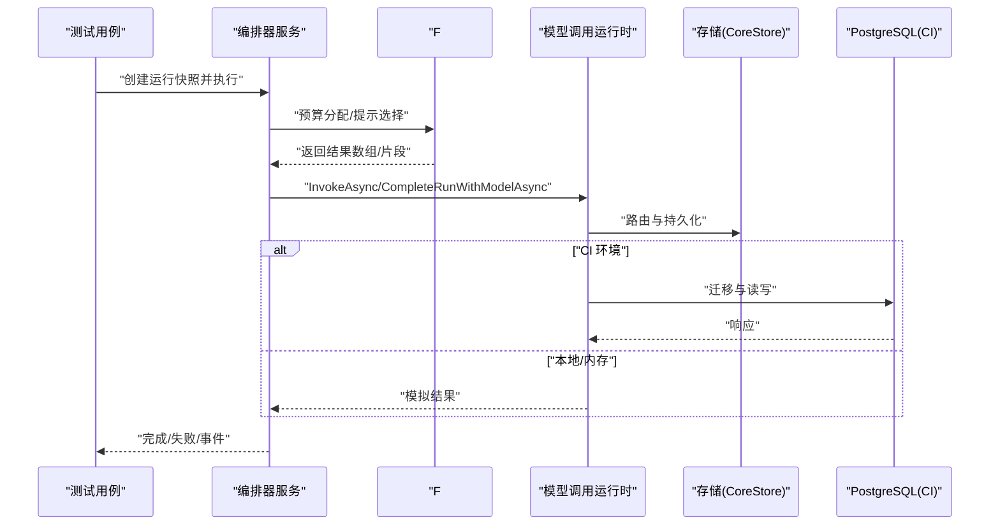
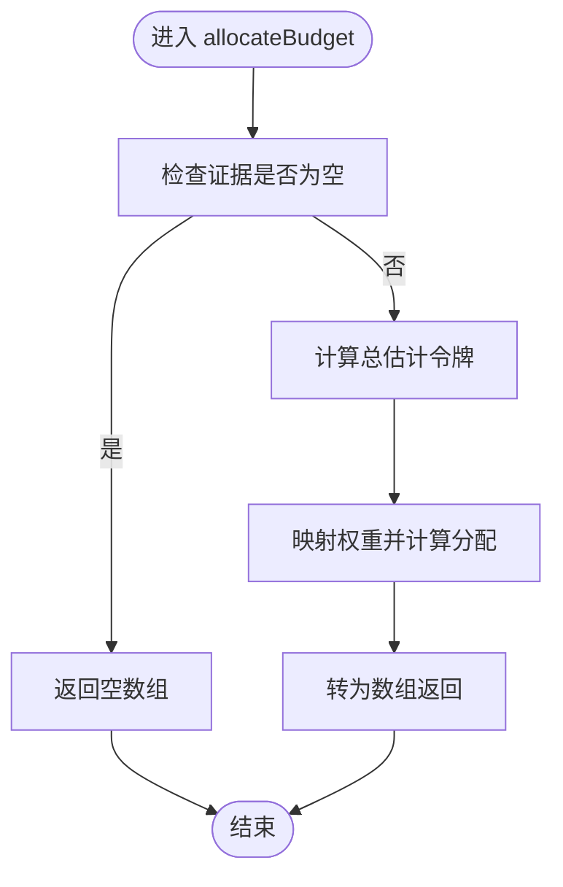
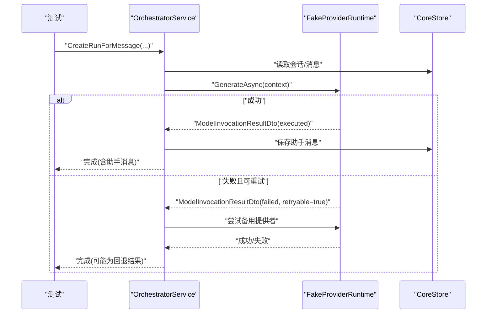
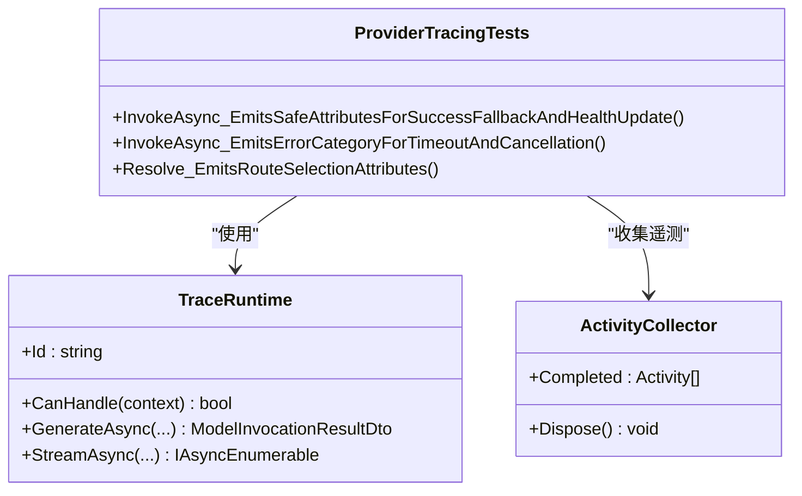
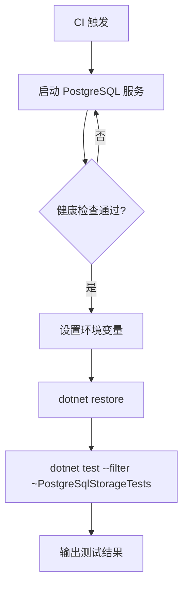
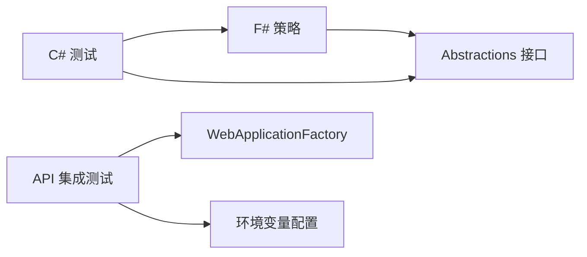

# 扩展测试与调试

<cite>
**本文引用的文件**   
- [TinadecCore.Strategies.fsproj](file://TinadecCore/Strategies/TinadecCore.Strategies.fsproj)
- [ContextBudget.fs](file://TinadecCore/Strategies/ContextBudget.fs)
- [PromptSelection.fs](file://TinadecCore/Strategies/PromptSelection.fs)
- [OrchestratorServiceTests.cs](file://tests/TinadecCore.Tests/OrchestratorServiceTests.cs)
- [ProviderTracingTests.cs](file://tests/TinadecCore.Tests/ProviderTracingTests.cs)
- [PostgreSqlStorageTests.cs](file://TinadecCore/tests/TinadecCore.Api.Tests/PostgreSqlStorageTests.cs)
- [core-storage-postgres.yml](file://.github/workflows/core-storage-postgres.yml)
- [ArchitectureBoundaryTests.cs](file://tests/TinadecCore.Tests/ArchitectureBoundaryTests.cs)
</cite>

## 目录
1. [简介](#简介)
2. [项目结构](#项目结构)
3. [核心组件](#核心组件)
4. [架构总览](#架构总览)
5. [详细组件分析](#详细组件分析)
6. [依赖关系分析](#依赖关系分析)
7. [性能考量](#性能考量)
8. [故障排查指南](#故障排查指南)
9. [结论](#结论)
10. [附录](#附录)

## 简介
本指南面向扩展与调试，聚焦以下目标：
- F# 策略的单元测试方法：纯函数测试、模拟数据构造、边界条件覆盖。
- C# 扩展组件的集成测试：依赖注入容器配置、数据库上下文模拟与服务隔离。
- 异步操作测试、异常场景处理与性能基准测试实践。
- 调试技巧：日志记录、断点调试、性能分析工具使用。
- 端到端测试策略与持续集成配置（GitHub Actions）。

## 项目结构
仓库包含多个子系统：F# 策略内核、C# 核心运行时与 API、工具集、前端桌面/Web 应用以及跨语言网关。测试分布在多处：
- F# 策略位于 TinadecCore/Strategies，提供纯函数式算法模块。
- C# 测试位于 tests/TinadecCore.Tests 与 TinadecCore/tests/TinadecCore.Api.Tests。
- GitHub Actions 工作流用于 PostgreSQL 存储集成测试。

**图表来源**
- [TinadecCore.Strategies.fsproj:1-27](file://TinadecCore/Strategies/TinadecCore.Strategies.fsproj#L1-L27)
- [ContextBudget.fs:1-36](file://TinadecCore/Strategies/ContextBudget.fs#L1-L36)
- [PromptSelection.fs:1-38](file://TinadecCore/Strategies/PromptSelection.fs#L1-L38)
- [OrchestratorServiceTests.cs:1-324](file://tests/TinadecCore.Tests/OrchestratorServiceTests.cs#L1-L324)
- [ProviderTracingTests.cs:1-289](file://tests/TinadecCore.Tests/ProviderTracingTests.cs#L1-L289)
- [PostgreSqlStorageTests.cs:1-73](file://TinadecCore/tests/TinadecCore.Api.Tests/PostgreSqlStorageTests.cs#L1-L73)
- [core-storage-postgres.yml:1-40](file://.github/workflows/core-storage-postgres.yml#L1-L40)

**章节来源**
- [TinadecCore.Strategies.fsproj:1-27](file://TinadecCore/Strategies/TinadecCore.Strategies.fsproj#L1-L27)
- [OrchestratorServiceTests.cs:1-324](file://tests/TinadecCore.Tests/OrchestratorServiceTests.cs#L1-L324)
- [ProviderTracingTests.cs:1-289](file://tests/TinadecCore.Tests/ProviderTracingTests.cs#L1-L289)
- [PostgreSqlStorageTests.cs:1-73](file://TinadecCore/tests/TinadecCore.Api.Tests/PostgreSqlStorageTests.cs#L1-L73)
- [core-storage-postgres.yml:1-40](file://.github/workflows/core-storage-postgres.yml#L1-L40)

## 核心组件
- F# 策略模块
  - ContextBudget：预算分配、超预算判断、利用率计算，均为纯函数。
  - PromptSelection：按优先级和令牌预算选择提示片段，纯函数。
- C# 测试套件
  - OrchestratorServiceTests：编排器服务测试，涵盖成功、回退、失败与安全事件。
  - ProviderTracingTests：提供者追踪与遥测，验证安全属性与错误分类。
  - PostgreSqlStorageTests：基于 WebApplicationFactory 的 API 集成测试，驱动真实 PostgreSQL。
  - ArchitectureBoundaryTests：架构边界约束检查。

**章节来源**
- [ContextBudget.fs:1-36](file://TinadecCore/Strategies/ContextBudget.fs#L1-L36)
- [PromptSelection.fs:1-38](file://TinadecCore/Strategies/PromptSelection.fs#L1-L38)
- [OrchestratorServiceTests.cs:1-324](file://tests/TinadecCore.Tests/OrchestratorServiceTests.cs#L1-L324)
- [ProviderTracingTests.cs:1-289](file://tests/TinadecCore.Tests/ProviderTracingTests.cs#L1-L289)
- [PostgreSqlStorageTests.cs:1-73](file://TinadecCore/tests/TinadecCore.Api.Tests/PostgreSqlStorageTests.cs#L1-L73)
- [ArchitectureBoundaryTests.cs:1-43](file://tests/TinadecCore.Tests/ArchitectureBoundaryTests.cs#L1-L43)

## 架构总览
下图展示从测试到策略与运行时的调用链，以及 CI 中的数据库集成路径。

**图表来源**
- [OrchestratorServiceTests.cs:1-324](file://tests/TinadecCore.Tests/OrchestratorServiceTests.cs#L1-L324)
- [ProviderTracingTests.cs:1-289](file://tests/TinadecCore.Tests/ProviderTracingTests.cs#L1-L289)
- [PostgreSqlStorageTests.cs:1-73](file://TinadecCore/tests/TinadecCore.Api.Tests/PostgreSqlStorageTests.cs#L1-L73)
- [core-storage-postgres.yml:1-40](file://.github/workflows/core-storage-postgres.yml#L1-L40)

## 详细组件分析

### F# 策略单元测试策略
- 纯函数测试要点
  - 输入为空或零值：验证空数组返回与比率上限。
  - 预算不足：验证未选择任何片段或仅选择高优先级项。
  - 等权与不等权证据：验证按比例分配与四舍五入一致性。
- 模拟数据构造
  - 构造证据列表与提示片段集合，控制 EstimatedTokens、Priority、Enabled 字段。
- 边界条件
  - totalBudget=0、estimatedTokens=0、evidence.Count=0、全部禁用片段等。

**图表来源**
- [ContextBudget.fs:1-36](file://TinadecCore/Strategies/ContextBudget.fs#L1-L36)

**章节来源**
- [ContextBudget.fs:1-36](file://TinadecCore/Strategies/ContextBudget.fs#L1-L36)
- [PromptSelection.fs:1-38](file://TinadecCore/Strategies/PromptSelection.fs#L1-L38)

### C# 编排器服务集成测试
- 依赖注入与模拟
  - 通过自定义 FakeProviderRuntime 与 NullCredentialResolver 隔离外部依赖。
  - CoreStore 使用临时 SQLite 文件，避免共享状态。
- 关键场景
  - 成功调用主提供者并保存助手消息。
  - 可重试失败时自动回退至备用提供者。
  - 失败调用记录安全事件，不泄露敏感信息。
  - 所有重试失败时报告最终错误类别。

**图表来源**
- [OrchestratorServiceTests.cs:1-324](file://tests/TinadecCore.Tests/OrchestratorServiceTests.cs#L1-L324)

**章节来源**
- [OrchestratorServiceTests.cs:1-324](file://tests/TinadecCore.Tests/OrchestratorServiceTests.cs#L1-L324)

### 提供者追踪与遥测测试
- 活动收集器
  - 使用 ActivityListener 捕获自定义 ActivitySource 的事件。
- 断言要点
  - 成功回退与健康更新事件存在。
  - 错误分类（Timeout、Cancelled）正确上报。
  - 标签与事件中不包含敏感数据（如密钥、原始提示）。

**图表来源**
- [ProviderTracingTests.cs:1-289](file://tests/TinadecCore.Tests/ProviderTracingTests.cs#L1-L289)

**章节来源**
- [ProviderTracingTests.cs:1-289](file://tests/TinadecCore.Tests/ProviderTracingTests.cs#L1-L289)

### PostgreSQL 存储集成测试与 CI
- 测试工厂
  - 使用 WebApplicationFactory 启动最小化 Web 应用，注入配置。
  - 通过环境变量启用 PostgreSQL 测试并设置连接字符串。
- CI 流程
  - 在 Ubuntu 上启动 PostgreSQL 服务，等待健康检查。
  - 运行特定过滤器筛选 PostgreSQL 相关测试。

**图表来源**
- [PostgreSqlStorageTests.cs:1-73](file://TinadecCore/tests/TinadecCore.Api.Tests/PostgreSqlStorageTests.cs#L1-L73)
- [core-storage-postgres.yml:1-40](file://.github/workflows/core-storage-postgres.yml#L1-L40)

**章节来源**
- [PostgreSqlStorageTests.cs:1-73](file://TinadecCore/tests/TinadecCore.Api.Tests/PostgreSqlStorageTests.cs#L1-L73)
- [core-storage-postgres.yml:1-40](file://.github/workflows/core-storage-postgres.yml#L1-L40)

### 架构边界测试
- 约束检查
  - 确保核心运行时仅包含必要的 SDK 引用与项目引用。
  - 文档中不应描述旧版运行时作为独立层。

**章节来源**
- [ArchitectureBoundaryTests.cs:1-43](file://tests/TinadecCore.Tests/ArchitectureBoundaryTests.cs#L1-L43)

## 依赖关系分析
- F# 策略依赖 Abstractions 接口，保持无副作用与可测试性。
- C# 测试通过 Mock/Stub 隔离外部依赖（模型提供者、凭据解析、工具注册表）。
- 集成测试通过 WebApplicationFactory 与环境变量切换数据库后端。

**图表来源**
- [TinadecCore.Strategies.fsproj:1-27](file://TinadecCore/Strategies/TinadecCore.Strategies.fsproj#L1-L27)
- [PostgreSqlStorageTests.cs:1-73](file://TinadecCore/tests/TinadecCore.Api.Tests/PostgreSqlStorageTests.cs#L1-L73)

**章节来源**
- [TinadecCore.Strategies.fsproj:1-27](file://TinadecCore/Strategies/TinadecCore.Strategies.fsproj#L1-L27)
- [PostgreSqlStorageTests.cs:1-73](file://TinadecCore/tests/TinadecCore.Api.Tests/PostgreSqlStorageTests.cs#L1-L73)

## 性能考量
- 纯函数策略
  - 预算分配与片段选择的时间复杂度与输入规模线性相关；注意大数据集下的内存占用。
- 异步与回退
  - 重试与回退会增加延迟；建议在测试中限制最大重试次数与超时时间。
- 数据库集成
  - 使用内存 SQLite 进行快速单元/集成测试；仅在 CI 中使用真实 PostgreSQL。
- 遥测开销
  - 活动监听与事件记录应采样控制，避免生产环境过度开销。

[本节为通用指导，无需具体文件引用]

## 故障排查指南
- 常见问题定位
  - 提供者不可用：检查 CanHandle 匹配与 Driver 标识。
  - 回退未生效：确认错误类别标记为可重试，且备用提供者已注册。
  - 敏感数据泄露：断言标签与事件中不包含密钥与原始提示。
- 调试技巧
  - 日志级别：在集成测试中将默认日志设为 Warning，减少噪音。
  - 断点调试：在编排器与提供者运行时处设置断点，观察上下文与结果。
  - 性能分析：使用 .NET Profiler 采集 CPU/内存，关注 AllocateBudget 与 SelectFragments 热点。
- 端到端验证
  - 通过 API 端点创建项目、会话与消息，验证持久化与查询。

**章节来源**
- [OrchestratorServiceTests.cs:1-324](file://tests/TinadecCore.Tests/OrchestratorServiceTests.cs#L1-L324)
- [ProviderTracingTests.cs:1-289](file://tests/TinadecCore.Tests/ProviderTracingTests.cs#L1-L289)
- [PostgreSqlStorageTests.cs:1-73](file://TinadecCore/tests/TinadecCore.Api.Tests/PostgreSqlStorageTests.cs#L1-L73)

## 结论
本指南总结了 F# 纯函数策略的测试方法与 C# 扩展组件的集成测试实践，涵盖异步、异常、遥测与数据库集成。结合 CI 工作流，可实现可靠的端到端验证与持续交付。建议在生产环境中严格控制遥测采样与日志级别，确保性能与安全性。

[本节为总结，无需具体文件引用]

## 附录
- 测试命令参考
  - 运行 PostgreSQL 集成测试：dotnet test --filter FullyQualifiedName~PostgreSqlStorageTests
  - 运行编排器与追踪测试：dotnet test --filter FullyQualifiedName~OrchestratorServiceTests|FullyQualifiedName~ProviderTracingTests
- 环境变量
  - TINADEC_TEST_POSTGRES=1
  - TINADEC_TEST_POSTGRES_CONNECTION=...

[本节为补充信息，无需具体文件引用]