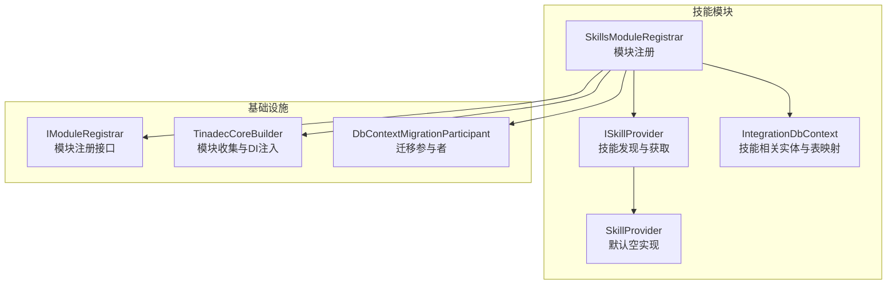
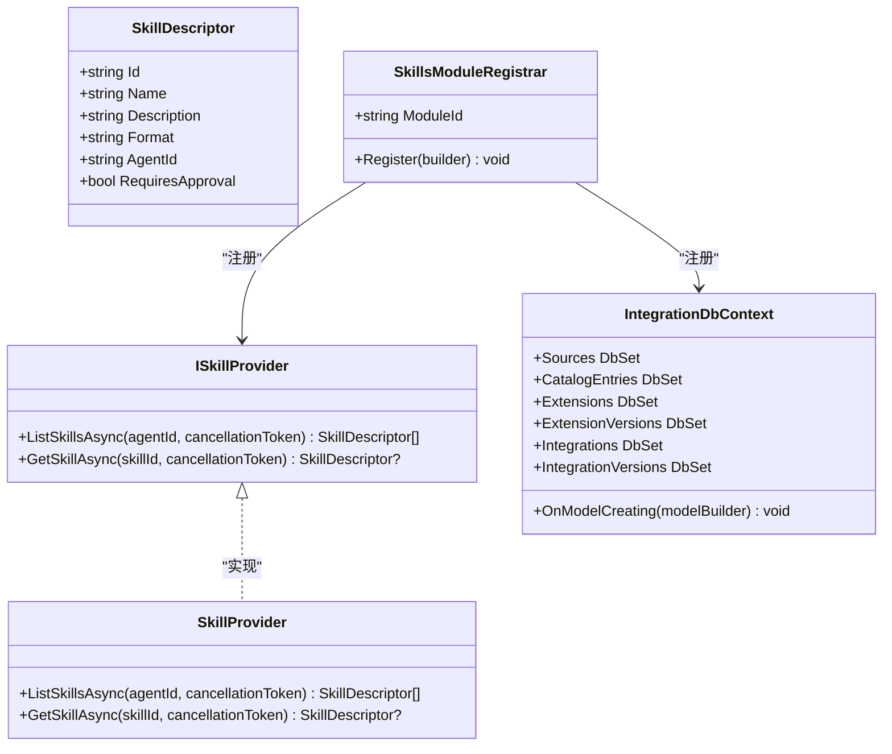
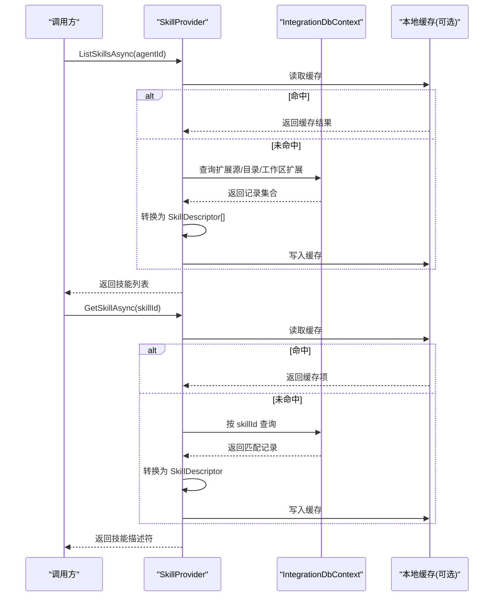
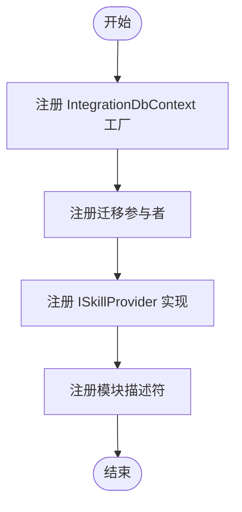
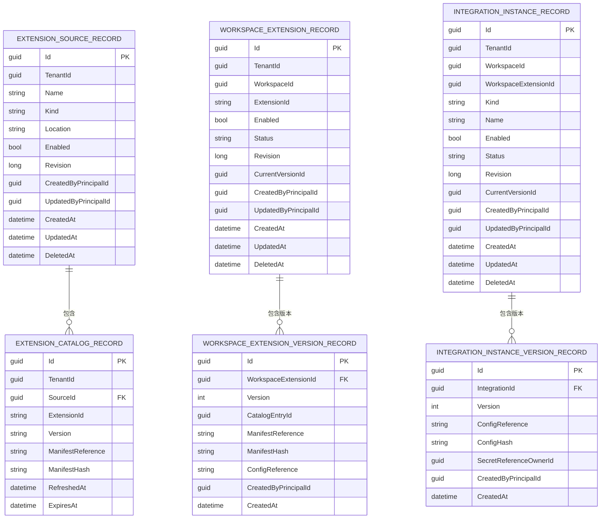
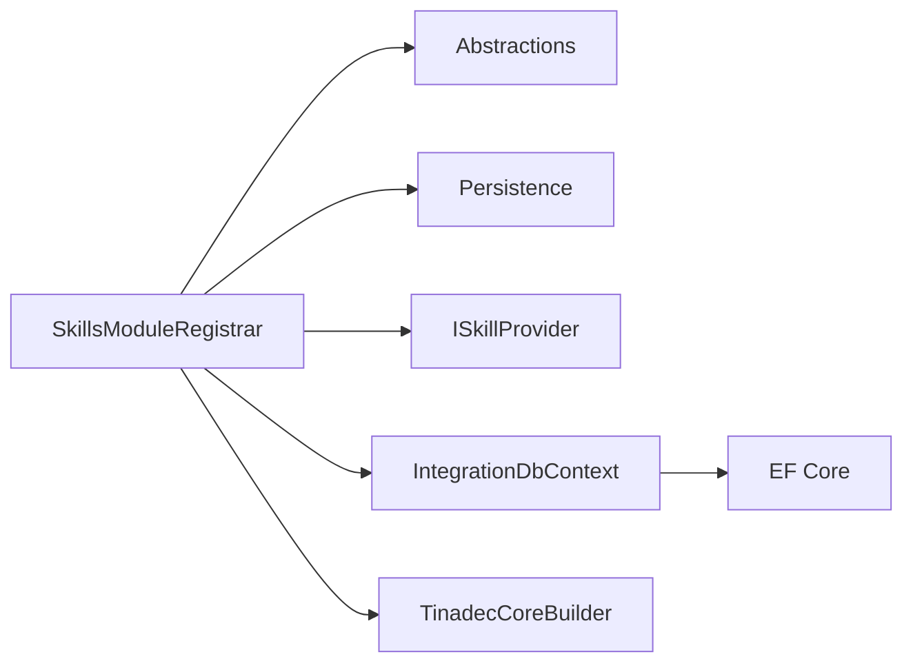

# 技能模块开发

<cite>
**本文引用的文件**   
- [ISkillProvider.cs](file://TinadecCore/Abstractions/Ports/ISkillProvider.cs)
- [SkillsModuleRegistrar.cs](file://TinadecCore/Skills/SkillsModuleRegistrar.cs)
- [IntegrationDbContext.cs](file://TinadecCore/Skills/IntegrationDbContext.cs)
- [IModuleRegistrar.cs](file://TinadecCore/Abstractions/IModuleRegistrar.cs)
- [DbContextMigrationParticipant.cs](file://TinadecCore/Persistence/DbContextMigrationParticipant.cs)
- [TinadecCoreBuilder.cs](file://TinadecCore/Runtime/TinadecCoreBuilder.cs)
</cite>

## 目录
1. [简介](#简介)
2. [项目结构](#项目结构)
3. [核心组件](#核心组件)
4. [架构总览](#架构总览)
5. [详细组件分析](#详细组件分析)
6. [依赖关系分析](#依赖关系分析)
7. [性能考量](#性能考量)
8. [故障排查指南](#故障排查指南)
9. [结论](#结论)
10. [附录](#附录)

## 简介
本文件面向希望基于现有框架扩展“技能模块”的开发者，系统阐述 ISkillProvider 接口的设计与实现模式、SkillsModuleRegistrar 的模块注册流程与依赖管理、IntegrationDbContext 的技能数据存储与查询方式，并给出自定义技能模块的开发指南（技能定义、参数处理、错误处理、结果格式化）、生命周期管理、缓存策略、并发访问控制、测试方法与调试技巧。文档以仓库中实际代码为依据，提供可追溯的来源标注与可视化图示，帮助读者快速上手并安全扩展。

## 项目结构
技能模块位于 TinadecCore 的 Skills 子模块，围绕以下关键文件组织：
- 抽象端口：ISkillProvider 定义了技能的发现与获取能力。
- 模块注册器：SkillsModuleRegistrar 负责将技能服务注入 DI 容器，声明模块元数据与依赖。
- 数据层：IntegrationDbContext 提供扩展源、目录、工作区扩展、集成实例及其版本的持久化模型与映射。
- 基础设施：IModuleRegistrar、TinadecCoreBuilder、DbContextMigrationParticipant 等支撑模块注册与数据库迁移。

图表来源 
- [ISkillProvider.cs:1-28](file://TinadecCore/Abstractions/Ports/ISkillProvider.cs#L1-L28)
- [SkillsModuleRegistrar.cs:1-54](file://TinadecCore/Skills/SkillsModuleRegistrar.cs#L1-L54)
- [IntegrationDbContext.cs:1-33](file://TinadecCore/Skills/IntegrationDbContext.cs#L1-L33)
- [IModuleRegistrar.cs:1-17](file://TinadecCore/Abstractions/IModuleRegistrar.cs#L1-L17)
- [DbContextMigrationParticipant.cs:1-37](file://TinadecCore/Persistence/DbContextMigrationParticipant.cs#L1-L37)
- [TinadecCoreBuilder.cs:1-31](file://TinadecCore/Runtime/TinadecCoreBuilder.cs#L1-L31)

章节来源
- [ISkillProvider.cs:1-28](file://TinadecCore/Abstractions/Ports/ISkillProvider.cs#L1-L28)
- [SkillsModuleRegistrar.cs:1-54](file://TinadecCore/Skills/SkillsModuleRegistrar.cs#L1-L54)
- [IntegrationDbContext.cs:1-33](file://TinadecCore/Skills/IntegrationDbContext.cs#L1-L33)
- [IModuleRegistrar.cs:1-17](file://TinadecCore/Abstractions/IModuleRegistrar.cs#L1-L17)
- [DbContextMigrationParticipant.cs:1-37](file://TinadecCore/Persistence/DbContextMigrationParticipant.cs#L1-L37)
- [TinadecCoreBuilder.cs:1-31](file://TinadecCore/Runtime/TinadecCoreBuilder.cs#L1-L31)

## 核心组件
- ISkillProvider 与 SkillDescriptor
  - 职责：对外暴露技能列表与按 ID 获取技能的能力；描述符包含 Id、Name、Description、Format、AgentId、RequiresApproval 等字段。
  - 设计要点：异步方法、支持可选 agentId 过滤、返回数组或单个项。
- SkillsModuleRegistrar
  - 职责：注册 IntegrationDbContext、迁移参与者、ISkillProvider 的具体实现，并声明模块元数据（模块ID、版本、依赖、能力集、语言、MAF 原语）。
  - 设计要点：显式注册、无反射扫描；通过 builder.Services 注入 EF Core DbContextFactory 与单例服务。
- IntegrationDbContext
  - 职责：维护扩展源、目录条目、工作区扩展、扩展版本、集成实例及版本等记录；提供 OnModelCreating 中的表名、主键、唯一索引与命名约定配置。
  - 设计要点：使用蛇形命名约定；为多租户与工作区维度建立唯一约束，便于隔离与幂等写入。

章节来源
- [ISkillProvider.cs:1-28](file://TinadecCore/Abstractions/Ports/ISkillProvider.cs#L1-L28)
- [SkillsModuleRegistrar.cs:1-54](file://TinadecCore/Skills/SkillsModuleRegistrar.cs#L1-L54)
- [IntegrationDbContext.cs:1-33](file://TinadecCore/Skills/IntegrationDbContext.cs#L1-L33)

## 架构总览
技能模块采用“接口 + 具体提供者 + 模块注册器 + EF Core 上下文”的分层模式：
- 接口层：ISkillProvider 定义统一契约。
- 实现层：SkillProvider 当前为空骨架，后续可扩展为文件/类/内联技能与 SKILL.md 解析。
- 注册层：SkillsModuleRegistrar 将服务与上下文注入 DI，声明模块能力与依赖。
- 数据层：IntegrationDbContext 管理技能相关的扩展与集成实例数据。

图表来源 
- [ISkillProvider.cs:1-28](file://TinadecCore/Abstractions/Ports/ISkillProvider.cs#L1-L28)
- [SkillsModuleRegistrar.cs:1-54](file://TinadecCore/Skills/SkillsModuleRegistrar.cs#L1-L54)
- [IntegrationDbContext.cs:1-33](file://TinadecCore/Skills/IntegrationDbContext.cs#L1-L33)

## 详细组件分析

### ISkillProvider 接口设计与实现模式
- 接口设计
  - ListSkillsAsync：支持按 agentId 过滤，返回所有可用技能描述符。
  - GetSkillAsync：按 skillId 精确获取技能描述符。
- 实现模式建议
  - 发现机制：从文件系统、类库程序集或内存集合中发现技能，结合 SKILL.md 元数据生成 SkillDescriptor。
  - 加载机制：按需懒加载，避免一次性加载全部技能造成启动开销。
  - 执行机制：将脚本执行委托给外部运行时（如 TinadecTools），所有写操作经 Core 审批通道。
- 并发与线程安全
  - 接口方法均为异步且无状态，实现类应保持无共享可变状态或使用线程安全的缓存。

图表来源 
- [ISkillProvider.cs:1-28](file://TinadecCore/Abstractions/Ports/ISkillProvider.cs#L1-L28)
- [SkillsModuleRegistrar.cs:1-54](file://TinadecCore/Skills/SkillsModuleRegistrar.cs#L1-L54)
- [IntegrationDbContext.cs:1-33](file://TinadecCore/Skills/IntegrationDbContext.cs#L1-L33)

章节来源
- [ISkillProvider.cs:1-28](file://TinadecCore/Abstractions/Ports/ISkillProvider.cs#L1-L28)

### SkillsModuleRegistrar 模块注册流程与依赖管理
- 注册流程
  - 注册 IntegrationDbContext 的工厂，确保每个请求/作用域拥有独立上下文。
  - 注册 DbContextMigrationParticipant 作为存储迁移参与者，参与协调迁移。
  - 将 ISkillProvider 的实现注册为单例。
  - 通过 RegisterModule 声明模块元数据：模块ID、版本、依赖（abstractions、persistence）、能力集、语言、MAF 原语。
- 依赖管理
  - 显式声明依赖，避免隐式反射扫描带来的不确定性。
  - 通过 TinadecCoreBuilder 收集模块描述，供上层编排与校验。

图表来源 
- [SkillsModuleRegistrar.cs:1-54](file://TinadecCore/Skills/SkillsModuleRegistrar.cs#L1-L54)
- [DbContextMigrationParticipant.cs:1-37](file://TinadecCore/Persistence/DbContextMigrationParticipant.cs#L1-L37)
- [TinadecCoreBuilder.cs:1-31](file://TinadecCore/Runtime/TinadecCoreBuilder.cs#L1-L31)

章节来源
- [SkillsModuleRegistrar.cs:1-54](file://TinadecCore/Skills/SkillsModuleRegistrar.cs#L1-L54)
- [IModuleRegistrar.cs:1-17](file://TinadecCore/Abstractions/IModuleRegistrar.cs#L1-L17)
- [DbContextMigrationParticipant.cs:1-37](file://TinadecCore/Persistence/DbContextMigrationParticipant.cs#L1-L37)
- [TinadecCoreBuilder.cs:1-31](file://TinadecCore/Runtime/TinadecCoreBuilder.cs#L1-L31)

### IntegrationDbContext 的数据存储与查询
- 数据模型
  - ExtensionSourceRecord：扩展源（名称、类型、位置、启用状态、修订、审计字段、软删除）。
  - ExtensionCatalogRecord：目录条目（扩展ID、版本、清单引用与哈希、刷新与过期时间）。
  - WorkspaceExtensionRecord：工作区扩展（工作区ID、扩展ID、状态、当前版本、审计与软删除）。
  - WorkspaceExtensionVersionRecord：扩展版本（版本、清单与配置引用、审计）。
  - IntegrationInstanceRecord：集成实例（工作区、扩展、类型、名称、状态、当前版本、审计与软删除）。
  - IntegrationInstanceVersionRecord：集成实例版本（配置引用与哈希、审计）。
- 建模要点
  - 使用蛇形命名约定。
  - 针对多租户与工作区维度设置唯一索引，保证幂等写入与隔离。
- 查询建议
  - 按 TenantId/WorkspaceId/ExtensionId/Kind/Name 等维度进行筛选。
  - 利用 Revision 与 DeletedAt 实现乐观锁与软删除语义。

图表来源 
- [IntegrationDbContext.cs:1-33](file://TinadecCore/Skills/IntegrationDbContext.cs#L1-L33)

章节来源
- [IntegrationDbContext.cs:1-33](file://TinadecCore/Skills/IntegrationDbContext.cs#L1-L33)

### 自定义技能模块开发指南
- 技能定义
  - 在 ISkillProvider 的基础上，实现 ListSkillsAsync 与 GetSkillAsync。
  - 使用 SkillDescriptor 描述技能标识、名称、说明、格式（如 skill_md）、关联 AgentId、是否需要审批。
- 参数处理
  - 建议在 SkillDescriptor 之外增加参数 schema（JSON Schema）以便前端校验与自动补全。
  - 对必填参数进行前置校验，失败时返回明确的错误信息。
- 错误处理
  - 区分 IO 错误、权限错误、参数错误与运行时错误，统一包装为结构化异常或响应对象。
  - 对于需要审批的操作，明确标记 RequiresApproval 并在执行前走审批流。
- 结果格式化
  - 统一输出结构（成功/失败、消息、数据体、追踪ID），便于日志与监控。
  - 大结果分页或流式返回，避免阻塞。
- 生命周期管理
  - 技能实例可按需创建与销毁；长驻资源（连接池、进程）应实现 IDisposable 并在 DI 中正确释放。
- 缓存策略
  - 对只读技能元数据使用内存缓存（如 MemoryCache），设置合理的过期时间与失效策略。
  - 对频繁查询的目录/版本信息可使用二级缓存（Redis），注意一致性。
- 并发访问控制
  - 使用不可变数据结构与线程安全集合；对共享状态加锁或使用并发原语（SemaphoreSlim、ReaderWriterLockSlim）。
  - 数据库访问通过 IDbContextFactory 获取短生命周期上下文，避免跨请求共享。
- 测试方法
  - 单元测试：Mock ISkillProvider 与 IntegrationDbContext，验证业务逻辑与边界条件。
  - 集成测试：使用 InMemory 或 TestContainer 运行真实数据库，验证迁移与查询。
  - 端到端测试：模拟完整调用链（API -> Provider -> DB），断言结果与副作用。
- 调试技巧
  - 启用 EF Core 日志与 SQL 跟踪，定位慢查询与锁竞争。
  - 使用分布式追踪（TraceId）贯穿调用链，便于问题定位。
  - 对审批与沙箱执行路径添加详细日志与指标上报。

章节来源
- [ISkillProvider.cs:1-28](file://TinadecCore/Abstractions/Ports/ISkillProvider.cs#L1-L28)
- [SkillsModuleRegistrar.cs:1-54](file://TinadecCore/Skills/SkillsModuleRegistrar.cs#L1-L54)
- [IntegrationDbContext.cs:1-33](file://TinadecCore/Skills/IntegrationDbContext.cs#L1-L33)

## 依赖关系分析
- 模块依赖
  - SkillsModuleRegistrar 依赖 abstractions（IModuleRegistrar、ITinadecCoreBuilder）与 persistence（EF Core、迁移参与者）。
- 服务依赖
  - ISkillProvider 由 SkillsModuleRegistrar 注册为单例；IntegrationDbContext 通过工厂注入。
- 迁移依赖
  - DbContextMigrationParticipant 参与统一迁移流程，确保表结构与索引存在。

图表来源 
- [SkillsModuleRegistrar.cs:1-54](file://TinadecCore/Skills/SkillsModuleRegistrar.cs#L1-L54)
- [DbContextMigrationParticipant.cs:1-37](file://TinadecCore/Persistence/DbContextMigrationParticipant.cs#L1-L37)
- [TinadecCoreBuilder.cs:1-31](file://TinadecCore/Runtime/TinadecCoreBuilder.cs#L1-L31)

章节来源
- [SkillsModuleRegistrar.cs:1-54](file://TinadecCore/Skills/SkillsModuleRegistrar.cs#L1-L54)
- [DbContextMigrationParticipant.cs:1-37](file://TinadecCore/Persistence/DbContextMigrationParticipant.cs#L1-L37)
- [TinadecCoreBuilder.cs:1-31](file://TinadecCore/Runtime/TinadecCoreBuilder.cs#L1-L31)

## 性能考量
- 启动优化
  - 延迟加载技能元数据，仅在首次访问时构建索引与缓存。
- 查询优化
  - 充分利用唯一索引与覆盖索引，减少回表与排序。
  - 批量查询与分页，避免一次性拉取大量数据。
- 缓存优化
  - 合理设置缓存 TTL 与失效策略，避免脏读与雪崩。
  - 热点数据使用本地缓存+分布式缓存两级结构。
- 并发优化
  - 使用无锁数据结构与原子操作，减少锁粒度。
  - 数据库连接池调优，避免连接耗尽。

## 故障排查指南
- 常见问题
  - 技能列表为空：检查 ISkillProvider 实现是否正确填充 SkillDescriptor；确认 IntegrationDbContext 数据是否就绪。
  - 获取技能失败：核对 skillId 是否存在；检查权限与审批标志。
  - 迁移失败：查看 DbContextMigrationParticipant 日志；确认数据库连接与权限。
- 诊断步骤
  - 启用 EF Core 日志，观察 SQL 与事务。
  - 检查模块注册顺序与依赖是否满足。
  - 使用 TraceId 追踪调用链，定位瓶颈与异常点。
- 恢复策略
  - 清理无效缓存，重新加载技能元数据。
  - 回滚到上一个稳定版本，逐步定位问题。

章节来源
- [DbContextMigrationParticipant.cs:1-37](file://TinadecCore/Persistence/DbContextMigrationParticipant.cs#L1-L37)
- [SkillsModuleRegistrar.cs:1-54](file://TinadecCore/Skills/SkillsModuleRegistrar.cs#L1-L54)

## 结论
技能模块以清晰的接口与注册机制为基础，配合 EF Core 数据模型与迁移参与者，形成了可扩展、可观测、可测试的技能体系。通过遵循本文提供的开发指南与最佳实践，开发者可以安全地扩展技能发现、加载与执行能力，并在高并发与复杂环境下保持稳定性与性能。

## 附录
- 术语
  - 技能：可被代理调用的能力单元，支持多种来源与格式。
  - 扩展源/目录：技能的元数据与版本信息来源。
  - 工作区扩展/集成实例：在工作区维度启用的扩展与集成配置。
- 参考
  - 模块注册接口与构建器用于统一模块管理与依赖声明。
  - 迁移参与者确保数据库结构一致性与幂等初始化。