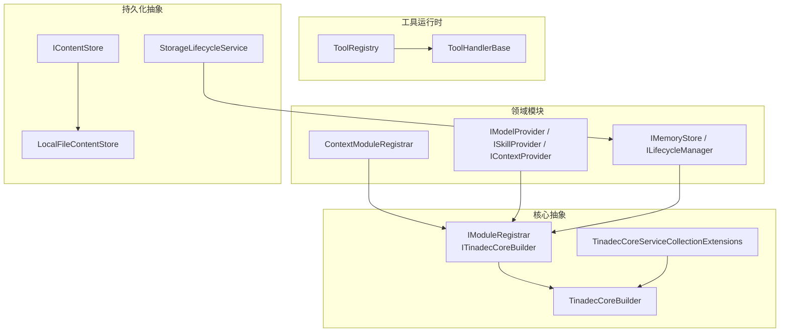
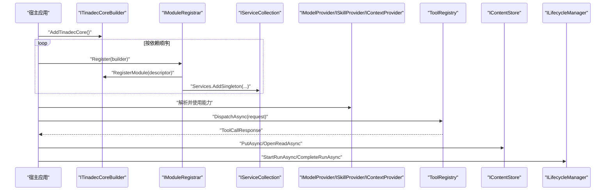
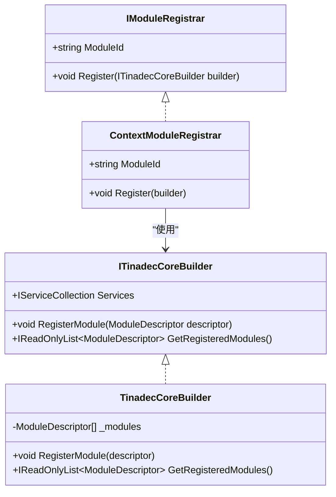
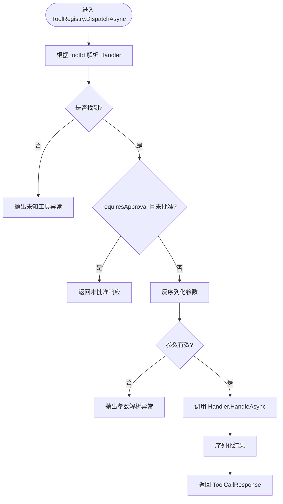
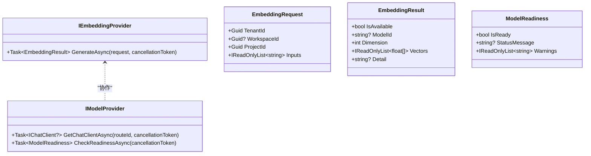
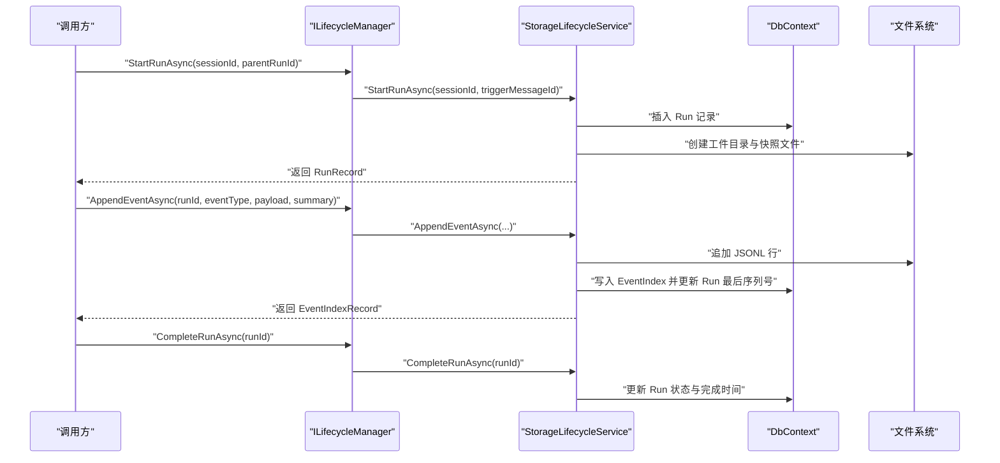
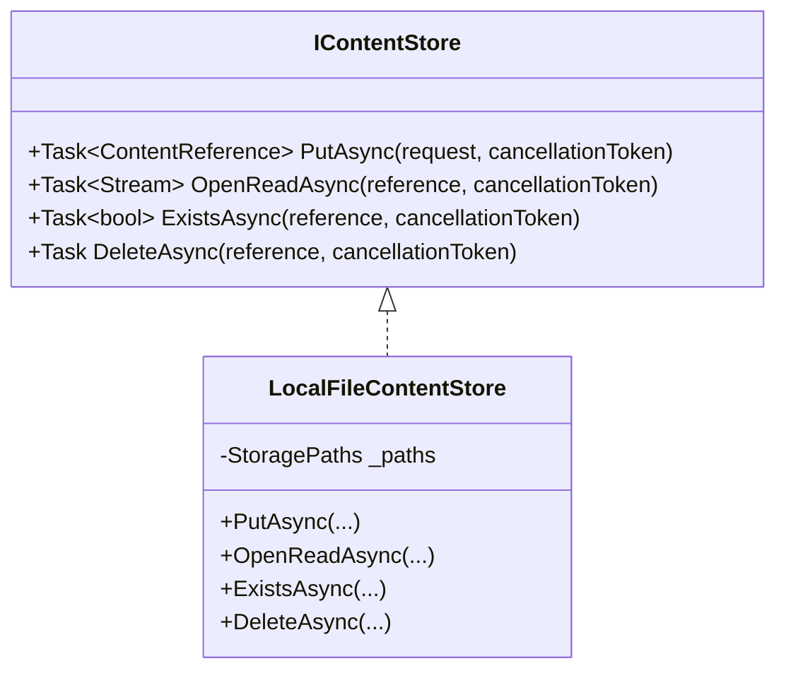
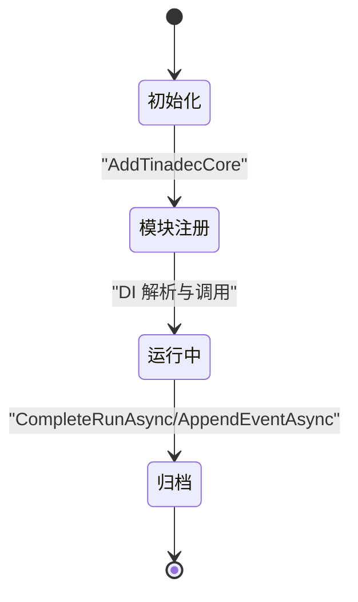
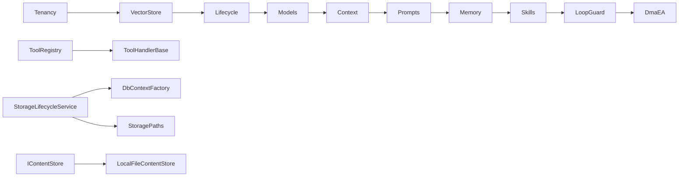

# 扩展架构设计

<cite>
**本文引用的文件**   
- [IModuleRegistrar.cs](file://TinadecCore/Abstractions/IModuleRegistrar.cs)
- [ITinadecCoreBuilder.cs](file://TinadecCore/Abstractions/ITinadecCoreBuilder.cs)
- [TinadecCoreBuilder.cs](file://TinadecCore/Runtime/TinadecCoreBuilder.cs)
- [TinadecCoreServiceCollectionExtensions.cs](file://TinadecCore/Runtime/TinadecCoreServiceCollectionExtensions.cs)
- [ContextModuleRegistrar.cs](file://TinadecCore/Context/ContextModuleRegistrar.cs)
- [IModelProvider.cs](file://TinadecCore/Abstractions/Ports/IModelProvider.cs)
- [ISkillProvider.cs](file://TinadecCore/Abstractions/Ports/ISkillProvider.cs)
- [IContextProvider.cs](file://TinadecCore/Abstractions/Ports/IContextProvider.cs)
- [ToolRegistry.cs](file://TinadecTools/Abstractions/ToolRegistry.cs)
- [ToolHandlerBase.cs](file://TinadecTools/Abstractions/ToolHandlerBase.cs)
- [IMemoryStore.cs](file://TinadecCore/Abstractions/Ports/IMemoryStore.cs)
- [ILifecycleManager.cs](file://TinadecCore/Abstractions/Ports/ILifecycleManager.cs)
- [StorageLifecycleService.cs](file://TinadecCore/Lifecycle/StorageLifecycleService.cs)
- [IContentStore.cs](file://TinadecCore/Persistence/IContentStore.cs)
- [LocalFileContentStore.cs](file://TinadecCore/Persistence/LocalFileContentStore.cs)
</cite>

## 目录
1. [简介](#简介)
2. [项目结构](#项目结构)
3. [核心组件](#核心组件)
4. [架构总览](#架构总览)
5. [详细组件分析](#详细组件分析)
6. [依赖关系分析](#依赖关系分析)
7. [性能考量](#性能考量)
8. [故障排查指南](#故障排查指南)
9. [结论](#结论)
10. [附录](#附录)

## 简介
本文件面向 TinadecOffice 的扩展架构，系统性阐述插件化架构、模块注册机制与接口抽象设计。重点解释工具提供者模式、模型提供商抽象、存储后端抽象，并给出扩展点图、插件生命周期与依赖注入配置说明。文档同时覆盖自定义工具开发、策略实现与服务扩展，以及扩展点发现、版本兼容性与热重载支持的设计建议。

## 项目结构
TinadecOffice 采用“核心 + 领域模块 + 工具运行时”的分层组织：
- 核心抽象与构建器：定义模块注册、DI 构建与模块描述符
- 领域模块：上下文、模型、记忆、技能、生命周期等通过 IModuleRegistrar 显式注册
- 工具运行时：提供工具注册表与处理器基类，支撑工具调用分发与审批流程
- 持久化抽象：内容存储、事件日志、会话定位等统一抽象，便于替换后端

图表来源 
- [IModuleRegistrar.cs:1-17](file://TinadecCore/Abstractions/IModuleRegistrar.cs#L1-L17)
- [ITinadecCoreBuilder.cs:1-52](file://TinadecCore/Abstractions/ITinadecCoreBuilder.cs#L1-L52)
- [TinadecCoreBuilder.cs:1-31](file://TinadecCore/Runtime/TinadecCoreBuilder.cs#L1-L31)
- [TinadecCoreServiceCollectionExtensions.cs:1-61](file://TinadecCore/Runtime/TinadecCoreServiceCollectionExtensions.cs#L1-L61)
- [ContextModuleRegistrar.cs:1-52](file://TinadecCore/Context/ContextModuleRegistrar.cs#L1-L52)
- [IModelProvider.cs:1-51](file://TinadecCore/Abstractions/Ports/IModelProvider.cs#L1-L51)
- [ISkillProvider.cs:1-28](file://TinadecCore/Abstractions/Ports/ISkillProvider.cs#L1-L28)
- [IContextProvider.cs:1-37](file://TinadecCore/Abstractions/Ports/IContextProvider.cs#L1-L37)
- [ToolRegistry.cs:1-86](file://TinadecTools/Abstractions/ToolRegistry.cs#L1-L86)
- [ToolHandlerBase.cs:1-43](file://TinadecTools/Abstractions/ToolHandlerBase.cs#L1-L43)
- [IMemoryStore.cs:1-31](file://TinadecCore/Abstractions/Ports/IMemoryStore.cs#L1-L31)
- [ILifecycleManager.cs:1-41](file://TinadecCore/Abstractions/Ports/ILifecycleManager.cs#L1-L41)
- [IContentStore.cs:1-20](file://TinadecCore/Persistence/IContentStore.cs#L1-L20)
- [LocalFileContentStore.cs:1-68](file://TinadecCore/Persistence/LocalFileContentStore.cs#L1-L68)
- [StorageLifecycleService.cs:1-291](file://TinadecCore/Lifecycle/StorageLifecycleService.cs#L1-L291)

章节来源
- [IModuleRegistrar.cs:1-17](file://TinadecCore/Abstractions/IModuleRegistrar.cs#L1-L17)
- [ITinadecCoreBuilder.cs:1-52](file://TinadecCore/Abstractions/ITinadecCoreBuilder.cs#L1-L52)
- [TinadecCoreBuilder.cs:1-31](file://TinadecCore/Runtime/TinadecCoreBuilder.cs#L1-L31)
- [TinadecCoreServiceCollectionExtensions.cs:1-61](file://TinadecCore/Runtime/TinadecCoreServiceCollectionExtensions.cs#L1-L61)
- [ContextModuleRegistrar.cs:1-52](file://TinadecCore/Context/ContextModuleRegistrar.cs#L1-L52)

## 核心组件
- 模块注册器 IModuleRegistrar：每个业务模块实现该接口，显式向 DI 容器注册服务并向构建器声明模块描述符（无反射扫描）
- 构建器 ITinadecCoreBuilder：聚合 IServiceCollection，收集模块描述符，暴露 GetRegisteredModules 供外部消费
- 默认构建器 TinadecCoreBuilder：维护 ModuleDescriptor 列表，将自身注册为单例以便端点解析
- 服务集合扩展：AddTinadecCore/AddTinadecCoreMinimal 按依赖顺序注册各模块，支持最小化组合以裁剪体积

章节来源
- [IModuleRegistrar.cs:1-17](file://TinadecCore/Abstractions/IModuleRegistrar.cs#L1-L17)
- [ITinadecCoreBuilder.cs:1-52](file://TinadecCore/Abstractions/ITinadecCoreBuilder.cs#L1-L52)
- [TinadecCoreBuilder.cs:1-31](file://TinadecCore/Runtime/TinadecCoreBuilder.cs#L1-L31)
- [TinadecCoreServiceCollectionExtensions.cs:1-61](file://TinadecCore/Runtime/TinadecCoreServiceCollectionExtensions.cs#L1-L61)

## 架构总览
下图展示插件化架构的核心交互：模块通过 IModuleRegistrar 注册到构建器；构建器在启动时组装 DI；领域能力通过 Ports 抽象解耦；工具运行时通过 ToolRegistry 进行动态分发；持久化通过 IContentStore 与 StorageLifecycleService 提供可插拔后端。

图表来源 
- [TinadecCoreServiceCollectionExtensions.cs:1-61](file://TinadecCore/Runtime/TinadecCoreServiceCollectionExtensions.cs#L1-L61)
- [IModuleRegistrar.cs:1-17](file://TinadecCore/Abstractions/IModuleRegistrar.cs#L1-L17)
- [ITinadecCoreBuilder.cs:1-52](file://TinadecCore/Abstractions/ITinadecCoreBuilder.cs#L1-L52)
- [IModelProvider.cs:1-51](file://TinadecCore/Abstractions/Ports/IModelProvider.cs#L1-L51)
- [ISkillProvider.cs:1-28](file://TinadecCore/Abstractions/Ports/ISkillProvider.cs#L1-L28)
- [IContextProvider.cs:1-37](file://TinadecCore/Abstractions/Ports/IContextProvider.cs#L1-L37)
- [ToolRegistry.cs:1-86](file://TinadecTools/Abstractions/ToolRegistry.cs#L1-L86)
- [IContentStore.cs:1-20](file://TinadecCore/Persistence/IContentStore.cs#L1-L20)
- [ILifecycleManager.cs:1-41](file://TinadecCore/Abstractions/Ports/ILifecycleManager.cs#L1-L41)

## 详细组件分析

### 模块注册与依赖注入配置
- 模块注册器：每个模块实现 IModuleRegistrar，提供 ModuleId 并在 Register 中向 builder.Services 注册服务，同时调用 builder.RegisterModule 声明模块元数据（版本、依赖、能力、语言、MAF 原语、状态）
- 构建器：TinadecCoreBuilder 持有 ModuleDescriptor 列表，对外暴露 GetRegisteredModules；自身作为单例注入，便于 API 端点读取已注册模块
- 扩展方法：AddTinadecCore 按依赖顺序注册所有模块；AddTinadecCoreMinimal 仅注册最小集，利于裁剪与编译时优化

图表来源 
- [IModuleRegistrar.cs:1-17](file://TinadecCore/Abstractions/IModuleRegistrar.cs#L1-L17)
- [ITinadecCoreBuilder.cs:1-52](file://TinadecCore/Abstractions/ITinadecCoreBuilder.cs#L1-L52)
- [TinadecCoreBuilder.cs:1-31](file://TinadecCore/Runtime/TinadecCoreBuilder.cs#L1-L31)
- [ContextModuleRegistrar.cs:1-52](file://TinadecCore/Context/ContextModuleRegistrar.cs#L1-L52)

章节来源
- [IModuleRegistrar.cs:1-17](file://TinadecCore/Abstractions/IModuleRegistrar.cs#L1-L17)
- [ITinadecCoreBuilder.cs:1-52](file://TinadecCore/Abstractions/ITinadecCoreBuilder.cs#L1-L52)
- [TinadecCoreBuilder.cs:1-31](file://TinadecCore/Runtime/TinadecCoreBuilder.cs#L1-L31)
- [ContextModuleRegistrar.cs:1-52](file://TinadecCore/Context/ContextModuleRegistrar.cs#L1-L52)

### 工具提供者模式与工具注册表
- 工具注册表 ToolRegistry：维护 toolId -> handler 映射，支持泛型与非泛型注册；处理参数反序列化、审批校验、结果序列化与调度
- 处理器基类 ToolHandlerBase<TArgs, TResult>：封装 HandleAsync，统一参数校验、反序列化与响应构造，子类只需实现 ExecuteAsync

图表来源 
- [ToolRegistry.cs:1-86](file://TinadecTools/Abstractions/ToolRegistry.cs#L1-L86)
- [ToolHandlerBase.cs:1-43](file://TinadecTools/Abstractions/ToolHandlerBase.cs#L1-L43)

章节来源
- [ToolRegistry.cs:1-86](file://TinadecTools/Abstractions/ToolRegistry.cs#L1-L86)
- [ToolHandlerBase.cs:1-43](file://TinadecTools/Abstractions/ToolHandlerBase.cs#L1-L43)

### 模型提供商抽象（IModelProvider）
- IModelProvider：负责获取聊天客户端、检查就绪状态；不重写 HTTP 客户端，保持与上层 AI 库解耦
- IEmbeddingProvider：生成嵌入向量，屏蔽凭证细节
- ModelReadiness：标准化就绪信息（是否就绪、状态消息、警告）

图表来源 
- [IModelProvider.cs:1-51](file://TinadecCore/Abstractions/Ports/IModelProvider.cs#L1-L51)

章节来源
- [IModelProvider.cs:1-51](file://TinadecCore/Abstractions/Ports/IModelProvider.cs#L1-L51)

### 技能提供商（ISkillProvider）
- ISkillProvider：通过 MAF AgentSkillsProvider 暴露技能，支持文件/类/内联技能与 SKILL.md 格式；脚本执行委托给工具运行时，写操作需经 Core 审批

章节来源
- [ISkillProvider.cs:1-28](file://TinadecCore/Abstractions/Ports/ISkillProvider.cs#L1-L28)

### 上下文提供者（IContextProvider）
- IContextProvider：为会话与运行生成 ContextPack（包含证据、来源、令牌预算），不组装最终系统提示
- ContextPack/ContextEvidence：结构化上下文与溯源元数据

章节来源
- [IContextProvider.cs:1-37](file://TinadecCore/Abstractions/Ports/IContextProvider.cs#L1-L37)

### 记忆存储抽象（IMemoryStore）
- IMemoryStore：管理会话级记忆范围、保留策略与溯源；封装 MAF AgentSession 序列化与 ChatHistoryProvider

章节来源
- [IMemoryStore.cs:1-31](file://TinadecCore/Abstractions/Ports/IMemoryStore.cs#L1-L31)

### 生命周期管理（ILifecycleManager 与 StorageLifecycleService）
- ILifecycleManager：管理运行/任务/代理/工具/审批状态与审计事件；接收 MAF 中间件、工作流事件、会话/检查点与取消信号
- StorageLifecycleService：基于 EF Core 与文件系统实现事件追加、回放、快照与迁移；使用并发锁保障事件写入一致性

图表来源 
- [ILifecycleManager.cs:1-41](file://TinadecCore/Abstractions/Ports/ILifecycleManager.cs#L1-L41)
- [StorageLifecycleService.cs:1-291](file://TinadecCore/Lifecycle/StorageLifecycleService.cs#L1-L291)

章节来源
- [ILifecycleManager.cs:1-41](file://TinadecCore/Abstractions/Ports/ILifecycleManager.cs#L1-L41)
- [StorageLifecycleService.cs:1-291](file://TinadecCore/Lifecycle/StorageLifecycleService.cs#L1-L291)

### 存储后端抽象（IContentStore 与 LocalFileContentStore）
- IContentStore：不可变大内容存储，数据库仅保存不透明引用与完整性元数据
- LocalFileContentStore：本地文件实现，写入时计算 SHA256，原子替换目标路径，支持异步流读取与存在性检测

图表来源 
- [IContentStore.cs:1-20](file://TinadecCore/Persistence/IContentStore.cs#L1-L20)
- [LocalFileContentStore.cs:1-68](file://TinadecCore/Persistence/LocalFileContentStore.cs#L1-L68)

章节来源
- [IContentStore.cs:1-20](file://TinadecCore/Persistence/IContentStore.cs#L1-L20)
- [LocalFileContentStore.cs:1-68](file://TinadecCore/Persistence/LocalFileContentStore.cs#L1-L68)

### 扩展点图与插件生命周期
- 扩展点：IModuleRegistrar（模块）、IModelProvider/IEmbeddingProvider（模型）、ISkillProvider（技能）、IContextProvider（上下文）、IMemoryStore（记忆）、ILifecycleManager（生命周期）、IContentStore（内容存储）
- 插件生命周期：
  - 启动阶段：AddTinadecCore 调用各模块 Registrar.Register，构建器收集 ModuleDescriptor
  - 运行阶段：通过 DI 解析端口接口，调用具体实现；工具通过 ToolRegistry 动态分发
  - 结束阶段：生命周期服务完成运行状态更新与事件归档

图表来源 
- [TinadecCoreServiceCollectionExtensions.cs:1-61](file://TinadecCore/Runtime/TinadecCoreServiceCollectionExtensions.cs#L1-L61)
- [IModuleRegistrar.cs:1-17](file://TinadecCore/Abstractions/IModuleRegistrar.cs#L1-L17)
- [ILifecycleManager.cs:1-41](file://TinadecCore/Abstractions/Ports/ILifecycleManager.cs#L1-L41)

章节来源
- [TinadecCoreServiceCollectionExtensions.cs:1-61](file://TinadecCore/Runtime/TinadecCoreServiceCollectionExtensions.cs#L1-L61)
- [IModuleRegistrar.cs:1-17](file://TinadecCore/Abstractions/IModuleRegistrar.cs#L1-L17)
- [ILifecycleManager.cs:1-41](file://TinadecCore/Abstractions/Ports/ILifecycleManager.cs#L1-L41)

### 自定义工具开发、策略实现与服务扩展
- 自定义工具：继承 ToolHandlerBase<TArgs, TResult>，实现 ToolId、ArgsTypeInfo、ResultTypeInfo 与 ExecuteAsync；通过 ToolRegistry.Register 注册
- 策略实现：在模块 Registrar 中向 DI 注册策略类型，利用 ITinadecCoreBuilder.Services 添加单例或作用域服务
- 服务扩展：新增模块时实现 IModuleRegistrar，声明 ModuleId、依赖与能力，并在 AddTinadecCore 或自定义组合中添加

章节来源
- [ToolHandlerBase.cs:1-43](file://TinadecTools/Abstractions/ToolHandlerBase.cs#L1-L43)
- [ToolRegistry.cs:1-86](file://TinadecTools/Abstractions/ToolRegistry.cs#L1-L86)
- [IModuleRegistrar.cs:1-17](file://TinadecCore/Abstractions/IModuleRegistrar.cs#L1-L17)
- [ITinadecCoreBuilder.cs:1-52](file://TinadecCore/Abstractions/ITinadecCoreBuilder.cs#L1-L52)

### 扩展点发现、版本兼容性与热重载支持
- 扩展点发现：当前采用显式注册（无反射扫描），保证编译期安全与可裁剪；如需动态发现，可在 Registrar 基础上增加程序集扫描与版本筛选
- 版本兼容性：ModuleDescriptor 包含 Version、Dependencies、Capabilities、Language、MafPrimitives、RegistrationStatus；可通过 ToDto 暴露给宿主进行兼容性校验
- 热重载支持：建议在宿主层对模块描述符变更进行监听，按需重建 DI 容器或重新加载模块；对于工具注册表，可在运行时提供 Re-register 入口并清理旧句柄

章节来源
- [ITinadecCoreBuilder.cs:1-52](file://TinadecCore/Abstractions/ITinadecCoreBuilder.cs#L1-L52)
- [TinadecCoreBuilder.cs:1-31](file://TinadecCore/Runtime/TinadecCoreBuilder.cs#L1-L31)

## 依赖关系分析
- 模块间依赖：Tenancy → VectorStore → Lifecycle → Models → Context → Prompts → Memory → Skills → LoopGuard → DmaEA（由 AddTinadecCore 顺序决定）
- 工具运行时依赖：ToolRegistry 依赖 ToolHandlerBase；工具实现通过静态注册表绑定
- 持久化依赖：StorageLifecycleService 依赖 DbContextFactory、ISessionLocator、StoragePaths、StorageDiagnostics；IContentStore 由 LocalFileContentStore 实现

图表来源 
- [TinadecCoreServiceCollectionExtensions.cs:1-61](file://TinadecCore/Runtime/TinadecCoreServiceCollectionExtensions.cs#L1-L61)
- [ToolRegistry.cs:1-86](file://TinadecTools/Abstractions/ToolRegistry.cs#L1-L86)
- [ToolHandlerBase.cs:1-43](file://TinadecTools/Abstractions/ToolHandlerBase.cs#L1-L43)
- [StorageLifecycleService.cs:1-291](file://TinadecCore/Lifecycle/StorageLifecycleService.cs#L1-L291)
- [IContentStore.cs:1-20](file://TinadecCore/Persistence/IContentStore.cs#L1-L20)
- [LocalFileContentStore.cs:1-68](file://TinadecCore/Persistence/LocalFileContentStore.cs#L1-L68)

章节来源
- [TinadecCoreServiceCollectionExtensions.cs:1-61](file://TinadecCore/Runtime/TinadecCoreServiceCollectionExtensions.cs#L1-L61)
- [ToolRegistry.cs:1-86](file://TinadecTools/Abstractions/ToolRegistry.cs#L1-L86)
- [ToolHandlerBase.cs:1-43](file://TinadecTools/Abstractions/ToolHandlerBase.cs#L1-L43)
- [StorageLifecycleService.cs:1-291](file://TinadecCore/Lifecycle/StorageLifecycleService.cs#L1-L291)
- [IContentStore.cs:1-20](file://TinadecCore/Persistence/IContentStore.cs#L1-L20)
- [LocalFileContentStore.cs:1-68](file://TinadecCore/Persistence/LocalFileContentStore.cs#L1-L68)

## 性能考量
- 工具分发：ToolRegistry 使用字典查找，O(1) 解析；参数反序列化与结果序列化应使用预编译 JsonTypeInfo 以减少开销
- 事件写入：StorageLifecycleService 使用并发锁与追加写入 JSONL，避免频繁小文件 IO；批量回放时按偏移读取减少随机 IO
- 内容存储：LocalFileContentStore 使用流式读写与增量哈希，避免内存峰值；原子替换确保一致性
- 模块注册：显式注册避免反射扫描，降低启动时间与内存占用；最小化组合有助于裁剪

[本节为通用指导，不直接分析具体文件]

## 故障排查指南
- 工具未知错误：ToolRegistry.DispatchAsync 在未找到 toolId 时抛出异常；检查是否正确注册与命名一致
- 参数解析失败：当 Params 为空或无法反序列化时抛出异常；确认 TArgs 类型与 JsonTypeInfo 配置正确
- 会话不存在：StorageLifecycleService.StartRunAsync 在找不到会话时抛出 KeyNotFoundException；检查 ISessionLocator 配置与会话创建流程
- 事件索引不一致：ReconcileAsync 会修复缺失索引；若出现 JSON 解析异常，检查 JSONL 尾行完整性

章节来源
- [ToolRegistry.cs:1-86](file://TinadecTools/Abstractions/ToolRegistry.cs#L1-L86)
- [ToolHandlerBase.cs:1-43](file://TinadecTools/Abstractions/ToolHandlerBase.cs#L1-L43)
- [StorageLifecycleService.cs:1-291](file://TinadecCore/Lifecycle/StorageLifecycleService.cs#L1-L291)

## 结论
TinadecOffice 的扩展架构以显式模块注册为核心，结合清晰的端口抽象与可插拔存储后端，实现了高内聚、低耦合的可扩展系统。工具提供者模式与注册表简化了工具开发与调用；生命周期与事件机制保障了可观测性与可恢复性。通过 ModuleDescriptor 的版本与能力声明，可实现严格的兼容性控制；在宿主层配合监听与容器重建，可进一步支持热重载。

[本节为总结，不直接分析具体文件]

## 附录
- 最佳实践
  - 新增模块：实现 IModuleRegistrar，声明依赖与能力，并在 AddTinadecCore 或自定义组合中注册
  - 自定义工具：继承 ToolHandlerBase，实现 ExecuteAsync，并通过 ToolRegistry.Register 注册
  - 存储后端：实现 IContentStore，替换默认 LocalFileContentStore
  - 模型提供商：实现 IModelProvider/IEmbeddingProvider，注入凭据与路由策略
- 扩展点清单
  - 模块：IModuleRegistrar
  - 模型：IModelProvider、IEmbeddingProvider
  - 技能：ISkillProvider
  - 上下文：IContextProvider
  - 记忆：IMemoryStore
  - 生命周期：ILifecycleManager
  - 内容存储：IContentStore

[本节为补充信息，不直接分析具体文件]