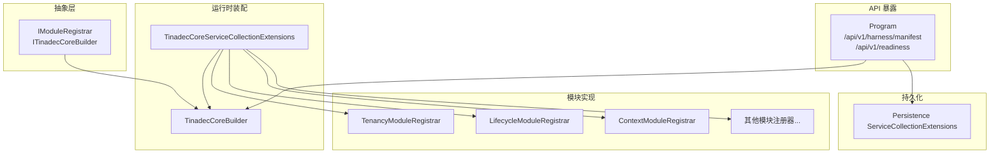
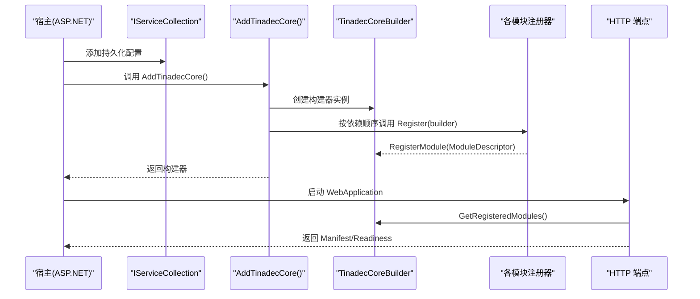
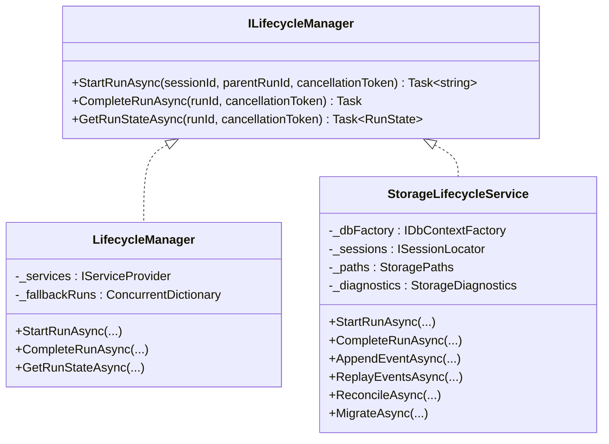
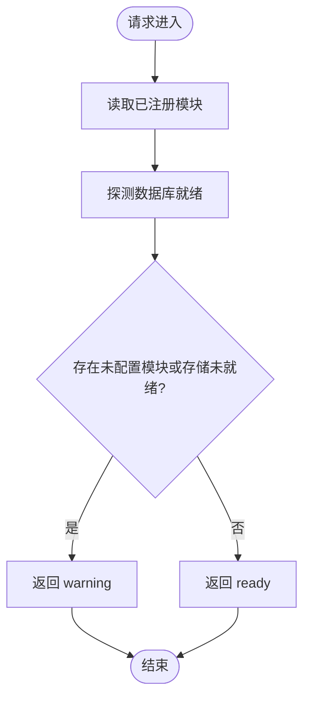
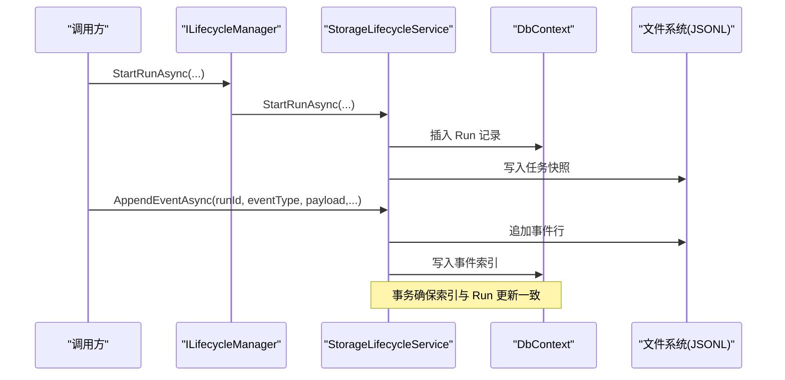
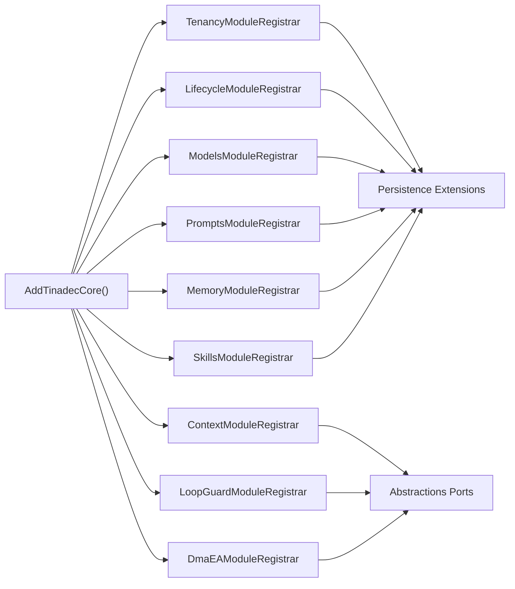

# 插件系统架构

<cite>
**本文引用的文件**   
- [IModuleRegistrar.cs](file://TinadecCore/Abstractions/IModuleRegistrar.cs)
- [ITinadecCoreBuilder.cs](file://TinadecCore/Abstractions/ITinadecCoreBuilder.cs)
- [TinadecCoreBuilder.cs](file://TinadecCore/Runtime/TinadecCoreBuilder.cs)
- [TinadecCoreServiceCollectionExtensions.cs](file://TinadecCore/Runtime/TinadecCoreServiceCollectionExtensions.cs)
- [ContextModuleRegistrar.cs](file://TinadecCore/Context/ContextModuleRegistrar.cs)
- [LifecycleModuleRegistrar.cs](file://TinadecCore/Lifecycle/LifecycleModuleRegistrar.cs)
- [TenancyModuleRegistrar.cs](file://TinadecCore/Tenancy/TenancyModuleRegistrar.cs)
- [Program.cs](file://TinadecCore/Api/Program.cs)
- [HarnessManifestDto.cs](file://TinadecCore/Contracts/Dtos/HarnessManifestDto.cs)
- [ServiceCollectionExtensions.cs](file://TinadecCore/Persistence/ServiceCollectionExtensions.cs)
- [EventEnvelope.cs](file://TinadecCore/Contracts/Events/EventEnvelope.cs)
- [ILifecycleManager.cs](file://TinadecCore/Abstractions/Ports/ILifecycleManager.cs)
- [StorageLifecycleService.cs](file://TinadecCore/Lifecycle/StorageLifecycleService.cs)
</cite>

## 目录
1. [简介](#简介)
2. [项目结构](#项目结构)
3. [核心组件](#核心组件)
4. [架构总览](#架构总览)
5. [详细组件分析](#详细组件分析)
6. [依赖关系分析](#依赖关系分析)
7. [性能考量](#性能考量)
8. [故障排查指南](#故障排查指南)
9. [结论](#结论)
10. [附录：自定义模块开发示例](#附录自定义模块开发示例)

## 简介
本文件系统化阐述 TinadecOffice 的插件（模块）系统架构，围绕 IModuleRegistrar 接口设计、显式注册模式与反射扫描的差异、依赖注入配置、模块生命周期管理、服务发现机制、加载顺序、依赖解析与错误处理策略展开。同时提供自定义模块开发的完整流程说明，包括服务注册、配置绑定与初始化；并解释模块间通信模式与事件总线集成方式。

## 项目结构
TinadecCore 采用“按功能域划分”的模块化组织方式，每个业务域以独立的 ModuleRegistrar 实现暴露能力，并通过统一的构建器与扩展方法进行装配。运行时通过 Web API 暴露模块清单与健康检查端点，便于外部系统（如 Gateway、Desktop）进行服务发现与状态探测。

图表来源
- [ITinadecCoreBuilder.cs:1-52](file://TinadecCore/Abstractions/ITinadecCoreBuilder.cs#L1-L52)
- [TinadecCoreBuilder.cs:1-31](file://TinadecCore/Runtime/TinadecCoreBuilder.cs#L1-L31)
- [TinadecCoreServiceCollectionExtensions.cs:1-61](file://TinadecCore/Runtime/TinadecCoreServiceCollectionExtensions.cs#L1-L61)
- [TenancyModuleRegistrar.cs:1-38](file://TinadecCore/Tenancy/TenancyModuleRegistrar.cs#L1-L38)
- [LifecycleModuleRegistrar.cs:1-100](file://TinadecCore/Lifecycle/LifecycleModuleRegistrar.cs#L1-L100)
- [ContextModuleRegistrar.cs:1-52](file://TinadecCore/Context/ContextModuleRegistrar.cs#L1-L52)
- [Program.cs:1-181](file://TinadecCore/Api/Program.cs#L1-L181)
- [ServiceCollectionExtensions.cs:1-122](file://TinadecCore/Persistence/ServiceCollectionExtensions.cs#L1-L122)

章节来源
- [ITinadecCoreBuilder.cs:1-52](file://TinadecCore/Abstractions/ITinadecCoreBuilder.cs#L1-L52)
- [TinadecCoreBuilder.cs:1-31](file://TinadecCore/Runtime/TinadecCoreBuilder.cs#L1-L31)
- [TinadecCoreServiceCollectionExtensions.cs:1-61](file://TinadecCore/Runtime/TinadecCoreServiceCollectionExtensions.cs#L1-L61)
- [Program.cs:1-181](file://TinadecCore/Api/Program.cs#L1-L181)

## 核心组件
- IModuleRegistrar：模块注册契约，要求每个模块提供唯一标识与 Register(builder) 方法，用于向 DI 容器注册服务并向构建器登记模块描述符。
- ITinadecCoreBuilder：模块装配构建器，封装 IServiceCollection 并提供 RegisterModule/GetRegisteredModules 能力，供模块声明元数据（版本、依赖、能力等）。
- TinadecCoreBuilder：构建器默认实现，收集模块描述符并将自身注册到 DI，以便在端点中读取已注册模块。
- TinadecCoreServiceCollectionExtensions：统一入口 AddTinadecCore/AddTinadecCoreMinimal，按依赖顺序显式调用各模块注册器的 Register，完成全量或最小集合装配。
- Program：Web 应用启动，装配持久化与 Core 模块，暴露 /api/v1/harness/manifest 与 /api/v1/readiness 端点进行服务发现与健康检查。

章节来源
- [IModuleRegistrar.cs:1-17](file://TinadecCore/Abstractions/IModuleRegistrar.cs#L1-L17)
- [ITinadecCoreBuilder.cs:1-52](file://TinadecCore/Abstractions/ITinadecCoreBuilder.cs#L1-L52)
- [TinadecCoreBuilder.cs:1-31](file://TinadecCore/Runtime/TinadecCoreBuilder.cs#L1-L31)
- [TinadecCoreServiceCollectionExtensions.cs:1-61](file://TinadecCore/Runtime/TinadecCoreServiceCollectionExtensions.cs#L1-L61)
- [Program.cs:1-181](file://TinadecCore/Api/Program.cs#L1-L181)

## 架构总览
下图展示从应用启动到模块装配、再到对外暴露清单与就绪状态的端到端流程。

图表来源
- [TinadecCoreServiceCollectionExtensions.cs:1-61](file://TinadecCore/Runtime/TinadecCoreServiceCollectionExtensions.cs#L1-L61)
- [TinadecCoreBuilder.cs:1-31](file://TinadecCore/Runtime/TinadecCoreBuilder.cs#L1-L31)
- [Program.cs:1-181](file://TinadecCore/Api/Program.cs#L1-L181)

## 详细组件分析

### IModuleRegistrar 接口设计与显式注册模式
- 接口职责：定义 ModuleId 与 Register(builder)，强制模块自我描述与自我装配。
- 显式注册 vs 反射扫描：
  - 显式注册：由 AddTinadecCore 明确列出各模块注册器并按序调用，编译期可裁剪、无反射开销、加载顺序可控、易于测试与调试。
  - 反射扫描：需要约定命名空间/特性，存在未知类型加载风险、难以控制顺序、不利于 AOT/Trimming。
- 模块描述符：ModuleDescriptor 包含 ModuleId、Version、Dependencies、Capabilities、Language、MafPrimitives、RegistrationStatus，用于生成框架清单与就绪报告。

章节来源
- [IModuleRegistrar.cs:1-17](file://TinadecCore/Abstractions/IModuleRegistrar.cs#L1-L17)
- [ITinadecCoreBuilder.cs:1-52](file://TinadecCore/Abstractions/ITinadecCoreBuilder.cs#L1-L52)
- [TinadecCoreServiceCollectionExtensions.cs:1-61](file://TinadecCore/Runtime/TinadecCoreServiceCollectionExtensions.cs#L1-L61)
- [HarnessManifestDto.cs:1-53](file://TinadecCore/Contracts/Dtos/HarnessManifestDto.cs#L1-L53)

### 构建器与 DI 装配
- TinadecCoreBuilder：维护 ModuleDescriptor 列表，将自身注册为单例，供端点查询。
- AddTinadecCore/AddTinadecCoreMinimal：前者注册全部模块，后者仅注册最小集（演示编译时裁剪），两者均按依赖顺序调用各模块 Register。
- 模块内典型操作：
  - 注册服务（AddSingleton/AddDbContextFactory 等）
  - 声明 ModuleDescriptor（版本、依赖、能力、语言、MAF 原语、注册状态）

章节来源
- [TinadecCoreBuilder.cs:1-31](file://TinadecCore/Runtime/TinadecCoreBuilder.cs#L1-L31)
- [TinadecCoreServiceCollectionExtensions.cs:1-61](file://TinadecCore/Runtime/TinadecCoreServiceCollectionExtensions.cs#L1-L61)
- [TenancyModuleRegistrar.cs:1-38](file://TinadecCore/Tenancy/TenancyModuleRegistrar.cs#L1-L38)
- [LifecycleModuleRegistrar.cs:1-100](file://TinadecCore/Lifecycle/LifecycleModuleRegistrar.cs#L1-L100)
- [ContextModuleRegistrar.cs:1-52](file://TinadecCore/Context/ContextModuleRegistrar.cs#L1-L52)

### 模块生命周期管理与存储实现
- ILifecycleManager：对外暴露 StartRunAsync/CompleteRunAsync/GetRunStateAsync，管理运行态（run/task/agent/tool/approval）与审计事件。
- LifecycleManager：内存回退实现，当存储不可用时使用并发字典缓存状态，保证可用性。
- StorageLifecycleService：持久化实现，负责 Run 记录、事件追加（JSONL）、索引写入、回放、迁移与一致性校验（Reconcile）。

图表来源
- [ILifecycleManager.cs:1-41](file://TinadecCore/Abstractions/Ports/ILifecycleManager.cs#L1-L41)
- [LifecycleModuleRegistrar.cs:1-100](file://TinadecCore/Lifecycle/LifecycleModuleRegistrar.cs#L1-L100)
- [StorageLifecycleService.cs:1-291](file://TinadecCore/Lifecycle/StorageLifecycleService.cs#L1-L291)

章节来源
- [ILifecycleManager.cs:1-41](file://TinadecCore/Abstractions/Ports/ILifecycleManager.cs#L1-L41)
- [LifecycleModuleRegistrar.cs:1-100](file://TinadecCore/Lifecycle/LifecycleModuleRegistrar.cs#L1-L100)
- [StorageLifecycleService.cs:1-291](file://TinadecCore/Lifecycle/StorageLifecycleService.cs#L1-L291)

### 服务发现与就绪检查
- /api/v1/harness/manifest：聚合所有已注册模块的描述符，输出框架信息与模块清单。
- /api/v1/readiness：结合数据库就绪探针与各模块 RegistrationStatus，返回 ready/warning。

图表来源
- [Program.cs:1-181](file://TinadecCore/Api/Program.cs#L1-L181)
- [ITinadecCoreBuilder.cs:1-52](file://TinadecCore/Abstractions/ITinadecCoreBuilder.cs#L1-L52)

章节来源
- [Program.cs:1-181](file://TinadecCore/Api/Program.cs#L1-L181)

### 事件总线与模块间通信
- EventEnvelope：版本化的事件信封，包含事件 ID、类型、时间戳、会话/运行上下文与负载。
- StorageLifecycleService.AppendEventAsync：对事件追加 JSONL 行，建立索引并维护序列号，支持回放与一致性修复。
- 模块间通信建议：通过 ILifecycleManager 触发状态变更，配合 AppendEventAsync 发布领域事件，消费者基于 SessionId/RunId 订阅回放。

图表来源
- [EventEnvelope.cs:1-33](file://TinadecCore/Contracts/Events/EventEnvelope.cs#L1-L33)
- [StorageLifecycleService.cs:1-291](file://TinadecCore/Lifecycle/StorageLifecycleService.cs#L1-L291)
- [ILifecycleManager.cs:1-41](file://TinadecCore/Abstractions/Ports/ILifecycleManager.cs#L1-L41)

章节来源
- [EventEnvelope.cs:1-33](file://TinadecCore/Contracts/Events/EventEnvelope.cs#L1-L33)
- [StorageLifecycleService.cs:1-291](file://TinadecCore/Lifecycle/StorageLifecycleService.cs#L1-L291)

## 依赖关系分析
- 模块加载顺序：AddTinadecCore 中按 Tenancy → VectorStore → Lifecycle → Models → Context → Prompts → Memory → Skills → LoopGuard → DmaEA 的顺序调用 Register，确保基础能力先于上层能力可用。
- 依赖解析：各模块通过 builder.Services 注册服务，构建器不解析依赖，依赖由 DI 容器在运行时解析。
- 外部依赖：Persistence 提供数据库连接信息、EF 配置器、迁移与就绪探测；API 层通过 Program 组装。

图表来源
- [TinadecCoreServiceCollectionExtensions.cs:1-61](file://TinadecCore/Runtime/TinadecCoreServiceCollectionExtensions.cs#L1-L61)
- [ServiceCollectionExtensions.cs:1-122](file://TinadecCore/Persistence/ServiceCollectionExtensions.cs#L1-L122)

章节来源
- [TinadecCoreServiceCollectionExtensions.cs:1-61](file://TinadecCore/Runtime/TinadecCoreServiceCollectionExtensions.cs#L1-L61)
- [ServiceCollectionExtensions.cs:1-122](file://TinadecCore/Persistence/ServiceCollectionExtensions.cs#L1-L122)

## 性能考量
- 显式注册避免反射扫描，减少启动时间与类型加载成本，利于 AOT/Trimming。
- 构建器仅收集描述符，不执行重逻辑；服务注册延迟至 DI 解析阶段。
- 事件追加采用 JSONL 追加写与索引分离，降低锁粒度；使用 SemaphoreSlim 保障单 Run 并发安全。
- 数据库连接与 EF 工厂按需创建 DbContext，避免长连接占用。

[本节为通用指导，无需源码引用]

## 故障排查指南
- 模块未配置警告：readiness 端点会标记 NotConfigured 模块，需检查对应 ModuleDescriptor 的 RegistrationStatus 与配置绑定。
- 存储未就绪：DatabaseReadiness 探针失败将导致 readiness=warning，检查连接字符串与 Provider 配置。
- 事件回放异常：Reconcile 会忽略损坏的 JSONL 尾段与非法记录，查看 StorageDiagnostics 消息定位问题。
- 启动迁移失败：确认 AddTinadecPersistence 已调用且 IsConfigured=true，必要时手动运行迁移。

章节来源
- [Program.cs:1-181](file://TinadecCore/Api/Program.cs#L1-L181)
- [ServiceCollectionExtensions.cs:1-122](file://TinadecCore/Persistence/ServiceCollectionExtensions.cs#L1-L122)
- [StorageLifecycleService.cs:1-291](file://TinadecCore/Lifecycle/StorageLifecycleService.cs#L1-L291)

## 结论
TinadecOffice 的插件系统以 IModuleRegistrar 为核心契约，采用显式注册模式替代反射扫描，确保加载顺序可控、依赖清晰、性能优异。构建器与扩展方法提供统一的装配入口，API 层暴露清单与就绪状态，便于外部系统集成。事件模型与生命周期管理为模块间通信提供了可靠基础。

[本节为总结性内容，无需源码引用]

## 附录：自定义模块开发示例
以下步骤帮助开发者快速创建自定义模块，涵盖服务注册、配置绑定与初始化流程。

- 步骤一：新建模块注册器
  - 实现 IModuleRegistrar，提供 ModuleId 与 Register(builder)。
  - 在 Register 中通过 builder.Services 注册所需服务（单例/作用域/工厂）。
  - 通过 builder.RegisterModule(new ModuleDescriptor{...}) 声明模块元数据（版本、依赖、能力、语言、MAF 原语、注册状态）。

- 步骤二：配置绑定
  - 使用 AddOptions<T>() 与 BindConfiguration("SectionName") 绑定配置。
  - 可选 ValidateOnStart 验证关键参数范围。

- 步骤三：数据库与迁移（如需）
  - 使用 AddDbContextFactory<TDbContext>((sp, options) => options.UseTinadecDatabase(sp)) 注册 DbContext。
  - 实现 IStorageMigrationParticipant 并在迁移阶段执行表结构初始化。

- 步骤四：加入装配
  - 在 AddTinadecCore 或自定义扩展中，按依赖顺序调用新模块的 Register。
  - 若仅需最小集，可在 AddTinadecCoreMinimal 中添加。

- 步骤五：服务发现与就绪
  - 通过 /api/v1/harness/manifest 查看模块是否出现在 Modules 列表中。
  - 通过 /api/v1/readiness 检查模块状态是否为 registered/not_configured/disabled。

- 步骤六：事件与通信
  - 使用 ILifecycleManager 管理运行态。
  - 通过 AppendEventAsync 发布事件，消费端使用 ReplayEventsAsync 回放。

章节来源
- [IModuleRegistrar.cs:1-17](file://TinadecCore/Abstractions/IModuleRegistrar.cs#L1-L17)
- [ITinadecCoreBuilder.cs:1-52](file://TinadecCore/Abstractions/ITinadecCoreBuilder.cs#L1-L52)
- [TenancyModuleRegistrar.cs:1-38](file://TinadecCore/Tenancy/TenancyModuleRegistrar.cs#L1-L38)
- [LifecycleModuleRegistrar.cs:1-100](file://TinadecCore/Lifecycle/LifecycleModuleRegistrar.cs#L1-L100)
- [ServiceCollectionExtensions.cs:1-122](file://TinadecCore/Persistence/ServiceCollectionExtensions.cs#L1-L122)
- [Program.cs:1-181](file://TinadecCore/Api/Program.cs#L1-L181)
- [ILifecycleManager.cs:1-41](file://TinadecCore/Abstractions/Ports/ILifecycleManager.cs#L1-L41)
- [StorageLifecycleService.cs:1-291](file://TinadecCore/Lifecycle/StorageLifecycleService.cs#L1-L291)