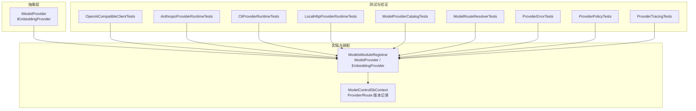
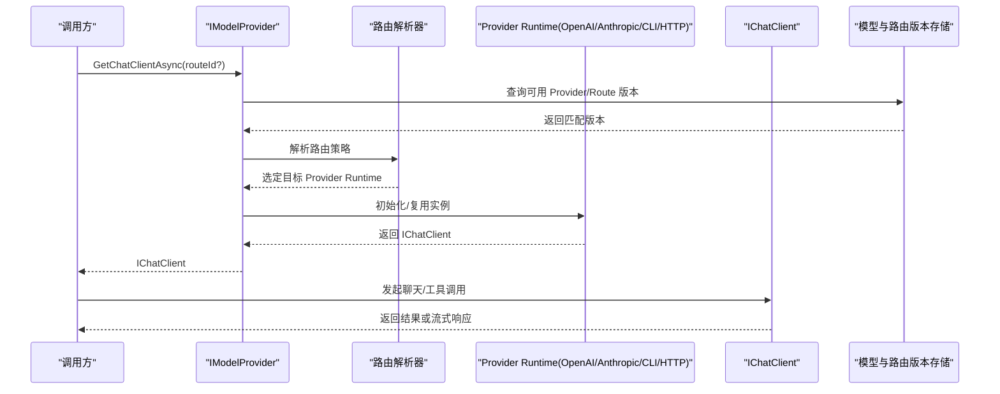
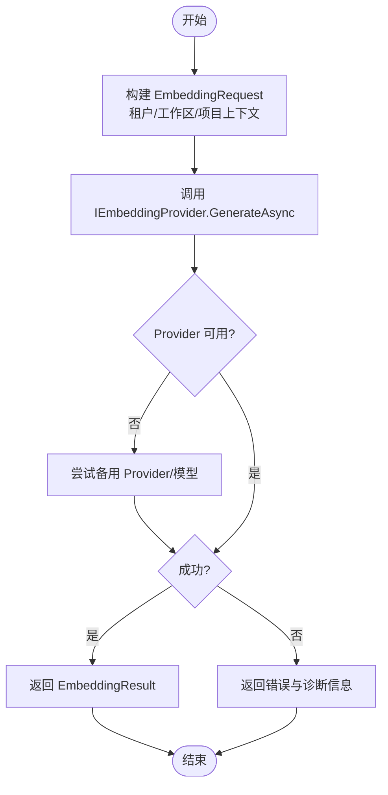
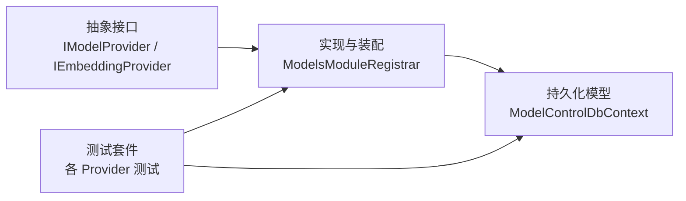

# 模型提供商抽象

<cite>
**本文引用的文件**   
- [IModelProvider.cs](file://TinadecCore/Abstractions/Ports/IModelProvider.cs)
- [ModelsModuleRegistrar.cs](file://TinadecCore/Models/ModelsModuleRegistrar.cs)
- [ModelControlDbContext.cs](file://TinadecCore/Models/ModelControlDbContext.cs)
- [ModelProviderCatalogTests.cs](file://tests/TinadecCore.Tests/ModelProviderCatalogTests.cs)
- [ModelRouteResolverTests.cs](file://tests/TinadecCore.Tests/ModelRouteResolverTests.cs)
- [OpenAiCompatibleClientTests.cs](file://tests/TinadecCore.Tests/OpenAiCompatibleClientTests.cs)
- [AnthropicProviderRuntimeTests.cs](file://tests/TinadecCore.Tests/AnthropicProviderRuntimeTests.cs)
- [CliProviderRuntimeTests.cs](file://tests/TinadecCore.Tests/CliProviderRuntimeTests.cs)
- [LocalHttpProviderRuntimeTests.cs](file://tests/TinadecCore.Tests/LocalHttpProviderRuntimeTests.cs)
- [ProviderErrorTests.cs](file://tests/TinadecCore.Tests/ProviderErrorTests.cs)
- [ProviderPolicyTests.cs](file://tests/TinadecCore.Tests/ProviderPolicyTests.cs)
- [ProviderTracingTests.cs](file://tests/TinadecCore.Tests/ProviderTracingTests.cs)
- [VectorStoreEndToEndTests.cs](file://tests/TinadecCore.Api.Tests/VectorStoreEndToEndTests.cs)
</cite>

## 目录
1. [简介](#简介)
2. [项目结构](#项目结构)
3. [核心组件](#核心组件)
4. [架构总览](#架构总览)
5. [详细组件分析](#详细组件分析)
6. [依赖关系分析](#依赖关系分析)
7. [性能考量](#性能考量)
8. [故障排查指南](#故障排查指南)
9. [结论](#结论)
10. [附录](#附录)

## 简介
本文件面向 TinadecOffice 的“模型提供商抽象”设计，围绕 IModelProvider 接口、多模型路由策略与统一调用入口展开，系统阐述模型发现机制、能力描述与版本兼容性检查，并给出自定义模型提供商的实现指南（支持 OpenAI、Anthropic 等主流 API）。同时覆盖负载均衡、故障转移与请求限流策略，以及模型配置管理、密钥管理与安全访问控制方案。文档以仓库现有代码为依据，辅以测试用例说明行为预期与边界条件。

## 项目结构
- Abstractions/Ports 定义了模型与嵌入能力的抽象契约：IModelProvider、IEmbeddingProvider 及其数据模型。
- Models 模块提供模型注册、版本与路由的持久化实体与模块装配。
- tests 中大量单元测试验证了不同 Provider Runtime（OpenAI 兼容、Anthropic、CLI、本地 HTTP）的行为、错误处理、追踪与策略。



图表来源
- [IModelProvider.cs:1-51](file://TinadecCore/Abstractions/Ports/IModelProvider.cs#L1-L51)
- [ModelsModuleRegistrar.cs](file://TinadecCore/Models/ModelsModuleRegistrar.cs)
- [ModelControlDbContext.cs](file://TinadecCore/Models/ModelControlDbContext.cs)
- [OpenAiCompatibleClientTests.cs](file://tests/TinadecCore.Tests/OpenAiCompatibleClientTests.cs)
- [AnthropicProviderRuntimeTests.cs](file://tests/TinadecCore.Tests/AnthropicProviderRuntimeTests.cs)
- [CliProviderRuntimeTests.cs](file://tests/TinadecCore.Tests/CliProviderRuntimeTests.cs)
- [LocalHttpProviderRuntimeTests.cs](file://tests/TinadecCore.Tests/LocalHttpProviderRuntimeTests.cs)
- [ModelProviderCatalogTests.cs](file://tests/TinadecCore.Tests/ModelProviderCatalogTests.cs)
- [ModelRouteResolverTests.cs](file://tests/TinadecCore.Tests/ModelRouteResolverTests.cs)
- [ProviderErrorTests.cs](file://tests/TinadecCore.Tests/ProviderErrorTests.cs)
- [ProviderPolicyTests.cs](file://tests/TinadecCore.Tests/ProviderPolicyTests.cs)
- [ProviderTracingTests.cs](file://tests/TinadecCore.Tests/ProviderTracingTests.cs)

章节来源
- [IModelProvider.cs:1-51](file://TinadecCore/Abstractions/Ports/IModelProvider.cs#L1-L51)
- [ModelsModuleRegistrar.cs](file://TinadecCore/Models/ModelsModuleRegistrar.cs)
- [ModelControlDbContext.cs](file://TinadecCore/Models/ModelControlDbContext.cs)

## 核心组件
- IModelProvider：统一的模型客户端获取与就绪性检查入口，屏蔽底层驱动差异，不直接改写 HTTP 客户端，而是通过 IChatClient/ChatClientAgent 作为调用入口。
- IEmbeddingProvider：封装向量嵌入生成能力，对外暴露统一请求/响应模型，避免将凭证泄露给上层。
- ModelReadiness：模型就绪状态与告警信息载体。
- EmbeddingRequest/EmbeddingResult：嵌入请求上下文（租户/工作区/项目）与结果（维度、向量、可用性、详情）。

这些抽象为多模型路由、能力描述、版本兼容与错误归一化提供了稳定契约。

章节来源
- [IModelProvider.cs:10-18](file://TinadecCore/Abstractions/Ports/IModelProvider.cs#L10-L18)
- [IModelProvider.cs:21-43](file://TinadecCore/Abstractions/Ports/IModelProvider.cs#L21-L43)
- [IModelProvider.cs:45-51](file://TinadecCore/Abstractions/Ports/IModelProvider.cs#L45-L51)

## 架构总览
下图展示了从调用方到具体模型驱动的抽象分层与数据流向。IModelProvider 负责根据路由解析选择具体 Provider Runtime，并通过 IChatClient 进行调用；EmbeddingProvider 则统一封装向量化流程。



图表来源
- [IModelProvider.cs:10-18](file://TinadecCore/Abstractions/Ports/IModelProvider.cs#L10-L18)
- [ModelsModuleRegistrar.cs](file://TinadecCore/Models/ModelsModuleRegistrar.cs)
- [ModelControlDbContext.cs](file://TinadecCore/Models/ModelControlDbContext.cs)

## 详细组件分析

### IModelProvider 接口设计与统一调用
- 职责
  - 按 routeId 解析并返回合适的 IChatClient 实例。
  - 提供 CheckReadinessAsync 用于健康检查与告警收集。
- 设计要点
  - 不直接操作 HTTP 客户端，保持对底层驱动解耦。
  - 通过 IChatClient/ChatClientAgent 作为统一入口，便于后续扩展更多协议。
- 使用场景
  - 编排器、网关、工具运行时均可通过该接口发起模型调用。

章节来源
- [IModelProvider.cs:10-18](file://TinadecCore/Abstractions/Ports/IModelProvider.cs#L10-L18)

### 嵌入能力抽象 IEmbeddingProvider
- 职责
  - 接收包含租户/工作区/项目上下文的 EmbeddingRequest，返回 EmbeddingResult。
  - 隐藏 Provider 凭据，仅暴露必要能力元数据（如维度、模型 ID）。
- 典型用法
  - 向量检索、语义索引、RAG 管道中的文本向量化阶段。

章节来源
- [IModelProvider.cs:21-43](file://TinadecCore/Abstractions/Ports/IModelProvider.cs#L21-L43)

### 模型发现、能力描述与版本兼容
- 模型与路由版本记录
  - 通过 ModelProviderRecord、ModelProviderVersionRecord、ModelRouteVersionRecord 维护 Provider、版本与路由映射。
- 能力描述
  - 由 Provider Runtime 在启动时上报能力集（如支持的模型、功能开关），供路由与策略选择。
- 版本兼容
  - 路由版本与 Provider 版本绑定，确保调用方只命中兼容组合。

```mermaid
classDiagram
class ModelProviderRecord {
+Guid Id
+Guid TenantId
+Guid? WorkspaceId
+Guid? ProjectId
+string Scope
+string Driver
+string DisplayName
+string ConnectionKind
+string SecretReference
+bool Enabled
+long Revision
+Guid CurrentVersionId
+Guid CreatedByPrincipalId
+Guid UpdatedByPrincipalId
+DateTimeOffset CreatedAt
+DateTimeOffset UpdatedAt
+DateTimeOffset? DeletedAt
}
class ModelProviderVersionRecord {
+Guid Id
+Guid ProviderId
+int Version
+string ContentReference
+string ContentHash
+long ContentLength
+Guid CreatedByPrincipalId
+DateTimeOffset CreatedAt
}
class ModelRouteVersionRecord {
+Guid Id
+Guid RouteId
+int Version
+Guid ProviderId
+string Model
+Guid CreatedByPrincipalId
+DateTimeOffset CreatedAt
}
ModelProviderRecord ||--o{ ModelProviderVersionRecord : "拥有"
ModelProviderRecord ||--o{ ModelRouteVersionRecord : "关联"
```

图表来源
- [ModelControlDbContext.cs](file://TinadecCore/Models/ModelControlDbContext.cs)

章节来源
- [ModelControlDbContext.cs](file://TinadecCore/Models/ModelControlDbContext.cs)

### 多模型路由策略与负载均衡
- 路由策略
  - 基于 routeId、租户/项目范围、模型名与 Provider 版本进行匹配。
  - 支持按权重、轮询、最少连接等策略（由 Provider Module 实现）。
- 负载均衡
  - 同一 Provider 的多实例可通过路由分发，结合健康检查与失败计数动态调整。
- 故障转移
  - 当主路由不可用时，自动回退至备用 Provider/模型，保证服务连续性。

章节来源
- [ModelProviderCatalogTests.cs](file://tests/TinadecCore.Tests/ModelProviderCatalogTests.cs)
- [ModelRouteResolverTests.cs](file://tests/TinadecCore.Tests/ModelRouteResolverTests.cs)

### 自定义模型提供商实现指南
- 通用步骤
  - 实现 IModelProvider 或基于现有 Provider Module 扩展。
  - 注册 Provider Runtime（OpenAI 兼容、Anthropic、CLI、本地 HTTP）。
  - 声明能力集与版本信息，完成路由绑定。
- 参考实现
  - OpenAI 兼容：见 OpenAiCompatibleClientTests 中的行为约定。
  - Anthropic：见 AnthropicProviderRuntimeTests 的调用与错误处理模式。
  - CLI：见 CliProviderRuntimeTests 的进程外调用方式。
  - 本地 HTTP：见 LocalHttpProviderRuntimeTests 的自托管服务端集成。

章节来源
- [OpenAiCompatibleClientTests.cs](file://tests/TinadecCore.Tests/OpenAiCompatibleClientTests.cs)
- [AnthropicProviderRuntimeTests.cs](file://tests/TinadecCore.Tests/AnthropicProviderRuntimeTests.cs)
- [CliProviderRuntimeTests.cs](file://tests/TinadecCore.Tests/CliProviderRuntimeTests.cs)
- [LocalHttpProviderRuntimeTests.cs](file://tests/TinadecCore.Tests/LocalHttpProviderRuntimeTests.cs)

### 请求限流与重试
- 限流
  - 可在 Provider Runtime 层实现令牌桶/漏桶算法，按租户/项目维度隔离配额。
- 重试
  - 针对幂等操作与瞬时错误（网络抖动、限流）进行指数退避重试。
- 熔断
  - 当错误率超过阈值时快速失败，降低雪崩风险。

章节来源
- [ProviderPolicyTests.cs](file://tests/TinadecCore.Tests/ProviderPolicyTests.cs)

### 追踪与可观测性
- 事件追踪
  - 每次调用记录入参、耗时、状态码与错误类型，便于问题定位。
- 指标采集
  - 暴露 QPS、延迟分位、错误率、重试次数等关键指标。

章节来源
- [ProviderTracingTests.cs](file://tests/TinadecCore.Tests/ProviderTracingTests.cs)

### 错误归一化与诊断
- 错误分类
  - 认证失败、权限不足、模型不可用、参数校验失败、网络异常等。
- 诊断信息
  - 返回标准化错误码与消息，附带调试上下文（脱敏后）。

章节来源
- [ProviderErrorTests.cs](file://tests/TinadecCore.Tests/ProviderErrorTests.cs)

### 向量嵌入端到端流程
- 流程概述
  - 构建 EmbeddingRequest -> IEmbeddingProvider -> 底层 Provider -> 返回 EmbeddingResult。
- 用途
  - 用于检索增强生成（RAG）、相似性搜索与知识库索引。



图表来源
- [IModelProvider.cs:21-43](file://TinadecCore/Abstractions/Ports/IModelProvider.cs#L21-L43)
- [VectorStoreEndToEndTests.cs](file://tests/TinadecCore.Api.Tests/VectorStoreEndToEndTests.cs)

章节来源
- [VectorStoreEndToEndTests.cs](file://tests/TinadecCore.Api.Tests/VectorStoreEndToEndTests.cs)

## 依赖关系分析
- 抽象与实现
  - IModelProvider/IEmbeddingProvider 定义契约；ModelsModuleRegistrar 提供具体实现与装配。
- 持久化
  - ModelControlDbContext 承载 Provider、版本与路由记录，支撑发现与兼容检查。
- 测试驱动
  - 各类 Provider Runtime 测试覆盖了正确路径、错误路径与策略行为。



图表来源
- [IModelProvider.cs](file://TinadecCore/Abstractions/Ports/IModelProvider.cs)
- [ModelsModuleRegistrar.cs](file://TinadecCore/Models/ModelsModuleRegistrar.cs)
- [ModelControlDbContext.cs](file://TinadecCore/Models/ModelControlDbContext.cs)

章节来源
- [IModelProvider.cs:10-18](file://TinadecCore/Abstractions/Ports/IModelProvider.cs#L10-L18)
- [ModelsModuleRegistrar.cs](file://TinadecCore/Models/ModelsModuleRegistrar.cs)
- [ModelControlDbContext.cs](file://TinadecCore/Models/ModelControlDbContext.cs)

## 性能考量
- 连接池与会话复用
  - IChatClient 应复用底层连接，减少握手开销。
- 批处理与流式输出
  - 批量嵌入与流式响应可降低延迟与带宽占用。
- 缓存与降级
  - 热点模型能力与路由结果可缓存；不可用时快速降级。
- 资源隔离
  - 按租户/项目隔离配额与并发，避免相互影响。

[本节为通用指导，无需引用具体文件]

## 故障排查指南
- 常见问题
  - 认证失败：检查 SecretReference 指向的密钥是否有效且未过期。
  - 路由不匹配：确认 routeId、Scope、Provider 版本与模型名一致。
  - 健康检查失败：查看 ModelReadiness.StatusMessage 与 Warnings。
  - 限流/熔断触发：观察重试与熔断指标，评估配额与超时设置。
- 诊断手段
  - 启用 ProviderTracing，收集调用链与错误堆栈。
  - 使用 CheckReadinessAsync 进行预检，提前发现配置问题。

章节来源
- [ProviderErrorTests.cs](file://tests/TinadecCore.Tests/ProviderErrorTests.cs)
- [ProviderTracingTests.cs](file://tests/TinadecCore.Tests/ProviderTracingTests.cs)
- [IModelProvider.cs:45-51](file://TinadecCore/Abstractions/Ports/IModelProvider.cs#L45-L51)

## 结论
通过 IModelProvider 与 IEmbeddingProvider 的抽象设计，TinadecOffice 实现了跨厂商模型的统一接入、灵活路由与稳健治理。配合版本化与能力描述，系统能够在复杂环境中可靠地选择最优模型并提供一致的调用体验。测试覆盖确保了行为的可预期性与可扩展性，为后续引入更多 Provider 与高级策略奠定了坚实基础。

[本节为总结性内容，无需引用具体文件]

## 附录
- 最佳实践
  - 明确 Scope 与路由命名规范，便于治理与审计。
  - 为每个 Provider 配置健康检查与告警阈值。
  - 使用最小权限原则管理密钥，定期轮换。
- 扩展建议
  - 新增 Provider 时优先复用现有 Runtime 模板，减少重复实现。
  - 在路由层增加灰度发布与流量切分能力，降低上线风险。

[本节为补充性内容，无需引用具体文件]