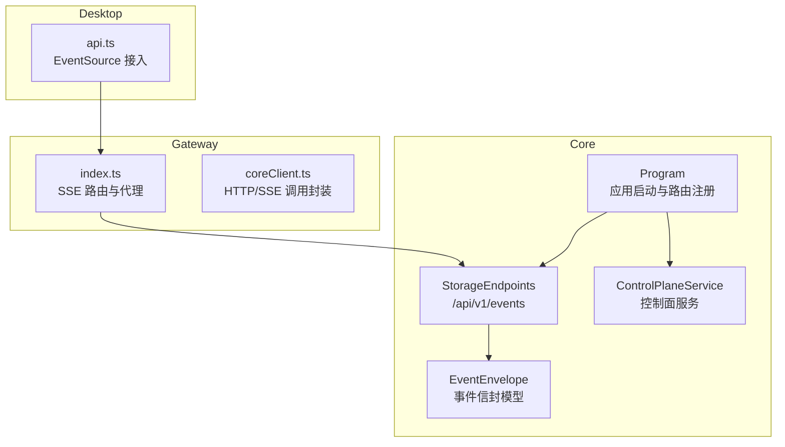
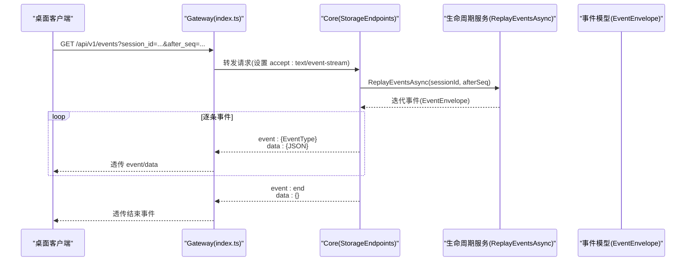
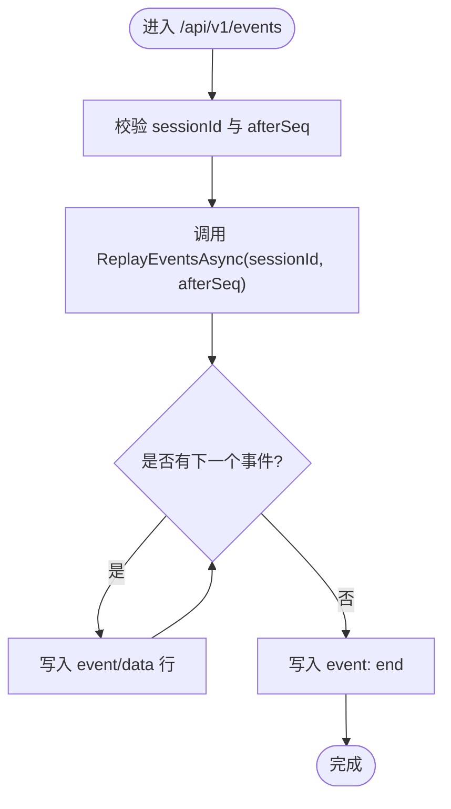
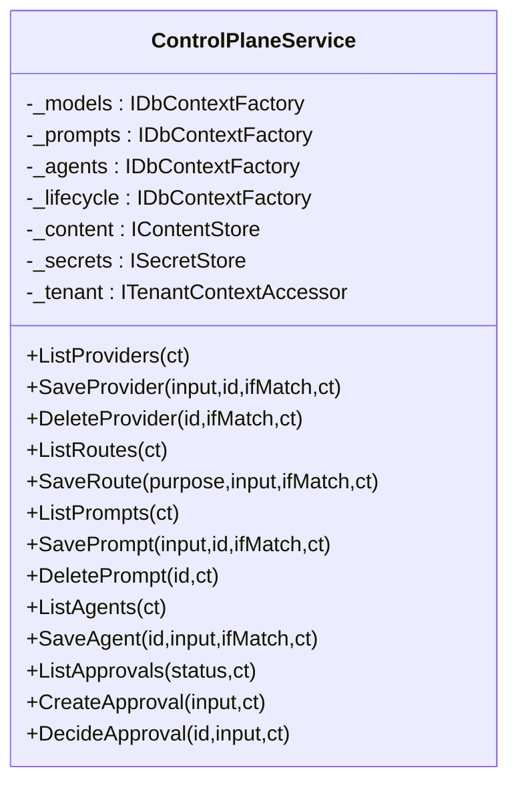
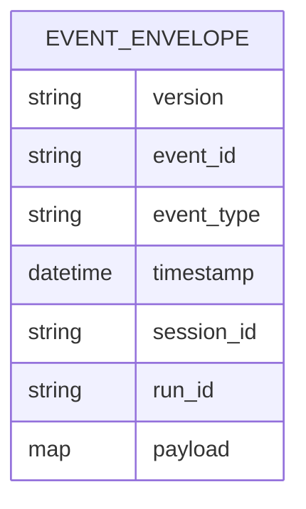
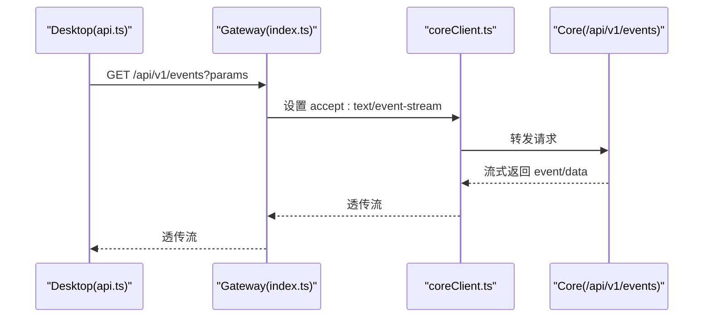
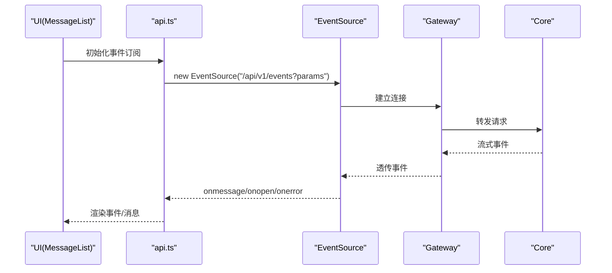
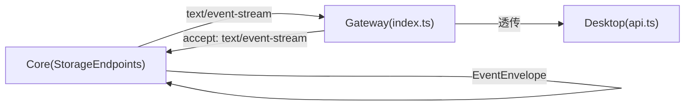

# SSE 实时通信

<cite>
**本文引用的文件**
- [StorageEndpoints.cs](file://TinadecCore\Api\Endpoints\StorageEndpoints.cs)
- [Program.cs](file://TinadecCore\Api\Program.cs)
- [ControlPlaneService.cs](file://TinadecCore\Runtime\ControlPlaneService.cs)
- [EventEnvelope.cs](file://TinadecCore\Contracts\Events\EventEnvelope.cs)
- [index.ts](file://TinadecGateway\src\index.ts)
- [coreClient.ts](file://TinadecGateway\src\coreClient.ts)
- [api.ts](file://apps\desktop\src\api.ts)
</cite>

## 目录
1. [简介](#简介)
2. [项目结构](#项目结构)
3. [核心组件](#核心组件)
4. [架构总览](#架构总览)
5. [详细组件分析](#详细组件分析)
6. [依赖关系分析](#依赖关系分析)
7. [性能考虑](#性能考虑)
8. [故障排查指南](#故障排查指南)
9. [结论](#结论)
10. [附录](#附录)

## 简介
本文件面向 Server-Sent Events（SSE）在系统中的实现与使用，重点说明：
- SSE 连接建立流程、事件推送机制与数据流格式
- ControlPlaneService 的职责边界（当前为控制面 CRUD，不包含事件广播）
- 客户端连接管理、事件过滤与订阅方式
- 错误处理、连接状态监控与性能优化策略
- 客户端集成示例与调试方法

## 项目结构
SSE 相关能力集中在 Core 的存储端点与 Gateway 的代理层，桌面端通过统一入口消费事件流。

图表来源
- [StorageEndpoints.cs:77-90](file://TinadecCore\Api\Endpoints\StorageEndpoints.cs#L77-L90)
- [Program.cs:171-173](file://TinadecCore\Api\Program.cs#L171-L173)
- [ControlPlaneService.cs:14-27](file://TinadecCore\Runtime\ControlPlaneService.cs#L14-L27)
- [EventEnvelope.cs:9-32](file://TinadecCore\Contracts\Events\EventEnvelope.cs#L9-L32)
- [index.ts:279-283](file://TinadecGateway\src\index.ts#L279-L283)
- [coreClient.ts:97](file://TinadecGateway\src\coreClient.ts#L97)
- [api.ts:1312](file://apps\desktop\src\api.ts#L1312)

章节来源
- [StorageEndpoints.cs:77-90](file://TinadecCore\Api\Endpoints\StorageEndpoints.cs#L77-L90)
- [Program.cs:171-173](file://TinadecCore\Api\Program.cs#L171-L173)

## 核心组件
- StorageEndpoints：提供 /api/v1/events 的 SSE 回放接口，按会话与序列号过滤，逐条写入 text/event-stream。
- Program：统一注册所有端点，确保 SSE 路由可用。
- ControlPlaneService：控制面服务，负责模型提供者、路由、提示词片段、Agent 配置与审批请求等 CRUD；当前未实现事件广播。
- EventEnvelope：事件信封，定义 event_id、event_type、timestamp、session_id、run_id、payload 等字段，作为 SSE 推送的数据载体。
- Gateway 层：将 Desktop 的 SSE 请求转发到 Core，并透传事件流。
- Desktop 层：使用 EventSource 订阅 /api/v1/events，解析 event/data 并更新 UI。

章节来源
- [StorageEndpoints.cs:77-90](file://TinadecCore\Api\Endpoints\StorageEndpoints.cs#L77-L90)
- [Program.cs:171-173](file://TinadecCore\Api\Program.cs#L171-L173)
- [ControlPlaneService.cs:14-27](file://TinadecCore\Runtime\ControlPlaneService.cs#L14-L27)
- [EventEnvelope.cs:9-32](file://TinadecCore\Contracts\Events\EventEnvelope.cs#L9-L32)
- [index.ts:279-283](file://TinadecGateway\src\index.ts#L279-L283)
- [coreClient.ts:97](file://TinadecGateway\src\coreClient.ts#L97)
- [api.ts:1312](file://apps\desktop\src\api.ts#L1312)

## 架构总览
SSE 端到端时序如下：

图表来源
- [index.ts:279-283](file://TinadecGateway\src\index.ts#L279-L283)
- [coreClient.ts:97](file://TinadecGateway\src\coreClient.ts#L97)
- [StorageEndpoints.cs:77-90](file://TinadecCore\Api\Endpoints\StorageEndpoints.cs#L77-L90)
- [EventEnvelope.cs:9-32](file://TinadecCore\Contracts\Events\EventEnvelope.cs#L9-L32)

## 详细组件分析

### StorageEndpoints 的 SSE 回放接口
- 路由：GET /api/v1/events
- 查询参数：
  - session_id/sessionId：按会话过滤
  - after_seq/afterSeq：从指定序列号之后回放
- 响应：
  - Content-Type: text/event-stream
  - Cache-Control: no-cache
  - 事件格式：event: {EventType}\ndata: {JSON}\n\n
  - 结束事件：event: end\ndata: {}\n\n

图表来源
- [StorageEndpoints.cs:77-90](file://TinadecCore\Api\Endpoints\StorageEndpoints.cs#L77-L90)

章节来源
- [StorageEndpoints.cs:77-90](file://TinadecCore\Api\Endpoints\StorageEndpoints.cs#L77-L90)

### ControlPlaneService 的职责与边界
- 职责：模型提供者、路由、提示词片段、Agent 配置、审批请求的 CRUD
- 非职责：事件广播、SSE 推送、连接管理
- 设计要点：
  - 通过 IDbContextFactory 访问多数据库上下文
  - 使用 IContentStore/ISecretStore 进行内容与密钥存取
  - 使用 ITenantContextAccessor 获取租户上下文
  - 对并发写采用 revision + If-Match 的乐观锁

图表来源
- [ControlPlaneService.cs:14-27](file://TinadecCore\Runtime\ControlPlaneService.cs#L14-L27)
- [ControlPlaneService.cs:36-70](file://TinadecCore\Runtime\ControlPlaneService.cs#L36-L70)

章节来源
- [ControlPlaneService.cs:14-27](file://TinadecCore\Runtime\ControlPlaneService.cs#L14-L27)
- [ControlPlaneService.cs:36-70](file://TinadecCore\Runtime\ControlPlaneService.cs#L36-L70)

### 事件模型 EventEnvelope
- 字段约定：
  - version：事件协议版本
  - event_id：唯一标识
  - event_type：事件类型（用于前端 event 字段）
  - timestamp：UTC 时间戳
  - session_id/run_id：关联会话与运行
  - payload：事件载荷字典

图表来源
- [EventEnvelope.cs:9-32](file://TinadecCore\Contracts\Events\EventEnvelope.cs#L9-L32)

章节来源
- [EventEnvelope.cs:9-32](file://TinadecCore\Contracts\Events\EventEnvelope.cs#L9-L32)

### Gateway 的 SSE 代理
- index.ts：暴露 /api/v1/events 路由，设置 content-type 为 text/event-stream，并将请求转发至 Core。
- coreClient.ts：以 accept: text/event-stream 发起 HTTP 请求，便于后续扩展或自定义代理逻辑。

图表来源
- [index.ts:279-283](file://TinadecGateway\src\index.ts#L279-L283)
- [coreClient.ts:97](file://TinadecGateway\src\coreClient.ts#L97)

章节来源
- [index.ts:279-283](file://TinadecGateway\src\index.ts#L279-L283)
- [coreClient.ts:97](file://TinadecGateway\src\coreClient.ts#L97)

### Desktop 的 SSE 客户端集成
- 使用 EventSource 订阅 /api/v1/events，监听不同 event 类型并渲染消息列表。
- 支持重连与断线恢复（由浏览器 EventSource 自动处理）。

图表来源
- [api.ts:1312](file://apps\desktop\src\api.ts#L1312)

章节来源
- [api.ts:1312](file://apps\desktop\src\api.ts#L1312)

## 依赖关系分析
- Core 侧：
  - StorageEndpoints 依赖生命周期服务进行事件回放，输出 EventEnvelope 序列化后的 JSON。
  - Program 统一注册 StorageEndpoints 与 ControlPlaneEndpoints。
- Gateway 侧：
  - index.ts 提供 SSE 路由与代理，coreClient.ts 提供带 accept 头的 HTTP 调用能力。
- Desktop 侧：
  - api.ts 通过 EventSource 消费 SSE 流，驱动 UI 更新。

图表来源
- [StorageEndpoints.cs:77-90](file://TinadecCore\Api\Endpoints\StorageEndpoints.cs#L77-L90)
- [index.ts:279-283](file://TinadecGateway\src\index.ts#L279-L283)
- [coreClient.ts:97](file://TinadecGateway\src\coreClient.ts#L97)
- [api.ts:1312](file://apps\desktop\src\api.ts#L1312)

章节来源
- [Program.cs:171-173](file://TinadecCore\Api\Program.cs#L171-L173)

## 性能考虑
- 服务端
  - 使用 text/event-stream 逐条写入，避免一次性构建大字符串，降低内存峰值。
  - 设置 Cache-Control: no-cache，防止中间缓存导致延迟。
  - 合理分页/游标（after_seq）减少首屏数据量。
- 网关
  - 保持流式透传，避免缓冲整段响应。
  - 限制并发与超时，防止背压堆积。
- 客户端
  - 使用 EventSource 自动重连，结合 last-event-id 语义（如需）实现幂等回放。
  - 前端按需渲染，避免频繁 DOM 操作造成卡顿。

[本节为通用建议，不直接分析具体文件]

## 故障排查指南
- 连接失败
  - 检查 /api/v1/events 路由是否已注册（Program 中 MapStorageEndpoints）。
  - 确认 Content-Type 为 text/event-stream，且未被反向代理修改。
- 事件丢失或重复
  - 核对 after_seq 参数是否正确传递。
  - 检查网络中断后 EventSource 的重连行为。
- 事件格式异常
  - 确认每个事件以 event: 和 data: 两行组成，并以空行结尾。
  - 验证 EventEnvelope 序列化结果是否符合预期。
- 控制面变更未生效
  - ControlPlaneService 仅做 CRUD，不涉及事件广播；需确认事件源是否独立于控制面。

章节来源
- [Program.cs:171-173](file://TinadecCore\Api\Program.cs#L171-L173)
- [StorageEndpoints.cs:77-90](file://TinadecCore\Api\Endpoints\StorageEndpoints.cs#L77-L90)
- [EventEnvelope.cs:9-32](file://TinadecCore\Contracts\Events\EventEnvelope.cs#L9-L32)

## 结论
- SSE 在系统中用于“回放”事件流，适合历史事件同步与增量回放场景。
- ControlPlaneService 专注控制面配置管理，不包含事件广播；事件广播应基于独立的发布/订阅或事件总线实现。
- Gateway 承担轻量代理职责，保证流式透传与协议一致性。
- Desktop 通过 EventSource 消费事件，具备较好的容错与重连能力。

[本节为总结性内容，不直接分析具体文件]

## 附录

### SSE 数据流格式规范
- 每行键值对：
  - id: {可选的事件ID}
  - event: {事件类型，对应 EventEnvelope.event_type}
  - data: {JSON 文本，对应 EventEnvelope 序列化结果}
  - （空行）
- 结束事件：
  - event: end
  - data: {}

章节来源
- [StorageEndpoints.cs:83-90](file://TinadecCore\Api\Endpoints\StorageEndpoints.cs#L83-L90)
- [EventEnvelope.cs:9-32](file://TinadecCore\Contracts\Events\EventEnvelope.cs#L9-L32)

### 客户端集成示例（概念步骤）
- 创建 EventSource 指向 /api/v1/events，附带 session_id 与 after_seq 参数。
- 监听 open 事件，记录连接状态。
- 监听 message 事件，根据 event 字段分发处理。
- 监听 error 事件，触发重连或告警。
- 收到 event: end 时，重置游标或关闭连接。

[本节为通用指导，不直接分析具体文件]