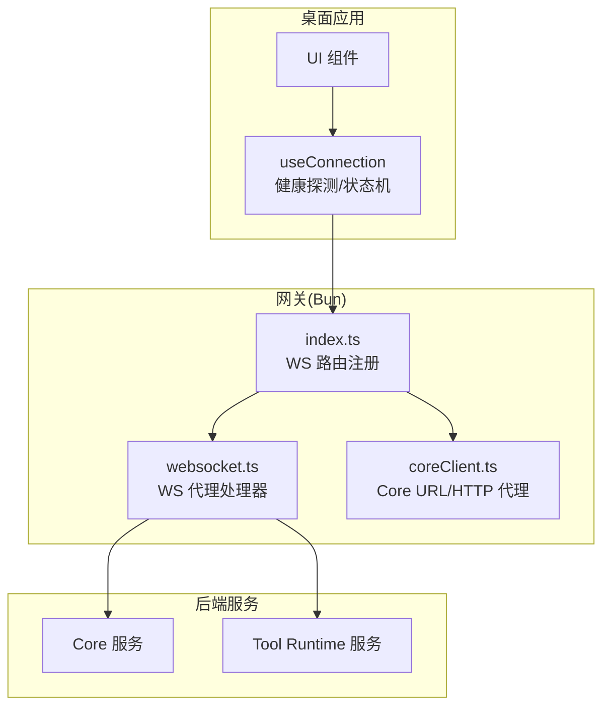
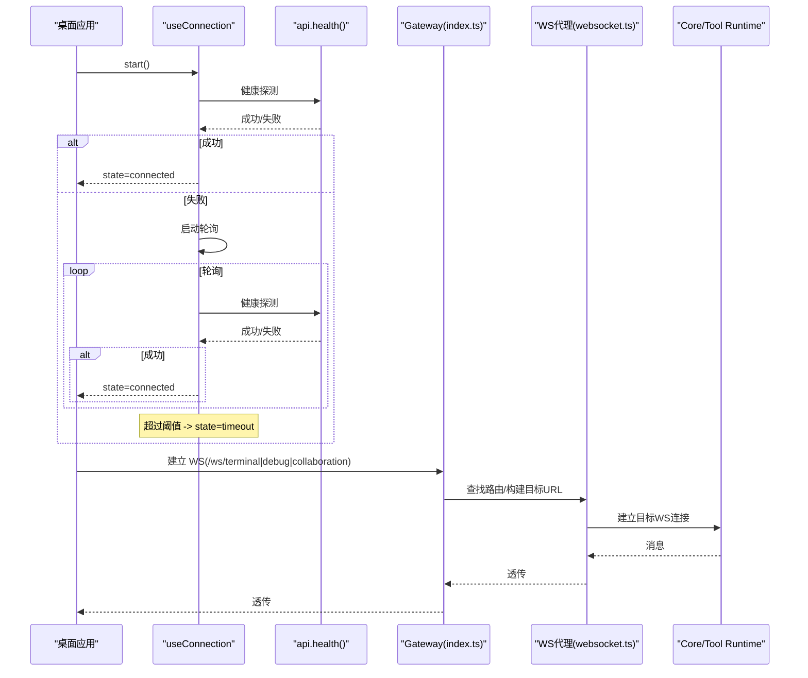
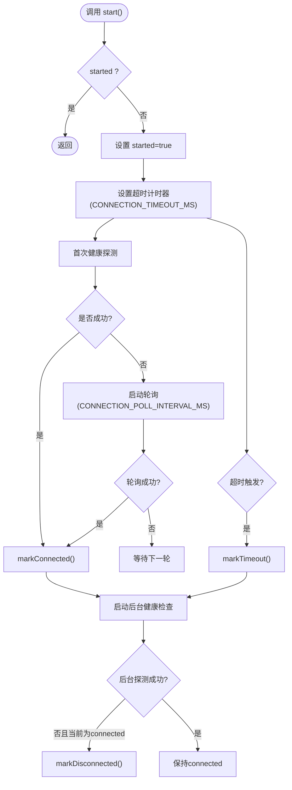
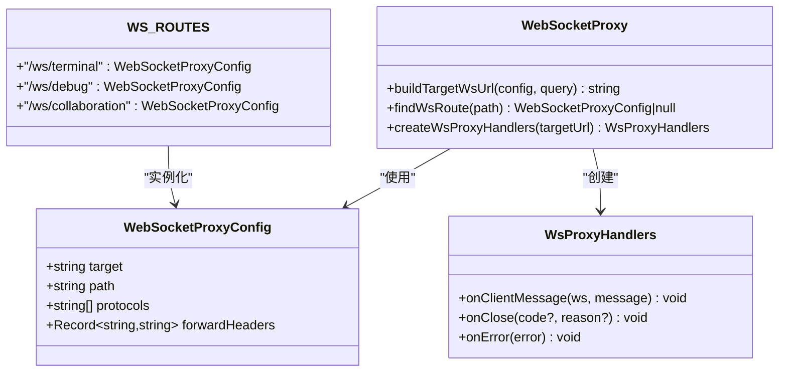
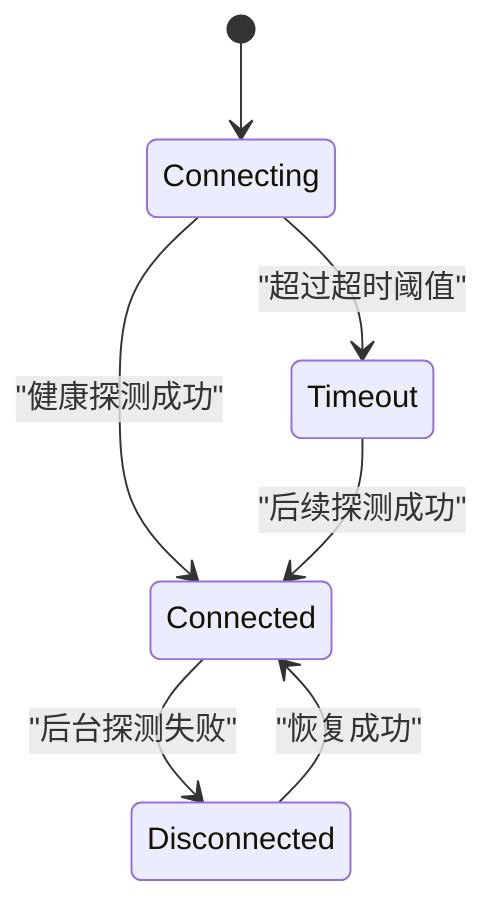
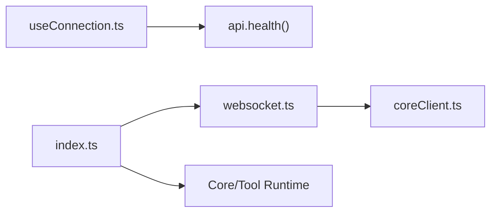

# WebSocket 连接管理

<cite>
**本文引用的文件**
- [apps/desktop/src/composables/useConnection.ts](file://apps/desktop/src/composables/useConnection.ts)
- [apps/desktop/src/composables/useConnection.test.ts](file://apps/desktop/src/composables/useConnection.test.ts)
- [TinadecGateway/src/websocket.ts](file://TinadecGateway/src/websocket.ts)
- [TinadecGateway/src/index.ts](file://TinadecGateway/src/index.ts)
- [TinadecGateway/src/coreClient.ts](file://TinadecGateway/src/coreClient.ts)
</cite>

## 目录
1. [简介](#简介)
2. [项目结构](#项目结构)
3. [核心组件](#核心组件)
4. [架构总览](#架构总览)
5. [详细组件分析](#详细组件分析)
6. [依赖关系分析](#依赖关系分析)
7. [性能与并发](#性能与并发)
8. [故障排查指南](#故障排查指南)
9. [结论](#结论)
10. [附录](#附录)

## 简介
本文件面向前端桌面应用（Electron）与后端网关（Bun）的 WebSocket 连接管理，重点说明：
- 连接建立、认证策略、心跳检测、断线重连机制
- useConnection 组合式函数的实现细节、连接状态机、消息路由与处理
- 连接池与并发控制、内存泄漏防护
- 调试工具使用与常见问题解决方案

## 项目结构
本项目在前后端两端分别实现了连接管理与透传能力：
- 前端（Electron/桌面应用）
  - useConnection 负责健康探测、超时与轮询、全局连接状态管理
- 网关（Bun）
  - websocket.ts 提供 WS 路由配置与代理处理器
  - index.ts 注册 /ws/terminal、/ws/debug、/ws/collaboration 等路由
  - coreClient.ts 提供 Core 服务 URL 与 HTTP/SSE/流式代理

图表来源
- [apps/desktop/src/composables/useConnection.ts:105-129](file://apps/desktop/src/composables/useConnection.ts#L105-L129)
- [TinadecGateway/src/index.ts:821-872](file://TinadecGateway/src/index.ts#L821-L872)
- [TinadecGateway/src/websocket.ts:51-74](file://TinadecGateway/src/websocket.ts#L51-L74)
- [TinadecGateway/src/coreClient.ts:22-30](file://TinadecGateway/src/coreClient.ts#L22-L30)

章节来源
- [apps/desktop/src/composables/useConnection.ts:1-138](file://apps/desktop/src/composables/useConnection.ts#L1-L138)
- [TinadecGateway/src/index.ts:821-872](file://TinadecGateway/src/index.ts#L821-L872)
- [TinadecGateway/src/websocket.ts:1-140](file://TinadecGateway/src/websocket.ts#L1-L140)
- [TinadecGateway/src/coreClient.ts:1-110](file://TinadecGateway/src/coreClient.ts#L1-L110)

## 核心组件
- useConnection（前端）
  - 暴露 connectionState、start、retryConnection
  - 内部维护单例 Ref 状态与定时器，支持 connecting/connected/timeout/disconnected 状态机
  - 通过 api.health() 进行健康探测，失败时轮询；超时后进入 timeout；已连接后持续后台健康检查
- Gateway WS 路由与代理（后端）
  - WS_ROUTES 定义 /ws/terminal、/ws/debug、/ws/collaboration 到目标服务的映射
  - buildTargetWsUrl 将 http(s) 转换为 ws(s)，并拼接路径与查询参数
  - createWsProxyHandlers 创建客户端与目标之间的双向透传处理器
- Core 客户端（后端）
  - coreUrl()/coreEndpoint() 提供 Core 基础地址与完整端点
  - proxyJson/proxySse/proxyStream 用于 JSON、SSE、流式数据转发

章节来源
- [apps/desktop/src/composables/useConnection.ts:105-129](file://apps/desktop/src/composables/useConnection.ts#L105-L129)
- [TinadecGateway/src/websocket.ts:35-45](file://TinadecGateway/src/websocket.ts#L35-L45)
- [TinadecGateway/src/websocket.ts:93-139](file://TinadecGateway/src/websocket.ts#L93-L139)
- [TinadecGateway/src/coreClient.ts:22-30](file://TinadecGateway/src/coreClient.ts#L22-L30)

## 架构总览
整体流程：
- 启动阶段：useConnection.start() 发起首次健康探测；成功则标记 connected，失败则按间隔轮询；超过阈值进入 timeout
- 运行阶段：后台定时健康检查，若从 connected 变为不可达则标记 disconnected
- 业务 WS：客户端通过 Gateway 的 /ws/* 路由连接到 Core 或 Tool Runtime，Gateway 作为反向代理透传消息

图表来源
- [apps/desktop/src/composables/useConnection.ts:105-129](file://apps/desktop/src/composables/useConnection.ts#L105-L129)
- [TinadecGateway/src/index.ts:821-872](file://TinadecGateway/src/index.ts#L821-L872)
- [TinadecGateway/src/websocket.ts:51-74](file://TinadecGateway/src/websocket.ts#L51-L74)

## 详细组件分析

### useConnection 组合式函数
- 职责
  - 维护全局连接状态（connecting/connected/timeout/disconnected）
  - 启动健康探测与轮询，设置超时
  - 后台健康检查，感知断开
  - 提供重试入口 retryConnection
- 关键实现要点
  - 单例 Ref 与标志位 started 保证幂等启动
  - clearTimers/clearWatch 清理定时器，避免内存泄漏
  - markConnected/markDisconnected/markTimeout 统一状态转换
  - probe 调用 api.health() 判断可达性
  - startHealthWatch 每 4 倍轮询间隔执行一次后台探测
- 复杂度与资源
  - 时间复杂度：O(1) 状态切换；轮询频率固定
  - 空间复杂度：常量级状态与句柄
  - 资源：setTimeout/setInterval 必须正确清理

图表来源
- [apps/desktop/src/composables/useConnection.ts:105-129](file://apps/desktop/src/composables/useConnection.ts#L105-L129)
- [apps/desktop/src/composables/useConnection.ts:30-94](file://apps/desktop/src/composables/useConnection.ts#L30-L94)

章节来源
- [apps/desktop/src/composables/useConnection.ts:1-138](file://apps/desktop/src/composables/useConnection.ts#L1-L138)
- [apps/desktop/src/composables/useConnection.test.ts:1-84](file://apps/desktop/src/composables/useConnection.test.ts#L1-L84)

### Gateway WebSocket 代理
- 路由表 WS_ROUTES
  - /ws/terminal → tool_runtime
  - /ws/debug → core
  - /ws/collaboration → core
- 目标 URL 构建
  - buildTargetWsUrl 将 http(s) 转为 ws(s)，并追加 path 与 query
- 消息透传
  - createWsProxyHandlers 建立目标 WS 与客户端 WS 的双向转发
  - onmessage/onclose/onerror 事件处理，确保关闭时释放资源
- 路由注册
  - index.ts 中 .ws(...) 注册三个端点，open/message/close 生命周期内订阅/发布通道

图表来源
- [TinadecGateway/src/websocket.ts:21-30](file://TinadecGateway/src/websocket.ts#L21-L30)
- [TinadecGateway/src/websocket.ts:35-45](file://TinadecGateway/src/websocket.ts#L35-L45)
- [TinadecGateway/src/websocket.ts:51-74](file://TinadecGateway/src/websocket.ts#L51-L74)
- [TinadecGateway/src/websocket.ts:80-87](file://TinadecGateway/src/websocket.ts#L80-L87)
- [TinadecGateway/src/websocket.ts:93-139](file://TinadecGateway/src/websocket.ts#L93-L139)

章节来源
- [TinadecGateway/src/websocket.ts:1-140](file://TinadecGateway/src/websocket.ts#L1-L140)
- [TinadecGateway/src/index.ts:821-872](file://TinadecGateway/src/index.ts#L821-L872)

### 连接状态机与时序
- 状态
  - connecting：启动后等待首次探测结果
  - connected：探测成功，进入稳定态
  - timeout：达到超时阈值仍未连通
  - disconnected：已连接后探测失败
- 时序
  - start() 设置超时与首次探测
  - 轮询直到成功或超时
  - 成功后开启后台健康检查

图表来源
- [apps/desktop/src/composables/useConnection.ts:10-16](file://apps/desktop/src/composables/useConnection.ts#L10-L16)
- [apps/desktop/src/composables/useConnection.ts:48-71](file://apps/desktop/src/composables/useConnection.ts#L48-L71)

章节来源
- [apps/desktop/src/composables/useConnection.ts:10-16](file://apps/desktop/src/composables/useConnection.ts#L10-L16)

## 依赖关系分析
- 前端依赖
  - useConnection 依赖 api.health() 进行健康探测
- 网关依赖
  - index.ts 依赖 websocket.ts 的路由与代理能力
  - websocket.ts 依赖 coreClient.ts 获取 Core URL
- 后端依赖
  - Core/Tool Runtime 提供 WS 端点

图表来源
- [apps/desktop/src/composables/useConnection.ts:105-129](file://apps/desktop/src/composables/useConnection.ts#L105-L129)
- [TinadecGateway/src/index.ts:821-872](file://TinadecGateway/src/index.ts#L821-L872)
- [TinadecGateway/src/websocket.ts:35-45](file://TinadecGateway/src/websocket.ts#L35-L45)
- [TinadecGateway/src/coreClient.ts:22-30](file://TinadecGateway/src/coreClient.ts#L22-L30)

章节来源
- [apps/desktop/src/composables/useConnection.ts:1-138](file://apps/desktop/src/composables/useConnection.ts#L1-L138)
- [TinadecGateway/src/index.ts:821-872](file://TinadecGateway/src/index.ts#L821-L872)
- [TinadecGateway/src/websocket.ts:1-140](file://TinadecGateway/src/websocket.ts#L1-L140)
- [TinadecGateway/src/coreClient.ts:1-110](file://TinadecGateway/src/coreClient.ts#L1-L110)

## 性能与并发
- 轮询与心跳
  - useConnection 使用固定间隔轮询与后台健康检查，避免频繁请求
  - 建议根据网络质量调整轮询间隔与超时阈值
- 连接池与并发
  - 当前未实现显式连接池；Gateway 对每个 WS 路由独立处理
  - 如需优化，可在 Gateway 层引入连接池与限流，减少重复握手与拥塞
- 内存泄漏防护
  - useConnection 提供 clearTimers/clearWatch 并在状态变更时清理
  - Gateway WS 代理在 close/error 时关闭目标连接并置空引用
  - 建议在组件卸载时主动调用清理逻辑（如存在自定义 WS 实例）

[本节为通用指导，不直接分析具体文件]

## 故障排查指南
- 常见问题
  - 无法建立 WS：检查 Gateway 路由是否正确、目标服务可达性
  - 频繁断开：确认网络稳定性与后端服务负载；适当增大超时与轮询间隔
  - 状态卡在 connecting：查看 api.health() 响应与网络错误日志
  - 内存占用增长：检查是否存在未清理的定时器或 WS 引用
- 调试方法
  - 使用浏览器/开发者工具观察 WS 帧与状态变化
  - 在 Gateway 层打印路由匹配与消息透传情况
  - 使用 __resetConnectionForTests 重置前端连接状态（测试场景）

章节来源
- [apps/desktop/src/composables/useConnection.test.ts:1-84](file://apps/desktop/src/composables/useConnection.test.ts#L1-L84)
- [TinadecGateway/src/websocket.ts:93-139](file://TinadecGateway/src/websocket.ts#L93-L139)

## 结论
- useConnection 提供了稳健的前端连接状态管理与健康探测机制
- Gateway 的 WS 路由与代理实现了端到端的透明转发
- 通过合理的轮询、超时与清理策略，可保障连接可靠性与资源安全
- 未来可扩展连接池、鉴权、心跳协议与更完善的监控指标

[本节为总结，不直接分析具体文件]

## 附录
- 扩展建议
  - 在前端增加 WS 心跳包与自动重连退避策略
  - 在 Gateway 层增加鉴权中间件与访问审计
  - 引入连接池与背压控制，提升高并发下的稳定性
- 参考实现位置
  - 前端连接状态：apps/desktop/src/composables/useConnection.ts
  - 网关 WS 路由与代理：TinadecGateway/src/index.ts、TinadecGateway/src/websocket.ts
  - Core 客户端：TinadecGateway/src/coreClient.ts

[本节为补充信息，不直接分析具体文件]