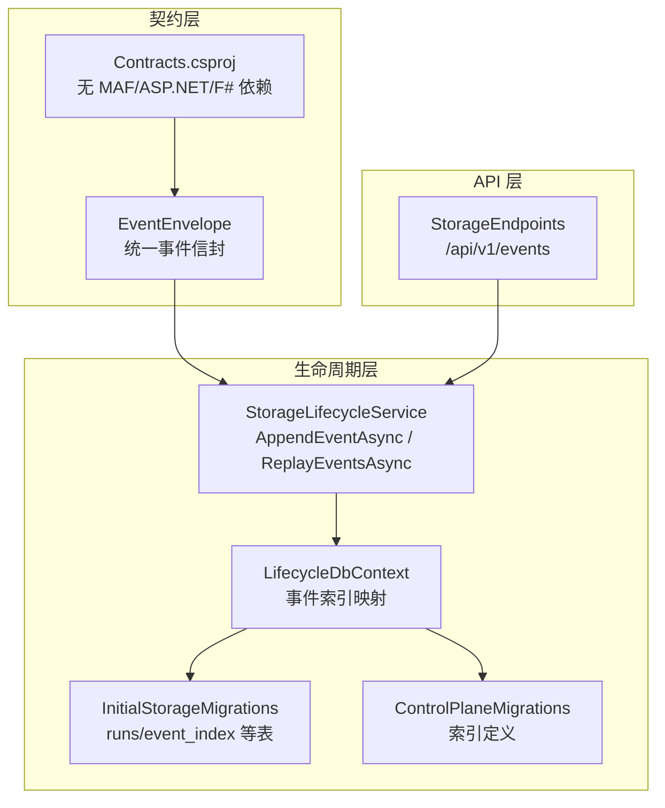
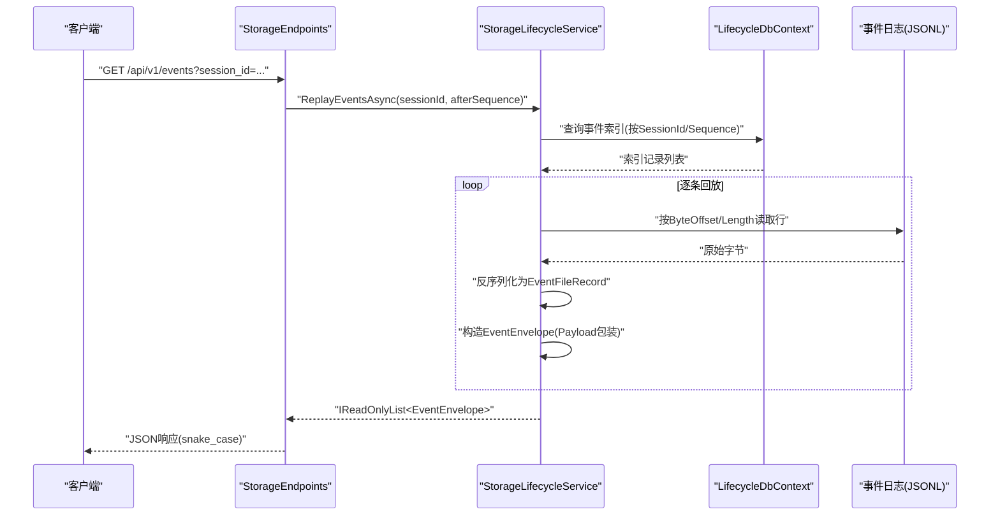
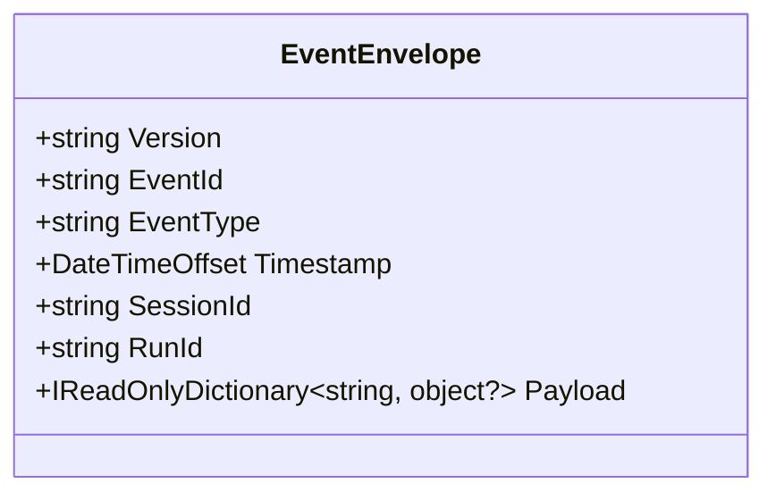
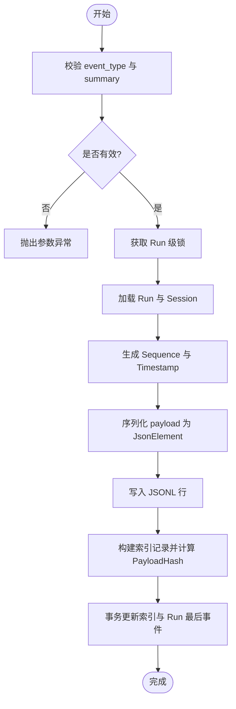
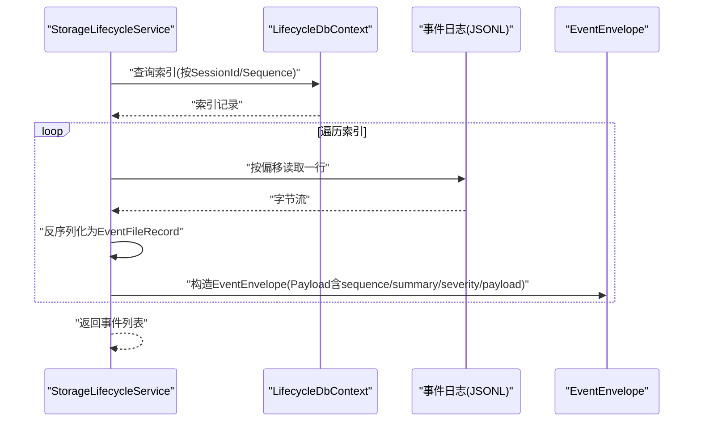
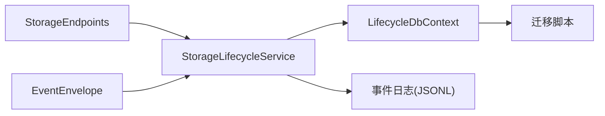

# 事件信封格式

<cite>
**本文引用的文件**   
- [EventEnvelope.cs](file://TinadecCore/Contracts/Events/EventEnvelope.cs)
- [EventEnvelopeTests.cs](file://tests/Tinadec.Contracts.Tests/EventEnvelopeTests.cs)
- [StorageLifecycleService.cs](file://TinadecCore/Lifecycle/StorageLifecycleService.cs)
- [LifecycleDbContext.cs](file://TinadecCore/Lifecycle/LifecycleDbContext.cs)
- [InitialStorageMigrations.cs](file://TinadecCore/Storage.Migrations.PostgreSql/InitialStorageMigrations.cs)
- [ControlPlaneMigrations.cs](file://TinadecCore/Storage.Migrations.PostgreSql/ControlPlaneMigrations.cs)
- [StorageEndpoints.cs](file://TinadecCore/Api/Endpoints/StorageEndpoints.cs)
- [TinadecCore.Contracts.csproj](file://TinadecCore/Contracts/TinadecCore.Contracts.csproj)
</cite>

## 目录
1. [简介](#简介)
2. [项目结构](#项目结构)
3. [核心组件](#核心组件)
4. [架构总览](#架构总览)
5. [详细组件分析](#详细组件分析)
6. [依赖关系分析](#依赖关系分析)
7. [性能考虑](#性能考虑)
8. [故障排查指南](#故障排查指南)
9. [结论](#结论)
10. [附录](#附录)

## 简介
本文件面向 EventEnvelope 统一事件格式，系统性说明其字段定义、版本管理、JSON 序列化约定（snake_case）、事件类型分类与负载结构设计、时间戳处理策略、创建示例、验证规则、向后兼容性保证，以及与 MAF 和 F# 类型的隔离设计原则。该文档旨在帮助开发者在跨语言、跨模块的系统中稳定地生产与消费事件数据。

## 项目结构
EventEnvelope 位于 Contracts 层，作为对外暴露的纯 DTO，不包含任何框架或领域实现细节；事件持久化与回放逻辑位于 Lifecycle 层；API 端点通过 StorageEndpoints 提供查询能力；数据库迁移脚本定义了索引与表结构，确保事件可检索与回放。

图表来源 
- [EventEnvelope.cs:1-33](file://TinadecCore/Contracts/Events/EventEnvelope.cs#L1-L33)
- [StorageLifecycleService.cs:78-179](file://TinadecCore/Lifecycle/StorageLifecycleService.cs#L78-L179)
- [LifecycleDbContext.cs:28-62](file://TinadecCore/Lifecycle/LifecycleDbContext.cs#L28-L62)
- [InitialStorageMigrations.cs:31](file://TinadecCore/Storage.Migrations.PostgreSql/InitialStorageMigrations.cs#L31)
- [ControlPlaneMigrations.cs:47-48](file://TinadecCore/Storage.Migrations.PostgreSql/ControlPlaneMigrations.cs#L47-L48)
- [StorageEndpoints.cs:77-98](file://TinadecCore/Api/Endpoints/StorageEndpoints.cs#L77-L98)
- [TinadecCore.Contracts.csproj:1-10](file://TinadecCore/Contracts/TinadecCore.Contracts.csproj#L1-L10)

章节来源
- [EventEnvelope.cs:1-33](file://TinadecCore/Contracts/Events/EventEnvelope.cs#L1-L33)
- [StorageLifecycleService.cs:78-179](file://TinadecCore/Lifecycle/StorageLifecycleService.cs#L78-L179)
- [LifecycleDbContext.cs:28-62](file://TinadecCore/Lifecycle/LifecycleDbContext.cs#L28-L62)
- [InitialStorageMigrations.cs:31](file://TinadecCore/Storage.Migrations.PostgreSql/InitialStorageMigrations.cs#L31)
- [ControlPlaneMigrations.cs:47-48](file://TinadecCore/Storage.Migrations.PostgreSql/ControlPlaneMigrations.cs#L47-L48)
- [StorageEndpoints.cs:77-98](file://TinadecCore/Api/Endpoints/StorageEndpoints.cs#L77-L98)
- [TinadecCore.Contracts.csproj:1-10](file://TinadecCore/Contracts/TinadecCore.Contracts.csproj#L1-L10)

## 核心组件
- EventEnvelope：统一事件信封，包含版本、标识、类型、时间、会话与运行上下文以及可扩展负载。
- StorageLifecycleService：负责事件的追加、索引、回放与一致性校验。
- LifecycleDbContext：将事件索引映射到数据库列名（snake_case），保持与 API 边界一致。
- StorageEndpoints：对外暴露事件查询接口，兼容 session_id/sessionId 两种命名。
- 迁移脚本：定义 runs、event_index 等表结构与索引，保障查询性能与回放能力。

章节来源
- [EventEnvelope.cs:1-33](file://TinadecCore/Contracts/Events/EventEnvelope.cs#L1-L33)
- [StorageLifecycleService.cs:78-179](file://TinadecCore/Lifecycle/StorageLifecycleService.cs#L78-L179)
- [LifecycleDbContext.cs:28-62](file://TinadecCore/Lifecycle/LifecycleDbContext.cs#L28-L62)
- [StorageEndpoints.cs:77-98](file://TinadecCore/Api/Endpoints/StorageEndpoints.cs#L77-L98)
- [InitialStorageMigrations.cs:31](file://TinadecCore/Storage.Migrations.PostgreSql/InitialStorageMigrations.cs#L31)
- [ControlPlaneMigrations.cs:47-48](file://TinadecCore/Storage.Migrations.PostgreSql/ControlPlaneMigrations.cs#L47-L48)

## 架构总览
事件从业务侧产生，经 StorageLifecycleService.AppendEventAsync 写入 JSONL 事件日志并建立索引；回放时按 SessionId、Sequence 过滤，读取对应行并反序列化为 EventEnvelope 返回给调用方。API 层对请求参数进行 snake_case 兼容处理，确保前端与后端命名约定一致。

图表来源 
- [StorageEndpoints.cs:77-98](file://TinadecCore/Api/Endpoints/StorageEndpoints.cs#L77-L98)
- [StorageLifecycleService.cs:146-179](file://TinadecCore/Lifecycle/StorageLifecycleService.cs#L146-L179)
- [LifecycleDbContext.cs:28-62](file://TinadecCore/Lifecycle/LifecycleDbContext.cs#L28-L62)

## 详细组件分析

### EventEnvelope 字段与序列化
- 字段定义
  - version：字符串，默认值为 SchemaVersion，用于事件协议版本控制。
  - event_id：唯一标识，默认生成 GUID 小写形式。
  - event_type：事件类型字符串，由生产者指定。
  - timestamp：UTC 时间戳，使用 DateTimeOffset.UtcNow。
  - session_id：可选，关联会话。
  - run_id：可选，关联运行实例。
  - payload：键值字典，支持任意对象值，便于扩展。
- 序列化约定
  - 使用 System.Text.Json，属性名通过 JsonPropertyName 映射为 snake_case（如 event_id、event_type、timestamp、session_id、run_id、payload）。
  - 测试中演示了全局 SnakeCaseLower 命名策略，同时要求 DictionaryKeyPolicy 也采用 snake_case，以保证负载内键名一致。
- 时间戳策略
  - 写入时使用 UTC 时间，避免时区歧义；回放输出保留 UTC 时间。
- 版本管理
  - 常量 SchemaVersion 与实例 Version 保持一致；回放时将持久化的 Version 回填至信封，便于消费者按版本解析。

图表来源 
- [EventEnvelope.cs:1-33](file://TinadecCore/Contracts/Events/EventEnvelope.cs#L1-L33)

章节来源
- [EventEnvelope.cs:1-33](file://TinadecCore/Contracts/Events/EventEnvelope.cs#L1-L33)
- [EventEnvelopeTests.cs:1-31](file://tests/Tinadec.Contracts.Tests/EventEnvelopeTests.cs#L1-L31)

### 事件创建与验证
- 创建流程
  - 入参校验：event_type 与 summary 非空，否则抛出异常。
  - 并发控制：基于 RunId 的信号量保证单运行串行追加。
  - 数据准备：分配 Sequence、Timestamp，序列化 payload 为 JsonElement。
  - 持久化：写入 JSONL 行，计算 PayloadHash，更新索引与 Run 最后事件信息。
- 验证规则
  - 必填字段校验（event_type、summary）。
  - 运行时存在性校验（Run、Session 必须存在）。
  - 幂等与一致性：PayloadHash 用于完整性校验；事务包裹索引与 Run 更新。

图表来源 
- [StorageLifecycleService.cs:78-144](file://TinadecCore/Lifecycle/StorageLifecycleService.cs#L78-L144)

章节来源
- [StorageLifecycleService.cs:78-144](file://TinadecCore/Lifecycle/StorageLifecycleService.cs#L78-L144)

### 事件回放与封装
- 回放流程
  - 根据 sessionId 与 afterSequence 筛选索引。
  - 按 ByteOffset/ByteLength 定位并读取 JSONL 行。
  - 反序列化为 EventFileRecord，再封装为 EventEnvelope，并将 sequence、summary、severity、payload 放入 Payload 字典。
- 输出结构
  - EventEnvelope 的 Payload 包含回放所需的元信息与原始负载，便于上层统一消费。

图表来源 
- [StorageLifecycleService.cs:146-179](file://TinadecCore/Lifecycle/StorageLifecycleService.cs#L146-L179)

章节来源
- [StorageLifecycleService.cs:146-179](file://TinadecCore/Lifecycle/StorageLifecycleService.cs#L146-L179)

### API 边界与命名约定
- 端点兼容
  - /api/v1/events 同时接受 sessionId 与 session_id 参数，内部选择其一。
- 响应体
  - 使用匿名对象以 snake_case 字段名返回（如 session_id、run_id、created_at 等），与事件信封保持一致。

章节来源
- [StorageEndpoints.cs:77-98](file://TinadecCore/Api/Endpoints/StorageEndpoints.cs#L77-L98)

### 数据库映射与索引
- 列名映射
  - DbContext 中将实体属性映射为 snake_case 列名（如 session_id、event_id、run_id、event_type 等），与 API 与事件信封保持一致。
- 索引优化
  - 针对 tenant/workspace/session/timestamp 等维度建立复合索引，提升回放与查询性能。

章节来源
- [LifecycleDbContext.cs:28-62](file://TinadecCore/Lifecycle/LifecycleDbContext.cs#L28-L62)
- [ControlPlaneMigrations.cs:47-48](file://TinadecCore/Storage.Migrations.PostgreSql/ControlPlaneMigrations.cs#L47-L48)
- [InitialStorageMigrations.cs:31](file://TinadecCore/Storage.Migrations.PostgreSql/InitialStorageMigrations.cs#L31)

### 版本管理与向后兼容
- 版本字段
  - EventEnvelope.SchemaVersion 与实例 Version 保持一致，回放时回填，便于消费者按版本解析。
- 负载演进
  - Payload 为字典结构，新增字段不影响旧消费者；必要时可在 summary/severity 中提示变更。
- 回放一致性
  - PayloadHash 用于检测负载完整性；Reconcile 过程忽略损坏行并记录诊断信息。

章节来源
- [EventEnvelope.cs:1-33](file://TinadecCore/Contracts/Events/EventEnvelope.cs#L1-L33)
- [StorageLifecycleService.cs:181-217](file://TinadecCore/Lifecycle/StorageLifecycleService.cs#L181-L217)

### 与 MAF 和 F# 的隔离设计
- 契约层纯净
  - Contracts 项目明确声明“无 MAF、ASP.NET、F# 依赖”，确保事件信封作为跨语言、跨进程的稳定边界。
- 类型隔离
  - EventEnvelope 仅使用基础类型与字典，不引入领域或框架类型，降低耦合。

章节来源
- [TinadecCore.Contracts.csproj:1-10](file://TinadecCore/Contracts/TinadecCore.Contracts.csproj#L1-L10)
- [EventEnvelope.cs:1-33](file://TinadecCore/Contracts/Events/EventEnvelope.cs#L1-L33)

## 依赖关系分析
- 低耦合
  - EventEnvelope 仅依赖 System.Text.Json 与基础类型；生命周期服务依赖 EF Core 与文件系统；API 层依赖控制器与存储服务。
- 关键依赖链
  - StorageEndpoints -> StorageLifecycleService -> LifecycleDbContext -> 数据库
  - StorageLifecycleService -> 文件系统(JSONL)
- 潜在循环
  - 当前分层清晰，未见循环依赖。

图表来源 
- [StorageEndpoints.cs:77-98](file://TinadecCore/Api/Endpoints/StorageEndpoints.cs#L77-L98)
- [StorageLifecycleService.cs:78-179](file://TinadecCore/Lifecycle/StorageLifecycleService.cs#L78-L179)
- [LifecycleDbContext.cs:28-62](file://TinadecCore/Lifecycle/LifecycleDbContext.cs#L28-L62)
- [InitialStorageMigrations.cs:31](file://TinadecCore/Storage.Migrations.PostgreSql/InitialStorageMigrations.cs#L31)
- [ControlPlaneMigrations.cs:47-48](file://TinadecCore/Storage.Migrations.PostgreSql/ControlPlaneMigrations.cs#L47-L48)
- [EventEnvelope.cs:1-33](file://TinadecCore/Contracts/Events/EventEnvelope.cs#L1-L33)

章节来源
- [StorageEndpoints.cs:77-98](file://TinadecCore/Api/Endpoints/StorageEndpoints.cs#L77-L98)
- [StorageLifecycleService.cs:78-179](file://TinadecCore/Lifecycle/StorageLifecycleService.cs#L78-L179)
- [LifecycleDbContext.cs:28-62](file://TinadecCore/Lifecycle/LifecycleDbContext.cs#L28-L62)
- [InitialStorageMigrations.cs:31](file://TinadecCore/Storage.Migrations.PostgreSql/InitialStorageMigrations.cs#L31)
- [ControlPlaneMigrations.cs:47-48](file://TinadecCore/Storage.Migrations.PostgreSql/ControlPlaneMigrations.cs#L47-L48)
- [EventEnvelope.cs:1-33](file://TinadecCore/Contracts/Events/EventEnvelope.cs#L1-L33)

## 性能考虑
- 追加性能
  - 使用 AppendLineAsync 追加到 JSONL，WriteThrough 选项确保落盘可靠性；批量回放时按偏移顺序读取，减少随机 IO。
- 索引优化
  - 针对常用查询维度建立复合索引，提高回放与统计效率。
- 序列化开销
  - payload 使用 JsonElement 存储，避免重复序列化；回放时按需构造字典，减少内存占用。
- 并发控制
  - 基于 Run 级别的信号量串行写入，避免竞争与乱序。

[本节为通用指导，不直接分析具体文件]

## 故障排查指南
- 常见错误
  - 参数缺失：event_type 或 summary 为空将抛出参数异常。
  - 资源不存在：Run 或 Session 未找到将抛出相应异常。
  - 数据损坏：JSONL 行解析失败将被忽略并记录诊断信息。
- 排查步骤
  - 检查事件索引是否存在且有序。
  - 核对 PayloadHash 与原始字节一致性。
  - 查看 Reconcile 诊断消息，定位损坏行位置。

章节来源
- [StorageLifecycleService.cs:78-144](file://TinadecCore/Lifecycle/StorageLifecycleService.cs#L78-L144)
- [StorageLifecycleService.cs:181-217](file://TinadecCore/Lifecycle/StorageLifecycleService.cs#L181-L217)

## 结论
EventEnvelope 以简洁、稳定的契约定义统一事件格式，配合 snake_case 命名约定与 UTC 时间戳策略，确保跨语言、跨模块的一致性。通过版本字段与可扩展负载设计，系统在演进过程中保持向后兼容。生命周期服务提供可靠的追加、索引与回放能力，API 层对命名进行兼容处理，整体架构清晰、解耦良好，适合大规模分布式场景下的事件驱动需求。

[本节为总结，不直接分析具体文件]

## 附录
- 事件类型分类建议
  - 采用“域.动作.子动作”三段式命名（如 agent.event.delta、tool.shell），便于归类与路由。
- 负载结构设计建议
  - 将结构化数据放入 payload 字典，键名遵循 snake_case；对敏感字段进行脱敏或哈希。
- 时间戳处理策略
  - 统一使用 UTC 时间；如需本地展示，应在消费端进行时区转换。
- 创建示例（路径引用）
  - 参考测试中的创建与序列化方式，确保字典键名与属性名均符合 snake_case 约定。

章节来源
- [EventEnvelopeTests.cs:1-31](file://tests/Tinadec.Contracts.Tests/EventEnvelopeTests.cs#L1-L31)