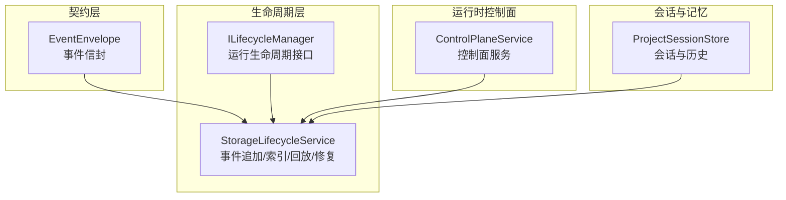
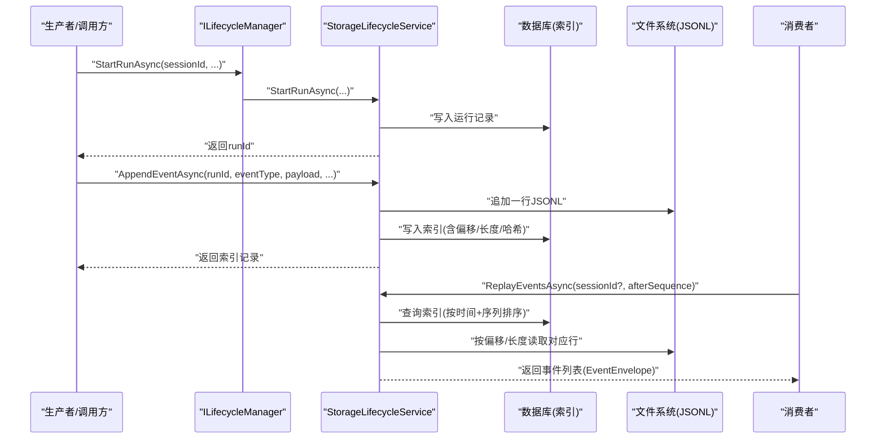
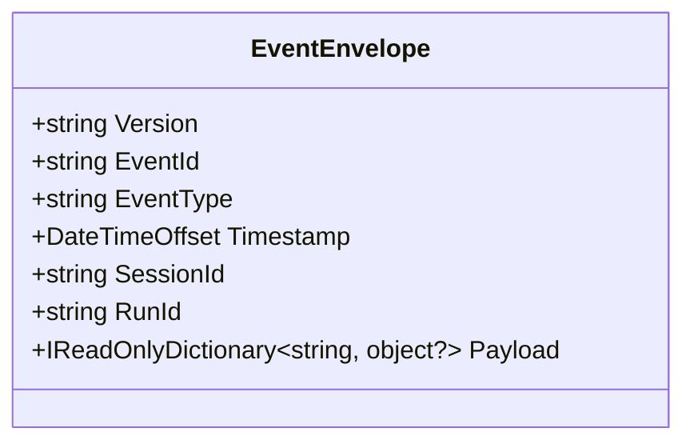
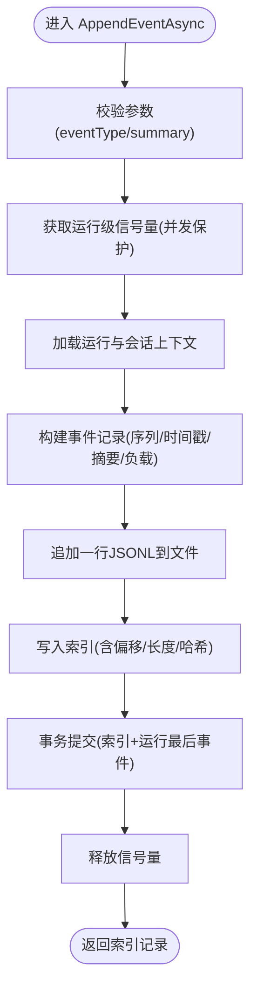
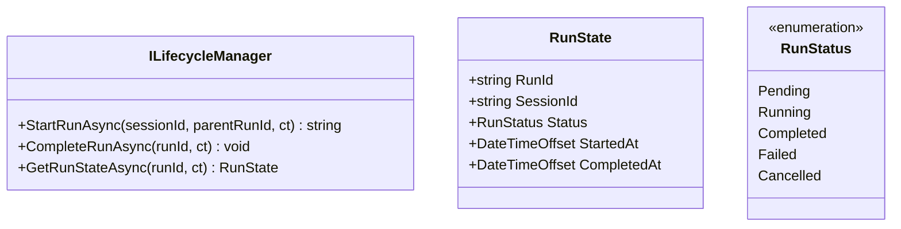
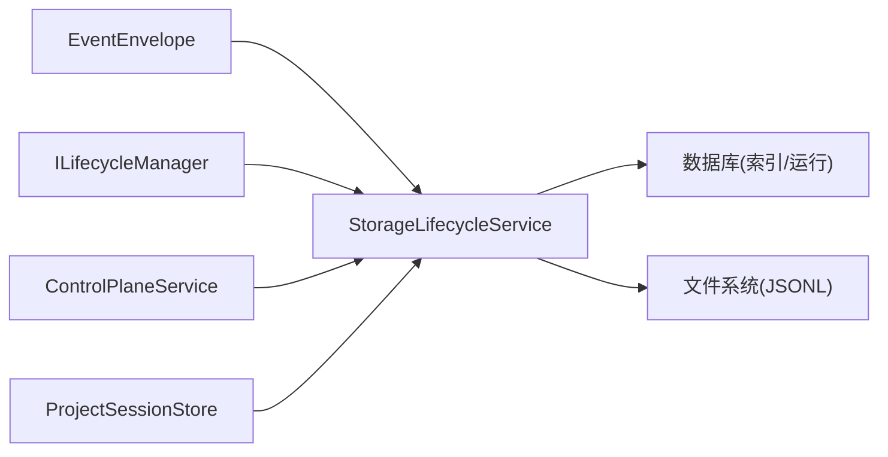

# 异步消息处理

<cite>
**本文引用的文件**
- [EventEnvelope.cs](file://TinadecCore/Contracts/Events/EventEnvelope.cs)
- [StorageLifecycleService.cs](file://TinadecCore/Lifecycle/StorageLifecycleService.cs)
- [ILifecycleManager.cs](file://TinadecCore/Abstractions/Ports/ILifecycleManager.cs)
- [ControlPlaneService.cs](file://TinadecCore/Runtime/ControlPlaneService.cs)
- [ProjectSessionStore.cs](file://TinadecCore/Memory/ProjectSessionStore.cs)
- [ServiceCollectionExtensions.cs](file://TinadecCore/Persistence/ServiceCollectionExtensions.cs)
- [ArchitectureTests.cs](file://tests/TinadecCore.Architecture.Tests/ArchitectureTests.cs)
- [EventEnvelopeTests.cs](file://tests/Tinadec.Contracts.Tests/EventEnvelopeTests.cs)
</cite>

## 目录
1. [简介](#简介)
2. [项目结构](#项目结构)
3. [核心组件](#核心组件)
4. [架构总览](#架构总览)
5. [详细组件分析](#详细组件分析)
6. [依赖关系分析](#依赖关系分析)
7. [性能考量](#性能考量)
8. [故障排查指南](#故障排查指南)
9. [结论](#结论)
10. [附录](#附录)

## 简介
本文件面向“异步消息处理系统”的设计与实现，围绕事件驱动架构、消息持久化、顺序保证、消费者模式、背压与流量控制、资源管理等方面展开。该系统以“运行（Run）”为边界，将事件以追加式 JSONL 文件持久化，并通过索引表提供有序回放能力；同时通过生命周期接口暴露启动、完成与状态查询等能力，形成“发布-存储-回放-消费”的闭环。

## 项目结构
- 契约层：定义跨进程/模块的事件信封，确保 API 边界稳定且版本可控。
- 生命周期层：负责运行生命周期管理与事件追加、索引、回放、一致性修复。
- 运行时控制面：对外暴露配置与管理 API，并集成生命周期能力。
- 会话与记忆：提供会话定位与历史消息存取，作为事件上下文来源。
- 测试：对契约与架构约束进行验证，保障演进安全。

图表来源
- [EventEnvelope.cs:1-33](file://TinadecCore/Contracts/Events/EventEnvelope.cs#L1-L33)
- [StorageLifecycleService.cs:1-291](file://TinadecCore/Lifecycle/StorageLifecycleService.cs#L1-L291)
- [ILifecycleManager.cs:1-41](file://TinadecCore/Abstractions/Ports/ILifecycleManager.cs#L1-L41)
- [ControlPlaneService.cs:1-71](file://TinadecCore/Runtime/ControlPlaneService.cs#L1-L71)
- [ProjectSessionStore.cs:1-200](file://TinadecCore/Memory/ProjectSessionStore.cs#L1-L200)

章节来源
- [EventEnvelope.cs:1-33](file://TinadecCore/Contracts/Events/EventEnvelope.cs#L1-L33)
- [StorageLifecycleService.cs:1-291](file://TinadecCore/Lifecycle/StorageLifecycleService.cs#L1-L291)
- [ILifecycleManager.cs:1-41](file://TinadecCore/Abstractions/Ports/ILifecycleManager.cs#L1-L41)
- [ControlPlaneService.cs:1-71](file://TinadecCore/Runtime/ControlPlaneService.cs#L1-L71)
- [ProjectSessionStore.cs:1-200](file://TinadecCore/Memory/ProjectSessionStore.cs#L1-L200)

## 核心组件
- 事件信封 EventEnvelope
  - 用于在 API 边界传递事件，包含版本、事件 ID、类型、时间戳、会话/运行标识及负载字典。
  - 采用 snake_case 序列化约定，避免泄露内部类型。
- 生命周期服务 StorageLifecycleService
  - 负责运行创建、完成、事件追加、索引写入、按序列回放、JSONL 一致性修复、迁移。
  - 使用每运行一个信号量保证单 Run 内事件追加的顺序性。
  - 事件以 JSONL 行追加到文件，索引记录偏移与长度，支持高效随机读取。
- 生命周期接口 ILifecycleManager
  - 抽象出 Start/Complete/GetState 等运行生命周期操作，供上层编排调用。
- 控制面服务 ControlPlaneService
  - 聚合多个 DbContext 工厂与内容/密钥存储，提供模型、提示词、代理、审批等管理能力。
  - 与生命周期服务协作，支撑审批流与审计事件。
- 会话存储 ProjectSessionStore
  - 提供项目/会话的创建、列举、更新与消息历史读写，作为事件上下文的来源之一。

章节来源
- [EventEnvelope.cs:1-33](file://TinadecCore/Contracts/Events/EventEnvelope.cs#L1-L33)
- [StorageLifecycleService.cs:1-291](file://TinadecCore/Lifecycle/StorageLifecycleService.cs#L1-L291)
- [ILifecycleManager.cs:1-41](file://TinadecCore/Abstractions/Ports/ILifecycleManager.cs#L1-L41)
- [ControlPlaneService.cs:1-71](file://TinadecCore/Runtime/ControlPlaneService.cs#L1-L71)
- [ProjectSessionStore.cs:1-200](file://TinadecCore/Memory/ProjectSessionStore.cs#L1-L200)

## 架构总览
系统采用“事件溯源 + 文件日志 + 索引”的组合方案：
- 生产者：业务逻辑或外部调用通过生命周期接口触发运行，并在运行中追加事件。
- 持久化：事件以 JSONL 追加写，索引写入数据库，保证可回放与可校验。
- 消费者：基于 afterSequence 游标拉取事件，按时间+序列排序消费，实现顺序保证。
- 控制面：提供管理 API，统一接入生命周期与审批流程。

图表来源
- [ILifecycleManager.cs:1-41](file://TinadecCore/Abstractions/Ports/ILifecycleManager.cs#L1-L41)
- [StorageLifecycleService.cs:1-291](file://TinadecCore/Lifecycle/StorageLifecycleService.cs#L1-L291)

章节来源
- [StorageLifecycleService.cs:1-291](file://TinadecCore/Lifecycle/StorageLifecycleService.cs#L1-L291)
- [ILifecycleManager.cs:1-41](file://TinadecCore/Abstractions/Ports/ILifecycleManager.cs#L1-L41)

## 详细组件分析

### 事件信封 EventEnvelope
- 设计要点
  - 版本字段便于向后兼容演进。
  - 事件 ID、类型、时间戳、会话/运行标识构成最小可追踪单元。
  - 负载为字典，保持灵活性与解耦。
- 序列化约定
  - 使用 snake_case 键名，避免暴露内部类型。
- 架构约束
  - 测试确保不暴露 MAF/F# 类型，维持契约稳定性。

图表来源
- [EventEnvelope.cs:1-33](file://TinadecCore/Contracts/Events/EventEnvelope.cs#L1-L33)
- [ArchitectureTests.cs:201-212](file://tests/TinadecCore.Architecture.Tests/ArchitectureTests.cs#L201-L212)

章节来源
- [EventEnvelope.cs:1-33](file://TinadecCore/Contracts/Events/EventEnvelope.cs#L1-L33)
- [ArchitectureTests.cs:201-212](file://tests/TinadecCore.Architecture.Tests/ArchitectureTests.cs#L201-L212)
- [EventEnvelopeTests.cs:1-20](file://tests/Tinadec.Contracts.Tests/EventEnvelopeTests.cs#L1-L20)

### 生命周期服务 StorageLifecycleService
- 运行生命周期
  - StartRunAsync：校验会话存在、创建运行记录、初始化快照目录。
  - CompleteRunAsync：标记完成并更新时间戳。
- 事件追加 AppendEventAsync
  - 使用 per-run 信号量保证同一运行内事件顺序。
  - 生成序列号、时间戳、摘要、严重级别、负载元素。
  - 写入 JSONL 文件，计算负载哈希，写入索引记录（含相对路径、偏移、长度）。
  - 事务提交索引与运行最后事件信息，保证原子性。
- 事件回放 ReplayEventsAsync
  - 根据 sessionId 过滤、afterSequence 游标筛选。
  - 按时间+序列排序，从 JSONL 文件中按偏移/长度读取行，反序列化为 EventEnvelope。
- 一致性修复 ReconcileAsync
  - 扫描每个运行的 JSONL 文件，解析完整行，缺失索引则补录，忽略损坏行。
- 迁移 MigrateAsync
  - 执行数据库迁移与表结构引导。

图表来源
- [StorageLifecycleService.cs:78-144](file://TinadecCore/Lifecycle/StorageLifecycleService.cs#L78-L144)

章节来源
- [StorageLifecycleService.cs:33-76](file://TinadecCore/Lifecycle/StorageLifecycleService.cs#L33-L76)
- [StorageLifecycleService.cs:78-144](file://TinadecCore/Lifecycle/StorageLifecycleService.cs#L78-L144)
- [StorageLifecycleService.cs:146-179](file://TinadecCore/Lifecycle/StorageLifecycleService.cs#L146-L179)
- [StorageLifecycleService.cs:181-217](file://TinadecCore/Lifecycle/StorageLifecycleService.cs#L181-L217)
- [StorageLifecycleService.cs:219-224](file://TinadecCore/Lifecycle/StorageLifecycleService.cs#L219-L224)
- [StorageLifecycleService.cs:226-238](file://TinadecCore/Lifecycle/StorageLifecycleService.cs#L226-L238)

### 生命周期接口 ILifecycleManager
- 职责
  - 启动运行、完成运行、查询运行状态。
- 状态模型
  - RunState 包含运行 ID、会话 ID、状态、开始/完成时间。
  - RunStatus 枚举覆盖 Pending/Running/Completed/Failed/Cancelled。

图表来源
- [ILifecycleManager.cs:1-41](file://TinadecCore/Abstractions/Ports/ILifecycleManager.cs#L1-L41)

章节来源
- [ILifecycleManager.cs:1-41](file://TinadecCore/Abstractions/Ports/ILifecycleManager.cs#L1-L41)

### 控制面服务 ControlPlaneService
- 功能
  - 统一管理模型提供者、路由、提示词片段、代理配置。
  - 提供审批请求的创建与决策，支持过期与幂等校验。
- 与生命周期集成
  - 通过 IDbContextFactory<LifecycleDbContext> 访问生命周期数据，配合事件与审批流。

章节来源
- [ControlPlaneService.cs:1-71](file://TinadecCore/Runtime/ControlPlaneService.cs#L1-L71)

### 会话存储 ProjectSessionStore
- 功能
  - 项目/会话的 CRUD、标题更新、消息历史读写。
  - 为事件提供会话上下文（租户、工作区、项目），确保多租户隔离。

章节来源
- [ProjectSessionStore.cs:24-117](file://TinadecCore/Memory/ProjectSessionStore.cs#L24-L117)
- [ProjectSessionStore.cs:110-149](file://TinadecCore/Memory/ProjectSessionStore.cs#L110-L149)

## 依赖关系分析
- 契约与实现分离
  - EventEnvelope 仅暴露稳定契约，测试约束其不包含内部类型。
- 生命周期与持久化
  - StorageLifecycleService 依赖 EF Core 上下文工厂、会话定位器、存储路径与诊断。
  - 事件索引与运行状态落库，事件正文落盘 JSONL。
- 控制面与生命周期
  - ControlPlaneService 聚合多 DbContext 工厂，统一对外 API，并与生命周期数据交互。

图表来源
- [StorageLifecycleService.cs:1-291](file://TinadecCore/Lifecycle/StorageLifecycleService.cs#L1-L291)
- [ControlPlaneService.cs:1-71](file://TinadecCore/Runtime/ControlPlaneService.cs#L1-L71)
- [ProjectSessionStore.cs:1-200](file://TinadecCore/Memory/ProjectSessionStore.cs#L1-L200)
- [EventEnvelope.cs:1-33](file://TinadecCore/Contracts/Events/EventEnvelope.cs#L1-L33)

章节来源
- [ServiceCollectionExtensions.cs:1-20](file://TinadecCore/Persistence/ServiceCollectionExtensions.cs#L1-L20)
- [StorageLifecycleService.cs:1-291](file://TinadecCore/Lifecycle/StorageLifecycleService.cs#L1-L291)

## 性能考量
- 顺序与并发
  - 使用 per-run 信号量限制同一运行并发追加，避免竞争，保证顺序。
- I/O 优化
  - JSONL 追加写使用 WriteThrough 与显式 flushToDisk，降低崩溃丢失风险。
  - 索引记录偏移与长度，回放时直接定位字节范围，减少全量扫描。
- 序列化
  - 使用 Web 默认选项，snake_case 键名，减少反射开销与体积。
- 事务与一致性
  - 索引与运行最后事件在同一事务提交，避免索引与正文不一致。
- 回放效率
  - 先按时间+序列排序，再按需读取 JSONL 行，避免不必要 IO。
- 扩展建议
  - 批量回放时可合并小段读取，减少系统调用次数。
  - 热点运行可引入内存缓存最近若干条事件，降低重复 IO。

[本节为通用性能讨论，不直接分析具体文件]

## 故障排查指南
- 常见错误
  - 会话不存在：StartRunAsync 会抛出未找到异常，检查会话是否已创建。
  - 运行不存在：AppendEventAsync 找不到运行时会抛异常，确认 runId 正确。
  - JSONL 损坏：ReconcileAsync 会忽略损坏行并记录诊断信息。
- 诊断手段
  - 使用 StorageDiagnostics 收集诊断消息，辅助定位问题。
  - 通过 ReplayEventsAsync 回放指定会话与游标后的事件，核对顺序与完整性。
- 恢复策略
  - 运行失败后，可通过 ReconcileAsync 重建缺失索引。
  - 若 JSONL 尾部不完整，修复后再执行一次 Reconcile。

章节来源
- [StorageLifecycleService.cs:33-50](file://TinadecCore/Lifecycle/StorageLifecycleService.cs#L33-L50)
- [StorageLifecycleService.cs:78-144](file://TinadecCore/Lifecycle/StorageLifecycleService.cs#L78-L144)
- [StorageLifecycleService.cs:181-217](file://TinadecCore/Lifecycle/StorageLifecycleService.cs#L181-L217)
- [StorageLifecycleService.cs:285-291](file://TinadecCore/Lifecycle/StorageLifecycleService.cs#L285-L291)

## 结论
该异步消息处理系统以“运行”为中心，结合 JSONL 事件日志与数据库索引，实现了高可靠、可回放、顺序一致的事件处理能力。通过生命周期接口与控制面服务，系统提供了清晰的边界与可扩展的管理能力。建议在消费者侧实现背压与重试机制，并结合监控指标持续优化吞吐与延迟。

[本节为总结性内容，不直接分析具体文件]

## 附录
- 最佳实践
  - 事件设计：保持幂等、不可变、带版本与时间戳，负载尽量精简。
  - 消费者模式：基于 afterSequence 游标拉取，按时间+序列消费，避免重复与乱序。
  - 背压与流量控制：消费者端维护队列容量阈值，超限暂停拉取；生产者端限流与退避。
  - 资源管理：合理设置文件句柄与缓冲区大小，避免过多并发打开文件。
  - 监控与告警：跟踪事件追加延迟、回放耗时、索引一致性修复频率。
- 调优建议
  - 调整 JSONL 写入缓冲与 flush 策略，平衡可靠性与性能。
  - 回放时按批次读取与反序列化，减少 GC 压力。
  - 热点运行启用本地缓存，缩短冷启动回放时间。

[本节为通用指导，不直接分析具体文件]