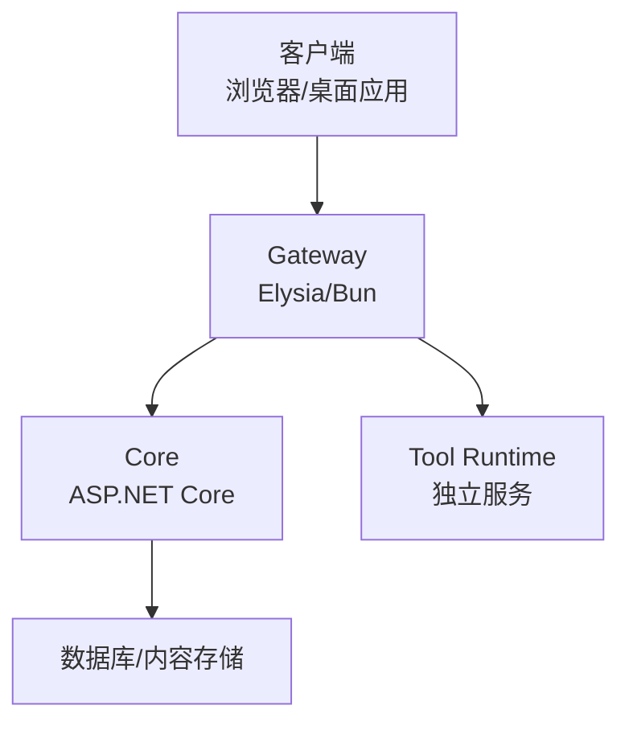
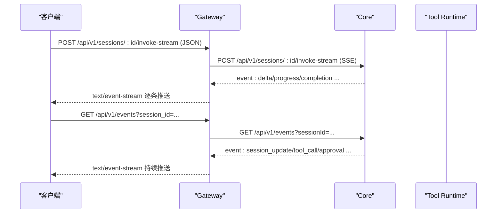
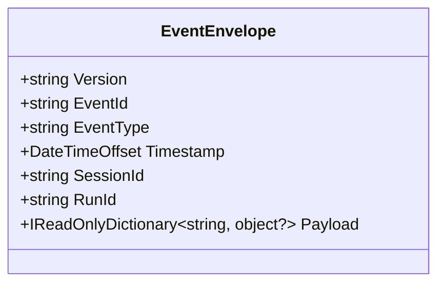
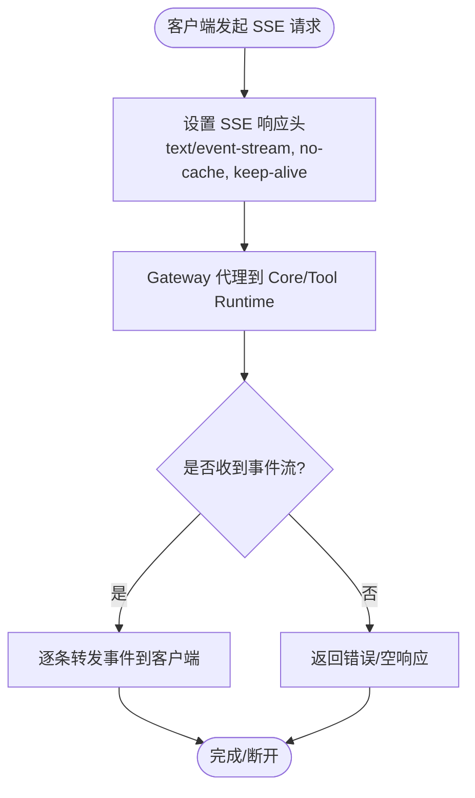
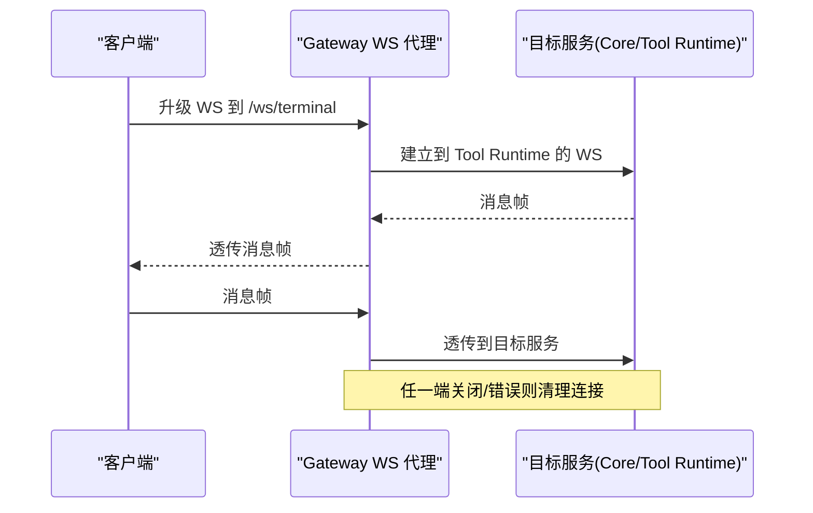
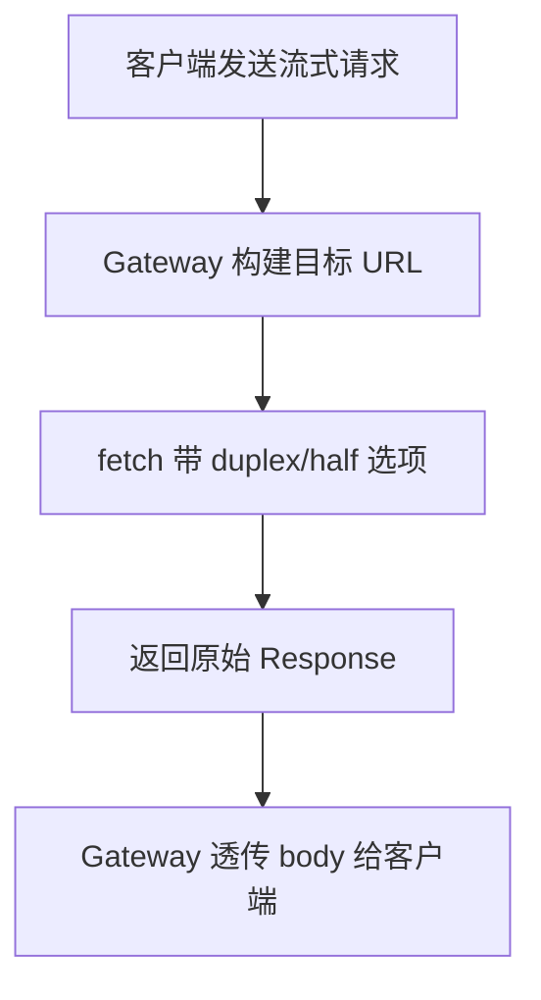
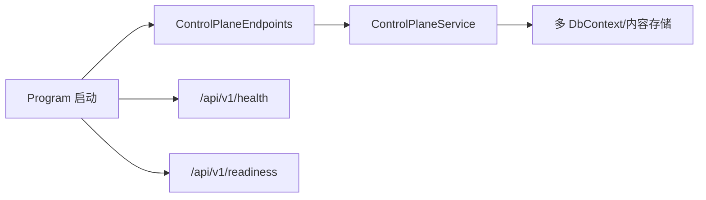
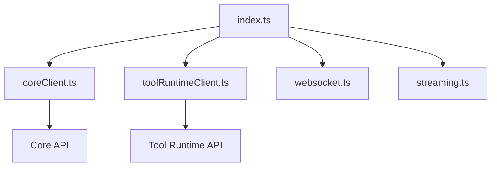
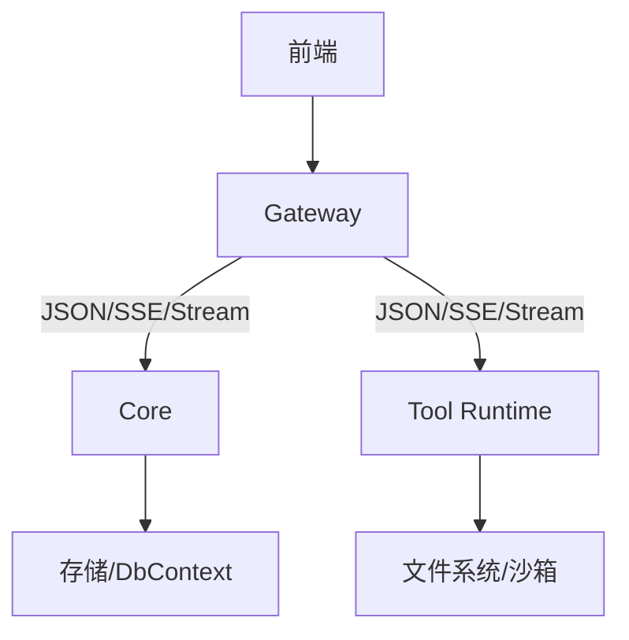
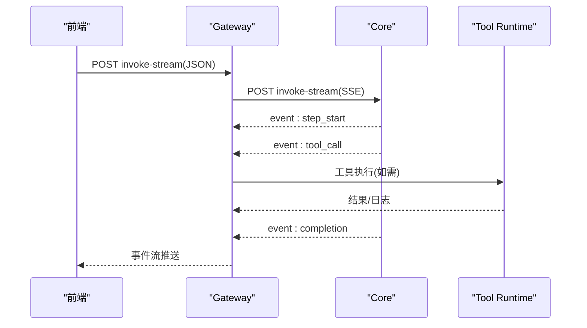

# 数据流与事件系统

<cite>
**本文引用的文件**   
- [EventEnvelope.cs](file://TinadecCore/Contracts/Events/EventEnvelope.cs)
- [index.ts](file://TinadecGateway/src/index.ts)
- [coreClient.ts](file://TinadecGateway/src/coreClient.ts)
- [toolRuntimeClient.ts](file://TinadecGateway/src/toolRuntimeClient.ts)
- [websocket.ts](file://TinadecGateway/src/websocket.ts)
- [streaming.ts](file://TinadecGateway/src/streaming.ts)
- [ControlPlaneEndpoints.cs](file://TinadecCore/Api/Endpoints/ControlPlaneEndpoints.cs)
- [Program.cs](file://TinadecCore/Api/Program.cs)
- [EventEnvelopeTests.cs](file://tests/Tinadec.Contracts.Tests/EventEnvelopeTests.cs)
</cite>

## 目录
1. [引言](#引言)
2. [项目结构](#项目结构)
3. [核心组件](#核心组件)
4. [架构总览](#架构总览)
5. [详细组件分析](#详细组件分析)
6. [依赖关系分析](#依赖关系分析)
7. [性能考量](#性能考量)
8. [故障排查指南](#故障排查指南)
9. [结论](#结论)
10. [附录](#附录)

## 引言
本设计文档聚焦 TinadecOffice 的数据流与事件系统，围绕统一事件格式 EventEnvelope、SSE 实时通信机制、WebSocket 连接管理展开，解释请求-响应流程、事件驱动架构与异步消息处理模式。文档包含数据流向图、事件序列图和状态同步机制说明，并覆盖错误处理策略、重试与断线重连、性能优化、背压处理与内存管理等关键主题。

## 项目结构
- Gateway（Bun/Elysia）：统一的协议网关，负责鉴权、路由、协议转换（HTTP/SSE/WebSocket/流式 HTTP），以及到 Core 和 Tool Runtime 的代理转发。
- Core（ASP.NET Core）：提供控制面 API、健康检查、就绪探针、存储与生命周期等能力；通过 JSON 序列化策略保证 snake_case 边界契约。
- Desktop/Web：前端应用，消费 Gateway 暴露的 REST、SSE、WebSocket 接口。

**图表来源** 
- [index.ts:1-120](file://TinadecGateway/src/index.ts#L1-L120)
- [Program.cs:1-40](file://TinadecCore/Api/Program.cs#L1-L40)

**章节来源**
- [index.ts:1-120](file://TinadecGateway/src/index.ts#L1-L120)
- [Program.cs:1-40](file://TinadecCore/Api/Program.cs#L1-L40)

## 核心组件
- 统一事件信封 EventEnvelope：定义跨进程/跨语言的事件边界格式，采用 snake_case 字段命名，包含版本、事件标识、类型、时间戳、会话/运行上下文与载荷。
- SSE 流式通道：Gateway 将 Core 的 SSE 事件透传到客户端，用于会话调用流、全局事件订阅等。
- WebSocket 代理：Gateway 将终端 PTY、调试器、协作等场景的 WS 连接反向代理到 Core 或 Tool Runtime。
- 流式 HTTP：Gateway 对大文件与日志进行零缓冲透传，避免内存峰值。

**章节来源**
- [EventEnvelope.cs:1-33](file://TinadecCore/Contracts/Events/EventEnvelope.cs#L1-L33)
- [index.ts:231-286](file://TinadecGateway/src/index.ts#L231-L286)
- [websocket.ts:1-140](file://TinadecGateway/src/websocket.ts#L1-L140)
- [streaming.ts:1-54](file://TinadecGateway/src/streaming.ts#L1-L54)

## 架构总览
Gateway 作为 BFF/API 层，承担以下职责：
- 认证与 CORS
- 协议转换：REST → SSE/WS/Stream
- 路由与鉴权门控（含审批门）
- 到 Core 与 Tool Runtime 的透明代理

**图表来源** 
- [index.ts:231-286](file://TinadecGateway/src/index.ts#L231-L286)
- [coreClient.ts:93-101](file://TinadecGateway/src/coreClient.ts#L93-L101)

**章节来源**
- [index.ts:231-286](file://TinadecGateway/src/index.ts#L231-L286)
- [coreClient.ts:1-110](file://TinadecGateway/src/coreClient.ts#L1-L110)

## 详细组件分析

### 统一事件格式 EventEnvelope
- 字段语义：version、event_id、event_type、timestamp、session_id、run_id、payload。
- 序列化约定：API 边界使用 snake_case，确保跨语言一致性与可读性。
- 扩展性：payload 为键值字典，便于承载不同事件类型的业务数据。

**图表来源** 
- [EventEnvelope.cs:1-33](file://TinadecCore/Contracts/Events/EventEnvelope.cs#L1-L33)

**章节来源**
- [EventEnvelope.cs:1-33](file://TinadecCore/Contracts/Events/EventEnvelope.cs#L1-L33)
- [EventEnvelopeTests.cs:1-31](file://tests/Tinadec.Contracts.Tests/EventEnvelopeTests.cs#L1-L31)

### SSE 实时通信机制
- 会话调用流：POST /api/v1/sessions/:sessionId/invoke-stream，Gateway 设置 SSE 响应头并透传 Core 的 event stream。
- 全局事件订阅：GET /api/v1/events?session_id=...，Gateway 透传 Core 的 SSE 事件流。
- 头部策略：no-cache、keep-alive、x-accel-buffering=no，确保低延迟与不被中间件缓存。

**图表来源** 
- [index.ts:231-286](file://TinadecGateway/src/index.ts#L231-L286)
- [coreClient.ts:93-101](file://TinadecGateway/src/coreClient.ts#L93-L101)

**章节来源**
- [index.ts:231-286](file://TinadecGateway/src/index.ts#L231-L286)
- [coreClient.ts:93-101](file://TinadecGateway/src/coreClient.ts#L93-L101)

### WebSocket 连接管理
- 路由映射：/ws/terminal → Tool Runtime；/ws/debug → Core；/ws/collaboration → Core。
- 双向透传：Gateway 在客户端与目标服务之间建立双向消息通道，保持连接生命周期一致。
- 错误与关闭：目标端错误或关闭时，Gateway 清理本地句柄并通知客户端。

**图表来源** 
- [websocket.ts:51-74](file://TinadecGateway/src/websocket.ts#L51-L74)
- [websocket.ts:93-139](file://TinadecGateway/src/websocket.ts#L93-L139)

**章节来源**
- [websocket.ts:1-140](file://TinadecGateway/src/websocket.ts#L1-L140)

### 流式 HTTP 传输
- 用途：大文件上传/下载、日志流。
- 实现：Gateway 直接透传 Request/Response body 流，不缓冲，减少内存占用。
- 头部：保留 content-type，禁用加速缓存，保持长连接。

**图表来源** 
- [streaming.ts:25-54](file://TinadecGateway/src/streaming.ts#L25-L54)

**章节来源**
- [streaming.ts:1-54](file://TinadecGateway/src/streaming.ts#L1-L54)

### 控制面 API 与事件关联
- ControlPlaneEndpoints 暴露模型提供者、路由、提示词片段、Agent 配置与审批等接口。
- Program.cs 注册 JSON 序列化策略（snake_case）、健康/就绪探针、迁移与模块装配。

**图表来源** 
- [ControlPlaneEndpoints.cs:1-46](file://TinadecCore/Api/Endpoints/ControlPlaneEndpoints.cs#L1-L46)
- [Program.cs:1-40](file://TinadecCore/Api/Program.cs#L1-L40)

**章节来源**
- [ControlPlaneEndpoints.cs:1-46](file://TinadecCore/Api/Endpoints/ControlPlaneEndpoints.cs#L1-L46)
- [Program.cs:1-40](file://TinadecCore/Api/Program.cs#L1-L40)

## 依赖关系分析
- Gateway 依赖 coreClient.ts 与 toolRuntimeClient.ts 进行 JSON/SSE/Stream 代理。
- Gateway 通过 index.ts 集中路由与中间件（CORS、认证、MCP、审批门）。
- Core 通过 Program.cs 注入持久化与模块，对外暴露 REST 与 SSE。

**图表来源** 
- [index.ts:1-120](file://TinadecGateway/src/index.ts#L1-L120)
- [coreClient.ts:1-110](file://TinadecGateway/src/coreClient.ts#L1-L110)
- [toolRuntimeClient.ts:1-126](file://TinadecGateway/src/toolRuntimeClient.ts#L1-L126)
- [websocket.ts:1-140](file://TinadecGateway/src/websocket.ts#L1-L140)
- [streaming.ts:1-54](file://TinadecGateway/src/streaming.ts#L1-L54)

**章节来源**
- [index.ts:1-120](file://TinadecGateway/src/index.ts#L1-L120)
- [coreClient.ts:1-110](file://TinadecGateway/src/coreClient.ts#L1-L110)
- [toolRuntimeClient.ts:1-126](file://TinadecGateway/src/toolRuntimeClient.ts#L1-L126)
- [websocket.ts:1-140](file://TinadecGateway/src/websocket.ts#L1-L140)
- [streaming.ts:1-54](file://TinadecGateway/src/streaming.ts#L1-L54)

## 性能考量
- 背压与流控
  - SSE：服务端按生产速率推送，客户端需及时消费；必要时在前端做节流与去抖。
  - WS：目标端拥塞时，Gateway 透传可能导致队列增长，建议在上层限流与丢弃策略。
  - 流式 HTTP：避免全量缓冲，使用 duplex/half 透传，降低内存峰值。
- 内存管理
  - 事件载荷 payload 应控制大小，避免单条过大；必要时分片推送。
  - 长连接资源释放：WS 关闭/错误时立即清理句柄，防止泄漏。
- 网络与缓存
  - SSE 响应头禁用缓存与代理缓冲，确保实时性。
  - 合理设置 keep-alive 与超时，避免僵尸连接。
- 并发与吞吐
  - Gateway 无状态转发，横向扩展简单；Core/Tool Runtime 侧需关注 I/O 与线程池。
  - 热点路径（invoke-stream、events）可考虑连接池与连接复用。

[本节为通用指导，不直接分析具体文件]

## 故障排查指南
- 常见错误码与定位
  - CORE_UNREACHABLE/TOOL_RUNTIME_UNREACHABLE：网络不可达或服务未启动，检查配置与端口。
  - CORE_INVALID_RESPONSE/TOOL_RUNTIME_INVALID_RESPONSE：非 JSON 响应，检查上游服务输出。
  - 401/403：认证失败或审批门拒绝，检查鉴权头与审批状态。
- 诊断手段
  - 健康与就绪：/api/v1/health、/api/v1/readiness、/api/v1/model-readiness、/api/v1/tool-layer-readiness。
  - 调试快照与指标：/api/v1/debug/snapshot/:sessionId、/api/v1/debug/metrics。
- 恢复策略
  - 重试：对幂等查询可指数退避重试；写操作需谨慎。
  - 断线重连：WS 断开后等待随机抖动后重连；SSE 支持自动重连（客户端实现）。
  - 降级：上游不可用时返回明确错误码与友好提示。

**章节来源**
- [coreClient.ts:38-87](file://TinadecGateway/src/coreClient.ts#L38-L87)
- [toolRuntimeClient.ts:44-97](file://TinadecGateway/src/toolRuntimeClient.ts#L44-L97)
- [index.ts:157-193](file://TinadecGateway/src/index.ts#L157-L193)

## 结论
TinadecOffice 以 Gateway 为中心，将 REST、SSE、WebSocket 与流式 HTTP 统一封装，向上为前端提供一致的交互体验，向下透明代理到 Core 与 Tool Runtime。EventEnvelope 作为统一事件契约，保障了跨语言与跨服务的一致性。通过流式传输与严格的头部策略，系统在实时性与性能上取得平衡。配合完善的错误码、健康探针与调试接口，便于问题定位与快速恢复。

[本节为总结性内容，不直接分析具体文件]

## 附录

### 数据流向图（端到端）

[本图为概念性示意，不直接映射具体代码文件]

### 事件序列图（会话调用）

**图表来源** 
- [index.ts:231-286](file://TinadecGateway/src/index.ts#L231-L286)
- [coreClient.ts:93-101](file://TinadecGateway/src/coreClient.ts#L93-L101)

### 状态同步机制
- 会话状态：通过 /api/v1/sessions/:sessionId/orchestration 获取编排状态。
- 工具执行：/api/v1/sessions/:sessionId/tool-executions 拉取执行记录。
- 事件订阅：/api/v1/events 订阅全局事件，结合 session_id 过滤。
- 审批状态：/api/v1/approvals 查询与决策，影响工具执行放行。

**章节来源**
- [index.ts:244-286](file://TinadecGateway/src/index.ts#L244-L286)