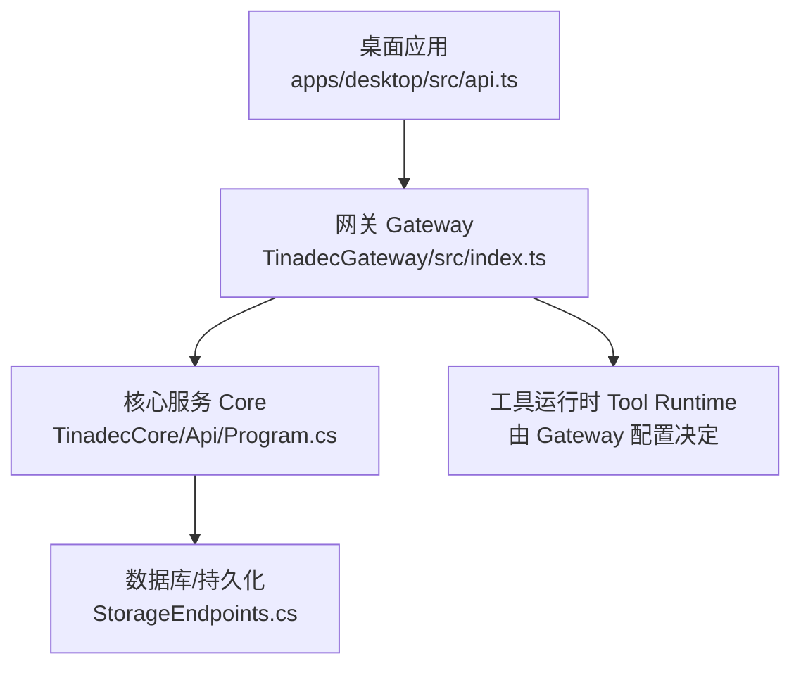
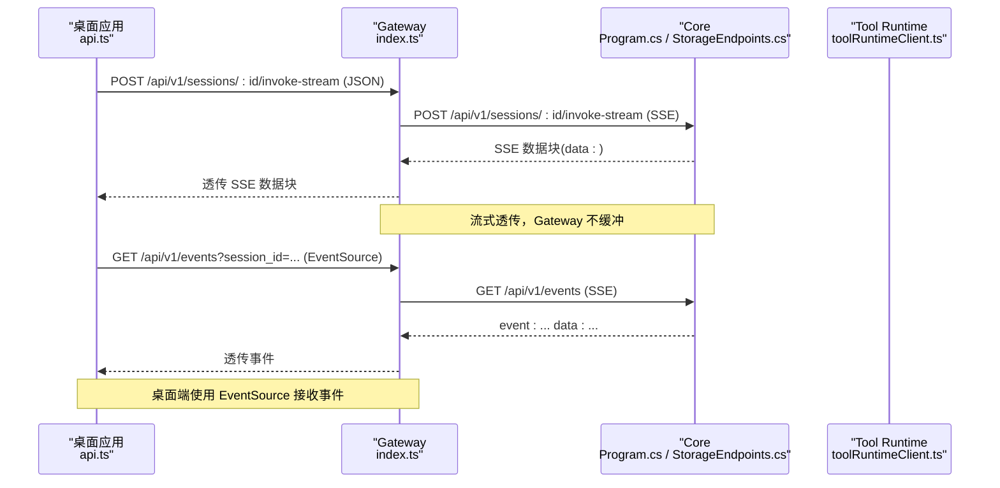
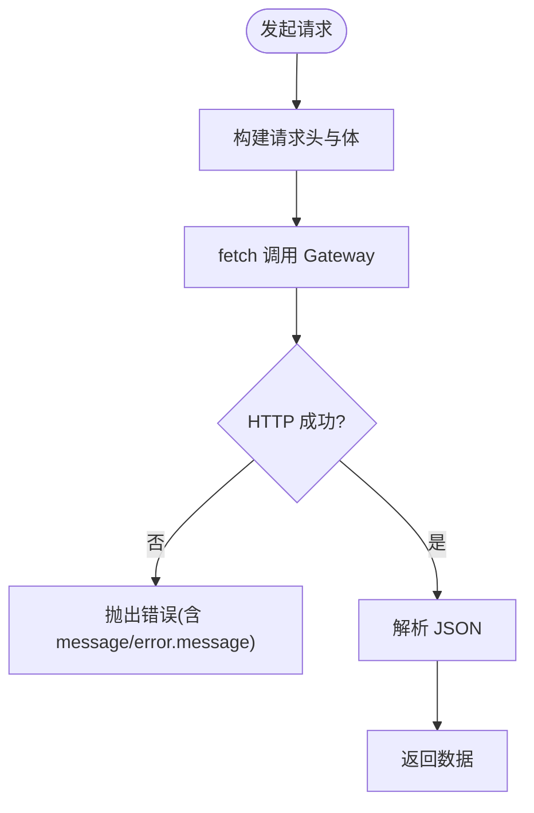
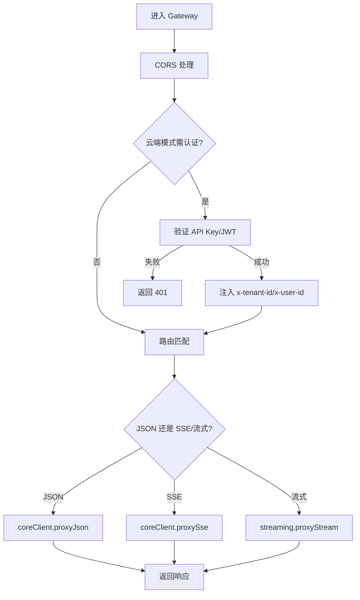
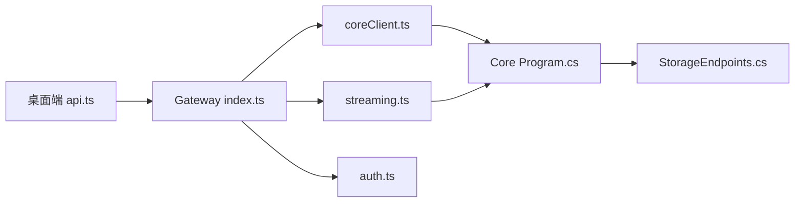

# 请求响应流程

<cite>
**本文引用的文件**   
- [TinadecGateway/src/index.ts](file://TinadecGateway/src/index.ts)
- [TinadecGateway/src/config.ts](file://TinadecGateway/src/config.ts)
- [TinadecGateway/src/coreClient.ts](file://TinadecGateway/src/coreClient.ts)
- [TinadecGateway/src/streaming.ts](file://TinadecGateway/src/streaming.ts)
- [TinadecGateway/src/auth.ts](file://TinadecGateway/src/auth.ts)
- [apps/desktop/src/api.ts](file://apps/desktop/src/api.ts)
- [apps/desktop/src/composables/useConnection.ts](file://apps/desktop/src/composables/useConnection.ts)
- [TinadecCore/Api/Program.cs](file://TinadecCore/Api/Program.cs)
- [TinadecCore/Api/Endpoints/StorageEndpoints.cs](file://TinadecCore/Api/Endpoints/StorageEndpoints.cs)
- [TinadecCore/Api/Endpoints/ControlPlaneEndpoints.cs](file://TinadecCore/Api/Endpoints/ControlPlaneEndpoints.cs)
</cite>

## 目录
1. [简介](#简介)
2. [项目结构](#项目结构)
3. [核心组件](#核心组件)
4. [架构总览](#架构总览)
5. [详细组件分析](#详细组件分析)
6. [依赖关系分析](#依赖关系分析)
7. [性能与超时控制](#性能与超时控制)
8. [错误传播与异常处理](#错误传播与异常处理)
9. [API 调用示例](#api-调用示例)
10. [故障排查指南](#故障排查指南)
11. [结论](#结论)

## 简介
本文件面向“桌面应用 → Gateway → Core”的完整请求-响应链路，覆盖以下关键点：
- Gateway 层的请求转发、参数校验、响应转换
- 异步处理模式（SSE/流式 HTTP）、超时控制、重试机制
- 错误传播、异常处理、日志追踪
- API 调用示例与常见问题排查

该文档以仓库中的实际代码为依据，重点围绕桌面端 API 客户端、Gateway 代理层与 Core 服务三者的交互。

## 项目结构
- 桌面应用（Electron/Vue）通过 api.ts 发起 HTTP/SSE 请求到 Gateway
- Gateway（Bun/Elysia）负责鉴权、CORS、路由转发、SSE/流式透传、审批门与工具执行编排
- Core（ASP.NET Minimal API）提供健康检查、存储、控制面等接口，并输出 SSE 事件流



**图表来源** 
- [apps/desktop/src/api.ts](file://apps/desktop/src/api.ts)
- [TinadecGateway/src/index.ts](file://TinadecGateway/src/index.ts)
- [TinadecCore/Api/Program.cs](file://TinadecCore/Api/Program.cs)
- [TinadecCore/Api/Endpoints/StorageEndpoints.cs](file://TinadecCore/Api/Endpoints/StorageEndpoints.cs)

**章节来源**
- [apps/desktop/src/api.ts](file://apps/desktop/src/api.ts)
- [TinadecGateway/src/index.ts](file://TinadecGateway/src/index.ts)
- [TinadecCore/Api/Program.cs](file://TinadecCore/Api/Program.cs)

## 核心组件
- 桌面端 API 客户端：统一封装 HTTP/SSE 调用、错误提取、SSE 事件订阅
- Gateway：认证中间件、CORS、路由转发、SSE/流式代理、审批门与工具执行编排
- Core：Minimal API 端点、健康/就绪检查、存储与控制面接口、SSE 事件流

关键职责边界：
- 桌面端仅做 UI 与用户交互，不直接访问 Core
- Gateway 是薄代理与 BFF，不做业务逻辑实现，只做协议转换与策略编排
- Core 是状态权威，管理会话、运行、任务、审批、事件、追踪等

**章节来源**
- [apps/desktop/src/api.ts](file://apps/desktop/src/api.ts)
- [TinadecGateway/src/index.ts](file://TinadecGateway/src/index.ts)
- [TinadecCore/Api/Program.cs](file://TinadecCore/Api/Program.cs)

## 架构总览
下图展示一次“消息发送 → 流式推理 → 事件推送”的典型调用链：



**图表来源** 
- [apps/desktop/src/api.ts](file://apps/desktop/src/api.ts)
- [TinadecGateway/src/index.ts](file://TinadecGateway/src/index.ts)
- [TinadecCore/Api/Endpoints/StorageEndpoints.cs](file://TinadecCore/Api/Endpoints/StorageEndpoints.cs)

**章节来源**
- [apps/desktop/src/api.ts](file://apps/desktop/src/api.ts)
- [TinadecGateway/src/index.ts](file://TinadecGateway/src/index.ts)
- [TinadecCore/Api/Endpoints/StorageEndpoints.cs](file://TinadecCore/Api/Endpoints/StorageEndpoints.cs)

## 详细组件分析

### 桌面端 API 客户端（apps/desktop/src/api.ts）
- 统一 request<T>() 封装 fetch，设置 accept/content-type，解析 JSON，非 2xx 抛错
- 错误信息提取：优先 message，其次 error.message，最后 fallback
- SSE 调用：
  - invokeStream：POST 流式推理，读取 ReadableStream，按行解析 data: 前缀，回调 onChunk
  - connectEvents：EventSource 连接 /api/v1/events，监听多种事件类型
- 连接状态机：useConnection.ts 维护 connecting/connected/timeout/disconnected，轮询 health



**图表来源** 
- [apps/desktop/src/api.ts](file://apps/desktop/src/api.ts)

**章节来源**
- [apps/desktop/src/api.ts](file://apps/desktop/src/api.ts)
- [apps/desktop/src/composables/useConnection.ts](file://apps/desktop/src/composables/useConnection.ts)

### Gateway 层（TinadecGateway/src/index.ts）
- CORS 中间件：允许本地开发、Electron file://、Tauri 等来源；OPTIONS 预检处理
- 认证中间件：云端模式支持 API Key/Bearer JWT，注入 tenant_id/user_id 到下游头
- 路由转发：
  - JSON 代理：proxyJson(path, options) 调用 coreClient.ts
  - SSE 代理：proxySse(path, init) 透传 text/event-stream
  - 流式 HTTP：proxyStream(target, path, method, headers, body) 透传 ReadableStream
- 健康/就绪探针：/health、/doctor、/readiness、/model-readiness、/tool-layer-readiness
- 业务路由：Projects、Sessions、Approvals、Tools、Model Center、Agent Center、Prompt Fragments、Debug Studio、MCP/ACP 等
- Code Tools 审批门：
  - 校验是否需要审批
  - 若需要且未通过，返回确认或拒绝
  - 通过后合并 forwardPatch，再调用 Tool Runtime



**图表来源** 
- [TinadecGateway/src/index.ts](file://TinadecGateway/src/index.ts)
- [TinadecGateway/src/coreClient.ts](file://TinadecGateway/src/coreClient.ts)
- [TinadecGateway/src/streaming.ts](file://TinadecGateway/src/streaming.ts)
- [TinadecGateway/src/auth.ts](file://TinadecGateway/src/auth.ts)

**章节来源**
- [TinadecGateway/src/index.ts](file://TinadecGateway/src/index.ts)
- [TinadecGateway/src/coreClient.ts](file://TinadecGateway/src/coreClient.ts)
- [TinadecGateway/src/streaming.ts](file://TinadecGateway/src/streaming.ts)
- [TinadecGateway/src/auth.ts](file://TinadecGateway/src/auth.ts)

### Core 服务（TinadecCore/Api/Program.cs & Endpoints）
- Program.cs：
  - 全局 JSON 序列化策略（snake_case、忽略 null）
  - 迁移与生命周期初始化
  - 健康/就绪/清单端点
  - 挂载 Storage/ControlPlane/Stub 端点
- StorageEndpoints.cs：
  - 项目/会话/消息 CRUD
  - SSE 事件回放：/api/v1/events，逐条写入 event/data
  - 参数校验与错误码映射（INVALID_PROJECT_ID、PROJECT_NOT_FOUND 等）
- ControlPlaneEndpoints.cs：
  - 模型提供者、路由、提示词片段、Agent 等控制面接口

```mermaid
classDiagram
class Program {
+MapGet("/api/v1/health")
+MapGet("/api/v1/readiness")
+MapStorageEndpoints()
+MapControlPlaneEndpoints()
}
class StorageEndpoints {
+MapGet("/api/v1/projects")
+MapPost("/api/v1/projects")
+MapGet("/api/v1/sessions")
+MapPost("/api/v1/sessions")
+MapGet("/api/v1/events")
}
class ControlPlaneEndpoints {
+MapGet("/api/v1/model-providers")
+MapPut("/api/v1/model-routes/{purpose}")
+MapGet("/api/v1/prompt-fragments")
+MapGet("/api/v1/agents")
}
Program --> StorageEndpoints : "挂载"
Program --> ControlPlaneEndpoints : "挂载"
```

**图表来源** 
- [TinadecCore/Api/Program.cs](file://TinadecCore/Api/Program.cs)
- [TinadecCore/Api/Endpoints/StorageEndpoints.cs](file://TinadecCore/Api/Endpoints/StorageEndpoints.cs)
- [TinadecCore/Api/Endpoints/ControlPlaneEndpoints.cs](file://TinadecCore/Api/Endpoints/ControlPlaneEndpoints.cs)

**章节来源**
- [TinadecCore/Api/Program.cs](file://TinadecCore/Api/Program.cs)
- [TinadecCore/Api/Endpoints/StorageEndpoints.cs](file://TinadecCore/Api/Endpoints/StorageEndpoints.cs)
- [TinadecCore/Api/Endpoints/ControlPlaneEndpoints.cs](file://TinadecCore/Api/Endpoints/ControlPlaneEndpoints.cs)

## 依赖关系分析
- 桌面端依赖 Gateway 暴露的 REST/SSE 接口
- Gateway 依赖 Core 与 Tool Runtime 的 HTTP/SSE 接口
- Core 依赖持久化（SQLite/PostgreSQL）与生命周期服务



**图表来源** 
- [apps/desktop/src/api.ts](file://apps/desktop/src/api.ts)
- [TinadecGateway/src/index.ts](file://TinadecGateway/src/index.ts)
- [TinadecGateway/src/coreClient.ts](file://TinadecGateway/src/coreClient.ts)
- [TinadecGateway/src/streaming.ts](file://TinadecGateway/src/streaming.ts)
- [TinadecGateway/src/auth.ts](file://TinadecGateway/src/auth.ts)
- [TinadecCore/Api/Program.cs](file://TinadecCore/Api/Program.cs)
- [TinadecCore/Api/Endpoints/StorageEndpoints.cs](file://TinadecCore/Api/Endpoints/StorageEndpoints.cs)

**章节来源**
- [apps/desktop/src/api.ts](file://apps/desktop/src/api.ts)
- [TinadecGateway/src/index.ts](file://TinadecGateway/src/index.ts)
- [TinadecCore/Api/Program.cs](file://TinadecCore/Api/Program.cs)

## 性能与超时控制
- Gateway 配置项：
  - requestTimeoutMs：默认 120s，可通过环境变量 TINADEC_GATEWAY_TIMEOUT_MS 调整
  - trustProxy：云端模式信任反向代理头
  - corsExtraOrigins：动态扩展允许的跨域来源
- 流式传输：
  - SSE：text/event-stream，Gateway 透传，无缓冲
  - 流式 HTTP：duplex half，适合大文件/日志
- 桌面端：
  - invokeStream 使用 AbortController 可取消长连接
  - connectEvents 使用 EventSource，自动重连（浏览器行为）

建议：
- 合理设置 requestTimeoutMs，避免长时间阻塞
- 对 SSE/流式场景，前端应实现断线重连与幂等处理
- 在云端部署时启用 trustProxy，确保 IP/租户上下文正确传递

**章节来源**
- [TinadecGateway/src/config.ts](file://TinadecGateway/src/config.ts)
- [TinadecGateway/src/streaming.ts](file://TinadecGateway/src/streaming.ts)
- [apps/desktop/src/api.ts](file://apps/desktop/src/api.ts)

## 错误传播与异常处理
- 桌面端：
  - request() 捕获网络错误与 JSON 解析错误，抛出带 message 的错误
  - extractErrorMessage() 优先取 message，其次 error.message
- Gateway：
  - proxyJson() 捕获不可达 Core 或非 JSON 响应，返回 502 与结构化错误码（CORE_UNREACHABLE/CORE_INVALID_RESPONSE）
  - 认证失败返回 401 与 AUTH_* 错误码
  - Code Tools 审批门拒绝返回 403 与 APPROVAL_DENIED
- Core：
  - 参数校验失败返回 400 与 INVALID_* 错误码
  - 资源不存在返回 404 与 NOT_FOUND
  - SSE 事件流中携带 error 字段（EventEnvelope），便于前端定位

错误传播路径：
- Core 错误 → Gateway 透传/包装 → 桌面端统一错误处理
- 认证失败 → Gateway 直接拦截 → 桌面端收到 401
- 审批拒绝 → Gateway 返回 403 → 桌面端提示二次确认

**章节来源**
- [apps/desktop/src/api.ts](file://apps/desktop/src/api.ts)
- [TinadecGateway/src/coreClient.ts](file://TinadecGateway/src/coreClient.ts)
- [TinadecGateway/src/index.ts](file://TinadecGateway/src/index.ts)
- [TinadecCore/Api/Endpoints/StorageEndpoints.cs](file://TinadecCore/Api/Endpoints/StorageEndpoints.cs)

## API 调用示例
以下为常用 API 调用示例（基于 api.ts 封装方法）：

- 健康检查
  - GET /api/v1/health
  - 桌面端：api.health()
- 创建项目
  - POST /api/v1/projects
  - 桌面端：api.createProject(name, path)
- 创建会话
  - POST /api/v1/sessions
  - 桌面端：api.createSession(projectId, title?)
- 发送消息并流式推理
  - POST /api/v1/sessions/:sessionId/invoke-stream
  - 桌面端：api.invokeStream(sessionId, content, onChunk, onError)
- 订阅事件
  - GET /api/v1/events?session_id=...
  - 桌面端：api.connectEvents(sessionId, onEvent)
- 工具执行（Code Tools）
  - POST /api/v1/code/tools/:toolId/execute
  - 桌面端：api.executeCodeTool(toolId, payload)

注意：
- SSE 调用需在头部设置 accept: text/event-stream
- 流式响应需处理断线与重连
- 工具执行可能触发审批门，需根据返回决定是否二次确认

**章节来源**
- [apps/desktop/src/api.ts](file://apps/desktop/src/api.ts)
- [TinadecGateway/src/index.ts](file://TinadecGateway/src/index.ts)

## 故障排查指南
常见问题与定位步骤：

- 无法连接后端
  - 现象：桌面端抛出 Cannot connect to backend
  - 排查：检查 Gateway 是否启动、端口是否正确、CORS 是否允许来源
  - 参考：[apps/desktop/src/api.ts](file://apps/desktop/src/api.ts)
- 认证失败
  - 现象：401 AUTH_REQUIRED/AUTH_INVALID_TOKEN/AUTH_INVALID_API_KEY
  - 排查：云端模式需携带 Authorization 或 x-api-key；JWT 密钥是否配置
  - 参考：[TinadecGateway/src/auth.ts](file://TinadecGateway/src/auth.ts)
- Core 不可达
  - 现象：502 CORE_UNREACHABLE/CORE_INVALID_RESPONSE
  - 排查：Core 是否运行、URL 是否正确、响应是否为 JSON
  - 参考：[TinadecGateway/src/coreClient.ts](file://TinadecGateway/src/coreClient.ts)
- 参数校验失败
  - 现象：400 INVALID_PROJECT_ID/INVALID_SESSION_ID
  - 排查：检查 GUID 格式、必填字段
  - 参考：[TinadecCore/Api/Endpoints/StorageEndpoints.cs](file://TinadecCore/Api/Endpoints/StorageEndpoints.cs)
- 审批被拒绝
  - 现象：403 APPROVAL_DENIED
  - 排查：查看 approval 上下文与风险策略，必要时二次确认
  - 参考：[TinadecGateway/src/index.ts](file://TinadecGateway/src/index.ts)

调试技巧：
- 使用 /api/v1/health、/api/v1/readiness、/api/v1/doctor 快速判断服务状态
- 通过 /api/v1/events 观察事件流，定位问题阶段
- 在桌面端控制台打印 onChunk/onError 回调，分析流式数据

**章节来源**
- [apps/desktop/src/api.ts](file://apps/desktop/src/api.ts)
- [TinadecGateway/src/auth.ts](file://TinadecGateway/src/auth.ts)
- [TinadecGateway/src/coreClient.ts](file://TinadecGateway/src/coreClient.ts)
- [TinadecCore/Api/Endpoints/StorageEndpoints.cs](file://TinadecCore/Api/Endpoints/StorageEndpoints.cs)
- [TinadecCore/Api/Program.cs](file://TinadecCore/Api/Program.cs)

## 结论
本系统采用“桌面端 → Gateway → Core”的分层架构，Gateway 作为薄代理与 BFF，承担认证、CORS、协议转换与策略编排；Core 作为状态权威，提供统一的存储与控制面能力。通过 SSE/流式 HTTP 实现实时交互，结合完善的错误传播与诊断接口，保障系统的可观测性与可维护性。建议在云端部署时合理配置认证、超时与代理头，并在前端实现健壮的重连与错误处理机制。