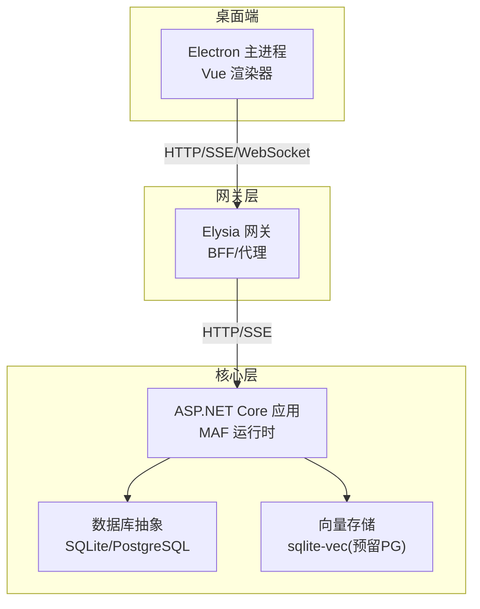
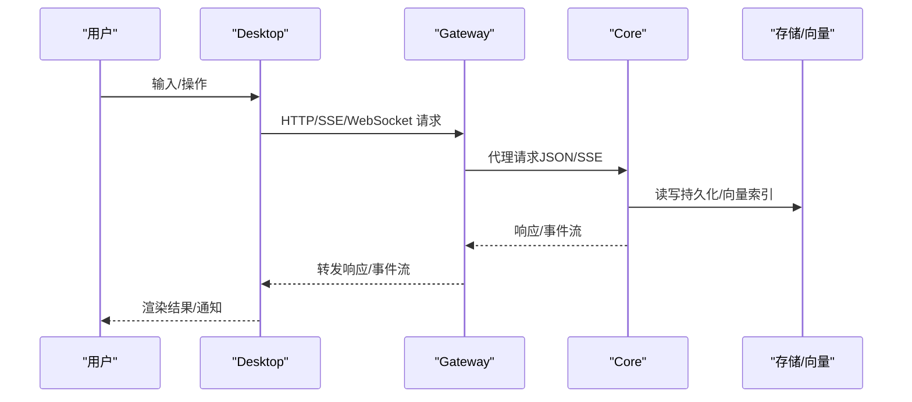
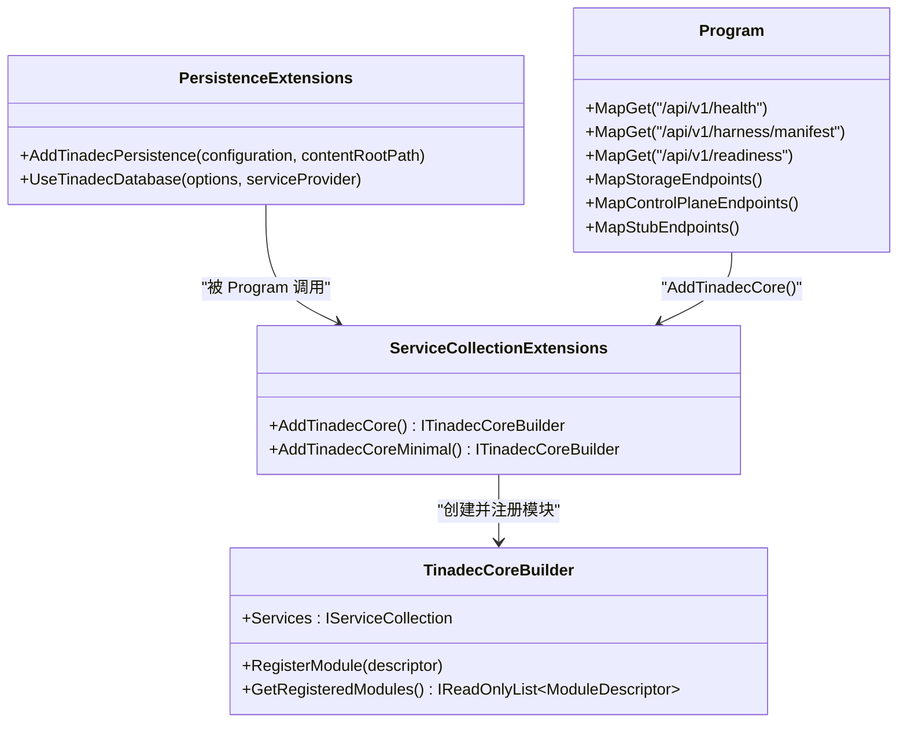
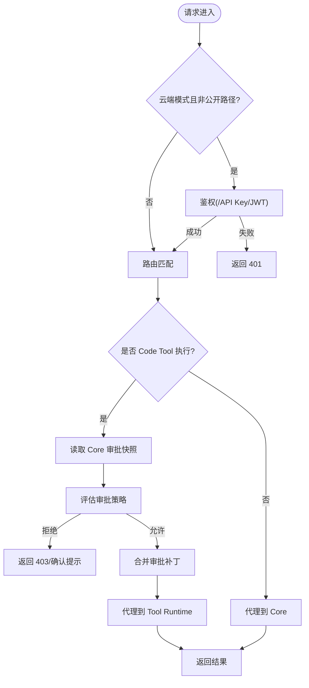
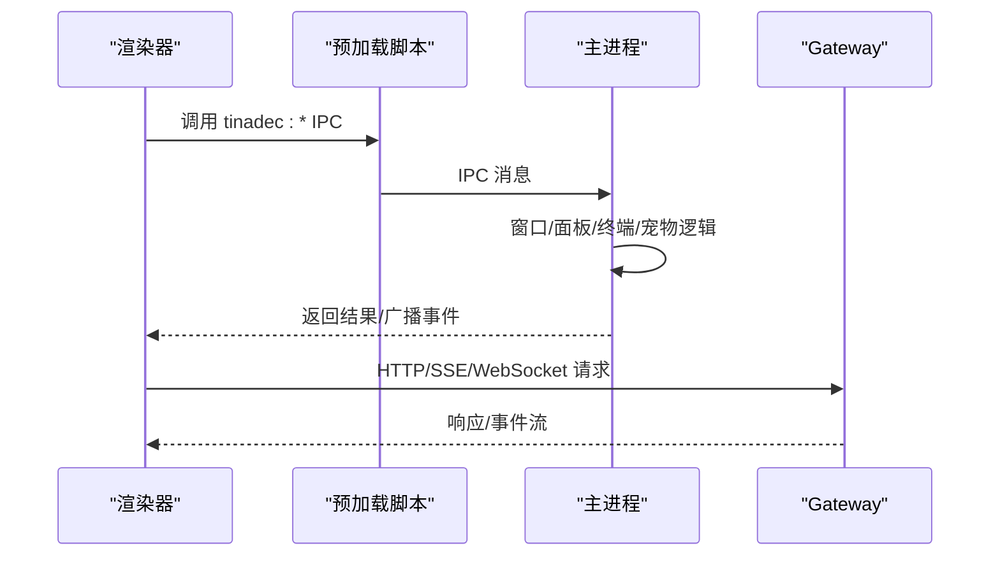
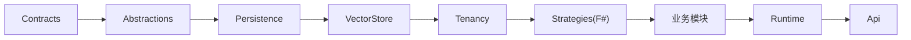

# 架构设计

<cite>
**本文引用的文件**   
- [README.md](file://README.md)
- [architecture.md](file://docs/architecture.md)
- [security.md](file://docs/security.md)
- [AGENTS.md](file://TinadecCore/AGENTS.md)
- [Program.cs](file://TinadecCore/Api/Program.cs)
- [TinadecCoreServiceCollectionExtensions.cs](file://TinadecCore/Runtime/TinadecCoreServiceCollectionExtensions.cs)
- [TinadecCoreBuilder.cs](file://TinadecCore/Runtime/TinadecCoreBuilder.cs)
- [ServiceCollectionExtensions.cs](file://TinadecCore/Persistence/ServiceCollectionExtensions.cs)
- [EventEnvelope.cs](file://TinadecCore/Contracts/Events/EventEnvelope.cs)
- [index.ts](file://TinadecGateway/src/index.ts)
- [config.ts](file://TinadecGateway/src/config.ts)
- [main.cjs](file://apps/desktop/electron/main.cjs)
- [package.json](file://apps/desktop/package.json)
- [package.json](file://TinadecGateway/package.json)
</cite>

## 目录
1. [引言](#引言)
2. [项目结构](#项目结构)
3. [核心组件](#核心组件)
4. [架构总览](#架构总览)
5. [详细组件分析](#详细组件分析)
6. [依赖关系分析](#依赖关系分析)
7. [性能与可扩展性](#性能与可扩展性)
8. [故障排查指南](#故障排查指南)
9. [结论](#结论)
10. [附录：技术栈与兼容性](#附录技术栈与兼容性)

## 引言
本架构文档面向 TinadecOffice 系统的三层设计：Desktop（桌面端）、Gateway（网关/BFF）、Core（核心运行时）。系统以 Core 为唯一状态权威，Gateway 作为薄 BFF/代理层，Desktop 仅负责 UI 呈现与用户交互。数据流通过 HTTP/SSE/WebSocket 进行，事件采用统一信封格式；写操作必须经过审批门控，工具执行在 Tool 层受策略约束。本文涵盖系统上下文图、组件关系图、部署拓扑、事件驱动机制、安全边界、扩展点、技术选型与权衡、跨领域关注点（安全性、监控、灾难恢复）以及技术栈与版本兼容性。

## 项目结构
- Desktop：Electron + Vue 3 + Vite + Tailwind，提供聊天、任务图、审批、可分离面板、Debug Studio 等界面能力。
- Gateway：Elysia + TypeScript，提供 /api/v1/* 路由、OpenAPI 文档、协议转换与流式转发。
- Core：.NET 10 + ASP.NET Core + MAF，承载编排、工具策略、模型路由、持久化、就绪回执、事件与追踪。

**图表来源** 
- [README.md](file://README.md)
- [architecture.md](file://docs/architecture.md)

**章节来源**
- [README.md](file://README.md)
- [architecture.md](file://docs/architecture.md)

## 核心组件
- Core（C#/.NET 10 + MAF）
  - 模块注册与 DI：AddTinadecCore() 全量注册，AddTinadecCoreMinimal() 最小集。
  - 持久化抽象：默认 SQLite，可选 PostgreSQL；迁移协调与就绪探测。
  - API：健康检查、harness manifest、readiness、控制面端点（Projects/Sessions/Events 等），其余为 stub。
  - 事件与追踪：统一 EventEnvelope，调试 API 与 WebSocket 实时事件。
- Gateway（TypeScript/Elysia）
  - 认证与 CORS、SSE/WS 转发、Model/Agent Center 聚合视图、Code Tools 审批门与 Tool Runtime 代理。
  - 配置：本地/云端模式、端口、超时、反向代理信任、CORS 白名单。
- Desktop（Electron/Vue）
  - 主进程窗口管理、IPC、面板分离、终端、宠物窗口、主题广播、Debug Studio。
  - 渲染器仅调用预加载 API，通过 HTTP/SSE 与 Gateway 通信。

**章节来源**
- [AGENTS.md](file://TinadecCore/AGENTS.md)
- [Program.cs](file://TinadecCore/Api/Program.cs)
- [TinadecCoreServiceCollectionExtensions.cs](file://TinadecCore/Runtime/TinadecCoreServiceCollectionExtensions.cs)
- [TinadecCoreBuilder.cs](file://TinadecCore/Runtime/TinadecCoreBuilder.cs)
- [ServiceCollectionExtensions.cs](file://TinadecCore/Persistence/ServiceCollectionExtensions.cs)
- [index.ts](file://TinadecGateway/src/index.ts)
- [config.ts](file://TinadecGateway/src/config.ts)
- [main.cjs](file://apps/desktop/electron/main.cjs)

## 架构总览
- 职责边界
  - Core：唯一状态权威（会话、运行、任务、审批、事件、追踪、模型路由、工具策略）。
  - Gateway：无状态 BFF/代理，不持有业务状态；组合视图、协议转换、鉴权、审批门前置校验。
  - Desktop：纯展示与交互，不直接访问 Core，所有请求经 Gateway。
- 数据流向
  - Desktop → Gateway（HTTP/SSE/WebSocket）→ Core（HTTP/SSE）→ 存储/向量库。
  - 事件由 Core 产生，经 SSE 到 Gateway，再推送至 Desktop。
- 事件驱动
  - 统一 EventEnvelope（v1.0），snake_case 字段，包含 event_id、event_type、timestamp、session_id、run_id、payload。
- 安全边界
  - Electron 启用 contextIsolation、nodeIntegration=false、sandbox=true；API Key 使用平台保护存储；工具执行审批优先。
- 扩展点
  - 模块注册（IModuleRegistrar）、Provider 抽象（模型/工具/向量）、SecretStore、ContentStore、IProjectVectorDatabase。

**图表来源** 
- [index.ts](file://TinadecGateway/src/index.ts)
- [Program.cs](file://TinadecCore/Api/Program.cs)
- [EventEnvelope.cs](file://TinadecCore/Contracts/Events/EventEnvelope.cs)

**章节来源**
- [architecture.md](file://docs/architecture.md)
- [EventEnvelope.cs](file://TinadecCore/Contracts/Events/EventEnvelope.cs)

## 详细组件分析

### Core 运行时与模块体系
- 模块注册顺序与最小集
  - 全量注册：Tenancy → VectorStore → Lifecycle → Models → Context → Prompts → Memory → Skills → LoopGuard → DmaEA。
  - 最小集：Tenancy → Lifecycle → Models → DmaEA（裁剪证明）。
- 持久化抽象
  - AddTinadecPersistence 注册选项、连接信息、EF 配置器、就绪探针、路径、内容存储、向量存储、密钥存储、迁移协调。
  - 默认 SQLite 本地文件，可选 PostgreSQL；启动时按配置执行迁移与事件重平衡。
- API 端点
  - health/harness/manifest/readiness 已实现；控制面端点部分实现，其余为 stub（读返回空集合，写返回 501）。
- 事件与调试
  - EventEnvelope v1.0；调试 API 支持 traces/spans/metrics/diagnostics/processes/simulate/breakpoints，WebSocket 实时事件。

**图表来源** 
- [TinadecCoreBuilder.cs](file://TinadecCore/Runtime/TinadecCoreBuilder.cs)
- [TinadecCoreServiceCollectionExtensions.cs](file://TinadecCore/Runtime/TinadecCoreServiceCollectionExtensions.cs)
- [ServiceCollectionExtensions.cs](file://TinadecCore/Persistence/ServiceCollectionExtensions.cs)
- [Program.cs](file://TinadecCore/Api/Program.cs)

**章节来源**
- [AGENTS.md](file://TinadecCore/AGENTS.md)
- [Program.cs](file://TinadecCore/Api/Program.cs)
- [TinadecCoreServiceCollectionExtensions.cs](file://TinadecCore/Runtime/TinadecCoreServiceCollectionExtensions.cs)
- [ServiceCollectionExtensions.cs](file://TinadecCore/Persistence/ServiceCollectionExtensions.cs)

### Gateway 网关与协议转换
- 职责
  - 认证（本地/云端模式）、CORS、SSE/WS/流式转发、Model/Agent Center 聚合、Code Tools 审批门与 Tool Runtime 代理。
- 配置
  - mode/port/hostname/coreUrl/toolRuntimeUrl/auth/corsExtraOrigins/requestTimeoutMs/trustProxy。
- 关键流程
  - Code Tool 执行：校验是否需审批 → 读取 Core 审批快照 → 评估审批策略 → 合并补丁 → 代理到 Tool Runtime。
  - SSE/WS：统一事件流转发，保持 no-cache/keep-alive。

**图表来源** 
- [index.ts](file://TinadecGateway/src/index.ts)
- [config.ts](file://TinadecGateway/src/config.ts)

**章节来源**
- [index.ts](file://TinadecGateway/src/index.ts)
- [config.ts](file://TinadecGateway/src/config.ts)

### Desktop 桌面端与窗口管理
- 主进程职责
  - 窗口生命周期、IPC 处理（项目打开、配置、重启、面板分离/重附、主题广播、终端、宠物窗口、Debug Studio）。
  - 自定义协议 tinadec-pet-preview 用于预览资源。
- 渲染器职责
  - 仅通过 window.tinadec.* 预加载 API 与 Gateway 通信；不直接访问文件系统或模型密钥。
- 面板材质系统
  - 全局 panel material（opaque/translucent/blur），CSS 变量继承，Tailwind 兼容映射。

**图表来源** 
- [main.cjs](file://apps/desktop/electron/main.cjs)

**章节来源**
- [main.cjs](file://apps/desktop/electron/main.cjs)

## 依赖关系分析
- Core 模块依赖
  - Contracts（无依赖）→ Abstractions（依赖 Contracts + MAF.Abstractions）→ Persistence（EF Core + SQLite/Npgsql）→ VectorStore → Tenancy → Strategies(F#) → 业务模块（Abstractions + Strategies + MAF）→ Runtime → Api。
- Gateway 依赖
  - Elysia、认证中间件、coreClient/toolRuntimeClient、approval/codeTools/websocket/streaming。
- Desktop 依赖
  - Electron、Vue 3、Vite、Tailwind、xterm、monaco-editor、node-pty。

**图表来源** 
- [AGENTS.md](file://TinadecCore/AGENTS.md)

**章节来源**
- [AGENTS.md](file://TinadecCore/AGENTS.md)

## 性能与可扩展性
- 性能特性
  - Core 使用 EF Core LINQ 查询，SQLite 默认本地文件，启动自动迁移；PostgreSQL 按需迁移。
  - Gateway 无状态代理，支持横向扩展；SSE/WS 长连接低延迟。
  - Desktop 渲染器轻量，面板材质通过 CSS 变量避免重复计算。
- 可扩展点
  - 新增模块：实现 IModuleRegistrar 并在 AddTinadecCore/AddTinadecCoreMinimal 中注册。
  - Provider 替换：SecretStore、ContentStore、IProjectVectorDatabase 可按环境替换。
  - 认证扩展：Gateway 支持 API Key/JWT，云端模式可接入外部身份源。
- 约束条件
  - Core 是唯一状态权威，Gateway/Desktop 不得持有业务状态。
  - API 契约 snake_case，禁止在 DTO/EventEnvelope 中出现 MAF/F# 类型。
  - 写操作必须经过审批门，Tool 执行受策略约束。

[本节为通用指导，不直接分析具体文件]

## 故障排查指南
- 常见问题
  - 端口冲突：确认 Desktop(5173)、Gateway(48730)、Core(48731) 未被占用。
  - 数据库不可用：readiness 接口返回 storage.state 非 ready；检查 SQLite 路径或 PG 连接字符串。
  - 认证失败：云端模式下检查 TINADEC_GATEWAY_AUTH_REQUIRED、JWT Secret、API Key。
  - 审批门拦截：Code Tool 执行返回 403/确认提示，检查 Core 审批快照与策略。
- 调试手段
  - Debug Studio：traces/spans/metrics/diagnostics/processes，WS 实时事件。
  - Gateway 日志：请求头、CORS 预检、代理目标 URL。
  - Core 启动日志：迁移执行、模块注册状态、就绪探测结果。

**章节来源**
- [Program.cs](file://TinadecCore/Api/Program.cs)
- [index.ts](file://TinadecGateway/src/index.ts)
- [config.ts](file://TinadecGateway/src/config.ts)

## 结论
TinadecOffice 通过三层清晰职责划分与事件驱动架构，实现了安全的 Agent 工作空间：Core 作为唯一状态权威，Gateway 提供无状态 BFF/代理与协议转换，Desktop 专注 UI 与交互。系统在安全性（审批门、平台密钥保护、Electron 沙箱）、可观测性（调试 API/事件流）、可扩展性（模块注册/Provider 抽象）方面具备良好基础。后续演进应聚焦于完整的双层运行时、真实模型调用、向量存储落地与生产级灾备方案。

[本节为总结，不直接分析具体文件]

## 附录：技术栈与兼容性
- 技术栈
  - Core：.NET 10、ASP.NET Core、Microsoft Agent Framework (MAF) 1.13.0、EF Core、SQLite/PostgreSQL。
  - Gateway：Elysia、TypeScript、Bun。
  - Desktop：Electron、Vue 3、Vite、Tailwind、xterm、Monaco Editor。
- 版本与兼容性
  - MAF 锁定 1.13.0，无预览包；JSON 序列化 snake_case；EventEnvelope v1.0。
  - 默认 SQLite 本地文件，PostgreSQL 需显式配置迁移开关。
- 第三方依赖
  - .NET：Microsoft.Extensions.*、Microsoft.Agents.*、Npgsql EF。
  - Node：Elysia、@types/bun、typescript。
  - Electron：electron、node-pty、xterm、monaco-editor。

**章节来源**
- [AGENTS.md](file://TinadecCore/AGENTS.md)
- [package.json](file://TinadecGateway/package.json)
- [package.json](file://apps/desktop/package.json)