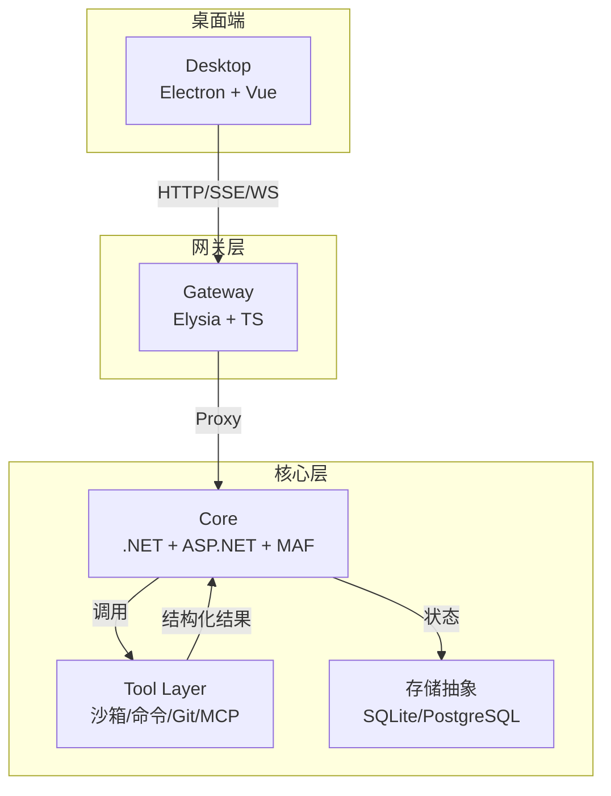
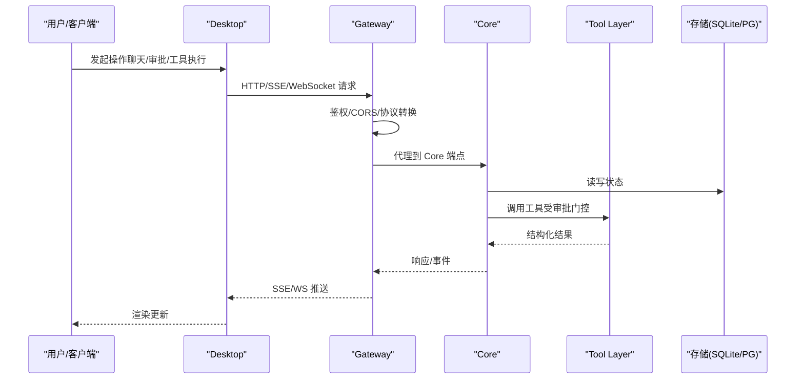
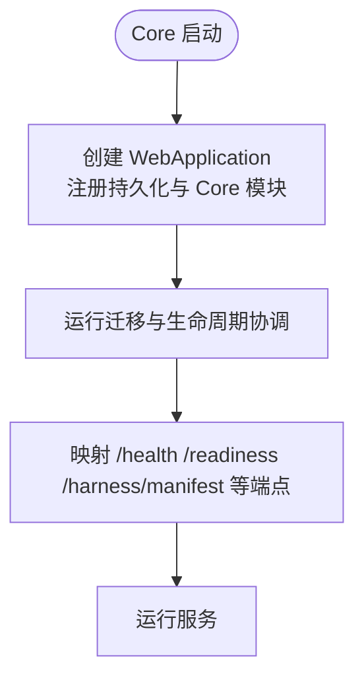
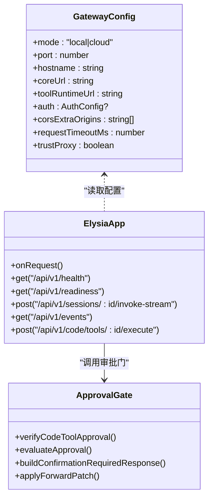
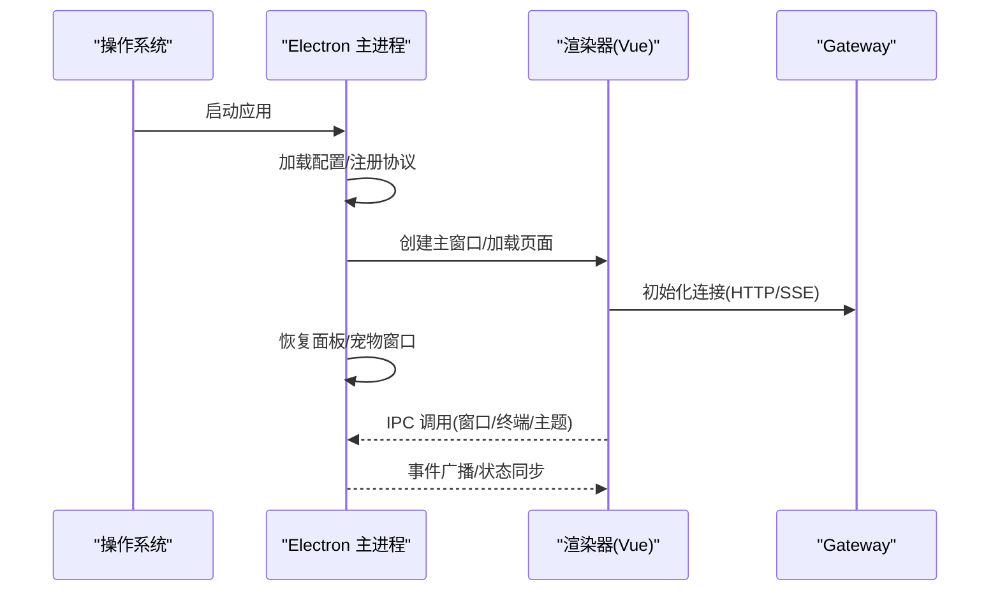
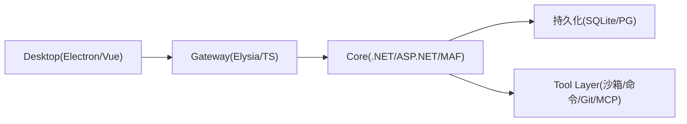

# 系统架构概览

<cite>
**本文引用的文件**   
- [README.md](file://README.md)
- [architecture.md](file://docs/architecture.md)
- [startup.md](file://docs/startup.md)
- [Program.cs](file://TinadecCore/Api/Program.cs)
- [appsettings.json](file://TinadecCore/Api/appsettings.json)
- [TinadecCoreBuilder.cs](file://TinadecCore/Runtime/TinadecCoreBuilder.cs)
- [index.ts](file://TinadecGateway/src/index.ts)
- [config.ts](file://TinadecGateway/src/config.ts)
- [package.json](file://TinadecGateway/package.json)
- [main.cjs](file://apps/desktop/electron/main.cjs)
- [package.json](file://apps/desktop/package.json)
- [package.json](file://package.json)
</cite>

## 目录
1. [引言](#引言)
2. [项目结构](#项目结构)
3. [核心组件](#核心组件)
4. [架构总览](#架构总览)
5. [详细组件分析](#详细组件分析)
6. [依赖关系分析](#依赖关系分析)
7. [性能与可伸缩性](#性能与可伸缩性)
8. [故障排查指南](#故障排查指南)
9. [结论](#结论)
10. [附录：端口与启动流程](#附录端口与启动流程)

## 引言
本文件面向 TinadecOffice 的三层架构（Desktop + Gateway + Core）提供系统化、循序渐进的概览说明，帮助读者快速理解职责边界、数据流、部署拓扑与技术选型权衡。核心设计要点包括：
- Core 作为唯一状态权威，集中管理编排、工具策略、模型路由、持久化与就绪回执。
- Gateway 采用 BFF（Backend for Frontend）模式，统一鉴权、协议转换、流式转发与聚合视图。
- Desktop 专注渲染与交互，仅通过 Gateway 访问后端能力，不持有业务状态。

**章节来源**
- [README.md:17-31](file://README.md#L17-L31)
- [architecture.md:1-11](file://docs/architecture.md#L1-L11)

## 项目结构
仓库采用多工作区组织，按“层”划分模块：
- TinadecCore：.NET 10 + ASP.NET Core + MAF 模块化单体，暴露 /api/v1/* 端点，内置数据库抽象（默认 SQLite，可选 PostgreSQL）。
- TinadecGateway：Elysia + TypeScript，BFF/API 层，负责代理、认证、SSE/WebSocket/流式转发与 Model/Agent Center 聚合。
- apps/desktop：Electron + Vue 3 + Vite + Tailwind，渲染聊天、任务图、审批、可分离面板与 Debug Studio。
- TinadecTools：审批感知工具原型（文件/命令/Git/MCP），由 Core 治理并通过 Tool Runtime 执行。

**图表来源**
- [README.md:33-43](file://README.md#L33-L43)
- [architecture.md:1-11](file://docs/architecture.md#L1-L11)

**章节来源**
- [README.md:61-73](file://README.md#L61-L73)

## 核心组件
- Core（状态权威）
  - 提供健康检查、就绪回执、Harness Manifest、工具注册与搜索、会话与事件流等 API。
  - 使用 snake_case JSON 序列化；支持 SQLite（本地）与 PostgreSQL（可选）。
  - 启动时执行迁移与生命周期协调。
- Gateway（BFF/代理）
  - 统一鉴权（本地无认证，云端支持 API Key/JWT）、CORS、租户上下文。
  - 将 HTTP/JSON、SSE、WebSocket、流式 HTTP 统一转发到 Core 或 Tool Runtime。
  - 暴露 Model/Agent Center 聚合视图，剥离敏感字段，降级可选 404/501 为诊断信息。
- Desktop（渲染层）
  - Electron 主进程管理窗口、IPC、终端、宠物窗口与调试工作室。
  - 渲染器通过 preload 暴露 window.tinadec.* API，仅通过 HTTP/SSE 与 Gateway 通信。

**章节来源**
- [Program.cs:10-39](file://TinadecCore/Api/Program.cs#L10-L39)
- [Program.cs:44-175](file://TinadecCore/Api/Program.cs#L44-L175)
- [index.ts:107-178](file://TinadecGateway/src/index.ts#L107-L178)
- [main.cjs:59-105](file://apps/desktop/electron/main.cjs#L59-L105)

## 架构总览
下图展示端到端请求路径、事件流与状态归属。

**图表来源**
- [index.ts:157-178](file://TinadecGateway/src/index.ts#L157-L178)
- [Program.cs:44-175](file://TinadecCore/Api/Program.cs#L44-L175)

## 详细组件分析

### Core：唯一状态权威
- 职责边界
  - 拥有项目、会话、消息、审批、模型路由、扩展、智能体、任务图、上下文包与监督发现等全部状态。
  - 暴露 /api/v1/health、/api/v1/readiness、/api/v1/harness/manifest 等关键端点。
  - 统一 JSON 命名策略（snake_case），便于前端消费。
- 启动流程
  - 构建 WebApplication，注册持久化抽象与 Core 模块。
  - 启动时运行迁移并协调生命周期服务。
  - 挂载健康检查、就绪回执与 Stub 端点。
- 配置要点
  - appsettings.json 中启用持久化、选择 Provider（Sqlite/PostgreSql）与探针超时。
  - 开发身份与租户/工作区标识用于本地调试。

**图表来源**
- [Program.cs:10-39](file://TinadecCore/Api/Program.cs#L10-L39)
- [Program.cs:44-175](file://TinadecCore/Api/Program.cs#L44-L175)

**章节来源**
- [Program.cs:10-39](file://TinadecCore/Api/Program.cs#L10-L39)
- [Program.cs:44-175](file://TinadecCore/Api/Program.cs#L44-L175)
- [appsettings.json:12-22](file://TinadecCore/Api/appsettings.json#L12-L22)

### Gateway：BFF 与协议网关
- 职责边界
  - 薄代理与 BFF：鉴权、CORS、租户上下文、协议转换（HTTP/SSE/WebSocket/流式）。
  - 聚合 Model/Agent Center 视图，剥离敏感字段，降级可选错误为诊断。
  - Code Tools 审批门：校验 Core 审批状态，必要时二次确认，再代理至 Tool Runtime。
- 配置与模式
  - 本地模式：监听 127.0.0.1，无认证；云端模式：监听 0.0.0.0，支持 JWT/API Key、反向代理头。
  - 环境变量控制端口、主机名、Core/Tool Runtime URL、CORS 白名单、超时与信任代理。
- 典型调用链
  - 健康检查、就绪回执、工具搜索、会话消息、事件流、调试接口均通过 Gateway 转发。

**图表来源**
- [config.ts:65-106](file://TinadecGateway/src/config.ts#L65-L106)
- [index.ts:107-178](file://TinadecGateway/src/index.ts#L107-L178)
- [index.ts:351-400](file://TinadecGateway/src/index.ts#L351-L400)

**章节来源**
- [config.ts:65-106](file://TinadecGateway/src/config.ts#L65-L106)
- [index.ts:107-178](file://TinadecGateway/src/index.ts#L107-L178)
- [index.ts:351-400](file://TinadecGateway/src/index.ts#L351-L400)

### Desktop：渲染与窗口管理
- 职责边界
  - Electron 主进程：窗口生命周期、IPC、终端、宠物窗口、调试工作室、主题广播。
  - 渲染器：Vue 3 + Vite + Tailwind，仅通过 window.tinadec.* 与主进程交互，通过 HTTP/SSE 与 Gateway 通信。
- 启动流程
  - 加载应用配置，设置 Gateway URL，注册自定义协议（宠物预览）。
  - 创建主窗口，恢复已保存的面板窗口，按需启动宠物窗口。
  - 处理最小化/最大化/关闭、面板分离/重附、主题广播等 IPC。

**图表来源**
- [main.cjs:59-105](file://apps/desktop/electron/main.cjs#L59-L105)
- [main.cjs:120-126](file://apps/desktop/electron/main.cjs#L120-L126)
- [main.cjs:335-365](file://apps/desktop/electron/main.cjs#L335-L365)

**章节来源**
- [main.cjs:59-105](file://apps/desktop/electron/main.cjs#L59-L105)
- [main.cjs:120-126](file://apps/desktop/electron/main.cjs#L120-L126)
- [main.cjs:335-365](file://apps/desktop/electron/main.cjs#L335-L365)

### 技术选型与权衡
- Core（.NET 10 + ASP.NET Core + MAF）
  - 优势：强类型、成熟生态、模块化 DI、EF Core 多提供者、OpenTelemetry 追踪。
  - 权衡：较重运行时；但作为状态权威与编排中心，收益大于成本。
- Gateway（Elysia + Bun）
  - 优势：轻量、高性能、原生 TS、流式友好；适合 BFF 与协议转换。
  - 权衡：无状态代理，复杂业务逻辑下沉到 Core，避免重复实现。
- Desktop（Electron + Vue 3 + Vite + Tailwind）
  - 优势：跨平台桌面体验、丰富的 UI 生态、强大的 IPC 与系统能力。
  - 权衡：内存占用较高；通过只读渲染与薄主进程降低复杂度。

**章节来源**
- [README.md:17-31](file://README.md#L17-L31)
- [architecture.md:1-11](file://docs/architecture.md#L1-L11)

## 依赖关系分析
- Core 依赖
  - 持久化抽象（SQLite/PostgreSQL）、MAF 框架、模块注册器（ITinadecCoreBuilder）。
- Gateway 依赖
  - Elysia 框架、认证中间件、审批门、Model/Agent Center 聚合逻辑、SSE/WebSocket/流式转发。
- Desktop 依赖
  - Electron 主进程、Vue 渲染器、Vite 开发服务器、Tailwind 样式体系。

**图表来源**
- [package.json:10-16](file://package.json#L10-L16)
- [package.json:14-21](file://TinadecGateway/package.json#L14-L21)
- [package.json:16-46](file://apps/desktop/package.json#L16-L46)

**章节来源**
- [package.json:10-16](file://package.json#L10-L16)
- [package.json:14-21](file://TinadecGateway/package.json#L14-L21)
- [package.json:16-46](file://apps/desktop/package.json#L16-L46)

## 性能与可伸缩性
- Core
  - 单实例状态权威，适合垂直扩展；可通过 EF Core 连接池与异步 I/O 提升吞吐。
  - 事件与追踪建议结合 OpenTelemetry 导出，避免阻塞主流程。
- Gateway
  - 无状态代理，易于水平扩展；注意上游超时与背压（SSE/WS/流式）。
  - 合理设置 CORS 与请求超时，减少无效重试。
- Desktop
  - 渲染优化：虚拟列表、懒加载、Web Worker 处理大文本；IPC 批量消息。
  - 窗口数量与面板状态持久化需考虑资源回收。

[本节为通用指导，不直接分析具体文件]

## 故障排查指南
- 端口与服务可用性
  - 验证 Core（48731）、Gateway（48730）、Desktop（5173）是否监听。
  - 使用 /api/v1/health 与 /api/v1/readiness 检查状态。
- 常见问题
  - Settings > Agents 为空：检查 Gateway 可达性与代理链路。
  - dotnet 构建失败（版本解析问题）：清理 Version/Ice-Version 环境变量后重试。
  - 旧名称残留：重启 Core 以触发种子规范化。
- 日志与定位
  - Windows 后台启动可将 stdout/stderr 重定向至 output/logs。
  - 通过 /api/v1/debug/* 查看追踪与指标。

**章节来源**
- [startup.md:93-152](file://docs/startup.md#L93-L152)

## 结论
TinadecOffice 通过清晰的三层职责划分与“Core 唯一状态权威”的设计，实现了高内聚、低耦合的可扩展架构。Gateway 的 BFF 模式屏蔽了底层复杂性，Desktop 专注于用户体验。配合统一的端口约定、事件信封与调试能力，团队可在保证安全与可控的前提下快速迭代。

[本节为总结性内容，不直接分析具体文件]

## 附录：端口与启动流程
- 默认端口
  - Desktop（Vite）：http://127.0.0.1:5173
  - Gateway API/Docs：http://127.0.0.1:48730/docs
  - Core：http://127.0.0.1:48731
- 一键启动
  - 根脚本 npm run dev 同时启动 Core、Gateway、Desktop。
  - 也可分别使用 dev:core、dev:gateway、dev:desktop 独立启动。
- 环境配置
  - Gateway 通过环境变量控制 mode/port/hostname/coreUrl/toolRuntimeUrl/auth/cors/timeout/trustProxy。
  - Core 通过 appsettings.json 配置持久化 Provider、连接字符串与探针超时。

**章节来源**
- [README.md:45-59](file://README.md#L45-L59)
- [startup.md:15-58](file://docs/startup.md#L15-L58)
- [config.ts:65-106](file://TinadecGateway/src/config.ts#L65-L106)
- [appsettings.json:12-22](file://TinadecCore/Api/appsettings.json#L12-L22)