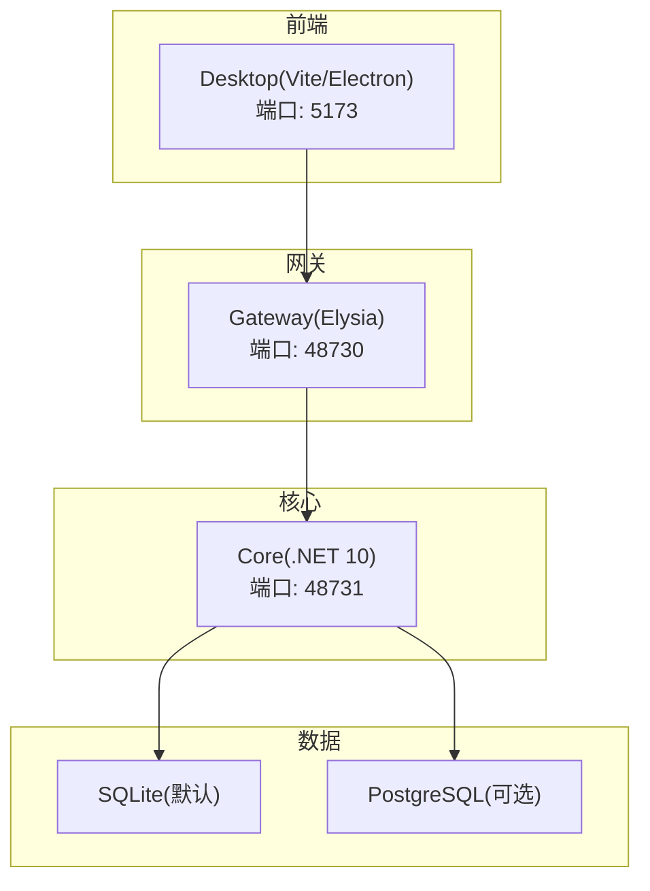
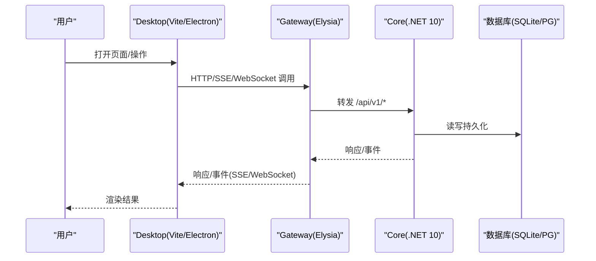
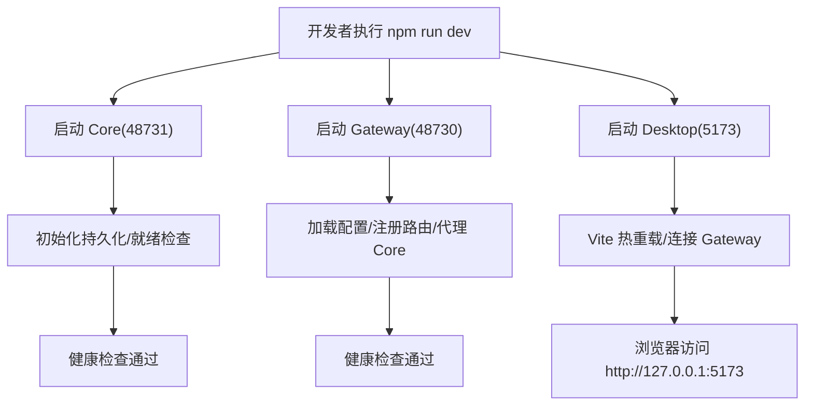
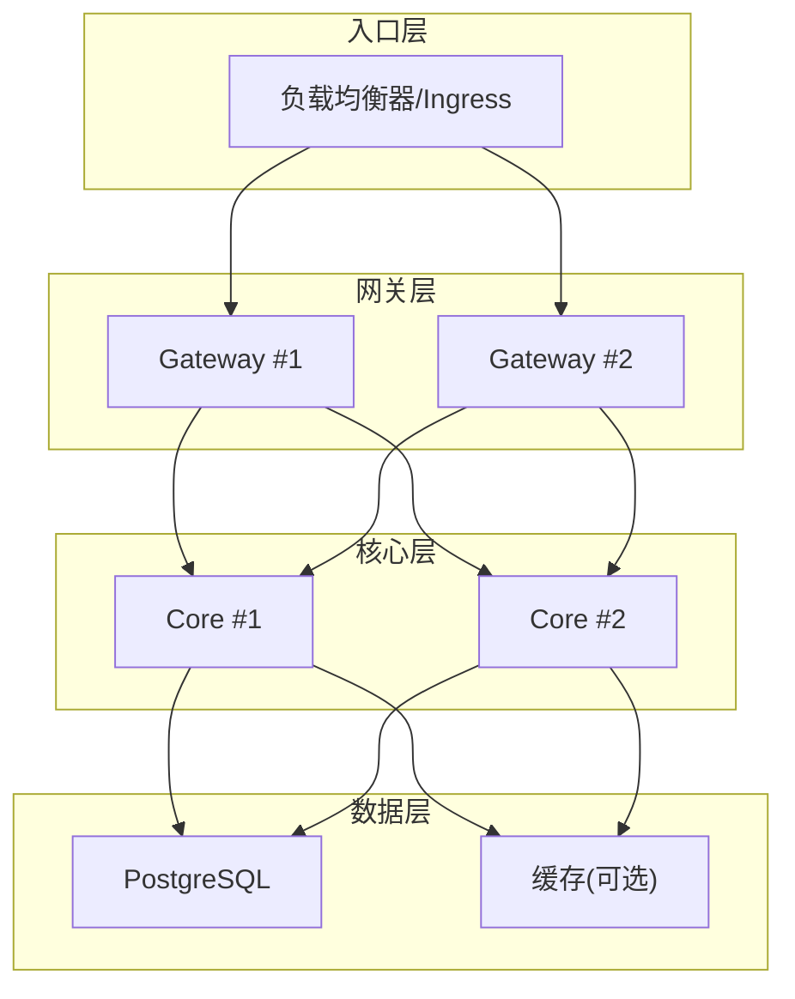
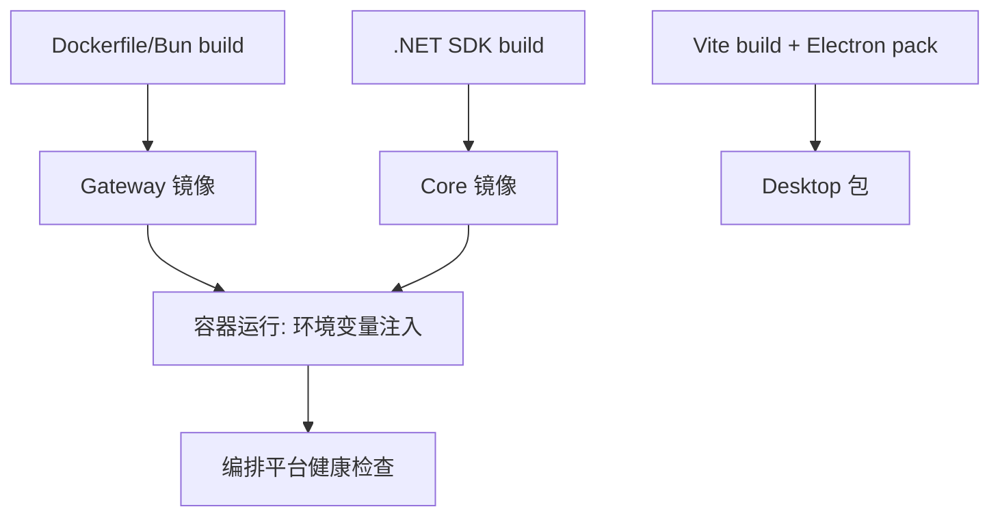
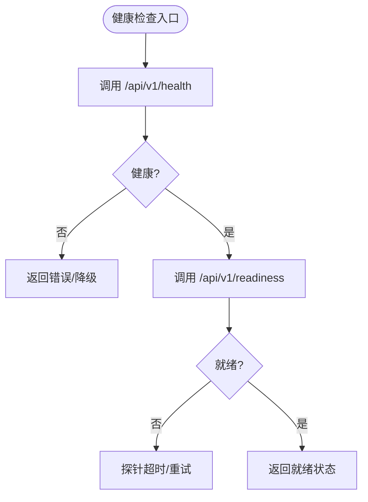
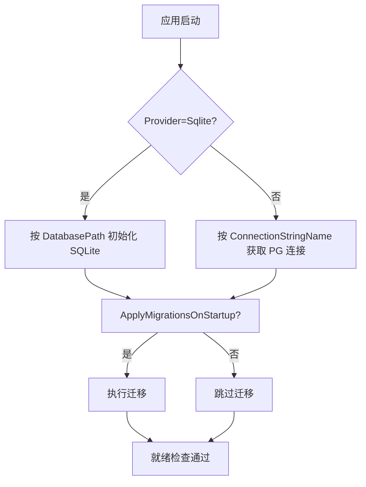
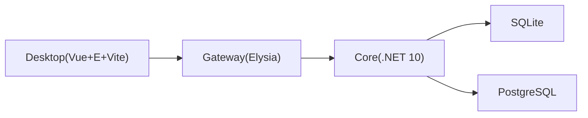

# 部署拓扑与环境

<cite>
**本文引用的文件**   
- [README.md](file://README.md)
- [startup.md](file://docs/startup.md)
- [architecture.md](file://docs/architecture.md)
- [appsettings.json](file://TinadecCore\Api\appsettings.json)
- [TinadecPersistenceOptions.cs](file://TinadecCore\Persistence\TinadecPersistenceOptions.cs)
- [core-storage-postgres.yml](file://.github\workflows\core-storage-postgres.yml)
- [package.json](file://TinadecGateway\package.json)
- [config.ts](file://TinadecGateway\src\config.ts)
- [package.json](file://apps\desktop\package.json)
</cite>

## 目录
1. [简介](#简介)
2. [项目结构](#项目结构)
3. [核心组件](#核心组件)
4. [架构总览](#架构总览)
5. [详细组件分析](#详细组件分析)
6. [依赖关系分析](#依赖关系分析)
7. [性能考虑](#性能考虑)
8. [故障排查指南](#故障排查指南)
9. [结论](#结论)
10. [附录](#附录)

## 简介
本文件面向 TinadecOffice 的部署与运维，覆盖本地开发、生产部署、容器化要点，以及服务发现、负载均衡、健康检查、数据库配置、缓存策略、日志收集、监控告警、故障恢复与性能调优。项目由三层构成：
- Core（.NET 10 + ASP.NET Core）：唯一状态权威，提供编排、工具策略、模型路由、持久化与健康就绪能力。
- Gateway（Elysia + TypeScript）：薄 BFF/代理，统一对外暴露 /api/v1/*，并转发到 Core。
- Desktop（Electron + Vue 3）：用户界面与调试面板，仅通过 Gateway 访问后端。

默认端口：
- Desktop/Vite：5173
- Gateway：48730
- Core：48731

**章节来源**
- [README.md:17-31](file://README.md#L17-L31)
- [startup.md:5-13](file://docs/startup.md#L5-L13)
- [architecture.md:13-17](file://docs/architecture.md#L13-L17)

## 项目结构
仓库采用多工作区组织，关键目录职责如下：
- TinadecCore：模块化单体（Contracts、Api、Persistence、Runtime 等），包含数据库抽象、迁移、就绪检查与 API 端点。
- TinadecGateway：BFF/代理层，基于 Elysia，提供认证、CORS、超时、反向代理头信任等配置。
- apps/desktop：桌面客户端，Vite 开发服务器与 Electron 打包产物。
- docs：架构、启动、安全等文档。
- .github/workflows：CI 中 PostgreSQL 存储测试流程。

**图表来源**
- [README.md:17-31](file://README.md#L17-L31)
- [startup.md:5-13](file://docs/startup.md#L5-L13)
- [architecture.md:13-17](file://docs/architecture.md#L13-L17)

**章节来源**
- [README.md:61-73](file://README.md#L61-L73)
- [startup.md:15-31](file://docs/startup.md#L15-L31)

## 核心组件
- Core：提供健康检查、就绪回执、工具清单、会话与事件流、模型与 Agent 中心视图等；支持 SQLite/PostgreSQL 双后端，内置探针超时控制。
- Gateway：负责请求转发、鉴权（API Key/JWT）、CORS、超时、信任反向代理头等；支持本地与云端两种模式。
- Desktop：通过 Vite 提供热重载开发体验，Electron 承载渲染进程与调试窗口。

**章节来源**
- [architecture.md:1-11](file://docs/architecture.md#L1-L11)
- [config.ts:1-16](file://TinadecGateway\src\config.ts#L1-L16)
- [startup.md:5-13](file://docs/startup.md#L5-L13)

## 架构总览
下图展示从 Desktop 到 Core 的请求路径、事件回推与数据存储关系。

**图表来源**
- [README.md:33-43](file://README.md#L33-L43)
- [architecture.md:19-45](file://docs/architecture.md#L19-L45)

## 详细组件分析

### 本地开发环境
- 一键启动：根目录执行 npm run dev，会并行启动 Core、Gateway、Desktop。
- 拆分启动：可按需单独启动某一层，便于快速定位问题。
- 验证方式：通过健康接口与示例查询确认各层可用。

**图表来源**
- [startup.md:15-31](file://docs/startup.md#L15-L31)
- [startup.md:93-112](file://docs/startup.md#L93-L112)

**章节来源**
- [startup.md:15-58](file://docs/startup.md#L15-L58)
- [startup.md:93-112](file://docs/startup.md#L93-L112)

### 生产部署架构
- 部署模式：Gateway 支持 local/cloud 两种模式。cloud 模式下监听 0.0.0.0，启用认证、租户上下文、信任反向代理头，适合横向扩展。
- 服务发现：Gateway 通过环境变量 TINADEC_CORE_URL 指向 Core 实例；在云环境中可由服务网格或 DNS 解析实现动态发现。
- 负载均衡：Gateway 无状态，可水平扩展；上游 Core 建议通过连接池与只读副本分担压力。
- 健康检查：Core 暴露 /api/v1/health 与 /api/v1/readiness；Gateway 提供自身健康接口供入口网关探测。

[此图为概念性架构图，不直接映射具体源码文件]

**章节来源**
- [config.ts:1-16](file://TinadecGateway\src\config.ts#L1-L16)
- [config.ts:65-106](file://TinadecGateway\src\config.ts#L65-L106)
- [startup.md:93-112](file://docs/startup.md#L93-L112)
- [architecture.md:19-45](file://docs/architecture.md#L19-L45)

### 容器化配置
- 镜像构建：Gateway 使用 Bun 构建；Core 使用 .NET SDK 构建；Desktop 使用 Vite 构建后打包为 Electron 应用。
- 运行参数：通过环境变量注入端口、目标地址、认证密钥、CORS 白名单等。
- 健康检查：容器编排可通过 /api/v1/health 与 /api/v1/readiness 进行存活与就绪探测。
- 数据卷：SQLite 文件路径需挂载持久卷；PostgreSQL 通过外部服务管理。

[此图为概念性流程图，不直接映射具体源码文件]

**章节来源**
- [package.json:7-12](file://TinadecGateway\package.json#L7-L12)
- [startup.md:93-112](file://docs/startup.md#L93-L112)

### 服务发现与负载均衡
- 服务发现：Gateway 通过 TINADEC_CORE_URL 指定 Core 地址；云环境可使用 DNS/服务网格。
- 负载均衡：Gateway 无状态，可多实例；Core 建议使用连接池与只读副本。
- 反向代理：Gateway 支持 trustProxy，读取 X-Forwarded-* 头以还原真实客户端信息。

**章节来源**
- [config.ts:65-106](file://TinadecGateway\src\config.ts#L65-L106)
- [architecture.md:19-45](file://docs/architecture.md#L19-L45)

### 健康检查与就绪
- Core：/api/v1/health 返回基础健康；/api/v1/readiness 返回存储、Agent 层、工具注册表、模型路由等就绪状态。
- Gateway：提供自身健康接口，供入口网关探测。
- 探针超时：Core 的 TinadecPersistenceOptions.ProbeTimeoutSeconds 控制就绪探针超时。

**图表来源**
- [startup.md:93-112](file://docs/startup.md#L93-L112)
- [TinadecPersistenceOptions.cs:24-32](file://TinadecCore\Persistence\TinadecPersistenceOptions.cs#L24-L32)
- [architecture.md:19-45](file://docs/architecture.md#L19-L45)

**章节来源**
- [startup.md:93-112](file://docs/startup.md#L93-L112)
- [TinadecPersistenceOptions.cs:24-32](file://TinadecCore\Persistence\TinadecPersistenceOptions.cs#L24-L32)
- [architecture.md:19-45](file://docs/architecture.md#L19-L45)

### 环境变量与配置
- Gateway 配置（TINADEC_GATEWAY_*）：
  - TINADEC_GATEWAY_MODE：local 或 cloud
  - TINADEC_GATEWAY_PORT：监听端口（默认 48730）
  - TINADEC_CORE_URL：Core 服务地址（默认 http://127.0.0.1:48731）
  - TINADEC_TOOL_RUNTIME_URL：Tool Runtime 地址（默认 http://127.0.0.1:48732）
  - TINADEC_GATEWAY_AUTH_REQUIRED：是否强制认证（cloud 模式默认开启）
  - TINADEC_GATEWAY_JWT_SECRET：JWT 密钥
  - TINADEC_GATEWAY_API_KEY：API Key 校验值
  - TINADEC_GATEWAY_CORS_ORIGINS：额外允许的 CORS 来源
  - TINADEC_GATEWAY_TIMEOUT_MS：请求超时毫秒数
  - TINADEC_GATEWAY_TRUST_PROXY：是否信任反向代理头（cloud 模式默认开启）
- Core 配置（appsettings.json 与环境变量）：
  - ConnectionStrings.TinadecCore：PostgreSQL 连接字符串
  - TinadecPersistence.Enabled/Provider：持久化开关与提供者（Sqlite/PostgreSql）
  - TinadecPersistence.Sqlite.DatabasePath：SQLite 文件路径
  - TinadecPersistence.PostgreSql.ConnectionStringName：连接字符串名称
  - TinadecPersistence.ApplyMigrationsOnStartup：启动时自动迁移（多实例需谨慎）
  - TinadecPersistence.ProbeTimeoutSeconds：就绪探针超时秒数
  - TinadecIdentity.*：开发身份与租户/工作区标识
- 追踪配置（Core）：
  - TINADEC_TRACING_ENABLED：是否启用追踪
  - TINADEC_TRACE_FILE：NDJSON 追踪文件路径
  - TINADEC_OTLP_TRACES_URL：OTLP 追踪导出地址
  - TINADEC_OTLP_METRICS_URL：OTLP 指标导出地址

**章节来源**
- [config.ts:65-106](file://TinadecGateway\src\config.ts#L65-L106)
- [appsettings.json:1-31](file://TinadecCore\Api\appsettings.json#L1-L31)
- [TinadecPersistenceOptions.cs:1-48](file://TinadecCore\Persistence\TinadecPersistenceOptions.cs#L1-L48)
- [architecture.md:164-172](file://docs/architecture.md#L164-L172)

### 数据库配置与迁移
- 默认 SQLite：适用于本地开发与单机部署，数据库文件路径可配置。
- 可选 PostgreSQL：适用于生产环境，连接字符串通过 ConnectionStrings 注入。
- 迁移策略：SQLite 默认启动时迁移；PostgreSQL 需要显式启用 ApplyMigrationsOnStartup，避免多实例竞争。
- CI 测试：GitHub Actions 中启动 PostgreSQL 服务，设置连接串与测试开关。

**图表来源**
- [TinadecPersistenceOptions.cs:1-48](file://TinadecCore\Persistence\TinadecPersistenceOptions.cs#L1-L48)
- [appsettings.json:9-22](file://TinadecCore\Api\appsettings.json#L9-L22)
- [core-storage-postgres.yml:13-32](file://.github\workflows\core-storage-postgres.yml#L13-L32)

**章节来源**
- [TinadecPersistenceOptions.cs:1-48](file://TinadecCore\Persistence\TinadecPersistenceOptions.cs#L1-L48)
- [appsettings.json:9-22](file://TinadecCore\Api\appsettings.json#L9-L22)
- [core-storage-postgres.yml:13-32](file://.github\workflows\core-storage-postgres.yml#L13-L32)

### 缓存策略
- 当前代码未内置通用缓存层；可在 Core 侧引入内存缓存（如 IMemoryCache）或外部 Redis，用于热点数据与只读查询加速。
- 建议在 Gateway 层对静态资源与只读列表做短 TTL 缓存，降低 Core 压力。

[本节为通用指导，不直接分析具体文件]

### 日志收集
- Core：默认使用 ASP.NET Core 日志框架，可结合 NLog/Seq/OpenTelemetry 输出结构化日志与追踪。
- Gateway：Node 标准输出与错误输出，建议接入集中式日志系统（如 Filebeat/Fluent Bit）。
- Desktop：控制台日志与 DevTools 输出，便于本地调试。

**章节来源**
- [appsettings.json:1-8](file://TinadecCore\Api\appsettings.json#L1-L8)
- [startup.md:60-91](file://docs/startup.md#L60-L91)

### 监控告警
- 指标采集：Core 支持 OTLP 指标导出，可对接 Prometheus/Grafana。
- 追踪链路：OpenTelemetry 收集 Span 并导出至 Jaeger/Tempo。
- 告警规则：基于健康接口与就绪状态的探针失败率、延迟分位、错误率设定阈值告警。

**章节来源**
- [architecture.md:164-172](file://docs/architecture.md#L164-L172)

### 故障恢复与弹性
- 健康检查：入口网关定期探测 /api/v1/health 与 /api/v1/readiness，失败则摘除实例。
- 重试与熔断：Gateway 对 Core 调用增加超时与重试策略；必要时引入熔断器防止雪崩。
- 数据一致性：PostgreSQL 主从复制与只读副本提升可用性；迁移需在维护窗口执行。

**章节来源**
- [startup.md:93-112](file://docs/startup.md#L93-L112)
- [config.ts:65-106](file://TinadecGateway\src\config.ts#L65-L106)

### 性能调优
- Core：
  - 调整 ProbeTimeoutSeconds 以适应慢启动场景。
  - 使用 PostgreSQL 连接池与只读副本，减少写放大。
  - 合理设置日志级别，避免高吞吐下 IO 瓶颈。
- Gateway：
  - 调整 requestTimeoutMs 与并发上限，匹配 Core 处理能力。
  - 启用 gzip/brotli 压缩，减少网络开销。
- Desktop：
  - 按需懒加载模块，减少首屏体积。
  - 合理使用 SSE/WebSocket 推送，避免频繁轮询。

**章节来源**
- [TinadecPersistenceOptions.cs:24-32](file://TinadecCore\Persistence\TinadecPersistenceOptions.cs#L24-L32)
- [config.ts:65-106](file://TinadecGateway\src\config.ts#L65-L106)

## 依赖关系分析
- Core 依赖 EF Core 与数据库提供者（SQLite/PostgreSQL），并通过 appsettings.json 注入连接串与选项。
- Gateway 依赖 Elysia，通过环境变量加载配置，代理 Core 与 Tool Runtime。
- Desktop 依赖 Vite/Electron，开发时通过 Vite 热重载，生产打包为 Electron 应用。

**图表来源**
- [README.md:17-31](file://README.md#L17-L31)
- [package.json:7-12](file://TinadecGateway\package.json#L7-L12)
- [package.json:1-69](file://apps\desktop\package.json#L1-L69)
- [appsettings.json:9-22](file://TinadecCore\Api\appsettings.json#L9-L22)

**章节来源**
- [README.md:17-31](file://README.md#L17-L31)
- [package.json:7-12](file://TinadecGateway\package.json#L7-L12)
- [package.json:1-69](file://apps\desktop\package.json#L1-L69)
- [appsettings.json:9-22](file://TinadecCore\Api\appsettings.json#L9-L22)

## 性能考虑
- 连接池与只读副本：Core 对 PostgreSQL 使用连接池，读多写少场景引入只读副本。
- 缓存与压缩：Gateway 对只读接口启用短 TTL 缓存与压缩；Core 对热点数据引入内存缓存。
- 日志级别与采样：生产环境降低日志级别，启用采样以减少 IO 压力。
- 资源隔离：容器化部署限制 CPU/内存，避免争抢。

[本节为通用指导，不直接分析具体文件]

## 故障排查指南
- 端口占用：使用系统命令检查 48730/48731/5173 端口占用情况。
- 健康检查：依次验证 Core 与 Gateway 的健康接口，确认依赖可达。
- 迁移冲突：PostgreSQL 多实例部署时关闭启动迁移，改为独立迁移任务。
- 构建锁文件：dotnet 构建失败时清理旧进程或输出目录。

**章节来源**
- [startup.md:93-112](file://docs/startup.md#L93-L112)
- [startup.md:143-161](file://docs/startup.md#L143-L161)

## 结论
TinadecOffice 采用清晰的三层架构与无状态网关设计，便于本地开发与生产扩展。通过环境变量驱动的配置、健康与就绪检查、以及可选的 PostgreSQL 后端，能够满足从单机到集群的多场景部署需求。建议在生产环境引入缓存、集中式日志与监控告警，以提升稳定性与可观测性。

[本节为总结性内容，不直接分析具体文件]

## 附录
- 常用命令：npm run dev/dev:*、dotnet restore/build/test、bun start/build。
- 参考文档：docs/startup.md、docs/architecture.md、README.md。

**章节来源**
- [startup.md:15-31](file://docs/startup.md#L15-L31)
- [startup.md:163-184](file://docs/startup.md#L163-L184)
- [README.md:85-95](file://README.md#L85-L95)