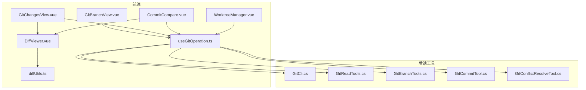
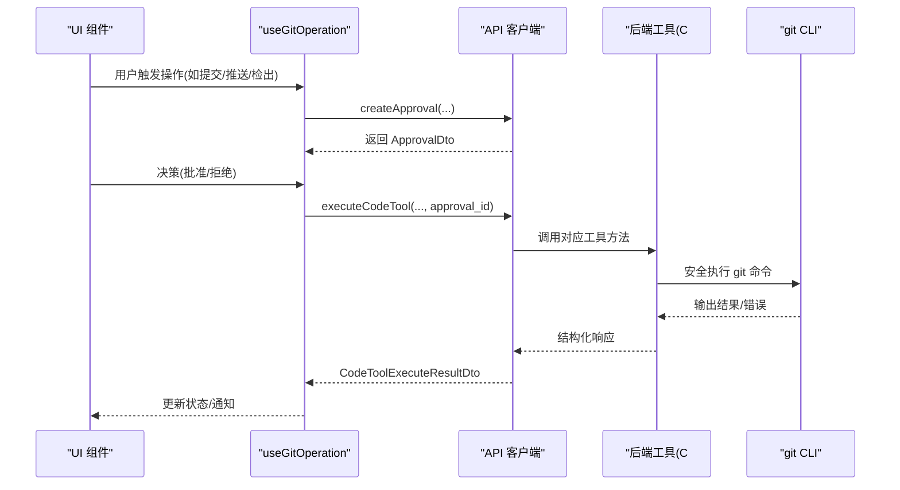
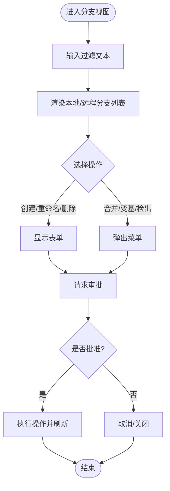
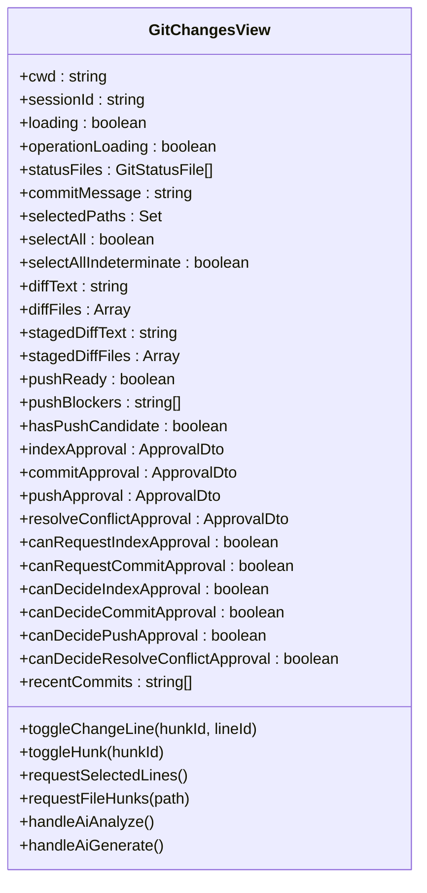
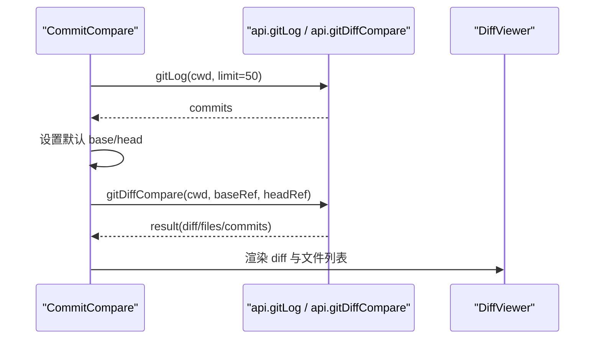
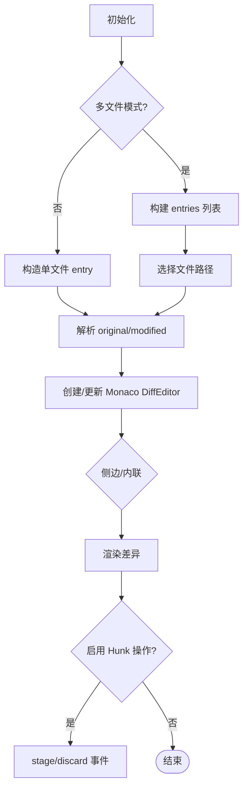
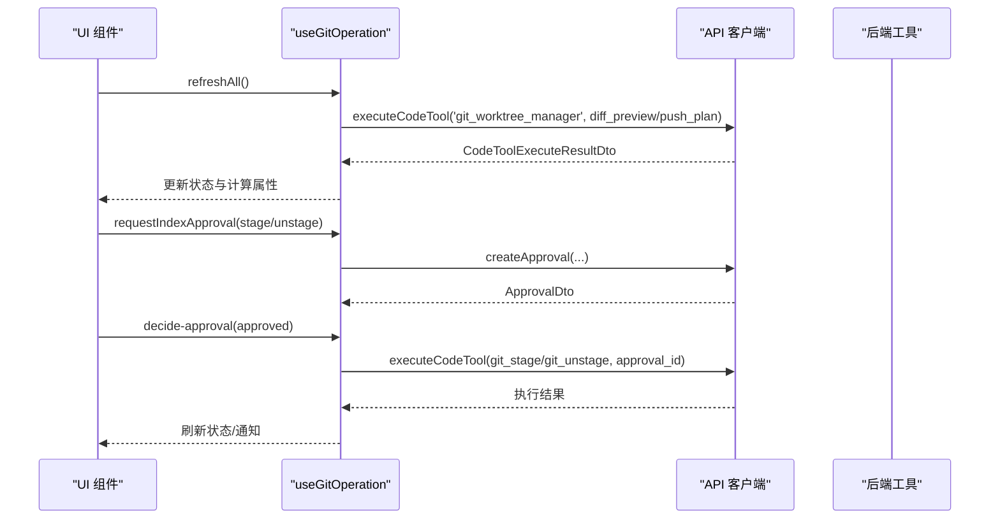
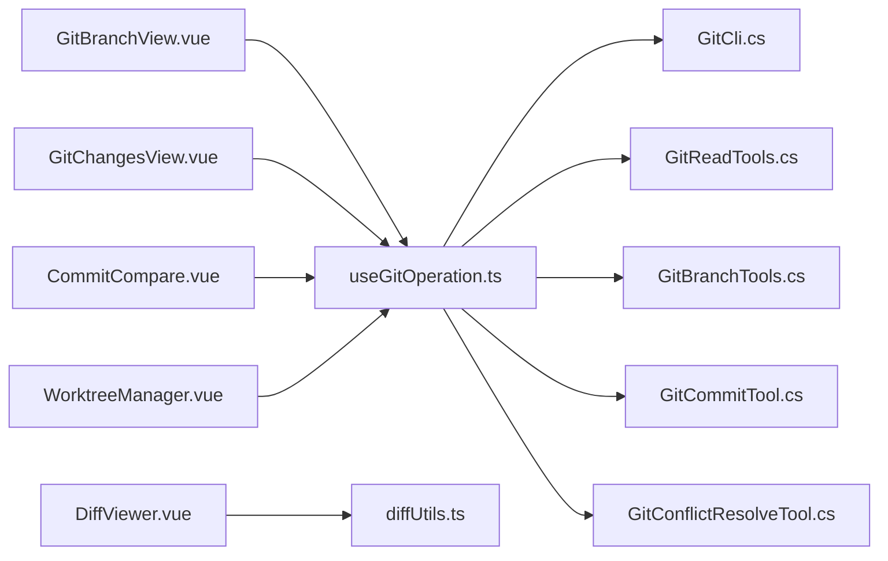

# Git 管理系统

<cite>
**本文引用的文件**   
- [GitBranchView.vue](file://apps/desktop/src/components/git/GitBranchView.vue)
- [GitChangesView.vue](file://apps/desktop/src/components/git/GitChangesView.vue)
- [CommitCompare.vue](file://apps/desktop/src/components/git/CommitCompare.vue)
- [DiffViewer.vue](file://apps/desktop/src/components/git/DiffViewer.vue)
- [WorktreeManager.vue](file://apps/desktop/src/components/git/WorktreeManager.vue)
- [diffUtils.ts](file://apps/desktop/src/components/git/diffUtils.ts)
- [useGitOperation.ts](file://apps/desktop/src/composables/useGitOperation.ts)
- [GitCli.cs](file://TinadecTools/Tools/Git/GitCli.cs)
- [GitReadTools.cs](file://TinadecTools/Tools/Git/GitReadTools.cs)
- [GitBranchTools.cs](file://TinadecTools/Tools/Git/GitBranchTools.cs)
- [GitCommitTool.cs](file://TinadecTools/Tools/Git/GitCommitTool.cs)
- [GitConflictResolveTool.cs](file://TinadecTools/Tools/Git/GitConflictResolveTool.cs)
</cite>

## 目录
1. [简介](#简介)
2. [项目结构](#项目结构)
3. [核心组件](#核心组件)
4. [架构总览](#架构总览)
5. [详细组件分析](#详细组件分析)
6. [依赖关系分析](#依赖关系分析)
7. [性能考虑](#性能考虑)
8. [故障排查指南](#故障排查指南)
9. [结论](#结论)
10. [附录](#附录)

## 简介
本文件面向 Git 管理系统的 UI 封装与后端工具层，系统性说明分支管理、提交历史、差异查看与工作区操作等能力。重点覆盖以下组件与功能：
- GitBranchView：分支列表、工作树管理与对比入口
- GitChangesView：变更列表、差异预览、冲突解决、提交信息编辑与推送准备
- CommitCompare：基于 ref 的提交对比与差异浏览
- DiffViewer：Monaco 驱动的 diff 编辑器（单文件/多文件模式）
- WorktreeManager：工作树创建、切换与删除
- useGitOperation：统一的 Git 操作编排、审批流与状态同步
- 后端 Git 工具：GitCli、GitReadTools、GitBranchTools、GitCommitTool、GitConflictResolveTool

## 项目结构
前端 Vue 组件位于 apps/desktop/src/components/git，使用 composables 中的 useGitOperation 统一编排 API 调用与审批流程；后端 C# 工具位于 TinadecTools/Tools/Git，通过 TerminalRunner 安全执行 git CLI，并提供 JSON 序列化模型。

图表来源 
- [GitBranchView.vue:1-800](file://apps/desktop/src/components/git/GitBranchView.vue#L1-L800)
- [GitChangesView.vue:1-800](file://apps/desktop/src/components/git/GitChangesView.vue#L1-L800)
- [CommitCompare.vue:1-507](file://apps/desktop/src/components/git/CommitCompare.vue#L1-L507)
- [DiffViewer.vue:1-470](file://apps/desktop/src/components/git/DiffViewer.vue#L1-L470)
- [WorktreeManager.vue:1-383](file://apps/desktop/src/components/git/WorktreeManager.vue#L1-L383)
- [diffUtils.ts:1-164](file://apps/desktop/src/components/git/diffUtils.ts#L1-L164)
- [useGitOperation.ts:1-800](file://apps/desktop/src/composables/useGitOperation.ts#L1-L800)
- [GitCli.cs:1-144](file://TinadecTools/Tools/Git/GitCli.cs#L1-L144)
- [GitReadTools.cs:1-554](file://TinadecTools/Tools/Git/GitReadTools.cs#L1-L554)
- [GitBranchTools.cs:1-105](file://TinadecTools/Tools/Git/GitBranchTools.cs#L1-L105)
- [GitCommitTool.cs:1-149](file://TinadecTools/Tools/Git/GitCommitTool.cs#L1-L149)
- [GitConflictResolveTool.cs:1-87](file://TinadecTools/Tools/Git/GitConflictResolveTool.cs#L1-L87)

章节来源
- [GitBranchView.vue:1-800](file://apps/desktop/src/components/git/GitBranchView.vue#L1-L800)
- [GitChangesView.vue:1-800](file://apps/desktop/src/components/git/GitChangesView.vue#L1-L800)
- [CommitCompare.vue:1-507](file://apps/desktop/src/components/git/CommitCompare.vue#L1-L507)
- [DiffViewer.vue:1-470](file://apps/desktop/src/components/git/DiffViewer.vue#L1-L470)
- [WorktreeManager.vue:1-383](file://apps/desktop/src/components/git/WorktreeManager.vue#L1-L383)
- [diffUtils.ts:1-164](file://apps/desktop/src/components/git/diffUtils.ts#L1-L164)
- [useGitOperation.ts:1-800](file://apps/desktop/src/composables/useGitOperation.ts#L1-L800)
- [GitCli.cs:1-144](file://TinadecTools/Tools/Git/GitCli.cs#L1-L144)
- [GitReadTools.cs:1-554](file://TinadecTools/Tools/Git/GitReadTools.cs#L1-L554)
- [GitBranchTools.cs:1-105](file://TinadecTools/Tools/Git/GitBranchTools.cs#L1-L105)
- [GitCommitTool.cs:1-149](file://TinadecTools/Tools/Git/GitCommitTool.cs#L1-L149)
- [GitConflictResolveTool.cs:1-87](file://TinadecTools/Tools/Git/GitConflictResolveTool.cs#L1-L87)

## 核心组件
- GitBranchView：提供本地/远程分支列表、过滤、创建、重命名、删除、合并、变基、工作树子视图与对比入口，并通过事件驱动上层编排审批与执行。
- GitChangesView：展示工作区与暂存区差异、行级选择生成 patch、AI 辅助提交信息与变更分析、冲突解决策略、推送准备与拉取。
- CommitCompare：加载日志、选择 base/head 进行 diff 比较，渲染文件列表与差异内容。
- DiffViewer：基于 Monaco 的 diff 编辑器，支持单文件与多文件模式、语言检测、侧边/内联视图切换、统计与二进制提示。
- WorktreeManager：列出工作树、创建新工作树、切换与删除，并提示需要审批。
- useGitOperation：集中管理状态、计算属性、审批请求与执行、错误通知与增量刷新。

章节来源
- [GitBranchView.vue:1-800](file://apps/desktop/src/components/git/GitBranchView.vue#L1-L800)
- [GitChangesView.vue:1-800](file://apps/desktop/src/components/git/GitChangesView.vue#L1-L800)
- [CommitCompare.vue:1-507](file://apps/desktop/src/components/git/CommitCompare.vue#L1-L507)
- [DiffViewer.vue:1-470](file://apps/desktop/src/components/git/DiffViewer.vue#L1-L470)
- [WorktreeManager.vue:1-383](file://apps/desktop/src/components/git/WorktreeManager.vue#L1-L383)
- [useGitOperation.ts:1-800](file://apps/desktop/src/composables/useGitOperation.ts#L1-L800)

## 架构总览
前端通过 Vue 组件与 composable 编排用户交互，调用后端代码工具（Code Tool）完成 Git 命令执行与数据读取。所有危险操作均经过审批流（Approval），由上层决定批准或拒绝后再执行。

图表来源 
- [useGitOperation.ts:1-800](file://apps/desktop/src/composables/useGitOperation.ts#L1-L800)
- [GitCli.cs:1-144](file://TinadecTools/Tools/Git/GitCli.cs#L1-L144)
- [GitReadTools.cs:1-554](file://TinadecTools/Tools/Git/GitReadTools.cs#L1-L554)
- [GitBranchTools.cs:1-105](file://TinadecTools/Tools/Git/GitBranchTools.cs#L1-L105)
- [GitCommitTool.cs:1-149](file://TinadecTools/Tools/Git/GitCommitTool.cs#L1-L149)
- [GitConflictResolveTool.cs:1-87](file://TinadecTools/Tools/Git/GitConflictResolveTool.cs#L1-L87)

## 详细组件分析

### GitBranchView 组件分析
- 功能要点
  - 分支列表：本地/远程分组、当前分支高亮、ahead/behind 计数、最近提交摘要
  - 分支操作：创建、重命名、删除（含强制）、合并、变基，均通过事件向上派发
  - 审批流：为 checkout、create/delete/rename、merge、rebase、fetch、worktree 等操作显示审批卡片，支持“批准并执行”快捷按钮
  - 子视图：工作树管理（委托 WorktreeManager）、对比（CommitCompare）
- 关键交互
  - 过滤文本、菜单展开、表单输入校验
  - 刷新分支列表、执行已批准的分支操作
- 数据与状态
  - branches、currentBranch、operationLoading、各 ApprovalDto 及 canDecide* 标志
- 集成点
  - 通过 emit 向父组件传递动作，父组件在 useGitOperation 中编排审批与执行

图表来源 
- [GitBranchView.vue:1-800](file://apps/desktop/src/components/git/GitBranchView.vue#L1-L800)
- [useGitOperation.ts:1-800](file://apps/desktop/src/composables/useGitOperation.ts#L1-L800)

章节来源
- [GitBranchView.vue:1-800](file://apps/desktop/src/components/git/GitBranchView.vue#L1-L800)

### GitChangesView 组件分析
- 功能要点
  - 变更列表：按冲突优先排序，显示状态图标与标签
  - 差异预览：解析 unified diff，支持行/块选择，生成 patch 用于 stage/unstage
  - AI 辅助：提交信息生成与变更风险分析（风险等级、影响区域、关注点、测试建议）
  - 冲突解决：ours/theirs/both 三种策略，支持自动合并与剩余冲突数量
  - 提交与推送：提交消息编辑器、约定检查、推送就绪性检查与阻止项
- 关键交互
  - 切换 working tree/staged index 模式、批量选择、一键 stage/unstage
  - 冲突解决按钮与审批执行
  - 推送/拉取审批与执行
- 数据与状态
  - statusFiles、diffText/stagedDiffText、diffFiles/stagedDiffFiles、selectedLineIds、commitMessage、pushBlockers、各类 ApprovalDto

图表来源 
- [GitChangesView.vue:1-800](file://apps/desktop/src/components/git/GitChangesView.vue#L1-L800)

章节来源
- [GitChangesView.vue:1-800](file://apps/desktop/src/components/git/GitChangesView.vue#L1-L800)

### CommitCompare 组件分析
- 功能要点
  - 加载提交日志，默认设置 base/head 为 HEAD~1/HEAD
  - 选择 base/head 后调用 diff_compare，获取 diff 与文件统计
  - 渲染文件列表与差异内容，支持截断提示
- 关键交互
  - 下拉选择提交、手动输入 ref、刷新、比较
- 数据与状态
  - baseRef、headRef、commits、comparing、result、selectedFilePath

图表来源 
- [CommitCompare.vue:1-507](file://apps/desktop/src/components/git/CommitCompare.vue#L1-L507)
- [DiffViewer.vue:1-470](file://apps/desktop/src/components/git/DiffViewer.vue#L1-L470)

章节来源
- [CommitCompare.vue:1-507](file://apps/desktop/src/components/git/CommitCompare.vue#L1-L507)

### DiffViewer 组件分析
- 功能要点
  - 单文件模式：传入 diffText/originalContent/modifiedContent 或 filePath
  - 多文件模式：files 列表与 selectedFilePath，动态切换
  - 语言检测：根据扩展名推断语言
  - 视图模式：侧边/内联切换，统计展示，二进制与截断提示
  - Hunk 操作：可选 enableHunkActions，触发 stage/discard 事件
- 关键交互
  - 文件选择、模式切换、stage/discard hunk
- 数据与状态
  - entries、currentPath、currentEntry、ready、sideBySide、editorRef

图表来源 
- [DiffViewer.vue:1-470](file://apps/desktop/src/components/git/DiffViewer.vue#L1-L470)
- [diffUtils.ts:1-164](file://apps/desktop/src/components/git/diffUtils.ts#L1-L164)

章节来源
- [DiffViewer.vue:1-470](file://apps/desktop/src/components/git/DiffViewer.vue#L1-L470)
- [diffUtils.ts:1-164](file://apps/desktop/src/components/git/diffUtils.ts#L1-L164)

### WorktreeManager 组件分析
- 功能要点
  - 列出工作树，标记当前与主工作树
  - 创建新工作树（分支+路径），自动规范化路径
  - 切换与删除工作树，提示需要审批
- 关键交互
  - 刷新、创建表单、切换、删除
- 数据与状态
  - worktrees、loading、showCreateForm、newBranch、newPath

章节来源
- [WorktreeManager.vue:1-383](file://apps/desktop/src/components/git/WorktreeManager.vue#L1-L383)

### useGitOperation 编排器分析
- 功能要点
  - 统一加载状态、预览数据、推送计划、日志与分支列表
  - 计算属性：repoSummary、pushBlockers、pushReady、hasPushCandidate、branches、logCommits
  - 审批流：为索引更新、提交、推送、拉取、检出、分支操作、工作树操作等创建与执行审批
  - 错误处理与通知：统一错误提示与成功反馈
- 关键交互
  - loadStatus/loadLog/loadBranches/refreshAll
  - request*Approval/executeApproved* 成对方法
- 数据与状态
  - preview/pushPlan/logResult/branchResult、各类 ApprovalDto 与 canDecide* 标志

图表来源 
- [useGitOperation.ts:1-800](file://apps/desktop/src/composables/useGitOperation.ts#L1-L800)

章节来源
- [useGitOperation.ts:1-800](file://apps/desktop/src/composables/useGitOperation.ts#L1-L800)

### 提交信息编辑器 CommitMessageEditor
- 功能要点
  - 支持 type/scope/subject/body/footer 字段，实时拼装提交信息
  - 长度限制与警告（50/72 字符）
  - 复用历史提交消息，解析并回填字段
- 关键交互
  - 类型选择、输入变化、历史复用

章节来源
- [CommitMessageEditor.vue:1-407](file://apps/desktop/src/components/git/CommitMessageEditor.vue#L1-L407)

## 依赖关系分析
- 前端依赖
  - 组件依赖 diffUtils.ts 进行语言检测与 diff 重建
  - 组件通过 useGitOperation 统一调用 API 与编排审批
- 后端依赖
  - GitCli 负责仓库验证与安全执行 git CLI，包含路径围栏与参数白名单
  - GitReadTools 提供只读能力：status、diff、branch_list、worktree_list、ref_list、remote_list、blame、file_at_revision、conflict_preview
  - GitBranchTools/GitCommitTool/GitConflictResolveTool 提供变更能力：checkout/create/delete/rename、commit、conflict_resolve
- 外部依赖
  - TerminalRunner 执行进程，支持超时与输出大小限制
  - Monaco Editor 用于差异可视化

图表来源 
- [GitBranchView.vue:1-800](file://apps/desktop/src/components/git/GitBranchView.vue#L1-L800)
- [GitChangesView.vue:1-800](file://apps/desktop/src/components/git/GitChangesView.vue#L1-L800)
- [CommitCompare.vue:1-507](file://apps/desktop/src/components/git/CommitCompare.vue#L1-L507)
- [WorktreeManager.vue:1-383](file://apps/desktop/src/components/git/WorktreeManager.vue#L1-L383)
- [DiffViewer.vue:1-470](file://apps/desktop/src/components/git/DiffViewer.vue#L1-L470)
- [diffUtils.ts:1-164](file://apps/desktop/src/components/git/diffUtils.ts#L1-L164)
- [useGitOperation.ts:1-800](file://apps/desktop/src/composables/useGitOperation.ts#L1-L800)
- [GitCli.cs:1-144](file://TinadecTools/Tools/Git/GitCli.cs#L1-L144)
- [GitReadTools.cs:1-554](file://TinadecTools/Tools/Git/GitReadTools.cs#L1-L554)
- [GitBranchTools.cs:1-105](file://TinadecTools/Tools/Git/GitBranchTools.cs#L1-L105)
- [GitCommitTool.cs:1-149](file://TinadecTools/Tools/Git/GitCommitTool.cs#L1-L149)
- [GitConflictResolveTool.cs:1-87](file://TinadecTools/Tools/Git/GitConflictResolveTool.cs#L1-L87)

章节来源
- [useGitOperation.ts:1-800](file://apps/desktop/src/composables/useGitOperation.ts#L1-L800)
- [GitCli.cs:1-144](file://TinadecTools/Tools/Git/GitCli.cs#L1-L144)
- [GitReadTools.cs:1-554](file://TinadecTools/Tools/Git/GitReadTools.cs#L1-L554)
- [GitBranchTools.cs:1-105](file://TinadecTools/Tools/Git/GitBranchTools.cs#L1-L105)
- [GitCommitTool.cs:1-149](file://TinadecTools/Tools/Git/GitCommitTool.cs#L1-L149)
- [GitConflictResolveTool.cs:1-87](file://TinadecTools/Tools/Git/GitConflictResolveTool.cs#L1-L87)

## 性能考虑
- 差异与日志限制
  - GitReadTools 的 diff 支持 max_files 与 max_diff_bytes 限制，避免大仓库导致内存与渲染压力
  - blame/file_at_revision 支持 max_output_bytes，防止超大输出
- 增量更新
  - useGitOperation 将 status 与 push_plan 并行加载，减少等待时间
  - 仅在审批通过后执行变更，避免无效刷新
- 离线支持策略
  - 前端可缓存最近日志与分支列表，网络不可用时仍可查看历史
  - 差异预览与冲突预览可在本地仓库可用时快速响应
- 渲染优化
  - DiffViewer 按需重建 Monaco 模型，避免重复创建
  - 多文件模式下仅渲染选中文件的差异

[本节为通用指导，不直接分析具体文件]

## 故障排查指南
- 常见错误码与原因
  - git_not_found：未安装 git 或 PATH 配置问题
  - not_a_repo：路径不是 Git 仓库或不在工作区内
  - no_staged_changes：提交前无暂存变更
  - max_output_bytes/max_diff_bytes：输出过大被截断
- 定位步骤
  - 检查仓库根与工作区路径合法性（GitCli.ResolveRepo）
  - 查看后端工具返回的 error_code 与 stderr
  - 确认审批状态是否为 approved
  - 检查网络与远端可达性（fetch/push/pull）
- 恢复建议
  - 修正路径或安装 git
  - 先 stage 再 commit
  - 调整 max_* 参数或分批处理
  - 重新 fetch 并设置 upstream

章节来源
- [GitCli.cs:1-144](file://TinadecTools/Tools/Git/GitCli.cs#L1-L144)
- [GitReadTools.cs:1-554](file://TinadecTools/Tools/Git/GitReadTools.cs#L1-L554)
- [GitCommitTool.cs:1-149](file://TinadecTools/Tools/Git/GitCommitTool.cs#L1-L149)
- [useGitOperation.ts:1-800](file://apps/desktop/src/composables/useGitOperation.ts#L1-L800)

## 结论
本系统通过前端组件与后端工具的清晰分层，结合严格的审批流与安全的 CLI 执行，实现了完整的 Git 管理能力。UI 层面提供了丰富的交互与可视化，后端层面保证了安全性与可扩展性。建议在大规模仓库场景下进一步优化差异与日志的增量加载与缓存策略，以提升用户体验。

[本节为总结，不直接分析具体文件]

## 附录
- 常用 API 与工具映射
  - git_status → GitReadTools.StatusAsync
  - git_diff → GitReadTools.DiffAsync
  - git_branch_list → GitReadTools.BranchListAsync
  - git_worktree_list → GitReadTools.WorktreeListAsync
  - git_commit → GitCommitTool.CommitAsync
  - git_conflict_resolve → GitConflictResolveTool.ResolveAsync
  - git_checkout/create/delete/rename → GitBranchTools.*
- 组件间事件与数据流
  - GitChangesView 通过 emit 触发 stage/unstage/commit/push/pull/conflict-resolve
  - GitBranchView 通过 emit 触发 checkout/create/delete/rename/merge/rebase/worktree
  - useGitOperation 统一管理审批与执行，确保一致性

[本节为补充信息，不直接分析具体文件]