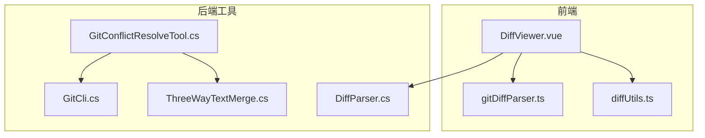
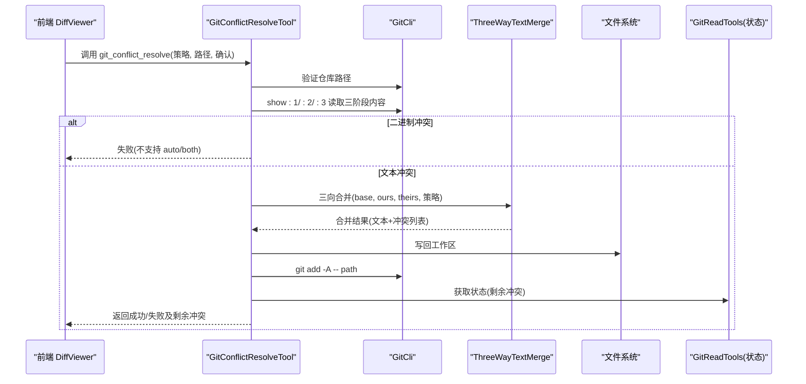
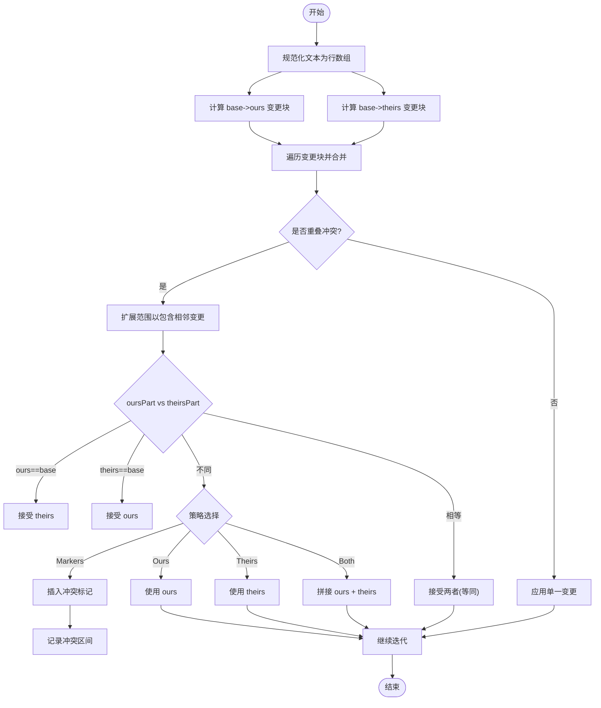
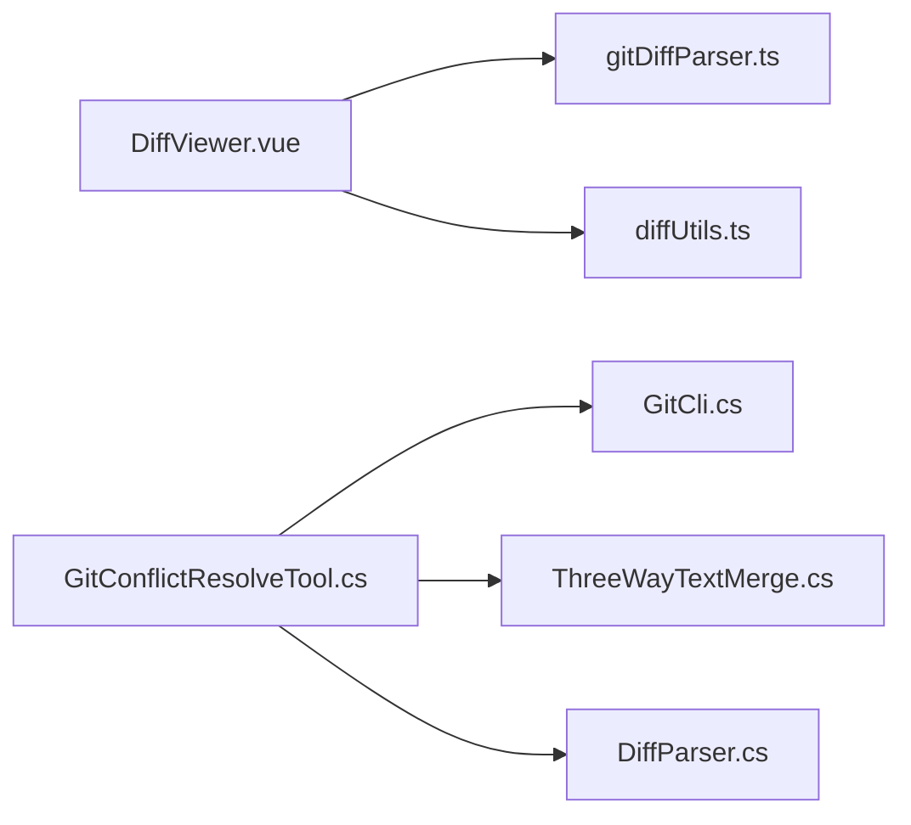

# 冲突解决

<cite>
**本文引用的文件**
- [GitConflictResolveTool.cs](file://TinadecTools/Tools/Git/GitConflictResolveTool.cs)
- [ThreeWayTextMerge.cs](file://TinadecTools/Tools/Git/ThreeWayTextMerge.cs)
- [DiffParser.cs](file://TinadecTools/Tools/Git/DiffParser.cs)
- [GitCli.cs](file://TinadecTools/Tools/Git/GitCli.cs)
- [DiffViewer.vue](file://apps/desktop/src/components/git/DiffViewer.vue)
- [gitDiffParser.ts](file://apps/desktop/src/gitDiffParser.ts)
- [diffUtils.ts](file://apps/desktop/src/components/git/diffUtils.ts)
</cite>

## 目录
1. [简介](#简介)
2. [项目结构](#项目结构)
3. [核心组件](#核心组件)
4. [架构总览](#架构总览)
5. [详细组件分析](#详细组件分析)
6. [依赖关系分析](#依赖关系分析)
7. [性能考量](#性能考量)
8. [故障排查指南](#故障排查指南)
9. [结论](#结论)
10. [附录](#附录)

## 简介
本文件面向 Git 冲突解决能力，系统性说明冲突检测机制（合并冲突、变基冲突、索引冲突）、三向文本合并算法实现（基准解析、差异计算、自动合并策略）、冲突解决界面（手动编辑、接受/拒绝选择、合并预览），以及复杂场景处理（二进制文件、编码问题）与历史记录。文档基于仓库中现有代码进行梳理，确保内容与实际实现一致。

## 项目结构
围绕冲突解决的相关代码主要分布在两个层面：
- 后端工具层（C#）：提供 Git CLI 调用、冲突读取与三向文本合并、结果写入与状态查询。
- 前端展示层（Vue/TS）：统一 diff 解析、多文件切换、差异可视化、行级操作（暂存/丢弃）。



图表来源
- [DiffViewer.vue:1-120](file://apps/desktop/src/components/git/DiffViewer.vue#L1-L120)
- [gitDiffParser.ts:1-178](file://apps/desktop/src/gitDiffParser.ts#L1-L178)
- [diffUtils.ts:1-164](file://apps/desktop/src/components/git/diffUtils.ts#L1-L164)
- [GitCli.cs:1-144](file://TinadecTools/Tools/Git/GitCli.cs#L1-L144)
- [GitConflictResolveTool.cs:1-87](file://TinadecTools/Tools/Git/GitConflictResolveTool.cs#L1-L87)
- [ThreeWayTextMerge.cs:1-143](file://TinadecTools/Tools/Git/ThreeWayTextMerge.cs#L1-L143)
- [DiffParser.cs:1-316](file://TinadecTools/Tools/Git/DiffParser.cs#L1-L316)

章节来源
- [GitConflictResolveTool.cs:1-87](file://TinadecTools/Tools/Git/GitConflictResolveTool.cs#L1-L87)
- [ThreeWayTextMerge.cs:1-143](file://TinadecTools/Tools/Git/ThreeWayTextMerge.cs#L1-L143)
- [DiffParser.cs:1-316](file://TinadecTools/Tools/Git/DiffParser.cs#L1-L316)
- [GitCli.cs:1-144](file://TinadecTools/Tools/Git/GitCli.cs#L1-L144)
- [DiffViewer.vue:1-200](file://apps/desktop/src/components/git/DiffViewer.vue#L1-L200)
- [gitDiffParser.ts:1-178](file://apps/desktop/src/gitDiffParser.ts#L1-L178)
- [diffUtils.ts:1-164](file://apps/desktop/src/components/git/diffUtils.ts#L1-L164)

## 核心组件
- 冲突解决工具（C#）
  - 负责校验仓库路径、读取三个阶段的文件内容、执行三向文本合并或按策略直接采用 ours/theirs/both、写回工作区并 add 到索引、返回剩余冲突列表与当前状态。
- 三向文本合并（C#）
  - 将 base/ours/theirs 归一化为行数组，使用 LCS 计算变更块，合并时判断是否重叠冲突，支持标记模式与自动选择策略。
- Diff 解析（C# 与 TS 双端）
  - C# 侧解析 name-status/numstat/unified diff；TS 侧解析 unified diff 为结构化对象，用于前端渲染。
- Git CLI 封装（C#）
  - 安全执行 git 命令、限制输出长度、错误码映射、路径校验与相对化。
- 差异视图（Vue/TS）
  - 单文件/多文件模式、行级暂存/丢弃、二进制提示、统计汇总、语言识别与 Monaco DiffEditor 集成。

章节来源
- [GitConflictResolveTool.cs:1-87](file://TinadecTools/Tools/Git/GitConflictResolveTool.cs#L1-L87)
- [ThreeWayTextMerge.cs:1-143](file://TinadecTools/Tools/Git/ThreeWayTextMerge.cs#L1-L143)
- [DiffParser.cs:1-316](file://TinadecTools/Tools/Git/DiffParser.cs#L1-L316)
- [GitCli.cs:1-144](file://TinadecTools/Tools/Git/GitCli.cs#L1-L144)
- [DiffViewer.vue:1-200](file://apps/desktop/src/components/git/DiffViewer.vue#L1-L200)
- [gitDiffParser.ts:1-178](file://apps/desktop/src/gitDiffParser.ts#L1-L178)
- [diffUtils.ts:1-164](file://apps/desktop/src/components/git/diffUtils.ts#L1-L164)

## 架构总览
下图展示了从前端触发到后端执行、再回到前端展示的端到端流程。



图表来源
- [GitConflictResolveTool.cs:34-86](file://TinadecTools/Tools/Git/GitConflictResolveTool.cs#L34-L86)
- [GitCli.cs:22-59](file://TinadecTools/Tools/Git/GitCli.cs#L22-L59)
- [ThreeWayTextMerge.cs:16-89](file://TinadecTools/Tools/Git/ThreeWayTextMerge.cs#L16-L89)

## 详细组件分析

### 冲突检测机制
- 合并冲突
  - 通过读取索引中的 stage 1/2/3 内容来判断是否存在冲突。若三者均不存在则视为非冲突路径。
- 变基冲突
  - 变基过程中同样会在索引中产生 stage 信息，读取逻辑与合并冲突一致。
- 索引冲突
  - 通过后续状态查询（如 status）筛选出 IsConflicted 的文件集合，作为“剩余冲突”的判定依据。

章节来源
- [GitConflictResolveTool.cs:45-48](file://TinadecTools/Tools/Git/GitConflictResolveTool.cs#L45-L48)
- [GitConflictResolveTool.cs:75-76](file://TinadecTools/Tools/Git/GitConflictResolveTool.cs#L75-L76)

### 三向文本合并算法
- 基准文件解析
  - 将 base/ours/theirs 文本规范化为行数组（统一换行符、去除末尾空行影响）。
- 内容差异计算
  - 使用 LCS 动态规划计算最长公共子序列，生成变更块（Change），限制最大单元格数以控制内存占用。
- 自动合并策略
  - 当 ours/theirs 变更不重叠时，分别应用；当重叠且内容相同或与 base 相同，可自动合并；否则根据策略插入标记或选择 ours/theirs/both。



图表来源
- [ThreeWayTextMerge.cs:16-89](file://TinadecTools/Tools/Git/ThreeWayTextMerge.cs#L16-L89)
- [ThreeWayTextMerge.cs:91-116](file://TinadecTools/Tools/Git/ThreeWayTextMerge.cs#L91-L116)

章节来源
- [ThreeWayTextMerge.cs:16-89](file://TinadecTools/Tools/Git/ThreeWayTextMerge.cs#L16-L89)
- [ThreeWayTextMerge.cs:91-116](file://TinadecTools/Tools/Git/ThreeWayTextMerge.cs#L91-L116)

### 冲突解决界面
- 手动编辑
  - 前端基于 Monaco DiffEditor 提供 side-by-side/inline 两种视图，用户可直接在编辑器中修改。
- 接受/拒绝选择
  - 支持整文件或按 hunk 的暂存/丢弃操作，通过事件向上抛出，由上层逻辑驱动 git add 或还原。
- 合并预览
  - 支持多文件切换、统计汇总（+/- 行数）、二进制文件提示、截断提示等。

```mermaid
classDiagram
class DiffViewer {
+props : diffText, originalContent, modifiedContent, filePath, language
+files : DiffFileEntry[]
+selectedFilePath : string
+enableHunkActions : boolean
+mountEditor()
+refreshModel()
+stageCurrent()
+discardCurrent()
}
class GitDiffParser {
+parseUnifiedDiff(diff) : GitParsedDiff
}
class DiffUtils {
+detectLanguage(path) : string
+reconstructFromHunks(file) : {original, modified}
+buildDiffEntries(diffText, summaries) : DiffFileEntry[]
+summarizeEntries(entries) : {additions, deletions}
}
DiffViewer --> GitDiffParser : "解析 diff"
DiffViewer --> DiffUtils : "构建条目/统计"
```

图表来源
- [DiffViewer.vue:1-200](file://apps/desktop/src/components/git/DiffViewer.vue#L1-L200)
- [gitDiffParser.ts:1-178](file://apps/desktop/src/gitDiffParser.ts#L1-L178)
- [diffUtils.ts:1-164](file://apps/desktop/src/components/git/diffUtils.ts#L1-L164)

章节来源
- [DiffViewer.vue:1-200](file://apps/desktop/src/components/git/DiffViewer.vue#L1-L200)
- [gitDiffParser.ts:1-178](file://apps/desktop/src/gitDiffParser.ts#L1-L178)
- [diffUtils.ts:1-164](file://apps/desktop/src/components/git/diffUtils.ts#L1-L164)

### 复杂冲突场景处理
- 二进制文件
  - 后端在 auto/both 策略下对二进制冲突直接拒绝，要求选择 ours/theirs；前端检测到 binary 标志后显示提示信息。
- 编码问题
  - 后端写回文件时使用 UTF-8（无 BOM），并在合并前统一换行符，降低跨平台差异带来的冲突噪声。

章节来源
- [GitConflictResolveTool.cs:49-58](file://TinadecTools/Tools/Git/GitConflictResolveTool.cs#L49-L58)
- [GitConflictResolveTool.cs:72-73](file://TinadecTools/Tools/Git/GitConflictResolveTool.cs#L72-L73)
- [ThreeWayTextMerge.cs:135-140](file://TinadecTools/Tools/Git/ThreeWayTextMerge.cs#L135-L140)
- [DiffViewer.vue:280-282](file://apps/desktop/src/components/git/DiffViewer.vue#L280-L282)

### 冲突解决历史记录
- 当前实现未内置持久化的冲突解决历史。可通过以下方式补充：
  - 在工具层增加“记录”步骤，将每次解决的策略、时间戳、路径、冲突数量写入本地日志或数据库。
  - 在前端增加“历史面板”，聚合最近若干次解决记录，支持回溯查看。
  - 结合 Git 的 reflog 或自定义元数据文件（如 .git/conflict-history.json）进行持久化。

[本节为概念性建议，不直接分析具体文件]

## 依赖关系分析
- 前端依赖
  - DiffViewer 依赖 gitDiffParser 与 diffUtils，用于解析与构建差异条目、统计与语言识别。
- 后端依赖
  - GitConflictResolveTool 依赖 GitCli 执行命令、ThreeWayTextMerge 执行文本合并、DiffParser 解析 diff 输出（供其他工具使用）。
- 外部依赖
  - Git CLI、Monaco Editor（前端）、文件系统。



图表来源
- [DiffViewer.vue:1-120](file://apps/desktop/src/components/git/DiffViewer.vue#L1-L120)
- [gitDiffParser.ts:1-178](file://apps/desktop/src/gitDiffParser.ts#L1-L178)
- [diffUtils.ts:1-164](file://apps/desktop/src/components/git/diffUtils.ts#L1-L164)
- [GitConflictResolveTool.cs:1-87](file://TinadecTools/Tools/Git/GitConflictResolveTool.cs#L1-L87)
- [GitCli.cs:1-144](file://TinadecTools/Tools/Git/GitCli.cs#L1-L144)
- [ThreeWayTextMerge.cs:1-143](file://TinadecTools/Tools/Git/ThreeWayTextMerge.cs#L1-L143)
- [DiffParser.cs:1-316](file://TinadecTools/Tools/Git/DiffParser.cs#L1-L316)

章节来源
- [DiffViewer.vue:1-120](file://apps/desktop/src/components/git/DiffViewer.vue#L1-L120)
- [gitDiffParser.ts:1-178](file://apps/desktop/src/gitDiffParser.ts#L1-L178)
- [diffUtils.ts:1-164](file://apps/desktop/src/components/git/diffUtils.ts#L1-L164)
- [GitConflictResolveTool.cs:1-87](file://TinadecTools/Tools/Git/GitConflictResolveTool.cs#L1-L87)
- [GitCli.cs:1-144](file://TinadecTools/Tools/Git/GitCli.cs#L1-L144)
- [ThreeWayTextMerge.cs:1-143](file://TinadecTools/Tools/Git/ThreeWayTextMerge.cs#L1-L143)
- [DiffParser.cs:1-316](file://TinadecTools/Tools/Git/DiffParser.cs#L1-L316)

## 性能考量
- 三向合并的 LCS 矩阵大小受 MaxLcsCells 限制，避免大文件导致内存爆炸；超出阈值时退化为整体替换。
- Git CLI 输出捕获有字符上限，防止超大输出阻塞；必要时需分块或过滤。
- 前端 Monaco DiffEditor 按需重建模型，避免频繁重绘；多文件模式下仅更新当前选中文件的模型。

章节来源
- [ThreeWayTextMerge.cs:13-14](file://TinadecTools/Tools/Git/ThreeWayTextMerge.cs#L13-L14)
- [GitCli.cs:94-116](file://TinadecTools/Tools/Git/GitCli.cs#L94-L116)
- [DiffViewer.vue:127-152](file://apps/desktop/src/components/git/DiffViewer.vue#L127-L152)

## 故障排查指南
- 常见错误
  - 非 Git 仓库：ResolveRepo 会返回错误码 not_a_repo。
  - 路径不在仓库内：ResolveRepositoryRelativePath 会抛出权限异常。
  - 二进制冲突使用 auto/both：工具返回失败，需选择 ours/theirs。
  - Git 未安装或不可用：RunAsync 返回 git_not_found。
- 定位方法
  - 检查返回的 Error 字段与 RemainingConflicts 列表。
  - 查看 Git CLI 的 Stderr 输出，确认命令参数与路径是否正确。
  - 前端观察 binary/truncated 标志与统计信息，辅助判断数据来源。

章节来源
- [GitCli.cs:15-17](file://TinadecTools/Tools/Git/GitCli.cs#L15-L17)
- [GitCli.cs:124-135](file://TinadecTools/Tools/Git/GitCli.cs#L124-L135)
- [GitConflictResolveTool.cs:44-58](file://TinadecTools/Tools/Git/GitConflictResolveTool.cs#L44-L58)
- [GitConflictResolveTool.cs:85-86](file://TinadecTools/Tools/Git/GitConflictResolveTool.cs#L85-L86)

## 结论
本项目实现了稳健的 Git 冲突检测与三向文本合并能力，并通过前端差异视图提供了良好的交互体验。针对二进制与编码问题已有明确处理策略。建议在现有基础上补充冲突解决历史记录与更细粒度的 hunk 级自动合并策略，以提升自动化程度与可追溯性。

## 附录
- API 参考（工具输入/输出要点）
  - 输入参数：repository_path、path、strategy（auto/ours/theirs/both）、confirm_resolve（确认字段）。
  - 输出字段：success、error、path、strategy、auto_merged、conflict_count、remaining_conflicts、status。
- 前端交互要点
  - 单文件/多文件模式切换、行级暂存/丢弃、二进制与截断提示、统计汇总。

章节来源
- [GitConflictResolveTool.cs:7-25](file://TinadecTools/Tools/Git/GitConflictResolveTool.cs#L7-L25)
- [DiffViewer.vue:12-48](file://apps/desktop/src/components/git/DiffViewer.vue#L12-L48)