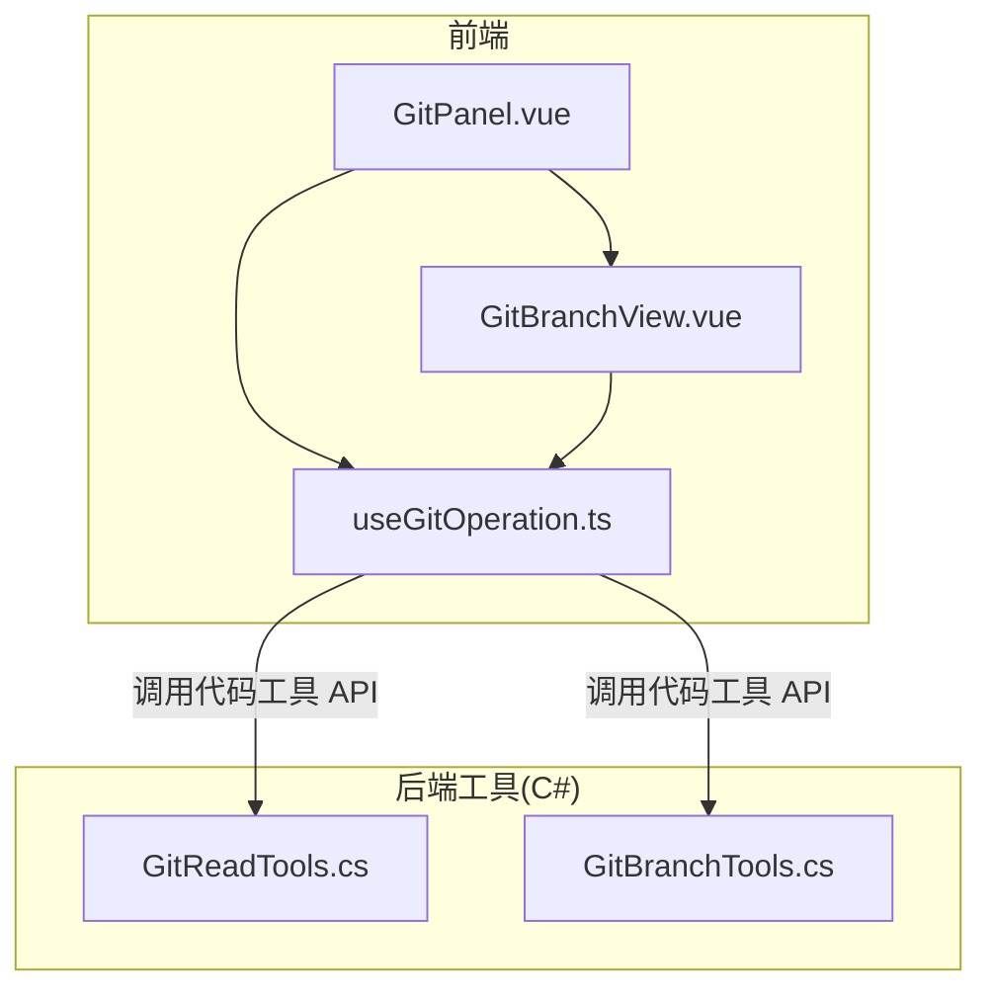
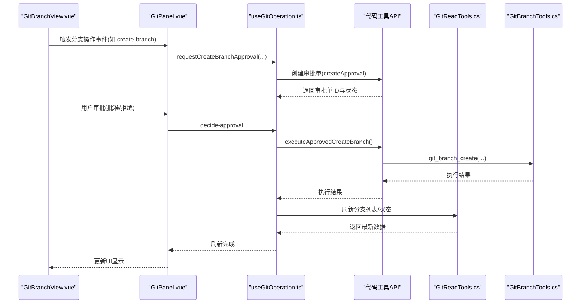
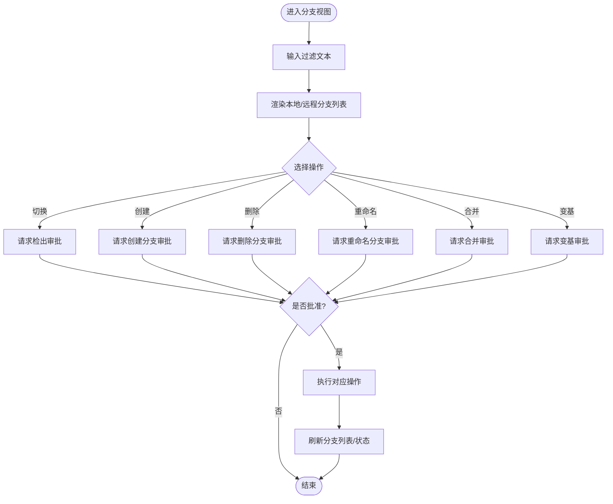
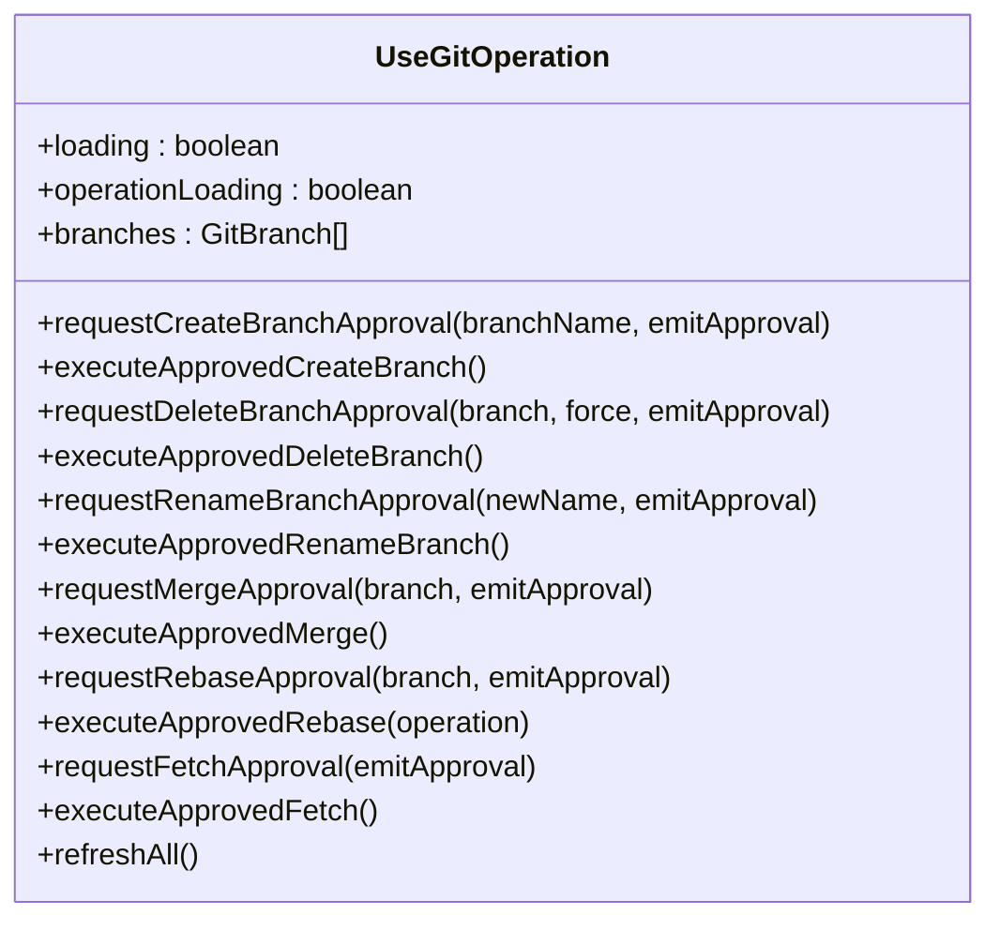
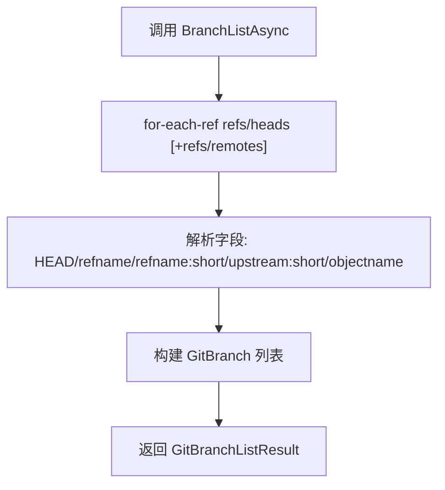
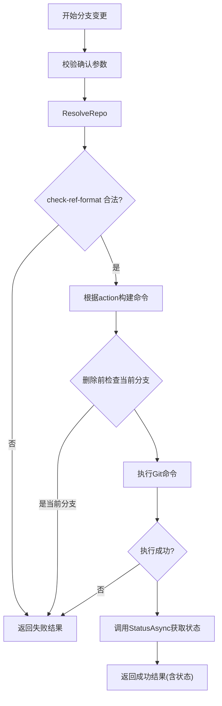
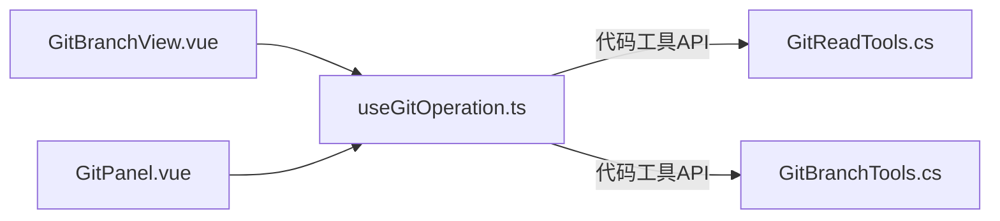

# 分支管理

<cite>
**本文引用的文件**   
- [GitBranchView.vue](file://apps/desktop/src/components/git/GitBranchView.vue)
- [GitPanel.vue](file://apps/desktop/src/components/GitPanel.vue)
- [useGitOperation.ts](file://apps/desktop/src/composables/useGitOperation.ts)
- [GitReadTools.cs](file://TinadecTools/Tools/Git/GitReadTools.cs)
- [GitBranchTools.cs](file://TinadecTools/Tools/Git/GitBranchTools.cs)
</cite>

## 目录
1. [简介](#简介)
2. [项目结构](#项目结构)
3. [核心组件](#核心组件)
4. [架构总览](#架构总览)
5. [详细组件分析](#详细组件分析)
6. [依赖关系分析](#依赖关系分析)
7. [性能考虑](#性能考虑)
8. [故障排查指南](#故障排查指南)
9. [结论](#结论)
10. [附录](#附录)

## 简介
本文件为 Git 分支管理功能的完整技术文档，聚焦于分支视图组件的实现与交互流程，覆盖以下关键能力：
- 分支列表展示（本地/远程、当前分支高亮、未推送提交数 ahead/behind）
- 分支切换、创建、删除、重命名
- 分支保护机制（审批流）、冲突检测与预览
- 错误处理、用户确认流程与撤销支持（rebase 继续/中止/跳过）
- 分支搜索、过滤与排序（前端实现）
- 多仓库工作树（worktree）管理与分支同步策略（fetch/push/pull/rebase）

## 项目结构
分支管理功能由前端 Vue 组件、组合式逻辑 composable 以及后端 C# 工具层共同构成：
- 前端 UI：GitBranchView.vue 负责分支视图的渲染与交互；GitPanel.vue 作为容器组织标签页与数据绑定。
- 业务编排：useGitOperation.ts 集中管理状态、审批流、API 调用与刷新策略。
- 后端工具：GitReadTools.cs 提供只读查询（分支列表、状态、冲突预览等），GitBranchTools.cs 提供分支变更操作（检出、创建、删除、重命名）。

图表来源
- [GitPanel.vue](file://apps/desktop/src/components/GitPanel.vue)
- [GitBranchView.vue](file://apps/desktop/src/components/git/GitBranchView.vue)
- [useGitOperation.ts](file://apps/desktop/src/composables/useGitOperation.ts)
- [GitReadTools.cs](file://TinadecTools/Tools/Git/GitReadTools.cs)
- [GitBranchTools.cs](file://TinadecTools/Tools/Git/GitBranchTools.cs)

章节来源
- [GitPanel.vue](file://apps/desktop/src/components/GitPanel.vue)
- [GitBranchView.vue](file://apps/desktop/src/components/git/GitBranchView.vue)
- [useGitOperation.ts](file://apps/desktop/src/composables/useGitOperation.ts)
- [GitReadTools.cs](file://TinadecTools/Tools/Git/GitReadTools.cs)
- [GitBranchTools.cs](file://TinadecTools/Tools/Git/GitBranchTools.cs)

## 核心组件
- GitBranchView.vue：分支视图组件，负责分支列表渲染、搜索过滤、菜单操作（合并、变基、重命名、删除）、工作树子视图与比较子视图入口，以及与父组件的事件通信。
- useGitOperation.ts：统一的状态与审批流编排，封装了分支相关的所有请求与执行方法（检出、创建、删除、重命名、拉取、推送、合并、变基、冲突解决、工作树操作），并提供一键“审批+执行”快捷路径。
- GitReadTools.cs：只读 Git 能力集合，包括分支列表、状态、推送就绪检查、差异、引用、远程、冲突预览等。
- GitBranchTools.cs：分支变更能力集合，包含检出、创建、删除、重命名的安全校验与执行。

章节来源
- [GitBranchView.vue](file://apps/desktop/src/components/git/GitBranchView.vue)
- [useGitOperation.ts](file://apps/desktop/src/composables/useGitOperation.ts)
- [GitReadTools.cs](file://TinadecTools/Tools/Git/GitReadTools.cs)
- [GitBranchTools.cs](file://TinadecTools/Tools/Git/GitBranchTools.cs)

## 架构总览
分支管理的整体流程遵循“UI 事件 → Composable 编排 → 审批流 → 工具执行 → 结果刷新”的模式：
- UI 层：GitBranchView.vue 暴露事件（如 checkout、create-branch、delete-branch、rename-branch、merge-branch、rebase-branch、fetch、execute-* 等），并由 GitPanel.vue 监听并转发到 useGitOperation.ts。
- 编排层：useGitOperation.ts 负责参数校验、创建审批单、触发执行、错误通知与数据刷新。
- 工具层：通过代码工具 API 调用 GitReadTools.cs 与 GitBranchTools.cs 提供的只读与变更能力。

图表来源
- [GitBranchView.vue](file://apps/desktop/src/components/git/GitBranchView.vue)
- [GitPanel.vue](file://apps/desktop/src/components/GitPanel.vue)
- [useGitOperation.ts](file://apps/desktop/src/composables/useGitOperation.ts)
- [GitReadTools.cs](file://TinadecTools/Tools/Git/GitReadTools.cs)
- [GitBranchTools.cs](file://TinadecTools/Tools/Git/GitBranchTools.cs)

## 详细组件分析

### 分支视图组件 GitBranchView.vue
- 分支列表展示
  - 支持本地与远程分支分组显示，当前分支高亮，ahead/behind 计数以徽章形式呈现。
  - 支持按名称搜索过滤（大小写不敏感）。
- 分支操作
  - 切换：点击行触发 checkout 事件。
  - 创建：输入新分支名后请求审批，批准后执行创建并自动检出。
  - 删除：普通删除与强制删除两种模式，禁止删除当前分支。
  - 重命名：限制不能与当前分支同名。
  - 合并/变基：非当前分支可触发 merge/rebase 审批。
- 工作树与比较
  - 子标签页切换到 worktrees（委托 WorktreeManager.vue）与 compare（CommitCompare.vue）。
- 审批与执行
  - 每个操作均生成对应审批项（checkout/branch/fetch/delete/rename/merge/rebase/worktree），支持“批准/拒绝”与“已批准执行”按钮。
- 错误与加载
  - 全局 loading 与 operationLoading 控制界面状态，空数据时显示提示。

图表来源
- [GitBranchView.vue](file://apps/desktop/src/components/git/GitBranchView.vue)

章节来源
- [GitBranchView.vue](file://apps/desktop/src/components/git/GitBranchView.vue)

### 编排逻辑 useGitOperation.ts
- 分支数据加载
  - loadBranches 调用代码工具 action=branch_list(all=true) 获取分支列表，并缓存至 branchResult。
- 分支操作审批与执行
  - requestCheckoutApproval / executeApprovedCheckout：检出分支。
  - requestCreateBranchApproval / executeApprovedCreateBranch：创建并检出分支。
  - requestDeleteBranchApproval / executeApprovedDeleteBranch：删除分支（支持 force）。
  - requestRenameBranchApproval / executeApprovedRenameBranch：重命名当前分支。
  - requestMergeApproval / executeApprovedMerge：合并分支。
  - requestRebaseApproval / executeApprovedRebase：变基（支持 continue/abort/skip）。
  - requestFetchApproval / executeApprovedFetch：拉取远程更新。
- 一键审批执行
  - approveAndExecute* 系列函数将“审批+执行”合并为一步，减少交互步骤。
- 错误处理与刷新
  - mutationCompleted 统一成功/失败通知，失败时提示警告，成功时提示成功并刷新数据。
  - notifyOperationError 捕获异常并输出错误通知。

图表来源
- [useGitOperation.ts](file://apps/desktop/src/composables/useGitOperation.ts)

章节来源
- [useGitOperation.ts](file://apps/desktop/src/composables/useGitOperation.ts)

### 只读工具 GitReadTools.cs
- 分支列表
  - BranchListAsync 使用 for-each-ref 列出 refs/heads 与可选 refs/remotes，解析 HEAD、refname、upstream、objectname 字段，构造 GitBranch 列表。
- 状态与推送就绪
  - StatusAsync 解析 porcelain v1 输出，计算 ahead/behind、uncommitted changes、conflicted/untracked 标记。
  - PushReadinessAsync 汇总 blockers（detached head、no upstream、behind、uncommitted changes），判断 ready 与 needs_push。
- 冲突预览
  - ConflictPreviewAsync 扫描 ls-files -u，读取 stage 1/2/3 内容，结合 ThreeWayTextMerge 生成分块冲突信息。

图表来源
- [GitReadTools.cs](file://TinadecTools/Tools/Git/GitReadTools.cs)

章节来源
- [GitReadTools.cs](file://TinadecTools/Tools/Git/GitReadTools.cs)

### 变更工具 GitBranchTools.cs
- 分支变更操作
  - CheckoutAsync/CreateAsync/DeleteAsync/RenameAsync 均通过 ExecuteAsync 统一处理。
- 安全校验
  - ToolConfirmations.Require 确保需要确认的参数存在。
  - check-ref-format --branch 验证分支名合法性。
  - 删除前检查是否为当前分支，避免误删。
- 执行与结果
  - 根据 action 组装命令（checkout/-b、branch -d/-D、branch -m），执行后调用 StatusAsync 获取最新状态。

图表来源
- [GitBranchTools.cs](file://TinadecTools/Tools/Git/GitBranchTools.cs)

章节来源
- [GitBranchTools.cs](file://TinadecTools/Tools/Git/GitBranchTools.cs)

## 依赖关系分析
- 组件耦合
  - GitBranchView.vue 仅通过 props 与 emits 与父组件通信，职责单一，内聚度高。
  - useGitOperation.ts 集中编排所有 Git 操作，降低 UI 组件复杂度。
- 外部依赖
  - 代码工具 API 作为中间层，屏蔽底层 Git CLI 细节。
  - GitReadTools.cs 与 GitBranchTools.cs 分别承担只读与变更能力，边界清晰。
- 潜在循环依赖
  - 前端组件与 composable 之间通过事件与回调解耦，无直接导入依赖。
  - 后端工具类之间通过静态方法与共享模型协作，未见循环引用。

图表来源
- [GitBranchView.vue](file://apps/desktop/src/components/git/GitBranchView.vue)
- [GitPanel.vue](file://apps/desktop/src/components/GitPanel.vue)
- [useGitOperation.ts](file://apps/desktop/src/composables/useGitOperation.ts)
- [GitReadTools.cs](file://TinadecTools/Tools/Git/GitReadTools.cs)
- [GitBranchTools.cs](file://TinadecTools/Tools/Git/GitBranchTools.cs)

章节来源
- [GitBranchView.vue](file://apps/desktop/src/components/git/GitBranchView.vue)
- [GitPanel.vue](file://apps/desktop/src/components/GitPanel.vue)
- [useGitOperation.ts](file://apps/desktop/src/composables/useGitOperation.ts)
- [GitReadTools.cs](file://TinadecTools/Tools/Git/GitReadTools.cs)
- [GitBranchTools.cs](file://TinadecTools/Tools/Git/GitBranchTools.cs)

## 性能考虑
- 前端
  - 分支列表过滤在内存中进行，适用于中小规模分支数量；若分支量极大，建议引入虚拟滚动或分页。
  - 刷新策略采用按需加载（切换标签页时加载日志/分支），避免全量刷新。
- 后端
  - for-each-ref 与 status 命令输出解析高效，但大仓库 diff/conflict 预览需限制最大字节数与文件数，避免阻塞。
  - 批量操作（如 fetch/push）应支持取消与进度反馈。

## 故障排查指南
- 常见错误
  - 分支名非法：check-ref-format 失败，检查命名规范。
  - 无法删除当前分支：删除前校验阻止，需先切换分支。
  - 推送受阻：PushReadinessAsync 返回 blockers（如 detached head、no upstream、behind、uncommitted changes），按提示修复。
  - 冲突未解决：ConflictPreviewAsync 返回冲突分块，需选择 ours/theirs/both 策略解决。
- 调试建议
  - 查看审批单状态与命令摘要，确认操作意图。
  - 启用代码工具执行结果日志，定位失败原因。
  - 使用 refreshAll 刷新状态，确保 UI 与仓库一致。

章节来源
- [GitReadTools.cs](file://TinadecTools/Tools/Git/GitReadTools.cs)
- [GitBranchTools.cs](file://TinadecTools/Tools/Git/GitBranchTools.cs)
- [useGitOperation.ts](file://apps/desktop/src/composables/useGitOperation.ts)

## 结论
分支管理功能通过清晰的组件分层与统一的编排逻辑，实现了安全的分支操作与良好的用户体验。审批流保障了变更的可控性，只读与变更工具的职责分离提升了可维护性。未来可在大数据量场景优化列表渲染与异步任务管理，进一步增强并发与可观测性。

## 附录
- 分支状态字段说明
  - name：分支名
  - is_current：是否当前分支
  - is_remote：是否远程分支
  - upstream：上游分支
  - ahead/behind：领先/落后提交数
  - last_subject/last_date：最近提交信息与时间（用于展示）
- 多仓库与工作树
  - 通过 worktree 子视图管理多个工作区，支持创建/移除/切换，与分支操作协同。
- 同步策略
  - fetch：拉取远程更新
  - push：推送本地提交
  - pull：拉取并合并/变基
  - rebase：交互式变基（支持 continue/abort/skip）