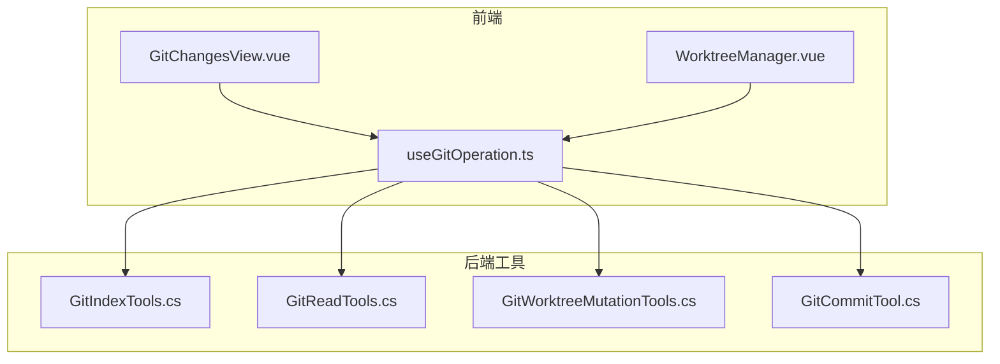
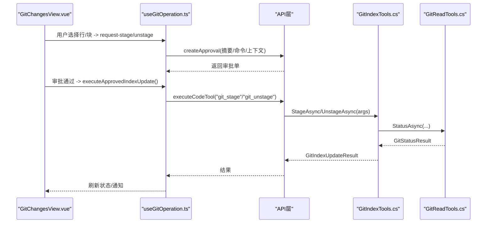
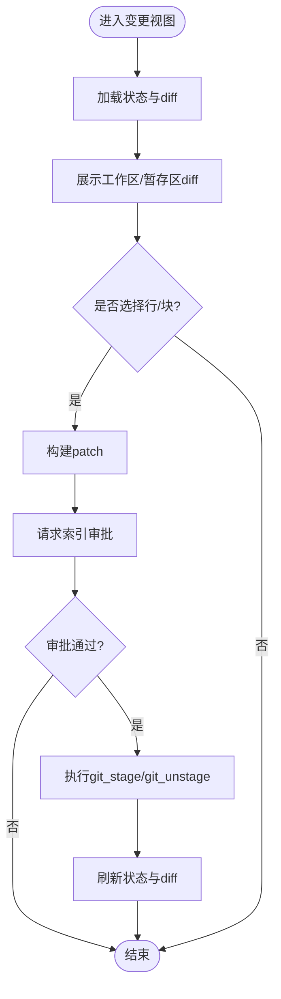
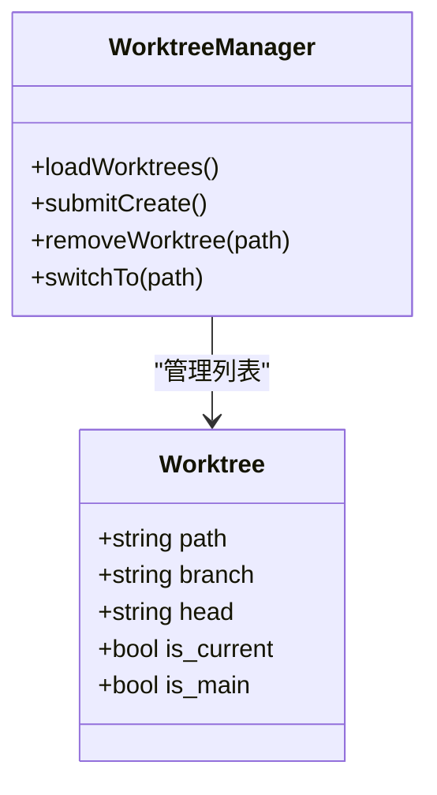
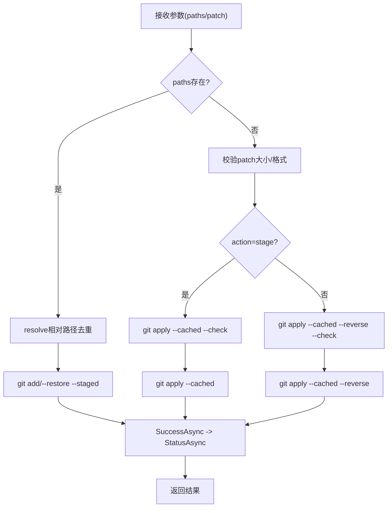
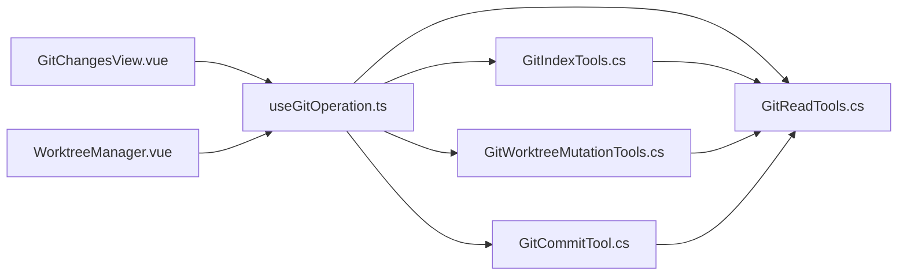

# 工作区操作

<cite>
**本文引用的文件**   
- [GitIndexTools.cs](file://TinadecTools/Tools/Git/GitIndexTools.cs)
- [GitReadTools.cs](file://TinadecTools/Tools/Git/GitReadTools.cs)
- [GitWorktreeMutationTools.cs](file://TinadecTools/Tools/Git/GitWorktreeMutationTools.cs)
- [GitCommitTool.cs](file://TinadecTools/Tools/Git/GitCommitTool.cs)
- [GitChangesView.vue](file://apps/desktop/src/components/git/GitChangesView.vue)
- [WorktreeManager.vue](file://apps/desktop/src/components/git/WorktreeManager.vue)
- [useGitOperation.ts](file://apps/desktop/src/composables/useGitOperation.ts)
</cite>

## 目录
1. [简介](#简介)
2. [项目结构](#项目结构)
3. [核心组件](#核心组件)
4. [架构总览](#架构总览)
5. [详细组件分析](#详细组件分析)
6. [依赖关系分析](#依赖关系分析)
7. [性能考量](#性能考量)
8. [故障排查指南](#故障排查指南)
9. [结论](#结论)
10. [附录](#附录)

## 简介
本文件面向 Git 工作区操作能力，覆盖以下关键主题：
- 工作区变更查看器：暂存区管理、文件状态跟踪与批量操作
- 工作树管理器：创建、切换与删除
- 暂存/取消暂存、丢弃更改与恢复文件
- 工作区清理、忽略规则配置与自动修复（通过工具链与前端交互）
- 权限控制、操作审计与撤销支持（审批流与结果回写）

该文档以代码为依据，结合前后端实现，提供从架构到细节的完整说明。

## 项目结构
围绕工作区操作的代码主要分布在两个层次：
- 后端工具层（C#）：封装 Git CLI 调用，暴露工具函数，负责参数校验、安全边界、错误码与结果聚合
- 前端界面层（Vue + TS）：展示变更、选择差异、发起审批、执行操作并刷新状态

图表来源
- [GitChangesView.vue:1-800](file://apps/desktop/src/components/git/GitChangesView.vue#L1-L800)
- [WorktreeManager.vue:1-383](file://apps/desktop/src/components/git/WorktreeManager.vue#L1-L383)
- [useGitOperation.ts:1-800](file://apps/desktop/src/composables/useGitOperation.ts#L1-L800)
- [GitIndexTools.cs:1-147](file://TinadecTools/Tools/Git/GitIndexTools.cs#L1-L147)
- [GitReadTools.cs:1-554](file://TinadecTools/Tools/Git/GitReadTools.cs#L1-L554)
- [GitWorktreeMutationTools.cs:1-108](file://TinadecTools/Tools/Git/GitWorktreeMutationTools.cs#L1-L108)
- [GitCommitTool.cs:1-149](file://TinadecTools/Tools/Git/GitCommitTool.cs#L1-L149)

章节来源
- [GitChangesView.vue:1-800](file://apps/desktop/src/components/git/GitChangesView.vue#L1-L800)
- [WorktreeManager.vue:1-383](file://apps/desktop/src/components/git/WorktreeManager.vue#L1-L383)
- [useGitOperation.ts:1-800](file://apps/desktop/src/composables/useGitOperation.ts#L1-L800)
- [GitIndexTools.cs:1-147](file://TinadecTools/Tools/Git/GitIndexTools.cs#L1-L147)
- [GitReadTools.cs:1-554](file://TinadecTools/Tools/Git/GitReadTools.cs#L1-L554)
- [GitWorktreeMutationTools.cs:1-108](file://TinadecTools/Tools/Git/GitWorktreeMutationTools.cs#L1-L108)
- [GitCommitTool.cs:1-149](file://TinadecTools/Tools/Git/GitCommitTool.cs#L1-L149)

## 核心组件
- 工作区变更查看器（GitChangesView.vue）
  - 展示工作区与暂存区的 diff 预览
  - 支持按行/块选择生成 patch 进行“部分暂存”
  - 集成 AI 提交消息与建议、冲突解决入口、推送准备检查
- 工作树管理器（WorktreeManager.vue）
  - 列出仓库所有 worktree，支持创建、切换、删除
  - 路径限制在 .tinadec/worktrees 下，避免越权访问
- 索引更新工具（GitIndexTools.cs）
  - 提供 git_stage / git_unstage 工具函数
  - 支持 paths 或 patch 两种模式；patch 仅支持文本统一 diff
- 读取工具（GitReadTools.cs）
  - 提供 status/diff/branch_list/worktree_list/ref_list/remote_list/blame/file_at_revision/conflict_preview 等只读能力
- 工作树变更工具（GitWorktreeMutationTools.cs）
  - 提供 git_worktree_create / git_worktree_remove
  - 强制确认、分支名校验、路径白名单、失败回滚友好提示
- 提交工具（GitCommitTool.cs）
  - 提供 git_commit，支持 include_all / commit_staged_only / paths 三种模式
  - 提交前校验 staged 内容，返回提交哈希与状态

章节来源
- [GitChangesView.vue:1-800](file://apps/desktop/src/components/git/GitChangesView.vue#L1-L800)
- [WorktreeManager.vue:1-383](file://apps/desktop/src/components/git/WorktreeManager.vue#L1-L383)
- [GitIndexTools.cs:1-147](file://TinadecTools/Tools/Git/GitIndexTools.cs#L1-L147)
- [GitReadTools.cs:1-554](file://TinadecTools/Tools/Git/GitReadTools.cs#L1-L554)
- [GitWorktreeMutationTools.cs:1-108](file://TinadecTools/Tools/Git/GitWorktreeMutationTools.cs#L1-L108)
- [GitCommitTool.cs:1-149](file://TinadecTools/Tools/Git/GitCommitTool.cs#L1-L149)

## 架构总览
前端通过 useGitOperation 编排 UI 状态与审批流，调用后端工具函数完成实际 Git 操作。后端工具对 Git CLI 进行安全封装，返回结构化结果供前端渲染。

图表来源
- [GitChangesView.vue:1-800](file://apps/desktop/src/components/git/GitChangesView.vue#L1-L800)
- [useGitOperation.ts:1-800](file://apps/desktop/src/composables/useGitOperation.ts#L1-L800)
- [GitIndexTools.cs:1-147](file://TinadecTools/Tools/Git/GitIndexTools.cs#L1-L147)
- [GitReadTools.cs:1-554](file://TinadecTools/Tools/Git/GitReadTools.cs#L1-L554)

## 详细组件分析

### 工作区变更查看器（GitChangesView.vue）
- 功能要点
  - 显示工作区与暂存区 diff，支持按行/块选择生成 patch
  - 支持“全部暂存/取消暂存”和“选中行暂存/取消暂存”
  - 冲突文件高亮并提供 ours/theirs/both 解决入口
  - 集成 AI 提交消息生成与变更风险评估
  - 推送准备检查（behind/ahead/upstream）
- 交互流程
  - 用户选择差异行 -> 构建 patch -> 请求索引审批 -> 执行 git_stage/git_unstage -> 刷新状态

章节来源
- [GitChangesView.vue:1-800](file://apps/desktop/src/components/git/GitChangesView.vue#L1-L800)
- [useGitOperation.ts:1-800](file://apps/desktop/src/composables/useGitOperation.ts#L1-L800)

### 工作树管理器（WorktreeManager.vue）
- 功能要点
  - 列出 worktree，标记当前/主分支
  - 创建时自动规范化路径为 .tinadec/worktrees/<slug>
  - 删除非当前 worktree，支持 --force
- 安全策略
  - 路径必须在 .tinadec/worktrees 下，否则拒绝
  - 分支名合法性校验
  - 创建/删除需显式确认

图表来源
- [WorktreeManager.vue:1-383](file://apps/desktop/src/components/git/WorktreeManager.vue#L1-L383)
- [GitWorktreeMutationTools.cs:1-108](file://TinadecTools/Tools/Git/GitWorktreeMutationTools.cs#L1-L108)

章节来源
- [WorktreeManager.vue:1-383](file://apps/desktop/src/components/git/WorktreeManager.vue#L1-L383)
- [GitWorktreeMutationTools.cs:1-108](file://TinadecTools/Tools/Git/GitWorktreeMutationTools.cs#L1-L108)

### 索引更新工具（GitIndexTools.cs）
- 能力
  - git_stage / git_unstage 工具函数
  - 支持两种输入：paths（批量）或 patch（文本统一 diff）
  - patch 模式限制：仅文本文件、禁止重命名/二进制/新增/删除模式
  - 成功后返回 updated_paths、selection_kind 与最新 status
- 关键流程
  - 解析仓库 -> 校验参数 -> 选择 paths 或 patch 分支 -> 调用 Git CLI -> 获取 status -> 返回结果

图表来源
- [GitIndexTools.cs:1-147](file://TinadecTools/Tools/Git/GitIndexTools.cs#L1-L147)
- [GitReadTools.cs:1-554](file://TinadecTools/Tools/Git/GitReadTools.cs#L1-L554)

章节来源
- [GitIndexTools.cs:1-147](file://TinadecTools/Tools/Git/GitIndexTools.cs#L1-L147)
- [GitReadTools.cs:1-554](file://TinadecTools/Tools/Git/GitReadTools.cs#L1-L554)

### 读取工具（GitReadTools.cs）
- 能力
  - status：工作区/暂存区状态、分支、上游、ahead/behind
  - diff：working_tree/staged/ref_range 三段 diff，合并 numstat/name-status
  - branch_list/ref_list/remote_list：分支、引用、远程信息
  - worktree_list：worktree 列表与当前标记
  - blame/file_at_revision/conflict_preview：细粒度历史与冲突块
- 设计要点
  - 所有输出均包含 success/error/error_code 字段
  - 大量使用 maxOutputChars/maxFiles 限制防止过大响应
  - 冲突预览基于三向合并，提取 ours/theirs/base 块

章节来源
- [GitReadTools.cs:1-554](file://TinadecTools/Tools/Git/GitReadTools.cs#L1-L554)

### 工作树变更工具（GitWorktreeMutationTools.cs）
- 能力
  - git_worktree_create：创建新 worktree，若分支不存在则新建
  - git_worktree_remove：删除指定 worktree，支持 --force
- 安全与约束
  - 路径必须位于 .tinadec/worktrees 下
  - 分支名合法性校验
  - 不允许删除当前 worktree
  - 需要显式确认（ConfirmWorktreeCreate/Remove）

章节来源
- [GitWorktreeMutationTools.cs:1-108](file://TinadecTools/Tools/Git/GitWorktreeMutationTools.cs#L1-L108)

### 提交工具（GitCommitTool.cs）
- 能力
  - git_commit：支持 include_all / commit_staged_only / paths 三种模式
  - 提交前校验 staged 内容，无变更则返回 no_staged_changes
  - 返回提交哈希、输出与提交后状态
- 关键流程
  - 参数校验 -> 根据模式执行 git add -> 校验 staged -> 执行 git commit -> 读取 HEAD 与 status

章节来源
- [GitCommitTool.cs:1-149](file://TinadecTools/Tools/Git/GitCommitTool.cs#L1-L149)

## 依赖关系分析
- 前端依赖
  - GitChangesView.vue 依赖 useGitOperation.ts 的状态管理与审批流
  - WorktreeManager.vue 通过 api.executeCodeTool 调用 git_worktree_manager
- 后端依赖
  - GitIndexTools.cs 依赖 GitCli（CLI 封装）与 GitReadTools.cs（status）
  - GitWorktreeMutationTools.cs 依赖 GitCli 与 GitReadTools.WorktreeListAsync
  - GitCommitTool.cs 依赖 GitCli 与 GitReadTools.StatusAsync

图表来源
- [GitChangesView.vue:1-800](file://apps/desktop/src/components/git/GitChangesView.vue#L1-L800)
- [WorktreeManager.vue:1-383](file://apps/desktop/src/components/git/WorktreeManager.vue#L1-L383)
- [useGitOperation.ts:1-800](file://apps/desktop/src/composables/useGitOperation.ts#L1-L800)
- [GitIndexTools.cs:1-147](file://TinadecTools/Tools/Git/GitIndexTools.cs#L1-L147)
- [GitReadTools.cs:1-554](file://TinadecTools/Tools/Git/GitReadTools.cs#L1-L554)
- [GitWorktreeMutationTools.cs:1-108](file://TinadecTools/Tools/Git/GitWorktreeMutationTools.cs#L1-L108)
- [GitCommitTool.cs:1-149](file://TinadecTools/Tools/Git/GitCommitTool.cs#L1-L149)

章节来源
- [useGitOperation.ts:1-800](file://apps/desktop/src/composables/useGitOperation.ts#L1-L800)
- [GitReadTools.cs:1-554](file://TinadecTools/Tools/Git/GitReadTools.cs#L1-L554)

## 性能考量
- 差异与状态限制
  - diff 最大文件数与字节数限制，避免大仓库卡顿
  - blame/file_at_revision 输出字节上限
- 并发与异步
  - 前端并行加载 diff 与 push_plan，减少等待
  - 后端使用异步任务与超时控制
- 资源保护
  - patch 大小限制与文本校验，防止注入与溢出
  - worktree 路径白名单，避免文件系统越权

[本节为通用指导，不直接分析具体文件]

## 故障排查指南
- 常见错误码与原因
  - NotARepoCode：目标路径不是 Git 仓库
  - patch_output_limit：patch 超过限制
  - no_staged_changes：提交时无暂存变更
  - 路径不在 .tinadec/worktrees：worktree 创建/删除被拒绝
- 定位步骤
  - 检查返回值中的 error/error_code 字段
  - 查看 stdout/stderr 输出（如适用）
  - 确认仓库状态（status）、上游分支、ahead/behind
  - 对于冲突，使用 conflict_preview 查看 ours/theirs/base 块

章节来源
- [GitIndexTools.cs:1-147](file://TinadecTools/Tools/Git/GitIndexTools.cs#L1-L147)
- [GitReadTools.cs:1-554](file://TinadecTools/Tools/Git/GitReadTools.cs#L1-L554)
- [GitWorktreeMutationTools.cs:1-108](file://TinadecTools/Tools/Git/GitWorktreeMutationTools.cs#L1-L108)
- [GitCommitTool.cs:1-149](file://TinadecTools/Tools/Git/GitCommitTool.cs#L1-L149)

## 结论
本工作区操作体系以前端可视化与审批流为核心，配合后端工具的安全封装，实现了稳健的暂存/取消暂存、提交、工作树管理与冲突处理。通过严格的参数校验、路径白名单与输出限制，保障了安全性与性能。建议在生产环境中启用完整的审批与审计策略，并结合日志与监控持续优化。

[本节为总结性内容，不直接分析具体文件]

## 附录
- 常用工具函数清单（后端）
  - git_status / git_diff / git_branch_list / git_worktree_list / git_ref_list / git_remote_list / git_blame / git_file_at_revision / git_conflict_preview
  - git_stage / git_unstage / git_commit / git_worktree_create / git_worktree_remove
- 前端能力清单
  - 变更预览、行级选择与 patch 构建、AI 提交消息、冲突解决入口、推送准备检查、工作树管理

[本节为补充信息，不直接分析具体文件]