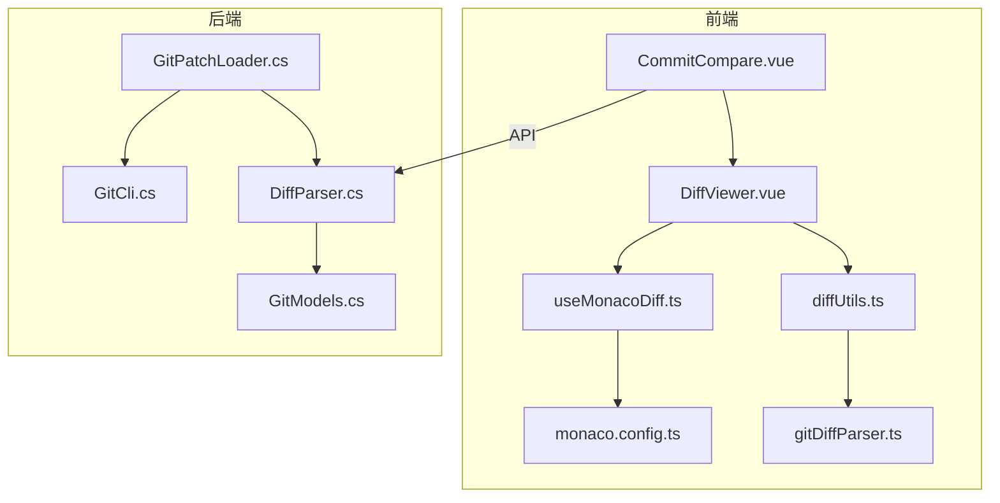
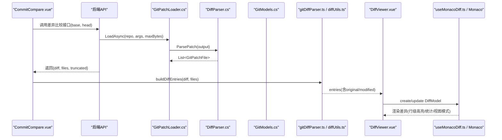
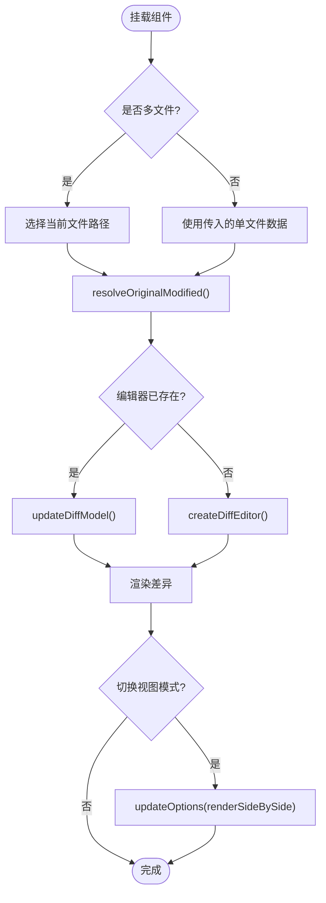
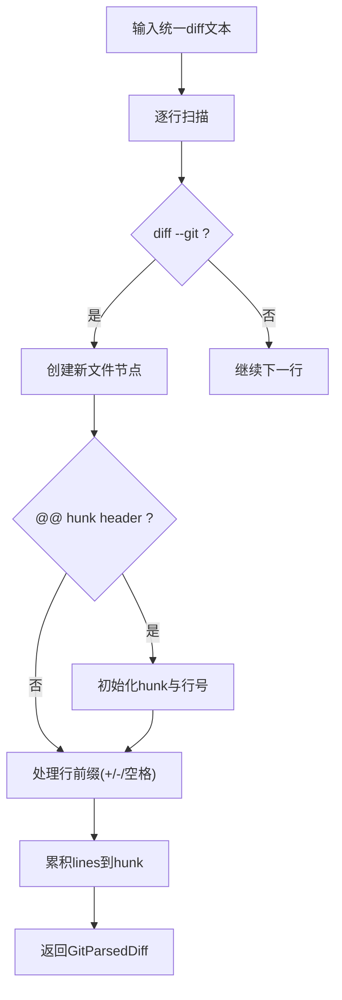
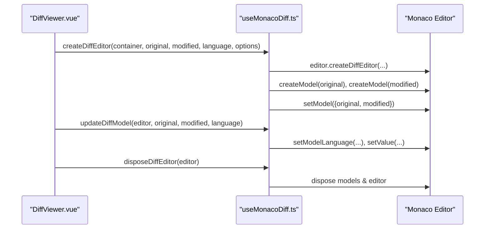
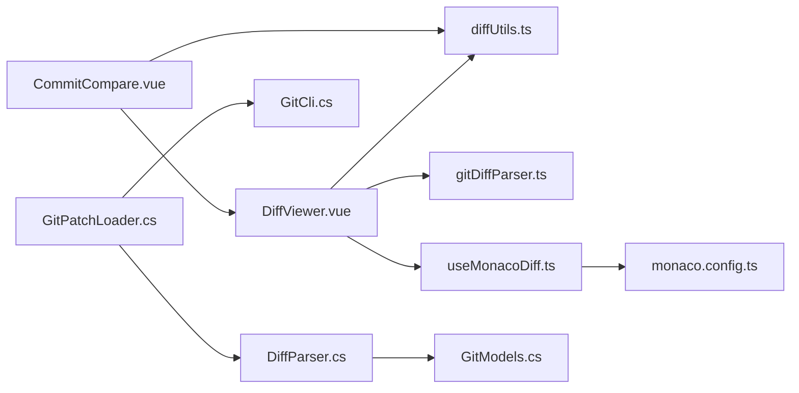

# 差异对比

<cite>
**本文引用的文件**   
- [DiffViewer.vue](file://apps/desktop/src/components/git/DiffViewer.vue)
- [diffUtils.ts](file://apps/desktop/src/components/git/diffUtils.ts)
- [gitDiffParser.ts](file://apps/desktop/src/gitDiffParser.ts)
- [useMonacoDiff.ts](file://apps/desktop/src/composables/useMonacoDiff.ts)
- [monaco.config.ts](file://apps/desktop/src/monaco.config.ts)
- [CommitCompare.vue](file://apps/desktop/src/components/git/CommitCompare.vue)
- [DiffParser.cs](file://TinadecTools/Tools/Git/DiffParser.cs)
- [GitModels.cs](file://TinadecTools/Tools/Git/GitModels.cs)
- [GitPatchLoader.cs](file://TinadecTools/Tools/Git/GitPatchLoader.cs)
- [GitCli.cs](file://TinadecTools/Tools/Git/GitCli.cs)
- [gitDiffParser.test.ts](file://apps/desktop/src/gitDiffParser.test.ts)
</cite>

## 目录
1. [简介](#简介)
2. [项目结构](#项目结构)
3. [核心组件](#核心组件)
4. [架构总览](#架构总览)
5. [详细组件分析](#详细组件分析)
6. [依赖关系分析](#依赖关系分析)
7. [性能考量](#性能考量)
8. [故障排查指南](#故障排查指南)
9. [结论](#结论)
10. [附录](#附录)

## 简介
本文件面向 Git 差异对比功能，系统性梳理差异查看器与相关工具链的实现与交互。内容覆盖：
- 行级差异高亮、新增删除标记与空白字符处理
- 双视图模式（并排/内联）切换
- 代码折叠与搜索能力（由编辑器提供）
- 差异计算算法（统一 diff 解析）、增量更新与性能优化
- 文件头信息展示、统计信息与导航
- 大文件处理、二进制文件支持与差异缓存策略

## 项目结构
前端以 Vue 组件为核心，使用 Monaco Editor 的 DiffEditor 渲染差异；后端通过 .NET 工具调用 git CLI 生成 unified diff、name-status、numstat 等数据，供前端解析与展示。关键文件组织如下：
- 前端差异展示：DiffViewer.vue、diffUtils.ts、gitDiffParser.ts、useMonacoDiff.ts、monaco.config.ts
- 前端对比入口：CommitCompare.vue
- 后端差异解析与加载：DiffParser.cs、GitModels.cs、GitPatchLoader.cs、GitCli.cs



**图示来源** 
- [DiffViewer.vue:1-120](file://apps/desktop/src/components/git/DiffViewer.vue#L1-L120)
- [diffUtils.ts:1-164](file://apps/desktop/src/components/git/diffUtils.ts#L1-L164)
- [gitDiffParser.ts:1-178](file://apps/desktop/src/gitDiffParser.ts#L1-L178)
- [useMonacoDiff.ts:1-127](file://apps/desktop/src/composables/useMonacoDiff.ts#L1-L127)
- [monaco.config.ts:1-67](file://apps/desktop/src/monaco.config.ts#L1-L67)
- [CommitCompare.vue:1-120](file://apps/desktop/src/components/git/CommitCompare.vue#L1-L120)
- [DiffParser.cs:1-120](file://TinadecTools/Tools/Git/DiffParser.cs#L1-L120)
- [GitModels.cs:1-123](file://TinadecTools/Tools/Git/GitModels.cs#L1-L123)
- [GitPatchLoader.cs:1-42](file://TinadecTools/Tools/Git/GitPatchLoader.cs#L1-L42)
- [GitCli.cs:1-144](file://TinadecTools/Tools/Git/GitCli.cs#L1-L144)

**章节来源**
- [DiffViewer.vue:1-120](file://apps/desktop/src/components/git/DiffViewer.vue#L1-L120)
- [CommitCompare.vue:1-120](file://apps/desktop/src/components/git/CommitCompare.vue#L1-L120)

## 核心组件
- DiffViewer.vue：差异查看器主组件，负责单文件/多文件模式、统计展示、视图模式切换、二进制与大文件提示、以及将原始/修改文本注入 Monaco DiffEditor。
- diffUtils.ts：构建 DiffFileEntry 列表、语言检测、从 hunks 重建近似原文/改文、汇总统计。
- gitDiffParser.ts：统一 diff 文本解析为结构化对象（文件、hunk、行级别变更）。
- useMonacoDiff.ts：封装 Monaco DiffEditor 的创建、主题适配、模型更新与销毁。
- monaco.config.ts：配置 Monaco Worker，确保语法高亮与编辑能力在 Vite 环境下正常工作。
- CommitCompare.vue：对比入口，选择 base/head 引用，调用 API 获取 diff 与统计，驱动 DiffViewer 展示。
- 后端 DiffParser.cs、GitModels.cs、GitPatchLoader.cs、GitCli.cs：执行 git CLI、解析 name-status/numstat/patch、返回结构化结果。

**章节来源**
- [DiffViewer.vue:1-200](file://apps/desktop/src/components/git/DiffViewer.vue#L1-L200)
- [diffUtils.ts:1-164](file://apps/desktop/src/components/git/diffUtils.ts#L1-L164)
- [gitDiffParser.ts:1-178](file://apps/desktop/src/gitDiffParser.ts#L1-L178)
- [useMonacoDiff.ts:1-127](file://apps/desktop/src/composables/useMonacoDiff.ts#L1-L127)
- [monaco.config.ts:1-67](file://apps/desktop/src/monaco.config.ts#L1-L67)
- [CommitCompare.vue:1-150](file://apps/desktop/src/components/git/CommitCompare.vue#L1-L150)
- [DiffParser.cs:1-120](file://TinadecTools/Tools/Git/DiffParser.cs#L1-L120)
- [GitModels.cs:1-123](file://TinadecTools/Tools/Git/GitModels.cs#L1-L123)
- [GitPatchLoader.cs:1-42](file://TinadecTools/Tools/Git/GitPatchLoader.cs#L1-L42)
- [GitCli.cs:1-144](file://TinadecTools/Tools/Git/GitCli.cs#L1-L144)

## 架构总览
前后端协作流程：
- 前端 CommitCompare.vue 发起比较请求，后端通过 GitCli.cs 调用 git CLI，使用 DiffParser.cs 解析输出，返回 diff 文本与文件统计。
- 前端 gitDiffParser.ts 将 diff 文本解析为结构化数据，diffUtils.ts 根据 hunks 重建近似原文/改文，DiffViewer.vue 将数据注入 Monaco DiffEditor 进行渲染。
- Monaco 提供行级差异高亮、并排/内联视图、搜索与折叠等能力。



**图示来源** 
- [CommitCompare.vue:100-140](file://apps/desktop/src/components/git/CommitCompare.vue#L100-L140)
- [GitPatchLoader.cs:1-42](file://TinadecTools/Tools/Git/GitPatchLoader.cs#L1-L42)
- [DiffParser.cs:140-260](file://TinadecTools/Tools/Git/DiffParser.cs#L140-L260)
- [gitDiffParser.ts:36-156](file://apps/desktop/src/gitDiffParser.ts#L36-L156)
- [diffUtils.ts:118-153](file://apps/desktop/src/components/git/diffUtils.ts#L118-L153)
- [DiffViewer.vue:127-156](file://apps/desktop/src/components/git/DiffViewer.vue#L127-L156)
- [useMonacoDiff.ts:65-110](file://apps/desktop/src/composables/useMonacoDiff.ts#L65-L110)

## 详细组件分析

### DiffViewer.vue：差异查看器主组件
- 支持单文件与多文件模式，动态选择当前文件并更新显示。
- 统计面板展示当前文件与全部文件的 +add/-del 计数。
- 视图模式切换：并排/内联（renderSideBySide），通过 updateOptions 即时生效。
- 二进制与大文件提示：binary 与 truncated 标志控制展示。
- 通过 useMonacoDiff 创建/更新 DiffEditor 模型，实现增量更新。



**图示来源** 
- [DiffViewer.vue:127-156](file://apps/desktop/src/components/git/DiffViewer.vue#L127-L156)
- [DiffViewer.vue:154-156](file://apps/desktop/src/components/git/DiffViewer.vue#L154-L156)

**章节来源**
- [DiffViewer.vue:1-200](file://apps/desktop/src/components/git/DiffViewer.vue#L1-L200)

### diffUtils.ts：差异条目构建与语言检测
- detectLanguage：基于扩展名映射到 Monaco 语言标识。
- reconstructFromHunks：从 hunks 重建近似 original/modified 文本，用于 Monaco DiffEditor 渲染。
- buildDiffEntries：将统一 diff 文本与 summaries 合并为 DiffFileEntry[]，携带 additions/deletions/binary/truncated/changeType。
- summarizeEntries：汇总所有文件的统计。

```mermaid
classDiagram
class DiffFileEntry {
+string path
+string previousPath
+string diffText
+string originalContent
+string modifiedContent
+number additions
+number deletions
+boolean binary
+boolean truncated
+string changeType
}
class Utils {
+detectLanguage(filePath) string
+reconstructFromHunks(file) {original : string; modified : string}
+buildDiffEntries(diffText, summaries) DiffFileEntry[]
+summarizeEntries(entries) {additions : number; deletions : number}
}
Utils --> DiffFileEntry : "构建/汇总"
```

**图示来源** 
- [diffUtils.ts:1-164](file://apps/desktop/src/components/git/diffUtils.ts#L1-L164)

**章节来源**
- [diffUtils.ts:1-164](file://apps/desktop/src/components/git/diffUtils.ts#L1-L164)

### gitDiffParser.ts：统一 diff 解析器
- 解析 diff --git、rename from/to、new/deleted file mode、Binary files、---/+++、@@ hunk header 与行前缀 +/-/空格。
- 输出 GitParsedDiff，包含 files 数组，每个文件有 hunks 与行级变更（context/add/delete）。
- 测试用例覆盖修改、新增、重命名、删除与二进制文件场景。



**图示来源** 
- [gitDiffParser.ts:36-156](file://apps/desktop/src/gitDiffParser.ts#L36-L156)

**章节来源**
- [gitDiffParser.ts:1-178](file://apps/desktop/src/gitDiffParser.ts#L1-L178)
- [gitDiffParser.test.ts:1-84](file://apps/desktop/src/gitDiffParser.test.ts#L1-L84)

### useMonacoDiff.ts：Monaco DiffEditor 封装
- 懒加载与主题适配：根据系统或用户主题设置 vs/vs-dark。
- createDiffEditor：创建只读 DiffEditor，禁用 minimap/概览尺，关闭自动换行以提升性能。
- updateDiffModel：更新 original/modified 模型与语言类型。
- disposeDiffEditor：安全释放模型与编辑器实例。



**图示来源** 
- [useMonacoDiff.ts:65-127](file://apps/desktop/src/composables/useMonacoDiff.ts#L65-L127)

**章节来源**
- [useMonacoDiff.ts:1-127](file://apps/desktop/src/composables/useMonacoDiff.ts#L1-L127)

### monaco.config.ts：Monaco Worker 配置
- 安装 MonacoEnvironment.getWorker，使 Vite 正确打包 editor.worker.js。
- 简化语言 worker 配置，保证语法高亮与基础编辑能力。

**章节来源**
- [monaco.config.ts:1-67](file://apps/desktop/src/monaco.config.ts#L1-L67)

### CommitCompare.vue：对比入口
- 选择 base/head 引用，调用 api.gitDiffCompare 获取 diff 与文件统计。
- 使用 buildDiffEntries 构建 DiffFileEntry[]，驱动 DiffViewer 展示。
- 展示 commits 列表与文件列表，支持点击切换当前文件。

**章节来源**
- [CommitCompare.vue:1-150](file://apps/desktop/src/components/git/CommitCompare.vue#L1-L150)

### 后端 DiffParser.cs：统一 diff 与 name-status/numstat 解析
- ParseNameStatus：解析 name-status（含 R/C 相似度分数）。
- ParseNumstat：解析 numstat（+/- 行数，二进制“- -”）。
- MergeFileChanges：合并 name-status 与 numstat 为 GitFileChange 列表。
- ParsePatch：解析 unified diff，构建 GitPatchFile 列表（含 hunks 与行级变更）。

**章节来源**
- [DiffParser.cs:1-316](file://TinadecTools/Tools/Git/DiffParser.cs#L1-L316)

### GitModels.cs：数据结构定义
- GitRef、GitCommitSummary、GitGraphEdge、GitFileChange、GitDiffHunk、GitDiffLine、GitPatchFile 等模型，承载差异与提交图元数据。

**章节来源**
- [GitModels.cs:1-123](file://TinadecTools/Tools/Git/GitModels.cs#L1-L123)

### GitPatchLoader.cs：差异补丁加载器
- LoadAsync：调用 GitCli.RunAsync，限制输出字符数，检查字节大小，若超过阈值则返回 truncated 状态。
- 成功时调用 DiffParser.ParsePatch 返回结构化补丁。

**章节来源**
- [GitPatchLoader.cs:1-42](file://TinadecTools/Tools/Git/GitPatchLoader.cs#L1-L42)

### GitCli.cs：Git CLI 执行辅助
- ResolveRepo：验证仓库根目录与工作区边界。
- GetBlobSummaryAsync：获取 blob hash 与字节大小（用于二进制文件摘要）。
- RunAsync：执行 git 命令，捕获输出与错误，处理截断与超时。

**章节来源**
- [GitCli.cs:1-144](file://TinadecTools/Tools/Git/GitCli.cs#L1-L144)

## 依赖关系分析
- 前端依赖：
  - DiffViewer.vue 依赖 diffUtils.ts、gitDiffParser.ts、useMonacoDiff.ts、monaco.config.ts。
  - CommitCompare.vue 依赖 DiffViewer.vue 与 diffUtils.ts。
- 后端依赖：
  - GitPatchLoader.cs 依赖 GitCli.cs 与 DiffParser.cs。
  - DiffParser.cs 依赖 GitModels.cs。



**图示来源** 
- [DiffViewer.vue:1-120](file://apps/desktop/src/components/git/DiffViewer.vue#L1-L120)
- [diffUtils.ts:1-164](file://apps/desktop/src/components/git/diffUtils.ts#L1-L164)
- [gitDiffParser.ts:1-178](file://apps/desktop/src/gitDiffParser.ts#L1-L178)
- [useMonacoDiff.ts:1-127](file://apps/desktop/src/composables/useMonacoDiff.ts#L1-L127)
- [monaco.config.ts:1-67](file://apps/desktop/src/monaco.config.ts#L1-L67)
- [CommitCompare.vue:1-120](file://apps/desktop/src/components/git/CommitCompare.vue#L1-L120)
- [GitPatchLoader.cs:1-42](file://TinadecTools/Tools/Git/GitPatchLoader.cs#L1-L42)
- [DiffParser.cs:1-120](file://TinadecTools/Tools/Git/DiffParser.cs#L1-L120)
- [GitModels.cs:1-123](file://TinadecTools/Tools/Git/GitModels.cs#L1-L123)

**章节来源**
- [DiffViewer.vue:1-120](file://apps/desktop/src/components/git/DiffViewer.vue#L1-L120)
- [CommitCompare.vue:1-120](file://apps/desktop/src/components/git/CommitCompare.vue#L1-L120)
- [GitPatchLoader.cs:1-42](file://TinadecTools/Tools/Git/GitPatchLoader.cs#L1-L42)
- [DiffParser.cs:1-120](file://TinadecTools/Tools/Git/DiffParser.cs#L1-L120)

## 性能考量
- 大文件处理：
  - 后端通过 GitPatchLoader.LoadAsync 限制输出字符与字节上限，超出阈值返回 truncated，避免内存与渲染压力。
  - 前端对 truncated 标志进行提示，避免渲染超大内容。
- 二进制文件支持：
  - 后端识别 Binary files 行，前端根据 binary 标志显示占位提示，不尝试渲染文本。
- 增量更新：
  - DiffViewer 通过 watch 监听 currentPath/files/diffText/originalContent/modifiedContent 变化，调用 updateDiffModel 仅更新模型值，减少重新创建编辑器开销。
- 渲染优化：
  - Monaco DiffEditor 禁用 minimap、概览尺、自动换行，降低绘制成本。
  - 语言检测基于扩展名快速映射，避免不必要的语言服务初始化。
- 缓存策略：
  - 当前未实现显式差异缓存；建议在 CommitCompare 层面对 diff 文本与 entries 做短期内存缓存，结合引用键（base/head）失效策略。
  - 可考虑按文件粒度缓存 hunks 重建结果，避免重复 reconstructFromHunks。

[本节为通用指导，不直接分析具体文件]

## 故障排查指南
- 无法找到 git：
  - GitCli.RunAsync 会返回特定错误码，检查终端环境与 PATH。
- 非 Git 工作区：
  - ResolveRepo 校验失败，确认路径为有效仓库且在工作区内。
- 输出被截断：
  - GitPatchLoader.LoadAsync 返回 truncated=true，增大 maxPatchBytes 或限制比较范围。
- 二进制文件无法显示：
  - 检查 binary 标志与前端二进制提示分支。
- 语言高亮异常：
  - 确认 monaco.config.ts 的 Worker 配置与 useMonacoDiff.ts 的语言设置一致。

**章节来源**
- [GitCli.cs:88-122](file://TinadecTools/Tools/Git/GitCli.cs#L88-L122)
- [GitPatchLoader.cs:13-40](file://TinadecTools/Tools/Git/GitPatchLoader.cs#L13-L40)
- [DiffViewer.vue:276-288](file://apps/desktop/src/components/git/DiffViewer.vue#L276-L288)
- [monaco.config.ts:24-49](file://apps/desktop/src/monaco.config.ts#L24-L49)

## 结论
该差异对比功能以前端 Monaco DiffEditor 为核心，配合统一的 diff 解析与后端 git CLI 调用，实现了高效、可扩展的差异查看体验。通过行级高亮、统计与导航、二进制与大文件处理、视图模式切换与增量更新，满足常见代码审查需求。后续可在差异缓存、搜索与折叠增强方面进一步优化。

[本节为总结性内容，不直接分析具体文件]

## 附录
- 行级差异高亮：由 Monaco DiffEditor 提供，依据 context/add/delete 行类型渲染。
- 新增删除标记：统一 diff 中 +/- 前缀转换为 GitDiffLine.change。
- 空白字符处理：Monaco 默认行为，可通过配置调整 diffWordWrap 与 wordWrap。
- 双视图模式：renderSideBySide 控制并排/内联，通过 updateOptions 实时切换。
- 代码折叠与搜索：Monaco 内置能力，无需额外实现。
- 文件头信息：diff --git、rename/from/to、new/deleted file mode、---/+++ 行解析。
- 统计信息：numstat 与 summaries 合并为 additions/deletions，前端汇总展示。
- 导航功能：多文件模式下通过文件列表与选中路径切换当前文件。
- 大文件处理：后端输出限制与前端 truncated 提示。
- 二进制文件支持：后端识别与前端占位展示。
- 差异缓存策略：建议在前端按引用键缓存 diff 与 entries，按文件粒度缓存 hunks 重建结果。

[本节为概念性说明，不直接分析具体文件]