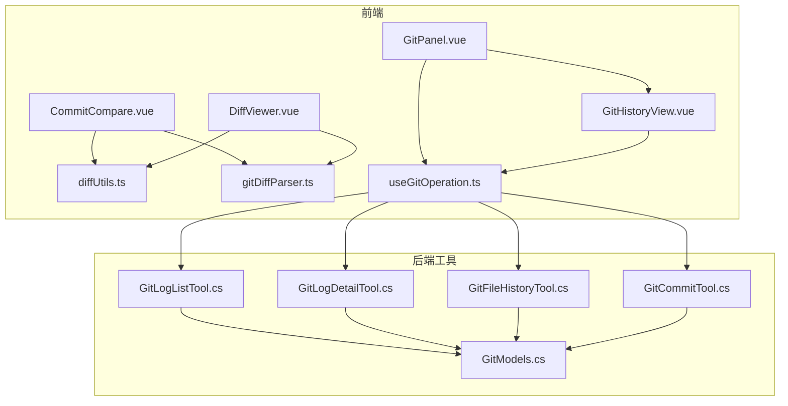
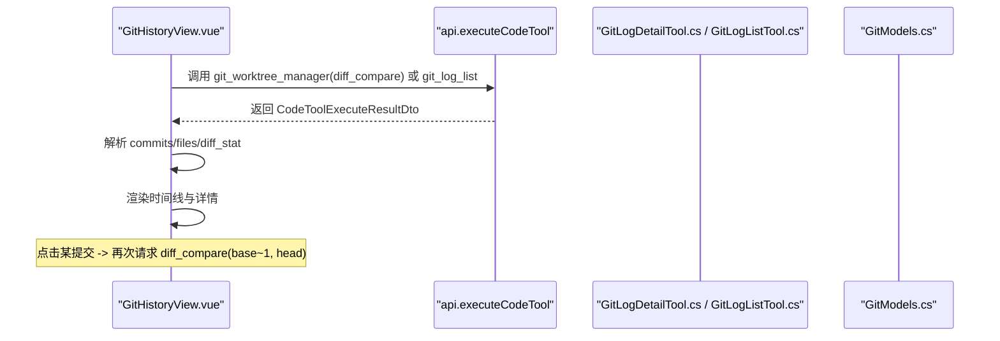
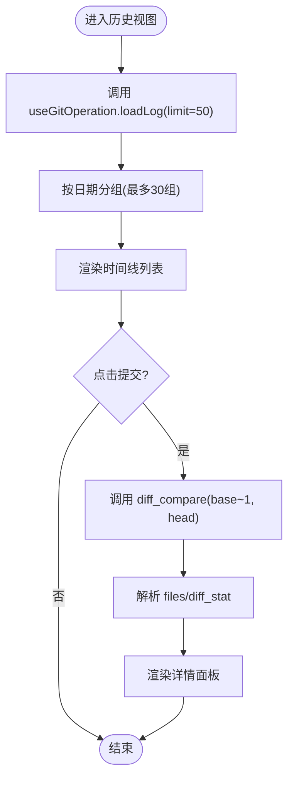
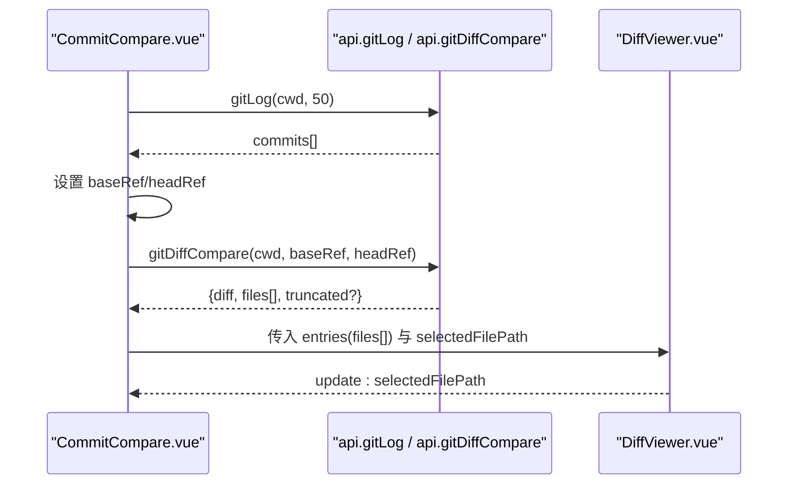
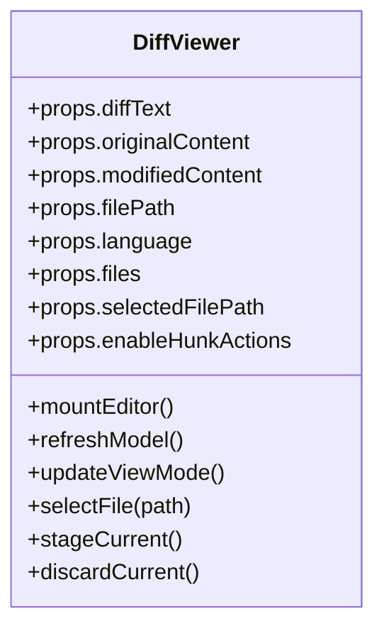
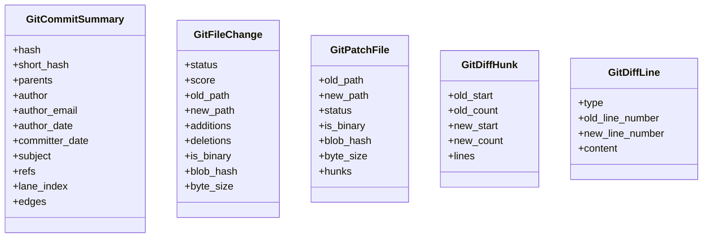
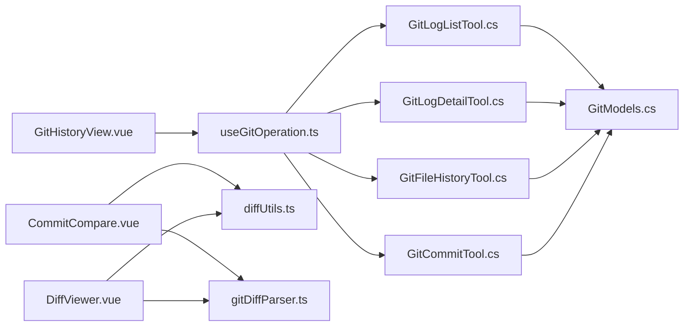

# 提交历史查看

<cite>
**本文引用的文件**   
- [GitHistoryView.vue](file://apps/desktop/src/components/git/GitHistoryView.vue)
- [CommitCompare.vue](file://apps/desktop/src/components/git/CommitCompare.vue)
- [DiffViewer.vue](file://apps/desktop/src/components/git/DiffViewer.vue)
- [diffUtils.ts](file://apps/desktop/src/components/git/diffUtils.ts)
- [gitDiffParser.ts](file://apps/desktop/src/gitDiffParser.ts)
- [useGitOperation.ts](file://apps/desktop/src/composables/useGitOperation.ts)
- [GitPanel.vue](file://apps/desktop/src/components/GitPanel.vue)
- [GitLogListTool.cs](file://TinadecTools/Tools/Git/GitLogListTool.cs)
- [GitLogDetailTool.cs](file://TinadecTools/Tools/Git/GitLogDetailTool.cs)
- [GitFileHistoryTool.cs](file://TinadecTools/Tools/Git/GitFileHistoryTool.cs)
- [GitModels.cs](file://TinadecTools/Tools/Git/GitModels.cs)
- [GitCommitTool.cs](file://TinadecTools/Tools/Git/GitCommitTool.cs)
</cite>

## 目录
1. [简介](#简介)
2. [项目结构](#项目结构)
3. [核心组件](#核心组件)
4. [架构总览](#架构总览)
5. [详细组件分析](#详细组件分析)
6. [依赖关系分析](#依赖关系分析)
7. [性能考量](#性能考量)
8. [故障排查指南](#故障排查指南)
9. [结论](#结论)
10. [附录](#附录)

## 简介
本文件面向“提交历史查看”功能，系统性梳理前端视图与后端工具之间的交互、数据模型与处理流程。重点覆盖：
- 提交列表展示（按日期分组、时间线布局）
- 提交详情查看（元信息、文件变更统计、二进制文件摘要）
- 提交比较（双引用 diff、多文件切换、差异预览）
- 提交消息编辑（类型化模板、长度限制、预览）
- 签名验证（由后端工具层校验与错误码返回）
- 分页加载（游标 with after_commit）、搜索过滤（前端组合过滤）
- 合并冲突标识（状态映射与颜色分类）

## 项目结构
该功能横跨桌面端 Vue 组件与 C# Git 工具集：
- 前端：GitHistoryView、CommitCompare、DiffViewer、diffUtils、gitDiffParser、useGitOperation、GitPanel
- 后端：GitLogListTool、GitLogDetailTool、GitFileHistoryTool、GitCommitTool、GitModels

图表来源
- [GitPanel.vue](file://apps/desktop/src/components/GitPanel.vue)
- [GitHistoryView.vue](file://apps/desktop/src/components/git/GitHistoryView.vue)
- [CommitCompare.vue](file://apps/desktop/src/components/git/CommitCompare.vue)
- [DiffViewer.vue](file://apps/desktop/src/components/git/DiffViewer.vue)
- [diffUtils.ts](file://apps/desktop/src/components/git/diffUtils.ts)
- [gitDiffParser.ts](file://apps/desktop/src/gitDiffParser.ts)
- [useGitOperation.ts](file://apps/desktop/src/composables/useGitOperation.ts)
- [GitLogListTool.cs](file://TinadecTools/Tools/Git/GitLogListTool.cs)
- [GitLogDetailTool.cs](file://TinadecTools/Tools/Git/GitLogDetailTool.cs)
- [GitFileHistoryTool.cs](file://TinadecTools/Tools/Git/GitFileHistoryTool.cs)
- [GitCommitTool.cs](file://TinadecTools/Tools/Git/GitCommitTool.cs)
- [GitModels.cs](file://TinadecTools/Tools/Git/GitModels.cs)

章节来源
- [GitPanel.vue](file://apps/desktop/src/components/GitPanel.vue)
- [GitHistoryView.vue](file://apps/desktop/src/components/git/GitHistoryView.vue)
- [CommitCompare.vue](file://apps/desktop/src/components/git/CommitCompare.vue)
- [DiffViewer.vue](file://apps/desktop/src/components/git/DiffViewer.vue)
- [diffUtils.ts](file://apps/desktop/src/components/git/diffUtils.ts)
- [gitDiffParser.ts](file://apps/desktop/src/gitDiffParser.ts)
- [useGitOperation.ts](file://apps/desktop/src/composables/useGitOperation.ts)
- [GitLogListTool.cs](file://TinadecTools/Tools/Git/GitLogListTool.cs)
- [GitLogDetailTool.cs](file://TinadecTools/Tools/Git/GitLogDetailTool.cs)
- [GitFileHistoryTool.cs](file://TinadecTools/Tools/Git/GitFileHistoryTool.cs)
- [GitCommitTool.cs](file://TinadecTools/Tools/Git/GitCommitTool.cs)
- [GitModels.cs](file://TinadecTools/Tools/Git/GitModels.cs)

## 核心组件
- GitHistoryView.vue：提交历史列表与详情面板，支持按日期分组、点击查看详情、调用 diff_compare 获取变更统计与文件列表。
- CommitCompare.vue：提交比较视图，支持选择 base_ref/head_ref，拉取日志并执行 diff_compare，渲染文件列表与差异。
- DiffViewer.vue：差异查看器，支持单文件与多文件模式、侧边栏/内联模式切换、二进制文件提示、截断提示。
- diffUtils.ts：统一 diff 文本到 DiffFileEntry 的转换、语言检测、统计汇总。
- gitDiffParser.ts：解析 unified diff，构建 hunks 与行级变更。
- useGitOperation.ts：Git 操作编排（状态、分支、日志、审批流），提供 loadLog、loadBranches、refreshAll 等。
- GitPanel.vue：Git 面板入口，聚合 Changes/History/Branches 三个标签页，驱动数据加载与事件分发。

章节来源
- [GitHistoryView.vue](file://apps/desktop/src/components/git/GitHistoryView.vue)
- [CommitCompare.vue](file://apps/desktop/src/components/git/CommitCompare.vue)
- [DiffViewer.vue](file://apps/desktop/src/components/git/DiffViewer.vue)
- [diffUtils.ts](file://apps/desktop/src/components/git/diffUtils.ts)
- [gitDiffParser.ts](file://apps/desktop/src/gitDiffParser.ts)
- [useGitOperation.ts](file://apps/desktop/src/composables/useGitOperation.ts)
- [GitPanel.vue](file://apps/desktop/src/components/GitPanel.vue)

## 架构总览
提交历史查看的前后端交互流程如下：

图表来源
- [GitHistoryView.vue](file://apps/desktop/src/components/git/GitHistoryView.vue)
- [GitLogDetailTool.cs](file://TinadecTools/Tools/Git/GitLogDetailTool.cs)
- [GitLogListTool.cs](file://TinadecTools/Tools/Git/GitLogListTool.cs)
- [GitModels.cs](file://TinadecTools/Tools/Git/GitModels.cs)

章节来源
- [GitHistoryView.vue](file://apps/desktop/src/components/git/GitHistoryView.vue)
- [GitLogDetailTool.cs](file://TinadecTools/Tools/Git/GitLogDetailTool.cs)
- [GitLogListTool.cs](file://TinadecTools/Tools/Git/GitLogListTool.cs)
- [GitModels.cs](file://TinadecTools/Tools/Git/GitModels.cs)

## 详细组件分析

### 提交历史视图（GitHistoryView.vue）
- 提交列表展示
  - 按日期分组（YYYY-MM-DD），最多显示前 30 组；每组内按钮式条目，显示主题、短哈希、作者、时间。
  - 使用 UiScrollArea 滚动区域承载长列表。
- 提交详情查看
  - 点击条目后调用 api.executeCodeTool('git_worktree_manager', { action: 'diff_compare', base_ref: `${short_hash}~1`, head_ref: short_hash })。
  - 解析返回结果中的 files（路径、变更类型、+/- 行数）、diff_stat 等，展示在右侧详情面板。
- 时间线布局
  - 左侧时间线样式通过 CSS 伪元素绘制竖线，节点圆点随选中态高亮。
- 分页加载
  - 列表数据由 useGitOperation.loadLog 提供，支持 limit/skip/after_commit 游标；当前视图默认加载 50 条，刷新可重新拉取。
- 搜索与过滤
  - 当前实现未内置搜索框；可在上层容器扩展过滤逻辑（基于 subject/author/date）。
- 标签功能
  - 未直接实现标签筛选；可通过上游数据注入 refs 字段进行过滤。

图表来源
- [GitHistoryView.vue](file://apps/desktop/src/components/git/GitHistoryView.vue)
- [useGitOperation.ts](file://apps/desktop/src/composables/useGitOperation.ts)

章节来源
- [GitHistoryView.vue](file://apps/desktop/src/components/git/GitHistoryView.vue)
- [useGitOperation.ts](file://apps/desktop/src/composables/useGitOperation.ts)

### 提交比较（CommitCompare.vue）
- 引用选择
  - 支持输入 base_ref/head_ref，并提供下拉菜单从最近提交中选择。
- 日志加载
  - 初始化时调用 api.gitLog(cwd, 50) 填充可选提交列表。
- 差异对比
  - 点击比较按钮调用 api.gitDiffCompare(cwd, baseRef, headRef)，返回 diff 文本与文件摘要。
- 差异预览
  - 使用 DiffViewer 渲染多文件差异，支持侧边栏/内联模式切换、二进制文件提示、截断提示。
- 文件变更统计
  - 顶部统计区显示 +additions -deletions，多文件模式下汇总总数。

图表来源
- [CommitCompare.vue](file://apps/desktop/src/components/git/CommitCompare.vue)
- [DiffViewer.vue](file://apps/desktop/src/components/git/DiffViewer.vue)

章节来源
- [CommitCompare.vue](file://apps/desktop/src/components/git/CommitCompare.vue)
- [DiffViewer.vue](file://apps/desktop/src/components/git/DiffViewer.vue)

### 差异查看器（DiffViewer.vue）
- 单文件与多文件模式
  - 单文件：传入 diffText/originalContent/modifiedContent/filePath/language。
  - 多文件：传入 files[] 与 selectedFilePath，支持切换。
- 差异解析与重建
  - 优先使用 original/modified 内容；否则从 diffText 解析 hunks 重建近似原文/修改文。
- 语言检测
  - 根据文件扩展名自动识别语言，便于语法高亮。
- 统计与提示
  - 显示当前文件 +/- 统计，多文件模式汇总总数；二进制文件与截断提示。
- 操作能力
  - 可选 enableHunkActions，暴露 stage-hunk/discard-hunk 事件供上层处理暂存/丢弃。

图表来源
- [DiffViewer.vue](file://apps/desktop/src/components/git/DiffViewer.vue)
- [diffUtils.ts](file://apps/desktop/src/components/git/diffUtils.ts)
- [gitDiffParser.ts](file://apps/desktop/src/gitDiffParser.ts)

章节来源
- [DiffViewer.vue](file://apps/desktop/src/components/git/DiffViewer.vue)
- [diffUtils.ts](file://apps/desktop/src/components/git/diffUtils.ts)
- [gitDiffParser.ts](file://apps/desktop/src/gitDiffParser.ts)

### 提交消息编辑器（CommitMessageEditor.vue）
- 类型化模板
  - 支持 feat/fix/docs/style/refactor/perf/test/build/ci/chore/revert 等类型，可选择 scope。
- 长度限制与提示
  - 主题行限制 50/72，超过阈值给出视觉提示。
- 预览与复用
  - 实时拼装完整提交消息，支持从最近提交中复用并解析回填。
- 签名验证
  - 编辑器本身不执行签名；签名校验由后端工具层控制（见 GitCommitTool）。

章节来源
- [CommitMessageEditor.vue](file://apps/desktop/src/components/git/CommitMessageEditor.vue)

### 后端工具与数据模型
- GitLogListTool.cs
  - 支持 revs、skip、after_commit、limit；返回 commits、truncated、next_cursor。
  - 使用 LaneAssigner.Assign 为提交分配 lane_index 与 edges，便于图可视化。
- GitLogDetailTool.cs
  - 支持单提交或范围（A..B），返回 commits、files、patches（可选）、truncated/truncation_reason、next_cursor。
  - 对二进制文件补充 blob_hash/byte_size。
- GitFileHistoryTool.cs
  - 单文件历史，支持 --follow，按需拉取 patch，受 max_patch_bytes 限制。
- GitCommitTool.cs
  - 提交命令封装，支持 include_all/commit_staged_only/paths 三种模式；无暂存变更时报错 no_staged_changes。
- GitModels.cs
  - 定义 GitCommitSummary、GitFileChange、GitPatchFile、GitDiffHunk、GitDiffLine 等数据结构。

图表来源
- [GitModels.cs](file://TinadecTools/Tools/Git/GitModels.cs)

章节来源
- [GitLogListTool.cs](file://TinadecTools/Tools/Git/GitLogListTool.cs)
- [GitLogDetailTool.cs](file://TinadecTools/Tools/Git/GitLogDetailTool.cs)
- [GitFileHistoryTool.cs](file://TinadecTools/Tools/Git/GitFileHistoryTool.cs)
- [GitCommitTool.cs](file://TinadecTools/Tools/Git/GitCommitTool.cs)
- [GitModels.cs](file://TinadecTools/Tools/Git/GitModels.cs)

## 依赖关系分析
- 前端依赖
  - GitHistoryView.vue 依赖 useGitOperation.ts 提供的 logCommits、loadLog 等。
  - CommitCompare.vue 依赖 diffUtils.ts 与 gitDiffParser.ts 构建 DiffFileEntry 与解析 diff。
  - DiffViewer.vue 依赖 useMonacoDiff 与 diffUtils.ts。
- 后端依赖
  - GitLogListTool/GitLogDetailTool/GitFileHistoryTool/GitCommitTool 均依赖 GitCli 与 DiffParser/LaneAssigner。
  - 所有工具共享 GitModels.cs 的数据结构。

图表来源
- [GitHistoryView.vue](file://apps/desktop/src/components/git/GitHistoryView.vue)
- [CommitCompare.vue](file://apps/desktop/src/components/git/CommitCompare.vue)
- [DiffViewer.vue](file://apps/desktop/src/components/git/DiffViewer.vue)
- [diffUtils.ts](file://apps/desktop/src/components/git/diffUtils.ts)
- [gitDiffParser.ts](file://apps/desktop/src/gitDiffParser.ts)
- [useGitOperation.ts](file://apps/desktop/src/composables/useGitOperation.ts)
- [GitLogListTool.cs](file://TinadecTools/Tools/Git/GitLogListTool.cs)
- [GitLogDetailTool.cs](file://TinadecTools/Tools/Git/GitLogDetailTool.cs)
- [GitFileHistoryTool.cs](file://TinadecTools/Tools/Git/GitFileHistoryTool.cs)
- [GitCommitTool.cs](file://TinadecTools/Tools/Git/GitCommitTool.cs)
- [GitModels.cs](file://TinadecTools/Tools/Git/GitModels.cs)

章节来源
- [GitHistoryView.vue](file://apps/desktop/src/components/git/GitHistoryView.vue)
- [CommitCompare.vue](file://apps/desktop/src/components/git/CommitCompare.vue)
- [DiffViewer.vue](file://apps/desktop/src/components/git/DiffViewer.vue)
- [diffUtils.ts](file://apps/desktop/src/components/git/diffUtils.ts)
- [gitDiffParser.ts](file://apps/desktop/src/gitDiffParser.ts)
- [useGitOperation.ts](file://apps/desktop/src/composables/useGitOperation.ts)
- [GitLogListTool.cs](file://TinadecTools/Tools/Git/GitLogListTool.cs)
- [GitLogDetailTool.cs](file://TinadecTools/Tools/Git/GitLogDetailTool.cs)
- [GitFileHistoryTool.cs](file://TinadecTools/Tools/Git/GitFileHistoryTool.cs)
- [GitCommitTool.cs](file://TinadecTools/Tools/Git/GitCommitTool.cs)
- [GitModels.cs](file://TinadecTools/Tools/Git/GitModels.cs)

## 性能考量
- 列表分页与游标
  - 使用 after_commit 游标继续遍历父提交，避免全量加载；limit 控制单次返回数量。
- 差异体积控制
  - GitLogDetailTool/GitFileHistoryTool 支持 max_files 与 max_patch_bytes，防止大仓库导致响应过大。
- 二进制文件处理
  - 仅返回 blob_hash/byte_size 摘要，不传输二进制内容，降低带宽与渲染开销。
- Monaco 差异编辑器
  - 按需重建 original/modified 文本，避免全量 diff 文本重复解析；支持侧边栏/内联模式切换优化可读性。
- 前端渲染优化
  - 列表按日期分组且限制组数（≤30），减少 DOM 节点数量；滚动区域使用 UiScrollArea。

[本节为通用指导，无需特定文件来源]

## 故障排查指南
- 非 Git 仓库
  - 后端返回 NotARepoCode；检查 repository_path 是否正确指向仓库根。
- 缺少暂存变更
  - 提交时报错 no_staged_changes；确认已执行 add 或选择 paths/include_all。
- 参数校验失败
  - rev/after_commit 必须为有效修订；revs 不得包含以“-”开头的选项（防注入）。
- 差异截断
  - 当 files.Count > max_files 或补丁大小超过 max_patch_bytes 时触发 truncation；需调整上限或分批加载。
- 网络/工具调用异常
  - 前端捕获异常并通过 useNotifications 提示；检查 api.executeCodeTool 返回值与 summary。

章节来源
- [GitLogListTool.cs](file://TinadecTools/Tools/Git/GitLogListTool.cs)
- [GitLogDetailTool.cs](file://TinadecTools/Tools/Git/GitLogDetailTool.cs)
- [GitFileHistoryTool.cs](file://TinadecTools/Tools/Git/GitFileHistoryTool.cs)
- [GitCommitTool.cs](file://TinadecTools/Tools/Git/GitCommitTool.cs)
- [useGitOperation.ts](file://apps/desktop/src/composables/useGitOperation.ts)

## 结论
提交历史查看功能通过清晰的前后端分层与数据模型，实现了高效的提交浏览、详情查看与差异对比。借助游标分页、差异体积控制与二进制摘要，兼顾了性能与用户体验。后续可扩展搜索过滤、标签筛选与更丰富的提交签名验证展示。

[本节为总结，无需特定文件来源]

## 附录
- 提交消息模板规范
  - 类型(scope): 主题；支持 body/footer 分段；BREAKING CHANGE 在 footer。
- 差异文件格式
  - unified diff；hunks 行级变更类型 context/add/delete。
- 状态与颜色映射
  - statusToLabel/statusColor 将 M/A/D/R/C/U/?/! 映射为人类可读标签与颜色类别。

章节来源
- [CommitMessageEditor.vue](file://apps/desktop/src/components/git/CommitMessageEditor.vue)
- [gitDiffParser.ts](file://apps/desktop/src/gitDiffParser.ts)
- [useGitOperation.ts](file://apps/desktop/src/composables/useGitOperation.ts)