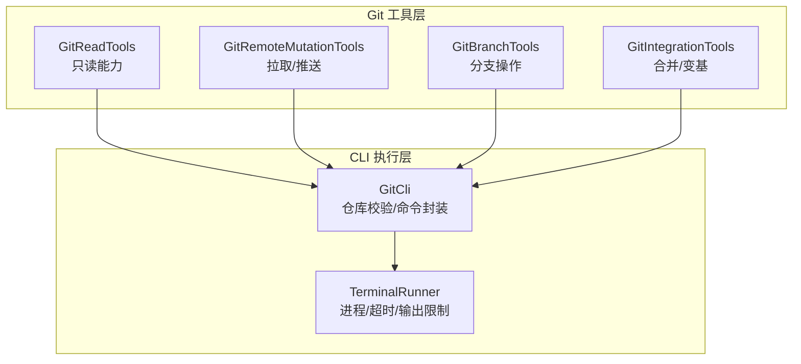
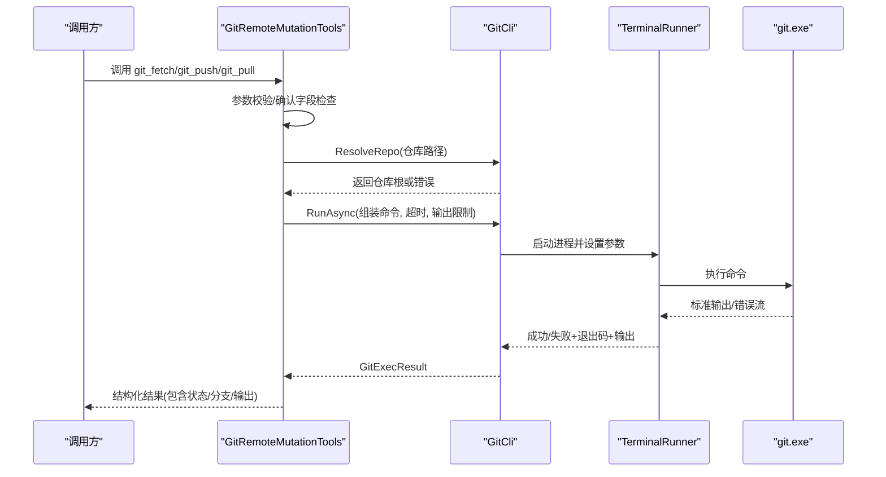
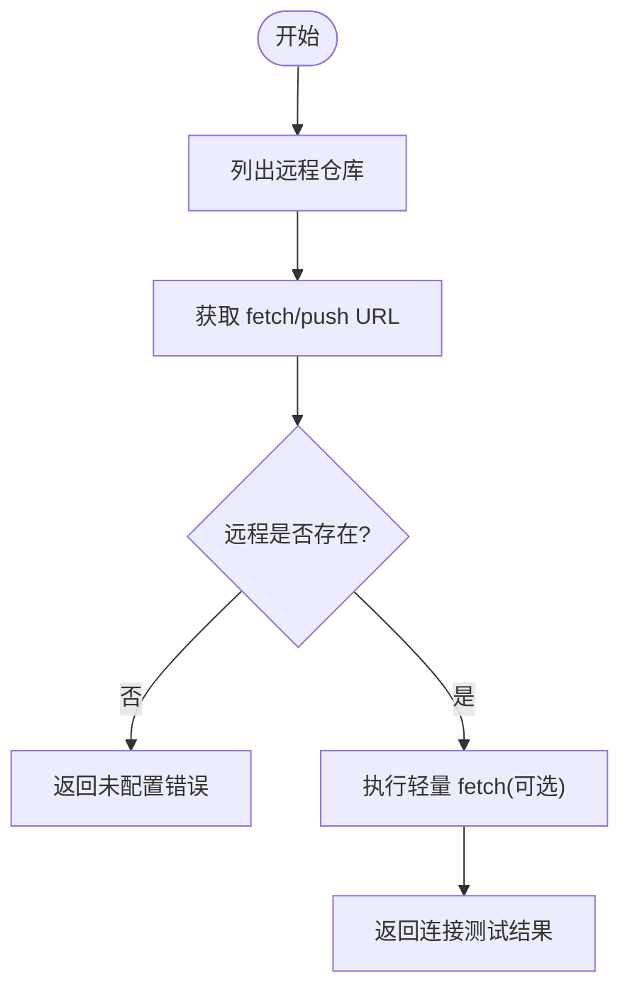
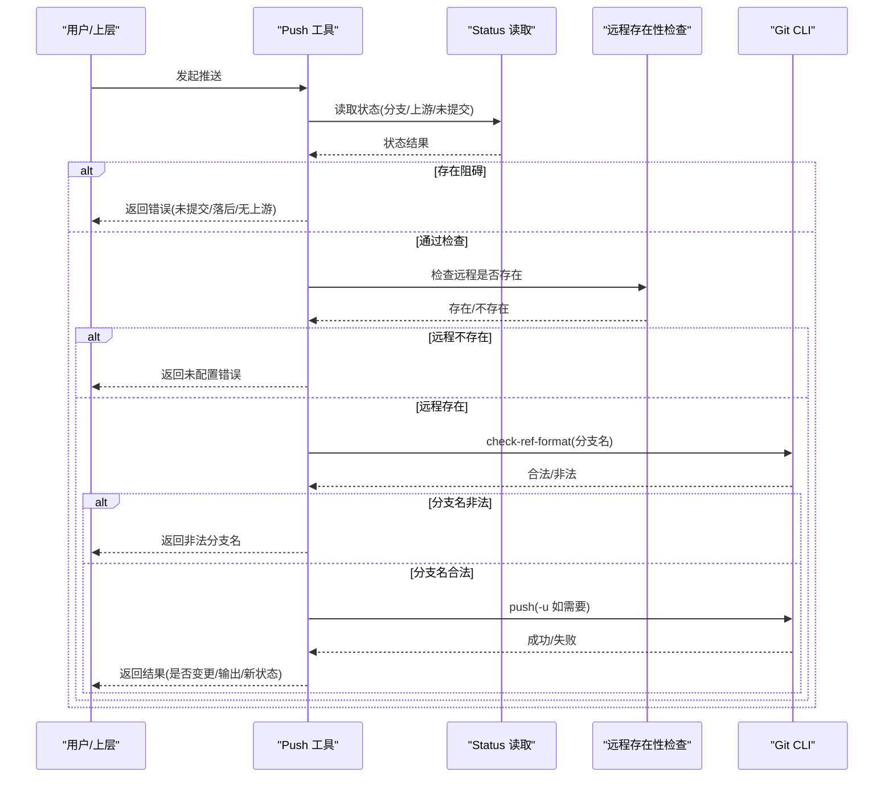
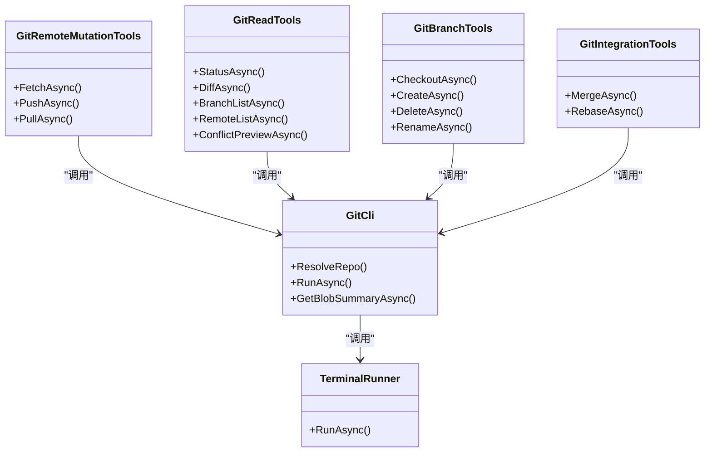

# 远程仓库管理

<cite>
**本文引用的文件**   
- [GitRemoteMutationTools.cs](file://TinadecTools/Tools/Git/GitRemoteMutationTools.cs)
- [GitReadTools.cs](file://TinadecTools/Tools/Git/GitReadTools.cs)
- [GitBranchTools.cs](file://TinadecTools/Tools/Git/GitBranchTools.cs)
- [GitCli.cs](file://TinadecTools/Tools/Git/GitCli.cs)
- [TerminalRunner.cs](file://TinadecTools/Runtime/TerminalRunner.cs)
- [GitIntegrationTools.cs](file://TinadecTools/Tools/Git/GitIntegrationTools.cs)
- [GitModels.cs](file://TinadecTools/Tools/Git/GitModels.cs)
- [GitRemoteMutationToolsTests.cs](file://tests/TinadecTools.Tests/GitRemoteMutationToolsTests.cs)
- [GitBranchToolsTests.cs](file://tests/TinadecTools.Tests/GitBranchToolsTests.cs)
</cite>

## 目录
1. [简介](#简介)
2. [项目结构](#项目结构)
3. [核心组件](#核心组件)
4. [架构总览](#架构总览)
5. [详细组件分析](#详细组件分析)
6. [依赖关系分析](#依赖关系分析)
7. [性能与可靠性](#性能与可靠性)
8. [故障排查指南](#故障排查指南)
9. [结论](#结论)
10. [附录：认证、代理与多账户说明](#附录认证代理与多账户说明)

## 简介
本文件面向 Git 远程仓库管理能力，围绕连接管理（URL、认证、连接测试）、推送与拉取（分支同步、标签管理、强制推送策略）、上游跟踪与推送规则、网络错误处理与重试、以及 SSH 密钥与代理配置等主题进行系统化说明。文档基于代码库中的 Git CLI 封装与工具层实现，提供从调用流程到错误处理的完整视图，帮助开发者与使用者安全、稳定地集成远程仓库操作。

## 项目结构
与远程仓库相关的功能集中在 TinadecTools 的 Git 工具模块中，通过统一的 CLI 执行器与只读/变更两类工具集组织能力：
- Git CLI 执行器：负责进程启动、参数安全、输出限制、超时控制与错误归一化
- 只读工具：状态、差异、分支列表、远程列表、引用列表、冲突预览等
- 变更工具：拉取、推送、合并/变基、工作区与分支操作
- 模型与 DTO：统一序列化上下文与结果结构

图表来源
- [GitReadTools.cs:271-386](file://TinadecTools/Tools/Git/GitReadTools.cs#L271-L386)
- [GitRemoteMutationTools.cs:40-118](file://TinadecTools/Tools/Git/GitRemoteMutationTools.cs#L40-L118)
- [GitBranchTools.cs:37-104](file://TinadecTools/Tools/Git/GitBranchTools.cs#L37-L104)
- [GitIntegrationTools.cs:37-82](file://TinadecTools/Tools/Git/GitIntegrationTools.cs#L37-L82)
- [GitCli.cs:13-143](file://TinadecTools/Tools/Git/GitCli.cs#L13-L143)
- [TerminalRunner.cs:16-149](file://TinadecTools/Runtime/TerminalRunner.cs#L16-L149)

章节来源
- [GitReadTools.cs:271-386](file://TinadecTools/Tools/Git/GitReadTools.cs#L271-L386)
- [GitRemoteMutationTools.cs:40-118](file://TinadecTools/Tools/Git/GitRemoteMutationTools.cs#L40-L118)
- [GitBranchTools.cs:37-104](file://TinadecTools/Tools/Git/GitBranchTools.cs#L37-L104)
- [GitIntegrationTools.cs:37-82](file://TinadecTools/Tools/Git/GitIntegrationTools.cs#L37-L82)
- [GitCli.cs:13-143](file://TinadecTools/Tools/Git/GitCli.cs#L13-L143)
- [TerminalRunner.cs:16-149](file://TinadecTools/Runtime/TerminalRunner.cs#L16-L149)

## 核心组件
- GitCli：仓库路径解析与工作树校验；命令执行封装；输出截断与错误码归一化
- GitReadTools：git status/diff/branch/ref/remote/blame/file-at-revision/conflict-preview 等只读能力
- GitRemoteMutationTools：git_fetch/git_push/git_pull 三大远程变更能力，含上游检查与前置条件校验
- GitBranchTools：checkout/create/delete/rename 分支操作，含名称合法性校验与安全保护
- GitIntegrationTools：merge/rebase 集成操作，支持策略与阶段控制
- TerminalRunner：底层进程运行器，负责超时、取消、输出限制与进程清理

章节来源
- [GitCli.cs:13-143](file://TinadecTools/Tools/Git/GitCli.cs#L13-L143)
- [GitReadTools.cs:271-386](file://TinadecTools/Tools/Git/GitReadTools.cs#L271-L386)
- [GitRemoteMutationTools.cs:40-118](file://TinadecTools/Tools/Git/GitRemoteMutationTools.cs#L40-L118)
- [GitBranchTools.cs:37-104](file://TinadecTools/Tools/Git/GitBranchTools.cs#L37-L104)
- [GitIntegrationTools.cs:37-82](file://TinadecTools/Tools/Git/GitIntegrationTools.cs#L37-L82)
- [TerminalRunner.cs:16-149](file://TinadecTools/Runtime/TerminalRunner.cs#L16-L149)

## 架构总览
远程仓库管理的调用链路由“工具方法 → GitCli → TerminalRunner”构成，所有外部输入均通过 ArgumentList 传递，避免 Shell 注入；所有命令执行具备超时与输出上限保护；错误信息被标准化为可判定的结果对象。

图表来源
- [GitRemoteMutationTools.cs:40-118](file://TinadecTools/Tools/Git/GitRemoteMutationTools.cs#L40-L118)
- [GitCli.cs:88-122](file://TinadecTools/Tools/Git/GitCli.cs#L88-L122)
- [TerminalRunner.cs:18-110](file://TinadecTools/Runtime/TerminalRunner.cs#L18-L110)

## 详细组件分析

### 远程仓库连接管理与 URL 配置
- 远程列表查询：通过 remote 列表与 get-url/get-url --push 获取 fetch/push URL，便于诊断与展示
- 远程存在性检查：在变更操作前使用 get-url 验证远程是否已配置
- 连接测试建议：结合 remote_list 与一次轻量 fetch（带超时）作为连通性检测

图表来源
- [GitReadTools.cs:371-386](file://TinadecTools/Tools/Git/GitReadTools.cs#L371-L386)
- [GitRemoteMutationTools.cs:111-115](file://TinadecTools/Tools/Git/GitRemoteMutationTools.cs#L111-L115)

章节来源
- [GitReadTools.cs:371-386](file://TinadecTools/Tools/Git/GitReadTools.cs#L371-L386)
- [GitRemoteMutationTools.cs:111-115](file://TinadecTools/Tools/Git/GitRemoteMutationTools.cs#L111-L115)

### 认证设置与连接测试
- 认证方式：由 Git 自身决定（SSH key、HTTPS 凭据、系统凭据管理器），工具层不直接管理证书或密码
- 交互禁用：所有命令以 credential.interactive=never 运行，避免交互式提示导致阻塞
- 连接测试：先 remote_list，再尝试一次 fetch（短超时），根据退出码与输出判断连通性与权限

章节来源
- [GitRemoteMutationTools.cs:50-53](file://TinadecTools/Tools/Git/GitRemoteMutationTools.cs#L50-L53)
- [GitRemoteMutationTools.cs:79-81](file://TinadecTools/Tools/Git/GitRemoteMutationTools.cs#L79-L81)
- [GitRemoteMutationTools.cs:102-104](file://TinadecTools/Tools/Git/GitRemoteMutationTools.cs#L102-L104)

### 推送与拉取：分支同步、标签管理与强制推送
- 拉取（pull）
  - 前置条件：非 detached HEAD、无未提交更改、存在上游或显式指定 remote+branch
  - 策略：默认 --ff-only，确保线性历史
  - 结果：包含是否变更、状态快照、输出摘要
- 推送（push）
  - 前置条件：非 detached HEAD、无未提交更改、不在上游之后
  - 上游：若无上游且未设置 set_upstream，则拒绝推送
  - 分支名校验：check-ref-format 保证合法
  - 结果：若已最新则返回 no-op；否则推送并记录是否设置了上游
- 标签管理
  - 当前工具集未暴露专门的标签推送接口；可通过 git tag + git push --tags 的外部流程配合使用
- 强制推送
  - 当前工具未暴露 --force/--force-with-lease 参数；如需强制推送，应在上层编排时谨慎使用并增加审批

图表来源
- [GitRemoteMutationTools.cs:60-85](file://TinadecTools/Tools/Git/GitRemoteMutationTools.cs#L60-L85)
- [GitReadTools.cs:273-293](file://TinadecTools/Tools/Git/GitReadTools.cs#L273-L293)

章节来源
- [GitRemoteMutationTools.cs:60-85](file://TinadecTools/Tools/Git/GitRemoteMutationTools.cs#L60-L85)
- [GitRemoteMutationTools.cs:87-108](file://TinadecTools/Tools/Git/GitRemoteMutationTools.cs#L87-L108)
- [GitReadTools.cs:273-293](file://TinadecTools/Tools/Git/GitReadTools.cs#L273-L293)

### 远程分支跟踪、上游配置与推送规则
- 上游检测：status 解析 upstream/ahead/behind，用于判定是否需要设置上游或拉取更新
- 设置上游：首次推送时可自动设置上游（-u），后续推送无需重复
- 推送规则：
  - 禁止对 detached HEAD 推送
  - 禁止有未提交更改时推送
  - 禁止本地落后于上游时推送（需先 pull）
  - 分支名必须通过 check-ref-format

章节来源
- [GitReadTools.cs:498-508](file://TinadecTools/Tools/Git/GitReadTools.cs#L498-L508)
- [GitRemoteMutationTools.cs:66-78](file://TinadecTools/Tools/Git/GitRemoteMutationTools.cs#L66-L78)

### 网络错误处理、重试机制与进度反馈
- 错误分类：
  - Git 未找到：特定错误码
  - 非仓库：特定错误码
  - 输出截断：标记 Truncated 原因
  - 超时：进程被安全终止，返回 TimedOut
- 重试建议：
  - 针对网络抖动类错误（如连接中断、传输失败）可在上层实现指数退避重试
  - 对于权限/认证失败不应盲目重试，应提示用户修复凭据
- 进度反馈：
  - 工具层聚合 stdout/stderr 作为输出摘要
  - 如需细粒度进度，可在上层监听终端输出或使用 Git 的 progress 钩子（超出当前工具范围）

章节来源
- [GitCli.cs:15-17](file://TinadecTools/Tools/Git/GitCli.cs#L15-L17)
- [GitCli.cs:108-122](file://TinadecTools/Tools/Git/GitCli.cs#L108-L122)
- [TerminalRunner.cs:73-110](file://TinadecTools/Runtime/TerminalRunner.cs#L73-L110)

### SSH 密钥管理、代理配置与多账户支持
- SSH 密钥：由 Git/操作系统凭据管理器或 SSH agent 管理；工具层不直接读写私钥
- 代理配置：遵循 Git 环境变量与配置文件（http.proxy/https.proxy/ssh.command 等）
- 多账户：通过 SSH config 或不同仓库路径下的 .git/config 区分；工具层按仓库上下文执行命令，天然支持多仓库多账户

章节来源
- [GitCli.cs:88-122](file://TinadecTools/Tools/Git/GitCli.cs#L88-L122)
- [TerminalRunner.cs:18-42](file://TinadecTools/Runtime/TerminalRunner.cs#L18-L42)

### 分支同步与冲突处理
- 分支操作：创建/切换/删除/重命名，均进行名称合法性校验与当前分支保护
- 冲突预览：识别合并/变基过程中的冲突块，提供 base/ours/theirs 片段，辅助人工解决
- 集成操作：merge/rebase 支持 start/continue/abort/skip 阶段控制，并可指定策略（no_ff/ff_only/squash）

章节来源
- [GitBranchTools.cs:55-100](file://TinadecTools/Tools/Git/GitBranchTools.cs#L55-L100)
- [GitReadTools.cs:424-473](file://TinadecTools/Tools/Git/GitReadTools.cs#L424-L473)
- [GitIntegrationTools.cs:45-78](file://TinadecTools/Tools/Git/GitIntegrationTools.cs#L45-L78)

## 依赖关系分析
- 低耦合高内聚：每个工具聚焦单一职责，通过 GitCli 统一访问 Git CLI
- 依赖方向：工具 → GitCli → TerminalRunner → 操作系统进程
- 外部依赖：仅依赖 Git CLI 与系统进程管理能力

图表来源
- [GitRemoteMutationTools.cs:40-118](file://TinadecTools/Tools/Git/GitRemoteMutationTools.cs#L40-L118)
- [GitReadTools.cs:271-386](file://TinadecTools/Tools/Git/GitReadTools.cs#L271-L386)
- [GitBranchTools.cs:37-104](file://TinadecTools/Tools/Git/GitBranchTools.cs#L37-L104)
- [GitIntegrationTools.cs:37-82](file://TinadecTools/Tools/Git/GitIntegrationTools.cs#L37-L82)
- [GitCli.cs:13-143](file://TinadecTools/Tools/Git/GitCli.cs#L13-L143)
- [TerminalRunner.cs:16-149](file://TinadecTools/Runtime/TerminalRunner.cs#L16-L149)

## 性能与可靠性
- 输出限制：stdout/stderr 最大字符数限制，防止大输出导致内存膨胀
- 超时控制：默认 60 秒（可配置），避免长时间挂起
- 进程安全：超时后安全终止进程树，避免僵尸进程
- 批量操作：diff 支持 max_files/max_diff_bytes 限制，避免一次性处理过大变更集
- 建议：
  - 对大仓库优先使用增量操作（如限定 paths）
  - 在网络不稳定环境下启用重试与退避
  - 将耗时任务异步化，避免阻塞主线程

章节来源
- [GitCli.cs:88-122](file://TinadecTools/Tools/Git/GitCli.cs#L88-L122)
- [TerminalRunner.cs:18-110](file://TinadecTools/Runtime/TerminalRunner.cs#L18-L110)
- [GitReadTools.cs:295-319](file://TinadecTools/Tools/Git/GitReadTools.cs#L295-L319)

## 故障排查指南
- 常见错误与定位
  - Git 未找到：检查 PATH 与安装
  - 非仓库：确认 repository_path 指向有效工作树
  - 远程未配置：使用 remote_list 检查并补充
  - 未提交更改：先 commit/stash
  - 上游缺失：设置上游或显式指定 remote+branch
  - 分支名非法：符合 Git 命名规范
- 调试步骤
  - 查看输出摘要（Stdout/Stderr 拼接）
  - 检查状态（status）与分支列表（branch list）
  - 复现最小用例，逐步缩小问题范围
- 日志与监控
  - 记录每次调用的参数、耗时、退出码与输出摘要
  - 对频繁失败的远程地址进行告警

章节来源
- [GitCli.cs:15-17](file://TinadecTools/Tools/Git/GitCli.cs#L15-L17)
- [GitReadTools.cs:498-508](file://TinadecTools/Tools/Git/GitReadTools.cs#L498-L508)
- [GitRemoteMutationTools.cs:116-118](file://TinadecTools/Tools/Git/GitRemoteMutationTools.cs#L116-L118)

## 结论
该 Git 远程仓库管理方案以 Git CLI 为核心，通过严格的参数与路径校验、统一的进程执行器与输出限制，提供了安全可靠的拉取/推送/分支/集成能力。对于认证与代理，遵循 Git 原生机制；对于网络异常，建议在应用层实现重试与退避。整体设计清晰、可扩展，适合在复杂环境中稳定运行。

## 附录：认证、代理与多账户说明
- 认证
  - HTTPS：建议使用系统凭据管理器或 Git Credential Manager
  - SSH：使用 SSH agent 或 ~/.ssh/config 管理密钥与别名
- 代理
  - 全局/仓库级 http/https.proxy 配置
  - SSH 代理通过 ProxyCommand 或 ssh -o ProxyJump
- 多账户
  - 通过不同仓库的 .git/config 或 SSH config Host 段区分
  - 工具层按仓库上下文执行命令，天然支持多仓库多账户

[本节为概念性说明，不直接分析具体文件]