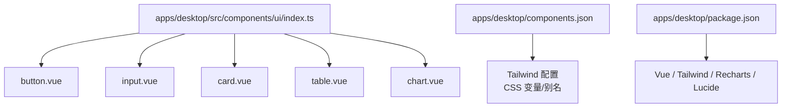
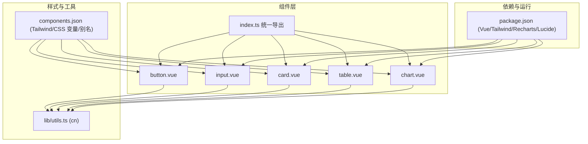
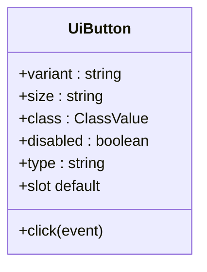
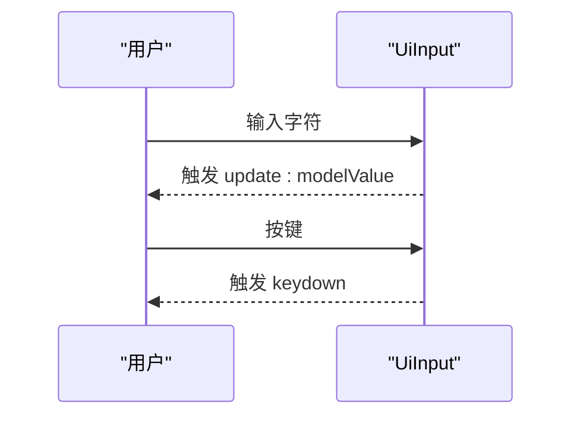
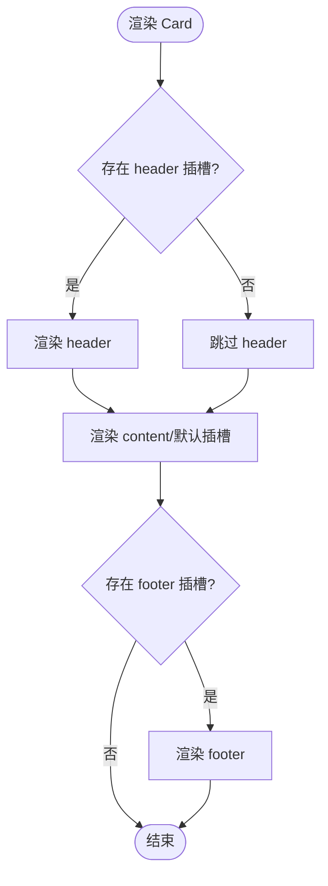
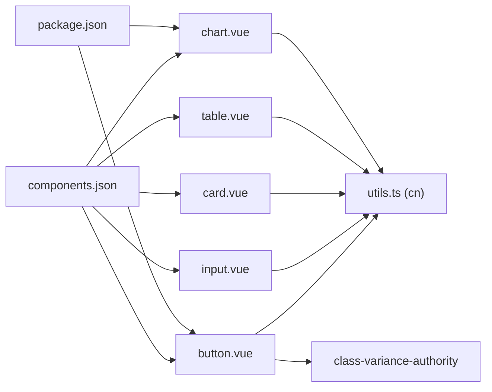

# UI 组件库

<cite>
**本文引用的文件**
- [apps/desktop/src/components/ui/index.ts](file://apps/desktop/src/components/ui/index.ts)
- [apps/desktop/components.json](file://apps/desktop/components.json)
- [apps/desktop/package.json](file://apps/desktop/package.json)
- [apps/desktop/src/components/ui/button.vue](file://apps/desktop/src/components/ui/button.vue)
- [apps/desktop/src/components/ui/input.vue](file://apps/desktop/src/components/ui/input.vue)
- [apps/desktop/src/components/ui/table.vue](file://apps/desktop/src/components/ui/table.vue)
- [apps/desktop/src/components/ui/chart.vue](file://apps/desktop/src/components/ui/chart.vue)
- [apps/desktop/src/components/ui/card.vue](file://apps/desktop/src/components/ui/card.vue)
- [apps/desktop/src/lib/utils.ts](file://apps/desktop/src/lib/utils.ts)
- [.agents/skills/shadcn-vue/SKILL.md](file://.agents/skills/shadcn-vue/SKILL.md)
- [.agents/skills/shadcn-vue/rules/composition.md](file://.agents/skills/shadcn-vue/rules/composition.md)
- [.agents/skills/shadcn-vue/rules/styling.md](file://.agents/skills/shadcn-vue/rules/styling.md)
- [.agents/skills/shadcn-vue/rules/icons.md](file://.agents/skills/shadcn-vue/rules/icons.md)
</cite>

## 目录
1. [简介](#简介)
2. [项目结构](#项目结构)
3. [核心组件](#核心组件)
4. [架构总览](#架构总览)
5. [详细组件分析](#详细组件分析)
6. [依赖关系分析](#依赖关系分析)
7. [性能考量](#性能考量)
8. [故障排查指南](#故障排查指南)
9. [结论](#结论)
10. [附录](#附录)

## 简介
本文件为基于 shadcn-vue 的 UI 组件库文档，聚焦桌面应用 apps/desktop 中的基础组件集合。内容覆盖按钮、输入框、卡片、表格、图表等常用 UI 元素，详细说明每个组件的 props、事件、插槽与样式定制选项；并提供组件组合模式、主题适配、无障碍访问支持、图标集成、响应式设计与测试/文档/版本管理的实践建议。

## 项目结构
- 组件入口统一导出：apps/desktop/src/components/ui/index.ts 集中导出所有 UI 组件，便于按需引用与统一管理。
- shadcn-vue 配置：apps/desktop/components.json 定义风格、Tailwind 配置路径、CSS 变量开关、图标库与别名映射（如 @/components/ui）。
- 依赖与脚本：apps/desktop/package.json 包含 Vue、Tailwind、Recharts、Lucide 等依赖以及构建/预览/测试脚本。

**图示来源**
- [apps/desktop/src/components/ui/index.ts:1-31](file://apps/desktop/src/components/ui/index.ts#L1-L31)
- [apps/desktop/components.json:1-24](file://apps/desktop/components.json#L1-L24)
- [apps/desktop/package.json:1-69](file://apps/desktop/package.json#L1-L69)

**章节来源**
- [apps/desktop/src/components/ui/index.ts:1-31](file://apps/desktop/src/components/ui/index.ts#L1-L31)
- [apps/desktop/components.json:1-24](file://apps/desktop/components.json#L1-L24)
- [apps/desktop/package.json:1-69](file://apps/desktop/package.json#L1-L69)

## 核心组件
本节对已实现的核心组件进行 API 与使用要点说明。

- UiButton（按钮）
  - Props
    - variant：默认/default、destructive、outline、secondary、ghost、link
    - size：default、xs、sm、lg、icon
    - class：布局类名
    - disabled：禁用
    - type：button | submit | reset
  - Events
    - click：原生点击事件透传
  - Slots
    - 默认插槽：按钮内容（可包含图标）
  - 样式与变体
    - 通过 class-variance-authority 管理变体与尺寸
    - 语义化颜色与焦点环、禁用态样式
  - 无障碍
    - 原生 button，具备键盘可达性与焦点管理
  - 参考实现路径
    - [apps/desktop/src/components/ui/button.vue:1-66](file://apps/desktop/src/components/ui/button.vue#L1-L66)

- UiInput（输入框）
  - Props
    - modelValue：双向绑定值
    - placeholder：占位文本
    - type：输入类型（默认 text）
    - disabled：禁用
    - class：布局类名
  - Events
    - update:modelValue：v-model 双向绑定
    - keydown：键盘事件透传
  - 样式
    - 边框、背景、焦点环、禁用态
  - 参考实现路径
    - [apps/desktop/src/components/ui/input.vue:1-45](file://apps/desktop/src/components/ui/input.vue#L1-L45)

- UiCard（卡片）
  - Props
    - class：布局类名
  - Slots
    - header：头部区域
    - content：主体内容（含默认插槽）
    - footer：底部区域
  - 样式
    - 圆角、边框、阴影、分区内边距
  - 参考实现路径
    - [apps/desktop/src/components/ui/card.vue:1-40](file://apps/desktop/src/components/ui/card.vue#L1-L40)

- UiTable（表格容器）
  - Props
    - class：布局类名
  - Slots
    - 默认插槽：包裹 table 及其子元素（thead/tbody/tr/th/td）
  - 样式
    - 外层滚动容器 + caption-bottom 标题位置
  - 参考实现路径
    - [apps/desktop/src/components/ui/table.vue:1-18](file://apps/desktop/src/components/ui/table.vue#L1-L18)

- UiChart（图表容器）
  - Props
    - class：布局类名
  - Slots
    - 默认插槽：图表实例（如 Recharts）
  - 样式
    - 圆角、边框、背景、阴影，适配主题色
  - 参考实现路径
    - [apps/desktop/src/components/ui/chart.vue:1-16](file://apps/desktop/src/components/ui/chart.vue#L1-L16)

- 工具函数 cn
  - 功能：合并与去重类名（clsx + tailwind-merge）
  - 用途：在组件中动态拼接 class
  - 参考实现路径
    - [apps/desktop/src/lib/utils.ts:1-9](file://apps/desktop/src/lib/utils.ts#L1-L9)

**章节来源**
- [apps/desktop/src/components/ui/button.vue:1-66](file://apps/desktop/src/components/ui/button.vue#L1-L66)
- [apps/desktop/src/components/ui/input.vue:1-45](file://apps/desktop/src/components/ui/input.vue#L1-L45)
- [apps/desktop/src/components/ui/card.vue:1-40](file://apps/desktop/src/components/ui/card.vue#L1-L40)
- [apps/desktop/src/components/ui/table.vue:1-18](file://apps/desktop/src/components/ui/table.vue#L1-L18)
- [apps/desktop/src/components/ui/chart.vue:1-16](file://apps/desktop/src/components/ui/chart.vue#L1-L16)
- [apps/desktop/src/lib/utils.ts:1-9](file://apps/desktop/src/lib/utils.ts#L1-L9)

## 架构总览
UI 组件层由 index.ts 统一导出，各组件基于 Vue 3 与 Tailwind 语义化样式构建，并通过 components.json 与 package.json 完成样式与依赖治理。

**图示来源**
- [apps/desktop/src/components/ui/index.ts:1-31](file://apps/desktop/src/components/ui/index.ts#L1-L31)
- [apps/desktop/src/components/ui/button.vue:1-66](file://apps/desktop/src/components/ui/button.vue#L1-L66)
- [apps/desktop/src/components/ui/input.vue:1-45](file://apps/desktop/src/components/ui/input.vue#L1-L45)
- [apps/desktop/src/components/ui/card.vue:1-40](file://apps/desktop/src/components/ui/card.vue#L1-L40)
- [apps/desktop/src/components/ui/table.vue:1-18](file://apps/desktop/src/components/ui/table.vue#L1-L18)
- [apps/desktop/src/components/ui/chart.vue:1-16](file://apps/desktop/src/components/ui/chart.vue#L1-L16)
- [apps/desktop/src/lib/utils.ts:1-9](file://apps/desktop/src/lib/utils.ts#L1-L9)
- [apps/desktop/components.json:1-24](file://apps/desktop/components.json#L1-L24)
- [apps/desktop/package.json:1-69](file://apps/desktop/package.json#L1-L69)

## 详细组件分析

### 按钮（UiButton）
- 设计要点
  - 使用 cva 管理变体与尺寸，确保一致的视觉语言
  - 通过 cn 合并外部 class，避免覆盖语义化样式
  - 支持 icon 插槽，遵循 data-icon 规范
- 交互与事件
  - 透传 click 事件，保持原生行为
- 无障碍
  - 原生 button，具备键盘可达性、焦点环与禁用态
- 示例用法（路径）
  - [apps/desktop/src/components/ui/button.vue:1-66](file://apps/desktop/src/components/ui/button.vue#L1-L66)

**图示来源**
- [apps/desktop/src/components/ui/button.vue:1-66](file://apps/desktop/src/components/ui/button.vue#L1-L66)

**章节来源**
- [apps/desktop/src/components/ui/button.vue:1-66](file://apps/desktop/src/components/ui/button.vue#L1-L66)

### 输入框（UiInput）
- 设计要点
  - v-model 双向绑定 update:modelValue
  - 支持 keydown 事件透传
  - 统一的边框、背景与焦点环样式
- 无障碍
  - 原生 input，支持 label 关联与 aria-* 属性
- 示例用法（路径）
  - [apps/desktop/src/components/ui/input.vue:1-45](file://apps/desktop/src/components/ui/input.vue#L1-L45)

**图示来源**
- [apps/desktop/src/components/ui/input.vue:1-45](file://apps/desktop/src/components/ui/input.vue#L1-L45)

**章节来源**
- [apps/desktop/src/components/ui/input.vue:1-45](file://apps/desktop/src/components/ui/input.vue#L1-L45)

### 卡片（UiCard）
- 设计要点
  - 明确 header/content/footer 三段式结构
  - 通过 slot 灵活注入内容
- 无障碍
  - 语义化分区，便于屏幕阅读器理解结构
- 示例用法（路径）
  - [apps/desktop/src/components/ui/card.vue:1-40](file://apps/desktop/src/components/ui/card.vue#L1-L40)

**图示来源**
- [apps/desktop/src/components/ui/card.vue:1-40](file://apps/desktop/src/components/ui/card.vue#L1-L40)

**章节来源**
- [apps/desktop/src/components/ui/card.vue:1-40](file://apps/desktop/src/components/ui/card.vue#L1-L40)

### 表格（UiTable）
- 设计要点
  - 外层提供滚动容器，内部承载 table
  - 通过 slot 透传 thead/tbody 等结构
- 无障碍
  - 建议使用 caption 或 aria-label 描述表格用途
- 示例用法（路径）
  - [apps/desktop/src/components/ui/table.vue:1-18](file://apps/desktop/src/components/ui/table.vue#L1-L18)

**章节来源**
- [apps/desktop/src/components/ui/table.vue:1-18](file://apps/desktop/src/components/ui/table.vue#L1-L18)

### 图表（UiChart）
- 设计要点
  - 作为图表容器，统一圆角、边框与阴影
  - 默认插槽用于挂载 Recharts 等图表实例
- 无障碍
  - 图表数据需配合 aria 或 title/desc 提升可读性
- 示例用法（路径）
  - [apps/desktop/src/components/ui/chart.vue:1-16](file://apps/desktop/src/components/ui/chart.vue#L1-L16)

**章节来源**
- [apps/desktop/src/components/ui/chart.vue:1-16](file://apps/desktop/src/components/ui/chart.vue#L1-L16)

### 组合模式与最佳实践
- 表单布局
  - 使用 FieldGroup + Field 组织表单，避免裸 div + space-y
  - 校验状态通过 data-invalid 与 aria-invalid 表达
- 覆盖层选择
  - Dialog（模态）、Sheet（侧栏）、Drawer（底部面板）、Popover（气泡）、Tooltip（提示）
- 卡片结构
  - 完整使用 CardHeader/CardContent/CardFooter，不要将所有内容塞入 Content
- 按钮加载态
  - 不使用 isPending/isLoading，采用 Spinner + data-icon + disabled 组合
- 分组项
  - SelectItem/DropdownMenuItem/CommandItem 必须放在对应 Group 内
- 头像
  - Avatar 必须包含 AvatarFallback
- 分隔与骨架屏
  - 使用 Separator 替代 hr/div 分割线；Skeleton 替代自定义骨架屏
- 参考规则（路径）
  - [rules/composition.md:1-198](file://.agents/skills/shadcn-vue/rules/composition.md#L1-L198)

**章节来源**
- [.agents/skills/shadcn-vue/rules/composition.md:1-198](file://.agents/skills/shadcn-vue/rules/composition.md#L1-L198)

### 样式与主题定制
- 语义化颜色优先
  - 使用 bg-primary/text-muted-foreground 等语义 token，避免硬编码颜色
- 内置变体优先
  - 先尝试 variant="outline"/"destructive" 等，再考虑自定义
- class 仅用于布局
  - 不通过 class 覆盖组件颜色与排版
- 间距与尺寸
  - 使用 gap-* 替代 space-x/y-*；相等宽高用 size-*
- 条件类名
  - 使用 cn() 合并类名，避免模板字符串三元表达式
- 暗色模式
  - 使用语义 token，无需手动 dark: 覆盖
- 遮罩 z-index
  - 禁止手动设置 z-index，交由组件处理
- 参考规则（路径）
  - [rules/styling.md:1-167](file://.agents/skills/shadcn-vue/rules/styling.md#L1-L167)

**章节来源**
- [.agents/skills/shadcn-vue/rules/styling.md:1-167](file://.agents/skills/shadcn-vue/rules/styling.md#L1-L167)

### 图标集成
- 使用项目配置的 iconLibrary（lucide/tabler 等）导入图标
- Button 内图标使用 data-icon="inline-start/end"，不添加尺寸类
- 以组件对象形式传递图标，而非字符串键
- 参考规则（路径）
  - [rules/icons.md:1-112](file://.agents/skills/shadcn-vue/rules/icons.md#L1-L112)

**章节来源**
- [.agents/skills/shadcn-vue/rules/icons.md:1-112](file://.agents/skills/shadcn-vue/rules/icons.md#L1-L112)

### 无障碍访问支持
- 表单控件
  - 使用 label 关联 id，校验时设置 aria-invalid
- 覆盖层
  - Dialog/Sheet/Drawer 必须包含 Title，必要时 sr-only 隐藏
- 表格
  - 使用 caption 或 aria-label 描述用途
- 按钮与输入
  - 原生元素自带可达性与焦点管理，保持 disabled 语义
- 参考规则（路径）
  - [rules/composition.md:114-126](file://.agents/skills/shadcn-vue/rules/composition.md#L114-L126)

**章节来源**
- [.agents/skills/shadcn-vue/rules/composition.md:114-126](file://.agents/skills/shadcn-vue/rules/composition.md#L114-L126)

### 响应式设计
- 使用 Tailwind 断点与 flex/grid 布局
- 图表与表格在移动端通过外层滚动容器自适应
- 按钮与输入在不同尺寸下保持一致比例与可读性

[本节为通用指导，不直接分析具体文件]

### 组件测试策略
- 单元测试
  - 使用 @vue/test-utils 与 Vitest 对组件 props/events/slots 进行测试
  - 验证 v-model 双向绑定、键盘事件透传、禁用态样式
- 快照测试
  - 对复杂插槽结构进行快照对比，防止意外变更
- 端到端测试
  - 结合 happy-dom/JSDOM 模拟浏览器环境
- 参考脚本（路径）
  - [apps/desktop/package.json:13-14](file://apps/desktop/package.json#L13-L14)

**章节来源**
- [apps/desktop/package.json:13-14](file://apps/desktop/package.json#L13-L14)

### 文档生成与版本管理
- 文档生成
  - 使用 shadcn-vue CLI 获取组件文档与示例链接
  - 命令：npx shadcn-vue@latest docs <component>
- 版本管理
  - 更新组件时使用 --dry-run 与 --diff 预览差异，保留本地修改
  - 切换预设时选择 overwrite/merge/skip，谨慎操作
- 参考（路径）
  - [SKILL.md:154-174](file://.agents/skills/shadcn-vue/SKILL.md#L154-L174)
  - [SKILL.md:180-190](file://.agents/skills/shadcn-vue/SKILL.md#L180-L190)

**章节来源**
- [.agents/skills/shadcn-vue/SKILL.md:154-174](file://.agents/skills/shadcn-vue/SKILL.md#L154-L174)
- [.agents/skills/shadcn-vue/SKILL.md:180-190](file://.agents/skills/shadcn-vue/SKILL.md#L180-L190)

## 依赖关系分析
- 组件依赖
  - 所有组件均依赖 cn 工具函数进行类名合并
  - 按钮组件额外依赖 class-variance-authority 管理变体
- 样式与主题
  - Tailwind 配置与 CSS 变量由 components.json 控制
- 运行时依赖
  - Vue 3、Recharts（图表）、Lucide（图标）等由 package.json 声明

**图示来源**
- [apps/desktop/src/components/ui/button.vue:1-66](file://apps/desktop/src/components/ui/button.vue#L1-L66)
- [apps/desktop/src/components/ui/input.vue:1-45](file://apps/desktop/src/components/ui/input.vue#L1-L45)
- [apps/desktop/src/components/ui/card.vue:1-40](file://apps/desktop/src/components/ui/card.vue#L1-L40)
- [apps/desktop/src/components/ui/table.vue:1-18](file://apps/desktop/src/components/ui/table.vue#L1-L18)
- [apps/desktop/src/components/ui/chart.vue:1-16](file://apps/desktop/src/components/ui/chart.vue#L1-L16)
- [apps/desktop/src/lib/utils.ts:1-9](file://apps/desktop/src/lib/utils.ts#L1-L9)
- [apps/desktop/components.json:1-24](file://apps/desktop/components.json#L1-L24)
- [apps/desktop/package.json:1-69](file://apps/desktop/package.json#L1-L69)

**章节来源**
- [apps/desktop/src/components/ui/button.vue:1-66](file://apps/desktop/src/components/ui/button.vue#L1-L66)
- [apps/desktop/src/components/ui/input.vue:1-45](file://apps/desktop/src/components/ui/input.vue#L1-L45)
- [apps/desktop/src/components/ui/card.vue:1-40](file://apps/desktop/src/components/ui/card.vue#L1-L40)
- [apps/desktop/src/components/ui/table.vue:1-18](file://apps/desktop/src/components/ui/table.vue#L1-L18)
- [apps/desktop/src/components/ui/chart.vue:1-16](file://apps/desktop/src/components/ui/chart.vue#L1-L16)
- [apps/desktop/src/lib/utils.ts:1-9](file://apps/desktop/src/lib/utils.ts#L1-L9)
- [apps/desktop/components.json:1-24](file://apps/desktop/components.json#L1-L24)
- [apps/desktop/package.json:1-69](file://apps/desktop/package.json#L1-L69)

## 性能考量
- 类名合并
  - 使用 cn() 减少重复与冲突类名，降低样式计算开销
- 组件粒度
  - 将大组件拆分为小组件，按需渲染，减少不必要的重绘
- 图表渲染
  - 大数据集使用虚拟滚动或分页；避免频繁全量重绘
- 事件处理
  - 避免在高频事件中执行昂贵逻辑，必要时防抖/节流

[本节为通用指导，不直接分析具体文件]

## 故障排查指南
- 样式未生效
  - 检查是否使用了语义化颜色与内置变体；确认 cn() 正确合并类名
  - 确认 Tailwind 配置与 CSS 变量路径正确（components.json）
- 图标显示异常
  - 确认 iconLibrary 与导入路径一致；不要在组件内图标上添加尺寸类
- 表单校验无效
  - 确保 Field 上设置 data-invalid，控件上设置 aria-invalid
- 覆盖层层级问题
  - 不要手动设置 z-index，交由组件内部管理
- 参考规则（路径）
  - [rules/styling.md:1-167](file://.agents/skills/shadcn-vue/rules/styling.md#L1-L167)
  - [rules/icons.md:1-112](file://.agents/skills/shadcn-vue/rules/icons.md#L1-L112)
  - [rules/composition.md:1-198](file://.agents/skills/shadcn-vue/rules/composition.md#L1-L198)

**章节来源**
- [.agents/skills/shadcn-vue/rules/styling.md:1-167](file://.agents/skills/shadcn-vue/rules/styling.md#L1-L167)
- [.agents/skills/shadcn-vue/rules/icons.md:1-112](file://.agents/skills/shadcn-vue/rules/icons.md#L1-L112)
- [.agents/skills/shadcn-vue/rules/composition.md:1-198](file://.agents/skills/shadcn-vue/rules/composition.md#L1-L198)

## 结论
本 UI 组件库以 shadcn-vue 为基础，通过统一的导出入口、语义化样式与清晰的组合模式，提供了可扩展、可维护且无障碍友好的基础组件集合。遵循样式与组合规则、合理使用主题与图标、完善测试与文档流程，可显著提升开发效率与产品质量。

[本节为总结性内容，不直接分析具体文件]

## 附录
- 快速参考
  - 组件选择：按钮/输入/表格/卡片/图表/菜单/通知/空态等
  - 命令：search/docs/add/view/info/apply/init
- 参考（路径）
  - [SKILL.md:120-152](file://.agents/skills/shadcn-vue/SKILL.md#L120-L152)
  - [SKILL.md:194-222](file://.agents/skills/shadcn-vue/SKILL.md#L194-L222)

**章节来源**
- [.agents/skills/shadcn-vue/SKILL.md:120-152](file://.agents/skills/shadcn-vue/SKILL.md#L120-L152)
- [.agents/skills/shadcn-vue/SKILL.md:194-222](file://.agents/skills/shadcn-vue/SKILL.md#L194-L222)