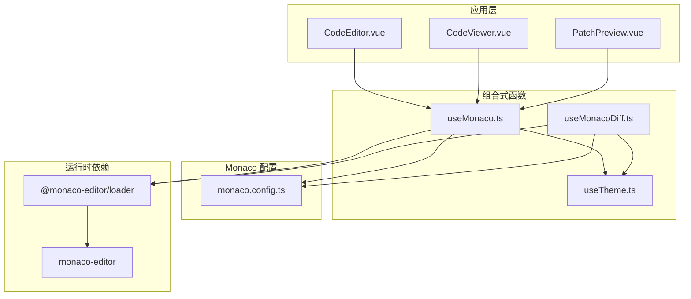
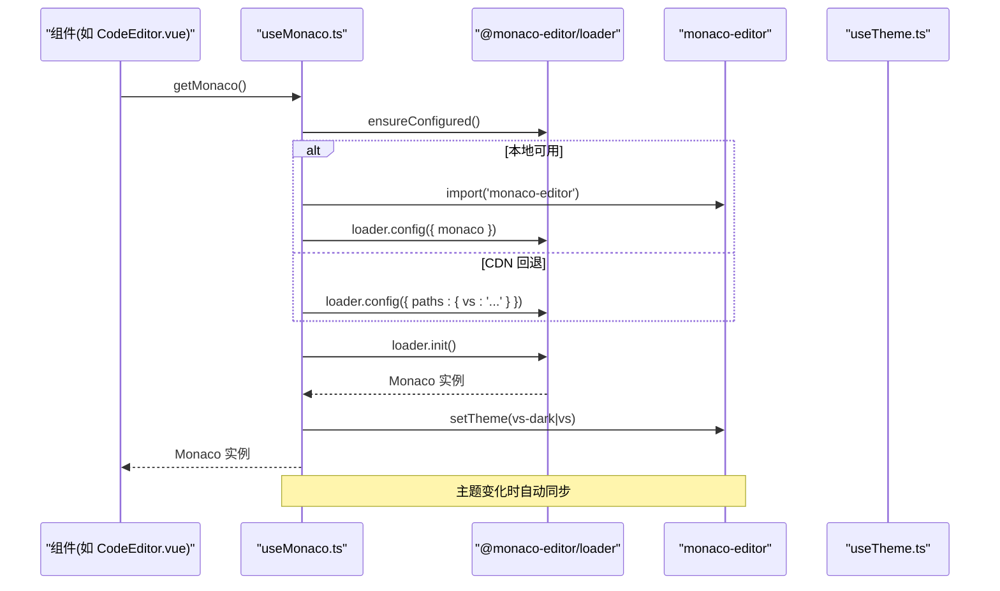
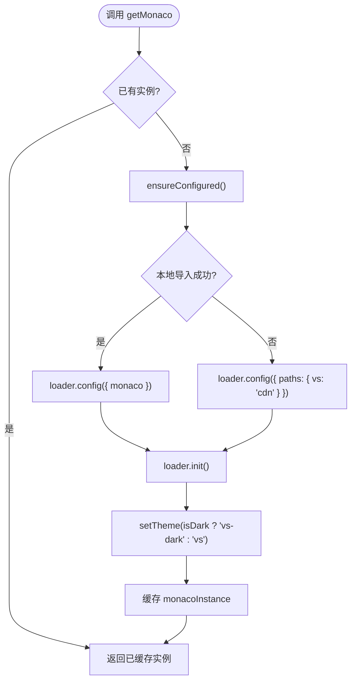
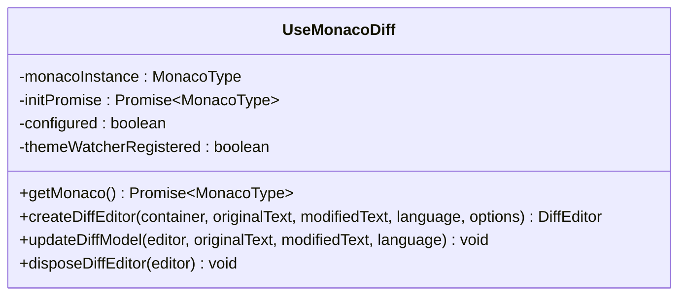
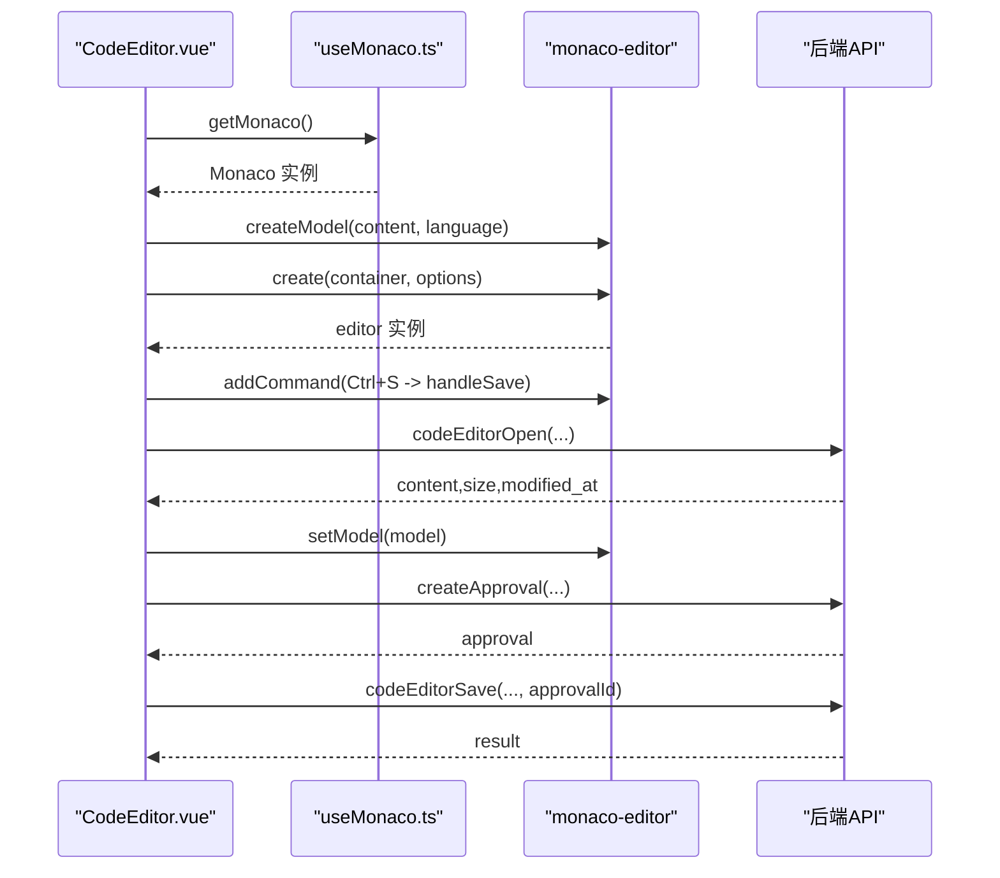
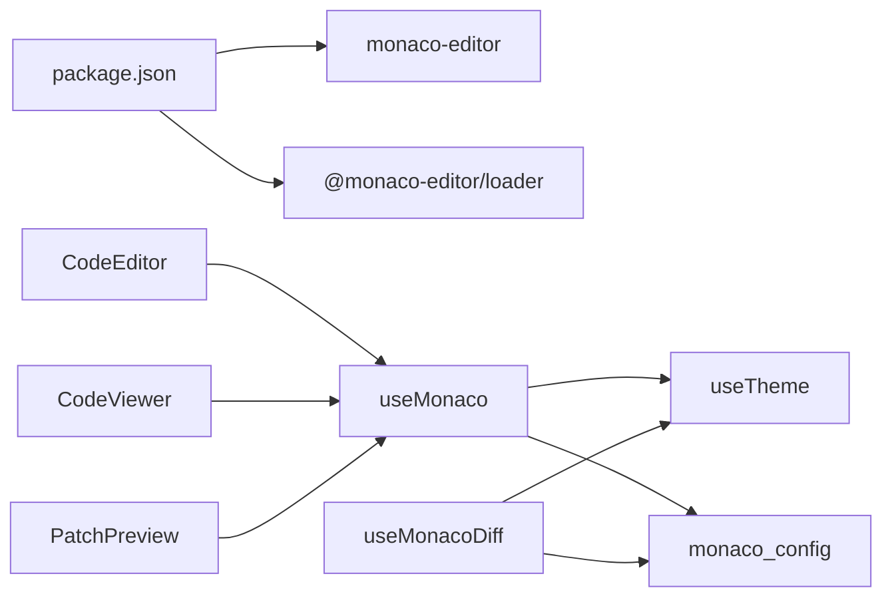

# Monaco Editor 集成

<cite>
**本文引用的文件**   
- [apps/desktop/src/composables/useMonaco.ts](file://apps/desktop/src/composables/useMonaco.ts)
- [apps/desktop/src/composables/useMonacoDiff.ts](file://apps/desktop/src/composables/useMonacoDiff.ts)
- [apps/desktop/src/monaco.config.ts](file://apps/desktop/src/monaco.config.ts)
- [apps/desktop/src/components/code/CodeEditor.vue](file://apps/desktop/src/components/code/CodeEditor.vue)
- [apps/desktop/src/components/code/CodeViewer.vue](file://apps/desktop/src/components/code/CodeViewer.vue)
- [apps/desktop/src/components/code/PatchPreview.vue](file://apps/desktop/src/components/code/PatchPreview.vue)
- [apps/desktop/package.json](file://apps/desktop/package.json)
</cite>

## 目录
1. [简介](#简介)
2. [项目结构](#项目结构)
3. [核心组件](#核心组件)
4. [架构总览](#架构总览)
5. [详细组件分析](#详细组件分析)
6. [依赖关系分析](#依赖关系分析)
7. [性能与内存优化](#性能与内存优化)
8. [大文件处理机制](#大文件处理机制)
9. [自定义扩展（语法高亮、智能提示、快捷键）](#自定义扩展语法高亮智能提示快捷键)
10. [错误诊断与调试技巧](#错误诊断与调试技巧)
11. [常见问题与解决方案](#常见问题与解决方案)
12. [结论](#结论)

## 简介
本技术文档围绕 Monaco Editor 在前端工程中的集成方案，重点说明 useMonaco 组合式函数的实现原理（编辑器实例管理、主题切换、语言检测、模型生命周期），并总结编辑器配置项、性能优化策略、大文件处理、内存管理与销毁流程。同时给出自定义语法高亮、智能提示扩展和快捷键映射的实践方法，以及错误诊断与调试指南。

## 项目结构
本项目在 Electron + Vue 3 环境下使用 monaco-editor 与 @monaco-editor/loader 进行懒加载与 Worker 配置，通过组合式函数封装编辑器初始化、主题同步与语言检测能力，并在多个代码编辑/查看组件中复用。

图表来源
- [apps/desktop/src/components/code/CodeEditor.vue:1-287](file://apps/desktop/src/components/code/CodeEditor.vue#L1-L287)
- [apps/desktop/src/components/code/CodeViewer.vue:1-164](file://apps/desktop/src/components/code/CodeViewer.vue#L1-L164)
- [apps/desktop/src/components/code/PatchPreview.vue:1-200](file://apps/desktop/src/components/code/PatchPreview.vue#L1-L200)
- [apps/desktop/src/composables/useMonaco.ts:1-147](file://apps/desktop/src/composables/useMonaco.ts#L1-L147)
- [apps/desktop/src/composables/useMonacoDiff.ts:1-127](file://apps/desktop/src/composables/useMonacoDiff.ts#L1-L127)
- [apps/desktop/src/monaco.config.ts:1-67](file://apps/desktop/src/monaco.config.ts#L1-L67)

章节来源
- [apps/desktop/src/composables/useMonaco.ts:1-147](file://apps/desktop/src/composables/useMonaco.ts#L1-L147)
- [apps/desktop/src/composables/useMonacoDiff.ts:1-127](file://apps/desktop/src/composables/useMonacoDiff.ts#L1-L127)
- [apps/desktop/src/monaco.config.ts:1-67](file://apps/desktop/src/monaco.config.ts#L1-L67)
- [apps/desktop/src/components/code/CodeEditor.vue:1-287](file://apps/desktop/src/components/code/CodeEditor.vue#L1-L287)
- [apps/desktop/src/components/code/CodeViewer.vue:1-164](file://apps/desktop/src/components/code/CodeViewer.vue#L1-L164)
- [apps/desktop/src/components/code/PatchPreview.vue:1-200](file://apps/desktop/src/components/code/PatchPreview.vue#L1-L200)

## 核心组件
- useMonaco：提供编辑器实例获取、主题同步、语言检测工具；保证单例化与惰性初始化，支持 CDN 回退。
- useMonacoDiff：提供差异编辑器创建、更新与销毁的封装，统一主题与应用配置。
- monaco.config：设置 MonacoEnvironment 以适配 Vite 打包下的 Web Worker 路径，确保语言服务正常运行。
- CodeEditor / CodeViewer / PatchPreview：基于 useMonaco 或 useMonacoDiff 构建的可编辑/只读/差异对比视图，负责模型生命周期与用户交互。

章节来源
- [apps/desktop/src/composables/useMonaco.ts:1-147](file://apps/desktop/src/composables/useMonaco.ts#L1-L147)
- [apps/desktop/src/composables/useMonacoDiff.ts:1-127](file://apps/desktop/src/composables/useMonacoDiff.ts#L1-L127)
- [apps/desktop/src/monaco.config.ts:1-67](file://apps/desktop/src/monaco.config.ts#L1-L67)
- [apps/desktop/src/components/code/CodeEditor.vue:1-287](file://apps/desktop/src/components/code/CodeEditor.vue#L1-L287)
- [apps/desktop/src/components/code/CodeViewer.vue:1-164](file://apps/desktop/src/components/code/CodeViewer.vue#L1-L164)
- [apps/desktop/src/components/code/PatchPreview.vue:1-200](file://apps/desktop/src/components/code/PatchPreview.vue#L1-L200)

## 架构总览
整体采用“组合式函数 + 组件”的分层设计：
- 组合式函数负责 Monaco 实例、主题、语言与 Worker 的统一管理。
- 组件聚焦业务逻辑（打开/保存文件、审批流、差异预览等）。
- 配置文件解决打包环境下的 Worker 路径问题。

图表来源
- [apps/desktop/src/composables/useMonaco.ts:1-68](file://apps/desktop/src/composables/useMonaco.ts#L1-L68)
- [apps/desktop/src/monaco.config.ts:24-49](file://apps/desktop/src/monaco.config.ts#L24-L49)

## 详细组件分析

### useMonaco 组合式函数
- 编辑器实例管理：全局缓存 monacoInstance 与 initPromise，避免重复初始化；首次调用时通过 loader 动态导入 monaco-editor，失败则回退到 CDN 路径。
- 主题切换：监听 isDark 计算属性，当 theme 为 system 时依据系统偏好决定；初始化后及主题变化时调用 setTheme。
- 语言检测：detectLanguage 根据文件扩展名与特殊文件名映射到 Monaco 语言 ID，未匹配时回退到 plaintext。
- 返回 API：monacoReady、getMonaco、isDark、setTheme。

图表来源
- [apps/desktop/src/composables/useMonaco.ts:14-68](file://apps/desktop/src/composables/useMonaco.ts#L14-L68)

章节来源
- [apps/desktop/src/composables/useMonaco.ts:1-147](file://apps/desktop/src/composables/useMonaco.ts#L1-L147)

### useMonacoDiff 组合式函数
- 差异编辑器创建：createDiffEditor 接收容器、原始/修改文本、语言与选项，生成两个 ITextModel 并设置到差异编辑器。
- 模型更新：updateDiffModel 可动态替换 original/modified 内容并设置语言。
- 销毁流程：disposeDiffEditor 安全释放模型与编辑器实例。
- 主题同步：与 useMonaco 类似，初始化后及主题变化时调用 setTheme。

图表来源
- [apps/desktop/src/composables/useMonacoDiff.ts:1-127](file://apps/desktop/src/composables/useMonacoDiff.ts#L1-L127)

章节来源
- [apps/desktop/src/composables/useMonacoDiff.ts:1-127](file://apps/desktop/src/composables/useMonacoDiff.ts#L1-L127)

### monaco.config 配置模块
- 作用：安装 window.MonacoEnvironment.getWorker，使 Monaco 的 Web Worker 通过 Vite 的 ESM worker 机制正确加载。
- 默认行为：editorWorker 与其他语言 worker 均回退到通用 editor.worker.js，简化构建并保持语法高亮可用。
- 构建提示：导出 monacoVitePluginConfig 用于 vite.config 插件优化（包含 optimizeDeps 与 worker.format）。

章节来源
- [apps/desktop/src/monaco.config.ts:1-67](file://apps/desktop/src/monaco.config.ts#L1-L67)

### CodeEditor 组件
- 功能：打开/编辑文件、撤销/重做、格式化、保存（需审批）、取消。
- 编辑器配置：fontSize、lineNumbers、minimap.enabled、scrollBeyondLastLine、wordWrap、tabSize、renderWhitespace、bracketPairColorization、smoothScrolling、autoClosingBrackets。
- 模型生命周期：每次渲染前 dispose 旧 model，创建新 model 并绑定到编辑器；组件卸载时释放 editor 与 model。
- 快捷键：Ctrl/Cmd+S 触发保存。
- 语言切换：监听 language 计算属性变化，动态设置模型语言。

图表来源
- [apps/desktop/src/components/code/CodeEditor.vue:78-120](file://apps/desktop/src/components/code/CodeEditor.vue#L78-L120)
- [apps/desktop/src/components/code/CodeEditor.vue:122-174](file://apps/desktop/src/components/code/CodeEditor.vue#L122-L174)

章节来源
- [apps/desktop/src/components/code/CodeEditor.vue:1-287](file://apps/desktop/src/components/code/CodeEditor.vue#L1-L287)

### CodeViewer 组件
- 功能：只读展示文件内容，支持刷新与跳转编辑。
- 编辑器配置：与 CodeEditor 类似但 readOnly=true，禁用 wordWrap，启用 minimap。
- 模型生命周期：同 CodeEditor，组件卸载时释放资源。

章节来源
- [apps/desktop/src/components/code/CodeViewer.vue:1-164](file://apps/desktop/src/components/code/CodeViewer.vue#L1-L164)

### PatchPreview 组件
- 功能：差异对比展示、生成补丁字符串、申请审批并应用补丁。
- 编辑器配置：差异编辑器，readOnly=true，关闭 minimap，按行显示差异。
- 模型生命周期：originalModel/modifiedModel 在渲染前释放并重建。

章节来源
- [apps/desktop/src/components/code/PatchPreview.vue:1-200](file://apps/desktop/src/components/code/PatchPreview.vue#L1-L200)

## 依赖关系分析
- 运行时依赖：monaco-editor（编辑器核心）、@monaco-editor/loader（懒加载与配置）、Vue 3（响应式与组合式 API）。
- 构建依赖：Vite（ESM worker 打包）、Electron（桌面运行环境）。
- 组件耦合：CodeEditor/CodeViewer/PatchPreview 强依赖 useMonaco/useMonacoDiff；useMonaco 依赖 useTheme 与 monaco.config。

图表来源
- [apps/desktop/package.json:16-46](file://apps/desktop/package.json#L16-L46)
- [apps/desktop/src/components/code/CodeEditor.vue:1-287](file://apps/desktop/src/components/code/CodeEditor.vue#L1-L287)
- [apps/desktop/src/components/code/CodeViewer.vue:1-164](file://apps/desktop/src/components/code/CodeViewer.vue#L1-L164)
- [apps/desktop/src/components/code/PatchPreview.vue:1-200](file://apps/desktop/src/components/code/PatchPreview.vue#L1-L200)
- [apps/desktop/src/composables/useMonaco.ts:1-147](file://apps/desktop/src/composables/useMonaco.ts#L1-L147)
- [apps/desktop/src/composables/useMonacoDiff.ts:1-127](file://apps/desktop/src/composables/useMonacoDiff.ts#L1-L127)
- [apps/desktop/src/monaco.config.ts:1-67](file://apps/desktop/src/monaco.config.ts#L1-L67)

章节来源
- [apps/desktop/package.json:16-46](file://apps/desktop/package.json#L16-L46)

## 性能与内存优化
- 懒加载与单例：通过 @monaco-editor/loader 延迟加载 monaco-editor，并使用全局缓存避免重复初始化，减少首屏开销。
- Worker 优化：将语言 worker 统一指向 editor.worker.js，降低多语言 worker 数量；如需更丰富的语言服务，可在 monaco.config 中按需配置专用 worker。
- 模型复用：组件内复用 model，仅在必要时 dispose 并重建，避免频繁创建带来的内存抖动。
- 主题同步：仅一次监听 isDark 变化并调用 setTheme，避免重复设置。
- 配置精简：关闭不必要的特性（如 minimap 在差异视图），减少渲染压力。

[本节为通用指导，不直接分析具体文件]

## 大文件处理机制
当前实现未内置分页/虚拟滚动或增量加载，建议以下策略：
- 服务端分页：对超大文件分块读取，前端按需加载片段并合并显示。
- 虚拟滚动：结合 Monaco 的 onDidChangeModelContent 与滚动事件，仅维护可视区域模型内容。
- 异步加载：在 loadFile 阶段先加载元信息（大小、修改时间），再决定是否全量加载内容。
- 内存监控：在组件卸载时严格释放 editor 与 model，避免内存泄漏。

[本节为通用指导，不直接分析具体文件]

## 自定义扩展（语法高亮、智能提示、快捷键）
- 自定义语法高亮：可通过 Monaco 的 registerLanguage 接口注册自定义语言与 token 规则；在 detectLanguage 中映射扩展名到新语言 ID。
- 智能提示扩展：使用 Monaco 的 registerCompletionItemProvider 注册补全提供者；对于 TS/CSS/HTML 等丰富语言服务，需在 monaco.config 中配置对应 worker。
- 快捷键映射：通过 editor.addCommand 绑定快捷键（如 Ctrl/Cmd+S），或在 keybindings 中扩展命令。

[本节为通用指导，不直接分析具体文件]

## 错误诊断与调试技巧
- 初始化失败回退：useMonaco 在本地导入失败时自动回退到 CDN，便于开发环境快速验证。
- 主题不一致：检查 useTheme 的 isDark 计算与 setTheme 调用时机，确保在编辑器实例存在后再设置主题。
- Worker 加载异常：确认 monaco.config 的 MonacoEnvironment.getWorker 是否正确安装，且 Vite 的 worker.format 设置为 es。
- 模型未更新：确保在语言变化时调用 setModelLanguage，并在组件卸载时 dispose 模型与编辑器。
- 审批流阻塞：CodeEditor/PatchPreview 的保存/应用操作依赖审批状态，需检查审批回调与状态变更逻辑。

章节来源
- [apps/desktop/src/composables/useMonaco.ts:14-26](file://apps/desktop/src/composables/useMonaco.ts#L14-L26)
- [apps/desktop/src/monaco.config.ts:24-49](file://apps/desktop/src/monaco.config.ts#L24-L49)
- [apps/desktop/src/components/code/CodeEditor.vue:195-202](file://apps/desktop/src/components/code/CodeEditor.vue#L195-L202)
- [apps/desktop/src/components/code/PatchPreview.vue:190-198](file://apps/desktop/src/components/code/PatchPreview.vue#L190-L198)

## 常见问题与解决方案
- 编辑器未显示内容：检查 containerRef 是否就绪、model 是否创建成功、language 是否正确映射。
- 主题未生效：确保在编辑器实例创建后调用 setTheme，并在主题变化时重新设置。
- 语言服务不可用：确认 monaco.config 的 Worker 配置与 Vite 插件设置；必要时引入特定语言的 worker。
- 内存占用过高：避免频繁创建/销毁模型，尽量复用；组件卸载时务必 dispose。
- 快捷键冲突：检查 addCommand 的命令键组合是否与系统或其他插件冲突。

[本节为通用指导，不直接分析具体文件]

## 结论
本项目通过 useMonaco 与 useMonacoDiff 组合式函数实现了 Monaco Editor 的稳定集成，涵盖实例管理、主题同步、语言检测与模型生命周期。配合 monaco.config 的 Worker 配置，确保了在不同打包环境下的可用性。组件层面提供了编辑、只读与差异对比三种视图，满足常见代码操作需求。未来可在此基础上扩展虚拟滚动、分页加载与自定义语言服务，进一步提升大文件场景的性能与体验。