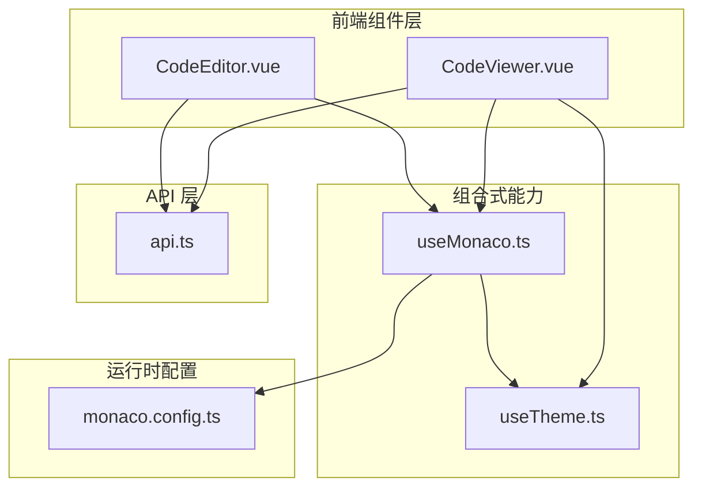
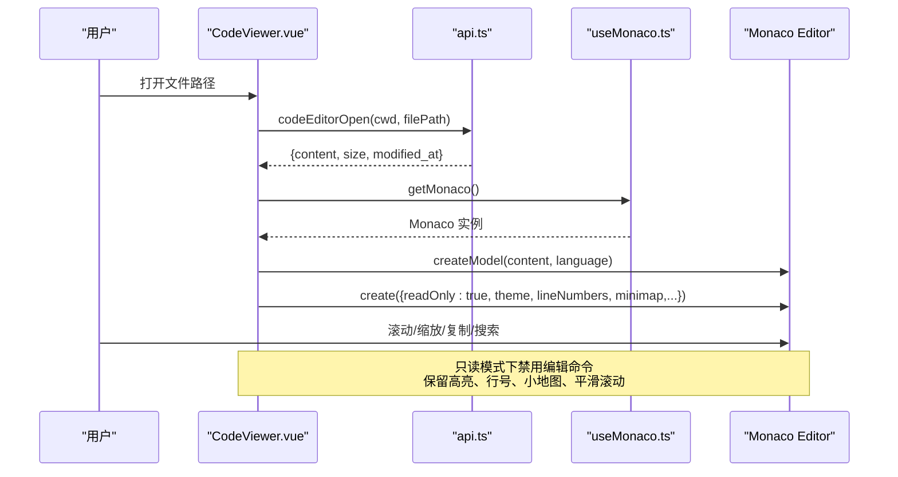
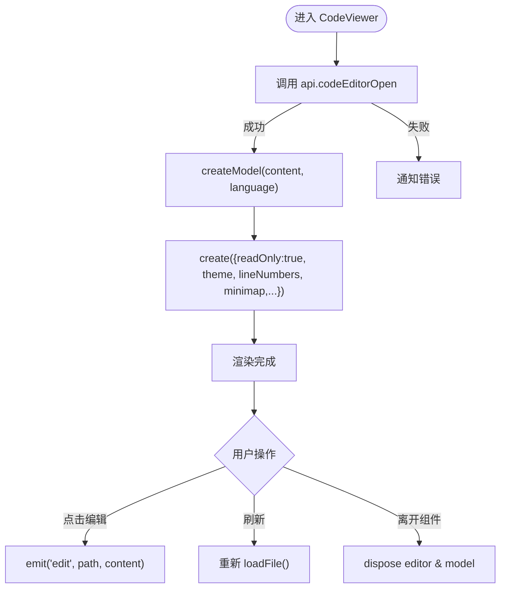
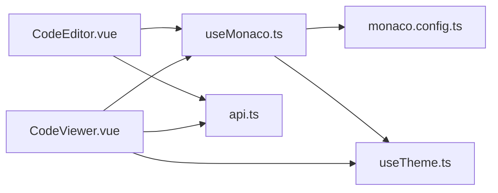

# 代码查看器组件

<cite>
**本文引用的文件**
- [CodeViewer.vue](file://apps/desktop/src/components/code/CodeViewer.vue)
- [CodeEditor.vue](file://apps/desktop/src/components/code/CodeEditor.vue)
- [useMonaco.ts](file://apps/desktop/src/composables/useMonaco.ts)
- [monaco.config.ts](file://apps/desktop/src/monaco.config.ts)
- [useTheme.ts](file://apps/desktop/src/composables/useTheme.ts)
- [api.ts](file://apps/desktop/src/api.ts)
</cite>

## 目录
1. [简介](#简介)
2. [项目结构](#项目结构)
3. [核心组件](#核心组件)
4. [架构总览](#架构总览)
5. [详细组件分析](#详细组件分析)
6. [依赖关系分析](#依赖关系分析)
7. [性能考虑](#性能考虑)
8. [故障排查指南](#故障排查指南)
9. [结论](#结论)
10. [附录](#附录)

## 简介
本文件为 CodeViewer 组件的只读模式技术文档，面向开发者与使用者，系统阐述其与 CodeEditor 的差异、只读模式的优化点与特性，包括语法高亮、语言识别、行号显示、代码折叠（由 Monaco 提供）、大文件性能策略、虚拟滚动与内存管理、复制与搜索定位、跳转定义与外部链接处理、主题定制、字体设置以及打印友好输出等。

## 项目结构
CodeViewer 位于桌面应用的前端 Vue 组件中，基于 Monaco Editor 实现只读代码展示；其语言识别与编辑器初始化逻辑集中在 useMonaco 组合式函数中；主题切换通过 useTheme 驱动；Monaco Worker 配置在 monaco.config.ts 中统一安装；数据加载通过 api.codeEditorOpen 接口获取文件内容与元信息。

图表来源
- [CodeViewer.vue:1-164](file://apps/desktop/src/components/code/CodeViewer.vue#L1-L164)
- [CodeEditor.vue:1-287](file://apps/desktop/src/components/code/CodeEditor.vue#L1-L287)
- [useMonaco.ts:1-147](file://apps/desktop/src/composables/useMonaco.ts#L1-L147)
- [monaco.config.ts:1-67](file://apps/desktop/src/monaco.config.ts#L1-L67)
- [useTheme.ts:1-258](file://apps/desktop/src/composables/useTheme.ts#L1-L258)
- [api.ts:1-200](file://apps/desktop/src/api.ts#L1-L200)

章节来源
- [CodeViewer.vue:1-164](file://apps/desktop/src/components/code/CodeViewer.vue#L1-L164)
- [useMonaco.ts:1-147](file://apps/desktop/src/composables/useMonaco.ts#L1-L147)
- [monaco.config.ts:1-67](file://apps/desktop/src/monaco.config.ts#L1-L67)
- [useTheme.ts:1-258](file://apps/desktop/src/composables/useTheme.ts#L1-L258)
- [api.ts:1-200](file://apps/desktop/src/api.ts#L1-L200)

## 核心组件
- CodeViewer：只读代码查看器，负责加载文件内容、创建只读 Monaco 实例、渲染行号与小地图、响应主题变化、提供“编辑”入口以切换到 CodeEditor。
- CodeEditor：可编辑代码编辑器，支持撤销/重做、格式化、保存审批流、脏状态标记等。
- useMonaco：封装 Monaco 初始化、主题同步、语言识别映射。
- monaco.config：安装 MonacoEnvironment，确保 Worker 正确加载。
- useTheme：主题与强调色管理，影响编辑器主题。
- api：HTTP 客户端类型与调用方法，用于读取文件与元信息。

章节来源
- [CodeViewer.vue:1-164](file://apps/desktop/src/components/code/CodeViewer.vue#L1-L164)
- [CodeEditor.vue:1-287](file://apps/desktop/src/components/code/CodeEditor.vue#L1-L287)
- [useMonaco.ts:1-147](file://apps/desktop/src/composables/useMonaco.ts#L1-L147)
- [monaco.config.ts:1-67](file://apps/desktop/src/monaco.config.ts#L1-L67)
- [useTheme.ts:1-258](file://apps/desktop/src/composables/useTheme.ts#L1-L258)
- [api.ts:1-200](file://apps/desktop/src/api.ts#L1-L200)

## 架构总览
CodeViewer 的数据流与交互流程如下：

图表来源
- [CodeViewer.vue:48-100](file://apps/desktop/src/components/code/CodeViewer.vue#L48-L100)
- [useMonaco.ts:48-68](file://apps/desktop/src/composables/useMonaco.ts#L48-L68)
- [api.ts:1-200](file://apps/desktop/src/api.ts#L1-L200)

## 详细组件分析

### CodeViewer 组件（只读模式）
- 只读模式与差异
  - readOnly: true，禁止输入与编辑命令，适合审阅与展示。
  - 相比 CodeEditor，不维护脏状态、无保存/审批流、无自动闭合括号等编辑增强。
- 语法高亮与语言识别
  - 使用 detectLanguage(filePath) 根据扩展名或特殊文件名映射到 Monaco 语言 ID。
  - 动态监听语言变化并更新模型语言。
- 行号与小地图
  - 启用 lineNumbers: 'on' 与 minimap.enabled: true，便于快速浏览。
- 主题与字体
  - 跟随 isDark 切换 vs-dark / vs 主题；默认 fontSize 13。
- 性能与内存
  - 每次渲染前释放旧 model，避免重复挂载导致的内存泄漏。
  - 组件卸载时 dispose editor 与 model，确保资源回收。
- 交互
  - 提供“编辑”按钮触发 edit 事件，交由父级切换到 CodeEditor。
  - 提供刷新按钮重新拉取文件内容。
- 错误处理
  - 加载失败通过通知提示，包含 source 与 key，便于追踪。

图表来源
- [CodeViewer.vue:48-115](file://apps/desktop/src/components/code/CodeViewer.vue#L48-L115)

章节来源
- [CodeViewer.vue:1-164](file://apps/desktop/src/components/code/CodeViewer.vue#L1-L164)

### CodeEditor 组件（对比参考）
- 可编辑模式
  - readOnly: false，支持内容变更监听、撤销/重做、格式化、保存审批流。
- 状态管理
  - 维护 originalContent 与 content 比较得出 isDirty。
- 保存流程
  - 先创建 Approval，等待批准后再执行保存，成功后更新元信息并通知。
- 快捷键
  - Ctrl+S 触发保存。

章节来源
- [CodeEditor.vue:1-287](file://apps/desktop/src/components/code/CodeEditor.vue#L1-L287)

### useMonaco 组合式函数
- 懒加载与缓存
  - 首次 getMonaco 时通过 loader.init() 初始化，后续直接返回实例。
- 主题同步
  - 监听 isDark 变化，动态 setTheme(vs-dark / vs)。
- 语言识别
  - detectLanguage 将常见扩展名映射到 Monaco 语言 ID，并处理 Dockerfile、Makefile 等特殊文件名。

章节来源
- [useMonaco.ts:1-147](file://apps/desktop/src/composables/useMonaco.ts#L1-L147)

### monaco.config.ts
- 安装 MonacoEnvironment.getWorker，确保编辑器与语言服务 Worker 正确加载。
- 提供 Vite 插件配置提示，保证 ESM worker 打包正确。

章节来源
- [monaco.config.ts:1-67](file://apps/desktop/src/monaco.config.ts#L1-L67)

### useTheme 主题系统
- 支持 dark/light/system 三种主题模式，持久化存储。
- 强调色变量注入 CSS 变量，影响 UI 与编辑器外观。
- 监听系统主题变化，自动适配 system 模式。

章节来源
- [useTheme.ts:1-258](file://apps/desktop/src/composables/useTheme.ts#L1-L258)

### API 层
- codeEditorOpen：读取文件内容与元信息（size、modified_at）。
- 其他类型定义用于审批流、会话、消息等，供编辑器与相关面板使用。

章节来源
- [api.ts:1-200](file://apps/desktop/src/api.ts#L1-L200)

## 依赖关系分析
- CodeViewer 依赖 useMonaco 获取编辑器实例与语言识别，依赖 api 拉取文件内容，依赖 useTheme 决定主题。
- CodeEditor 除上述依赖外，还依赖审批流与保存接口。
- useMonaco 依赖 monaco.config 安装的 MonacoEnvironment，确保 Worker 可用。
- 主题系统通过 useTheme 暴露 isDark，被 useMonaco 与编辑器共同消费。

图表来源
- [CodeViewer.vue:1-164](file://apps/desktop/src/components/code/CodeViewer.vue#L1-L164)
- [CodeEditor.vue:1-287](file://apps/desktop/src/components/code/CodeEditor.vue#L1-L287)
- [useMonaco.ts:1-147](file://apps/desktop/src/composables/useMonaco.ts#L1-L147)
- [monaco.config.ts:1-67](file://apps/desktop/src/monaco.config.ts#L1-L67)
- [useTheme.ts:1-258](file://apps/desktop/src/composables/useTheme.ts#L1-L258)
- [api.ts:1-200](file://apps/desktop/src/api.ts#L1-L200)

章节来源
- [CodeViewer.vue:1-164](file://apps/desktop/src/components/code/CodeViewer.vue#L1-L164)
- [CodeEditor.vue:1-287](file://apps/desktop/src/components/code/CodeEditor.vue#L1-L287)
- [useMonaco.ts:1-147](file://apps/desktop/src/composables/useMonaco.ts#L1-L147)
- [monaco.config.ts:1-67](file://apps/desktop/src/monaco.config.ts#L1-L67)
- [useTheme.ts:1-258](file://apps/desktop/src/composables/useTheme.ts#L1-L258)
- [api.ts:1-200](file://apps/desktop/src/api.ts#L1-L200)

## 性能考虑
- 大文件优化
  - 当前实现一次性加载完整文本到内存，未启用虚拟滚动。对于超大文件，建议引入虚拟滚动（仅渲染可视区域），以降低首屏渲染与内存占用。
  - 可在 renderEditor 中按块加载（如分页/分片）并结合虚拟列表，减少初始 DOM 节点数量。
- 虚拟滚动与内存管理
  - 建议在容器内使用虚拟滚动容器（例如基于窗口高度与行高估算可见行数），按需渲染行元素。
  - 保持 model.dispose 与 editor.dispose 的严格生命周期管理，避免重复挂载导致内存增长。
- 渲染优化
  - 关闭不必要的功能（如 minimap、bracketPairColorization）在大文件场景下可提升性能。
  - 合理设置 tabSize、wordWrap、renderWhitespace 等选项以减少布局计算。
- 网络与缓存
  - 对频繁访问的文件可增加本地缓存（内存或 IndexedDB），减少重复请求。
  - 利用 modified_at 进行增量更新判断，仅在内容变化时重建 model。

[本节为通用性能建议，不直接分析具体文件]

## 故障排查指南
- 无法加载文件
  - 检查 api.codeEditorOpen 是否返回有效 content、size、modified_at。
  - 查看通知中的错误源与键值（source: 'code', key: 'code-file-load'）。
- 主题不生效
  - 确认 useTheme 已正确设置 data-theme，且 useMonaco 的 isDark 计算正确。
  - 检查 Monaco 实例是否在主题变更后调用 setTheme。
- 语言识别错误
  - 检查 detectLanguage 映射表是否覆盖目标扩展名或特殊文件名。
  - 若语言未加载，需确保对应语言包已按需加载。
- 内存泄漏
  - 确认 onBeforeUnmount 中 editor.dispose() 与 model.dispose() 均被执行。
  - 避免重复创建 model 而未释放旧实例。

章节来源
- [CodeViewer.vue:62-67](file://apps/desktop/src/components/code/CodeViewer.vue#L62-L67)
- [CodeViewer.vue:106-115](file://apps/desktop/src/components/code/CodeViewer.vue#L106-L115)
- [useMonaco.ts:41-46](file://apps/desktop/src/composables/useMonaco.ts#L41-L46)
- [useMonaco.ts:73-146](file://apps/desktop/src/composables/useMonaco.ts#L73-L146)

## 结论
CodeViewer 作为只读代码查看器，聚焦于高效、稳定的代码展示体验，依托 Monaco Editor 提供语法高亮、行号、小地图与平滑滚动等基础能力，并通过 useMonaco 与 useTheme 实现主题与语言的统一管理。与 CodeEditor 相比，它去除了编辑与保存相关复杂度，更适合审阅与分享场景。针对大文件与性能需求，建议引入虚拟滚动与更严格的内存管理策略，以获得更好的用户体验。

[本节为总结性内容，不直接分析具体文件]

## 附录

### 只读模式特性清单
- 语法高亮：基于 detectLanguage 映射，自动识别多种语言。
- 行号显示：lineNumbers: 'on'。
- 代码折叠：由 Monaco 内置折叠功能提供（无需额外配置）。
- 小地图：minimap.enabled: true。
- 平滑滚动：smoothScrolling: true。
- 主题切换：跟随 isDark 动态切换 vs-dark / vs。
- 字体设置：fontSize: 13（可根据需要扩展为可配置）。
- 复制与搜索：浏览器原生复制与 Monaco 内置搜索均可用。
- 跳转定义与外部链接：取决于 Monaco 语言服务与链接解析配置，当前未显式启用高级语言服务。

章节来源
- [CodeViewer.vue:85-99](file://apps/desktop/src/components/code/CodeViewer.vue#L85-L99)
- [useMonaco.ts:73-146](file://apps/desktop/src/composables/useMonaco.ts#L73-L146)

### 与 CodeEditor 的关键差异
- 编辑能力：CodeViewer 只读，CodeEditor 可编辑并支持撤销/重做/格式化。
- 保存流程：CodeEditor 通过审批流保存，CodeViewer 仅提供“编辑”入口。
- 状态管理：CodeEditor 维护脏状态，CodeViewer 不维护。
- 快捷键：CodeEditor 支持 Ctrl+S 保存，CodeViewer 无编辑快捷键。

章节来源
- [CodeEditor.vue:94-120](file://apps/desktop/src/components/code/CodeEditor.vue#L94-L120)
- [CodeViewer.vue:85-100](file://apps/desktop/src/components/code/CodeViewer.vue#L85-L100)