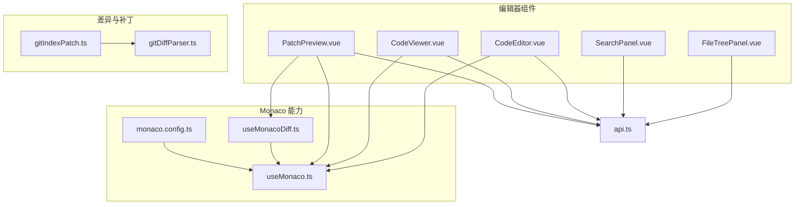
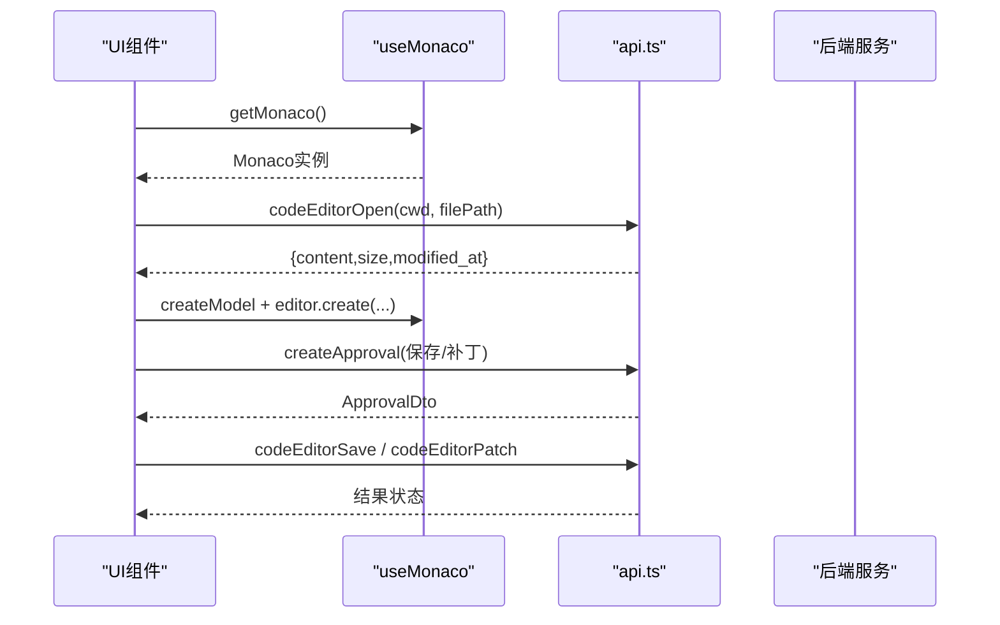
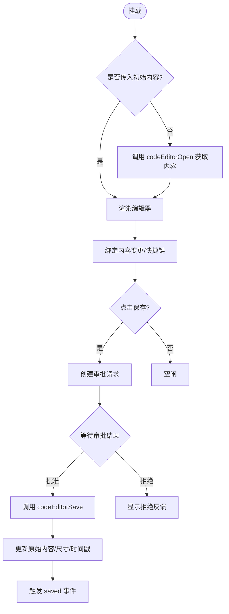
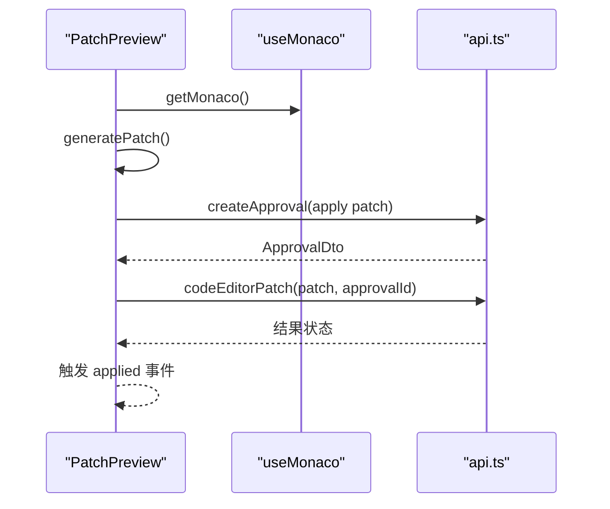
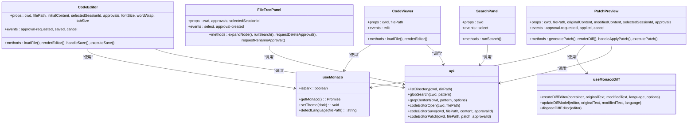

# 代码编辑器系统

<cite>
**本文引用的文件**   
- [CodeEditor.vue](file://apps/desktop/src/components/code/CodeEditor.vue)
- [CodeViewer.vue](file://apps/desktop/src/components/code/CodeViewer.vue)
- [PatchPreview.vue](file://apps/desktop/src/components/code/PatchPreview.vue)
- [FileTreePanel.vue](file://apps/desktop/src/components/code/FileTreePanel.vue)
- [SearchPanel.vue](file://apps/desktop/src/components/code/SearchPanel.vue)
- [useMonaco.ts](file://apps/desktop/src/composables/useMonaco.ts)
- [useMonacoDiff.ts](file://apps/desktop/src/composables/useMonacoDiff.ts)
- [monaco.config.ts](file://apps/desktop/src/monaco.config.ts)
- [gitDiffParser.ts](file://apps/desktop/src/gitDiffParser.ts)
- [gitIndexPatch.ts](file://apps/desktop/src/gitIndexPatch.ts)
- [api.ts](file://apps/desktop/src/api.ts)
</cite>

## 目录
1. [简介](#简介)
2. [项目结构](#项目结构)
3. [核心组件](#核心组件)
4. [架构总览](#架构总览)
5. [详细组件分析](#详细组件分析)
6. [依赖关系分析](#依赖关系分析)
7. [性能考虑](#性能考虑)
8. [故障排查指南](#故障排查指南)
9. [结论](#结论)
10. [附录](#附录)

## 简介
本文件为基于 Monaco Editor 的代码编辑器系统的全面组件文档。内容覆盖语法高亮、智能提示、代码折叠与错误诊断等能力，并详细说明 CodeEditor、CodeViewer、PatchPreview、FileTreePanel 等组件的配置项与事件处理。同时涵盖文件树导航、差异对比、代码搜索与批量操作（补丁应用）的实现方式，以及自定义主题、快捷键映射和扩展集成的方法。最后给出大文件处理与内存管理的优化策略，帮助在复杂工程环境下获得稳定高效的编辑体验。

## 项目结构
前端代码位于 apps/desktop/src 下，编辑器相关能力集中在 components/code 与 composables 中，并通过 api.ts 与后端交互。Monaco 的初始化、语言识别与主题切换由 useMonaco 与 monaco.config.ts 统一管理。差异解析与补丁生成由 gitDiffParser.ts 与 gitIndexPatch.ts 提供。

图表来源 
- [CodeEditor.vue:1-287](file://apps/desktop/src/components/code/CodeEditor.vue#L1-L287)
- [CodeViewer.vue:1-164](file://apps/desktop/src/components/code/CodeViewer.vue#L1-L164)
- [PatchPreview.vue:1-262](file://apps/desktop/src/components/code/PatchPreview.vue#L1-L262)
- [FileTreePanel.vue:1-440](file://apps/desktop/src/components/code/FileTreePanel.vue#L1-L440)
- [SearchPanel.vue:1-346](file://apps/desktop/src/components/code/SearchPanel.vue#L1-L346)
- [useMonaco.ts:1-147](file://apps/desktop/src/composables/useMonaco.ts#L1-L147)
- [useMonacoDiff.ts:1-127](file://apps/desktop/src/composables/useMonacoDiff.ts#L1-L127)
- [monaco.config.ts:1-67](file://apps/desktop/src/monaco.config.ts#L1-L67)
- [gitDiffParser.ts:1-178](file://apps/desktop/src/gitDiffParser.ts#L1-L178)
- [gitIndexPatch.ts:1-108](file://apps/desktop/src/gitIndexPatch.ts#L1-L108)
- [api.ts:1177-1191](file://apps/desktop/src/api.ts#L1177-L1191)

章节来源
- [CodeEditor.vue:1-287](file://apps/desktop/src/components/code/CodeEditor.vue#L1-L287)
- [CodeViewer.vue:1-164](file://apps/desktop/src/components/code/CodeViewer.vue#L1-L164)
- [PatchPreview.vue:1-262](file://apps/desktop/src/components/code/PatchPreview.vue#L1-L262)
- [FileTreePanel.vue:1-440](file://apps/desktop/src/components/code/FileTreePanel.vue#L1-L440)
- [SearchPanel.vue:1-346](file://apps/desktop/src/components/code/SearchPanel.vue#L1-L346)
- [useMonaco.ts:1-147](file://apps/desktop/src/composables/useMonaco.ts#L1-L147)
- [useMonacoDiff.ts:1-127](file://apps/desktop/src/composables/useMonacoDiff.ts#L1-L127)
- [monaco.config.ts:1-67](file://apps/desktop/src/monaco.config.ts#L1-L67)
- [gitDiffParser.ts:1-178](file://apps/desktop/src/gitDiffParser.ts#L1-L178)
- [gitIndexPatch.ts:1-108](file://apps/desktop/src/gitIndexPatch.ts#L1-L108)
- [api.ts:1177-1191](file://apps/desktop/src/api.ts#L1177-L1191)

## 核心组件
- CodeEditor：可编辑的 Monaco 编辑器，支持保存审批流、撤销/重做、格式化、自动布局、主题跟随、语言检测与模型生命周期管理。
- CodeViewer：只读查看器，用于展示文件内容与元信息，支持一键进入编辑模式。
- PatchPreview：差异对比视图，支持生成 Codex 风格补丁、审批后应用补丁。
- FileTreePanel：文件树浏览，支持懒加载、搜索（glob）、右键菜单（重命名/删除需审批）。
- SearchPanel：全局搜索面板，支持文件名匹配与内容搜索（正则/大小写），结果高亮与上下文行展示。

章节来源
- [CodeEditor.vue:1-287](file://apps/desktop/src/components/code/CodeEditor.vue#L1-L287)
- [CodeViewer.vue:1-164](file://apps/desktop/src/components/code/CodeViewer.vue#L1-L164)
- [PatchPreview.vue:1-262](file://apps/desktop/src/components/code/PatchPreview.vue#L1-L262)
- [FileTreePanel.vue:1-440](file://apps/desktop/src/components/code/FileTreePanel.vue#L1-L440)
- [SearchPanel.vue:1-346](file://apps/desktop/src/components/code/SearchPanel.vue#L1-L346)

## 架构总览
编辑器子系统以 Vue 组件为核心，通过 useMonaco 统一获取与配置 Monaco 实例，结合 monaco.config.ts 设置 Web Worker 环境；业务逻辑通过 api.ts 调用后端服务完成文件读取、保存、差异与补丁操作。差异解析与补丁构建由纯函数模块提供，确保可测试性与复用性。

图表来源 
- [CodeEditor.vue:56-174](file://apps/desktop/src/components/code/CodeEditor.vue#L56-L174)
- [PatchPreview.vue:133-188](file://apps/desktop/src/components/code/PatchPreview.vue#L133-L188)
- [useMonaco.ts:48-68](file://apps/desktop/src/composables/useMonaco.ts#L48-L68)
- [api.ts:1185-1191](file://apps/desktop/src/api.ts#L1185-L1191)

## 详细组件分析

### CodeEditor 组件
- 功能要点
  - 动态加载文件内容，创建 Monaco 文本模型与编辑器实例。
  - 监听内容变更同步到本地 state，绑定 Ctrl+S 保存快捷键。
  - 保存流程：先创建审批请求，等待审批通过后执行实际保存。
  - 支持撤销/重做、格式化文档、自动换行、最小地图、括号配对着色等。
  - 根据文件后缀自动识别语言，并在语言变化时更新模型语言。
  - 组件卸载时释放编辑器与模型，避免内存泄漏。
- 关键配置项（props）
  - cwd、filePath、initialContent、selectedSessionId、approvals、fontSize、wordWrap、tabSize
- 事件（emits）
  - approval-requested：触发审批请求
  - saved：保存成功回调
  - cancel：关闭编辑器
- 错误处理
  - 使用通知组件反馈加载失败、审批创建失败、保存失败等异常。

图表来源 
- [CodeEditor.vue:56-174](file://apps/desktop/src/components/code/CodeEditor.vue#L56-L174)
- [CodeEditor.vue:195-202](file://apps/desktop/src/components/code/CodeEditor.vue#L195-L202)

章节来源
- [CodeEditor.vue:1-287](file://apps/desktop/src/components/code/CodeEditor.vue#L1-L287)

### CodeViewer 组件
- 功能要点
  - 只读展示文件内容，显示文件大小与修改时间。
  - 支持刷新与“编辑”按钮跳转至编辑器。
  - 自动语言识别与主题跟随。
- 关键配置项（props）
  - cwd、filePath
- 事件（emits）
  - edit：携带 filePath 与 content，供父组件打开编辑器

章节来源
- [CodeViewer.vue:1-164](file://apps/desktop/src/components/code/CodeViewer.vue#L1-L164)

### PatchPreview 组件
- 功能要点
  - 使用 Monaco DiffEditor 展示原内容与修改内容的差异。
  - 生成 Codex 风格的 apply_patch 字符串，包含上下文行。
  - 审批流：先创建审批，批准后调用 codeEditorPatch 应用补丁。
- 关键配置项（props）
  - cwd、filePath、originalContent、modifiedContent、selectedSessionId、approvals
- 事件（emits）
  - approval-requested：触发审批请求
  - applied：补丁应用成功回调
  - cancel：关闭预览

图表来源 
- [PatchPreview.vue:105-188](file://apps/desktop/src/components/code/PatchPreview.vue#L105-L188)
- [api.ts:1189-1191](file://apps/desktop/src/api.ts#L1189-L1191)

章节来源
- [PatchPreview.vue:1-262](file://apps/desktop/src/components/code/PatchPreview.vue#L1-L262)

### FileTreePanel 组件
- 功能要点
  - 懒加载目录节点，过滤隐藏文件（默认不显示点前缀）。
  - 支持 glob 搜索与结果列表展示。
  - 右键菜单支持打开、重命名、删除（重命名/删除需审批）。
  - 选中文件后触发 select 事件，供上层路由或编辑器打开。
- 关键配置项（props）
  - cwd、approvals、selectedSessionId
- 事件（emits）
  - select：选择文件路径
  - approval-created：审批创建回调

章节来源
- [FileTreePanel.vue:1-440](file://apps/desktop/src/components/code/FileTreePanel.vue#L1-L440)

### SearchPanel 组件
- 功能要点
  - 两种搜索模式：文件名匹配（glob）与内容搜索（grep）。
  - 支持大小写敏感与正则表达式开关。
  - 内容搜索结果按文件分组，展示上下文行与匹配高亮。
- 关键配置项（props）
  - cwd
- 事件（emits）
  - select：选择文件路径

章节来源
- [SearchPanel.vue:1-346](file://apps/desktop/src/components/code/SearchPanel.vue#L1-L346)

### Monaco 集成与主题
- useMonaco
  - 负责按需加载 Monaco 实例，设置主题（跟随系统或用户设置），暴露 isDark 与 setTheme。
  - detectLanguage 根据文件后缀映射到 Monaco 语言 ID。
- useMonacoDiff
  - 封装 DiffEditor 的创建、更新与销毁，便于差异视图复用。
- monaco.config.ts
  - 配置 MonacoEnvironment.getWorker，使 Vite 正确打包与运行 Monaco 的 Web Worker。

章节来源
- [useMonaco.ts:1-147](file://apps/desktop/src/composables/useMonaco.ts#L1-L147)
- [useMonacoDiff.ts:1-127](file://apps/desktop/src/composables/useMonacoDiff.ts#L1-L127)
- [monaco.config.ts:1-67](file://apps/desktop/src/monaco.config.ts#L1-L67)

### 差异解析与补丁构建
- gitDiffParser.ts
  - 解析 unified diff，输出结构化 GitParsedDiff，包含文件、hunk、行级变更。
- gitIndexPatch.ts
  - 基于选中的变更块生成独立可应用的补丁片段，合并相邻变更保持原子性。

章节来源
- [gitDiffParser.ts:1-178](file://apps/desktop/src/gitDiffParser.ts#L1-L178)
- [gitIndexPatch.ts:1-108](file://apps/desktop/src/gitIndexPatch.ts#L1-L108)

## 依赖关系分析
- 组件对 Monaco 的依赖通过 useMonaco/useMonacoDiff 抽象，避免直接耦合。
- 所有 I/O 操作集中到 api.ts，保证前后端接口契约清晰。
- 差异与补丁逻辑为纯函数，无外部副作用，易于单元测试与复用。

图表来源 
- [CodeEditor.vue:1-287](file://apps/desktop/src/components/code/CodeEditor.vue#L1-L287)
- [CodeViewer.vue:1-164](file://apps/desktop/src/components/code/CodeViewer.vue#L1-L164)
- [PatchPreview.vue:1-262](file://apps/desktop/src/components/code/PatchPreview.vue#L1-L262)
- [FileTreePanel.vue:1-440](file://apps/desktop/src/components/code/FileTreePanel.vue#L1-L440)
- [SearchPanel.vue:1-346](file://apps/desktop/src/components/code/SearchPanel.vue#L1-L346)
- [useMonaco.ts:1-147](file://apps/desktop/src/composables/useMonaco.ts#L1-L147)
- [useMonacoDiff.ts:1-127](file://apps/desktop/src/composables/useMonacoDiff.ts#L1-L127)
- [api.ts:1177-1191](file://apps/desktop/src/api.ts#L1177-L1191)

章节来源
- [api.ts:1177-1191](file://apps/desktop/src/api.ts#L1177-L1191)

## 性能考虑
- 大文件处理
  - 编辑器采用按需加载与懒渲染，避免一次性载入超大文件导致卡顿。
  - 差异对比禁用 minimap 与概览尺，减少渲染开销。
  - 搜索限制最大结果数，防止大量 DOM 渲染。
- 内存管理
  - 组件卸载时显式 dispose 编辑器与模型，避免内存泄漏。
  - 语言模型随语言变化更新，旧模型及时释放。
- 网络与缓存
  - 文件内容通过 API 拉取，建议在上层实现内容缓存与去抖刷新。
  - 审批流异步处理，避免阻塞主线程。
- 主题与渲染
  - 主题切换通过 setTheme 生效，避免重建编辑器实例。
  - 自动布局开启，减少手动计算布局带来的重排。

[本节为通用指导，无需特定文件引用]

## 故障排查指南
- 无法加载文件
  - 检查 api.codeEditorOpen 返回的数据结构与字段是否存在。
  - 确认 cwd 与 filePath 参数正确，且后端服务可达。
- 保存失败
  - 确认 selectedSessionId 已提供，审批流程正常。
  - 检查 codeEditorSave 返回的状态是否为 completed。
- 补丁应用失败
  - 校验 generatePatch 生成的补丁格式是否符合预期。
  - 确认 codeEditorPatch 的参数与审批状态。
- 搜索无结果
  - 检查 glob 模式是否正确，grep 选项（大小写/正则）是否合理。
  - 关注 max_results 限制与后端返回 matches 数组结构。
- Monaco 初始化问题
  - 确认 monaco.config.ts 的 MonacoEnvironment 已安装。
  - 检查 useMonaco 的 loader.init 是否成功，必要时回退 CDN。

章节来源
- [CodeEditor.vue:56-174](file://apps/desktop/src/components/code/CodeEditor.vue#L56-L174)
- [PatchPreview.vue:133-188](file://apps/desktop/src/components/code/PatchPreview.vue#L133-L188)
- [SearchPanel.vue:54-78](file://apps/desktop/src/components/code/SearchPanel.vue#L54-L78)
- [useMonaco.ts:14-25](file://apps/desktop/src/composables/useMonaco.ts#L14-L25)
- [monaco.config.ts:24-49](file://apps/desktop/src/monaco.config.ts#L24-L49)

## 结论
本编辑器系统以 Monaco 为核心，结合 Vue 组件化与清晰的 API 契约，实现了从文件浏览、编辑、差异对比到补丁应用的完整工作流。通过统一的 Monaco 初始化与主题管理、严格的审批流控制与完善的错误反馈机制，系统在易用性与安全性之间取得平衡。针对大文件与内存管理进行了针对性优化，适合在大型工程中稳定运行。

[本节为总结性内容，无需特定文件引用]

## 附录

### 组件配置与事件速查
- CodeEditor
  - props: cwd, filePath, initialContent, selectedSessionId, approvals, fontSize, wordWrap, tabSize
  - emits: approval-requested, saved, cancel
- CodeViewer
  - props: cwd, filePath
  - emits: edit
- PatchPreview
  - props: cwd, filePath, originalContent, modifiedContent, selectedSessionId, approvals
  - emits: approval-requested, applied, cancel
- FileTreePanel
  - props: cwd, approvals, selectedSessionId
  - emits: select, approval-created
- SearchPanel
  - props: cwd
  - emits: select

章节来源
- [CodeEditor.vue:9-24](file://apps/desktop/src/components/code/CodeEditor.vue#L9-L24)
- [CodeViewer.vue:9-16](file://apps/desktop/src/components/code/CodeViewer.vue#L9-L16)
- [PatchPreview.vue:9-22](file://apps/desktop/src/components/code/PatchPreview.vue#L9-L22)
- [FileTreePanel.vue:43-53](file://apps/desktop/src/components/code/FileTreePanel.vue#L43-L53)
- [SearchPanel.vue:31-37](file://apps/desktop/src/components/code/SearchPanel.vue#L31-L37)

### 自定义主题与快捷键映射
- 主题
  - 通过 useMonaco.isDark 与 setTheme 控制编辑器主题，跟随系统或用户设置。
- 快捷键
  - 编辑器内绑定 Ctrl+S 触发保存；可通过 editor.addCommand 扩展更多快捷键。
- 扩展集成
  - 在 monaco.config.ts 中配置 Web Worker，按需引入语言服务与扩展。

章节来源
- [useMonaco.ts:29-68](file://apps/desktop/src/composables/useMonaco.ts#L29-L68)
- [CodeEditor.vue:117-119](file://apps/desktop/src/components/code/CodeEditor.vue#L117-L119)
- [monaco.config.ts:24-49](file://apps/desktop/src/monaco.config.ts#L24-L49)

### 文件树导航与搜索
- 文件树
  - 懒加载目录，过滤隐藏文件，右键菜单支持重命名/删除（需审批）。
- 搜索
  - 支持 glob 文件名搜索与 grep 内容搜索，结果高亮与上下文行展示。

章节来源
- [FileTreePanel.vue:79-167](file://apps/desktop/src/components/code/FileTreePanel.vue#L79-L167)
- [SearchPanel.vue:54-78](file://apps/desktop/src/components/code/SearchPanel.vue#L54-L78)

### 差异对比与补丁应用
- 差异对比
  - 使用 Monaco DiffEditor 展示原内容与修改内容，禁用编辑与 minimap。
- 补丁生成与应用
  - 生成 Codex 风格补丁，经审批后调用 codeEditorPatch 应用。

章节来源
- [PatchPreview.vue:105-188](file://apps/desktop/src/components/code/PatchPreview.vue#L105-L188)
- [gitDiffParser.ts:36-156](file://apps/desktop/src/gitDiffParser.ts#L36-L156)
- [gitIndexPatch.ts:14-50](file://apps/desktop/src/gitIndexPatch.ts#L14-L50)