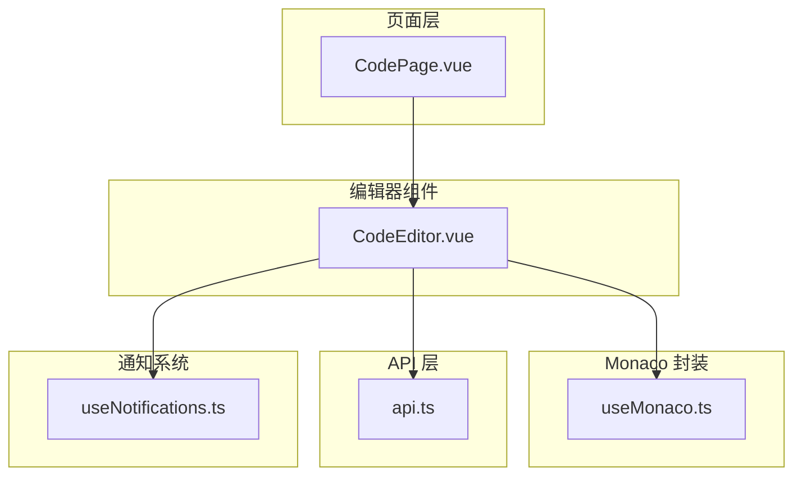
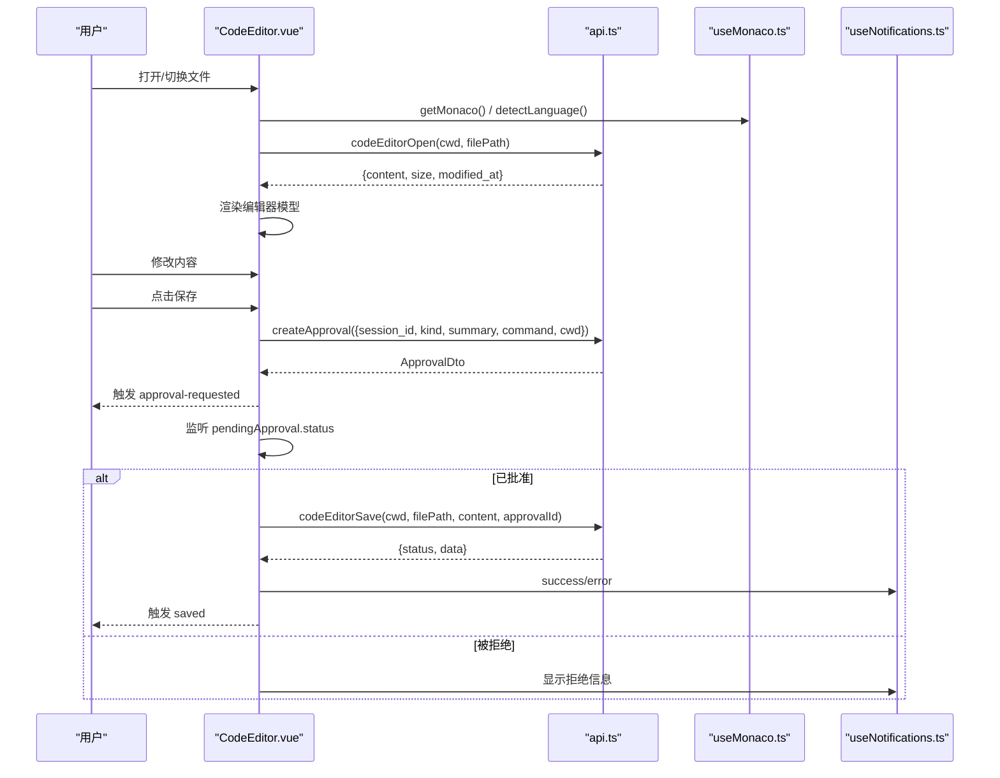
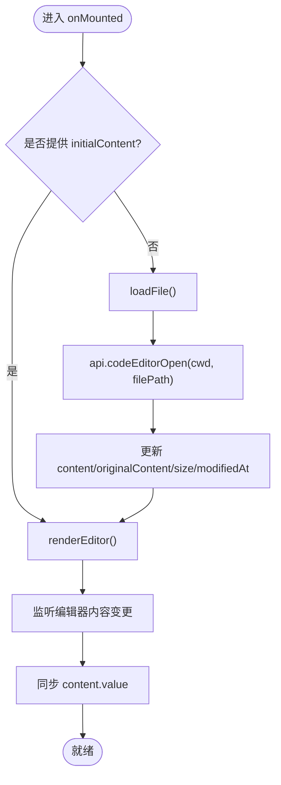
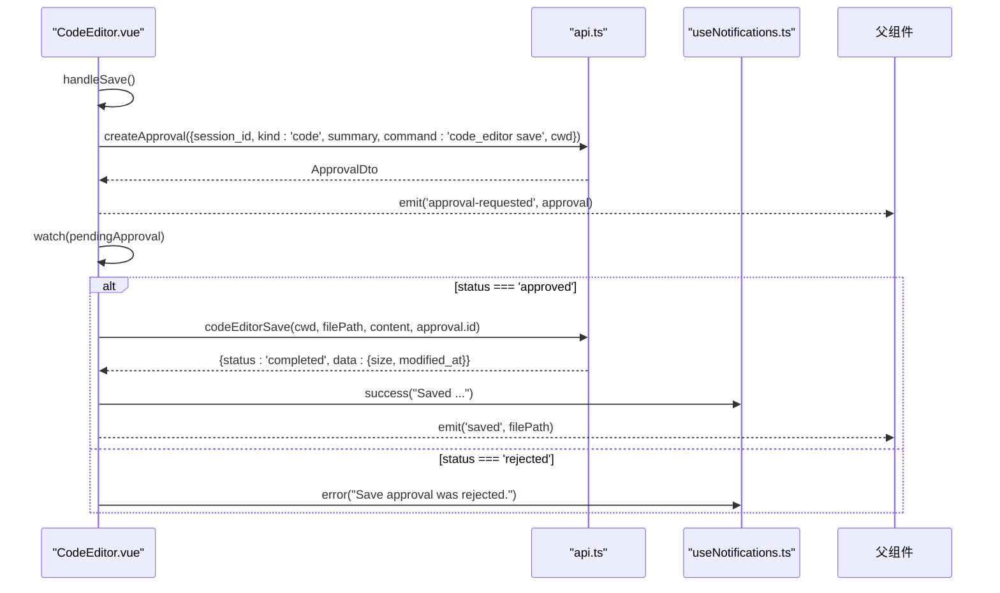
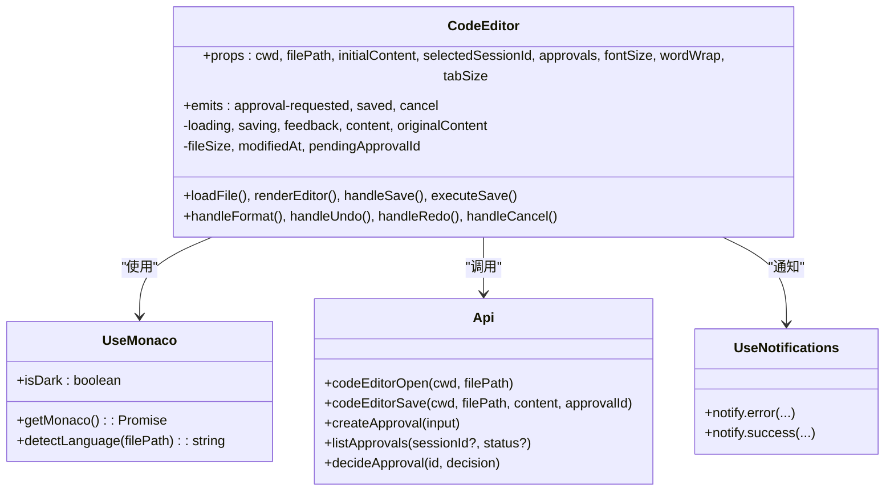
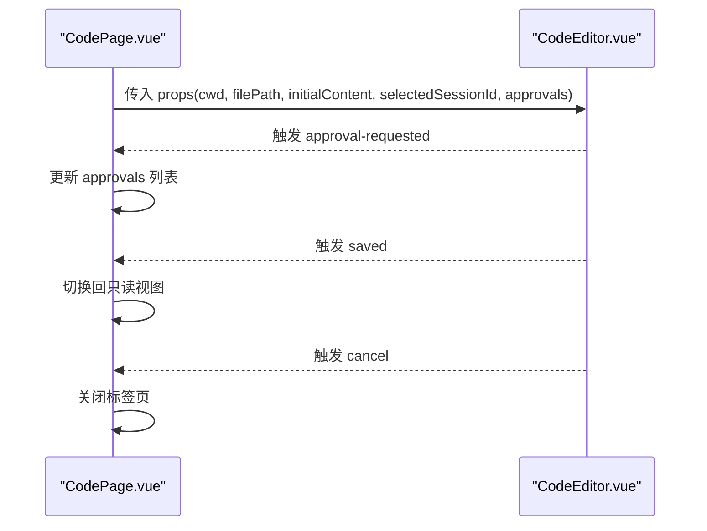

# 代码编辑器组件

<cite>
**本文引用的文件**   
- [CodeEditor.vue](file://apps/desktop/src/components/code/CodeEditor.vue)
- [api.ts](file://apps/desktop/src/api.ts)
- [useMonaco.ts](file://apps/desktop/src/composables/useMonaco.ts)
- [CodePage.vue](file://apps/desktop/src/pages/CodePage.vue)
- [index.ts（UI 组件导出）](file://apps/desktop/src/components/ui/index.ts)
- [useNotifications.ts](file://apps/desktop/src/composables/useNotifications.ts)
</cite>

## 目录
1. [简介](#简介)
2. [项目结构](#项目结构)
3. [核心组件](#核心组件)
4. [架构总览](#架构总览)
5. [详细组件分析](#详细组件分析)
6. [依赖关系分析](#依赖关系分析)
7. [性能考量](#性能考量)
8. [故障排查指南](#故障排查指南)
9. [结论](#结论)
10. [附录：使用示例与样式定制](#附录使用示例与样式定制)

## 简介
本文件为 CodeEditor 组件的全面文档，面向开发者与使用者。内容涵盖：
- Props 接口定义与语义说明（cwd、filePath、initialContent、selectedSessionId、approvals、fontSize、wordWrap、tabSize）
- 事件系统（approval-requested、saved、cancel）
- 文件加载流程、保存审批流程与状态管理
- 工具栏功能实现细节（撤销、重做、格式化、保存）
- 与审批系统的集成方式（创建审批、状态监听、执行控制）
- 组件使用示例、样式定制建议与性能优化要点

## 项目结构
CodeEditor 组件位于桌面应用前端模块中，围绕 Monaco Editor 构建，结合 API 层与通知系统完成文件读写与审批流。

图表来源
- [CodePage.vue:293-304](file://apps/desktop/src/pages/CodePage.vue#L293-L304)
- [CodeEditor.vue:1-287](file://apps/desktop/src/components/code/CodeEditor.vue#L1-L287)
- [useMonaco.ts:1-147](file://apps/desktop/src/composables/useMonaco.ts#L1-L147)
- [api.ts:1185-1192](file://apps/desktop/src/api.ts#L1185-L1192)
- [useNotifications.ts:1-200](file://apps/desktop/src/composables/useNotifications.ts#L1-L200)

章节来源
- [CodeEditor.vue:1-287](file://apps/desktop/src/components/code/CodeEditor.vue#L1-L287)
- [api.ts:1185-1192](file://apps/desktop/src/api.ts#L1185-L1192)
- [useMonaco.ts:1-147](file://apps/desktop/src/composables/useMonaco.ts#L1-L147)
- [CodePage.vue:293-304](file://apps/desktop/src/pages/CodePage.vue#L293-L304)

## 核心组件
- CodeEditor.vue：基于 Monaco 的代码编辑器组件，负责文件加载、编辑、保存审批、工具栏操作与状态同步。
- useMonaco.ts：Monaco 初始化、主题切换、语言检测等能力封装。
- api.ts：HTTP/SSE 请求封装，包含 codeEditorOpen/save/diff/patch 以及审批相关接口。
- useNotifications.ts：统一的通知与错误提示系统。
- CodePage.vue：页面级编排，提供 approvals、selectedSessionId 等上下文并处理事件回调。

章节来源
- [CodeEditor.vue:1-287](file://apps/desktop/src/components/code/CodeEditor.vue#L1-L287)
- [useMonaco.ts:1-147](file://apps/desktop/src/composables/useMonaco.ts#L1-L147)
- [api.ts:1185-1192](file://apps/desktop/src/api.ts#L1185-L1192)
- [useNotifications.ts:1-200](file://apps/desktop/src/composables/useNotifications.ts#L1-L200)
- [CodePage.vue:293-304](file://apps/desktop/src/pages/CodePage.vue#L293-L304)

## 架构总览
CodeEditor 组件通过 API 层与后端交互，借助 useMonaco 初始化编辑器实例，并通过 useNotifications 进行用户反馈。保存操作需经过审批系统，审批通过后才会真正写入文件。

图表来源
- [CodeEditor.vue:56-76](file://apps/desktop/src/components/code/CodeEditor.vue#L56-L76)
- [CodeEditor.vue:122-174](file://apps/desktop/src/components/code/CodeEditor.vue#L122-L174)
- [CodeEditor.vue:195-202](file://apps/desktop/src/components/code/CodeEditor.vue#L195-L202)
- [api.ts:1185-1192](file://apps/desktop/src/api.ts#L1185-L1192)
- [useMonaco.ts:48-68](file://apps/desktop/src/composables/useMonaco.ts#L48-L68)

## 详细组件分析

### Props 接口
- cwd: string — 工作目录路径，用于定位文件与后续保存时的上下文。
- filePath: string — 目标文件路径，决定语言高亮与文件读取/写入。
- initialContent?: string — 初始内容；若提供则直接渲染，否则从后端加载。
- selectedSessionId?: string | null — 会话 ID，保存审批必需。
- approvals?: ApprovalDto[] — 审批列表，用于监听特定审批的状态变化。
- fontSize?: number — 编辑器字体大小。
- wordWrap?: 'on' | 'off' — 自动换行策略。
- tabSize?: number — Tab 缩进空格数。

章节来源
- [CodeEditor.vue:9-18](file://apps/desktop/src/components/code/CodeEditor.vue#L9-L18)
- [api.ts:25-43](file://apps/desktop/src/api.ts#L25-L43)

### 事件系统
- approval-requested(approval: ApprovalDto) — 当发起保存审批时发出，供父组件更新 approvals 列表。
- saved(filePath: string) — 保存成功后发出，常用于切换回只读视图或刷新标签。
- cancel() — 关闭编辑器或退出编辑模式。

章节来源
- [CodeEditor.vue:20-24](file://apps/desktop/src/components/code/CodeEditor.vue#L20-L24)
- [CodePage.vue:301-303](file://apps/desktop/src/pages/CodePage.vue#L301-L303)

### 文件加载流程
- 若 props.initialContent 存在，直接渲染编辑器；否则调用 codeEditorOpen 获取文件内容与元数据。
- 根据 filePath 推断语言，动态设置 model 的 language。
- 监听编辑器内容变更，同步到内部 content 变量。

图表来源
- [CodeEditor.vue:204-210](file://apps/desktop/src/components/code/CodeEditor.vue#L204-L210)
- [CodeEditor.vue:56-76](file://apps/desktop/src/components/code/CodeEditor.vue#L56-L76)
- [CodeEditor.vue:111-115](file://apps/desktop/src/components/code/CodeEditor.vue#L111-L115)
- [useMonaco.ts:73-146](file://apps/desktop/src/composables/useMonaco.ts#L73-L146)

章节来源
- [CodeEditor.vue:56-76](file://apps/desktop/src/components/code/CodeEditor.vue#L56-L76)
- [CodeEditor.vue:204-210](file://apps/desktop/src/components/code/CodeEditor.vue#L204-L210)
- [useMonaco.ts:73-146](file://apps/desktop/src/composables/useMonaco.ts#L73-L146)

### 保存审批流程与状态管理
- 点击保存时校验 canSave（内容已修改且未处于保存中），并检查 selectedSessionId。
- 调用 createApproval 创建审批，记录 pendingApprovalId，并触发 approval-requested。
- 通过 watch(pendingApproval) 监听状态：approved 时执行 executeSave；rejected 时提示拒绝。
- executeSave 调用 codeEditorSave，成功后同步 originalContent、size、modifiedAt，并触发 saved。

图表来源
- [CodeEditor.vue:122-174](file://apps/desktop/src/components/code/CodeEditor.vue#L122-L174)
- [CodeEditor.vue:195-202](file://apps/desktop/src/components/code/CodeEditor.vue#L195-L202)
- [api.ts:1041-1048](file://apps/desktop/src/api.ts#L1041-L1048)
- [api.ts:1185-1192](file://apps/desktop/src/api.ts#L1185-L1192)

章节来源
- [CodeEditor.vue:122-174](file://apps/desktop/src/components/code/CodeEditor.vue#L122-L174)
- [CodeEditor.vue:195-202](file://apps/desktop/src/components/code/CodeEditor.vue#L195-L202)
- [api.ts:1041-1048](file://apps/desktop/src/api.ts#L1041-L1048)

### 工具栏功能实现
- 撤销/重做：通过 editor.trigger('toolbar', 'undo'|'redo', null) 触发 Monaco 内置命令。
- 格式化：调用 editor.getAction('editor.action.formatDocument')?.run()。
- 保存：handleSave 触发审批流程；Ctrl+S 快捷键绑定同样调用 handleSave。
- 关闭：emit('cancel') 通知父组件处理关闭逻辑。

章节来源
- [CodeEditor.vue:176-193](file://apps/desktop/src/components/code/CodeEditor.vue#L176-L193)
- [CodeEditor.vue:117-119](file://apps/desktop/src/components/code/CodeEditor.vue#L117-L119)

### 与审批系统集成
- 审批类型：kind='code'，command='code_editor save'，summary 描述保存动作。
- 审批状态：pending/approved/rejected，由父组件传入 approvals 列表并由组件内部匹配 pendingApprovalId。
- 事件订阅：父组件通过 listApprovals 拉取审批列表，并在 decideApproval 后刷新。

章节来源
- [CodeEditor.vue:133-148](file://apps/desktop/src/components/code/CodeEditor.vue#L133-L148)
- [CodePage.vue:88-95](file://apps/desktop/src/pages/CodePage.vue#L88-L95)
- [CodePage.vue:138-145](file://apps/desktop/src/pages/CodePage.vue#L138-L145)
- [api.ts:1034-1048](file://apps/desktop/src/api.ts#L1034-L1048)

### 状态管理机制
- loading/saving：控制加载与保存中的 UI 反馈。
- feedback：展示审批等待、拒绝等信息。
- content/originalContent：差异判断 isDirty。
- fileSize/modifiedAt：显示文件元信息。
- pendingApprovalId：关联当前审批项。

章节来源
- [CodeEditor.vue:29-47](file://apps/desktop/src/components/code/CodeEditor.vue#L29-L47)

## 依赖关系分析
- CodeEditor.vue 依赖 useMonaco（编辑器实例化、主题、语言）、api（文件与审批接口）、useNotifications（错误与成功提示）。
- CodePage.vue 作为容器，提供 approvals、selectedSessionId，并处理 approval-requested/saved/cancel 事件。
- UI 组件 UiButton 来自统一的 UI 库导出。

图表来源
- [CodeEditor.vue:1-287](file://apps/desktop/src/components/code/CodeEditor.vue#L1-L287)
- [useMonaco.ts:1-147](file://apps/desktop/src/composables/useMonaco.ts#L1-L147)
- [api.ts:1034-1048](file://apps/desktop/src/api.ts#L1034-L1048)
- [api.ts:1185-1192](file://apps/desktop/src/api.ts#L1185-L1192)
- [useNotifications.ts:1-200](file://apps/desktop/src/composables/useNotifications.ts#L1-L200)

章节来源
- [CodeEditor.vue:1-287](file://apps/desktop/src/components/code/CodeEditor.vue#L1-L287)
- [useMonaco.ts:1-147](file://apps/desktop/src/composables/useMonaco.ts#L1-L147)
- [api.ts:1034-1048](file://apps/desktop/src/api.ts#L1034-L1048)
- [api.ts:1185-1192](file://apps/desktop/src/api.ts#L1185-L1192)
- [useNotifications.ts:1-200](file://apps/desktop/src/composables/useNotifications.ts#L1-L200)

## 性能考量
- Monaco 懒加载：仅在首次需要时初始化，避免首屏阻塞。
- 模型复用：同一容器内复用 model/editor，减少销毁重建开销。
- 语言检测：按扩展名映射语言，避免不必要的语法扩展加载。
- 防抖与节流：编辑器内容变更仅同步内存值，不频繁触发网络请求。
- 通知去重：useNotifications 支持 key 合并，避免重复提示。

[本节为通用指导，无需引用具体文件]

## 故障排查指南
- 无法连接后端：检查 gatewayUrl 配置与网络连通性，查看 notify.error 的错误消息。
- 审批失败：确认 selectedSessionId 非空，检查 createApproval 返回与 decideApproval 调用。
- 保存失败：检查 codeEditorSave 返回 status 是否为 completed，关注 result.summary 错误信息。
- 编辑器无响应：确认 containerRef 存在且 DOM 已挂载；检查 theme 切换是否影响编辑器实例。

章节来源
- [api.ts:945-979](file://apps/desktop/src/api.ts#L945-L979)
- [CodeEditor.vue:71-76](file://apps/desktop/src/components/code/CodeEditor.vue#L71-L76)
- [CodeEditor.vue:156-174](file://apps/desktop/src/components/code/CodeEditor.vue#L156-L174)
- [useNotifications.ts:204-215](file://apps/desktop/src/composables/useNotifications.ts#L204-L215)

## 结论
CodeEditor 组件以 Monaco 为核心，结合 API 与审批系统，提供了安全的文件编辑与保存流程。通过清晰的 Props、事件与状态管理，以及与通知系统的集成，实现了良好的用户体验与可维护性。建议在复杂场景中进一步引入缓存与增量同步以提升性能。

[本节为总结，无需引用具体文件]

## 附录：使用示例与样式定制

### 使用示例
在页面中使用 CodeEditor 组件，需提供 cwd、filePath、initialContent（可选）、selectedSessionId、approvals，并处理三个事件。

图表来源
- [CodePage.vue:293-304](file://apps/desktop/src/pages/CodePage.vue#L293-L304)

章节来源
- [CodePage.vue:293-304](file://apps/desktop/src/pages/CodePage.vue#L293-L304)

### 样式定制
- 主题：useMonaco 会根据 isDark 自动切换 vs/vs-dark 主题。
- 字体与缩进：通过 fontSize、tabSize 控制。
- 换行：通过 wordWrap 控制。
- 布局：组件外层使用 flex 布局，可通过父容器调整高度与边距。

章节来源
- [useMonaco.ts:32-46](file://apps/desktop/src/composables/useMonaco.ts#L32-L46)
- [CodeEditor.vue:94-109](file://apps/desktop/src/components/code/CodeEditor.vue#L94-L109)

### 性能优化建议
- 大文件加载：考虑分页或虚拟滚动（Monaco 本身对大文本有一定限制）。
- 语言扩展按需加载：仅启用需要的语言与语法特性。
- 审批轮询：若后端不支持 SSE，可在父组件定时刷新 approvals。
- 通知聚合：使用 key 合并同类通知，减少 UI 抖动。

[本节为通用指导，无需引用具体文件]