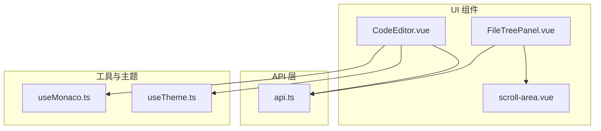
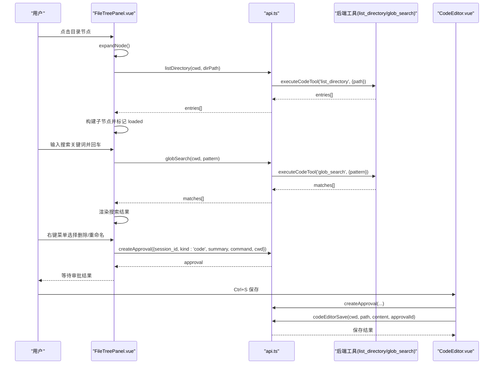
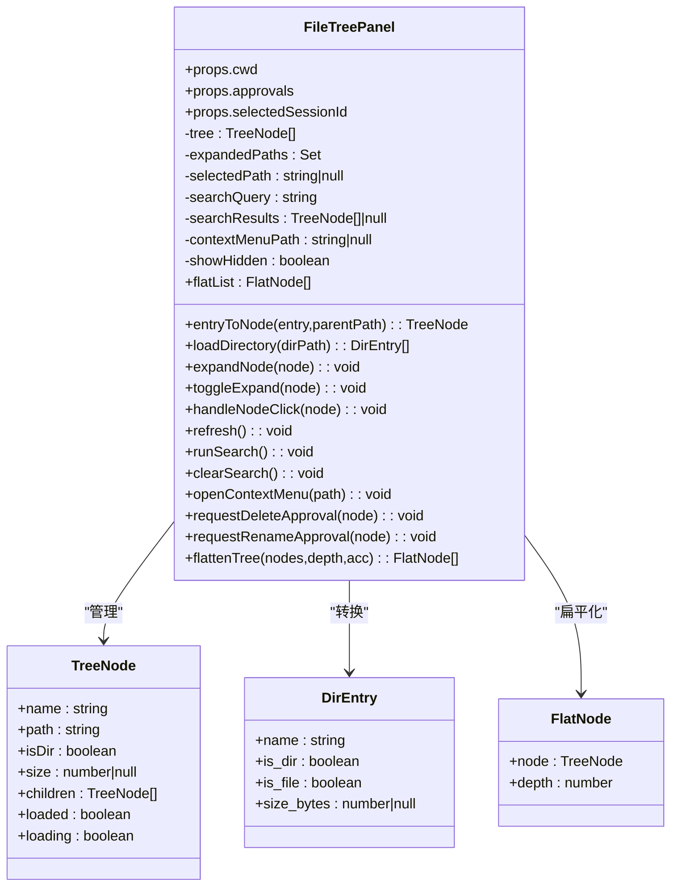
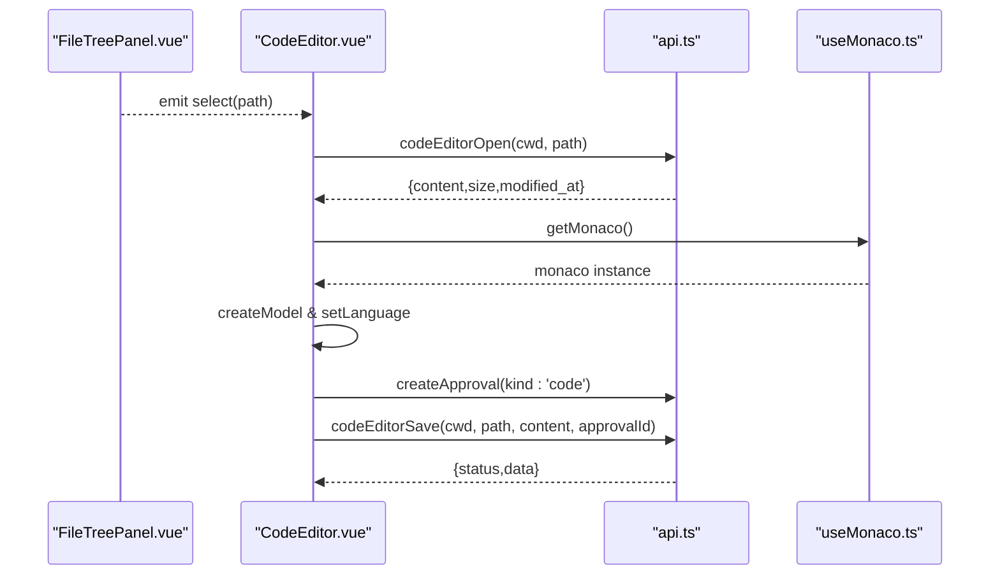
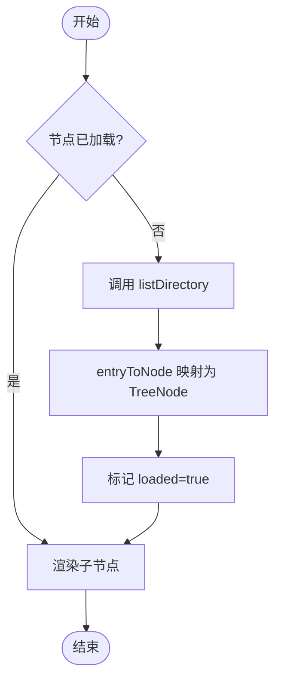
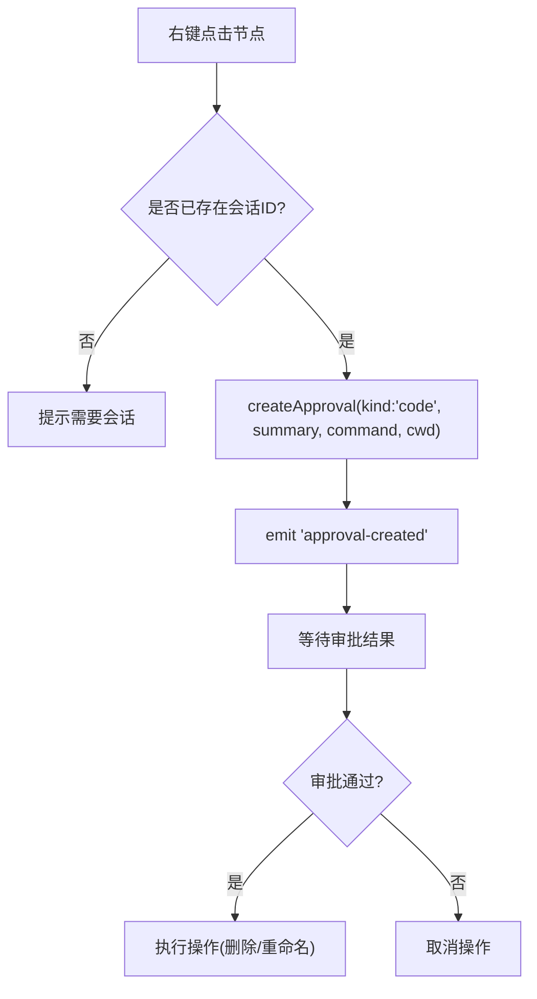
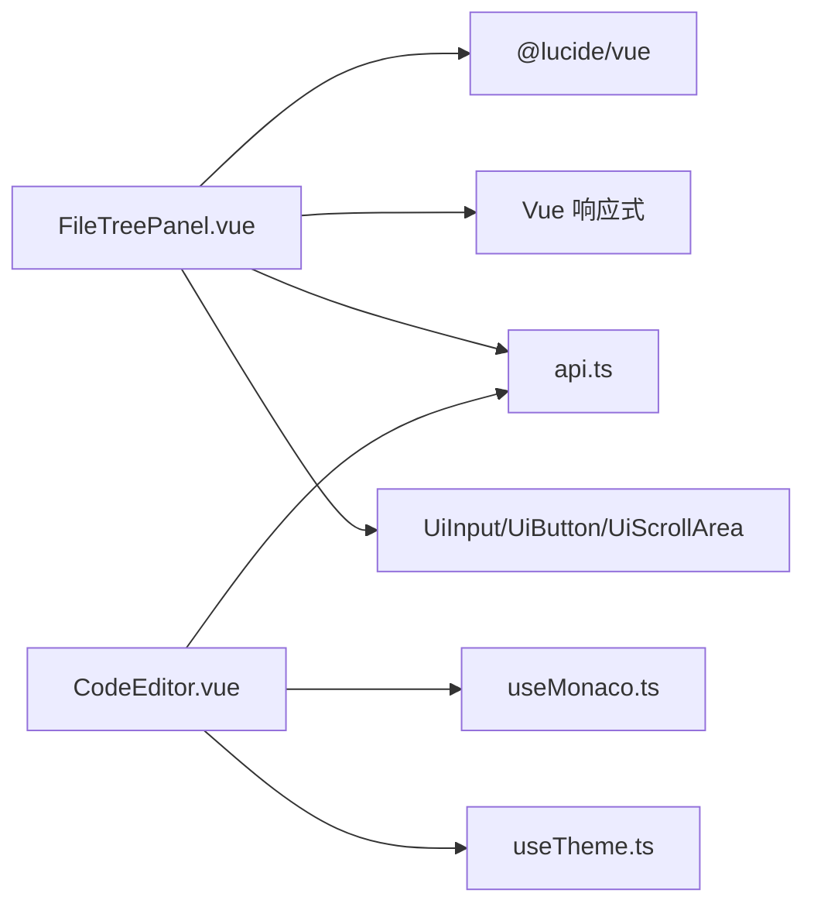

# 文件树面板

<cite>
**本文引用的文件**   
- [FileTreePanel.vue](file://apps/desktop/src/components/code/FileTreePanel.vue)
- [CodeEditor.vue](file://apps/desktop/src/components/code/CodeEditor.vue)
- [api.ts](file://apps/desktop/src/api.ts)
- [useMonaco.ts](file://apps/desktop/src/composables/useMonaco.ts)
- [scroll-area.vue](file://apps/desktop/src/components/ui/scroll-area.vue)
- [useTheme.ts](file://apps/desktop/src/composables/useTheme.ts)
</cite>

## 目录
1. [简介](#简介)
2. [项目结构](#项目结构)
3. [核心组件](#核心组件)
4. [架构总览](#架构总览)
5. [详细组件分析](#详细组件分析)
6. [依赖分析](#依赖分析)
7. [性能考虑](#性能考虑)
8. [故障排查指南](#故障排查指南)
9. [结论](#结论)
10. [附录](#附录)

## 简介
本文件为 FileTreePanel 组件的完整技术文档，覆盖以下能力与集成点：
- 文件树的渲染逻辑、目录结构解析与懒加载展开
- 文件过滤（隐藏项开关）与基于 glob 的搜索
- 节点展开/折叠、文件选择、右键菜单与批量操作（重命名/删除审批流）
- 文件系统监控与实时更新（通过事件订阅与刷新机制）
- 与代码编辑器的集成：双击打开文件、保存审批流、主题适配
- 自定义图标、主题适配与键盘导航支持建议

## 项目结构
FileTreePanel 位于桌面应用前端代码中，属于“代码”相关组件集合，与 API 层、编辑器与主题系统协作。

图表来源
- [FileTreePanel.vue:1-120](file://apps/desktop/src/components/code/FileTreePanel.vue#L1-L120)
- [CodeEditor.vue:1-120](file://apps/desktop/src/components/code/CodeEditor.vue#L1-L120)
- [api.ts:1170-1195](file://apps/desktop/src/api.ts#L1170-L1195)
- [useMonaco.ts:1-68](file://apps/desktop/src/composables/useMonaco.ts#L1-L68)
- [scroll-area.vue:1-18](file://apps/desktop/src/components/ui/scroll-area.vue#L1-L18)
- [useTheme.ts:194-215](file://apps/desktop/src/composables/useTheme.ts#L194-L215)

章节来源
- [FileTreePanel.vue:1-120](file://apps/desktop/src/components/code/FileTreePanel.vue#L1-L120)
- [api.ts:1170-1195](file://apps/desktop/src/api.ts#L1170-L1195)

## 核心组件
- FileTreePanel.vue：实现文件树展示、目录懒加载、搜索、选中状态、上下文菜单与删除/重命名审批请求。
- CodeEditor.vue：基于 Monaco 的代码编辑器，负责文件读取、保存审批流、撤销/重做、格式化等。
- api.ts：封装对后端工具的调用（list_directory、glob_search、code_editor 等）。
- useMonaco.ts：Monaco 初始化、语言检测与主题切换。
- scroll-area.vue：滚动容器，用于文件树列表的滚动区域。
- useTheme.ts：主题与强调色管理，影响编辑器与 UI 表现。

章节来源
- [FileTreePanel.vue:1-120](file://apps/desktop/src/components/code/FileTreePanel.vue#L1-L120)
- [CodeEditor.vue:1-120](file://apps/desktop/src/components/code/CodeEditor.vue#L1-L120)
- [api.ts:1170-1195](file://apps/desktop/src/api.ts#L1170-L1195)
- [useMonaco.ts:1-68](file://apps/desktop/src/composables/useMonaco.ts#L1-L68)
- [scroll-area.vue:1-18](file://apps/desktop/src/components/ui/scroll-area.vue#L1-L18)
- [useTheme.ts:194-215](file://apps/desktop/src/composables/useTheme.ts#L194-L215)

## 架构总览
FileTreePanel 通过 API 层调用后端工具进行目录枚举与搜索；用户交互触发节点展开/折叠、选择与上下文菜单；删除/重命名通过审批流程驱动；编辑器通过 code_editor 工具完成打开与保存。

图表来源
- [FileTreePanel.vue:79-110](file://apps/desktop/src/components/code/FileTreePanel.vue#L79-L110)
- [FileTreePanel.vue:142-167](file://apps/desktop/src/components/code/FileTreePanel.vue#L142-L167)
- [FileTreePanel.vue:199-237](file://apps/desktop/src/components/code/FileTreePanel.vue#L199-L237)
- [api.ts:1177-1192](file://apps/desktop/src/api.ts#L1177-L1192)
- [CodeEditor.vue:122-174](file://apps/desktop/src/components/code/CodeEditor.vue#L122-L174)

## 详细组件分析

### FileTreePanel 组件
- 数据模型
  - DirEntry：目录条目（名称、是否目录/文件、大小等）
  - TreeNode：树节点（路径、是否目录、大小、子节点、加载状态）
  - FlatNode：扁平化后的节点（含深度），用于渲染列表
- 关键行为
  - 懒加载：首次展开目录时调用 listDirectory，缓存 children 并标记 loaded
  - 搜索：globSearch 返回匹配项，直接映射为 TreeNode 列表
  - 选择：点击文件节点设置 selectedPath 并触发 select 事件
  - 上下文菜单：提供“打开”“重命名(审批)”“删除(审批)”选项
  - 隐藏项过滤：showHidden 控制是否显示以 . 开头的隐藏项
- 渲染策略
  - 使用 computed flatList 将树扁平化为可滚动的行列表
  - 根据 isExpanded 与 node.isDir 决定箭头与文件夹图标
  - 文件大小按 B/KB/MB 格式化显示
- 事件与通信
  - 向父级 emit select(path) 与 approval-created(approval)
  - 通过 api.createApproval 发起删除/重命名审批

图表来源
- [FileTreePanel.vue:21-41](file://apps/desktop/src/components/code/FileTreePanel.vue#L21-L41)
- [FileTreePanel.vue:66-98](file://apps/desktop/src/components/code/FileTreePanel.vue#L66-L98)
- [FileTreePanel.vue:239-254](file://apps/desktop/src/components/code/FileTreePanel.vue#L239-L254)

章节来源
- [FileTreePanel.vue:66-110](file://apps/desktop/src/components/code/FileTreePanel.vue#L66-L110)
- [FileTreePanel.vue:124-167](file://apps/desktop/src/components/code/FileTreePanel.vue#L124-L167)
- [FileTreePanel.vue:191-237](file://apps/desktop/src/components/code/FileTreePanel.vue#L191-L237)
- [FileTreePanel.vue:239-259](file://apps/desktop/src/components/code/FileTreePanel.vue#L239-L259)

### 与代码编辑器的集成
- 打开文件：FileTreePanel 触发 select(path)，由父级或路由切换到 CodeEditor.vue，后者调用 codeEditorOpen 获取内容并渲染 Monaco 编辑器
- 保存文件：CodeEditor 在修改后通过 createApproval 发起保存审批，待批准后调用 codeEditorSave 提交变更
- 主题适配：useMonaco 监听主题变化并切换编辑器主题；useTheme 管理全局主题与强调色
- 语言检测：根据文件扩展名自动设置 Monaco 语言

图表来源
- [CodeEditor.vue:56-76](file://apps/desktop/src/components/code/CodeEditor.vue#L56-L76)
- [CodeEditor.vue:122-174](file://apps/desktop/src/components/code/CodeEditor.vue#L122-L174)
- [api.ts:1185-1192](file://apps/desktop/src/api.ts#L1185-L1192)
- [useMonaco.ts:29-68](file://apps/desktop/src/composables/useMonaco.ts#L29-L68)

章节来源
- [CodeEditor.vue:56-76](file://apps/desktop/src/components/code/CodeEditor.vue#L56-L76)
- [CodeEditor.vue:122-174](file://apps/desktop/src/components/code/CodeEditor.vue#L122-L174)
- [api.ts:1185-1192](file://apps/desktop/src/api.ts#L1185-L1192)
- [useMonaco.ts:29-68](file://apps/desktop/src/composables/useMonaco.ts#L29-L68)

### 目录结构与搜索算法
- 目录解析：entryToNode 将 DirEntry 转换为 TreeNode，维护 path 与 size
- 懒加载：expandNode 仅在未加载且非加载中时请求目录内容，避免重复 IO
- 搜索算法：globSearch 返回匹配路径，组件将其映射为 TreeNode 列表并扁平渲染

图表来源
- [FileTreePanel.vue:66-98](file://apps/desktop/src/components/code/FileTreePanel.vue#L66-L98)
- [FileTreePanel.vue:142-167](file://apps/desktop/src/components/code/FileTreePanel.vue#L142-L167)

章节来源
- [FileTreePanel.vue:66-98](file://apps/desktop/src/components/code/FileTreePanel.vue#L66-L98)
- [FileTreePanel.vue:142-167](file://apps/desktop/src/components/code/FileTreePanel.vue#L142-L167)

### 右键菜单与批量操作
- 右键菜单：hover 显示更多按钮，点击弹出菜单，包含“打开”“重命名(审批)”“删除(审批)”
- 审批流：删除/重命名均通过 createApproval 创建审批，emit 给父级处理后续动作
- 关闭菜单：点击其他位置或选择操作后关闭

图表来源
- [FileTreePanel.vue:191-237](file://apps/desktop/src/components/code/FileTreePanel.vue#L191-L237)

章节来源
- [FileTreePanel.vue:191-237](file://apps/desktop/src/components/code/FileTreePanel.vue#L191-L237)

### 文件系统监控与实时更新
- 当前实现：通过手动刷新按钮与 watch(cwd) 触发 refresh；搜索与展开按需加载
- 实时性建议：结合事件订阅（如 approval 状态变更）与外部文件变更事件，可在必要时调用 refresh 更新树

章节来源
- [FileTreePanel.vue:256-259](file://apps/desktop/src/components/code/FileTreePanel.vue#L256-L259)
- [api.ts:1310-1328](file://apps/desktop/src/api.ts#L1310-L1328)

### 自定义图标与主题适配
- 图标策略：根据 isDir 与扩展名选择不同 Lucide 图标（文件夹、代码文件、文本文件等）
- 主题适配：useMonaco 动态切换编辑器主题；useTheme 管理全局主题与强调色变量

章节来源
- [FileTreePanel.vue:174-182](file://apps/desktop/src/components/code/FileTreePanel.vue#L174-L182)
- [useMonaco.ts:29-68](file://apps/desktop/src/composables/useMonaco.ts#L29-L68)
- [useTheme.ts:194-215](file://apps/desktop/src/composables/useTheme.ts#L194-L215)

### 键盘导航支持（建议）
- 当前实现：主要依赖鼠标点击与 Enter 触发搜索
- 建议增强：
  - 上下键移动焦点、Enter 选择/展开、Space 展开/折叠
  - Escape 关闭上下文菜单
  - Cmd/Ctrl+F 聚焦搜索框
  - Tab 在搜索框与列表间切换

[本节为通用建议，不直接分析具体文件]

## 依赖分析
- FileTreePanel 依赖：
  - @lucide/vue 图标库
  - Vue 响应式 API（ref、computed、watch）
  - api.ts 中的 listDirectory、globSearch、createApproval
  - UiInput、UiButton、UiScrollArea 等 UI 组件
- CodeEditor 依赖：
  - Monaco Editor（useMonaco）
  - api.ts 中的 codeEditorOpen、codeEditorSave、createApproval
  - useTheme 主题系统

图表来源
- [FileTreePanel.vue:1-20](file://apps/desktop/src/components/code/FileTreePanel.vue#L1-L20)
- [CodeEditor.vue:1-20](file://apps/desktop/src/components/code/CodeEditor.vue#L1-L20)
- [api.ts:1170-1195](file://apps/desktop/src/api.ts#L1170-L1195)
- [useMonaco.ts:1-25](file://apps/desktop/src/composables/useMonaco.ts#L1-L25)
- [useTheme.ts:194-215](file://apps/desktop/src/composables/useTheme.ts#L194-L215)

章节来源
- [FileTreePanel.vue:1-20](file://apps/desktop/src/components/code/FileTreePanel.vue#L1-L20)
- [CodeEditor.vue:1-20](file://apps/desktop/src/components/code/CodeEditor.vue#L1-L20)
- [api.ts:1170-1195](file://apps/desktop/src/api.ts#L1170-L1195)

## 性能考虑
- 懒加载与缓存：目录仅首次展开时加载，避免一次性遍历大目录
- 扁平化渲染：flatList 计算属性减少模板复杂度，提升滚动性能
- 搜索优化：globSearch 在后端执行，前端仅渲染结果集
- 滚动区域：使用 UiScrollArea 包裹列表，避免长列表导致主线程阻塞
- 编辑器资源：Monaco 按需加载，主题切换避免重建实例

章节来源
- [FileTreePanel.vue:249-254](file://apps/desktop/src/components/code/FileTreePanel.vue#L249-L254)
- [scroll-area.vue:1-18](file://apps/desktop/src/components/ui/scroll-area.vue#L1-L18)
- [useMonaco.ts:48-68](file://apps/desktop/src/composables/useMonaco.ts#L48-L68)

## 故障排查指南
- 目录加载失败：检查 cwd 与 dirPath 是否正确，查看 notify.error 的 key 定位错误来源
- 搜索无结果：确认 glob 模式语法，检查后端 glob_search 工具可用性
- 审批失败：确保 selectedSessionId 有效，查看 createApproval 返回与事件流
- 编辑器无法打开：验证 codeEditorOpen 参数与权限，检查 Monaco 初始化日志

章节来源
- [FileTreePanel.vue:93-98](file://apps/desktop/src/components/code/FileTreePanel.vue#L93-L98)
- [FileTreePanel.vue:162-167](file://apps/desktop/src/components/code/FileTreePanel.vue#L162-L167)
- [CodeEditor.vue:71-76](file://apps/desktop/src/components/code/CodeEditor.vue#L71-L76)
- [CodeEditor.vue:143-148](file://apps/desktop/src/components/code/CodeEditor.vue#L143-L148)

## 结论
FileTreePanel 提供了高效、可扩展的文件树能力，结合懒加载、搜索与审批流，满足开发场景下的文件浏览与操作需求。与 CodeEditor 的紧密集成实现了从浏览到编辑的无缝体验。通过主题系统与 Monaco 的动态配置，保证了良好的视觉一致性与用户体验。

## 附录
- 常用 API 路径参考：
  - listDirectory：api.ts 中封装 list_directory 工具
  - globSearch：api.ts 中封装 glob_search 工具
  - codeEditorOpen/Save：api.ts 中封装 code_editor 工具
- 事件订阅：api.connectEvents 可用于监听审批状态变更，驱动 UI 更新

章节来源
- [api.ts:1177-1192](file://apps/desktop/src/api.ts#L1177-L1192)
- [api.ts:1310-1328](file://apps/desktop/src/api.ts#L1310-L1328)