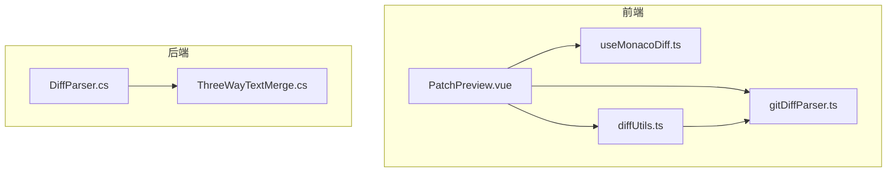
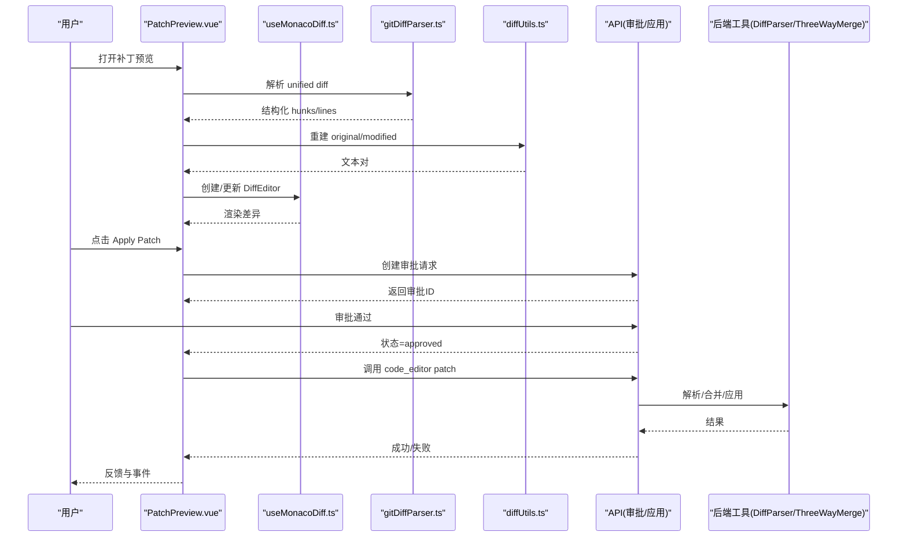
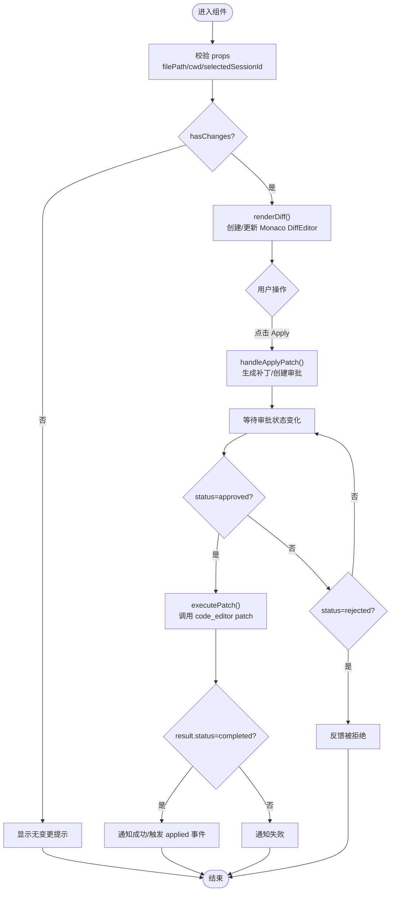
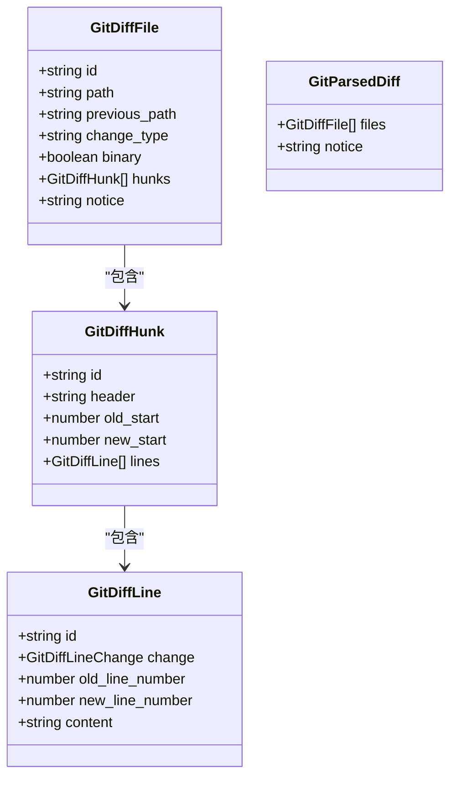
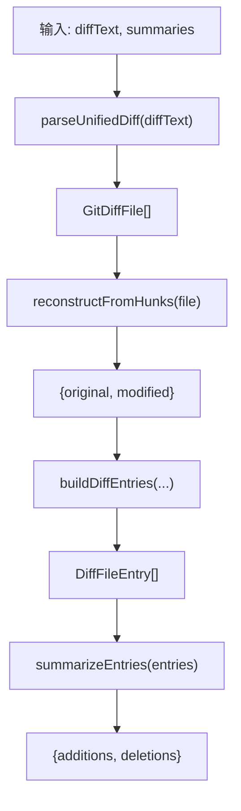
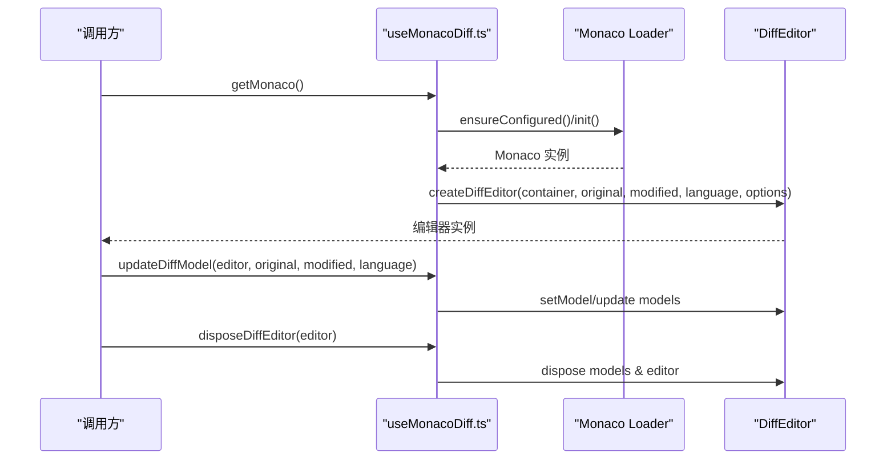
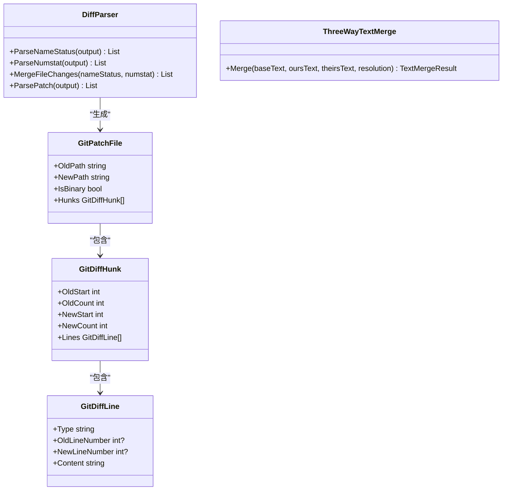
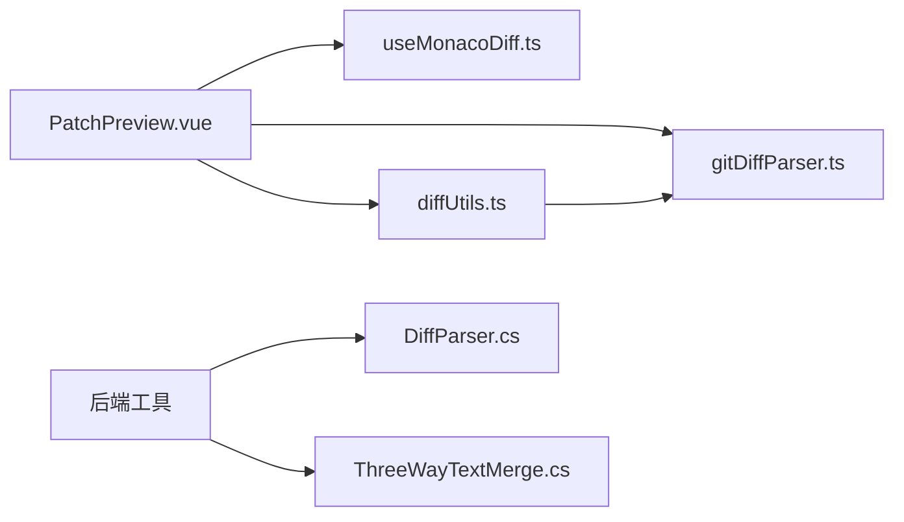

# 补丁预览系统

<cite>
**本文引用的文件**
- [PatchPreview.vue](file://apps/desktop/src/components/code/PatchPreview.vue)
- [gitDiffParser.ts](file://apps/desktop/src/gitDiffParser.ts)
- [diffUtils.ts](file://apps/desktop/src/components/git/diffUtils.ts)
- [useMonacoDiff.ts](file://apps/desktop/src/composables/useMonacoDiff.ts)
- [DiffParser.cs](file://TinadecTools/Tools/Git/DiffParser.cs)
- [ThreeWayTextMerge.cs](file://TinadecTools/Tools/Git/ThreeWayTextMerge.cs)
</cite>

## 目录
1. [简介](#简介)
2. [项目结构](#项目结构)
3. [核心组件](#核心组件)
4. [架构总览](#架构总览)
5. [详细组件分析](#详细组件分析)
6. [依赖关系分析](#依赖关系分析)
7. [性能考量](#性能考量)
8. [故障排查指南](#故障排查指南)
9. [结论](#结论)
10. [附录](#附录)

## 简介
本文件为 PatchPreview 组件的全面功能文档，聚焦 Git 差异数据的解析、渲染与交互。内容涵盖：
- 新增、修改、删除行的可视化展示（行号显示、颜色标记、缩进保持）
- 差异对比算法与合并冲突处理
- 批量操作能力
- 搜索过滤、行跳转、注释查看与导出
- 与 Git 工作流的集成（暂存、提交、推送）

该组件基于 Monaco Editor 的 DiffEditor 实现侧边对比视图，结合统一 diff 解析与前端重构逻辑，提供直观、可交互的补丁预览体验。后端工具提供统一的 diff 解析与三路文本合并能力，支撑复杂场景下的冲突解决。

## 项目结构
PatchPreview 相关代码主要分布在以下位置：
- 前端组件与组合式函数：apps/desktop/src/components/code/PatchPreview.vue、apps/desktop/src/composables/useMonacoDiff.ts
- 差异数据解析与构建：apps/desktop/src/gitDiffParser.ts、apps/desktop/src/components/git/diffUtils.ts
- 后端差异解析与三路合并：TinadecTools/Tools/Git/DiffParser.cs、TinadecTools/Tools/Git/ThreeWayTextMerge.cs

图表来源
- [PatchPreview.vue:1-262](file://apps/desktop/src/components/code/PatchPreview.vue#L1-L262)
- [useMonacoDiff.ts:1-127](file://apps/desktop/src/composables/useMonacoDiff.ts#L1-L127)
- [gitDiffParser.ts:1-178](file://apps/desktop/src/gitDiffParser.ts#L1-L178)
- [diffUtils.ts:1-164](file://apps/desktop/src/components/git/diffUtils.ts#L1-L164)
- [DiffParser.cs:1-316](file://TinadecTools/Tools/Git/DiffParser.cs#L1-L316)
- [ThreeWayTextMerge.cs:1-143](file://TinadecTools/Tools/Git/ThreeWayTextMerge.cs#L1-L143)

章节来源
- [PatchPreview.vue:1-262](file://apps/desktop/src/components/code/PatchPreview.vue#L1-L262)
- [gitDiffParser.ts:1-178](file://apps/desktop/src/gitDiffParser.ts#L1-L178)
- [diffUtils.ts:1-164](file://apps/desktop/src/components/git/diffUtils.ts#L1-L164)
- [useMonacoDiff.ts:1-127](file://apps/desktop/src/composables/useMonacoDiff.ts#L1-L127)
- [DiffParser.cs:1-316](file://TinadecTools/Tools/Git/DiffParser.cs#L1-L316)
- [ThreeWayTextMerge.cs:1-143](file://TinadecTools/Tools/Git/ThreeWayTextMerge.cs#L1-L143)

## 核心组件
- PatchPreview.vue：负责差异内容的渲染、应用补丁流程、审批流触发与状态反馈。使用 Monaco DiffEditor 进行左右对比展示，支持语言检测、主题跟随、资源清理。
- gitDiffParser.ts：解析 unified diff 文本，输出结构化文件、hunk、行级变更（context/add/delete），并维护旧/新行号。
- diffUtils.ts：将解析结果重建为近似 original/modified 文本，供 DiffEditor 渲染；同时提供语言检测、摘要统计等工具。
- useMonacoDiff.ts：封装 Monaco DiffEditor 的创建、更新、销毁与主题切换，确保编辑器实例复用与内存安全。
- DiffParser.cs：后端统一 diff/name-status/numstat 解析，生成 GitFileChange/GitPatchFile 等模型，便于上层工具消费。
- ThreeWayTextMerge.cs：三路文本合并算法，支持冲突标记与多种解决策略（ours/theirs/both/markers）。

章节来源
- [PatchPreview.vue:1-262](file://apps/desktop/src/components/code/PatchPreview.vue#L1-L262)
- [gitDiffParser.ts:1-178](file://apps/desktop/src/gitDiffParser.ts#L1-L178)
- [diffUtils.ts:1-164](file://apps/desktop/src/components/git/diffUtils.ts#L1-L164)
- [useMonacoDiff.ts:1-127](file://apps/desktop/src/composables/useMonacoDiff.ts#L1-L127)
- [DiffParser.cs:1-316](file://TinadecTools/Tools/Git/DiffParser.cs#L1-L316)
- [ThreeWayTextMerge.cs:1-143](file://TinadecTools/Tools/Git/ThreeWayTextMerge.cs#L1-L143)

## 架构总览
PatchPreview 的数据流与交互流程如下：
- 输入：originalContent、modifiedContent、filePath、cwd、selectedSessionId、approvals
- 解析与重建：通过 gitDiffParser.ts 解析 unified diff，再由 diffUtils.ts 重建 original/modified 文本
- 渲染：useMonacoDiff.ts 创建/更新 Monaco DiffEditor，按语言与主题渲染差异
- 交互：用户点击“Apply Patch”，触发审批流程；审批通过后执行 code_editor patch 命令应用补丁
- 后端：DiffParser.cs 解析 diff，ThreeWayTextMerge.cs 处理三路合并与冲突

图表来源
- [PatchPreview.vue:133-198](file://apps/desktop/src/components/code/PatchPreview.vue#L133-L198)
- [gitDiffParser.ts:36-156](file://apps/desktop/src/gitDiffParser.ts#L36-L156)
- [diffUtils.ts:95-153](file://apps/desktop/src/components/git/diffUtils.ts#L95-L153)
- [useMonacoDiff.ts:65-126](file://apps/desktop/src/composables/useMonacoDiff.ts#L65-L126)
- [DiffParser.cs:144-259](file://TinadecTools/Tools/Git/DiffParser.cs#L144-L259)
- [ThreeWayTextMerge.cs:16-89](file://TinadecTools/Tools/Git/ThreeWayTextMerge.cs#L16-L89)

## 详细组件分析

### PatchPreview.vue 组件分析
职责与特性：
- 接收 props：cwd、filePath、originalContent、modifiedContent、selectedSessionId、approvals
- 计算属性：language（语言检测）、hasChanges（是否有差异）、pendingApproval（待处理审批）
- 生成补丁字符串：generatePatch() 基于简单逐行比较与上下文行生成类 Codex 风格的补丁
- 渲染差异：renderDiff() 使用 Monaco DiffEditor 创建/更新模型，自动布局与主题跟随
- 应用补丁：handleApplyPatch() 创建审批请求，等待审批通过；executePatch() 在审批通过后调用 API 应用补丁
- 生命周期：onBeforeUnmount 释放编辑器与模型，避免内存泄漏
- 模板：顶部工具栏（标题、按钮）、反馈区、加载提示、差异容器

图表来源
- [PatchPreview.vue:47-103](file://apps/desktop/src/components/code/PatchPreview.vue#L47-L103)
- [PatchPreview.vue:105-131](file://apps/desktop/src/components/code/PatchPreview.vue#L105-L131)
- [PatchPreview.vue:133-198](file://apps/desktop/src/components/code/PatchPreview.vue#L133-L198)

章节来源
- [PatchPreview.vue:1-262](file://apps/desktop/src/components/code/PatchPreview.vue#L1-L262)

### gitDiffParser.ts 解析器分析
数据结构：
- GitDiffLine：id、change（context/add/delete）、old_line_number、new_line_number、content
- GitDiffHunk：id、header、old_start、new_start、lines
- GitDiffFile：id、path、previous_path、change_type、binary、hunks、notice
- GitParsedDiff：files、notice

算法要点：
- 逐行扫描 unified diff，识别 diff --git、--- /+++、@@ 头、二进制标志
- 根据前缀 + - 空格 区分 add/delete/context，维护 old/new 行号
- 输出结构化对象，便于后续重建 original/modified 文本

图表来源
- [gitDiffParser.ts:1-33](file://apps/desktop/src/gitDiffParser.ts#L1-L33)
- [gitDiffParser.ts:36-156](file://apps/desktop/src/gitDiffParser.ts#L36-L156)

章节来源
- [gitDiffParser.ts:1-178](file://apps/desktop/src/gitDiffParser.ts#L1-L178)

### diffUtils.ts 工具分析
功能：
- detectLanguage(filePath)：根据扩展名映射到 Monaco 语言标识
- reconstructFromHunks(file)：从 hunks 重建 original/modified 文本（仅变更区域+上下文）
- buildDiffEntries(diffText, summaries)：将 unified diff 与可选摘要合并为 DiffFileEntry[]，填充 additions/deletions/binary/truncated/changeType
- summarizeEntries(entries)：汇总所有文件的增删行数

图表来源
- [diffUtils.ts:79-88](file://apps/desktop/src/components/git/diffUtils.ts#L79-L88)
- [diffUtils.ts:95-111](file://apps/desktop/src/components/git/diffUtils.ts#L95-L111)
- [diffUtils.ts:118-153](file://apps/desktop/src/components/git/diffUtils.ts#L118-L153)
- [diffUtils.ts:155-163](file://apps/desktop/src/components/git/diffUtils.ts#L155-L163)

章节来源
- [diffUtils.ts:1-164](file://apps/desktop/src/components/git/diffUtils.ts#L1-L164)

### useMonacoDiff.ts 编辑器封装分析
功能：
- ensureConfigured/getMonaco：懒加载 Monaco 实例，配置 loader，设置主题
- createDiffEditor：创建 DiffEditor，设置只读、侧边对比、自动布局、字体大小、行号列宽等
- updateDiffModel：更新 original/modified 模型与语言
- disposeDiffEditor：安全释放模型与编辑器实例
- 主题监听：随系统/手动主题切换动态更新编辑器主题

图表来源
- [useMonacoDiff.ts:16-50](file://apps/desktop/src/composables/useMonacoDiff.ts#L16-L50)
- [useMonacoDiff.ts:65-126](file://apps/desktop/src/composables/useMonacoDiff.ts#L65-L126)

章节来源
- [useMonacoDiff.ts:1-127](file://apps/desktop/src/composables/useMonacoDiff.ts#L1-L127)

### 后端 DiffParser.cs 与 ThreeWayTextMerge.cs
- DiffParser.cs：解析 name-status、numstat、unified diff，输出 GitFileChange/GitPatchFile 等模型，支持路径剥离、范围解析、二进制标记
- ThreeWayTextMerge.cs：三路文本合并，基于 LCS 计算变更，支持冲突标记与多种解决策略（markers/ours/theirs/both），返回合并结果与冲突列表

图表来源
- [DiffParser.cs:144-259](file://TinadecTools/Tools/Git/DiffParser.cs#L144-L259)
- [ThreeWayTextMerge.cs:16-89](file://TinadecTools/Tools/Git/ThreeWayTextMerge.cs#L16-L89)

章节来源
- [DiffParser.cs:1-316](file://TinadecTools/Tools/Git/DiffParser.cs#L1-L316)
- [ThreeWayTextMerge.cs:1-143](file://TinadecTools/Tools/Git/ThreeWayTextMerge.cs#L1-L143)

## 依赖关系分析
- PatchPreview.vue 依赖 useMonacoDiff.ts（编辑器封装）、gitDiffParser.ts（差异解析）、diffUtils.ts（文本重建与工具）
- diffUtils.ts 依赖 gitDiffParser.ts
- 后端 DiffParser.cs 与 ThreeWayTextMerge.cs 独立提供解析与合并能力，供上层工具调用

图表来源
- [PatchPreview.vue:1-262](file://apps/desktop/src/components/code/PatchPreview.vue#L1-L262)
- [diffUtils.ts:1-164](file://apps/desktop/src/components/git/diffUtils.ts#L1-L164)
- [gitDiffParser.ts:1-178](file://apps/desktop/src/gitDiffParser.ts#L1-L178)
- [useMonacoDiff.ts:1-127](file://apps/desktop/src/composables/useMonacoDiff.ts#L1-L127)
- [DiffParser.cs:1-316](file://TinadecTools/Tools/Git/DiffParser.cs#L1-L316)
- [ThreeWayTextMerge.cs:1-143](file://TinadecTools/Tools/Git/ThreeWayTextMerge.cs#L1-L143)

章节来源
- [PatchPreview.vue:1-262](file://apps/desktop/src/components/code/PatchPreview.vue#L1-L262)
- [diffUtils.ts:1-164](file://apps/desktop/src/components/git/diffUtils.ts#L1-L164)
- [gitDiffParser.ts:1-178](file://apps/desktop/src/gitDiffParser.ts#L1-L178)
- [useMonacoDiff.ts:1-127](file://apps/desktop/src/composables/useMonacoDiff.ts#L1-L127)
- [DiffParser.cs:1-316](file://TinadecTools/Tools/Git/DiffParser.cs#L1-L316)
- [ThreeWayTextMerge.cs:1-143](file://TinadecTools/Tools/Git/ThreeWayTextMerge.cs#L1-L143)

## 性能考量
- Monaco DiffEditor 初始化与模型创建：仅在必要时创建/更新模型，避免重复分配；组件卸载时释放资源
- 大文件差异：reconstructFromHunks 仅重建变更区域与上下文，减少内存占用；后端 LCS 计算限制最大单元格数，防止 OOM
- 主题切换：监听主题变化，动态更新编辑器主题，避免全量重建
- 批处理：buildDiffEntries 支持多文件摘要聚合，减少多次解析开销

[本节为通用指导，不直接分析具体文件]

## 故障排查指南
常见问题与定位：
- 无差异显示：检查 hasChanges 计算与 original/modified 文本是否一致；确认 renderDiff 已调用且容器存在
- 语言高亮异常：确认 detectLanguage 映射正确，Monaco 语言包已加载
- 审批流程失败：检查 selectedSessionId 是否存在；确认 API 返回的审批状态变化；查看 notify 错误信息
- 应用补丁失败：检查 code_editor patch 返回值与 summary；确认 pendingPatch 与 filePath 有效
- 内存泄漏：确保 onBeforeUnmount 中 dispose 编辑器与模型；避免重复创建实例

章节来源
- [PatchPreview.vue:133-198](file://apps/desktop/src/components/code/PatchPreview.vue#L133-L198)
- [useMonacoDiff.ts:112-126](file://apps/desktop/src/composables/useMonacoDiff.ts#L112-L126)

## 结论
PatchPreview 组件通过前端 Monaco DiffEditor 与 unified diff 解析，提供了直观、可交互的补丁预览能力。结合后端 DiffParser 与三路合并算法，能够处理复杂的差异与冲突场景。建议在生产环境中完善搜索过滤、行跳转、注释查看与导出功能，并强化与 Git 工作流（暂存、提交、推送）的集成，以提升开发者效率与一致性。

[本节为总结性内容，不直接分析具体文件]

## 附录
- 新增、修改、删除行的可视化：Monaco DiffEditor 默认以颜色与行号区分变更，缩进由语言模式保持
- 差异对比算法：前端基于 unified diff 解析，后端基于 LCS 三路合并
- 合并冲突处理：支持 markers/ours/theirs/both 策略，返回冲突区间与三方文本
- 批量操作：buildDiffEntries 支持多文件摘要聚合，便于批量预览与统计
- 搜索过滤、行跳转、注释查看、导出：可在现有基础上扩展 Monaco 插件或自定义 UI 控件实现
- Git 工作流集成：通过 API 调用 code_editor patch、commit、push 等工具，结合审批流保障安全性

[本节为概念性说明，不直接分析具体文件]