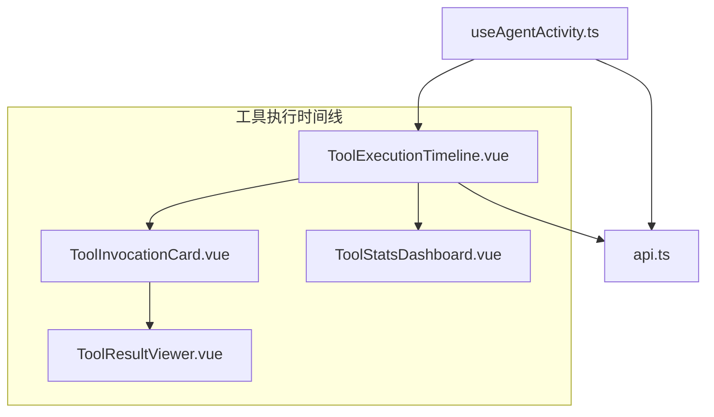
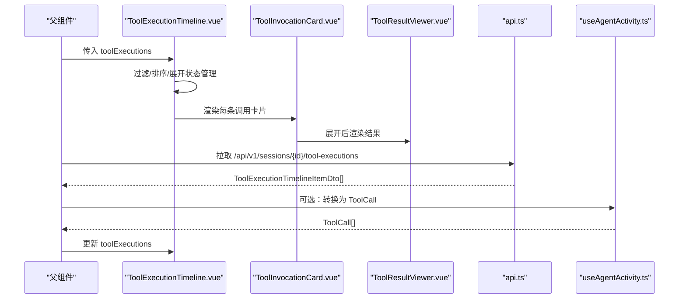
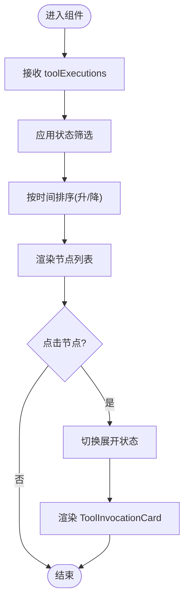
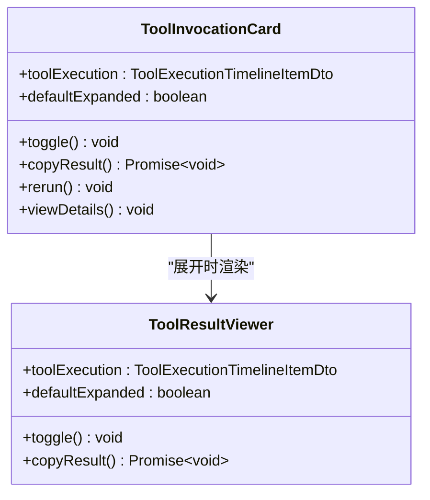
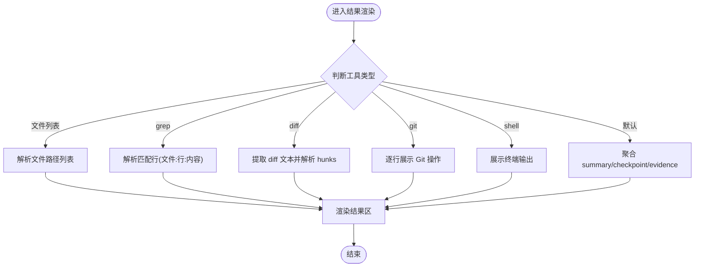
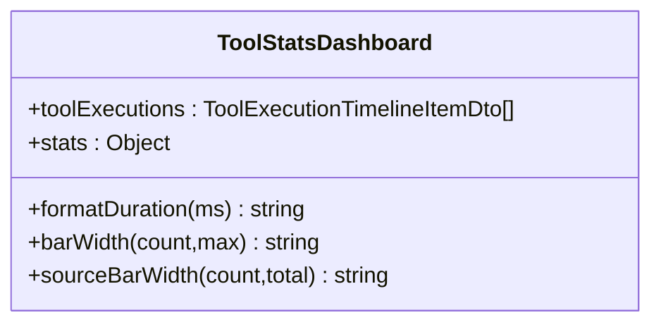
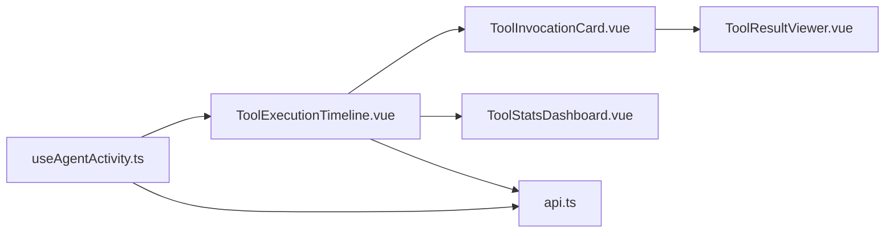

# 工具执行时间线

<cite>
**本文引用的文件**   
- [ToolExecutionTimeline.vue](file://apps/desktop/src/components/tools/ToolExecutionTimeline.vue)
- [ToolInvocationCard.vue](file://apps/desktop/src/components/tools/ToolInvocationCard.vue)
- [ToolResultViewer.vue](file://apps/desktop/src/components/tools/ToolResultViewer.vue)
- [ToolStatsDashboard.vue](file://apps/desktop/src/components/tools/ToolStatsDashboard.vue)
- [api.ts](file://apps/desktop/src/api.ts)
- [useAgentActivity.ts](file://apps/desktop/src/composables/useAgentActivity.ts)
</cite>

## 目录
1. [简介](#简介)
2. [项目结构](#项目结构)
3. [核心组件](#核心组件)
4. [架构总览](#架构总览)
5. [详细组件分析](#详细组件分析)
6. [依赖关系分析](#依赖关系分析)
7. [性能与大数据优化](#性能与大数据优化)
8. [故障排查指南](#故障排查指南)
9. [结论](#结论)
10. [附录：数据模型与接口](#附录数据模型与接口)

## 简介
本文件为“工具执行时间线”组件的完整技术文档，面向开发者与使用者，系统阐述以下能力：
- 工具调用的时序展示、依赖关系可视化与执行流程追踪
- 时间线的数据绑定、动画效果与交互操作（筛选、排序、展开详情）
- 长时间运行任务监控、性能指标展示与异常标记
- 时间缩放、筛选过滤与详情查看
- 大数据量优化与虚拟滚动实现建议

该组件位于桌面应用前端，基于 Vue 3 构建，通过 API 层获取会话维度的工具执行记录，并以时间线形式呈现。

## 项目结构
与“工具执行时间线”直接相关的代码主要分布在 apps/desktop/src/components/tools 目录下，包含四个核心组件以及类型定义与状态管理相关模块：
- ToolExecutionTimeline.vue：时间线主视图，负责过滤、排序、节点展开与事件派发
- ToolInvocationCard.vue：单条工具调用卡片，支持菜单操作、结果复制与详情展开
- ToolResultViewer.vue：结果渲染器，按工具类型智能解析并展示（文件列表、grep、diff、Git 操作、Shell 输出等）
- ToolStatsDashboard.vue：统计面板，汇总成功率、平均耗时、Top 工具与来源分布
- api.ts：API 类型定义与请求封装，包含 ToolExecutionTimelineItemDto 等
- useAgentActivity.ts：活动状态与工具调用映射逻辑，提供 ToolCall 到 UI 的转换

图表来源
- [ToolExecutionTimeline.vue:1-646](file://apps/desktop/src/components/tools/ToolExecutionTimeline.vue#L1-L646)
- [ToolInvocationCard.vue:1-563](file://apps/desktop/src/components/tools/ToolInvocationCard.vue#L1-L563)
- [ToolResultViewer.vue:1-463](file://apps/desktop/src/components/tools/ToolResultViewer.vue#L1-L463)
- [ToolStatsDashboard.vue:1-648](file://apps/desktop/src/components/tools/ToolStatsDashboard.vue#L1-L648)
- [api.ts:794-816](file://apps/desktop/src/api.ts#L794-L816)
- [useAgentActivity.ts:1-200](file://apps/desktop/src/composables/useAgentActivity.ts#L1-L200)

章节来源
- [ToolExecutionTimeline.vue:1-646](file://apps/desktop/src/components/tools/ToolExecutionTimeline.vue#L1-L646)
- [ToolInvocationCard.vue:1-563](file://apps/desktop/src/components/tools/ToolInvocationCard.vue#L1-L563)
- [ToolResultViewer.vue:1-463](file://apps/desktop/src/components/tools/ToolResultViewer.vue#L1-L463)
- [ToolStatsDashboard.vue:1-648](file://apps/desktop/src/components/tools/ToolStatsDashboard.vue#L1-L648)
- [api.ts:794-816](file://apps/desktop/src/api.ts#L794-L816)
- [useAgentActivity.ts:1-200](file://apps/desktop/src/composables/useAgentActivity.ts#L1-L200)

## 核心组件
- ToolExecutionTimeline.vue
  - 功能：接收 toolExecutions 数组，提供状态筛选（全部/成功/失败/待审批/运行中）、按时间升序或降序排列、节点展开收起、图标与来源样式映射、时长与时间格式化、空态提示
  - 交互：点击节点展开详情；触发 rerun 与 view-details 事件供父组件处理
  - 数据流：props.toolExecutions -> computed(filteredExecutions) -> 模板渲染
- ToolInvocationCard.vue
  - 功能：单条工具调用卡片，显示工具名、ID、来源、状态、耗时、风险等级、审批标识、证据标签、元信息（层、时间、序列号），支持菜单（重跑、查看详情、复制结果）
  - 交互：展开/收起结果区域；复制结果到剪贴板；触发 rerun 与 view-details 事件
- ToolResultViewer.vue
  - 功能：根据工具类型智能渲染结果：文件列表、grep 匹配、统一 diff、Git 操作、Shell 输出；默认聚合 summary/checkpoint_summary/evidence
  - 交互：折叠/展开；一键复制结果文本
- ToolStatsDashboard.vue
  - 功能：统计概览（总数、完成、失败、等待审批、平均耗时、审批通过率）、状态分布条形图、Top 工具、来源分布
  - 计算：对 toolExecutions 进行聚合统计，生成 topTools 与 sourceStats

章节来源
- [ToolExecutionTimeline.vue:1-646](file://apps/desktop/src/components/tools/ToolExecutionTimeline.vue#L1-L646)
- [ToolInvocationCard.vue:1-563](file://apps/desktop/src/components/tools/ToolInvocationCard.vue#L1-L563)
- [ToolResultViewer.vue:1-463](file://apps/desktop/src/components/tools/ToolResultViewer.vue#L1-L463)
- [ToolStatsDashboard.vue:1-648](file://apps/desktop/src/components/tools/ToolStatsDashboard.vue#L1-L648)

## 架构总览
时间线组件采用“数据驱动 + 组件分层”的架构：
- 数据层：api.ts 定义 ToolExecutionTimelineItemDto 等类型，并提供会话维度的工具执行查询方法
- 状态层：useAgentActivity.ts 将后端事件转换为 ToolCall，便于上层 UI 使用
- 表现层：ToolExecutionTimeline.vue 作为容器，组合 ToolInvocationCard.vue 与 ToolResultViewer.vue，同时可接入 ToolStatsDashboard.vue 做统计展示

图表来源
- [ToolExecutionTimeline.vue:1-646](file://apps/desktop/src/components/tools/ToolExecutionTimeline.vue#L1-L646)
- [ToolInvocationCard.vue:1-563](file://apps/desktop/src/components/tools/ToolInvocationCard.vue#L1-L563)
- [ToolResultViewer.vue:1-463](file://apps/desktop/src/components/tools/ToolResultViewer.vue#L1-L463)
- [api.ts:794-816](file://apps/desktop/src/api.ts#L794-L816)
- [useAgentActivity.ts:1-200](file://apps/desktop/src/composables/useAgentActivity.ts#L1-L200)

## 详细组件分析

### ToolExecutionTimeline.vue
- 数据绑定
  - props.toolExecutions: ToolExecutionTimelineItemDto[]
  - 内部状态：statusFilter、sortOrder、expandedIds
- 过滤与排序
  - matchesFilter：按状态筛选（all/success/failed/approval/running）
  - filteredExecutions：先过滤再按 requested_at 排序（asc/desc）
  - filterCounts：实时统计各状态数量
- 展示与交互
  - 工具图标映射：read_file/list_directory/grep_content/apply_patch/git_* 等
  - 来源与状态样式：source-core/code/codex-rust/extension；completed/failed/running/waiting_approval/blocked/pending
  - 时长与时间格式化：formatDuration/formatTime
  - 展开/收起：toggleExpanded/isExpanded
  - 事件派发：rerun、view-details

图表来源
- [ToolExecutionTimeline.vue:82-99](file://apps/desktop/src/components/tools/ToolExecutionTimeline.vue#L82-L99)
- [ToolExecutionTimeline.vue:137-163](file://apps/desktop/src/components/tools/ToolExecutionTimeline.vue#L137-L163)

章节来源
- [ToolExecutionTimeline.vue:1-646](file://apps/desktop/src/components/tools/ToolExecutionTimeline.vue#L1-L646)

### ToolInvocationCard.vue
- 展示字段
  - 工具名与ID、来源、状态、耗时、风险等级、审批标识、证据标签、元信息（层、时间、序列号）
- 交互能力
  - 菜单：重跑、查看详情、复制结果
  - 展开/收起结果区域
  - 复制结果：拼接 summary/checkpoint_summary/evidence 到剪贴板
- 事件派发
  - rerun、view-details

图表来源
- [ToolInvocationCard.vue:1-563](file://apps/desktop/src/components/tools/ToolInvocationCard.vue#L1-L563)
- [ToolResultViewer.vue:1-463](file://apps/desktop/src/components/tools/ToolResultViewer.vue#L1-L463)

章节来源
- [ToolInvocationCard.vue:1-563](file://apps/desktop/src/components/tools/ToolInvocationCard.vue#L1-L563)

### ToolResultViewer.vue
- 智能解析
  - 文件列表：read_file/list_directory/glob_search
  - grep 匹配：grep_content
  - 统一 diff：apply_patch/code_editor/git_worktree_manager
  - Git 操作：git_*
  - Shell 输出：sandbox_exec
  - 默认：聚合 summary/checkpoint_summary/evidence
- 交互能力
  - 折叠/展开
  - 复制结果文本

图表来源
- [ToolResultViewer.vue:45-97](file://apps/desktop/src/components/tools/ToolResultViewer.vue#L45-L97)

章节来源
- [ToolResultViewer.vue:1-463](file://apps/desktop/src/components/tools/ToolResultViewer.vue#L1-L463)

### ToolStatsDashboard.vue
- 统计维度
  - 概览：总数、完成、失败、等待审批、平均耗时、审批通过率
  - 状态分布：completed/failed/running/pending/approval/blocked
  - Top 工具：按调用次数排序，展示平均耗时
  - 来源分布：core/code/codex-rust/extension 等
- 计算逻辑
  - 遍历 toolExecutions，累计各状态计数、时长总和、工具计数、来源计数
  - 计算平均耗时与审批通过率

图表来源
- [ToolStatsDashboard.vue:33-141](file://apps/desktop/src/components/tools/ToolStatsDashboard.vue#L33-L141)

章节来源
- [ToolStatsDashboard.vue:1-648](file://apps/desktop/src/components/tools/ToolStatsDashboard.vue#L1-L648)

## 依赖关系分析
- 组件内依赖
  - ToolExecutionTimeline.vue 依赖 ToolInvocationCard.vue 与 ToolResultViewer.vue
  - ToolInvocationCard.vue 依赖 ToolResultViewer.vue
- 外部依赖
  - api.ts：ToolExecutionTimelineItemDto 类型定义与会话工具执行查询
  - useAgentActivity.ts：将后端事件转换为 ToolCall，辅助上层状态管理

图表来源
- [ToolExecutionTimeline.vue:1-646](file://apps/desktop/src/components/tools/ToolExecutionTimeline.vue#L1-L646)
- [ToolInvocationCard.vue:1-563](file://apps/desktop/src/components/tools/ToolInvocationCard.vue#L1-L563)
- [ToolResultViewer.vue:1-463](file://apps/desktop/src/components/tools/ToolResultViewer.vue#L1-L463)
- [ToolStatsDashboard.vue:1-648](file://apps/desktop/src/components/tools/ToolStatsDashboard.vue#L1-L648)
- [api.ts:794-816](file://apps/desktop/src/api.ts#L794-L816)
- [useAgentActivity.ts:1-200](file://apps/desktop/src/composables/useAgentActivity.ts#L1-L200)

章节来源
- [ToolExecutionTimeline.vue:1-646](file://apps/desktop/src/components/tools/ToolExecutionTimeline.vue#L1-L646)
- [ToolInvocationCard.vue:1-563](file://apps/desktop/src/components/tools/ToolInvocationCard.vue#L1-L563)
- [ToolResultViewer.vue:1-463](file://apps/desktop/src/components/tools/ToolResultViewer.vue#L1-L463)
- [ToolStatsDashboard.vue:1-648](file://apps/desktop/src/components/tools/ToolStatsDashboard.vue#L1-L648)
- [api.ts:794-816](file://apps/desktop/src/api.ts#L794-L816)
- [useAgentActivity.ts:1-200](file://apps/desktop/src/composables/useAgentActivity.ts#L1-L200)

## 性能与大数据优化
当前实现要点与建议：
- 计算复杂度
  - 过滤与排序：O(n) 过滤 + O(n log n) 排序，n 为 toolExecutions 长度
  - 统计面板：单次遍历 O(n)，适合中等规模数据
- 渲染优化
  - 已使用 computed 缓存过滤与排序结果，避免重复计算
  - 节点展开状态使用 Set 存储，查找与增删为 O(1)
- 大数据量优化建议
  - 虚拟滚动：当 toolExecutions 超过数百条时，引入虚拟滚动（仅渲染可视区域节点），显著降低 DOM 节点数与重排开销
  - 分页加载：按时间窗口或页码分批拉取，减少一次性传输与渲染压力
  - 增量更新：结合 useAgentActivity.ts 的事件流，仅追加新条目而非全量替换
  - 懒加载详情：仅在用户展开时加载 ToolResultViewer 的详细解析逻辑
  - 防抖搜索：若增加搜索框，使用防抖减少频繁过滤
- 动画与交互
  - 运行中状态使用 CSS 动画（脉冲点与状态闪烁），提升长任务感知
  - 展开/收起使用过渡动画，避免突兀变化

[本节为通用性能指导，不直接分析具体文件]

## 故障排查指南
- 无数据或空态
  - 检查父组件是否正确传入 toolExecutions
  - 确认 API 返回的 ToolExecutionTimelineItemDto 是否包含必要字段（如 status、requested_at、duration_ms）
- 筛选无效
  - 检查 statusFilter 值与 matchesFilter 逻辑是否匹配后端状态枚举
- 排序异常
  - 检查 requested_at 是否为有效 ISO 字符串，格式错误会导致排序异常
- 结果解析不正确
  - 确认 ToolResultViewer 的工具类型判断与证据格式一致（grep 行格式、diff 文本起始等）
- 复制失败
  - 浏览器环境可能限制剪贴板访问，需确保在安全上下文或使用 HTTPS

章节来源
- [ToolExecutionTimeline.vue:82-99](file://apps/desktop/src/components/tools/ToolExecutionTimeline.vue#L82-L99)
- [ToolResultViewer.vue:45-97](file://apps/desktop/src/components/tools/ToolResultViewer.vue#L45-L97)
- [api.ts:794-816](file://apps/desktop/src/api.ts#L794-L816)

## 结论
工具执行时间线组件以清晰的分层与数据驱动模式，实现了工具调用的时序展示、依赖关系可视化与执行流程追踪。通过状态筛选、排序、展开详情与统计面板，提供了完整的调试与分析体验。针对大数据量场景，建议引入虚拟滚动与分页加载，进一步提升性能与用户体验。

[本节为总结性内容，不直接分析具体文件]

## 附录：数据模型与接口
- ToolExecutionTimelineItemDto
  - 关键字段：id、run_id、session_id、tool_id、tool_display_name、source、provider_layer、risk、requires_approval、status、approval_id、step_result_id、summary、evidence、requested_at、updated_at、duration_ms、requested_seq、updated_seq、event_types、checkpoint_summary
- API 查询
  - 会话维度的工具执行列表：/api/v1/sessions/{sessionId}/tool-executions
- 状态枚举（UI 侧）
  - completed、failed、running、waiting_approval、blocked、pending
- 来源分类
  - core、code、codex-rust、extension

章节来源
- [api.ts:794-816](file://apps/desktop/src/api.ts#L794-L816)